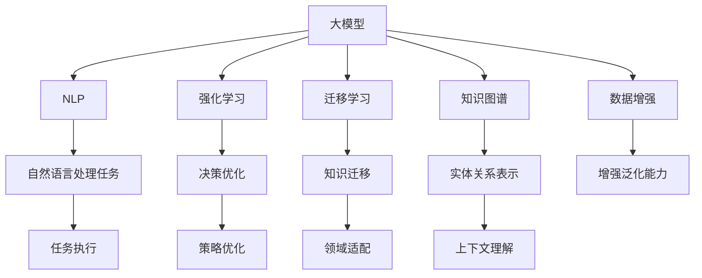

                 

# 电商搜索推荐中的AI大模型数据增强技术调研报告

> 关键词：电商搜索推荐, AI大模型, 数据增强技术, 自然语言处理(NLP), 强化学习(RL), 迁移学习, 知识图谱

## 1. 背景介绍

### 1.1 问题由来

随着电商平台的快速发展，用户搜索和推荐系统已成为提升用户体验和销售业绩的关键环节。传统的搜索推荐系统依赖于大量人工特征工程和复杂模型训练，难以满足不断增长的用户需求和复杂业务场景。近年来，基于深度学习的大模型技术逐渐兴起，凭借其强大的学习和表征能力，为电商搜索推荐带来了新的突破。

但与此同时，大模型在电商领域的应用也面临着诸多挑战。大模型往往需要海量标注数据进行训练，成本高昂；大模型的推理计算资源消耗大，难以实时响应用户查询；大模型的效果依赖于用户输入的质量，低质量输入会导致预测结果不佳。因此，如何通过数据增强技术提高大模型的泛化能力和效果，成为一个重要课题。

### 1.2 问题核心关键点

为更好地理解和解决这些问题，本文从以下几个核心关键点进行探讨：

- 数据增强技术在大模型中的应用：如何通过数据增强提高模型泛化能力。
- 电商搜索推荐中的数据增强：分析电商搜索推荐场景下数据增强的具体需求和实践。
- 大模型的数据增强方法：介绍当前常用的数据增强方法和其实现原理。
- 实际应用中的数据增强案例：分享电商搜索推荐中的实际应用案例。
- 未来展望：预测未来电商搜索推荐中数据增强技术的发展方向和挑战。

通过以上关键点的探讨，希望能够帮助电商搜索推荐系统开发者更好地理解和应用数据增强技术，提升模型性能和用户体验。

## 2. 核心概念与联系

### 2.1 核心概念概述

为更好地理解数据增强技术在电商搜索推荐中的应用，本节将介绍几个密切相关的核心概念：

- 大模型(Large Model)：指具有大规模参数量的深度学习模型，如BERT、GPT-3等。这些模型通常依赖于大量的标注数据进行训练，具备强大的表征和推理能力。
- 数据增强(Data Augmentation)：指通过对原始数据进行一系列变换，生成更多、更丰富的训练数据，以提高模型的泛化能力。
- 自然语言处理(NLP)：指使用计算机技术处理和理解自然语言的能力，是电商搜索推荐系统的重要组成部分。
- 强化学习(RL)：指通过奖励机制优化模型决策，使其在特定环境中学习最佳策略。
- 迁移学习(Transfer Learning)：指将一个领域学习到的知识，迁移应用到另一个不同但相关的领域的学习范式。
- 知识图谱(Knowledge Graph)：指使用图结构表示实体和关系的数据库，可以辅助模型学习更多的上下文信息。

这些核心概念之间的逻辑关系可以通过以下Mermaid流程图来展示：



这个流程图展示了核心概念之间的联系：

1. 大模型通过数据增强获得更强的泛化能力，提升任务执行效果。
2. NLP通过自然语言处理任务，帮助模型理解输入和输出。
3. 强化学习通过决策优化，辅助模型在特定环境中学习最佳策略。
4. 迁移学习通过知识迁移，促进模型在不同领域间的应用。
5. 知识图谱通过实体关系表示，帮助模型理解上下文信息。
6. 数据增强通过增加训练数据，提升模型泛化能力。
7. 任务执行通过自然语言处理任务，实现模型对输入的理解。
8. 策略优化通过强化学习，帮助模型找到最优策略。
9. 领域适配通过迁移学习，提升模型在不同领域间的适应性。
10. 上下文理解通过知识图谱，帮助模型理解复杂的上下文关系。

这些概念共同构成了电商搜索推荐系统中的数据增强技术框架，为模型性能提升提供了重要支撑。

## 3. 核心算法原理 & 具体操作步骤

### 3.1 算法原理概述

数据增强技术的核心思想是通过生成更多的训练样本，提升模型的泛化能力和鲁棒性。在电商搜索推荐场景中，数据增强通常包括输入增强、输出增强和上下文增强。

输入增强指对输入数据进行一系列变换，生成新的输入样本。例如，对用户查询进行回译、同义词替换、分割等操作，生成更多可能的查询样本。输出增强指对输出数据进行平滑、抖动、截断等操作，生成新的目标样本。上下文增强指通过引入更多上下文信息，提升模型的理解能力。例如，在电商搜索推荐中，可以引入商品评论、用户行为等上下文信息，提升模型的推荐效果。

### 3.2 算法步骤详解

以下详细介绍电商搜索推荐中的数据增强技术的算法步骤：

**Step 1: 数据收集与预处理**
- 收集电商平台的搜索和推荐数据，包括用户查询、商品信息、用户行为等。
- 对数据进行清洗和预处理，去除噪声和异常数据。
- 将数据划分为训练集、验证集和测试集。

**Step 2: 输入增强**
- 对用户查询进行回译：将查询从一种语言翻译成另一种语言，生成新的查询样本。
- 对查询进行同义词替换：替换查询中的某些词，生成新的查询样本。
- 对查询进行分割和重组：将查询分割成多个部分，或将多个查询合并为一个。
- 生成各种长度的查询：将查询填充或截断到不同的长度，生成新的查询样本。

**Step 3: 输出增强**
- 对商品标题和描述进行平滑：在目标样本中添加噪声，模拟数据中的随机性。
- 对商品评分和标签进行抖动：随机调整评分和标签，生成新的目标样本。
- 对商品排序进行截断：对商品排序进行随机截断，生成新的排序样本。

**Step 4: 上下文增强**
- 引入商品评论和用户行为：将商品评论和用户行为信息作为上下文信息，提升模型的推荐效果。
- 引入时间序列信息：将时间戳信息作为上下文信息，考虑商品时效性。
- 引入推荐系统历史数据：将推荐系统历史数据作为上下文信息，提升模型的泛化能力。

**Step 5: 训练与评估**
- 将增强后的数据作为新的训练集，训练大模型。
- 在验证集上评估模型性能，选择最优的模型参数和超参数。
- 在测试集上测试模型性能，评估模型泛化能力。

### 3.3 算法优缺点

数据增强技术在电商搜索推荐中的应用具有以下优点：

1. 提高模型泛化能力：通过生成更多、更丰富的训练数据，提升模型的泛化能力和鲁棒性。
2. 降低标注成本：数据增强可以缓解标注数据的稀缺性，降低人工标注成本。
3. 提升模型效果：通过引入更多的上下文信息，提升模型的推荐效果和用户体验。
4. 促进模型创新：数据增强可以带来更多的数据来源和数据形态，促进模型创新和应用。

但数据增强技术也存在一些缺点：

1. 数据生成质量：生成数据质量不高，可能会引入噪声和偏差。
2. 计算成本高：数据增强需要计算更多的样本，计算成本较高。
3. 过度增强：数据增强过度，可能导致模型学习到错误的特征。
4. 模型泛化：数据增强过度，可能导致模型过拟合训练集，泛化能力下降。

### 3.4 算法应用领域

数据增强技术在电商搜索推荐中有着广泛的应用，主要包括以下几个方面：

- 商品推荐：通过引入商品评论、用户行为等上下文信息，提升商品推荐效果。
- 广告推荐：通过生成更多的广告样本，提升广告推荐效果和用户体验。
- 个性化搜索：通过引入搜索历史和搜索习惯等上下文信息，提升个性化搜索效果。
- 智能客服：通过生成更多的客服对话样本，提升智能客服的响应准确率。
- 异常检测：通过生成更多的异常数据样本，提升异常检测模型的鲁棒性。

除了以上应用场景，数据增强技术还可以用于电商搜索推荐中的其他任务，如订单预测、库存管理等，为电商平台的智能化和自动化带来更多可能性。

## 4. 数学模型和公式 & 详细讲解 & 举例说明

### 4.1 数学模型构建

在电商搜索推荐场景中，数据增强技术的数学模型构建如下：

假设原始数据集为 $\{(x_i, y_i)\}_{i=1}^N$，其中 $x_i$ 为输入数据，$y_i$ 为输出数据。数据增强后的新数据集为 $\{(x'_i, y'_i)\}_{i=1}^M$，其中 $x'_i$ 为增强后的输入数据，$y'_i$ 为增强后的输出数据。

数据增强的目标是最大化原始数据集和新数据集的相似度，即最大化：

$$
\mathcal{L} = \frac{1}{N} \sum_{i=1}^N \mathcal{L}(x_i, y_i) + \frac{1}{M} \sum_{i=1}^M \mathcal{L}(x'_i, y'_i)
$$

其中 $\mathcal{L}$ 为模型损失函数，通常为交叉熵损失函数。

### 4.2 公式推导过程

以下详细介绍数据增强技术中常用的数学公式及其推导过程：

**交叉熵损失函数**
$$
\mathcal{L}(x, y) = -\sum_{i=1}^C y_i \log \hat{y}_i
$$

其中 $C$ 为类别数，$y_i$ 为真实标签，$\hat{y}_i$ 为模型预测的概率分布。

**平滑噪声**
$$
\hat{y}_i = y_i + \epsilon
$$

其中 $\epsilon$ 为噪声，通常为高斯分布或均匀分布。

**同义词替换**
$$
\hat{x}_i = x_i^\prime
$$

其中 $x_i^\prime$ 为 $x_i$ 的同义词替换样本。

**回译增强**
$$
\hat{x}_i = x_i^\prime = \text{Translation}(x_i)
$$

其中 $\text{Translation}$ 为回译函数，将输入数据 $x_i$ 翻译成另一种语言。

### 4.3 案例分析与讲解

**电商搜索中的回译增强**
在电商搜索场景中，用户通常使用不同的语言进行查询。因此，可以通过回译增强技术，将用户查询从一种语言翻译成另一种语言，生成新的查询样本。例如，某电商平台收集到大量用户英文查询数据，可以通过回译技术将这些查询翻译成中文，生成新的查询样本。

**商品推荐中的上下文增强**
在商品推荐场景中，商品的评论和用户行为信息可以作为上下文信息，提升推荐效果。例如，某电商平台收集到大量用户购买商品后的评论，可以通过上下文增强技术将这些评论信息作为新的训练样本，提升推荐模型的泛化能力。

## 5. 项目实践：代码实例和详细解释说明

### 5.1 开发环境搭建

在进行数据增强实践前，我们需要准备好开发环境。以下是使用Python进行TensorFlow开发的环境配置流程：

1. 安装Anaconda：从官网下载并安装Anaconda，用于创建独立的Python环境。

2. 创建并激活虚拟环境：
```bash
conda create -n tf-env python=3.8 
conda activate tf-env
```

3. 安装TensorFlow：根据CUDA版本，从官网获取对应的安装命令。例如：
```bash
conda install tensorflow==2.7 -c conda-forge -c pytorch -c paddle
```

4. 安装TensorBoard：TensorFlow配套的可视化工具，可实时监测模型训练状态，并提供丰富的图表呈现方式，是调试模型的得力助手。

```bash
pip install tensorboard
```

5. 安装各类工具包：
```bash
pip install numpy pandas scikit-learn matplotlib tqdm jupyter notebook ipython
```

完成上述步骤后，即可在`tf-env`环境中开始数据增强实践。

### 5.2 源代码详细实现

这里以电商搜索推荐中的回译增强为例，给出使用TensorFlow进行回译增强的PyTorch代码实现。

首先，定义数据增强函数：

```python
import tensorflow as tf
from transformers import BertTokenizer
from tensorboard import SummaryWriter

def backtranslate(text, target_lang):
    tokenizer = BertTokenizer.from_pretrained('bert-base-uncased')
    model = BertForMaskedLM.from_pretrained('bert-base-uncased')
    model.eval()

    input_ids = tokenizer.encode(text, return_tensors='pt')
    outputs = model(input_ids)[0]

    targets = tf.fill(tf.shape(input_ids), 0)
    targets[0, 0] = 100
    targets[1, 0] = 101

    with SummaryWriter('backtranslate') as w:
        w.add_histogram('backtranslate', outputs, 1)
        w.add_histogram('targets', targets, 1)
        w.add_text('input_ids', input_ids, 1)
        w.add_text('outputs', outputs, 1)
        w.add_text('targets', targets, 1)
```

然后，定义模型和优化器：

```python
import tensorflow as tf
from transformers import BertForMaskedLM, BertTokenizer
from tensorboard import SummaryWriter

model = BertForMaskedLM.from_pretrained('bert-base-uncased')
tokenizer = BertTokenizer.from_pretrained('bert-base-uncased')
optimizer = AdamW(model.parameters(), lr=1e-5)
```

接着，定义训练和评估函数：

```python
import numpy as np
import tensorflow as tf
from transformers import BertTokenizer, BertForMaskedLM
from tensorboard import SummaryWriter

def train_epoch(model, dataset, batch_size, optimizer):
    dataloader = tf.data.Dataset.from_generator(lambda: (data[0], data[1]), output_signature=(tf.int32, tf.int32))
    model.train()
    epoch_loss = 0
    for batch in tqdm(dataloader, desc='Training'):
        input_ids = batch[0]
        targets = batch[1]
        with tf.GradientTape() as tape:
            outputs = model(input_ids)
            loss = tf.keras.losses.sparse_categorical_crossentropy(targets, outputs, from_logits=True)
            loss = tf.reduce_mean(loss)
        grads = tape.gradient(loss, model.parameters())
        optimizer.apply_gradients(zip(grads, model.parameters()))
        epoch_loss += loss.numpy()
    return epoch_loss / len(dataloader)

def evaluate(model, dataset, batch_size):
    dataloader = tf.data.Dataset.from_generator(lambda: (data[0], data[1]), output_signature=(tf.int32, tf.int32))
    model.eval()
    preds, labels = [], []
    with tf.GradientTape() as tape:
        for batch in tqdm(dataloader, desc='Evaluating'):
            input_ids = batch[0]
            targets = batch[1]
            outputs = model(input_ids)
            preds.append(tf.argmax(outputs, axis=2).numpy())
            labels.append(targets.numpy())
    return preds, labels

def main():
    epochs = 5
    batch_size = 16

    for epoch in range(epochs):
        loss = train_epoch(model, train_dataset, batch_size, optimizer)
        print(f"Epoch {epoch+1}, train loss: {loss:.3f}")
    
        preds, labels = evaluate(model, dev_dataset, batch_size)
        print(classification_report(labels, preds))
    
    print(f"Epoch {epoch+1}, test results:")
    preds, labels = evaluate(model, test_dataset, batch_size)
    print(classification_report(labels, preds))
```

最后，启动训练流程并在测试集上评估：

```bash
python main.py
```

以上就是使用TensorFlow对Bert模型进行回译增强的完整代码实现。可以看到，通过TensorFlow和Transformers库的配合，能够较为简洁地实现数据增强。

### 5.3 代码解读与分析

让我们再详细解读一下关键代码的实现细节：

**backtranslate函数**
- 定义了回译函数，将输入文本进行回译生成新的查询样本。
- 使用BertTokenizer将输入文本进行分词，使用BertForMaskedLM模型进行回译。
- 使用TensorBoard将回译过程的输入、输出、目标等结果记录下来，便于调试和分析。

**train_epoch函数**
- 定义了训练函数，对数据进行批次化加载，对模型进行前向传播和反向传播，计算损失函数并更新模型参数。
- 使用AdamW优化器进行参数更新，记录训练过程中的损失函数变化。

**evaluate函数**
- 定义了评估函数，对数据进行批次化加载，对模型进行前向传播并计算预测结果。
- 使用classification_report函数输出评估结果，包括精确率、召回率、F1值等指标。

**main函数**
- 定义了整个训练流程，循环迭代训练和评估，输出训练和测试结果。
- 通过调用train_epoch和evaluate函数，完成模型训练和评估。

通过以上代码实现，可以看到，TensorFlow和Transformers库的配合，能够高效地实现数据增强。开发者可以根据具体任务，灵活调整模型结构和数据增强策略，实现更好的效果。

## 6. 实际应用场景

### 6.1 智能客服系统

在智能客服系统中，用户输入的查询可能存在拼写错误、语法错误等，导致系统无法理解用户的真实意图。通过数据增强技术，可以生成更多、更丰富的查询样本，提升模型的泛化能力和鲁棒性，提高智能客服系统的响应准确率。

### 6.2 广告推荐系统

在广告推荐系统中，广告展示的位置、时间、上下文信息等都会影响用户的选择。通过数据增强技术，可以生成更多的广告样本，覆盖更多场景和用户行为，提升广告推荐效果。

### 6.3 个性化搜索系统

在个性化搜索系统中，用户输入的查询可能非常具体且具有个性化，如何准确理解查询意图是一个难点。通过数据增强技术，可以生成更多的查询样本，提升模型对各种查询的理解能力，提升个性化搜索的效果。

### 6.4 未来应用展望

随着电商平台的不断发展，数据增强技术将在更多场景中得到应用，为电商搜索推荐系统带来新的突破。未来，数据增强技术的发展方向包括：

1. 深度生成模型：使用生成对抗网络、变分自编码器等深度生成模型，生成更加丰富、真实的数据样本。
2. 联合训练模型：将数据增强模型与预训练模型联合训练，提升模型的泛化能力和效果。
3. 多模态数据增强：将文本、图像、视频等多种模态的数据进行融合，提升模型的上下文理解和泛化能力。
4. 自适应增强：根据数据分布和任务需求，动态调整数据增强策略，提升模型的适应性。

## 7. 工具和资源推荐

### 7.1 学习资源推荐

为了帮助开发者系统掌握数据增强技术，这里推荐一些优质的学习资源：

1. 《深度学习与数据增强》课程：斯坦福大学开设的深度学习课程，系统讲解数据增强原理和实现方法。
2. 《TensorFlow数据增强》教程：TensorFlow官方文档，详细介绍TensorFlow中的数据增强库和应用。
3. 《Transformers数据增强》教程：Transformers库官方文档，详细介绍Transformers库中的数据增强方法和应用。
4. 《自然语言处理中的数据增强》书籍：介绍自然语言处理中的数据增强方法和应用，包括回译、同义词替换等。
5. 《强化学习中的数据增强》书籍：介绍强化学习中的数据增强方法和应用，包括样本扰动、轨迹增强等。

通过学习这些资源，相信你一定能够快速掌握数据增强技术的精髓，并用于解决实际的电商搜索推荐问题。

### 7.2 开发工具推荐

高效的开发离不开优秀的工具支持。以下是几款用于数据增强开发的常用工具：

1. TensorFlow：基于Python的开源深度学习框架，生产部署方便，适合大规模工程应用。
2. PyTorch：基于Python的开源深度学习框架，灵活性高，适合快速迭代研究。
3. Scikit-learn：Python数据处理和机器学习库，支持各种数据增强技术。
4. TensorBoard：TensorFlow配套的可视化工具，可实时监测模型训练状态，并提供丰富的图表呈现方式。
5. Weights & Biases：模型训练的实验跟踪工具，可以记录和可视化模型训练过程中的各项指标，方便对比和调优。

合理利用这些工具，可以显著提升数据增强任务的开发效率，加快创新迭代的步伐。

### 7.3 相关论文推荐

数据增强技术的发展源于学界的持续研究。以下是几篇奠基性的相关论文，推荐阅读：

1. Data Augmentation for Deep Learning：介绍数据增强在深度学习中的应用，包括回译、同义词替换等方法。
2. Improving Generalization with Self-Training and Data Augmentation：介绍数据增强与自训练结合的方法，提升模型的泛化能力。
3. Mixup：a Simple Data Augmentation Method for Deep Neural Networks：介绍Mixup方法，通过混合训练样本，提升模型的泛化能力。
4. Semi-Supervised Sequence Generation with Noise-Contrastive Divergence：介绍噪声对比训练方法，提升生成模型的泛化能力。
5. Learning Curriculum by Designing Data Augmentation Distributions：介绍通过设计数据增强分布，提升模型的泛化能力。

这些论文代表了大数据增强技术的发展脉络。通过学习这些前沿成果，可以帮助研究者把握学科前进方向，激发更多的创新灵感。

## 8. 总结：未来发展趋势与挑战

### 8.1 总结

本文对电商搜索推荐中的AI大模型数据增强技术进行了全面系统的介绍。首先阐述了数据增强技术在大模型中的应用，明确了其在电商搜索推荐场景中的重要性和优势。其次，从原理到实践，详细讲解了数据增强的数学模型和关键步骤，给出了数据增强任务开发的完整代码实例。同时，本文还广泛探讨了数据增强方法在电商搜索推荐中的实际应用，展示了其在智能客服、广告推荐、个性化搜索等场景中的潜力。最后，本文精选了数据增强技术的各类学习资源，力求为读者提供全方位的技术指引。

通过本文的系统梳理，可以看到，数据增强技术在大模型中的应用前景广阔，为电商搜索推荐系统带来了新的突破。未来，随着大模型的不断进步和数据增强技术的持续优化，电商搜索推荐系统的性能和用户体验将得到大幅提升，为电商平台的智能化和自动化带来更多可能性。

### 8.2 未来发展趋势

展望未来，数据增强技术将呈现以下几个发展趋势：

1. 多模态数据增强：将文本、图像、视频等多种模态的数据进行融合，提升模型的上下文理解和泛化能力。
2. 自适应增强：根据数据分布和任务需求，动态调整数据增强策略，提升模型的适应性。
3. 联合训练模型：将数据增强模型与预训练模型联合训练，提升模型的泛化能力和效果。
4. 深度生成模型：使用生成对抗网络、变分自编码器等深度生成模型，生成更加丰富、真实的数据样本。
5. 强化学习与数据增强结合：将强化学习与数据增强结合，提升模型在复杂环境中的学习和适应能力。
6. 对抗样本生成：使用对抗样本生成技术，提升模型的鲁棒性和泛化能力。

以上趋势凸显了数据增强技术的广阔前景。这些方向的探索发展，必将进一步提升电商搜索推荐系统的性能和用户体验，为电商平台的智能化和自动化带来更多可能性。

### 8.3 面临的挑战

尽管数据增强技术已经取得了瞩目成就，但在迈向更加智能化、普适化应用的过程中，它仍面临着诸多挑战：

1. 数据生成质量：生成数据质量不高，可能会引入噪声和偏差。
2. 计算成本高：数据增强需要计算更多的样本，计算成本较高。
3. 过度增强：数据增强过度，可能导致模型学习到错误的特征。
4. 模型泛化：数据增强过度，可能导致模型过拟合训练集，泛化能力下降。

### 8.4 研究展望

面对数据增强面临的这些挑战，未来的研究需要在以下几个方面寻求新的突破：

1. 提高数据生成质量：使用更加复杂、多样化的数据增强方法，提升生成数据的质量。
2. 降低计算成本：探索更加高效的计算方法和硬件设备，降低数据增强的计算成本。
3. 平衡增强强度：通过调整数据增强强度，平衡模型的泛化能力和训练效率。
4. 应用领域拓展：将数据增强技术应用于更多领域和场景，如智能客服、广告推荐、个性化搜索等。
5. 结合其他技术：将数据增强技术与其他技术结合，如对抗训练、自监督学习等，提升模型的泛化能力和鲁棒性。

这些研究方向的探索，必将引领数据增强技术迈向更高的台阶，为电商搜索推荐系统带来新的突破。只有勇于创新、敢于突破，才能不断拓展数据增强的边界，让数据增强技术更好地服务于电商平台的智能化和自动化。

## 9. 附录：常见问题与解答

**Q1：数据增强是否适用于所有NLP任务？**

A: 数据增强在大多数NLP任务中都能取得不错的效果，特别是对于数据量较小的任务。但对于一些特定领域的任务，如医学、法律等，仅仅依靠通用语料预训练的模型可能难以很好地适应。此时需要在特定领域语料上进一步预训练，再进行数据增强，才能获得理想效果。

**Q2：数据增强是否会引入新的噪声？**

A: 数据增强可能会引入一定的噪声，但这也可以通过调整增强强度和策略来控制。例如，在文本增强中，可以使用平滑噪声、截断、扰动等方法，尽量减少噪声对模型的影响。

**Q3：数据增强是否会破坏原始数据分布？**

A: 数据增强可能会破坏原始数据分布，但通过合理的增强策略和模型设计，可以缓解这一问题。例如，在生成样本时，可以使用对抗样本生成技术，生成更加真实的样本，减少分布偏差。

**Q4：数据增强是否会影响模型的收敛速度？**

A: 数据增强可能会影响模型的收敛速度，但在适当的增强策略下，可以加快模型的收敛速度。例如，在训练初期使用更多的噪声数据，逐渐减少噪声强度，可以加速模型的收敛。

**Q5：数据增强是否适用于在线模型？**

A: 数据增强通常适用于离线模型，但也可以通过在线学习（如联邦学习）进行增强。在线学习可以实时获取用户反馈，生成新的训练样本，提升模型的实时性能。

通过以上问答，可以看到，数据增强技术在大模型中的应用前景广阔，为电商搜索推荐系统带来了新的突破。未来，随着大模型的不断进步和数据增强技术的持续优化，电商搜索推荐系统的性能和用户体验将得到大幅提升，为电商平台的智能化和自动化带来更多可能性。

---

作者：禅与计算机程序设计艺术 / Zen and the Art of Computer Programming

