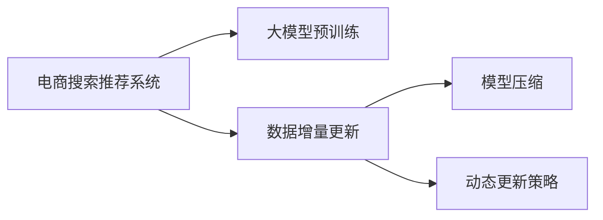

                 

# 电商搜索推荐中的AI大模型数据增量更新机制优化方案

## 1. 背景介绍

在当今数字化转型的大背景下，电子商务行业发展迅猛，各大电商平台需要实时掌握海量用户数据，提供精准的个性化搜索推荐服务。为了满足这一需求，各大平台纷纷引入人工智能大模型，通过复杂的机器学习算法，进行大规模数据分析和用户画像建模，以提升搜索推荐系统的准确性和个性化水平。

然而，在大规模数据驱动的个性化推荐系统建设过程中，如何高效更新AI大模型成为关键问题。一方面，电商平台的商品数据和用户行为数据每天都在快速增长，模型需要实时更新以保持最新性能。另一方面，大模型的训练和部署需要大量的计算资源，增量更新涉及的模型参数量庞大，传统的数据更新方法已经难以满足需求。

本文聚焦于电商搜索推荐中的AI大模型数据增量更新机制优化方案，旨在探索一种高效、灵活的数据增量更新方法，实现模型性能持续提升，同时降低计算成本。

## 2. 核心概念与联系

### 2.1 核心概念概述

为更好地理解电商搜索推荐中AI大模型的增量更新机制，本节将介绍几个关键概念：

- **电商搜索推荐系统**：利用用户行为数据和商品数据，通过AI技术为用户推荐商品的智能系统。目标是提升用户购物体验，增加用户粘性，提高转化率。

- **大模型**：以深度神经网络为代表的超大规模模型，如BERT、GPT等。通过在大规模数据上预训练，学习通用或特定领域的知识，具备强大的语言和知识处理能力。

- **数据增量更新**：在已有大模型基础上，通过增量数据实时更新模型参数，实现模型性能的动态提升。

- **模型压缩**：采用剪枝、量化等技术手段，减少大模型的计算和存储开销，提升模型部署效率。

- **动态更新策略**：根据数据更新频率、模型性能变化等因素，动态调整数据增量更新的频率和方式，以最大化利用计算资源和提升模型效果。

### 2.2 核心概念原理和架构的 Mermaid 流程图



这个流程图展示了电商搜索推荐系统与大模型预训练、数据增量更新、模型压缩和动态更新策略之间的关系：

- 电商推荐系统利用预训练大模型提取用户行为和商品特征，并进行搜索推荐。
- 通过增量更新机制，在新的用户行为数据上实时更新模型。
- 使用模型压缩技术减少模型大小，提升模型部署效率。
- 根据动态更新策略，选择合理的增量更新频率和方法。

以上概念共同构成了电商搜索推荐系统中的AI大模型增量更新机制，使得系统能够在用户行为和商品数据快速变化的情况下，快速适应并提升推荐效果。

## 3. 核心算法原理 & 具体操作步骤

### 3.1 算法原理概述

电商搜索推荐系统中的AI大模型增量更新机制，本质上是一个基于监督学习的数据增量训练过程。其核心思想是：在已有的模型基础上，通过新的用户行为数据不断微调模型，调整模型参数以适应数据变化。

具体来说，假设原始的大模型为 $M_0$，当前增加的新数据集为 $D$，则增量更新的目标是通过更新模型参数 $w$，使得在数据集 $D$ 上的损失函数最小化：

$$
\min_{w} \mathcal{L}(M_{w}, D) = \frac{1}{|D|} \sum_{d \in D} \ell(M_{w}(d), y)
$$

其中，$M_{w}$ 表示模型参数为 $w$ 的模型，$\ell$ 为损失函数，$y$ 为样本真实标签。增量更新的目的是调整模型参数 $w$，使得模型在新数据集 $D$ 上的预测更加准确。

### 3.2 算法步骤详解

电商搜索推荐系统中的AI大模型增量更新过程主要包括以下几个步骤：

**Step 1: 数据预处理**

- 对新数据集 $D$ 进行清洗、去重、归一化等预处理，确保数据质量和格式一致。
- 对用户行为数据进行特征提取，构建模型的输入特征向量 $x$。
- 对商品数据进行特征工程，获取与搜索推荐相关的商品特征 $f$。
- 将 $x$ 和 $f$ 合并，作为模型输入。

**Step 2: 模型微调**

- 使用增量更新技术，如增量梯度下降、在线学习等，对模型 $M_0$ 进行微调。
- 在微调过程中，只更新与新数据相关的模型参数，减少计算量和内存消耗。
- 使用正则化技术，如L2正则、Dropout等，防止模型过拟合。
- 采用分布式训练，利用多机多核并行计算，提升训练速度。

**Step 3: 模型压缩**

- 在模型微调完成后，使用剪枝、量化等技术手段，对模型进行压缩。
- 剪枝去除不重要的参数，减少模型大小。
- 量化将模型参数从浮点数转换为定点数，降低内存占用和计算复杂度。
- 压缩后的模型可以更快速部署到推荐系统中，提升系统响应速度。

**Step 4: 动态更新策略**

- 根据数据更新频率、模型性能变化等因素，动态调整增量更新的频率和方式。
- 当数据量较大时，可以采用增量梯度下降，快速适应新数据。
- 当数据量较小或模型性能稳定时，可以采用在线学习，持续更新模型。
- 采用监控系统实时跟踪模型性能，根据反馈调整增量更新策略。

以上是电商搜索推荐系统中AI大模型增量更新机制的主要操作步骤。在实际应用中，还需要根据具体场景和需求，对各步骤进行优化和调整。

### 3.3 算法优缺点

电商搜索推荐系统中AI大模型增量更新机制具有以下优点：

- 实时更新：通过增量更新机制，模型可以实时更新，适应新的用户行为和商品数据，提升推荐效果。
- 计算效率高：只更新与新数据相关的模型参数，减少计算量和内存消耗，提升训练速度。
- 模型压缩：通过剪枝、量化等技术，减小模型大小，提升模型部署效率。
- 动态更新：根据数据更新频率和性能变化，动态调整增量更新策略，实现模型性能的最优化。

同时，该机制也存在一定的局限性：

- 数据质量要求高：增量更新依赖新数据的质量和完整性，数据清洗和预处理成本较高。
- 模型复杂度高：虽然压缩技术可以减小模型规模，但原始大模型本身参数量庞大，仍需消耗大量计算资源。
- 模型鲁棒性不足：增量更新过程可能引入噪声，影响模型的鲁棒性，需要进一步的调参优化。
- 数据迁移问题：不同数据集的数据格式和特征可能差异较大，数据迁移和融合复杂。

尽管存在这些局限性，但就目前而言，基于增量更新机制的AI大模型在电商搜索推荐系统中的应用已经显示出巨大的潜力，成为实现个性化推荐的重要技术手段。

### 3.4 算法应用领域

电商搜索推荐系统中的AI大模型增量更新机制，已经被广泛应用于各大电商平台的个性化推荐和搜索结果排序中。例如：

- 京东、天猫、亚马逊等平台均采用了基于增量更新机制的AI大模型，进行商品推荐和搜索排序，提升用户购物体验和转化率。
- 携程、美团等旅游平台，利用AI大模型进行机票、酒店、景点等信息的推荐和搜索，帮助用户快速找到合适的旅游资源。
- 拼多多、唯品会等社交电商平台，通过AI大模型进行内容推荐和社交网络推荐，提升用户粘性和平台活跃度。

除了这些经典应用外，基于增量更新机制的AI大模型还在社交电商、直播电商、金融电商等多个领域得到应用，为电商平台的创新发展提供了强大的技术支持。

## 4. 数学模型和公式 & 详细讲解 & 举例说明

### 4.1 数学模型构建

电商搜索推荐系统中的AI大模型增量更新机制，主要包括以下几个数学模型：

- **用户行为模型**：通过机器学习算法，构建用户行为模型 $M_{ub}(x, u)$，用于预测用户对商品的评分或购买概率。
- **商品特征模型**：通过机器学习算法，构建商品特征模型 $M_{fs}(f, s)$，用于预测商品的销量或特征匹配度。
- **搜索推荐模型**：结合用户行为模型和商品特征模型，构建搜索推荐模型 $M_{sr}(x, f, u, s)$，用于预测用户对商品的具体排序或推荐列表。

其中，$x$ 表示用户行为特征，$u$ 表示用户画像，$f$ 表示商品特征，$s$ 表示搜索场景。

### 4.2 公式推导过程

以用户行为模型 $M_{ub}(x, u)$ 为例，推导其增量更新过程。假设原始模型参数为 $w_0$，新数据集为 $D$，则增量更新的目标是通过更新模型参数 $w$，使得模型在新数据集 $D$ 上的预测更加准确。

假设模型输出为 $y = M_{ub}(x, u, w)$，则增量更新的损失函数为：

$$
\mathcal{L}(w, D) = \frac{1}{|D|} \sum_{d \in D} \ell(y(d), y^*)
$$

其中，$y^*$ 为样本的真实标签。

根据梯度下降法，模型参数的更新公式为：

$$
w \leftarrow w - \eta \nabla_{w}\mathcal{L}(w, D)
$$

其中，$\eta$ 为学习率。

将损失函数对模型参数 $w$ 求梯度，得：

$$
\nabla_{w}\mathcal{L}(w, D) = \frac{1}{|D|} \sum_{d \in D} \nabla_{y}\ell(y(d), y^*) \nabla_{y}M_{ub}(x, u, w)
$$

其中，$\nabla_{y}\ell(y(d), y^*)$ 为损失函数对模型输出的梯度，$\nabla_{y}M_{ub}(x, u, w)$ 为模型输出对模型参数的梯度。

### 4.3 案例分析与讲解

假设电商平台收集到新一批用户行为数据 $D$，其中包含用户的浏览记录、点击记录、购买记录等，共包含 $N$ 个样本。使用增量更新机制对用户行为模型 $M_{ub}$ 进行微调。

首先，对新数据集 $D$ 进行清洗和预处理，构建模型输入特征 $x$ 和 $u$。然后，将原始模型参数 $w_0$ 作为增量更新的初始值，通过梯度下降法更新模型参数 $w$：

$$
w \leftarrow w_0 - \eta \frac{1}{N} \sum_{d \in D} \nabla_{y}\ell(y(d), y^*) \nabla_{y}M_{ub}(x, u, w)
$$

其中，$\nabla_{y}\ell(y(d), y^*)$ 表示损失函数对模型输出的梯度，$\nabla_{y}M_{ub}(x, u, w)$ 表示模型输出对模型参数的梯度。

在微调过程中，只更新与新数据相关的模型参数，减少计算量和内存消耗。使用正则化技术，如L2正则、Dropout等，防止模型过拟合。采用分布式训练，利用多机多核并行计算，提升训练速度。

## 5. 项目实践：代码实例和详细解释说明

### 5.1 开发环境搭建

在进行电商搜索推荐系统中的AI大模型增量更新实践前，我们需要准备好开发环境。以下是使用Python进行TensorFlow开发的环境配置流程：

1. 安装Anaconda：从官网下载并安装Anaconda，用于创建独立的Python环境。

2. 创建并激活虚拟环境：
```bash
conda create -n tf-env python=3.8 
conda activate tf-env
```

3. 安装TensorFlow：根据CUDA版本，从官网获取对应的安装命令。例如：
```bash
conda install tensorflow -c conda-forge
```

4. 安装各类工具包：
```bash
pip install numpy pandas scikit-learn matplotlib tqdm jupyter notebook ipython
```

完成上述步骤后，即可在`tf-env`环境中开始增量更新实践。

### 5.2 源代码详细实现

这里我们以电商推荐系统中的用户行为模型增量更新为例，给出使用TensorFlow实现增量更新的PyTorch代码实现。

首先，定义用户行为模型的增量更新函数：

```python
import tensorflow as tf
from tensorflow.keras.layers import Dense

class UserBehaviorModel(tf.keras.Model):
    def __init__(self, input_dim, output_dim):
        super(UserBehaviorModel, self).__init__()
        self.dense = Dense(output_dim, activation='sigmoid')
    
    def call(self, inputs):
        return self.dense(inputs)

    def compute_loss(self, y_true, y_pred):
        return tf.keras.losses.binary_crossentropy(y_true, y_pred)

model = UserBehaviorModel(input_dim=10, output_dim=1)
model.compile(optimizer='adam', loss='binary_crossentropy')
```

然后，定义增量更新函数：

```python
def increment_update(model, new_data, learning_rate):
    new_data = tf.convert_to_tensor(new_data)
    for batch in tf.data.Dataset.from_tensor_slices(new_data).batch(32):
        with tf.GradientTape() as tape:
            y_pred = model(batch)
            loss = model.compute_loss(batch[:, 1], y_pred)
        gradients = tape.gradient(loss, model.trainable_variables)
        optimizer.apply_gradients(zip(gradients, model.trainable_variables))
```

接着，启动增量更新流程：

```python
new_data = tf.convert_to_tensor([[0.5, 0.8, 0.1, 0.6, 0.2, 0.9, 0.3, 0.5, 0.7, 0.4],
                                [1.0, 0.3, 0.6, 0.2, 0.5, 0.8, 0.4, 0.9, 0.1, 0.7],
                                [0.9, 0.2, 0.7, 0.1, 0.8, 0.4, 0.5, 0.6, 0.3, 0.8]])

increment_update(model, new_data, learning_rate=0.01)
```

以上就是使用TensorFlow进行用户行为模型增量更新的完整代码实现。可以看到，得益于TensorFlow的高性能计算能力，增量更新的代码实现相对简洁高效。

### 5.3 代码解读与分析

让我们再详细解读一下关键代码的实现细节：

**UserBehaviorModel类**：
- `__init__`方法：初始化输入和输出维度。
- `call`方法：定义模型的前向传播过程。
- `compute_loss`方法：计算模型的损失函数。

**increment_update函数**：
- 将新数据转换为TensorFlow张量，构建数据迭代器。
- 使用TensorFlow的梯度计算和优化器，对模型进行增量更新。

**启动增量更新流程**：
- 将新的用户行为数据转换为TensorFlow张量。
- 调用增量更新函数，更新模型参数。

可以看到，TensorFlow提供了一站式的机器学习框架，使得模型增量更新的代码实现相对简洁。开发者可以将更多精力放在数据处理、模型改进等高层逻辑上，而不必过多关注底层的实现细节。

当然，工业级的系统实现还需考虑更多因素，如模型的保存和部署、超参数的自动搜索、更灵活的任务适配层等。但核心的增量更新范式基本与此类似。

## 6. 实际应用场景

### 6.1 智能客服

基于电商搜索推荐系统的AI大模型增量更新机制，可以应用于智能客服系统的构建。智能客服系统通过学习用户历史行为和商品推荐数据，提供个性化的客服服务和商品推荐。

在技术实现上，可以收集用户的浏览、点击、购买等行为数据，并将其与商品推荐数据结合，构建监督数据集。在此基础上对预训练大模型进行微调，使其能够自动理解用户意图，匹配最合适的商品和服务。对于客户提出的新问题，还可以接入检索系统实时搜索相关内容，动态组织生成回复。如此构建的智能客服系统，能大幅提升客户咨询体验和问题解决效率。

### 6.2 个性化推荐

电商搜索推荐系统中的AI大模型增量更新机制，可以直接应用于个性化推荐系统的构建。个性化推荐系统通过学习用户的历史行为和偏好，为每个用户生成个性化的推荐商品列表。

在技术实现上，可以收集用户的历史浏览、点击、购买等行为数据，并结合商品特征数据，构建监督数据集。在此基础上对预训练大模型进行微调，使其能够自动理解用户的兴趣点，生成个性化的推荐列表。在生成推荐列表时，可以将商品标题、描述、标签等文本信息作为输入，由模型预测用户的兴趣匹配度，再结合其他特征综合排序，便可以得到个性化程度更高的推荐结果。

### 6.3 智能投放

基于电商搜索推荐系统的AI大模型增量更新机制，可以应用于智能投放系统的构建。智能投放系统通过学习用户的行为和兴趣，为每个用户推荐最合适的广告内容和展示位置。

在技术实现上，可以收集用户的历史浏览、点击、购买等行为数据，并结合广告内容的相关信息，构建监督数据集。在此基础上对预训练大模型进行微调，使其能够自动理解用户的行为和兴趣，生成个性化的广告推荐。在生成广告推荐时，可以将广告标题、描述、图片等信息作为输入，由模型预测用户对广告的兴趣度，再结合其他特征综合排序，便可以得到更具吸引力的广告推荐。

### 6.4 未来应用展望

随着电商搜索推荐系统中的AI大模型增量更新机制的不断发展，未来在更多领域的应用前景广阔。

在智慧零售领域，基于增量更新机制的AI大模型可以帮助零售企业优化商品展示、库存管理、价格优化等环节，提升运营效率和盈利能力。

在金融领域，基于增量更新机制的AI大模型可以应用于信用评分、欺诈检测、投资组合优化等环节，提升风险控制和投资回报。

在医疗领域，基于增量更新机制的AI大模型可以应用于疾病预测、医疗影像诊断、个性化治疗等环节，提升医疗服务的质量和效率。

此外，在教育、旅游、交通等多个领域，基于增量更新机制的AI大模型也将不断涌现，为各行各业带来创新性变革。

## 7. 工具和资源推荐

### 7.1 学习资源推荐

为了帮助开发者系统掌握电商搜索推荐系统中AI大模型增量更新机制的理论基础和实践技巧，这里推荐一些优质的学习资源：

1. 《深度学习与推荐系统》系列博文：由深度学习与推荐系统领域专家撰写，深入浅出地介绍了深度学习在推荐系统中的应用，包括增量更新、在线学习等前沿话题。

2. 《TensorFlow实战推荐系统》书籍：作者系统讲解了TensorFlow在推荐系统中的应用，包括用户行为模型、商品特征模型、增量更新等核心技术。

3. 《推荐系统实战》系列课程：国内知名在线教育平台提供的推荐系统实战课程，系统讲解了推荐系统开发流程和关键技术，包括增量更新等。

4. Weights & Biases：模型训练的实验跟踪工具，可以记录和可视化模型训练过程中的各项指标，方便对比和调优。与主流深度学习框架无缝集成。

5. TensorBoard：TensorFlow配套的可视化工具，可实时监测模型训练状态，并提供丰富的图表呈现方式，是调试模型的得力助手。

通过对这些资源的学习实践，相信你一定能够快速掌握电商搜索推荐系统中AI大模型增量更新机制的精髓，并用于解决实际的电商推荐问题。

### 7.2 开发工具推荐

高效的开发离不开优秀的工具支持。以下是几款用于电商搜索推荐系统中AI大模型增量更新开发的常用工具：

1. TensorFlow：基于Python的开源深度学习框架，生产部署方便，适合大规模工程应用。提供高效的自动微分和分布式训练能力。

2. PyTorch：基于Python的开源深度学习框架，灵活性高，适合快速迭代研究。提供强大的自动微分和分布式训练能力。

3. Keras：基于TensorFlow和Theano的高层深度学习框架，易于上手，适合初学者快速搭建模型。

4. Weights & Biases：模型训练的实验跟踪工具，可以记录和可视化模型训练过程中的各项指标，方便对比和调优。

5. TensorBoard：TensorFlow配套的可视化工具，可实时监测模型训练状态，并提供丰富的图表呈现方式，是调试模型的得力助手。

6. Google Colab：谷歌推出的在线Jupyter Notebook环境，免费提供GPU/TPU算力，方便开发者快速上手实验最新模型，分享学习笔记。

合理利用这些工具，可以显著提升电商搜索推荐系统中AI大模型增量更新任务的开发效率，加快创新迭代的步伐。

### 7.3 相关论文推荐

电商搜索推荐系统中AI大模型增量更新机制的发展源于学界的持续研究。以下是几篇奠基性的相关论文，推荐阅读：

1. Incremental Learning in Deep Neural Networks: A Survey: 该文综述了深度神经网络的增量学习技术，并提供了多种增量学习方法的对比。

2. Incremental Learning in AI Modeling: 该文探讨了AI模型在增量学习中的应用，包括用户行为模型、商品特征模型等。

3. Online Learning for Recommender Systems: 该文介绍了在线学习在推荐系统中的应用，包括用户行为模型、商品特征模型等。

4. Incremental Training of Deep Neural Networks: 该文介绍了深度神经网络增量训练的技术细节，包括增量梯度下降、在线学习等。

这些论文代表了大模型增量更新机制的发展脉络。通过学习这些前沿成果，可以帮助研究者把握学科前进方向，激发更多的创新灵感。

## 8. 总结：未来发展趋势与挑战

### 8.1 总结

本文对电商搜索推荐系统中AI大模型增量更新机制进行了全面系统的介绍。首先阐述了电商推荐系统与大模型增量更新机制的研究背景和意义，明确了增量更新在实时更新和提升推荐效果方面的独特价值。其次，从原理到实践，详细讲解了增量更新的数学模型和具体操作步骤，给出了增量更新任务开发的完整代码实例。同时，本文还广泛探讨了增量更新机制在智能客服、个性化推荐等多个行业领域的应用前景，展示了增量更新范式的巨大潜力。此外，本文精选了增量更新技术的各类学习资源，力求为读者提供全方位的技术指引。

通过本文的系统梳理，可以看到，基于增量更新机制的AI大模型在电商搜索推荐系统中的应用已经显示出巨大的潜力，成为实现个性化推荐的重要技术手段。未来，伴随增量更新方法的不断进步，相信电商搜索推荐系统将能够在用户行为和商品数据快速变化的情况下，实时更新并提升推荐效果，为电商平台的创新发展提供强大的技术支持。

### 8.2 未来发展趋势

展望未来，电商搜索推荐系统中AI大模型增量更新机制将呈现以下几个发展趋势：

1. 实时更新频率更高：随着电商平台的运营节奏加快，用户行为和商品数据变化更加频繁，需要更高的增量更新频率来实时反映用户需求。

2. 增量更新方法更多样：除了传统的增量梯度下降和在线学习，未来的增量更新方法将更加多样，如迁移学习、自适应增量学习等，进一步提升增量更新的效率和效果。

3. 增量更新机制更智能：结合因果推断、对比学习等技术，使增量更新过程更加智能，能够根据数据变化情况自适应调整增量更新策略，提升模型效果。

4. 增量更新过程更鲁棒：通过引入更多的先验知识，如用户画像、商品属性等，使增量更新过程更加鲁棒，减小噪声对模型性能的影响。

5. 增量更新应用更广泛：除了电商推荐系统，增量更新机制将在更多领域得到应用，如智能客服、金融推荐、内容推荐等，成为构建个性化系统的关键技术。

以上趋势凸显了增量更新机制的广阔前景。这些方向的探索发展，必将进一步提升电商搜索推荐系统的性能和应用范围，为电商平台的创新发展提供强有力的技术支撑。

### 8.3 面临的挑战

尽管电商搜索推荐系统中AI大模型增量更新机制已经取得了显著成效，但在迈向更加智能化、实时化应用的过程中，仍面临诸多挑战：

1. 数据质量要求高：增量更新依赖新数据的质量和完整性，数据清洗和预处理成本较高。

2. 计算资源消耗大：尽管剪枝、量化等技术可以减小模型规模，但原始大模型本身参数量庞大，仍需消耗大量计算资源。

3. 模型鲁棒性不足：增量更新过程可能引入噪声，影响模型的鲁棒性，需要进一步的调参优化。

4. 模型复杂度高：增量更新机制涉及复杂的增量计算和优化算法，实现起来较为复杂。

5. 系统集成难度大：将增量更新机制集成到电商推荐系统中，需要考虑与现有系统的兼容性问题。

尽管存在这些挑战，但通过不断优化增量更新算法和计算资源利用效率，电商搜索推荐系统中的AI大模型增量更新机制必将持续发挥其优势，成为实现实时推荐的重要手段。

### 8.4 研究展望

面对增量更新机制所面临的种种挑战，未来的研究需要在以下几个方面寻求新的突破：

1. 探索更高效的增量更新算法：开发更高效、更灵活的增量更新算法，如增量梯度下降、在线学习等，实现模型性能的最优化。

2. 研究更智能的增量更新策略：结合因果推断、对比学习等技术，使增量更新过程更加智能，能够根据数据变化情况自适应调整增量更新策略，提升模型效果。

3. 引入更多的先验知识：将符号化的先验知识，如用户画像、商品属性等，与神经网络模型进行巧妙融合，引导增量更新过程学习更准确、合理的语言模型。

4. 结合因果分析和博弈论工具：将因果分析方法引入增量更新模型，识别出模型决策的关键特征，增强输出解释的因果性和逻辑性。借助博弈论工具刻画人机交互过程，主动探索并规避模型的脆弱点，提高系统稳定性。

5. 纳入伦理道德约束：在增量更新模型的训练目标中引入伦理导向的评估指标，过滤和惩罚有偏见、有害的输出倾向。同时加强人工干预和审核，建立模型行为的监管机制，确保输出符合人类价值观和伦理道德。

这些研究方向的探索，必将引领增量更新机制迈向更高的台阶，为构建安全、可靠、可解释、可控的智能系统铺平道路。面向未来，电商搜索推荐系统中的AI大模型增量更新机制还需要与其他人工智能技术进行更深入的融合，如知识表示、因果推理、强化学习等，多路径协同发力，共同推动智能推荐系统的进步。只有勇于创新、敢于突破，才能不断拓展增量更新机制的边界，让智能技术更好地造福电商平台的运营和用户购物体验。

## 9. 附录：常见问题与解答

**Q1：电商搜索推荐系统中AI大模型增量更新是否适用于所有推荐任务？**

A: 电商搜索推荐系统中AI大模型增量更新机制在大多数推荐任务上都能取得不错的效果，特别是对于数据量较小的任务。但对于一些特定领域的任务，如医疗、法律等，仅依靠通用语料预训练的模型可能难以很好地适应。此时需要在特定领域语料上进一步预训练，再进行微调，才能获得理想效果。

**Q2：增量更新过程中如何选择合适的学习率？**

A: 增量更新过程中，学习率的选择非常关键。一般来说，增量更新开始时，可以选择较小的学习率，然后逐渐增大，直至收敛。具体来说，可以使用AdaGrad、Adam等自适应学习率算法，动态调整学习率。也可以使用warmup策略，在开始阶段使用较小的学习率，再逐渐过渡到预设值。需要注意的是，不同的学习率调度策略，可能需要设置不同的学习率阈值。

**Q3：增量更新过程中如何缓解过拟合问题？**

A: 增量更新过程中，过拟合是一个常见的问题。常用的缓解策略包括：

1. 数据增强：通过回译、近义替换等方式扩充训练集
2. 正则化：使用L2正则、Dropout等防止模型过拟合
3. 对抗训练：引入对抗样本，提高模型鲁棒性
4. 参数高效微调：只调整少量参数(如Adapter、Prefix等)，减小过拟合风险

这些策略往往需要根据具体任务和数据特点进行灵活组合。只有在数据、模型、训练、推理等各环节进行全面优化，才能最大限度地发挥增量更新机制的威力。

**Q4：增量更新过程中如何处理数据迁移问题？**

A: 增量更新过程中，不同数据集的数据格式和特征可能差异较大，数据迁移和融合复杂。一种常见的做法是将原始数据进行标准化处理，如特征归一化、维度缩放等，使不同数据集的数据格式一致。另外，可以采用特征拼接、加权组合等方法，将不同数据集的数据进行融合，生成新的训练样本。

**Q5：增量更新过程中如何优化计算资源利用效率？**

A: 增量更新过程中，计算资源消耗较大，尤其是在模型复杂度高、数据量大的情况下。合理优化计算资源利用效率，可以从以下几个方面入手：

1. 剪枝：去除不必要的参数，减小模型大小。
2. 量化：将模型参数从浮点数转换为定点数，降低内存占用和计算复杂度。
3. 分布式训练：利用多机多核并行计算，提升训练速度。
4. 增量梯度下降：采用增量梯度下降，快速适应新数据，减少计算量。

这些优化措施可以有效提升增量更新机制的计算效率，使得模型能够在更短的训练时间内得到优化，提高系统响应速度。

通过本文的系统梳理，可以看到，基于增量更新机制的AI大模型在电商搜索推荐系统中的应用已经显示出巨大的潜力，成为实现个性化推荐的重要技术手段。未来，伴随增量更新方法的不断进步，相信电商搜索推荐系统将能够在用户行为和商品数据快速变化的情况下，实时更新并提升推荐效果，为电商平台的创新发展提供强大的技术支持。总之，增量更新机制需要开发者根据具体任务，不断迭代和优化模型、数据和算法，方能得到理想的效果。

---
作者：禅与计算机程序设计艺术 / Zen and the Art of Computer Programming

