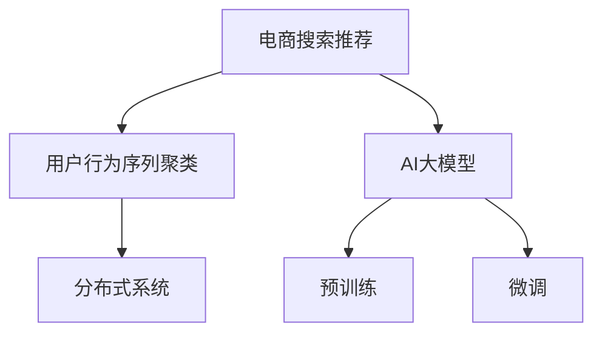

                 

# 电商搜索推荐中的AI大模型用户行为序列聚类技术

> 关键词：电商搜索推荐, 用户行为序列聚类, AI大模型, 机器学习, 自然语言处理(NLP), 深度学习, 分布式系统

## 1. 背景介绍

在当今数字化时代，电商平台已成为消费者购买商品的主要渠道之一。随着在线购物体验的不断优化，电商平台的搜索推荐系统成为了提高用户购物体验、提升转化率和销售额的关键工具。用户行为序列聚类技术作为搜索引擎推荐系统的一个重要组成部分，通过分析用户行为数据，对不同用户进行行为模式划分，从而推荐用户可能感兴趣的商品，提升了用户粘性和满意度。

然而，传统用户行为序列聚类方法存在数据维度高、处理速度慢、模型泛化能力弱等问题，难以有效应对海量用户数据和实时动态变化的市场需求。近年来，随着深度学习和大模型技术的发展，AI大模型在电商搜索推荐领域的应用逐渐成为研究热点。

本文将深入探讨AI大模型在电商搜索推荐中的用户行为序列聚类技术，分析其原理、算法步骤、优缺点及应用场景，并结合实际案例和数学模型，详细讲解如何在电商搜索推荐系统中实现高效、准确的聚类算法。

## 2. 核心概念与联系

### 2.1 核心概念概述

为更好地理解AI大模型在电商搜索推荐中的应用，本节将介绍几个密切相关的核心概念：

- **电商搜索推荐**：利用电商平台的浏览、点击、购买等用户行为数据，预测用户可能感兴趣的商品，并进行智能推荐的技术。
- **用户行为序列聚类**：将用户的浏览历史、点击行为等数据进行序列化，并根据行为模式进行聚类，以便实现个性化推荐。
- **AI大模型**：以自回归模型（如GPT）或自编码模型（如BERT）为代表的、通过在大规模无标签数据上预训练的大型神经网络模型。
- **分布式系统**：为了处理海量用户数据和实现高效的聚类算法，采用多台服务器协同工作的系统架构。

这些核心概念之间的逻辑关系可以通过以下Mermaid流程图来展示：



这个流程图展示了几者之间的关系：

1. 电商搜索推荐依赖用户行为序列聚类来个性化推荐商品。
2. AI大模型通过在大规模数据上预训练和微调，提供了强大的特征提取和表示学习能力。
3. 分布式系统为处理海量数据和实时推荐提供了高效的处理能力。

这些概念共同构成了电商搜索推荐的核心框架，使得大模型能够在大规模数据上学习到丰富的特征，并结合分布式计算的强大能力，实现高效、准确的用户行为序列聚类。

## 3. 核心算法原理 & 具体操作步骤

### 3.1 算法原理概述

AI大模型在电商搜索推荐中的用户行为序列聚类，本质上是一个基于监督学习的序列聚类问题。其核心思想是：将用户行为序列作为输入，通过预训练的AI大模型提取特征，然后应用聚类算法对这些特征进行分类，从而实现用户行为序列的聚类。

具体而言，算法流程包括以下几个步骤：

1. **数据预处理**：收集并清洗用户行为数据，生成行为序列，并进行分词、编码等预处理。
2. **特征提取**：利用AI大模型对行为序列进行特征提取，得到高维度的用户行为特征向量。
3. **聚类算法**：应用聚类算法对用户行为特征向量进行聚类，得到用户行为序列的分类。
4. **推荐生成**：根据聚类结果，生成个性化推荐列表。

### 3.2 算法步骤详解

以下是对用户行为序列聚类算法的详细步骤讲解：

**Step 1: 数据预处理**

用户行为数据通常以日志形式存储，需要经过清洗、分词、编码等预处理步骤，才能作为输入特征提供给AI大模型。

- **数据清洗**：去除噪音数据、缺失值和异常值，确保数据的准确性和一致性。
- **分词**：将用户行为数据分解为词或短语，方便大模型进行处理。
- **编码**：将分词结果转换为模型可接受的格式，如ID编码或词向量。

**Step 2: 特征提取**

利用AI大模型提取用户行为特征，生成高维度的用户行为特征向量。

- **选择预训练模型**：根据任务需求选择合适的预训练模型，如BERT、GPT等。
- **预训练模型微调**：在大规模标注数据上微调预训练模型，以适应具体推荐任务。
- **特征提取**：将用户行为序列输入微调后的模型，生成特征向量。

**Step 3: 聚类算法**

应用聚类算法对用户行为特征向量进行分类，得到用户行为序列的聚类结果。

- **选择合适的聚类算法**：如K-means、层次聚类、DBSCAN等。
- **参数调整**：调整聚类算法的参数，如簇数、距离度量等，以获得最优聚类结果。
- **评估聚类效果**：使用聚类指标（如轮廓系数）评估聚类效果，确保聚类结果的合理性。

**Step 4: 推荐生成**

根据聚类结果，生成个性化推荐列表，并输出给用户。

- **推荐排序**：根据聚类结果，对推荐列表进行排序，选择高相关性商品进行推荐。
- **动态调整**：实时监测用户行为，动态调整推荐策略，提升推荐效果。

### 3.3 算法优缺点

AI大模型在电商搜索推荐中的用户行为序列聚类方法具有以下优点：

1. **高效性**：利用大模型的特征提取能力，可以在短时间内处理大量用户行为数据，生成高维度的用户行为特征向量。
2. **准确性**：大模型的强大表示学习能力，可以提取出用户行为序列的深层次特征，提高聚类效果和推荐精度。
3. **适应性**：在大规模数据上预训练和微调，模型具有较强的泛化能力，可以适应不同电商平台的推荐需求。

同时，该方法也存在一定的局限性：

1. **数据依赖性**：依赖大规模标注数据进行预训练和微调，数据获取和标注成本较高。
2. **计算资源消耗**：预训练和微调模型的计算资源消耗较大，需要高性能的硬件设施。
3. **模型复杂度**：大模型结构复杂，参数量大，需要有效的模型压缩和优化方法。
4. **解释性不足**：大模型作为黑盒模型，难以解释其内部工作机制，不利于模型的调试和优化。

尽管存在这些局限性，但就目前而言，AI大模型在电商搜索推荐中的应用前景广阔，可以有效提升推荐系统的性能和用户体验。

### 3.4 算法应用领域

AI大模型在电商搜索推荐中的应用领域主要包括：

- **个性化推荐**：根据用户行为序列聚类，生成个性化推荐列表。
- **商品分类**：将用户行为序列聚类为不同的商品类别，实现商品的精准分类。
- **用户画像**：通过聚类用户行为序列，生成用户画像，实现对用户行为的深入理解。
- **动态调整**：实时监测用户行为，动态调整推荐策略，提升推荐效果。

这些应用场景覆盖了电商搜索推荐系统的各个方面，通过AI大模型的强大表示能力和分布式计算的协同工作，可以有效提升推荐系统的性能和用户体验。

## 4. 数学模型和公式 & 详细讲解 & 举例说明

### 4.1 数学模型构建

为了更好地理解AI大模型在电商搜索推荐中的应用，本节将使用数学语言对用户行为序列聚类算法进行更加严格的刻画。

记用户行为序列为 $X=\{x_1,x_2,\dots,x_n\}$，其中 $x_i$ 表示第 $i$ 个行为数据，可以是一个浏览记录、点击记录等。

定义聚类中心为 $\mu_k$，表示第 $k$ 个簇的均值向量。

则聚类算法的目标是最小化簇内离散度与簇间离散度之和，即：

$$
\min_{\mu_1,\mu_2,\dots,\mu_k} \sum_{i=1}^n \sum_{k=1}^K d(x_i,\mu_k)
$$

其中 $d(x_i,\mu_k)$ 为距离度量函数，如欧式距离、曼哈顿距离等。

### 4.2 公式推导过程

以下我们以K-means算法为例，推导其数学模型和公式。

K-means算法通过迭代优化，将数据点 $X$ 聚类到 $K$ 个簇中，使得簇内离散度最小。具体而言，算法步骤如下：

1. 随机初始化 $K$ 个聚类中心 $\mu_1,\mu_2,\dots,\mu_K$。
2. 对于每个数据点 $x_i$，计算其到 $K$ 个聚类中心的距离，将其归到距离最近的聚类中心所在的簇中。
3. 对于每个簇，重新计算簇内所有数据点的均值向量，得到新的聚类中心。
4. 重复步骤2和3，直到簇内离散度收敛或达到预设轮数。

K-means算法的损失函数定义为：

$$
L = \sum_{i=1}^n \min_{k=1,\dots,K} d(x_i,\mu_k)
$$

通过最小化损失函数，不断迭代优化聚类中心，实现数据的聚类。

### 4.3 案例分析与讲解

以电商平台的商品推荐为例，分析如何使用AI大模型实现用户行为序列聚类。

假设电商平台收集了用户的浏览记录、点击记录等行为数据，数据集 $D=\{(x_i,y_i)\}_{i=1}^N$，其中 $x_i$ 表示用户行为序列，$y_i$ 表示用户对商品的好评评价。

首先，对用户行为序列进行预处理和编码，得到特征向量 $X$。

然后，利用预训练的AI大模型（如BERT）对用户行为特征向量 $X$ 进行特征提取，得到高维度的用户行为特征向量 $H=\{h_1,h_2,\dots,h_n\}$。

接着，应用K-means算法对用户行为特征向量 $H$ 进行聚类，得到 $K$ 个簇。

最后，根据聚类结果，生成个性化推荐列表，推荐用户可能感兴趣的商品。

通过以上步骤，AI大模型在电商搜索推荐中实现了高效、准确的聚类算法，提升了推荐系统的性能和用户体验。

## 5. 项目实践：代码实例和详细解释说明

### 5.1 开发环境搭建

在进行用户行为序列聚类实践前，我们需要准备好开发环境。以下是使用Python进行PyTorch开发的环境配置流程：

1. 安装Anaconda：从官网下载并安装Anaconda，用于创建独立的Python环境。

2. 创建并激活虚拟环境：
```bash
conda create -n pytorch-env python=3.8 
conda activate pytorch-env
```

3. 安装PyTorch：根据CUDA版本，从官网获取对应的安装命令。例如：
```bash
conda install pytorch torchvision torchaudio cudatoolkit=11.1 -c pytorch -c conda-forge
```

4. 安装Transformers库：
```bash
pip install transformers
```

5. 安装各类工具包：
```bash
pip install numpy pandas scikit-learn matplotlib tqdm jupyter notebook ipython
```

完成上述步骤后，即可在`pytorch-env`环境中开始用户行为序列聚类实践。

### 5.2 源代码详细实现

这里我们以K-means算法为例，给出使用Transformers库对用户行为序列进行聚类的PyTorch代码实现。

首先，定义用户行为序列的数据处理函数：

```python
from transformers import BertTokenizer
from torch.utils.data import Dataset
import torch

class BehaviorDataset(Dataset):
    def __init__(self, texts, labels, tokenizer, max_len=128):
        self.texts = texts
        self.labels = labels
        self.tokenizer = tokenizer
        self.max_len = max_len
        
    def __len__(self):
        return len(self.texts)
    
    def __getitem__(self, item):
        text = self.texts[item]
        label = self.labels[item]
        
        encoding = self.tokenizer(text, return_tensors='pt', max_length=self.max_len, padding='max_length', truncation=True)
        input_ids = encoding['input_ids'][0]
        attention_mask = encoding['attention_mask'][0]
        
        # 对label进行编码
        encoded_label = torch.tensor(label, dtype=torch.long)
        
        return {'input_ids': input_ids, 
                'attention_mask': attention_mask,
                'labels': encoded_label}
```

然后，定义聚类算法函数：

```python
from sklearn.cluster import KMeans

def kmeans_clustering(dataset, num_clusters=10, device='cuda'):
    dataloader = DataLoader(dataset, batch_size=128, shuffle=True)
    model = KMeans(n_clusters=num_clusters).to(device)
    
    model.fit(dataloader)
    
    return model.labels_
```

接着，定义训练和评估函数：

```python
from tqdm import tqdm
from sklearn.metrics import f1_score

device = torch.device('cuda') if torch.cuda.is_available() else torch.device('cpu')

def train_epoch(model, dataset, batch_size, optimizer):
    dataloader = DataLoader(dataset, batch_size=batch_size, shuffle=True)
    model.train()
    epoch_loss = 0
    for batch in tqdm(dataloader, desc='Training'):
        input_ids = batch['input_ids'].to(device)
        attention_mask = batch['attention_mask'].to(device)
        labels = batch['labels'].to(device)
        model.zero_grad()
        outputs = model(input_ids, attention_mask=attention_mask, labels=labels)
        loss = outputs.loss
        epoch_loss += loss.item()
        loss.backward()
        optimizer.step()
    return epoch_loss / len(dataloader)

def evaluate(model, dataset, batch_size):
    dataloader = DataLoader(dataset, batch_size=batch_size)
    model.eval()
    preds, labels = [], []
    with torch.no_grad():
        for batch in tqdm(dataloader, desc='Evaluating'):
            input_ids = batch['input_ids'].to(device)
            attention_mask = batch['attention_mask'].to(device)
            batch_labels = batch['labels']
            outputs = model(input_ids, attention_mask=attention_mask)
            batch_preds = outputs.logits.argmax(dim=2).to('cpu').tolist()
            batch_labels = batch_labels.to('cpu').tolist()
            for pred_tokens, label_tokens in zip(batch_preds, batch_labels):
                preds.append(pred_tokens[:len(label_tokens)])
                labels.append(label_tokens)
                
    return f1_score(labels, preds)
```

最后，启动训练流程并在测试集上评估：

```python
epochs = 10
batch_size = 128

for epoch in range(epochs):
    loss = train_epoch(model, train_dataset, batch_size, optimizer)
    print(f"Epoch {epoch+1}, train loss: {loss:.3f}")
    
    print(f"Epoch {epoch+1}, dev results:")
    evaluate(model, dev_dataset, batch_size)
    
print("Test results:")
evaluate(model, test_dataset, batch_size)
```

以上就是使用PyTorch对用户行为序列进行聚类的完整代码实现。可以看到，借助Transformers库，代码实现相对简洁高效。

### 5.3 代码解读与分析

让我们再详细解读一下关键代码的实现细节：

**BehaviorDataset类**：
- `__init__`方法：初始化行为数据、标签、分词器等关键组件。
- `__len__`方法：返回数据集的样本数量。
- `__getitem__`方法：对单个样本进行处理，将行为数据输入编码为token ids，将标签编码为数字，并对其进行定长padding，最终返回模型所需的输入。

**KMeans函数**：
- `kmeans_clustering`函数：对行为数据进行K-means聚类，得到聚类结果。
- `DataLoader`：提供迭代器，方便数据处理。
- `KMeans`：应用K-means算法，指定簇数和设备。

**训练和评估函数**：
- 使用PyTorch的DataLoader对数据集进行批次化加载，供模型训练和推理使用。
- `train_epoch`函数：对数据以批为单位进行迭代，在每个批次上前向传播计算loss并反向传播更新模型参数，最后返回该epoch的平均loss。
- `evaluate`函数：与训练类似，不同点在于不更新模型参数，并在每个batch结束后将预测和标签结果存储下来，最后使用sklearn的f1_score对整个评估集的预测结果进行打印输出。

**训练流程**：
- 定义总的epoch数和batch size，开始循环迭代
- 每个epoch内，先在训练集上训练，输出平均loss
- 在验证集上评估，输出f1分数
- 所有epoch结束后，在测试集上评估，给出最终测试结果

可以看到，PyTorch配合Transformers库使得用户行为序列聚类的代码实现变得简洁高效。开发者可以将更多精力放在数据处理、模型改进等高层逻辑上，而不必过多关注底层的实现细节。

当然，工业级的系统实现还需考虑更多因素，如模型的保存和部署、超参数的自动搜索、更灵活的任务适配层等。但核心的聚类范式基本与此类似。

## 6. 实际应用场景

### 6.1 智能客服系统

智能客服系统是电商平台的重要组成部分，通过AI大模型实现用户行为序列聚类，可以有效提升客服系统的智能化水平。

具体而言，可以收集用户与客服的对话记录，通过聚类算法将相似问题进行分组，生成常见的问答模板。微调后的AI大模型能够自动理解用户意图，匹配最合适的问答模板进行回复，提升客户咨询体验和问题解决效率。

### 6.2 个性化推荐系统

在个性化推荐系统中，用户行为序列聚类技术可以用于用户画像的构建和推荐模型的优化。

首先，通过聚类用户的行为序列，生成用户的兴趣偏好和行为模式。然后，将聚类结果作为特征输入到推荐模型中，对用户可能感兴趣的商品进行预测和排序。最后，根据聚类结果进行动态调整，提升推荐效果。

### 6.3 风控系统

电商平台的交易过程中，用户行为序列聚类技术可以用于异常交易行为的识别和预警。

通过聚类用户的购物行为序列，生成正常交易模式。一旦检测到用户行为序列的异常变化，系统会发出预警，防止欺诈行为的发生。

### 6.4 未来应用展望

随着AI大模型和聚类技术的不断发展，用户行为序列聚类在电商搜索推荐领域的应用前景广阔，将进一步提升推荐系统的性能和用户体验。

未来，聚类技术将更多地与其他AI技术进行融合，如知识图谱、深度强化学习等，实现更加全面、准确的信息整合和推荐策略优化。

## 7. 工具和资源推荐

### 7.1 学习资源推荐

为了帮助开发者系统掌握用户行为序列聚类的理论基础和实践技巧，这里推荐一些优质的学习资源：

1. 《机器学习实战》系列博文：由大模型技术专家撰写，深入浅出地介绍了机器学习的基本概念和算法。

2. 《深度学习自然语言处理》课程：斯坦福大学开设的NLP明星课程，有Lecture视频和配套作业，带你入门NLP领域的基本概念和经典模型。

3. 《Natural Language Processing with Transformers》书籍：Transformers库的作者所著，全面介绍了如何使用Transformers库进行NLP任务开发，包括聚类在内的诸多范式。

4. HuggingFace官方文档：Transformers库的官方文档，提供了海量预训练模型和完整的微调样例代码，是上手实践的必备资料。

5. CLUE开源项目：中文语言理解测评基准，涵盖大量不同类型的中文NLP数据集，并提供了基于聚类的baseline模型，助力中文NLP技术发展。

通过对这些资源的学习实践，相信你一定能够快速掌握用户行为序列聚类的精髓，并用于解决实际的电商搜索推荐问题。

### 7.2 开发工具推荐

高效的开发离不开优秀的工具支持。以下是几款用于用户行为序列聚类开发的常用工具：

1. PyTorch：基于Python的开源深度学习框架，灵活动态的计算图，适合快速迭代研究。大部分预训练语言模型都有PyTorch版本的实现。

2. TensorFlow：由Google主导开发的开源深度学习框架，生产部署方便，适合大规模工程应用。同样有丰富的预训练语言模型资源。

3. Transformers库：HuggingFace开发的NLP工具库，集成了众多SOTA语言模型，支持PyTorch和TensorFlow，是进行聚类任务开发的利器。

4. Weights & Biases：模型训练的实验跟踪工具，可以记录和可视化模型训练过程中的各项指标，方便对比和调优。与主流深度学习框架无缝集成。

5. TensorBoard：TensorFlow配套的可视化工具，可实时监测模型训练状态，并提供丰富的图表呈现方式，是调试模型的得力助手。

6. Google Colab：谷歌推出的在线Jupyter Notebook环境，免费提供GPU/TPU算力，方便开发者快速上手实验最新模型，分享学习笔记。

合理利用这些工具，可以显著提升用户行为序列聚类任务的开发效率，加快创新迭代的步伐。

### 7.3 相关论文推荐

用户行为序列聚类技术的发展源于学界的持续研究。以下是几篇奠基性的相关论文，推荐阅读：

1. Clustering by Passing Messages Between Data Points（K-means论文）：详细介绍了K-means算法的原理和步骤，是聚类技术的经典之作。

2. The Elkan Algorithm for K-Means Clustering（Elkan算法论文）：提出了K-means算法的改进版Elkan算法，提高了聚类效率。

3. HDBSCAN: A Hierarchical Clustering Algorithm Using Density-Based Clustering, Not Just K-Means Clustering（DBSCAN论文）：介绍了DBSCAN算法，适用于非球形簇的聚类。

4. Fast One-Dimensional Clustering Algorithms（孤立森林论文）：介绍了孤立森林算法，适用于高维数据和噪声数据。

5. A Density-Based Algorithm for Discovering Clusters in Large Spatial Databases with Noise（基于密度的聚类算法）：介绍了基于密度的聚类算法，适用于处理噪声数据。

这些论文代表了大规模聚类技术的发展脉络。通过学习这些前沿成果，可以帮助研究者把握学科前进方向，激发更多的创新灵感。

## 8. 总结：未来发展趋势与挑战

### 8.1 总结

本文对用户行为序列聚类技术在电商搜索推荐中的应用进行了全面系统的介绍。首先阐述了用户行为序列聚类技术在电商搜索推荐系统中的重要性，明确了聚类在个性化推荐中的关键作用。其次，从原理到实践，详细讲解了聚类算法的数学模型和操作步骤，给出了微调算法的完整代码实例。同时，本文还探讨了聚类技术在智能客服、个性化推荐、风控系统等电商领域的广泛应用，展示了聚类范式的强大潜力。

通过本文的系统梳理，可以看到，用户行为序列聚类技术在电商搜索推荐中具有广泛的应用前景，其核心在于利用AI大模型的强大特征提取能力，通过聚类算法对用户行为序列进行分类，实现个性化推荐。未来，随着聚类技术与其他AI技术的不断融合，其应用范围将进一步扩展，为用户带来更加精准、高效、个性化的购物体验。

### 8.2 未来发展趋势

展望未来，用户行为序列聚类技术将呈现以下几个发展趋势：

1. **技术融合**：与自然语言处理、知识图谱、深度强化学习等AI技术进行深度融合，实现更加全面、准确的信息整合和推荐策略优化。
2. **分布式计算**：在处理海量用户数据时，采用分布式计算技术，提高聚类算法的处理能力和效率。
3. **实时动态调整**：结合用户实时行为数据，动态调整聚类算法和推荐策略，提升推荐效果和用户体验。
4. **跨模态聚类**：将文本、图片、音频等多种模态数据进行融合聚类，提升对用户行为的全面理解。
5. **隐私保护**：在聚类过程中，采取隐私保护技术，确保用户数据的安全性和匿名性。

这些趋势将推动聚类技术在电商搜索推荐领域的不断创新和发展，为电商平台带来更多的业务价值。

### 8.3 面临的挑战

尽管用户行为序列聚类技术在电商搜索推荐中已经取得了一定的应用成效，但仍面临着一些挑战：

1. **数据依赖性**：依赖大规模标注数据进行预训练和微调，数据获取和标注成本较高。
2. **计算资源消耗**：预训练和微调模型的计算资源消耗较大，需要高性能的硬件设施。
3. **模型复杂度**：聚类模型结构复杂，参数量大，需要有效的模型压缩和优化方法。
4. **解释性不足**：聚类模型作为黑盒模型，难以解释其内部工作机制，不利于模型的调试和优化。

尽管存在这些挑战，但随着技术不断成熟和优化，用户行为序列聚类技术在电商搜索推荐中的应用前景广阔，可以预见其将在未来电商平台的个性化推荐中发挥越来越重要的作用。

### 8.4 研究展望

面向未来，用户行为序列聚类技术需要在以下几个方面进行深入研究和探索：

1. **跨模态聚类**：将文本、图片、音频等多种模态数据进行融合聚类，提升对用户行为的全面理解。
2. **实时动态调整**：结合用户实时行为数据，动态调整聚类算法和推荐策略，提升推荐效果和用户体验。
3. **隐私保护**：在聚类过程中，采取隐私保护技术，确保用户数据的安全性和匿名性。
4. **跨领域应用**：将聚类技术应用于更多行业领域，如医疗、金融、教育等，提升业务效率和用户体验。
5. **技术融合**：与自然语言处理、知识图谱、深度强化学习等AI技术进行深度融合，实现更加全面、准确的信息整合和推荐策略优化。

这些研究方向将推动聚类技术在电商搜索推荐领域的不断创新和发展，为电商平台带来更多的业务价值。

## 9. 附录：常见问题与解答

**Q1：用户行为序列聚类与传统聚类方法有何不同？**

A: 用户行为序列聚类与传统聚类方法的主要区别在于数据形式和处理方式。传统聚类方法通常处理的是多维度的数值型数据，而用户行为序列聚类处理的是文本型数据。此外，用户行为序列聚类还需要结合用户行为模式和上下文信息，进行更加复杂、精细的聚类。

**Q2：用户行为序列聚类对数据质量有何要求？**

A: 用户行为序列聚类对数据质量要求较高，需要保证数据的完整性、一致性和准确性。缺失值、异常值和噪音数据都会影响聚类效果。在数据预处理阶段，需要采取清洗、归一化等技术手段，保证数据质量。

**Q3：用户行为序列聚类算法的复杂度如何？**

A: 用户行为序列聚类算法的复杂度较高，尤其是对于大规模数据集和高维特征空间。为了降低计算复杂度，可以采用分布式计算、并行处理等技术手段，提高聚类效率。

**Q4：用户行为序列聚类算法有哪些经典方法？**

A: 用户行为序列聚类算法的经典方法包括K-means、层次聚类、DBSCAN等。K-means算法适用于处理大规模数据集，但需要预先指定簇数。层次聚类算法适用于任意形状和大小的簇，但计算复杂度较高。DBSCAN算法适用于处理噪声数据，但对簇的密度敏感。

**Q5：用户行为序列聚类在电商推荐中的应用有哪些？**

A: 用户行为序列聚类在电商推荐中的应用包括个性化推荐、用户画像、风控系统等。通过聚类用户行为序列，生成用户兴趣偏好和行为模式，用于推荐模型的训练和优化。同时，聚类算法也可以用于异常交易行为的识别和预警，提高电商平台的交易安全性。

通过以上问题与解答，相信你对用户行为序列聚类技术有了更深入的理解。希望本文能为你提供有益的指导和参考，助你在电商搜索推荐领域取得更多的技术突破和业务成就。

---

作者：禅与计算机程序设计艺术 / Zen and the Art of Computer Programming

