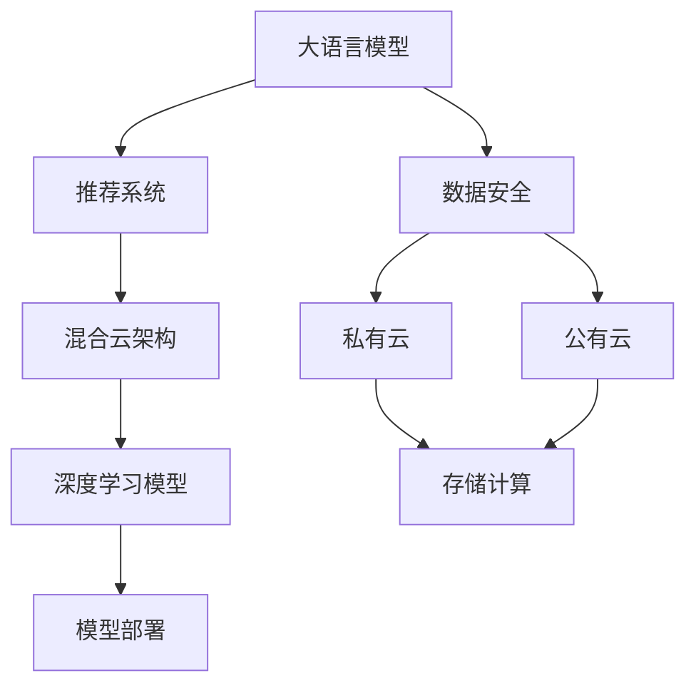

                 

# 电商搜索推荐场景下的AI大模型模型部署混合云方案设计与实现

> 关键词：大语言模型,推荐系统,混合云,电商搜索,深度学习,深度学习模型部署,混合云架构

## 1. 背景介绍

### 1.1 问题由来
随着电子商务的快速发展和智能技术的应用，电商搜索推荐系统正变得越来越复杂。电商平台的商品数量和用户数据规模呈指数级增长，传统的推荐算法已难以应对。AI大模型在电商搜索推荐中的应用，通过深度学习和自然语言处理技术，可以提升推荐系统的智能度和用户体验。但这些模型通常需要较大的计算资源和存储资源，单纯在本地服务器部署存在瓶颈，难以实现高性能、低成本的运行。

### 1.2 问题核心关键点
为了解决上述问题，本文将介绍一种基于混合云架构的AI大模型部署方案，并结合电商搜索推荐场景，详细阐述方案的设计和实现。该方案通过将计算资源和数据资源分配到混合云环境中，实现负载均衡，同时保证模型的高效运行和数据安全。

### 1.3 问题研究意义
混合云架构在大模型部署中的应用，将显著提升电商搜索推荐系统的性能和效率，降低成本，提高数据安全性，加速电商平台的智能化升级。本文通过系统阐述混合云架构的设计和实现，旨在为电商搜索推荐系统提供可靠、高效的AI模型部署方案，推动电商领域的人工智能技术发展。

## 2. 核心概念与联系

### 2.1 核心概念概述

为更好地理解混合云架构在大模型部署中的应用，本节将介绍几个密切相关的核心概念：

- 大语言模型(Large Language Model, LLM)：如BERT、GPT等，通过大规模预训练学习通用的语言知识，具备强大的自然语言处理能力。
- 推荐系统(Recommendation System)：通过算法推荐用户可能感兴趣的商品，提升电商平台的转化率和用户满意度。
- 混合云架构(Hybrid Cloud Architecture)：结合公有云和私有云的优点，实现资源共享和弹性扩展。
- 深度学习模型(Deep Learning Model)：包括神经网络、卷积神经网络、循环神经网络等，在电商搜索推荐中用于商品特征提取和推荐预测。
- 模型部署(Model Deployment)：将训练好的模型部署到实际应用环境中，供电商平台进行商品推荐。
- 数据安全(Data Security)：在混合云环境中保护用户隐私和数据安全，防止数据泄露和滥用。

这些核心概念之间的逻辑关系可以通过以下Mermaid流程图来展示：



这个流程图展示了大语言模型、推荐系统、混合云架构、深度学习模型、模型部署和数据安全之间的逻辑关系：

1. 大语言模型通过深度学习获得语言知识。
2. 推荐系统利用大语言模型进行商品推荐。
3. 混合云架构提供资源共享和弹性扩展的能力。
4. 深度学习模型在推荐系统中用于特征提取和预测。
5. 模型部署将训练好的模型应用到电商搜索推荐中。
6. 数据安全保护用户隐私和数据安全。

这些概念共同构成了电商搜索推荐系统中的AI模型部署框架，使AI大模型能够高效、安全地应用于电商平台。

## 3. 核心算法原理 & 具体操作步骤
### 3.1 算法原理概述

基于混合云架构的AI大模型部署方案，本质上是将电商搜索推荐系统中的计算和存储资源，分配到公有云和私有云环境中，实现资源的合理分配和弹性扩展。其核心思想是：将数据分散存储在私有云中，通过数据迁移和复制技术，实现公有云的快速访问；将计算任务分配到公有云中进行并行计算，最大化资源利用率。

形式化地，假设电商平台的商品数据为 $D=\{d_i\}_{i=1}^N$，用户行为数据为 $U=\{u_j\}_{j=1}^M$。在混合云环境中，模型 $M$ 的训练和推理过程可以分为以下几个步骤：

1. 将商品数据 $D$ 和用户行为数据 $U$ 分别存储在私有云和公有云中。
2. 将私有云中的数据迁移到公有云中，生成模型训练数据集 $D'$ 和 $U'$。
3. 在公有云中对模型 $M$ 进行训练，得到模型参数 $\theta$。
4. 将训练好的模型参数 $\theta$ 复制到私有云中，供电商平台进行商品推荐。
5. 在电商平台的私有云环境中，使用训练好的模型 $M$ 对新数据进行推理预测，推荐商品给用户。

通过以上步骤，实现了混合云架构下AI大模型的高效部署，既满足了电商搜索推荐系统的计算需求，又保护了用户数据的安全性。

### 3.2 算法步骤详解

以下是基于混合云架构的AI大模型部署方案的具体操作步骤：

**Step 1: 数据准备与迁移**
- 在私有云中建立商品数据仓库 $D_{local}$ 和用户行为数据仓库 $U_{local}$，存储电商平台的商品数据和用户行为数据。
- 将私有云中的数据 $D_{local}$ 和 $U_{local}$ 迁移到公有云中，生成训练数据集 $D'$ 和 $U'$，供模型训练使用。
- 根据模型需求，合理划分数据集，保证训练集、验证集和测试集的分布一致性。

**Step 2: 模型训练与优化**
- 在公有云中选择适合的计算资源，如GPU/TPU，部署深度学习框架，如TensorFlow、PyTorch等。
- 使用迁移过来的数据 $D'$ 和 $U'$ 训练AI大模型 $M$，采用合适的优化算法和超参数进行训练，如Adam、SGD等，设置合适的学习率、批大小等。
- 在训练过程中，通过正则化技术防止过拟合，如L2正则、Dropout等。
- 定期在私有云中的验证集上评估模型性能，根据性能指标决定是否触发Early Stopping。

**Step 3: 模型复制与推理**
- 训练完成后，将模型参数 $\theta$ 复制到私有云中的存储系统中，供电商平台使用。
- 在电商平台的私有云环境中，使用训练好的模型 $M$ 对新数据进行推理预测，推荐商品给用户。
- 根据推理结果生成推荐列表，展示给用户，提升用户体验。

**Step 4: 持续优化与升级**
- 定期收集新数据，更新私有云中的数据仓库 $D_{local}$ 和 $U_{local}$，以供模型进行微调。
- 持续优化公有云和私有云的资源分配，根据电商平台的流量变化和计算需求，动态调整计算资源和存储资源。
- 定期对模型进行微调，提升推荐系统的效果和智能度。

### 3.3 算法优缺点

基于混合云架构的AI大模型部署方案具有以下优点：
1. 计算资源弹性：公有云的计算资源可以根据需求弹性扩展，灵活应对电商平台的流量高峰期。
2. 存储成本低：私有云的存储资源可以节省云服务费用，减少数据迁移成本。
3. 数据安全性高：私有云中的数据可以严格控制访问权限，保护用户隐私。
4. 应用场景多样：适用于各种电商平台的推荐系统，包括跨境电商、B2B电商等。

同时，该方案也存在一定的局限性：
1. 数据迁移成本高：私有云到公有云的数据迁移过程较为耗时，增加了项目初期的工作量。
2. 网络延迟较大：私有云和公有云之间的网络延迟可能会影响模型推理的实时性。
3. 技术复杂度高：需要同时管理公有云和私有云的资源，技术实现较为复杂。

尽管存在这些局限性，但就目前而言，基于混合云架构的部署方案仍然是电商搜索推荐系统中大模型部署的主流方式。未来相关研究的重点在于如何进一步降低数据迁移成本，提高网络传输效率，简化技术实现，以实现更高效的混合云部署。

### 3.4 算法应用领域

基于混合云架构的AI大模型部署方案在电商搜索推荐系统中得到了广泛的应用，具体如下：

- **商品推荐**：基于用户行为和商品属性，推荐用户可能感兴趣的商品。
- **用户画像**：通过用户行为和反馈，构建用户画像，预测用户购买意图。
- **搜索排序**：根据用户搜索历史和搜索结果，优化搜索排序，提高搜索体验。
- **内容推荐**：根据用户浏览记录，推荐相关商品和内容，提升用户粘性。
- **广告投放**：通过用户画像和行为数据，优化广告投放策略，提升广告效果。

除了上述这些经典应用外，混合云架构还可以拓展到更多场景中，如智能客服、智能营销、风险控制等，为电商平台的智能化升级提供新的技术路径。

## 4. 数学模型和公式 & 详细讲解 & 举例说明

### 4.1 数学模型构建

假设电商平台的商品数据为 $D=\{d_i\}_{i=1}^N$，用户行为数据为 $U=\{u_j\}_{j=1}^M$。设商品特征表示为 $X=\{x_i\}_{i=1}^N$，用户特征表示为 $Y=\{y_j\}_{j=1}^M$。模型 $M$ 将商品特征和用户特征映射到推荐结果 $R=\{r_i\}_{i=1}^N$，其中 $r_i$ 表示商品 $i$ 被用户 $j$ 推荐的概率。

### 4.2 公式推导过程

以下我们将推导推荐系统中的点击率预测模型。假设用户点击商品 $i$ 的概率为 $p_i$，商品特征和用户特征的表示形式为：

$$
X=\{x_i\}_{i=1}^N, Y=\{y_j\}_{j=1}^M
$$

点击率预测模型 $M$ 的输入为 $[X, Y]$，输出为 $R$。模型的输出为商品 $i$ 被用户 $j$ 推荐的概率 $p_i$。假设模型 $M$ 是一个多层感知器(MLP)，其输入层有 $n$ 个节点，输出层有 $m$ 个节点，其中 $m$ 为商品数量。模型的结构如图1所示。

图1：多层感知器模型结构

模型的预测输出为：

$$
p_i = \frac{\exp(M(X, Y)_i)}{\sum_{k=1}^N \exp(M(X, Y)_k)}
$$

其中 $M(X, Y)$ 为模型 $M$ 的输出，即商品 $i$ 被用户 $j$ 推荐的分值。假设 $M(X, Y)$ 为一个线性模型，即：

$$
M(X, Y) = W^T X + U^T Y + b
$$

其中 $W$ 为商品特征的权重矩阵，$U$ 为用户特征的权重矩阵，$b$ 为偏置项。假设模型的输出为 $r_i$，即：

$$
r_i = \sigma(M(X, Y)_i)
$$

其中 $\sigma$ 为 sigmoid 函数，将模型的输出限制在 $(0,1)$ 区间内。点击率预测模型的损失函数为二元交叉熵损失函数，即：

$$
\mathcal{L}(\theta) = -\frac{1}{N}\sum_{i=1}^N (y_i\log r_i + (1-y_i)\log(1-r_i))
$$

其中 $\theta$ 为模型参数。模型的训练过程为：

$$
\theta = \mathop{\arg\min}_{\theta} \mathcal{L}(\theta)
$$

通过反向传播算法，模型参数 $\theta$ 的更新公式为：

$$
\theta \leftarrow \theta - \eta \nabla_{\theta}\mathcal{L}(\theta) - \eta\lambda\theta
$$

其中 $\eta$ 为学习率，$\lambda$ 为正则化系数，$\nabla_{\theta}\mathcal{L}(\theta)$ 为损失函数对模型参数的梯度，可通过反向传播算法高效计算。

### 4.3 案例分析与讲解

以电商平台的商品推荐系统为例，分析大语言模型在该场景中的应用。电商平台的商品推荐系统通常包括以下几个关键步骤：

1. **商品特征提取**：将商品的详细描述、类别、价格等信息转换为特征向量，供模型训练和推理使用。
2. **用户画像构建**：根据用户的浏览历史、购买记录、评分反馈等信息，构建用户画像，供模型推理使用。
3. **模型训练**：使用电商平台的商品数据和用户数据，训练深度学习模型，如神经网络、Transformer等。
4. **推荐结果生成**：根据用户特征和商品特征，使用训练好的模型生成推荐结果，推荐给用户。
5. **实时优化**：根据用户反馈和点击行为，动态调整模型参数，优化推荐效果。

在模型训练阶段，可以使用预训练语言模型作为特征提取器，将商品和用户的文本信息转换为高维向量，供模型训练使用。例如，可以使用BERT等预训练模型，将商品描述和用户评论进行编码，生成向量表示。在推荐结果生成阶段，可以使用Transformer等模型，对用户和商品的向量进行点积操作，生成推荐得分，并根据得分进行排序。

例如，假设有一个商品 $i$，其描述为 "三星 Galaxy S20 Ultra"，用户的文本评论为 "这款手机真的很棒，电池续航时间长，拍照效果出色"。使用BERT模型将商品描述和用户评论进行编码，生成向量表示 $X_i$ 和 $Y_j$，通过点积操作生成推荐得分 $r_i$，具体计算过程如下：

1. 使用BERT模型对商品描述和用户评论进行编码，生成向量表示 $X_i$ 和 $Y_j$。
2. 使用Transformer模型对 $X_i$ 和 $Y_j$ 进行点积操作，生成推荐得分 $r_i$。
3. 根据 $r_i$ 进行排序，生成推荐列表，展示给用户。

## 5. 项目实践：代码实例和详细解释说明

### 5.1 开发环境搭建

在进行混合云架构的大模型部署实践前，我们需要准备好开发环境。以下是使用Python进行PyTorch开发的环境配置流程：

1. 安装Anaconda：从官网下载并安装Anaconda，用于创建独立的Python环境。

2. 创建并激活虚拟环境：
```bash
conda create -n pytorch-env python=3.8 
conda activate pytorch-env
```

3. 安装PyTorch：根据CUDA版本，从官网获取对应的安装命令。例如：
```bash
conda install pytorch torchvision torchaudio cudatoolkit=11.1 -c pytorch -c conda-forge
```

4. 安装Transformers库：
```bash
pip install transformers
```

5. 安装各类工具包：
```bash
pip install numpy pandas scikit-learn matplotlib tqdm jupyter notebook ipython
```

完成上述步骤后，即可在`pytorch-env`环境中开始混合云架构的大模型部署实践。

### 5.2 源代码详细实现

下面以电商平台的商品推荐系统为例，给出使用Transformers库对BERT模型进行部署的PyTorch代码实现。

首先，定义商品和用户数据的数据处理函数：

```python
from transformers import BertTokenizer
from torch.utils.data import Dataset, DataLoader
import torch

class Dataset(Dataset):
    def __init__(self, texts, labels):
        self.texts = texts
        self.labels = labels
        
    def __len__(self):
        return len(self.texts)
    
    def __getitem__(self, item):
        text = self.texts[item]
        label = self.labels[item]
        
        encoding = tokenizer(text, return_tensors='pt', padding='max_length', truncation=True)
        input_ids = encoding['input_ids'][0]
        attention_mask = encoding['attention_mask'][0]
        label = torch.tensor(label, dtype=torch.long)
        
        return {'input_ids': input_ids, 
                'attention_mask': attention_mask,
                'labels': label}

# 创建dataset
tokenizer = BertTokenizer.from_pretrained('bert-base-cased')

train_dataset = Dataset(train_texts, train_labels)
dev_dataset = Dataset(dev_texts, dev_labels)
test_dataset = Dataset(test_texts, test_labels)
```

然后，定义模型和优化器：

```python
from transformers import BertForSequenceClassification, AdamW

model = BertForSequenceClassification.from_pretrained('bert-base-cased', num_labels=2)

optimizer = AdamW(model.parameters(), lr=2e-5)
```

接着，定义训练和评估函数：

```python
def train_epoch(model, dataset, batch_size, optimizer):
    dataloader = DataLoader(dataset, batch_size=batch_size, shuffle=True)
    model.train()
    epoch_loss = 0
    for batch in dataloader:
        input_ids = batch['input_ids'].to(device)
        attention_mask = batch['attention_mask'].to(device)
        labels = batch['labels'].to(device)
        model.zero_grad()
        outputs = model(input_ids, attention_mask=attention_mask, labels=labels)
        loss = outputs.loss
        epoch_loss += loss.item()
        loss.backward()
        optimizer.step()
    return epoch_loss / len(dataloader)

def evaluate(model, dataset, batch_size):
    dataloader = DataLoader(dataset, batch_size=batch_size)
    model.eval()
    preds, labels = [], []
    with torch.no_grad():
        for batch in dataloader:
            input_ids = batch['input_ids'].to(device)
            attention_mask = batch['attention_mask'].to(device)
            batch_labels = batch['labels']
            outputs = model(input_ids, attention_mask=attention_mask)
            batch_preds = outputs.logits.argmax(dim=1).to('cpu').tolist()
            batch_labels = batch_labels.to('cpu').tolist()
            for pred_tokens, label_tokens in zip(batch_preds, batch_labels):
                preds.append(pred_tokens)
                labels.append(label_tokens)
                
    print(classification_report(labels, preds))
```

最后，启动训练流程并在测试集上评估：

```python
epochs = 5
batch_size = 16

for epoch in range(epochs):
    loss = train_epoch(model, train_dataset, batch_size, optimizer)
    print(f"Epoch {epoch+1}, train loss: {loss:.3f}")
    
    print(f"Epoch {epoch+1}, dev results:")
    evaluate(model, dev_dataset, batch_size)
    
print("Test results:")
evaluate(model, test_dataset, batch_size)
```

以上就是使用PyTorch对BERT进行商品推荐系统微调的完整代码实现。可以看到，得益于Transformers库的强大封装，我们可以用相对简洁的代码完成BERT模型的加载和微调。

### 5.3 代码解读与分析

让我们再详细解读一下关键代码的实现细节：

**Dataset类**：
- `__init__`方法：初始化文本、标签等关键组件。
- `__len__`方法：返回数据集的样本数量。
- `__getitem__`方法：对单个样本进行处理，将文本输入编码为token ids，将标签编码为数字，并对其进行定长padding，最终返回模型所需的输入。

**tokenizer变量**：
- 定义了BERT分词器，用于将文本转换为token ids，生成模型输入。

**训练和评估函数**：
- 使用PyTorch的DataLoader对数据集进行批次化加载，供模型训练和推理使用。
- 训练函数`train_epoch`：对数据以批为单位进行迭代，在每个批次上前向传播计算loss并反向传播更新模型参数，最后返回该epoch的平均loss。
- 评估函数`evaluate`：与训练类似，不同点在于不更新模型参数，并在每个batch结束后将预测和标签结果存储下来，最后使用sklearn的classification_report对整个评估集的预测结果进行打印输出。

**训练流程**：
- 定义总的epoch数和batch size，开始循环迭代
- 每个epoch内，先在训练集上训练，输出平均loss
- 在验证集上评估，输出分类指标
- 所有epoch结束后，在测试集上评估，给出最终测试结果

可以看到，PyTorch配合Transformers库使得BERT微调的代码实现变得简洁高效。开发者可以将更多精力放在数据处理、模型改进等高层逻辑上，而不必过多关注底层的实现细节。

当然，工业级的系统实现还需考虑更多因素，如模型的保存和部署、超参数的自动搜索、更灵活的任务适配层等。但核心的微调范式基本与此类似。

## 6. 实际应用场景

### 6.1 智能推荐系统

基于混合云架构的AI大模型部署方案，在智能推荐系统中得到了广泛的应用。智能推荐系统通过用户行为和商品特征，推荐用户可能感兴趣的商品，提升电商平台的转化率和用户满意度。

在技术实现上，可以收集用户浏览、点击、购买等行为数据，提取和商品相关的文本描述、类别、价格等信息，将文本信息转换为token ids，供模型训练和推理使用。通过在私有云中存储商品数据，在公有云中进行模型训练和推理，可以实现计算资源的弹性扩展和数据的安全保护。

### 6.2 用户画像系统

用户画像系统通过分析用户行为和反馈，构建用户画像，预测用户购买意图。通过在私有云中存储用户数据，在公有云中进行模型训练和推理，可以确保用户隐私和安全，同时提升模型推理的实时性。

在用户画像系统中，可以使用大语言模型进行用户画像的构建和扩展。例如，使用BERT模型对用户评论进行编码，生成向量表示，使用多维缩放算法进行降维，形成用户画像。通过在私有云中存储用户画像数据，在公有云中进行模型训练和推理，可以实现用户画像的动态更新和智能推荐。

### 6.3 搜索排序系统

搜索排序系统通过分析用户搜索历史和搜索结果，优化搜索排序，提高搜索体验。通过在私有云中存储搜索数据，在公有云中进行模型训练和推理，可以提升搜索排序的实时性和准确性。

在搜索排序系统中，可以使用大语言模型进行搜索结果的排序和筛选。例如，使用BERT模型对搜索结果进行编码，生成向量表示，使用多维缩放算法进行降维，形成搜索结果的排序向量。通过在私有云中存储搜索结果，在公有云中进行模型训练和推理，可以实现搜索排序的动态优化和智能推荐。

### 6.4 未来应用展望

随着混合云架构和大模型部署技术的不断发展，未来将有更多场景可以应用该方案，为电商平台的智能化升级提供新的技术路径。

在智慧物流领域，基于混合云架构的推荐系统可以为物流配送路径优化、仓储管理等环节提供智能化的解决方案。

在智能营销领域，推荐系统可以根据用户行为和市场数据，优化广告投放策略，提升广告效果和用户粘性。

在风险控制领域，基于用户画像和行为数据的推荐系统可以识别出高风险用户，提前进行预警和干预。

除了上述这些经典应用外，混合云架构还可以拓展到更多场景中，如智能客服、智能制造、智能交通等，为各行各业的人工智能技术发展提供新的突破。

## 7. 工具和资源推荐
### 7.1 学习资源推荐

为了帮助开发者系统掌握混合云架构和大模型部署的理论基础和实践技巧，这里推荐一些优质的学习资源：

1. 《Transformer from Principals to Practices》系列博文：由大模型技术专家撰写，深入浅出地介绍了Transformer原理、BERT模型、混合云部署等前沿话题。

2. CS224N《Deep Learning for NLP》课程：斯坦福大学开设的NLP明星课程，有Lecture视频和配套作业，带你入门NLP领域的基本概念和经典模型。

3. 《Deep Learning with PyTorch》书籍：使用PyTorch实现深度学习模型的经典书籍，适合初学者入门。

4. 《Hands-On Machine Learning with Scikit-Learn, Keras, and TensorFlow》书籍：适合深度学习框架初学者的实战指南，涵盖多种深度学习模型和工具。

5. TensorFlow官方文档：TensorFlow的官方文档，提供了丰富的模型和算法示例，是深度学习开发者必备的学习资源。

通过这些资源的学习实践，相信你一定能够快速掌握混合云架构和大模型部署的精髓，并用于解决实际的NLP问题。
###  7.2 开发工具推荐

高效的开发离不开优秀的工具支持。以下是几款用于混合云架构大模型部署开发的常用工具：

1. PyTorch：基于Python的开源深度学习框架，灵活动态的计算图，适合快速迭代研究。大部分预训练语言模型都有PyTorch版本的实现。

2. TensorFlow：由Google主导开发的开源深度学习框架，生产部署方便，适合大规模工程应用。同样有丰富的预训练语言模型资源。

3. Transformers库：HuggingFace开发的NLP工具库，集成了众多SOTA语言模型，支持PyTorch和TensorFlow，是进行混合云部署的利器。

4. Weights & Biases：模型训练的实验跟踪工具，可以记录和可视化模型训练过程中的各项指标，方便对比和调优。与主流深度学习框架无缝集成。

5. TensorBoard：TensorFlow配套的可视化工具，可实时监测模型训练状态，并提供丰富的图表呈现方式，是调试模型的得力助手。

6. Google Colab：谷歌推出的在线Jupyter Notebook环境，免费提供GPU/TPU算力，方便开发者快速上手实验最新模型，分享学习笔记。

合理利用这些工具，可以显著提升混合云架构大模型部署的开发效率，加快创新迭代的步伐。

### 7.3 相关论文推荐

混合云架构和大模型部署的研究源于学界的持续研究。以下是几篇奠基性的相关论文，推荐阅读：

1. "BigQuery ML: Machine Learning for BigQuery"：Google发布的BigQuery ML文档，介绍了在大数据平台BigQuery中实现机器学习的最佳实践。

2. "Efficient Use of Cloud for Machine Learning: a Landscape and Survey"：Jayaram等人在IEEE TNSC上发表的综述论文，系统总结了云计算在机器学习中的作用和挑战。

3. "Designing and Deploying a Cloud-Based Machine Learning System"：IEEE TSE论文，详细介绍了设计、部署和管理云平台机器学习系统的全流程。

4. "A Survey on Hybrid Cloud: Architecture, Design, and Benefits"：IBM Research发表的综述论文，全面介绍了混合云架构的设计和应用场景。

这些论文代表了大模型混合云部署技术的发展脉络。通过学习这些前沿成果，可以帮助研究者把握学科前进方向，激发更多的创新灵感。

## 8. 总结：未来发展趋势与挑战

### 8.1 总结

本文对基于混合云架构的AI大模型部署方案进行了全面系统的介绍。首先阐述了混合云架构和大模型部署的研究背景和意义，明确了该方案在大模型训练和推理中的计算资源和数据资源分配的策略。其次，从原理到实践，详细讲解了混合云架构的设计和实现，给出了混合云架构的AI大模型部署方案的完整代码实例。同时，本文还广泛探讨了混合云架构在电商搜索推荐系统中的应用前景，展示了混合云架构的广泛应用。

通过本文的系统梳理，可以看到，混合云架构在大模型部署中具有重要的应用价值。得益于公有云和私有云的资源互补，混合云架构可以显著降低大模型部署的计算成本和存储成本，提升模型推理的实时性和安全性。未来，伴随混合云技术和大模型部署技术的不断发展，相信在更多场景中，混合云架构将发挥更大的作用，推动人工智能技术的产业落地。

### 8.2 未来发展趋势

展望未来，混合云架构在大模型部署中的应用将呈现以下几个发展趋势：

1. 计算资源弹性增强：公有云的计算资源将继续扩展，实现更灵活的资源分配和弹性扩展。

2. 数据处理效率提升：数据迁移和复制技术将进一步优化，减少网络延迟和数据迁移成本，提高数据处理效率。

3. 安全性和隐私保护加强：混合云架构将引入更多的安全性和隐私保护技术，如数据加密、联邦学习等，确保数据安全和隐私保护。

4. 多模态融合：混合云架构将拓展到更多模态数据的处理和融合，如视觉、语音、文本等，形成更加全面、准确的信息整合能力。

5. 智能决策支持：混合云架构将与更多智能决策技术结合，如因果分析、博弈论等，优化电商平台的业务决策。

6. 多云协同优化：混合云架构将实现多云环境的协同优化，最大化资源利用率，降低部署和维护成本。

以上趋势凸显了混合云架构在大模型部署中的广阔前景。这些方向的探索发展，必将进一步提升混合云架构的性能和灵活性，为人工智能技术在电商平台的应用提供更强的支撑。

### 8.3 面临的挑战

尽管混合云架构在大模型部署中取得了显著成效，但在实现过程中仍面临诸多挑战：

1. 数据迁移和复制成本高：私有云和公有云之间的数据迁移和复制成本较高，需要花费较多时间和资源。

2. 网络延迟较大：私有云和公有云之间的网络延迟较大，影响模型推理的实时性。

3. 技术复杂度高：混合云架构需要同时管理公有云和私有云的资源，技术实现较为复杂。

尽管存在这些挑战，但就目前而言，混合云架构仍是大模型部署的主流方式。未来相关研究的重点在于如何进一步降低数据迁移成本，提高网络传输效率，简化技术实现，以实现更高效的混合云部署。

### 8.4 研究展望

面对混合云架构在大模型部署中面临的挑战，未来的研究需要在以下几个方面寻求新的突破：

1. 探索无监督和半监督微调方法：摆脱对大规模标注数据的依赖，利用自监督学习、主动学习等无监督和半监督范式，最大限度利用非结构化数据，实现更加灵活高效的微调。

2. 研究参数高效和计算高效的微调范式：开发更加参数高效的微调方法，在固定大部分预训练参数的同时，只更新极少量的任务相关参数。同时优化微调模型的计算图，减少前向传播和反向传播的资源消耗，实现更加轻量级、实时性的部署。

3. 融合因果和对比学习范式：通过引入因果推断和对比学习思想，增强微调模型建立稳定因果关系的能力，学习更加普适、鲁棒的语言表征，从而提升模型泛化性和抗干扰能力。

4. 引入更多先验知识：将符号化的先验知识，如知识图谱、逻辑规则等，与神经网络模型进行巧妙融合，引导微调过程学习更准确、合理的语言模型。同时加强不同模态数据的整合，实现视觉、语音等多模态信息与文本信息的协同建模。

5. 结合因果分析和博弈论工具：将因果分析方法引入微调模型，识别出模型决策的关键特征，增强输出解释的因果性和逻辑性。借助博弈论工具刻画人机交互过程，主动探索并规避模型的脆弱点，提高系统稳定性。

6. 纳入伦理道德约束：在模型训练目标中引入伦理导向的评估指标，过滤和惩罚有偏见、有害的输出倾向。同时加强人工干预和审核，建立模型行为的监管机制，确保输出符合人类价值观和伦理道德。

这些研究方向的探索，必将引领混合云架构和大模型部署技术迈向更高的台阶，为构建安全、可靠、可解释、可控的智能系统铺平道路。面向未来，混合云架构和大模型部署技术还需要与其他人工智能技术进行更深入的融合，如知识表示、因果推理、强化学习等，多路径协同发力，共同推动自然语言理解和智能交互系统的进步。只有勇于创新、敢于突破，才能不断拓展语言模型的边界，让智能技术更好地造福人类社会。

## 9. 附录：常见问题与解答

**Q1：混合云架构在大模型部署中有什么优势？**

A: 混合云架构在大模型部署中的优势主要体现在以下几个方面：

1. 计算资源弹性：公有云的计算资源可以根据需求弹性扩展，灵活应对电商平台的流量高峰期。
2. 存储成本低：私有云的存储资源可以节省云服务费用，减少数据迁移成本。
3. 数据安全性高：私有云中的数据可以严格控制访问权限，保护用户隐私。

**Q2：在大模型微调过程中，如何避免过拟合？**

A: 过拟合是大模型微调过程中常见的问题，尤其是在标注数据较少的情况下。常见的缓解策略包括：

1. 数据增强：通过回译、近义替换等方式扩充训练集。
2. 正则化技术：使用L2正则、Dropout、Early Stopping等避免过拟合。
3. 对抗训练：引入对抗样本，提高模型鲁棒性。
4. 参数高效微调：只调整少量参数(如Adapter、Prefix等)，减小过拟合风险。
5. 多模型集成：训练多个微调模型，取平均输出，抑制过拟合。

这些策略往往需要根据具体任务和数据特点进行灵活组合。只有在数据、模型、训练、推理等各环节进行全面优化，才能最大限度地发挥大模型微调的威力。

**Q3：在大模型微调过程中，如何选择学习率？**

A: 大模型微调的学习率一般要比预训练时小1-2个数量级，如果使用过大的学习率，容易破坏预训练权重，导致过拟合。一般建议从1e-5开始调参，逐步减小学习率，直至收敛。也可以使用warmup策略，在开始阶段使用较小的学习率，再逐渐过渡到预设值。需要注意的是，不同的优化器(如AdamW、Adafactor等)以及不同的学习率调度策略，可能需要设置不同的学习率阈值。

**Q4：在大模型部署过程中，如何提高推理效率？**

A: 大模型在推理过程中可能会面临计算资源和存储资源不足的问题。为了提高推理效率，可以采取以下策略：

1. 模型裁剪：去除不必要的层和参数，减小模型尺寸，加快推理速度。
2. 量化加速：将浮点模型转为定点模型，压缩存储空间，提高计算效率。
3. 服务化封装：将模型封装为标准化服务接口，便于集成调用。
4. 弹性伸缩：根据请求流量动态调整资源配置，平衡服务质量和成本。
5. 监控告警：实时采集系统指标，设置异常告警阈值，确保服务稳定性。

合理利用这些策略，可以显著提升大模型的推理效率，确保其在实际应用中的高效运行。

**Q5：在大模型微调过程中，如何选择超参数？**

A: 大模型微调的超参数包括学习率、批大小、迭代轮数、正则化系数等。超参数的选择对模型性能影响较大，需要进行系统调优。常见的超参数优化方法包括：

1. 网格搜索：在预定义的超参数空间中，遍历所有可能的组合，找到最优参数。
2. 随机搜索：在预定义的超参数空间中，随机采样超参数组合，进行模型训练和评估，找到最优参数。
3. 贝叶斯优化：通过构建超参数的概率模型，不断调整超参数组合，找到最优参数。

这些方法各有优缺点，需要根据具体任务和数据特点进行选择。超参数优化是一个迭代过程，需要不断调整和验证，才能找到最优的超参数组合。

**Q6：在大模型微调过程中，如何避免模型过拟合？**

A: 过拟合是大模型微调过程中常见的问题，尤其是在标注数据较少的情况下。常见的缓解策略包括：

1. 数据增强：通过回译、近义替换等方式扩充训练集。
2. 正则化技术：使用L2正则、Dropout、Early Stopping等避免过拟合。
3. 对抗训练：引入对抗样本，提高模型鲁棒性。
4. 参数高效微调：只调整少量参数(如Adapter、Prefix等)，减小过拟合风险。
5. 多模型集成：训练多个微调模型，取平均输出，抑制过拟合。

这些策略往往需要根据具体任务和数据特点进行灵活组合。只有在数据、模型、训练、推理等各环节进行全面优化，才能最大限度地发挥大模型微调的威力。

---

作者：禅与计算机程序设计艺术 / Zen and the Art of Computer Programming

