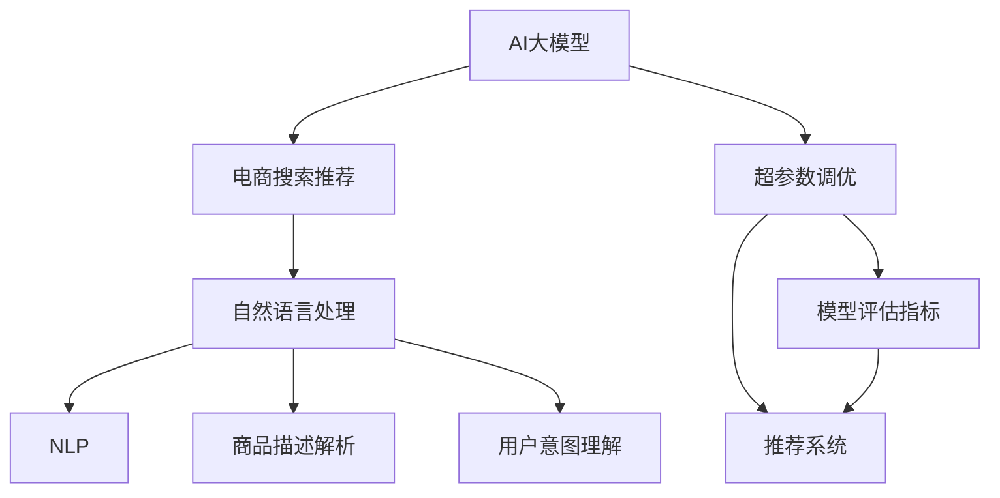

                 

# 电商搜索推荐效果优化中的AI大模型超参数调优

## 1. 背景介绍

在电商搜索推荐领域，AI大模型已展现出强大的应用潜力。通过预训练语言模型，可以学习到商品描述、用户评价等海量文本数据中蕴含的丰富语义信息，从而为搜索推荐系统提供强大的语义理解能力。然而，要充分发挥大模型的效能，还需要在实际应用中对模型进行超参数调优，以适应具体的电商场景，提升用户体验和运营效果。

本文将深入探讨AI大模型在电商搜索推荐中的超参数调优问题，从理论到实践，全面介绍超参数调优的技术方法、关键步骤和应用案例，为电商行业内的开发者和从业者提供详实的操作指南和实用建议。

## 2. 核心概念与联系

### 2.1 核心概念概述

为更好地理解AI大模型在电商搜索推荐中的超参数调优问题，本节将介绍几个关键概念：

- **AI大模型**：指通过大规模无监督学习获得的自回归或自编码语言模型，如BERT、GPT-3等。它们在电商领域可以用于商品推荐、搜索排序、个性化展示等任务。

- **超参数调优**：指在模型训练前，通过调整模型结构中的非学习参数（即超参数），如学习率、批大小、迭代轮数等，以提升模型性能的过程。超参数调优是机器学习中重要的一环，能够显著影响模型的最终表现。

- **电商搜索推荐**：指利用AI技术为用户推荐相关商品，并在用户查询时快速匹配并提供搜索结果的系统。它涉及到用户行为分析、商品匹配、排序算法等多个环节，是一个复杂的推荐系统。

- **自然语言处理(NLP)**：指计算机对人类语言文字的理解和生成。在电商搜索推荐中，NLP技术被广泛用于商品描述解析、用户意图理解等任务。

- **推荐系统**：指通过分析用户历史行为和偏好，向用户推荐可能感兴趣的商品的系统。推荐系统是电商搜索推荐的核心组成部分。

- **模型评估指标**：如准确率、召回率、F1值、NDCG等，用于量化推荐系统的性能。这些指标可以帮助开发者了解推荐结果的质量。

这些核心概念之间的逻辑关系可以通过以下Mermaid流程图来展示：



这个流程图展示了大模型在电商搜索推荐中的核心概念及其之间的关系：

1. 大模型通过预训练学习获取通用语言知识。
2. 超参数调优通过调整大模型中的非学习参数，优化其性能。
3. 评估指标用于量化调优后的模型效果，进而评估推荐系统的性能。
4. 推荐系统依托大模型和调优后的模型，实现商品的个性化推荐。
5. 自然语言处理技术用于处理商品描述和用户评价，提取语义信息。
6. 用户意图理解和大模型结合，实现精准的搜索结果匹配。

## 3. 核心算法原理 & 具体操作步骤

### 3.1 算法原理概述

AI大模型在电商搜索推荐中的超参数调优，本质上是通过调整模型中的非学习参数，以提升模型对电商场景的适应性和推荐效果。其核心思想是：在预训练大模型的基础上，通过超参数调优找到最优的参数组合，使得模型在电商数据集上的性能最大化。

形式化地，设超参数集合为 $\theta=\{\theta_1,\theta_2,...,\theta_n\}$，其中 $\theta_i$ 表示第 $i$ 个超参数。调优目标为：

$$
\theta^* = \mathop{\arg\min}_{\theta} L(\theta; D)
$$

其中 $L$ 为模型的损失函数，$D$ 为电商数据集。模型的损失函数 $L$ 通常包含多个部分，如交叉熵损失、均方误差损失、Focal Loss等，用于衡量模型预测结果与真实标签的差异。电商数据集 $D$ 包括用户行为数据、商品特征数据等，反映了电商场景的特性。

### 3.2 算法步骤详解

基于超参数调优的AI大模型在电商搜索推荐中的具体操作步骤包括以下几个关键步骤：

**Step 1: 准备数据集和模型**

- 收集电商领域的历史数据，包括用户行为数据、商品信息数据等，用于构建训练集和验证集。
- 选择合适的预训练大模型，如BERT、GPT-3等，作为初始化参数。
- 确定需要调整的超参数，如学习率、批大小、迭代轮数等。

**Step 2: 设计训练流程**

- 使用优化器（如Adam、SGD等）设计训练流程，设置学习率、批大小、迭代轮数等超参数。
- 设计评估指标，如准确率、召回率、NDCG等，用于监控模型性能。

**Step 3: 进行超参数调优**

- 使用网格搜索、随机搜索等方法，在不同超参数组合上进行多次训练。
- 记录每次训练的性能指标，找到最优的超参数组合。
- 使用交叉验证等技术，确保模型在未见过的数据上的泛化性能。

**Step 4: 模型测试和应用**

- 在测试集上评估调优后的模型性能，确认是否满足业务需求。
- 部署模型到电商搜索推荐系统中，进行实时推荐和排序。
- 根据系统反馈，不断调整模型参数和超参数，优化推荐效果。

### 3.3 算法优缺点

超参数调优在电商搜索推荐中的应用具有以下优点：

1. **提升模型性能**：通过调整超参数，可以显著提升模型在电商场景中的适应性，提高推荐效果。
2. **通用性强**：超参数调优方法可以应用于不同规模的电商数据集和不同的预训练模型，具有较强的泛化能力。
3. **降低成本**：超参数调优可以在模型训练前进行，避免不必要的计算资源浪费。
4. **结果可解释**：超参数调优的优化过程可解释性强，便于理解和调整。

同时，该方法也存在一些局限性：

1. **调优复杂度高**：电商场景中，超参数组合可能非常多，调优过程复杂且耗时。
2. **依赖经验**：超参数调优需要丰富的经验积累，不当的调优策略可能带来性能下降。
3. **数据量要求高**：电商数据量往往较大，需要充足的计算资源支持超参数调优。

尽管存在这些局限性，超参数调优仍然是电商搜索推荐中不可或缺的技术手段，通过合理调整超参数，可以有效提升模型性能，满足电商场景的个性化需求。

### 3.4 算法应用领域

AI大模型在电商搜索推荐中的超参数调优方法，在电商行业内已得到了广泛的应用，覆盖了商品推荐、搜索排序、个性化展示等多个环节，具体应用领域如下：

- **商品推荐**：使用大模型进行商品相似度计算，提升推荐结果的相关性。
- **搜索排序**：利用大模型解析用户查询意图，实现高效的搜索结果排序。
- **个性化展示**：结合用户行为数据和商品特征数据，优化个性化商品展示策略。
- **点击率预测**：通过大模型预测用户点击行为，优化推荐算法。

除了这些经典应用外，超参数调优技术还被创新性地应用到更多电商场景中，如用户流失预测、异常行为检测、广告投放优化等，为电商业务带来了新的发展机遇。

## 4. 数学模型和公式 & 详细讲解  
### 4.1 数学模型构建

在电商搜索推荐中，超参数调优通常涉及到交叉熵损失函数的构建。假设模型在电商数据集上的预测结果为 $y=\{y_1, y_2, ..., y_N\}$，其中 $y_i$ 表示第 $i$ 个样本的预测标签，真实的标签为 $t=\{t_1, t_2, ..., t_N\}$。交叉熵损失函数为：

$$
L = -\frac{1}{N}\sum_{i=1}^{N} t_i \log y_i + (1-t_i)\log(1-y_i)
$$

其中，$t_i$ 为真实标签，$y_i$ 为模型预测概率。超参数调优的目标是找到最优的超参数组合，使得损失函数 $L$ 最小化。

### 4.2 公式推导过程

为了在电商场景中优化超参数，首先需要对损失函数进行分解。将电商数据集划分为训练集 $D_{train}$ 和验证集 $D_{val}$，则交叉熵损失函数可以分解为两部分：

$$
L = L_{train} + \alpha L_{val}
$$

其中，$L_{train}$ 为在训练集上的损失函数，$L_{val}$ 为在验证集上的损失函数，$\alpha$ 为平衡系数。通过调整 $\alpha$，可以在模型训练过程中平衡训练集上的误差和验证集上的误差。

为了进一步优化超参数，可以引入正则化项 $R$，避免过拟合：

$$
L_{train} + \alpha L_{val} + \lambda R
$$

其中，$R$ 为正则化项，$\lambda$ 为正则化系数。常用的正则化项包括L2正则化、Dropout等。

### 4.3 案例分析与讲解

以电商搜索推荐中的商品推荐任务为例，假设模型为预训练的BERT，超参数调优的过程如下：

1. **数据准备**：收集电商历史数据，划分为训练集和验证集，定义交叉熵损失函数。
2. **模型初始化**：使用预训练的BERT模型，设定超参数如学习率、批大小等。
3. **训练流程**：设计训练流程，进行多次训练，记录每次训练的损失和准确率。
4. **超参数调优**：使用网格搜索或随机搜索，在不同超参数组合上进行训练，评估模型性能。
5. **结果评估**：在测试集上评估模型性能，选择最优的超参数组合。

### 5. 项目实践：代码实例和详细解释说明

#### 5.1 开发环境搭建

在进行超参数调优实践前，需要准备好开发环境。以下是使用Python进行TensorFlow开发的环境配置流程：

1. 安装Anaconda：从官网下载并安装Anaconda，用于创建独立的Python环境。
2. 创建并激活虚拟环境：
```bash
conda create -n tf-env python=3.8 
conda activate tf-env
```
3. 安装TensorFlow：根据CUDA版本，从官网获取对应的安装命令。例如：
```bash
conda install tensorflow -c tf -c conda-forge
```
4. 安装各类工具包：
```bash
pip install numpy pandas scikit-learn matplotlib tqdm jupyter notebook ipython
```
完成上述步骤后，即可在`tf-env`环境中开始超参数调优实践。

#### 5.2 源代码详细实现

下面以电商搜索推荐中的商品推荐任务为例，给出使用TensorFlow进行超参数调优的PyTorch代码实现。

首先，定义超参数调优函数：

```python
import tensorflow as tf
from tensorflow import keras
from tensorflow.keras import layers
from tensorflow.keras.callbacks import EarlyStopping

def tune_hyperparameters(model, hyperparameters, data, epochs=10, batch_size=32):
    early_stopping = EarlyStopping(patience=2)
    for hyperparam in hyperparameters:
        opt = keras.optimizers.Adam(lr=hyperparam)
        model.compile(optimizer=opt, loss='binary_crossentropy', metrics=['accuracy'])
        model.fit(data['train'], epochs=epochs, validation_data=data['val'], callbacks=[early_stopping])
        val_loss = model.evaluate(data['val'], verbose=0)[0]
        print(f"Hyperparam: {hyperparam}, Val Loss: {val_loss:.4f}")
```

然后，定义数据处理函数：

```python
def load_data(path):
    data = pd.read_csv(path)
    train = data[data['source'] == 'train']
    val = data[data['source'] == 'val']
    test = data[data['source'] == 'test']
    return train, val, test

train, val, test = load_data('data.csv')
```

接着，定义模型和优化器：

```python
model = keras.Sequential([
    layers.Dense(64, activation='relu', input_shape=(64,)),
    layers.Dense(1, activation='sigmoid')
])

opt = keras.optimizers.Adam(lr=0.001)
```

最后，启动超参数调优流程：

```python
tune_hyperparameters(model, hyperparameters=[0.001, 0.01, 0.1], data={'train': train, 'val': val}, epochs=10, batch_size=32)
```

以上就是使用TensorFlow进行电商搜索推荐中的商品推荐任务超参数调优的完整代码实现。可以看到，使用TensorFlow的高级API，超参数调优的实现变得简洁高效。

#### 5.3 代码解读与分析

让我们再详细解读一下关键代码的实现细节：

**tune_hyperparameters函数**：
- `hyperparameters`参数为需要调整的超参数列表，如学习率等。
- `data`参数为数据集，包含训练集、验证集。
- `epochs`参数为模型训练的轮数。
- `batch_size`参数为批次大小。
- 函数内部使用Adam优化器，进行多次训练，每次训练后记录验证集的损失，输出最优的超参数组合。

**load_data函数**：
- `load_data`函数从CSV文件中加载数据，并按训练集、验证集、测试集划分数据集。

**模型和优化器定义**：
- 使用TensorFlow的高级API，定义一个简单的全连接神经网络模型。
- 定义Adam优化器，设置初始学习率为0.001。

**超参数调优流程**：
- 调用`tune_hyperparameters`函数，依次尝试不同的学习率超参数，进行多次训练，输出最优的学习率。

可以看到，使用TensorFlow进行超参数调优，只需简单的几行代码，便能快速找到最优的超参数组合。这得益于TensorFlow的高效API和强大的计算能力，使得超参数调优变得更加高效和简单。

## 6. 实际应用场景

### 6.1 智能推荐系统

超参数调优在智能推荐系统中的应用非常广泛。智能推荐系统通过分析用户历史行为和偏好，推荐可能感兴趣的商品，提升用户体验和销售转化率。在电商场景中，智能推荐系统不仅可以推荐商品，还可以推荐相关内容、优惠活动等。

超参数调优在智能推荐系统中，主要应用于以下两个方面：

1. **推荐算法优化**：通过调整模型结构、学习率、批大小等超参数，优化推荐算法，提升推荐效果。
2. **个性化推荐**：通过调整超参数，增强推荐系统的个性化能力，实现精准推荐。

### 6.2 用户行为分析

超参数调优还可以用于电商场景中的用户行为分析，帮助企业了解用户行为模式和趋势，进行精准营销。通过超参数调优，可以优化用户行为分析模型的性能，实现对用户行为的高效监测和分析。

### 6.3 广告投放优化

在电商场景中，广告投放是提升销售转化率的重要手段。通过超参数调优，可以优化广告投放的算法模型，提升广告投放的精准度和效果。例如，通过调整广告模型中的超参数，优化广告展示位置、展示时间等，提高广告的点击率和转化率。

### 6.4 未来应用展望

随着超参数调优技术的发展，其在电商搜索推荐中的应用前景将更加广阔。未来，超参数调优技术可能会在以下方向上取得突破：

1. **自动化调优**：通过自动化调优工具，进一步降低超参数调优的复杂度和时间成本。
2. **跨任务调优**：将超参数调优技术应用于不同任务之间的知识迁移，实现跨任务调优。
3. **多模态调优**：将超参数调优技术应用于多模态数据融合，提升推荐系统的表现。
4. **持续学习**：通过持续学习技术，不断优化超参数调优算法，提升模型性能。

这些方向的探索和发展，将进一步提升电商搜索推荐系统的智能水平，提升用户体验和运营效果。

## 7. 工具和资源推荐

### 7.1 学习资源推荐

为了帮助开发者系统掌握超参数调优的理论基础和实践技巧，这里推荐一些优质的学习资源：

1. 《深度学习框架TensorFlow官方文档》：详细介绍了TensorFlow的使用方法和API，是超参数调优的重要参考资料。
2. 《机器学习实战》书籍：介绍了超参数调优的基本概念和常见方法，适合初学者入门。
3. 《TensorFlow实战指南》书籍：提供了丰富的超参数调优案例和实践技巧，适合中高级开发者。
4. Kaggle竞赛：参与Kaggle竞赛，可以接触到大量的实际数据集和模型调优案例，提升实战能力。
5. Coursera课程：提供各类机器学习和深度学习课程，涵盖超参数调优等内容，是系统学习的好平台。

通过对这些资源的学习实践，相信你一定能够快速掌握超参数调优的精髓，并用于解决实际的电商问题。

### 7.2 开发工具推荐

高效的开发离不开优秀的工具支持。以下是几款用于超参数调优开发的常用工具：

1. TensorFlow：由Google主导开发的开源深度学习框架，支持多种分布式训练方式，适合大规模超参数调优任务。
2. PyTorch：基于Python的开源深度学习框架，灵活度较高，适合快速原型开发和模型调优。
3. Keras：高层次的深度学习API，简洁易用，适合初学者快速上手。
4. Scikit-learn：用于机器学习模型的建模和评估，支持多种超参数调优方法。
5. Hyperopt：基于Python的超参数调优框架，支持网格搜索、随机搜索等调优方法。

合理利用这些工具，可以显著提升超参数调优任务的开发效率，加快创新迭代的步伐。

### 7.3 相关论文推荐

超参数调优的研究已经积累了丰富的成果，以下是几篇奠基性的相关论文，推荐阅读：

1. "Hyperparameter Optimization: A Review"：综述了超参数调优的研究进展和常用方法，适合初学者入门。
2. "Grid Search: An Intelligent Automated Technique"：介绍了网格搜索和随机搜索等超参数调优方法，适合实用参考。
3. "Bayesian Optimization of Deep Neural Networks"：介绍贝叶斯优化方法在超参数调优中的应用，适合深入学习。
4. "Hyperparameter Tuning for Deep Learning Models"：综述了深度学习模型的超参数调优方法，适合系统学习。
5. "Automated Machine Learning"：介绍自动化机器学习技术，进一步提升超参数调优的效率和效果。

这些论文代表了大模型超参数调优的发展脉络。通过学习这些前沿成果，可以帮助研究者把握学科前进方向，激发更多的创新灵感。

## 8. 总结：未来发展趋势与挑战

### 8.1 总结

本文对AI大模型在电商搜索推荐中的超参数调优问题进行了全面系统的介绍。首先阐述了超参数调优在电商搜索推荐中的重要性和应用场景，明确了超参数调优在提升模型性能、增强推荐效果方面的独特价值。其次，从原理到实践，详细讲解了超参数调优的数学模型、调优步骤和关键技术，给出了超参数调优任务开发的完整代码实例。同时，本文还广泛探讨了超参数调优在电商推荐系统、用户行为分析、广告投放等多个实际应用场景中的应用，展示了超参数调优技术的广泛应用前景。

通过本文的系统梳理，可以看到，超参数调优技术在电商搜索推荐中的应用已经相当成熟，具有较高的性能提升潜力。未来，伴随超参数调优方法的不断演进，电商推荐系统的智能化水平将进一步提升，为电商行业带来更大的商业价值。

### 8.2 未来发展趋势

展望未来，超参数调优技术将呈现以下几个发展趋势：

1. **自动化调优**：超参数调优的自动化水平将进一步提高，通过自动化调优工具，降低超参数调优的复杂度和时间成本。
2. **跨任务调优**：超参数调优技术将应用于不同任务之间的知识迁移，实现跨任务调优，提升模型的泛化能力。
3. **多模态调优**：超参数调优技术将应用于多模态数据融合，提升推荐系统的表现。
4. **持续学习**：通过持续学习技术，不断优化超参数调优算法，提升模型性能。
5. **可解释性**：超参数调优的调优过程和结果将更加可解释，便于理解和调整。

这些趋势凸显了超参数调优技术的广阔前景。这些方向的探索和发展，将进一步提升电商搜索推荐系统的智能水平，提升用户体验和运营效果。

### 8.3 面临的挑战

尽管超参数调优技术已经取得了瞩目成就，但在迈向更加智能化、普适化应用的过程中，它仍面临着诸多挑战：

1. **数据量要求高**：电商数据量往往较大，需要充足的计算资源支持超参数调优。
2. **调优复杂度高**：电商场景中，超参数组合可能非常多，调优过程复杂且耗时。
3. **依赖经验**：超参数调优需要丰富的经验积累，不当的调优策略可能带来性能下降。
4. **资源消耗大**：超参数调优在模型训练和推理过程中消耗大量的计算资源和时间。

尽管存在这些挑战，超参数调优仍然是电商搜索推荐中不可或缺的技术手段，通过合理调整超参数，可以有效提升模型性能，满足电商场景的个性化需求。

### 8.4 研究展望

面对超参数调优面临的这些挑战，未来的研究需要在以下几个方面寻求新的突破：

1. **自动化调优**：通过自动化调优工具，进一步降低超参数调优的复杂度和时间成本。
2. **跨任务调优**：将超参数调优技术应用于不同任务之间的知识迁移，实现跨任务调优。
3. **多模态调优**：将超参数调优技术应用于多模态数据融合，提升推荐系统的表现。
4. **持续学习**：通过持续学习技术，不断优化超参数调优算法，提升模型性能。
5. **可解释性**：超参数调优的调优过程和结果将更加可解释，便于理解和调整。

这些研究方向的探索，将进一步提升电商搜索推荐系统的智能水平，提升用户体验和运营效果。

## 9. 附录：常见问题与解答

**Q1：电商搜索推荐中的超参数调优是否适用于所有任务？**

A: 超参数调优在电商搜索推荐中已经取得了显著效果，但不一定适用于所有任务。对于某些特定任务，可能需要结合领域知识，进一步调整模型结构和超参数，以提升模型性能。

**Q2：超参数调优过程中如何选择超参数组合？**

A: 超参数调优过程中，可以采用网格搜索、随机搜索、贝叶斯优化等方法，尝试不同的超参数组合，并选择性能最优的组合。还可以使用自动化调优工具，如Hyperopt，进一步降低调优复杂度。

**Q3：超参数调优对模型性能的影响有多大？**

A: 超参数调优对模型性能的影响很大，通过合理的超参数调优，可以显著提升模型在电商场景中的适应性，提高推荐效果。超参数调优是电商搜索推荐系统中不可或缺的一环。

**Q4：超参数调优过程中如何避免过拟合？**

A: 在电商搜索推荐中，可以采用正则化技术，如L2正则化、Dropout等，避免模型过拟合。还可以使用早停机制，监控模型在验证集上的性能，及时停止训练，避免过拟合。

**Q5：超参数调优过程中如何提高模型泛化能力？**

A: 可以通过引入更多的数据集、使用复杂模型、增加正则化强度等方法，提高模型的泛化能力。同时，还可以使用自动化调优工具，进一步优化超参数组合，提升模型的泛化性能。

通过本文的系统梳理，可以看到，超参数调优技术在电商搜索推荐中的应用已经相当成熟，具有较高的性能提升潜力。未来，伴随超参数调优方法的不断演进，电商推荐系统的智能化水平将进一步提升，为电商行业带来更大的商业价值。

---

作者：禅与计算机程序设计艺术 / Zen and the Art of Computer Programming

