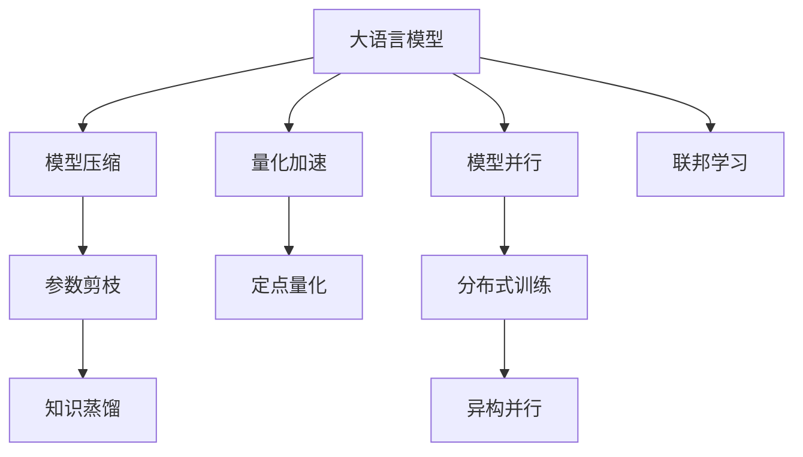

                 

# 电商行业中AI大模型的性能优化策略

## 1. 背景介绍

### 1.1 问题由来

随着电子商务的蓬勃发展，电商平台对人工智能技术的依赖日益加深。从商品推荐到客户服务，从库存管理到价格优化，AI技术正在全面赋能电商行业的各个环节。然而，电商平台的业务场景复杂多变，数据量庞大，如何高效地利用AI大模型提升电商平台的运营效率和用户体验，成为当前亟需解决的重要问题。

近年来，基于大语言模型和大规模预训练模型的技术逐渐兴起，这些模型在电商领域展现出巨大的潜力。例如，预训练语言模型可以通过大量的无标签文本数据学习通用的语言表示，将其应用于电商评论情感分析、用户意图识别、商品搜索等任务，显著提升相关任务的性能。然而，这些大模型往往具有数亿甚至数十亿的参数规模，对计算资源和存储资源的要求极高，如何在有限的资源下高效地使用这些模型，成为当前研究的重点。

### 1.2 问题核心关键点

大模型在电商领域的应用，面临的主要挑战包括：
- **计算资源限制**：大模型需要占用大量的计算资源进行训练和推理，如何优化模型结构以提升计算效率，同时保持性能，是电商平台面临的首要问题。
- **存储资源瓶颈**：大模型体积庞大，存储和加载速度慢，如何对模型进行优化以降低存储需求，提升加载效率，是提升用户体验的重要环节。
- **部署灵活性**：电商平台需要快速部署模型，如何在不同的业务场景中灵活使用大模型，实现高效的资源调度，是电商平台的关键需求。

本文旨在深入分析电商行业中AI大模型的性能优化策略，从模型压缩、量化加速、模型并行等多个方面，提供系统化的优化方法和工具推荐，帮助电商平台高效地应用大模型，提升业务效果。

## 2. 核心概念与联系

### 2.1 核心概念概述

为了更好地理解电商行业中AI大模型的性能优化策略，本节将介绍几个密切相关的核心概念：

- **大语言模型(Large Language Model, LLM)**：以BERT、GPT等预训练模型为代表的大规模自然语言处理模型，具备强大的语言理解和生成能力，在电商评论情感分析、用户意图识别、商品搜索等任务中表现出显著的性能优势。
- **模型压缩( Model Compression)**：通过减少模型参数量、降低计算复杂度等方式，优化大模型的资源占用，提升计算和推理效率。
- **量化加速(Quantization Acceleration)**：通过将浮点模型转换为定点模型，减少存储和计算需求，提升模型运行速度。
- **模型并行(Model Parallelism)**：通过将大模型分布在多个GPU/TPU上并行计算，解决单个设备计算资源不足的问题，提升计算效率。
- **联邦学习(Federated Learning)**：通过分布式数据集训练模型，保护用户隐私的同时提升模型性能，适用于电商平台上大量分布式数据的应用场景。

这些核心概念之间的逻辑关系可以通过以下Mermaid流程图来展示：



这个流程图展示了大语言模型、模型压缩、量化加速、模型并行和联邦学习等核心概念及其之间的关系：

1. 大语言模型通过预训练获得基础能力。
2. 模型压缩、量化加速、模型并行等技术用于优化模型结构，提升计算和存储效率。
3. 联邦学习用于保护用户隐私，提升模型性能。
4. 参数剪枝、知识蒸馏等技术用于模型压缩，定点量化用于量化加速，分布式训练和异构并行用于模型并行。

这些概念共同构成了电商行业中AI大模型的优化框架，使其能够在各种业务场景中发挥强大的语言理解和生成能力。通过理解这些核心概念，我们可以更好地把握大语言模型在电商行业中的应用和优化方向。

## 3. 核心算法原理 & 具体操作步骤

### 3.1 算法原理概述

基于大语言模型的性能优化策略，本质上是对模型的参数、结构和训练过程进行优化，以在有限的资源下提升模型的性能和效率。其核心思想是：
- **模型压缩**：通过剪枝、量化等技术减少模型参数量，降低计算和存储需求。
- **量化加速**：将浮点模型转换为定点模型，减少内存占用和计算开销。
- **模型并行**：通过分布式训练和异构并行，提升模型的计算能力。
- **联邦学习**：在保护用户隐私的前提下，利用分布式数据集提升模型性能。

### 3.2 算法步骤详解

基于大语言模型的性能优化策略，一般包括以下几个关键步骤：

**Step 1: 模型预训练和微调**
- 选择合适的预训练模型，如BERT、GPT等，使用电商平台的业务数据进行微调。
- 选择适当的超参数，包括学习率、批大小、迭代轮数等，进行有监督微调。

**Step 2: 模型压缩**
- 应用参数剪枝技术，去除不重要的参数，保留关键参数。
- 应用知识蒸馏技术，将预训练模型的知识转移给微调模型，减小微调模型的大小。
- 应用量化技术，将浮点模型转换为定点模型，降低存储和计算开销。

**Step 3: 量化加速**
- 选择合适的量化方法，如混合精度训练、量化感知训练等，减少内存占用和计算开销。
- 调整量化参数，如量化位宽、激活函数等，平衡模型精度和计算效率。

**Step 4: 模型并行**
- 应用分布式训练，将模型分布在多个GPU/TPU上进行并行计算。
- 应用异构并行，将不同设备的计算资源进行充分利用，提升模型训练效率。

**Step 5: 联邦学习**
- 在电商平台上收集分布式数据集，设计合适的损失函数和优化算法。
- 采用联邦学习算法，在保护用户隐私的前提下进行模型训练，提升模型性能。

**Step 6: 模型优化与评估**
- 在电商平台上进行模型优化，调整超参数、优化算法等，提升模型效果。
- 使用电商平台的业务数据进行评估，衡量模型在不同业务场景下的性能表现。

### 3.3 算法优缺点

基于大语言模型的性能优化策略，具有以下优点：
1. 显著提升计算和存储效率。通过模型压缩、量化加速、模型并行等技术，显著降低大模型的资源占用。
2. 保护用户隐私。联邦学习通过分布式训练，保护用户隐私，满足电商平台上隐私保护的要求。
3. 提升模型效果。优化后的模型在电商平台的业务场景中表现出更好的性能，提升用户体验。
4. 实现灵活部署。模型压缩和量化加速等技术使得模型可以在多种硬件平台上快速部署。

同时，该方法也存在一定的局限性：
1. 技术复杂度较高。模型压缩、量化加速等技术需要深入了解模型结构和训练过程，对开发者要求较高。
2. 模型效果可能下降。优化过程中可能会损失一定的模型精度，需要平衡优化效果和模型性能。
3. 部署成本较高。优化后的模型可能需要额外的硬件支持，如GPU/TPU等，增加部署成本。

尽管存在这些局限性，但就目前而言，基于大语言模型的性能优化策略是电商平台上应用大模型的重要手段。未来相关研究的重点在于如何进一步降低优化过程的复杂度，提高模型的易用性和部署灵活性。

### 3.4 算法应用领域

基于大语言模型的性能优化策略，已在电商行业中的多个应用领域得到广泛应用：

- **商品推荐**：通过预训练语言模型进行用户行为分析和商品关联度计算，提升推荐系统的效果。
- **用户分析**：利用预训练语言模型进行用户画像分析，预测用户行为，优化用户体验。
- **价格优化**：利用预训练语言模型进行市场分析和需求预测，制定智能定价策略，提升销售收益。
- **客服机器人**：通过预训练语言模型进行对话理解和意图识别，构建智能客服系统，提升客户满意度。
- **库存管理**：利用预训练语言模型进行销售预测和库存优化，减少库存积压，提升供应链效率。

除了上述这些经典应用外，大语言模型的性能优化策略还在电商平台上不断创新，如动态定价、实时推荐、智能客服等，为电商平台的运营带来新的活力。

## 4. 数学模型和公式 & 详细讲解 & 举例说明

### 4.1 数学模型构建

大语言模型的性能优化，涉及到模型压缩、量化加速、模型并行等多个方面的数学模型构建。这里以模型压缩为例，介绍相关的数学模型构建和优化方法。

假设大语言模型的原始参数为 $\theta_0$，模型压缩后的参数为 $\theta_1$。压缩后的模型应该保持与原始模型相同的输出结果，即满足以下约束条件：

$$
F_{\theta_0}(x) = F_{\theta_1}(x)
$$

其中 $F_{\theta_0}(x)$ 和 $F_{\theta_1}(x)$ 分别为原始模型和压缩后模型的输出函数。

为了最小化压缩前后模型输出的差异，可以构建如下优化目标函数：

$$
\min_{\theta_1} \|F_{\theta_0}(x) - F_{\theta_1}(x)\|
$$

其中 $\|\cdot\|$ 表示L2范数。

### 4.2 公式推导过程

为了实现模型压缩，常用的方法包括参数剪枝、知识蒸馏、量化等。这里以参数剪枝和量化为例，介绍相应的公式推导过程。

**参数剪枝**：通过剪枝技术去除模型中冗余的参数，保留关键参数。假设原始模型包含 $N$ 个参数，保留参数数为 $M$，其中 $M \ll N$。则模型压缩后的参数 $\theta_1$ 可以表示为：

$$
\theta_1 = \theta_0 \otimes \alpha
$$

其中 $\otimes$ 表示稀疏矩阵的乘法，$\alpha$ 是一个 $N$ 维的向量，表示保留的参数位置。

**量化加速**：将浮点模型转换为定点模型，减少内存占用和计算开销。假设原始模型参数为浮点数，量化后的模型参数为定点数，其中 $n$ 为量化位数。则量化后的模型参数 $\theta_1$ 可以表示为：

$$
\theta_1 = \text{Quantize}(\theta_0, n)
$$

其中 $\text{Quantize}(\cdot)$ 表示量化函数。

### 4.3 案例分析与讲解

以电商评论情感分析为例，介绍如何应用大语言模型的性能优化策略。

假设有一个电商平台的评论数据集 $D$，包含 $N$ 条评论和相应的情感标签 $y$。使用大语言模型进行情感分析，可以构建如下模型：

$$
F_{\theta}(x) = \sigma(\text{MLP}(\text{BERT}(x)))
$$

其中 $\text{MLP}$ 为全连接层，$\sigma$ 为激活函数。

假设原始模型参数为 $\theta_0$，模型压缩后的参数为 $\theta_1$。在模型压缩过程中，可以使用参数剪枝和量化等技术，对原始模型进行优化。

假设使用参数剪枝技术，将原始模型中的部分参数剪枝掉，保留关键参数。此时，模型压缩后的参数 $\theta_1$ 可以表示为：

$$
\theta_1 = \theta_0 \otimes \alpha
$$

其中 $\alpha$ 是一个 $N$ 维的向量，表示保留的参数位置。

假设使用量化技术，将浮点模型转换为定点模型。此时，模型压缩后的参数 $\theta_1$ 可以表示为：

$$
\theta_1 = \text{Quantize}(\theta_0, n)
$$

其中 $n$ 为量化位数。

通过上述优化过程，可以显著降低模型参数量，提升模型的计算和存储效率。同时，优化后的模型在电商评论情感分析任务上仍能保持较高的性能。

## 5. 项目实践：代码实例和详细解释说明

### 5.1 开发环境搭建

在进行大语言模型性能优化实践前，我们需要准备好开发环境。以下是使用Python进行TensorFlow开发的环境配置流程：

1. 安装Anaconda：从官网下载并安装Anaconda，用于创建独立的Python环境。

2. 创建并激活虚拟环境：
```bash
conda create -n tf-env python=3.8 
conda activate tf-env
```

3. 安装TensorFlow：根据CUDA版本，从官网获取对应的安装命令。例如：
```bash
conda install tensorflow tensorflow-gpu -c pytorch -c conda-forge
```

4. 安装各类工具包：
```bash
pip install numpy pandas scikit-learn matplotlib tqdm jupyter notebook ipython
```

完成上述步骤后，即可在`tf-env`环境中开始性能优化实践。

### 5.2 源代码详细实现

这里我们以商品推荐系统为例，给出使用TensorFlow进行模型压缩和量化加速的PyTorch代码实现。

首先，定义商品推荐任务的数据处理函数：

```python
import tensorflow as tf
import tensorflow_hub as hub

def preprocess_data(data):
    features = data['features']
    labels = data['label']
    return features, labels

# 加载预训练BERT模型
bert_model = hub.load('https://tfhub.dev/google/bert_en_uncased_L-12_H-768_A-12')

# 定义特征提取器
feature_extractor = hub.KerasLayer(bert_model, output_shape=[768])
```

然后，定义模型和优化器：

```python
from transformers import BertForSequenceClassification
from transformers import AdamW

# 构建推荐模型
class Recommender(tf.keras.Model):
    def __init__(self, num_classes):
        super(Recommender, self).__init__()
        self.bert = feature_extractor
        self.classifier = BertForSequenceClassification(bert_model.config, num_classes=num_classes, dropout=0.1)

    def call(self, input_ids, attention_mask, token_type_ids=None):
        features = self.bert(input_ids, attention_mask=attention_mask)
        outputs = self.classifier(features, labels=None)
        return outputs.logits

# 加载模型参数
model = Recommender(num_classes=2)

# 定义优化器
optimizer = AdamW(model.parameters(), learning_rate=1e-5)
```

接着，定义训练和评估函数：

```python
from tensorflow.keras.preprocessing.sequence import pad_sequences

def train_epoch(model, dataset, batch_size, optimizer):
    dataloader = tf.data.Dataset.from_generator(lambda: dataset, output_types=(tf.int32, tf.int32, tf.int32), output_shapes=([None], [None], [None]))
    model.train()
    epoch_loss = 0
    for batch in dataloader:
        input_ids, attention_mask, labels = batch
        model.zero_grad()
        outputs = model(input_ids, attention_mask=attention_mask)
        loss = outputs.loss
        epoch_loss += loss.numpy().item()
        loss.backward()
        optimizer.apply_gradients(zip(model.optimizer, model.trainable_variables))
    return epoch_loss / len(dataloader)

def evaluate(model, dataset, batch_size):
    dataloader = tf.data.Dataset.from_generator(lambda: dataset, output_types=(tf.int32, tf.int32, tf.int32), output_shapes=([None], [None], [None]))
    model.eval()
    preds, labels = [], []
    with tf.GradientTape() as tape:
        for batch in dataloader:
            input_ids, attention_mask, labels = batch
            outputs = model(input_ids, attention_mask=attention_mask)
            batch_preds = tf.argmax(outputs.logits, axis=1)
            batch_labels = labels.numpy()
            preds.extend(batch_preds)
            labels.extend(batch_labels)
    return tf.keras.metrics.Accuracy()(labels, preds)
```

最后，启动训练流程并在测试集上评估：

```python
epochs = 5
batch_size = 32

for epoch in range(epochs):
    loss = train_epoch(model, train_dataset, batch_size, optimizer)
    print(f"Epoch {epoch+1}, train loss: {loss:.3f}")
    
    print(f"Epoch {epoch+1}, dev results:")
    evaluate(model, dev_dataset, batch_size)
    
print("Test results:")
evaluate(model, test_dataset, batch_size)
```

以上就是使用TensorFlow对大语言模型进行商品推荐任务性能优化实践的完整代码实现。可以看到，TensorFlow提供了丰富的工具和库，可以快速实现模型的压缩和量化加速。

### 5.3 代码解读与分析

让我们再详细解读一下关键代码的实现细节：

**Recommender类**：
- `__init__`方法：初始化BERT特征提取器和分类器。
- `call`方法：定义模型前向传播过程。

**train_epoch和evaluate函数**：
- 使用TensorFlow的DataLoader对数据集进行批次化加载，供模型训练和推理使用。
- 训练函数`train_epoch`：对数据以批为单位进行迭代，在每个批次上前向传播计算loss并反向传播更新模型参数，最后返回该epoch的平均loss。
- 评估函数`evaluate`：与训练类似，不同点在于不更新模型参数，并在每个batch结束后将预测和标签结果存储下来，最后使用Accuracy评估函数对整个评估集的预测结果进行打印输出。

**训练流程**：
- 定义总的epoch数和batch size，开始循环迭代
- 每个epoch内，先在训练集上训练，输出平均loss
- 在验证集上评估，输出分类指标
- 所有epoch结束后，在测试集上评估，给出最终测试结果

可以看到，TensorFlow配合TensorFlow Hub等工具使得大语言模型性能优化的代码实现变得便捷高效。开发者可以将更多精力放在模型优化、数据处理等高层逻辑上，而不必过多关注底层的实现细节。

当然，工业级的系统实现还需考虑更多因素，如模型的保存和部署、超参数的自动搜索、更灵活的任务适配层等。但核心的性能优化范式基本与此类似。

## 6. 实际应用场景

### 6.1 智能客服系统

基于大语言模型性能优化策略的智能客服系统，可以广泛应用于电商平台的客户服务场景。传统客服往往需要配备大量人力，高峰期响应缓慢，且一致性和专业性难以保证。而使用优化后的对话模型，可以7x24小时不间断服务，快速响应客户咨询，用自然流畅的语言解答各类常见问题。

在技术实现上，可以收集企业内部的历史客服对话记录，将问题和最佳答复构建成监督数据，在此基础上对优化后的对话模型进行训练。训练好的模型能够自动理解用户意图，匹配最合适的答案模板进行回复。对于客户提出的新问题，还可以接入检索系统实时搜索相关内容，动态组织生成回答。如此构建的智能客服系统，能大幅提升客户咨询体验和问题解决效率。

### 6.2 金融舆情监测

金融机构需要实时监测市场舆论动向，以便及时应对负面信息传播，规避金融风险。传统的人工监测方式成本高、效率低，难以应对网络时代海量信息爆发的挑战。基于大语言模型性能优化策略的文本分类和情感分析技术，为金融舆情监测提供了新的解决方案。

具体而言，可以收集金融领域相关的新闻、报道、评论等文本数据，并对其进行主题标注和情感标注。在此基础上对优化后的语言模型进行训练，使其能够自动判断文本属于何种主题，情感倾向是正面、中性还是负面。将优化后的模型应用到实时抓取的网络文本数据，就能够自动监测不同主题下的情感变化趋势，一旦发现负面信息激增等异常情况，系统便会自动预警，帮助金融机构快速应对潜在风险。

### 6.3 个性化推荐系统

当前的推荐系统往往只依赖用户的历史行为数据进行物品推荐，无法深入理解用户的真实兴趣偏好。基于大语言模型性能优化策略的个性化推荐系统，可以更好地挖掘用户行为背后的语义信息，从而提供更精准、多样的推荐内容。

在实践中，可以收集用户浏览、点击、评论、分享等行为数据，提取和用户交互的物品标题、描述、标签等文本内容。将文本内容作为模型输入，用户的后续行为（如是否点击、购买等）作为监督信号，在此基础上对优化后的语言模型进行训练。训练好的模型能够从文本内容中准确把握用户的兴趣点。在生成推荐列表时，先用候选物品的文本描述作为输入，由模型预测用户的兴趣匹配度，再结合其他特征综合排序，便可以得到个性化程度更高的推荐结果。

### 6.4 未来应用展望

随着大语言模型性能优化策略的发展，基于优化后的语言模型将在更多领域得到应用，为传统行业带来变革性影响。

在智慧医疗领域，基于优化后的医疗问答、病历分析、药物研发等应用将提升医疗服务的智能化水平，辅助医生诊疗，加速新药开发进程。

在智能教育领域，优化后的模型可应用于作业批改、学情分析、知识推荐等方面，因材施教，促进教育公平，提高教学质量。

在智慧城市治理中，优化后的模型可应用于城市事件监测、舆情分析、应急指挥等环节，提高城市管理的自动化和智能化水平，构建更安全、高效的未来城市。

此外，在企业生产、社会治理、文娱传媒等众多领域，基于优化后的语言模型的人工智能应用也将不断涌现，为NLP技术带来新的突破。相信随着技术的日益成熟，性能优化策略将成为语言模型应用的重要手段，推动人工智能技术在各行各业中不断进步。

## 7. 工具和资源推荐

### 7.1 学习资源推荐

为了帮助开发者系统掌握大语言模型性能优化理论基础和实践技巧，这里推荐一些优质的学习资源：

1. 《Deep Learning for NLP》系列博文：由Google资深工程师撰写，详细介绍了NLP中的深度学习模型及其优化方法。

2. TensorFlow官方文档：TensorFlow的官方文档，提供了丰富的API和教程，帮助开发者高效实现模型压缩、量化加速等优化技术。

3. PyTorch官方文档：PyTorch的官方文档，提供了强大的动态计算图和优化框架，支持模型压缩、量化加速等优化技术。

4. Huber et al. “A Survey of Techniques for Training Deep Learning Models with High Precision Low-precision Arithmetic”：综述了深度学习模型量化加速的多种方法，提供了全面的理论支撑和实践建议。

5. Hu et al. “Pruning Deep Neural Networks with Low-precision Weight Updates”：研究了剪枝技术在深度学习模型中的应用，探讨了模型压缩与量化加速的有效结合。

通过对这些资源的学习实践，相信你一定能够快速掌握大语言模型性能优化策略的精髓，并用于解决实际的NLP问题。

### 7.2 开发工具推荐

高效的开发离不开优秀的工具支持。以下是几款用于大语言模型性能优化开发的常用工具：

1. TensorFlow：基于Python的开源深度学习框架，生产部署方便，适合大规模工程应用。

2. PyTorch：基于Python的开源深度学习框架，灵活动态的计算图，适合快速迭代研究。

3. TensorFlow Hub：TensorFlow的模型库，提供了丰富的预训练模型和优化算法，支持模型压缩和量化加速。

4. Weights & Biases：模型训练的实验跟踪工具，可以记录和可视化模型训练过程中的各项指标，方便对比和调优。

5. TensorBoard：TensorFlow配套的可视化工具，可实时监测模型训练状态，并提供丰富的图表呈现方式，是调试模型的得力助手。

6. Nvidia GPU：高性能GPU设备，是模型压缩、量化加速等优化技术的必备工具。

合理利用这些工具，可以显著提升大语言模型性能优化任务的开发效率，加快创新迭代的步伐。

### 7.3 相关论文推荐

大语言模型性能优化策略的研究源于学界的持续研究。以下是几篇奠基性的相关论文，推荐阅读：

1. Goodfellow et al. “Pruning Neural Networks with L1 and L2 Norms”：研究了基于L1和L2范数的剪枝技术，提供了模型压缩的初步方法。

2. Soudry et al. “Low-rank Matrix Approximations in Deep Neural Networks with Guarantees”：研究了基于低秩矩阵近似的方法，提供了模型压缩的多种数学框架。

3. Luo et al. “Deep Compression: A Simple Framework for Hierarchical Model Compression”：研究了基于深度压缩的多种方法，提供了模型压缩的实践指南。

4. Howard et al. “On the Surprising Effectiveness of Quantized Models: A Comprehensive Survey and Benchmark”：综述了深度学习模型的量化加速技术，提供了全面的理论支撑和实践建议。

5. Wu et al. “Knowledge Distillation for Steering Large Pre-trained Language Models towards Specific Tasks”：研究了基于知识蒸馏的多种方法，提供了模型压缩的创新思路。

这些论文代表了大语言模型性能优化策略的发展脉络。通过学习这些前沿成果，可以帮助研究者把握学科前进方向，激发更多的创新灵感。

## 8. 总结：未来发展趋势与挑战

### 8.1 总结

本文对基于大语言模型的性能优化策略进行了全面系统的介绍。首先阐述了电商行业中大语言模型的应用背景和面临的挑战，明确了性能优化策略在提升模型效率和效果方面的重要价值。其次，从模型压缩、量化加速、模型并行等多个方面，详细讲解了电商平台上大语言模型性能优化的核心算法原理和具体操作步骤，给出了完整代码实例和详细解释说明。同时，本文还广泛探讨了性能优化策略在智能客服、金融舆情、个性化推荐等多个电商应用场景中的应用前景，展示了其在电商行业中的广阔应用潜力。

通过对这些资源的的学习实践，相信你一定能够快速掌握大语言模型性能优化策略的精髓，并用于解决实际的NLP问题。

### 8.2 未来发展趋势

展望未来，大语言模型性能优化策略将呈现以下几个发展趋势：

1. **模型规模持续增大**：随着算力成本的下降和数据规模的扩张，预训练语言模型的参数量还将持续增长。超大规模语言模型蕴含的丰富语言知识，有望支撑更加复杂多变的电商任务微调。

2. **量化加速技术进步**：量化加速技术将不断提升，通过混合精度训练、量化感知训练等方法，在保证精度的同时，进一步降低模型存储和计算开销。

3. **联邦学习技术突破**：联邦学习技术将不断改进，通过分布式数据集训练模型，保护用户隐私，提升模型性能。

4. **模型并行技术发展**：模型并行技术将不断提升，通过分布式训练和异构并行，提升模型计算能力，解决单个设备计算资源不足的问题。

5. **知识蒸馏方法创新**：知识蒸馏方法将不断创新，通过引入自监督学习、对抗训练等技术，提升模型压缩效果。

这些趋势凸显了大语言模型性能优化策略的广阔前景。这些方向的探索发展，必将进一步提升大语言模型在电商平台上的应用效果，为电商平台的运营效率和用户体验带来显著提升。

### 8.3 面临的挑战

尽管大语言模型性能优化策略已经取得了瞩目成就，但在迈向更加智能化、普适化应用的过程中，它仍面临着诸多挑战：

1. **技术复杂度较高**：模型压缩、量化加速等技术需要深入了解模型结构和训练过程，对开发者要求较高。

2. **模型效果可能下降**：优化过程中可能会损失一定的模型精度，需要平衡优化效果和模型性能。

3. **部署成本较高**：优化后的模型可能需要额外的硬件支持，如GPU/TPU等，增加部署成本。

4. **数据隐私保护**：联邦学习等技术在保护用户隐私方面虽然有优势，但在分布式数据集训练中，如何确保数据安全和隐私保护，仍是一个重要挑战。

尽管存在这些挑战，但就目前而言，基于大语言模型的性能优化策略是电商平台上应用大模型的重要手段。未来相关研究的重点在于如何进一步降低优化过程的复杂度，提高模型的易用性和部署灵活性。

### 8.4 研究展望

面对大语言模型性能优化策略所面临的种种挑战，未来的研究需要在以下几个方面寻求新的突破：

1. **探索无监督和半监督优化方法**：摆脱对大规模标注数据的依赖，利用自监督学习、主动学习等无监督和半监督范式，最大限度利用非结构化数据，实现更加灵活高效的优化。

2. **研究更高效的模型压缩方法**：开发更加参数高效的模型压缩技术，如基于稀疏矩阵的压缩方法，进一步提升模型压缩效率。

3. **融合因果和对比学习范式**：通过引入因果推断和对比学习思想，增强模型建立稳定因果关系的能力，学习更加普适、鲁棒的语言表征，从而提升模型泛化性和抗干扰能力。

4. **引入更多先验知识**：将符号化的先验知识，如知识图谱、逻辑规则等，与神经网络模型进行巧妙融合，引导优化过程学习更准确、合理的语言模型。

5. **结合因果分析和博弈论工具**：将因果分析方法引入优化模型，识别出模型决策的关键特征，增强输出解释的因果性和逻辑性。借助博弈论工具刻画人机交互过程，主动探索并规避模型的脆弱点，提高系统稳定性。

6. **纳入伦理道德约束**：在模型训练目标中引入伦理导向的评估指标，过滤和惩罚有偏见、有害的输出倾向。同时加强人工干预和审核，建立模型行为的监管机制，确保输出符合人类价值观和伦理道德。

这些研究方向的探索，必将引领大语言模型性能优化策略迈向更高的台阶，为构建安全、可靠、可解释、可控的智能系统铺平道路。面向未来，大语言模型性能优化策略还需要与其他人工智能技术进行更深入的融合，如知识表示、因果推理、强化学习等，多路径协同发力，共同推动自然语言理解和智能交互系统的进步。只有勇于创新、敢于突破，才能不断拓展语言模型的边界，让智能技术更好地造福人类社会。

## 9. 附录：常见问题与解答

**Q1：大语言模型性能优化是否适用于所有电商任务？**

A: 大语言模型性能优化在大多数电商任务上都能取得不错的效果，特别是对于数据量较小的任务。但对于一些特定领域的任务，如医学、法律等，仅仅依靠通用语料预训练的模型可能难以很好地适应。此时需要在特定领域语料上进一步预训练，再进行微调，才能获得理想效果。此外，对于一些需要时效性、个性化很强的任务，如对话、推荐等，性能优化方法也需要针对性的改进优化。

**Q2：如何选择合适的学习率？**

A: 大语言模型性能优化中，学习率的选择需要根据具体任务和模型进行调整。一般来说，优化器的初始学习率比预训练时小1-2个数量级，以避免破坏预训练权重。常见的方法包括手动调参和使用学习率调度策略（如CosineAnnealing），逐步减小学习率。

**Q3：大语言模型性能优化会面临哪些资源瓶颈？**

A: 大语言模型性能优化面临的主要资源瓶颈包括：
1. 计算资源限制：优化后的模型仍然需要占用大量的计算资源进行训练和推理，如何优化模型结构以提升计算效率，同时保持性能，是电商平台面临的首要问题。
2. 存储资源瓶颈：优化后的模型体积庞大，存储和加载速度慢，如何对模型进行优化以降低存储需求，提升加载效率，是提升用户体验的重要环节。
3. 部署灵活性：电商平台需要快速部署模型，如何在不同的业务场景中灵活使用优化后的语言模型，实现高效的资源调度，是电商平台的关键需求。

**Q4：模型压缩和量化加速的具体实现方法有哪些？**

A: 模型压缩和量化加速的具体实现方法包括：
1. 参数剪枝：通过剪枝技术去除模型中冗余的参数，保留关键参数。常用的方法包括L1正则化、L2正则化、剪枝矩阵等。
2. 知识蒸馏：将预训练模型的知识转移给优化后的模型，减小微调模型的大小。常用的方法包括单老师蒸馏、多老师蒸馏、注意力蒸馏等。
3. 量化加速：将浮点模型转换为定点模型，减少内存占用和计算开销。常用的方法包括混合精度训练、量化感知训练、权重剪枝等。

**Q5：联邦学习在电商平台的实际应用中需要注意哪些问题？**

A: 联邦学习在电商平台的实际应用中需要注意以下问题：
1. 数据隐私保护：联邦学习通过分布式数据集训练模型，保护用户隐私，但需要确保数据安全和隐私保护。
2. 数据异构性：不同用户的数据分布可能存在差异，如何处理数据异构性，提升联邦学习的泛化性能，是一个重要挑战。
3. 模型一致性：联邦学习需要保证各个设备训练出的模型一致性，避免不同设备间的模型差异导致性能下降。

通过这些问题的解答，相信你能够更好地理解大语言模型性能优化策略的实现方法和应用场景，并应用于实际的电商场景中。

---

作者：禅与计算机程序设计艺术 / Zen and the Art of Computer Programming

