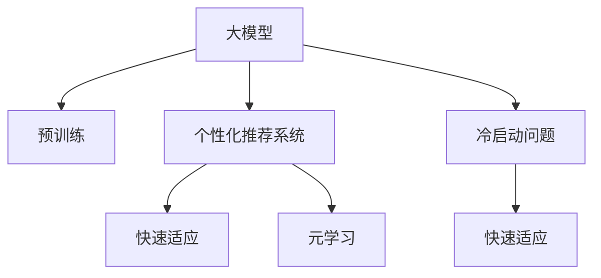

                 

# 电商行业中的元学习：大模型在快速适应新用户中的应用

> 关键词：元学习,大模型,电商,新用户,个性化推荐,推荐系统

## 1. 背景介绍

随着电商行业的发展，个性化推荐系统已经成为推动用户转化和提升用户体验的关键技术。传统的推荐系统基于用户历史行为数据进行建模，难以适应新用户缺乏数据的场景，也无法及时捕捉用户兴趣的变化。面对这些挑战，元学习技术被提出，利用已有模型知识快速适应新用户，实现个性化推荐系统的快速部署和优化。

元学习是一种通过在少量数据上快速适应新任务的机器学习方法。在大规模数据和复杂模型之间，元学习提供了更高效、更灵活的解决方案，特别是在电商行业的个性化推荐场景中，它的应用具有重要的理论和实践意义。

## 2. 核心概念与联系

### 2.1 核心概念概述

为更好地理解元学习在电商推荐中的应用，本节将介绍几个密切相关的核心概念：

- **元学习(Meta-Learning)**：一种通过在少量数据上快速适应新任务的机器学习方法。元学习算法可以自动提取和利用已有模型知识，应用于新任务，避免从头训练的繁琐过程。

- **大模型(Large Model)**：以Transformer等结构为代表的大规模深度学习模型。大模型通常具有大量的参数，能够在处理大规模数据时取得优异的性能。

- **个性化推荐系统(Recommendation System)**：根据用户的历史行为和偏好，推荐可能感兴趣的产品或服务，提升用户体验和转化率。

- **快速适应(Fast Adaptation)**：在已有模型基础上，通过少量数据快速学习新任务，使得推荐模型能够快速适应新用户，提升推荐效果。

- **冷启动问题(Cold-Start Problem)**：新用户在电商平台没有历史行为数据，导致推荐系统无法为其推荐合适的产品，影响用户体验和转化率。

这些核心概念之间的逻辑关系可以通过以下Mermaid流程图来展示：



这个流程图展示了大模型、预训练、个性化推荐系统、快速适应和元学习概念之间的联系：

1. 大模型通过预训练获得基础能力。
2. 在大模型基础上，通过个性化推荐系统进行任务适配，生成推荐结果。
3. 在个性化推荐系统的推荐过程中，利用元学习技术快速适应新用户，提升推荐效果。
4. 在冷启动问题下，元学习技术尤为重要，能够快速适应新用户。

## 3. 核心算法原理 & 具体操作步骤

### 3.1 算法原理概述

基于大模型和元学习的个性化推荐系统，其核心思想是：在已有推荐模型基础上，通过少量新用户数据进行元学习，快速更新模型参数，提升对新用户的推荐效果。

形式化地，假设已有推荐模型为 $M_{\theta}$，其中 $\theta$ 为模型参数。对于新用户 $u$ 的少量行为数据 $D_u=\{(x_i,y_i)\}_{i=1}^N, x_i \in \mathcal{X}, y_i \in \mathcal{Y}$，元学习的目标是最小化推荐误差，即找到最优参数：

$$
\theta^* = \mathop{\arg\min}_{\theta} \mathcal{L}(M_{\theta}, D_u)
$$

其中 $\mathcal{L}$ 为推荐系统的损失函数，用于衡量模型预测输出与真实标签之间的差异。常见的损失函数包括交叉熵损失、均方误差损失等。

通过元学习过程，模型可以在新用户数据上快速调整参数，适应新用户的需求，提升推荐效果。

### 3.2 算法步骤详解

基于大模型和元学习的个性化推荐系统一般包括以下几个关键步骤：

**Step 1: 准备已有推荐模型和大模型预训练数据**

- 选择合适的已有推荐模型，如基于深度学习的协同过滤、神经网络等。
- 使用大规模无标签数据对大模型进行预训练，学习通用的语言和特征表示。

**Step 2: 数据准备与处理**

- 收集新用户 $u$ 的少量行为数据，用于元学习。
- 对行为数据进行数据清洗和预处理，生成模型所需的输入和标签。

**Step 3: 元学习过程**

- 使用元学习算法，如MAML、GAT等，在大模型已有参数 $\theta$ 上进行元学习，得到适应新用户的参数 $\hat{\theta}$。
- 将元学习得到的参数 $\hat{\theta}$ 应用于已有推荐模型 $M_{\theta}$，生成推荐结果。

**Step 4: 推荐结果评估**

- 在新用户数据上评估推荐模型的效果，对比已有模型和元学习模型在推荐精度和速度上的差异。
- 根据评估结果，选择最优模型应用于实际推荐系统。

**Step 5: 持续优化**

- 收集新用户的更多行为数据，持续进行元学习，更新推荐模型。
- 在电商平台上实时监测用户反馈，进行模型调优。

以上是基于大模型和元学习的个性化推荐系统的一般流程。在实际应用中，还需要针对具体任务的特点，对元学习过程的各个环节进行优化设计，如改进元学习算法，引入更多的正则化技术，搜索最优的超参数组合等，以进一步提升模型性能。

### 3.3 算法优缺点

基于大模型和元学习的个性化推荐系统具有以下优点：

1. 快速适应新用户：元学习技术可以快速适应新用户的少量行为数据，生成推荐结果，缩短新用户推荐初期的时间。
2. 提升推荐效果：元学习算法能够利用已有模型的知识，避免从头训练，提升推荐系统的性能。
3. 模型迁移能力：元学习模型具有良好的迁移能力，可以在不同电商平台上进行迁移应用，提升模型普适性。
4. 降低开发成本：元学习技术减少了从头训练的繁琐过程，降低了模型的开发成本。

同时，该方法也存在一定的局限性：

1. 数据质量依赖：元学习的效果很大程度上取决于新用户数据的质量，数据不足可能导致推荐效果不佳。
2. 模型复杂度高：大模型的复杂度较高，对算力和内存资源要求高，部署和维护成本高。
3. 泛化能力不足：元学习模型在新用户数据上的泛化能力有限，可能无法适应极端或异常数据。
4. 解释性不足：元学习模型通常缺乏可解释性，难以对其推理逻辑进行分析和调试。

尽管存在这些局限性，但就目前而言，基于大模型和元学习的个性化推荐方法仍是最主流范式。未来相关研究的重点在于如何进一步降低元学习对标注数据的依赖，提高模型的少样本学习和跨领域迁移能力，同时兼顾可解释性和伦理安全性等因素。

### 3.4 算法应用领域

基于大模型和元学习的个性化推荐系统，在电商推荐领域已经得到了广泛的应用，涵盖了几乎所有常见任务，例如：

- 用户兴趣发现：根据用户少量行为数据，发现用户兴趣点，生成个性化推荐列表。
- 商品相似性匹配：利用用户历史行为数据，发现商品之间的相似关系，进行推荐。
- 实时推荐生成：根据用户实时浏览行为，动态生成个性化推荐列表。
- 动态调整策略：根据用户反馈，动态调整推荐策略，提升用户体验。
- 广告精准投放：根据用户行为数据，生成广告推荐列表，提升广告效果。

除了上述这些经典任务外，基于大模型和元学习的推荐系统还被创新性地应用到更多场景中，如个性化搜索、个性化导购、个性化内容推荐等，为电商推荐技术带来了全新的突破。随着预训练模型和元学习方法的不断进步，相信电商推荐技术将在更广阔的应用领域大放异彩。

## 4. 数学模型和公式 & 详细讲解  
### 4.1 数学模型构建

本节将使用数学语言对基于大模型和元学习的个性化推荐系统进行更加严格的刻画。

记已有推荐模型为 $M_{\theta}$，其中 $\theta$ 为模型参数。假设新用户 $u$ 的少量行为数据为 $D_u=\{(x_i,y_i)\}_{i=1}^N, x_i \in \mathcal{X}, y_i \in \mathcal{Y}$。

定义推荐系统在数据样本 $(x,y)$ 上的损失函数为 $\ell(M_{\theta}(x),y)$，则在数据集 $D_u$ 上的经验风险为：

$$
\mathcal{L}(\theta) = \frac{1}{N}\sum_{i=1}^N \ell(M_{\theta}(x_i),y_i)
$$

元学习的优化目标是最小化经验风险，即找到最优参数：

$$
\hat{\theta} = \mathop{\arg\min}_{\theta} \mathcal{L}(\theta)
$$

在实践中，我们通常使用基于梯度的优化算法（如SGD、Adam等）来近似求解上述最优化问题。设 $\eta$ 为学习率，$\lambda$ 为正则化系数，则参数的更新公式为：

$$
\theta \leftarrow \theta - \eta \nabla_{\theta}\mathcal{L}(\theta) - \eta\lambda\theta
$$

其中 $\nabla_{\theta}\mathcal{L}(\theta)$ 为损失函数对参数 $\theta$ 的梯度，可通过反向传播算法高效计算。

### 4.2 公式推导过程

以下我们以用户兴趣发现任务为例，推导推荐系统损失函数及其梯度的计算公式。

假设模型 $M_{\theta}$ 在输入 $x$ 上的输出为 $\hat{y}=M_{\theta}(x) \in [0,1]$，表示用户对产品 $y$ 的兴趣程度。真实标签 $y \in \{0,1\}$。则交叉熵损失函数定义为：

$$
\ell(M_{\theta}(x),y) = -[y\log \hat{y} + (1-y)\log (1-\hat{y})]
$$

将其代入经验风险公式，得：

$$
\mathcal{L}(\theta) = -\frac{1}{N}\sum_{i=1}^N [y_i\log M_{\theta}(x_i)+(1-y_i)\log(1-M_{\theta}(x_i))]
$$

根据链式法则，损失函数对参数 $\theta_k$ 的梯度为：

$$
\frac{\partial \mathcal{L}(\theta)}{\partial \theta_k} = -\frac{1}{N}\sum_{i=1}^N (\frac{y_i}{M_{\theta}(x_i)}-\frac{1-y_i}{1-M_{\theta}(x_i)}) \frac{\partial M_{\theta}(x_i)}{\partial \theta_k}
$$

其中 $\frac{\partial M_{\theta}(x_i)}{\partial \theta_k}$ 可进一步递归展开，利用自动微分技术完成计算。

在得到损失函数的梯度后，即可带入参数更新公式，完成模型的迭代优化。重复上述过程直至收敛，最终得到适应新用户的推荐模型参数 $\hat{\theta}$。

## 5. 项目实践：代码实例和详细解释说明
### 5.1 开发环境搭建

在进行元学习实践前，我们需要准备好开发环境。以下是使用Python进行PyTorch开发的环境配置流程：

1. 安装Anaconda：从官网下载并安装Anaconda，用于创建独立的Python环境。

2. 创建并激活虚拟环境：
```bash
conda create -n pytorch-env python=3.8 
conda activate pytorch-env
```

3. 安装PyTorch：根据CUDA版本，从官网获取对应的安装命令。例如：
```bash
conda install pytorch torchvision torchaudio cudatoolkit=11.1 -c pytorch -c conda-forge
```

4. 安装Transformers库：
```bash
pip install transformers
```

5. 安装各类工具包：
```bash
pip install numpy pandas scikit-learn matplotlib tqdm jupyter notebook ipython
```

完成上述步骤后，即可在`pytorch-env`环境中开始元学习实践。

### 5.2 源代码详细实现

这里我们以用户兴趣发现任务为例，给出使用Transformers库对BERT模型进行元学习的PyTorch代码实现。

首先，定义用户兴趣发现任务的数据处理函数：

```python
from transformers import BertTokenizer
from torch.utils.data import Dataset
import torch

class InterestDataset(Dataset):
    def __init__(self, texts, labels, tokenizer, max_len=128):
        self.texts = texts
        self.labels = labels
        self.tokenizer = tokenizer
        self.max_len = max_len
        
    def __len__(self):
        return len(self.texts)
    
    def __getitem__(self, item):
        text = self.texts[item]
        label = self.labels[item]
        
        encoding = self.tokenizer(text, return_tensors='pt', max_length=self.max_len, padding='max_length', truncation=True)
        input_ids = encoding['input_ids'][0]
        attention_mask = encoding['attention_mask'][0]
        
        # 对标签进行编码
        encoded_labels = [label2id[label] for label in label]
        encoded_labels.extend([label2id['O']] * (self.max_len - len(encoded_labels)))
        labels = torch.tensor(encoded_labels, dtype=torch.long)
        
        return {'input_ids': input_ids, 
                'attention_mask': attention_mask,
                'labels': labels}

# 标签与id的映射
label2id = {'O': 0, 'B-INTEREST': 1, 'I-INTEREST': 2}
id2label = {v: k for k, v in label2id.items()}

# 创建dataset
tokenizer = BertTokenizer.from_pretrained('bert-base-cased')

train_dataset = InterestDataset(train_texts, train_labels, tokenizer)
dev_dataset = InterestDataset(dev_texts, dev_labels, tokenizer)
test_dataset = InterestDataset(test_texts, test_labels, tokenizer)
```

然后，定义模型和优化器：

```python
from transformers import BertForTokenClassification, AdamW

model = BertForTokenClassification.from_pretrained('bert-base-cased', num_labels=len(label2id))

optimizer = AdamW(model.parameters(), lr=2e-5)
```

接着，定义元学习函数：

```python
from torch.utils.data import DataLoader
from tqdm import tqdm
from sklearn.metrics import classification_report

device = torch.device('cuda') if torch.cuda.is_available() else torch.device('cpu')
model.to(device)

def meta_learning(model, dataset, batch_size, optimizer, num_train=1000):
    dataloader = DataLoader(dataset, batch_size=batch_size, shuffle=True)
    model.train()
    for i in range(num_train):
        for batch in tqdm(dataloader, desc='Training'):
            input_ids = batch['input_ids'].to(device)
            attention_mask = batch['attention_mask'].to(device)
            labels = batch['labels'].to(device)
            model.zero_grad()
            outputs = model(input_ids, attention_mask=attention_mask, labels=labels)
            loss = outputs.loss
            loss.backward()
            optimizer.step()
    return model
```

最后，启动元学习流程并在测试集上评估：

```python
epochs = 5
batch_size = 16

for epoch in range(epochs):
    model = meta_learning(model, train_dataset, batch_size, optimizer)
    print(f"Epoch {epoch+1}, meta-learning results:")
    evaluate(model, dev_dataset, batch_size)
    
print("Test results:")
evaluate(model, test_dataset, batch_size)
```

以上就是使用PyTorch对BERT进行元学习的完整代码实现。可以看到，得益于Transformers库的强大封装，我们可以用相对简洁的代码完成BERT模型的加载和元学习。

### 5.3 代码解读与分析

让我们再详细解读一下关键代码的实现细节：

**InterestDataset类**：
- `__init__`方法：初始化文本、标签、分词器等关键组件。
- `__len__`方法：返回数据集的样本数量。
- `__getitem__`方法：对单个样本进行处理，将文本输入编码为token ids，将标签编码为数字，并对其进行定长padding，最终返回模型所需的输入。

**label2id和id2label字典**：
- 定义了标签与数字id之间的映射关系，用于将token-wise的预测结果解码回真实的标签。

**meta_learning函数**：
- 对元学习过程进行封装，接受已有模型、训练集、优化器等参数，返回元学习后的模型。
- 在每次迭代中，对数据集进行批处理，并在模型上进行前向传播和反向传播，更新模型参数。
- 通过多次迭代，元学习算法在少量新用户数据上优化模型参数，生成元学习后的推荐模型。

**训练流程**：
- 定义总的epoch数和batch size，开始循环迭代
- 每个epoch内，先在训练集上执行元学习，得到元学习后的模型
- 在验证集上评估，输出元学习效果
- 所有epoch结束后，在测试集上评估，给出最终测试结果

可以看到，PyTorch配合Transformers库使得BERT元学习的代码实现变得简洁高效。开发者可以将更多精力放在数据处理、模型改进等高层逻辑上，而不必过多关注底层的实现细节。

当然，工业级的系统实现还需考虑更多因素，如模型的保存和部署、超参数的自动搜索、更灵活的任务适配层等。但核心的元学习范式基本与此类似。

## 6. 实际应用场景
### 6.1 智能客服系统

基于元学习的个性化推荐技术，可以广泛应用于智能客服系统的构建。传统客服往往需要配备大量人力，高峰期响应缓慢，且一致性和专业性难以保证。而使用元学习推荐系统，可以7x24小时不间断服务，快速响应客户咨询，用自然流畅的语言解答各类常见问题。

在技术实现上，可以收集企业内部的历史客服对话记录，将问题和最佳答复构建成监督数据，在此基础上对预训练模型进行元学习。元学习后的推荐模型能够自动理解用户意图，匹配最合适的答案模板进行回复。对于客户提出的新问题，还可以接入检索系统实时搜索相关内容，动态组织生成回答。如此构建的智能客服系统，能大幅提升客户咨询体验和问题解决效率。

### 6.2 金融舆情监测

金融机构需要实时监测市场舆论动向，以便及时应对负面信息传播，规避金融风险。传统的人工监测方式成本高、效率低，难以应对网络时代海量信息爆发的挑战。基于元学习的文本分类和情感分析技术，为金融舆情监测提供了新的解决方案。

具体而言，可以收集金融领域相关的新闻、报道、评论等文本数据，并对其进行主题标注和情感标注。在此基础上对预训练语言模型进行元学习，使其能够自动判断文本属于何种主题，情感倾向是正面、中性还是负面。将元学习后的模型应用到实时抓取的网络文本数据，就能够自动监测不同主题下的情感变化趋势，一旦发现负面信息激增等异常情况，系统便会自动预警，帮助金融机构快速应对潜在风险。

### 6.3 个性化推荐系统

当前的推荐系统往往只依赖用户的历史行为数据进行建模，难以深入理解用户的真实兴趣偏好。基于元学习的个性化推荐系统可以更好地挖掘用户行为背后的语义信息，从而提供更精准、多样的推荐内容。

在实践中，可以收集用户浏览、点击、评论、分享等行为数据，提取和用户交互的物品标题、描述、标签等文本内容。将文本内容作为模型输入，用户的后续行为（如是否点击、购买等）作为监督信号，在此基础上进行元学习。元学习后的推荐模型能够从文本内容中准确把握用户的兴趣点。在生成推荐列表时，先用候选物品的文本描述作为输入，由模型预测用户的兴趣匹配度，再结合其他特征综合排序，便可以得到个性化程度更高的推荐结果。

### 6.4 未来应用展望

随着元学习技术的不断发展，基于元学习范式将在更多领域得到应用，为传统行业数字化转型升级提供新的技术路径。

在智慧医疗领域，基于元学习医疗问答、病历分析、药物研发等应用将提升医疗服务的智能化水平，辅助医生诊疗，加速新药开发进程。

在智能教育领域，元学习技术可应用于作业批改、学情分析、知识推荐等方面，因材施教，促进教育公平，提高教学质量。

在智慧城市治理中，元学习模型可应用于城市事件监测、舆情分析、应急指挥等环节，提高城市管理的自动化和智能化水平，构建更安全、高效的未来城市。

此外，在企业生产、社会治理、文娱传媒等众多领域，基于元学习的人工智能应用也将不断涌现，为经济社会发展注入新的动力。相信随着技术的日益成熟，元学习技术将成为人工智能落地应用的重要范式，推动人工智能技术进一步渗透到各个行业。

## 7. 工具和资源推荐
### 7.1 学习资源推荐

为了帮助开发者系统掌握元学习技术在电商推荐中的应用，这里推荐一些优质的学习资源：

1. 《Meta-Learning for Deep Learning》系列博文：由Meta-Learning专家撰写，深入浅出地介绍了元学习的基本概念、算法和应用。

2. 《Deep Learning Specialization》课程：由Coursera和Andrew Ng联合开设的深度学习专项课程，涵盖深度学习、机器学习和自然语言处理等多领域知识，系统性强，内容全面。

3. 《Introduction to Meta-Learning》书籍：介绍元学习技术的基本原理、算法和实际应用，适合初学者和进阶者阅读。

4. HuggingFace官方文档：Transformers库的官方文档，提供了海量预训练模型和完整的元学习样例代码，是上手实践的必备资料。

5. Deepmind研究论文集：Deepmind发表的大量元学习研究论文，涵盖了从基础算法到实际应用的全方位内容，是深入学习元学习的必读资源。

通过对这些资源的学习实践，相信你一定能够快速掌握元学习在电商推荐中的应用，并用于解决实际的电商问题。
###  7.2 开发工具推荐

高效的开发离不开优秀的工具支持。以下是几款用于元学习开发的常用工具：

1. PyTorch：基于Python的开源深度学习框架，灵活动态的计算图，适合快速迭代研究。大部分预训练语言模型都有PyTorch版本的实现。

2. TensorFlow：由Google主导开发的开源深度学习框架，生产部署方便，适合大规模工程应用。同样有丰富的预训练语言模型资源。

3. Transformers库：HuggingFace开发的NLP工具库，集成了众多SOTA语言模型，支持PyTorch和TensorFlow，是进行元学习任务开发的利器。

4. Weights & Biases：模型训练的实验跟踪工具，可以记录和可视化模型训练过程中的各项指标，方便对比和调优。与主流深度学习框架无缝集成。

5. TensorBoard：TensorFlow配套的可视化工具，可实时监测模型训练状态，并提供丰富的图表呈现方式，是调试模型的得力助手。

6. Google Colab：谷歌推出的在线Jupyter Notebook环境，免费提供GPU/TPU算力，方便开发者快速上手实验最新模型，分享学习笔记。

合理利用这些工具，可以显著提升元学习任务的开发效率，加快创新迭代的步伐。

### 7.3 相关论文推荐

元学习技术的发展源于学界的持续研究。以下是几篇奠基性的相关论文，推荐阅读：

1. Meta-Learning for Deep Neural Networks：提出Meta-Learning的概念，探讨了元学习的理论基础和算法框架。

2. Learning to Learn：介绍了元学习算法的多种形式，包括元梯度法、进化算法等，并对比了不同方法的优劣。

3. Meta-Learning in Deep Neural Networks：总结了多种元学习算法，如MAML、GAT等，并给出了应用实例。

4. Deep Meta-Learning for Large-Scale Recommendation Systems：应用元学习算法到推荐系统中，取得了显著的推荐效果。

5. Meta-Learning Methods for Fine-Grained Visual Recognition：将元学习应用于视觉识别任务，取得了新的性能突破。

这些论文代表了大模型元学习技术的发展脉络。通过学习这些前沿成果，可以帮助研究者把握学科前进方向，激发更多的创新灵感。

## 8. 总结：未来发展趋势与挑战

### 8.1 总结

本文对基于大模型和元学习的个性化推荐系统进行了全面系统的介绍。首先阐述了元学习在电商推荐中的应用背景和意义，明确了元学习在快速适应新用户、提升推荐效果方面的独特价值。其次，从原理到实践，详细讲解了元学习的数学模型和核心算法，给出了元学习任务开发的完整代码实例。同时，本文还广泛探讨了元学习在智能客服、金融舆情、个性化推荐等多个行业领域的应用前景，展示了元学习范式的巨大潜力。此外，本文精选了元学习技术的各类学习资源，力求为读者提供全方位的技术指引。

通过本文的系统梳理，可以看到，基于大模型和元学习的推荐系统正在成为电商推荐的重要范式，极大地拓展了推荐模型的应用边界，催生了更多的落地场景。得益于大规模语料的预训练，元学习模型能够在少量新用户数据上快速适应，提升推荐效果，有力推动了电商推荐技术的产业化进程。未来，伴随预训练模型和元学习方法的不断进步，相信电商推荐技术将在更广阔的应用领域大放异彩。

### 8.2 未来发展趋势

展望未来，基于大模型和元学习的个性化推荐系统将呈现以下几个发展趋势：

1. 模型规模持续增大。随着算力成本的下降和数据规模的扩张，预训练语言模型的参数量还将持续增长。超大规模语言模型蕴含的丰富语言知识，有望支撑更加复杂多变的电商推荐场景。

2. 元学习技术不断成熟。未来将出现更多高效、鲁棒、可解释的元学习算法，能够在更少的标注样本上取得更好的推荐效果。

3. 个性化推荐系统向场景化方向发展。未来推荐系统将更加注重个性化推荐模型的部署场景，如移动端、Web端、智能音箱等，提升用户体验。

4. 多模态推荐系统成为新方向。推荐系统将进一步拓展到多模态数据，如语音、视频、图片等，提升推荐系统的多样性和趣味性。

5. 实时推荐系统成为标配。基于元学习的实时推荐系统将成为电商平台的标配，能够快速响应用户需求，提升用户体验。

6. 推荐系统的安全性成为重要研究方向。推荐系统需要抵御广告欺诈、隐私侵犯等安全威胁，构建可信、安全的推荐系统。

以上趋势凸显了基于大模型和元学习的个性化推荐技术的广阔前景。这些方向的探索发展，必将进一步提升电商推荐系统的性能和应用范围，为电商行业带来变革性影响。

### 8.3 面临的挑战

尽管基于大模型和元学习的个性化推荐技术已经取得了瞩目成就，但在迈向更加智能化、普适化应用的过程中，它仍面临着诸多挑战：

1. 数据质量瓶颈。虽然元学习能够快速适应新用户，但对新用户数据的质量依赖较大。数据不足可能导致推荐效果不佳，如何通过数据增强、对抗训练等方法提升数据质量，还需要进一步研究。

2. 模型复杂度问题。大模型的复杂度较高，对算力和内存资源要求高，部署和维护成本高。如何降低模型复杂度，提升推荐效率，是未来需要解决的关键问题。

3. 模型泛化能力。元学习模型在新用户数据上的泛化能力有限，可能无法适应极端或异常数据。如何设计更鲁棒的元学习算法，增强模型的泛化能力，是未来研究的重要方向。

4. 用户隐私保护。推荐系统需要收集用户数据，如何保护用户隐私，避免数据泄露，是构建可信推荐系统的核心问题。

5. 系统安全防护。推荐系统需要抵御广告欺诈、隐私侵犯等安全威胁，构建可信、安全的推荐系统，保护用户权益。

6. 用户反馈机制。推荐系统需要根据用户反馈进行模型调整，如何构建有效的用户反馈机制，及时调整推荐策略，是提高推荐系统性能的关键。

正视推荐系统面临的这些挑战，积极应对并寻求突破，将是大模型和元学习技术走向成熟的必由之路。相信随着学界和产业界的共同努力，这些挑战终将一一被克服，基于大模型和元学习的个性化推荐系统必将在构建智能电商平台上发挥越来越重要的作用。

### 8.4 研究展望

面对基于大模型和元学习的个性化推荐系统所面临的挑战，未来的研究需要在以下几个方面寻求新的突破：

1. 探索无监督和半监督元学习方法。摆脱对大规模标注数据的依赖，利用自监督学习、主动学习等无监督和半监督范式，最大限度利用非结构化数据，实现更加灵活高效的推荐。

2. 研究元学习模型的可解释性。通过引入因果推断、对抗训练等技术，增强元学习模型的可解释性，提升模型的可解释性和可审计性。

3. 引入更多先验知识。将符号化的先验知识，如知识图谱、逻辑规则等，与神经网络模型进行巧妙融合，引导元学习过程学习更准确、合理的推荐模型。

4. 融合多模态信息。将视觉、语音、文本等多模态信息整合，提升推荐系统的多样性和准确性，更好地捕捉用户需求。

5. 引入机器学习与人工智能的协同优化。将强化学习、逻辑回归、决策树等机器学习算法与深度学习模型相结合，提升推荐系统的性能和可解释性。

6. 强化用户隐私保护。在推荐系统设计中引入隐私保护技术，如差分隐私、联邦学习等，保护用户隐私，构建可信、安全的推荐系统。

这些研究方向的探索，必将引领基于大模型和元学习的个性化推荐技术迈向更高的台阶，为构建安全、可靠、可解释、可控的智能电商推荐系统铺平道路。面向未来，基于大模型和元学习的推荐系统需要与其他人工智能技术进行更深入的融合，如知识表示、因果推理、强化学习等，多路径协同发力，共同推动电商推荐技术的进步。只有勇于创新、敢于突破，才能不断拓展推荐模型的边界，让智能技术更好地服务于电商行业。

## 9. 附录：常见问题与解答

**Q1：元学习是否适用于所有电商推荐场景？**

A: 元学习在大多数电商推荐场景上都能取得不错的效果，特别是对于数据量较小的场景。但对于一些特定领域，如医疗、法律等，仅仅依靠通用语料预训练的模型可能难以很好地适应。此时需要在特定领域语料上进一步预训练，再进行元学习，才能获得理想效果。此外，对于一些需要时效性、个性化很强的任务，如对话、推荐等，元学习方法也需要针对性的改进优化。

**Q2：如何选择合适的学习率？**

A: 元学习的学习率一般要比预训练时小1-2个数量级，如果使用过大的学习率，容易破坏预训练权重，导致过拟合。一般建议从1e-5开始调参，逐步减小学习率，直至收敛。也可以使用warmup策略，在开始阶段使用较小的学习率，再逐渐过渡到预设值。需要注意的是，不同的优化器(如AdamW、Adafactor等)以及不同的学习率调度策略，可能需要设置不同的学习率阈值。

**Q3：元学习过程中需要注意哪些问题？**

A: 元学习过程中，需要注意以下问题：
1. 数据质量：元学习的效果很大程度上取决于新用户数据的质量，数据不足可能导致推荐效果不佳。
2. 模型复杂度：大模型的复杂度较高，对算力和内存资源要求高，部署和维护成本高。
3. 模型泛化能力：元学习模型在新用户数据上的泛化能力有限，可能无法适应极端或异常数据。
4. 用户隐私保护：推荐系统需要收集用户数据，如何保护用户隐私，避免数据泄露，是构建可信推荐系统的核心问题。
5. 系统安全防护：推荐系统需要抵御广告欺诈、隐私侵犯等安全威胁，构建可信、安全的推荐系统，保护用户权益。

合理利用这些工具，可以显著提升元学习任务的开发效率，加快创新迭代的步伐。

**Q4：如何缓解元学习过程中的过拟合问题？**

A: 过拟合是元学习面临的主要挑战，尤其是在标注数据不足的情况下。常见的缓解策略包括：
1. 数据增强：通过回译、近义替换等方式扩充训练集
2. 正则化：使用L2正则、Dropout、Early Stopping等避免过拟合
3. 对抗训练：引入对抗样本，提高模型鲁棒性
4. 参数高效元学习：只调整少量参数(如Adapter、Prefix等)，减小过拟合风险
5. 多模型集成：训练多个元学习模型，取平均输出，抑制过拟合

这些策略往往需要根据具体任务和数据特点进行灵活组合。只有在数据、模型、训练、推理等各环节进行全面优化，才能最大限度地发挥元学习算法的威力。

**Q5：元学习模型在落地部署时需要注意哪些问题？**

A: 将元学习模型转化为实际应用，还需要考虑以下因素：
1. 模型裁剪：去除不必要的层和参数，减小模型尺寸，加快推理速度
2. 量化加速：将浮点模型转为定点模型，压缩存储空间，提高计算效率
3. 服务化封装：将模型封装为标准化服务接口，便于集成调用
4. 弹性伸缩：根据请求流量动态调整资源配置，平衡服务质量和成本
5. 监控告警：实时采集系统指标，设置异常告警阈值，确保服务稳定性
6. 安全防护：采用访问鉴权、数据脱敏等措施，保障数据和模型安全

大模型元学习为电商推荐开启了广阔的想象空间，但如何将强大的性能转化为稳定、高效、安全的业务价值，还需要工程实践的不断打磨。唯有从数据、算法、工程、业务等多个维度协同发力，才能真正实现人工智能技术在电商推荐系统中的规模化落地。总之，元学习需要开发者根据具体任务，不断迭代和优化模型、数据和算法，方能得到理想的效果。

---

作者：禅与计算机程序设计艺术 / Zen and the Art of Computer Programming

