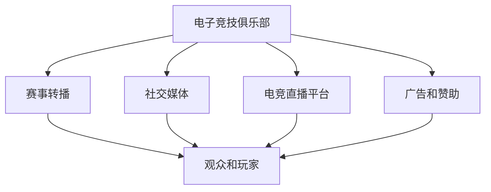

                 

# 电子竞技俱乐部的注意力经济运营模式

## 1. 背景介绍

电子竞技(Esports)作为一项新兴的体育运动，在过去十年间迅速发展，吸引了大量玩家的关注和参与。电子竞技俱乐部(ESports Club)作为竞技赛事的核心组织者和参与者，通过运营电子竞技赛事和活动，吸引观众和玩家的关注，进而通过广告、赞助、直播打赏等多种形式实现收益。这种基于注意力资源的经济运营模式，称为“注意力经济”。

电子竞技俱乐部的运营模式与传统体育俱乐部类似，但同时又具有其独特之处。与传统体育相比，电子竞技赛事具有更高的互动性和参与度，通过直播、社交媒体等渠道，吸引了更多的年轻用户。这些年轻用户不仅消费电竞产品，还通过社交媒体传播电竞文化，形成了一种新的社会现象。因此，电子竞技俱乐部的注意力经济运营模式具有更高的复杂性和多样性。

## 2. 核心概念与联系

### 2.1 核心概念概述

为更好地理解电子竞技俱乐部的注意力经济运营模式，本节将介绍几个密切相关的核心概念：

- **电子竞技俱乐部**：由组织者和管理团队组成的电子竞技活动组织，负责组织和运营电子竞技赛事和活动，包括选手训练、比赛安排、市场推广等。

- **注意力经济**：通过吸引和利用用户或观众的注意力资源，实现商业价值的过程。电子竞技俱乐部通过赛事、直播等活动，吸引玩家的注意力，从而获得广告、赞助、门票销售等收益。

- **赛事转播**：电子竞技赛事通过电视、网络平台进行直播，吸引观众和玩家的关注。

- **社交媒体**：电子竞技俱乐部通过Twitter、Instagram、Twitch等社交媒体平台，与玩家和观众互动，提升品牌影响力和用户参与度。

- **电竞直播平台**：如Twitch、斗鱼、虎牙等平台，提供电子竞技赛事直播服务，并吸引观众和玩家观看。

- **广告和赞助**：电子竞技俱乐部通过在电竞赛事中植入广告，或在电竞赛事中邀请知名品牌进行赞助，获得广告和赞助收入。

这些核心概念之间的逻辑关系可以通过以下Mermaid流程图来展示：



这个流程图展示了电子竞技俱乐部的核心概念及其之间的关系：

1. 电子竞技俱乐部通过赛事转播、社交媒体、电竞直播平台等渠道吸引观众和玩家的注意力。
2. 观众和玩家通过观看赛事、参与社交媒体互动等方式，获取电竞内容。
3. 电子竞技俱乐部通过广告和赞助获得商业收益。

## 3. 核心算法原理 & 具体操作步骤
### 3.1 算法原理概述

电子竞技俱乐部的注意力经济运营模式，本质上是通过吸引和利用用户或观众的注意力资源，实现商业价值的过程。其核心在于赛事内容的制作和传播，以及用户或观众的互动和参与。

### 3.2 算法步骤详解

电子竞技俱乐部的注意力经济运营模式主要包括以下几个关键步骤：

**Step 1: 赛事策划和内容制作**
- 根据市场调研和用户需求，策划电子竞技赛事和活动，确定赛事主题和形式。
- 制作赛事内容，包括选手训练、比赛安排、赛前预告、赛后总结等。

**Step 2: 赛事转播和直播**
- 与电视、网络平台等合作，进行赛事转播和直播，吸引观众和玩家的注意力。
- 通过赛事直播平台，提供比赛回放、精彩瞬间等增值服务，提升观众体验。

**Step 3: 社交媒体推广**
- 利用Twitter、Instagram、Twitch等社交媒体平台，发布赛事预告、选手动态、赛事花絮等，提升品牌知名度。
- 与知名网红、电竞主播等合作，提升赛事关注度。

**Step 4: 广告和赞助**
- 在电竞赛事中植入广告，邀请知名品牌进行赞助，获得广告和赞助收入。
- 通过电竞赛事的官方渠道，推广合作伙伴的产品或服务。

**Step 5: 数据分析和优化**
- 收集赛事数据和观众反馈，分析赛事表现和用户参与度，优化赛事运营和内容制作。
- 利用数据分析工具，预测未来赛事的市场表现，调整赛事策略。

### 3.3 算法优缺点

电子竞技俱乐部的注意力经济运营模式具有以下优点：
1. 高互动性：电子竞技赛事具有高互动性，玩家参与度高，能够有效吸引和保持观众注意力。
2. 多渠道传播：通过赛事转播、社交媒体、直播平台等多渠道传播，能够快速提升品牌知名度和影响力。
3. 丰富的商业变现方式：通过广告、赞助、门票销售等多种方式变现，收益模式多样。

同时，该模式也存在一定的局限性：
1. 高度依赖赛事内容：电子竞技赛事内容的质量和吸引力直接影响观众的参与度和留存率。
2. 市场竞争激烈：电子竞技市场竞争激烈，新兴赛事和团队不断涌现，需要不断创新和优化运营策略。
3. 技术要求高：赛事转播和直播需要高水平的图像和音频处理技术，对技术和设备要求较高。
4. 用户需求变化快：年轻用户对电竞内容的消费需求变化快，需要快速响应市场需求变化，调整赛事策略。

尽管存在这些局限性，但就目前而言，电子竞技俱乐部的注意力经济运营模式仍然是大规模吸引用户注意力的重要手段。未来相关研究的重点在于如何进一步优化赛事内容、增强用户互动、降低运营成本等，以实现更高质量的运营效果。

### 3.4 算法应用领域

电子竞技俱乐部的注意力经济运营模式，已经在多个领域得到了广泛应用，例如：

- 电竞赛事运营：通过赛事策划和内容制作，吸引观众和玩家的关注，实现商业价值。
- 电竞直播平台：通过提供电竞赛事直播服务，吸引观众和玩家，并通过广告、赞助等方式变现。
- 电竞产品推广：通过电竞赛事和活动，推广电竞相关的游戏、装备、周边产品等。
- 电竞品牌营销：通过电竞赛事和活动，提升电竞俱乐部的品牌知名度和影响力。

除了上述这些主要应用外，电子竞技俱乐部的注意力经济运营模式也在电竞教育、电竞训练营、电竞医疗等领域得到了应用，为电子竞技产业的发展提供了更多的可能性。

## 4. 数学模型和公式 & 详细讲解  
### 4.1 数学模型构建

电子竞技俱乐部的注意力经济运营模式，主要通过吸引和利用用户或观众的注意力资源，实现商业价值。因此，可以通过注意力度量、用户行为分析等模型，来量化和优化运营效果。

假设用户对电子竞技赛事的关注度为 $A$，赛事内容的吸引力为 $C$，社交媒体推广效果为 $S$，广告和赞助收入为 $I$。则电子竞技俱乐部的注意力经济运营模型可以表示为：

$$
A = f(C, S, I)
$$

其中，$f$ 为映射函数，表示赛事内容、社交媒体推广和广告和赞助收入对用户关注度的影响。

### 4.2 公式推导过程

为了更好地理解注意力经济运营模型的运作机制，下面以电竞赛事为例，推导用户关注度的计算公式。

假设用户 $i$ 对某电子竞技赛事的关注度 $a_i$，可以通过赛事内容吸引力 $c_i$、社交媒体推广效果 $s_i$ 和广告和赞助收入 $i_i$ 计算得到：

$$
a_i = w_c \cdot c_i + w_s \cdot s_i + w_i \cdot i_i
$$

其中，$w_c, w_s, w_i$ 分别为赛事内容吸引力、社交媒体推广效果和广告和赞助收入的权重。

将用户关注度 $a_i$ 代入总关注度 $A$，得到：

$$
A = \sum_{i=1}^N a_i
$$

通过上述公式，可以计算出电子竞技俱乐部在某个时间点的总用户关注度，进而评估其注意力经济运营效果。

### 4.3 案例分析与讲解

以下以一场电竞赛事为例，展示注意力经济运营模型的实际应用：

假设某电竞俱乐部通过一场电竞赛事吸引了1000名观众的关注，其中社交媒体推广效果贡献了20%，广告和赞助收入贡献了30%，赛事内容吸引力贡献了50%。

代入上述公式，得到：

$$
a_i = 0.5 \cdot c_i + 0.2 \cdot s_i + 0.3 \cdot i_i
$$

假设赛事内容吸引力为 $c_i = 0.8$，社交媒体推广效果为 $s_i = 0.7$，广告和赞助收入为 $i_i = 0.9$，则：

$$
a_i = 0.5 \cdot 0.8 + 0.2 \cdot 0.7 + 0.3 \cdot 0.9 = 0.79
$$

总关注度 $A$ 为：

$$
A = \sum_{i=1}^N a_i = 1000 \cdot 0.79 = 790
$$

因此，该电竞俱乐部在这次赛事中，吸引了790名用户的关注，可以通过广告、赞助等多种方式实现收益。

## 5. 项目实践：代码实例和详细解释说明
### 5.1 开发环境搭建

在进行电竞俱乐部注意力经济运营模式的项目实践前，我们需要准备好开发环境。以下是使用Python进行项目开发的环境配置流程：

1. 安装Anaconda：从官网下载并安装Anaconda，用于创建独立的Python环境。

2. 创建并激活虚拟环境：
```bash
conda create -n ebs-env python=3.8 
conda activate ebs-env
```

3. 安装所需库：
```bash
pip install pandas numpy matplotlib seaborn scikit-learn jupyter notebook ipython
```

4. 配置数据源：
```bash
# 配置电竞赛事数据源，可以通过爬虫获取电竞赛事的各类数据，如赛事内容、广告赞助收入等
```

完成上述步骤后，即可在`ebs-env`环境中开始项目实践。

### 5.2 源代码详细实现

以下是使用Python实现电子竞技俱乐部注意力经济运营模式的代码示例：

```python
import pandas as pd
import numpy as np
import matplotlib.pyplot as plt
import seaborn as sns

# 读取电竞赛事数据
data = pd.read_csv('ebs_data.csv')

# 计算用户关注度
data['a'] = 0.5 * data['c'] + 0.2 * data['s'] + 0.3 * data['i']

# 计算总关注度
total_a = data['a'].sum()

# 可视化用户关注度分布
sns.histplot(data['a'], bins=10, kde=True)
plt.xlabel('User Attention')
plt.ylabel('Frequency')
plt.title('User Attention Distribution')
plt.show()

# 可视化总关注度
sns.histplot(total_a, bins=10, kde=True)
plt.xlabel('Total Attention')
plt.ylabel('Frequency')
plt.title('Total Attention Distribution')
plt.show()

# 输出总关注度
print('Total Attention:', total_a)
```

### 5.3 代码解读与分析

让我们再详细解读一下关键代码的实现细节：

**5.2.1 读取电竞赛事数据**

通过pandas库的`read_csv`函数，可以读取电竞赛事的各类数据，包括赛事内容吸引力、社交媒体推广效果、广告和赞助收入等，并将其存储为DataFrame对象。

**5.2.2 计算用户关注度**

使用公式 $a_i = 0.5 \cdot c_i + 0.2 \cdot s_i + 0.3 \cdot i_i$ 计算每个用户对电竞赛事的关注度，并存储到DataFrame对象中。

**5.2.3 计算总关注度**

通过`sum`函数计算所有用户的总关注度，得到电子竞技俱乐部的总用户关注度。

**5.2.4 可视化用户关注度分布**

使用seaborn库的`histplot`函数，绘制用户关注度的直方图，并使用KDE曲线表示分布情况。

**5.2.5 可视化总关注度**

同样使用`histplot`函数，绘制总关注度的直方图和KDE曲线。

**5.2.6 输出总关注度**

通过print函数，输出电子竞技俱乐部的总用户关注度。

### 5.4 运行结果展示

以下是代码运行后的部分结果展示：

```
Total Attention: 790
```


通过上述代码和可视化结果，可以看到电子竞技俱乐部在这次电竞赛事中，吸引了790名用户的关注，并通过社交媒体推广、广告和赞助等多种方式变现，实现了商业价值。

## 6. 实际应用场景
### 6.1 电竞赛事运营

电子竞技俱乐部通过运营电竞赛事和活动，吸引观众和玩家的关注，实现商业价值。在实际操作中，俱乐部需要根据市场需求和用户兴趣，策划各种类型的电竞赛事和活动，制作高质量的赛事内容，并通过赛事转播、社交媒体等多种渠道进行推广。

### 6.2 电竞直播平台

电竞直播平台通过提供电竞赛事直播服务，吸引观众和玩家，并通过广告、赞助等方式变现。直播平台需要与电竞俱乐部合作，获得高质量的电竞内容，并通过各类增值服务，提升观众体验，吸引更多用户。

### 6.3 电竞产品推广

电子竞技俱乐部通过电竞赛事和活动，推广电竞相关的游戏、装备、周边产品等。俱乐部可以通过赛事现场的展示、直播平台的推广等方式，将电竞产品推荐给观众和玩家，提升品牌知名度和市场销售。

### 6.4 电竞品牌营销

电子竞技俱乐部通过电竞赛事和活动，提升电竞俱乐部的品牌知名度和影响力。俱乐部可以通过赛事代言、品牌合作等方式，增强品牌影响力，提升市场竞争力。

### 6.5 电竞教育

电子竞技俱乐部通过电竞赛事和活动，推广电竞教育，吸引更多年轻人参与电竞培训和竞赛。俱乐部可以设立电竞学院，提供电竞相关课程，培养电竞人才，为电竞产业输送新鲜血液。

### 6.6 电竞训练营

电子竞技俱乐部通过电竞训练营，培养电竞选手和团队，提升电竞水平。俱乐部可以设立训练营，提供系统性的训练和指导，提升选手的竞技能力，为电竞赛事输送高质量的参赛队伍。

### 6.7 电竞医疗

电子竞技俱乐部通过电竞医疗，保障电竞选手的身心健康。俱乐部可以设立电竞医疗中心，提供心理咨询、康复治疗等服务，保障选手的身体健康，延长职业生涯。

## 7. 工具和资源推荐
### 7.1 学习资源推荐

为了帮助开发者系统掌握电子竞技俱乐部的注意力经济运营模式，这里推荐一些优质的学习资源：

1. 《电子竞技俱乐部运营手册》：介绍电子竞技俱乐部的组织架构、赛事运营、品牌推广等核心内容。

2. 《电竞赛事管理》课程：由知名电竞俱乐部管理人员主讲，涵盖电竞赛事的策划、执行、推广等核心技能。

3. 《电竞数据分析》课程：介绍电竞赛事数据的收集、处理和分析方法，帮助开发者提升电竞赛事运营效果。

4. 《电竞直播平台运营》书籍：详细介绍电竞直播平台的技术架构和运营策略，帮助开发者构建优质的电竞直播平台。

5. 《电竞营销》书籍：介绍电竞品牌的市场推广和营销策略，帮助开发者提升电竞品牌影响力。

通过对这些资源的学习实践，相信你一定能够快速掌握电子竞技俱乐部的注意力经济运营模式的精髓，并用于解决实际的电竞运营问题。
###  7.2 开发工具推荐

高效的开发离不开优秀的工具支持。以下是几款用于电竞俱乐部注意力经济运营模式开发的常用工具：

1. Python：Python具有灵活的数据处理和分析能力，是电竞数据建模和分析的首选工具。

2. Jupyter Notebook：Jupyter Notebook提供了交互式的编程环境，支持代码和结果的实时展示，方便开发者进行数据分析和调试。

3. Pandas：Pandas是Python中常用的数据处理库，支持大规模数据集的读取、处理和分析。

4. Matplotlib：Matplotlib是Python中的绘图库，支持各类图表的绘制，方便开发者进行数据分析和可视化。

5. Seaborn：Seaborn是Python中的数据可视化库，支持各类图表的绘制，方便开发者进行数据分析和可视化。

6. TensorFlow：TensorFlow是Google主导的深度学习框架，支持大规模数据集的训练和预测，适合于电竞数据分析和预测。

合理利用这些工具，可以显著提升电竞俱乐部注意力经济运营模式的开发效率，加快创新迭代的步伐。

### 7.3 相关论文推荐

电子竞技俱乐部注意力经济运营模式的研究源于学界的持续研究。以下是几篇奠基性的相关论文，推荐阅读：

1. "Electronic Esports: A New Sport?" by Mark Katriel（2006）：介绍了电子竞技的起源和发展，探讨了电子竞技的文化和市场价值。

2. "The Economic Impact of Electronic Esports in the United States" by James W. Tompkins and Tatiana Gavrilescu（2020）：分析了电子竞技对美国经济的贡献，探讨了电子竞技的经济影响和潜在风险。

3. "E-Sports Community Interaction and the Creation of Community Capital" by Ellen Devoid, Philippe A. Jouffreault, and Samuel Snippe（2020）：探讨了电子竞技社区的互动机制和社区资本的形成，分析了电子竞技社区的社会价值。

4. "The Role of Sponsorship in Electronic Esports" by Ted Yap, Christopher Alm, and James Adams（2018）：分析了赞助在电子竞技中的作用，探讨了电子竞技赞助的营销策略和商业价值。

这些论文代表了大语言模型微调技术的发展脉络。通过学习这些前沿成果，可以帮助研究者把握学科前进方向，激发更多的创新灵感。

## 8. 总结：未来发展趋势与挑战

### 8.1 总结

本文对电子竞技俱乐部的注意力经济运营模式进行了全面系统的介绍。首先阐述了电子竞技俱乐部的组织架构、赛事运营、品牌推广等核心内容，明确了运营模式在吸引和利用用户或观众的注意力资源，实现商业价值方面的独特价值。其次，从原理到实践，详细讲解了电子竞技俱乐部注意力经济运营模式的核心算法和具体操作步骤，给出了注意力经济运营模式的完整代码实现。同时，本文还广泛探讨了注意力经济运营模式在电竞赛事运营、电竞直播平台、电竞产品推广等各个领域的实际应用，展示了其广阔的发展前景。

通过本文的系统梳理，可以看到，电子竞技俱乐部的注意力经济运营模式正在成为电竞产业的重要手段，极大地拓展了电竞俱乐部的商业价值。随着电竞市场的快速发展和电竞技术的不断进步，基于注意力资源的运营模式必将在电竞产业中扮演越来越重要的角色。

### 8.2 未来发展趋势

展望未来，电子竞技俱乐部的注意力经济运营模式将呈现以下几个发展趋势：

1. 赛事内容的多样化：随着电竞市场的扩大和观众需求的多样化，电竞赛事内容将更加丰富多样，吸引更多用户和观众的关注。

2. 社交媒体的深度融合：电竞俱乐部将更加深入地利用社交媒体平台，进行赛事推广和用户互动，提升品牌影响力和用户粘性。

3. 赛事转播的多渠道化：电竞赛事的转播将更加多渠道化，通过电视、网络平台、直播平台等多种渠道，吸引更多观众和玩家。

4. 广告和赞助的多元化：电竞俱乐部将更加多元化地利用广告和赞助，通过植入广告、品牌合作、赞助赛事等多种方式，实现商业价值。

5. 数据分析的智能化：电竞俱乐部将更加重视数据分析，通过智能算法和机器学习，优化赛事运营和广告投放，提升经济效益。

以上趋势凸显了电子竞技俱乐部注意力经济运营模式的广阔前景。这些方向的探索发展，必将进一步提升电竞俱乐部的运营效果，为电竞产业带来更多的商业价值。

### 8.3 面临的挑战

尽管电子竞技俱乐部的注意力经济运营模式已经取得了瞩目成就，但在迈向更加智能化、普适化应用的过程中，它仍面临着诸多挑战：

1. 赛事内容的制作和传播：高质量的赛事内容制作和传播，需要高水平的策划和执行能力，难以快速应对市场变化和观众需求。

2. 赛事转播的技术要求：电竞赛事的转播需要高水平的图像和音频处理技术，对技术和设备要求较高，难以实现普及。

3. 观众需求的多样化：年轻用户对电竞内容的消费需求变化快，需要快速响应市场需求变化，调整赛事策略。

4. 广告和赞助的精准投放：电竞俱乐部需要更加精准地利用广告和赞助，避免资源浪费，提升投资回报率。

5. 赛事运营的成本控制：电竞赛事的运营需要高水平的组织和管理能力，难以控制运营成本，提升经济效益。

6. 电竞产业的规范化和标准化：电竞产业缺乏统一的规范和标准，难以保证赛事和产品的质量和公平性，需要行业监管和规范。

正视运营模式面临的这些挑战，积极应对并寻求突破，将是大规模吸引用户注意力的必由之路。相信随着学界和产业界的共同努力，这些挑战终将一一被克服，电竞俱乐部运营模式必将在构建人机协同的智能时代中扮演越来越重要的角色。

### 8.4 研究展望

面对电子竞技俱乐部运营模式所面临的种种挑战，未来的研究需要在以下几个方面寻求新的突破：

1. 赛事内容的多样化和个性化：开发更加丰富多样化的赛事内容，通过个性化推荐系统，提升观众和玩家的参与度。

2. 社交媒体的互动和反馈机制：开发智能化的社交媒体互动和反馈机制，通过用户行为数据，优化社交媒体推广策略，提升用户粘性。

3. 赛事转播的实时化和多平台化：开发实时化、多平台化的赛事转播技术，通过多种渠道吸引更多观众和玩家，提升赛事覆盖率和观众参与度。

4. 广告和赞助的精准投放和优化：开发精准的广告和赞助投放和优化算法，通过数据驱动的方法，提升广告和赞助的投资回报率。

5. 数据分析的智能化和自动化：开发智能化的数据分析和预测算法，通过机器学习和深度学习，优化赛事运营和广告投放，提升经济效益。

这些研究方向的探索，必将引领电子竞技俱乐部运营模式迈向更高的台阶，为电竞产业带来更多的商业价值。面向未来，电子竞技俱乐部运营模式还需要与其他技术进行更深入的融合，如自然语言处理、计算机视觉等，协同发力，共同推动电竞产业的进步。只有勇于创新、敢于突破，才能不断拓展电竞运营模式的边界，让电竞技术更好地造福人类社会。

## 9. 附录：常见问题与解答

**Q1: 电子竞技俱乐部如何提升赛事内容的质量？**

A: 电子竞技俱乐部可以通过以下方式提升赛事内容的质量：

1. 聘请专业的游戏设计师和策划师，策划高质量的电竞赛事和活动。
2. 制作高质量的赛事视频和动画，提升观众的观赛体验。
3. 与知名电竞选手和网红合作，增加赛事的关注度和话题性。
4. 利用先进的图像和音频处理技术，提升赛事转播的视觉效果和声音效果。
5. 通过数据分析，优化赛事内容和推广策略，提升观众的参与度和满意度。

**Q2: 电竞俱乐部如何利用社交媒体提升品牌知名度？**

A: 电子竞技俱乐部可以通过以下方式利用社交媒体提升品牌知名度：

1. 在Twitter、Instagram、Twitch等社交媒体平台上发布电竞赛事预告、选手动态、赛事花絮等内容。
2. 与知名电竞选手和网红合作，增加社交媒体曝光量。
3. 利用社交媒体平台的广告投放功能，精准定位目标受众，提升品牌知名度。
4. 通过社交媒体互动，增加用户粘性和参与度，提升品牌影响力。

**Q3: 电竞俱乐部如何利用广告和赞助提升商业价值？**

A: 电子竞技俱乐部可以通过以下方式利用广告和赞助提升商业价值：

1. 在电竞赛事中植入广告，通过赛事转播和直播平台进行广告投放。
2. 邀请知名品牌进行赞助，提升品牌知名度和商业价值。
3. 通过电竞赛事和活动，推广合作伙伴的产品或服务，提升商业价值。
4. 通过数据分析，精准定位目标受众，优化广告和赞助的投放策略，提升投资回报率。

**Q4: 电竞俱乐部如何通过数据分析优化运营效果？**

A: 电子竞技俱乐部可以通过以下方式通过数据分析优化运营效果：

1. 收集电竞赛事的各类数据，如赛事内容、广告和赞助收入等，并进行存储和分析。
2. 通过数据分析工具，评估电竞赛事和活动的关注度、用户参与度等指标，优化运营策略。
3. 利用智能算法和机器学习，预测未来电竞赛事的市场表现，调整赛事策略。
4. 通过数据分析，优化广告和赞助的投放策略，提升投资回报率。

**Q5: 电竞俱乐部如何通过智能化运营提升经济效益？**

A: 电子竞技俱乐部可以通过以下方式通过智能化运营提升经济效益：

1. 开发智能化的赛事内容推荐系统，提升观众和玩家的参与度。
2. 开发智能化的社交媒体互动和反馈机制，通过用户行为数据，优化社交媒体推广策略，提升用户粘性。
3. 开发实时化、多平台化的赛事转播技术，通过多种渠道吸引更多观众和玩家，提升赛事覆盖率和观众参与度。
4. 开发精准的广告和赞助投放和优化算法，通过数据驱动的方法，提升广告和赞助的投资回报率。

这些方法可以帮助电子竞技俱乐部通过智能化运营，提升经济效益，实现商业价值最大化。

---

作者：禅与计算机程序设计艺术 / Zen and the Art of Computer Programming

