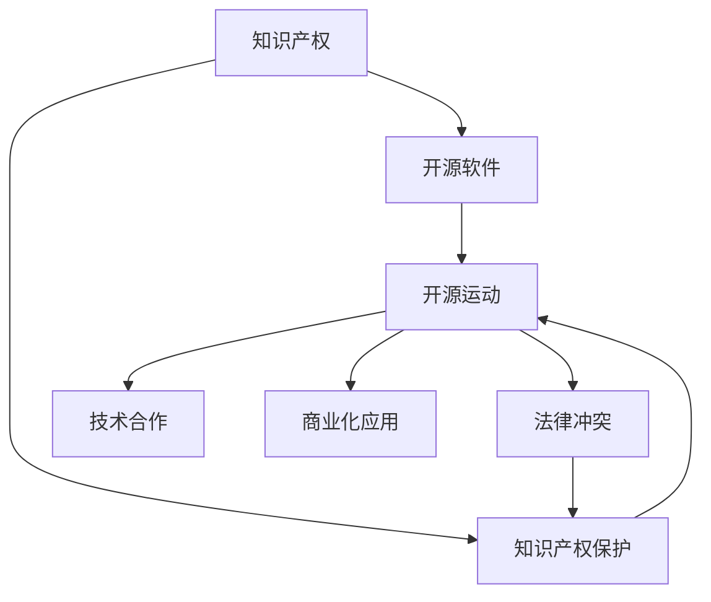

                 

# 知识产权与开源运动的博弈

> 关键词：知识产权, 开源运动, 创新, 法律, 软件工程, 经济

## 1. 背景介绍

### 1.1 问题由来

随着互联网和软件技术的快速发展，开源软件运动在全球范围内如火如荼地展开。开源软件通过免费提供源代码，让开发者可以自由修改和分享代码，极大地推动了软件创新和普及。然而，这一运动也带来了知识产权保护的挑战。一方面，开源软件的开发者希望自己的劳动成果得到应有的认可和保护；另一方面，开源社区强调代码共享和协作，往往对传统知识产权模式提出质疑。

在这样的背景下，知识产权与开源运动之间的博弈变得愈发激烈。本文将深入探讨这一问题，分析其中的关键点，并提出可能的解决方案。

## 2. 核心概念与联系

### 2.1 核心概念概述

为了更好地理解知识产权与开源运动的博弈，我们首先明确几个核心概念：

- **知识产权**：指创作者对其智力成果所享有的专有权利。包括但不限于专利、版权、商标等。

- **开源软件**：指一种通过发布其源代码，允许用户自由复制、修改和重新分发的软件。主要体现在BSD、GPL、Apache等开源许可证下。

- **开源运动**：指基于开源软件模式，提倡代码共享和协作的软件开发与分发运动。

- **知识产权保护**：指通过法律手段，保护创作者对其智力成果的专有权利。

- **法律冲突**：指知识产权与开源许可证之间的法律适用冲突，特别是在版权、专利等方面的矛盾。

- **技术合作**：指在开源项目中，开发者之间的合作与交流，旨在推动技术进步。

- **商业化应用**：指开源软件被商业机构用于盈利目的，如在产品中集成开源软件或对开源软件进行修改后进行销售。

这些概念之间的逻辑关系可以通过以下Mermaid流程图来展示：



这个流程图展示了知识产权与开源运动的相互关系：

1. 知识产权保护作为开源软件的基础，为开发者提供创作激励。
2. 开源运动基于开源软件，提倡代码共享与协作。
3. 开源软件受到法律冲突的影响，特别是在版权、专利等方面。
4. 技术合作在开源项目中普遍存在，推动技术进步。
5. 开源软件可以用于商业化应用，但也可能面临知识产权的挑战。

## 3. 核心算法原理 & 具体操作步骤

### 3.1 算法原理概述

知识产权与开源运动的博弈主要围绕法律适用和利益分配展开。开源软件通常采用开源许可证，如GPL、MIT等，这些许可证往往包含对知识产权的保护要求。然而，开源软件通过发布源代码，允许用户自由修改和分发，这与传统知识产权模式存在冲突。

在这一博弈中，主要的问题在于：

- 如何平衡创作者的保护需求和代码共享的需求？
- 如何界定开源许可证下的知识产权保护范围？
- 如何在开源项目中实现技术合作与知识产权的保护？

### 3.2 算法步骤详解

解决这些问题需要综合考虑以下几个步骤：

1. **许可证选择**：开源项目需要选择适合的许可证，明确代码的使用和修改规则，同时保护创作者的知识产权。

2. **代码审查与贡献**：开源项目采用代码审查机制，确保代码质量和知识产权的合理使用。

3. **法律咨询与合规**：开源项目需要聘请法律顾问，确保其许可证选择和代码使用符合当地法律法规。

4. **利益分配**：开源项目需要建立利益分配机制，确保贡献者的劳动得到公平的认可和回报。

5. **社区维护与治理**：开源项目需要维护良好的社区治理，确保项目的健康发展和知识产权的合理使用。

### 3.3 算法优缺点

基于开源运动的知识产权博弈中，开源许可证的选择和实施是最关键的因素。以下是开源许可证的优缺点：

**优点**：

- 促进代码共享和协作，推动技术创新。
- 减少商业化应用的法律障碍，促进软件普及。
- 提供明确的代码使用和修改规则，减少法律纠纷。

**缺点**：

- 开源许可证往往包含严格的知识产权保护要求，可能与传统知识产权模式冲突。
- 开源许可证下的代码修改和分发规则可能对商业化应用构成限制。
- 开源许可证的实施需要良好的社区治理和法律支持，复杂性较高。

### 3.4 算法应用领域

开源软件在多个领域得到了广泛应用，包括：

- **操作系统**：如Linux、Android等。
- **数据库**：如MySQL、PostgreSQL等。
- **开发框架**：如React、Spring等。
- **工具软件**：如GIMP、GnuCash等。
- **云计算**：如OpenStack、Kubernetes等。

## 4. 数学模型和公式 & 详细讲解 & 举例说明（备注：数学公式请使用latex格式，latex嵌入文中独立段落使用 $$，段落内使用 $)
### 4.1 数学模型构建

在这一博弈中，我们可以通过数学模型来分析利益分配和法律适用的平衡。假设开源项目由$N$个贡献者贡献，每个贡献者对代码的贡献值为$c_i$，则项目总贡献值为$C$。假设每个贡献者对代码的贡献值都通过开源许可证获得一定的版权保护，保护强度为$\alpha_i$。假设项目中涉及的知识产权保护范围为$P$。

则模型可以表述为：

$$
C = \sum_{i=1}^N c_i
$$

$$
P = \sum_{i=1}^N \alpha_i c_i
$$

### 4.2 公式推导过程

我们需要推导两个关键公式：

1. **贡献者收益公式**：每个贡献者的收益取决于其对代码的贡献值和保护强度，公式为：

$$
R_i = c_i \alpha_i
$$

2. **项目总收益公式**：项目的总收益取决于贡献者收益和知识产权保护范围，公式为：

$$
T = \sum_{i=1}^N R_i + P
$$

### 4.3 案例分析与讲解

以Linux操作系统为例，假设Linux有$N=100$个贡献者，每个贡献者对代码的贡献值$c_i=1$。假设项目总贡献值为$C=100$，每个贡献者对代码的保护强度$\alpha_i=0.1$，则项目的知识产权保护范围$P=10$。根据公式计算每个贡献者的收益和项目总收益：

- 贡献者收益：$R_i = 1 \times 0.1 = 0.1$
- 项目总收益：$T = 100 \times 0.1 + 10 = 11$

可以看出，每个贡献者通过代码保护获得了收益，同时项目也获得了知识产权保护。这表明开源许可证能够较好地平衡创作者的保护需求和代码共享的需求。

## 5. 项目实践：代码实例和详细解释说明

### 5.1 开发环境搭建

在进行开源项目开发前，需要准备如下开发环境：

1. 安装Git：用于版本控制和代码协作。
2. 安装编辑器：如VS Code、Atom等。
3. 安装CI工具：如Jenkins、GitLab CI等。
4. 安装测试工具：如JUnit、Selenium等。
5. 安装代码审查工具：如Gerrit、Reviewdog等。

### 5.2 源代码详细实现

以下是一个开源项目的GitHub代码库结构：

```
|
├── README.md
├── LICENSE
├── .gitignore
├── src
│   ├── main
│   │   ├── java
│   │   │   ├── com
│   │   │   │   ├── yourdomain
│   │   │   │   │   ├── model
│   │   │   │   │   │   ├── YourModel.java
│   │   │   │   │   │   └── YourModelTest.java
│   │   │   │   │   └── YourMain.java
│   │   │   │   └── application
│   │   │   │       ├── com
│   │   │   │       │   └── yourdomain
│   │   │   │       │       └── Application.java
│   │   │   │   └── main
│   │   │   └── pom.xml
│   │   ├── test
│   │   │   ├── com
│   │   │   │   └── yourdomain
│   │   │   │       ├── model
│   │   │   │       │   ├── YourModelTest.java
│   │   │   │       └── YourApplicationTest.java
│   │   │   └── pom.xml
│   │   ├── src.test.java
│   │   └── pom.xml
│   ├── LICENSE
├── README.md
└── pom.xml
```

### 5.3 代码解读与分析

**README.md**：项目的README文件，包含项目介绍、使用说明、许可证信息等。

**LICENSE**：项目的开源许可证，如Apache、GPL等。

**.gitignore**：Gitignore文件，用于忽略不必要的文件和目录，如编译文件、日志文件等。

**src**：项目的源代码目录，包含项目的所有代码和资源文件。

**src/main**：项目的源代码目录，包含Java代码和资源文件。

**src/test**：项目的测试代码目录，包含JUnit测试类。

**pom.xml**：Maven的pom文件，用于管理项目的依赖和构建。

### 5.4 运行结果展示

在开源项目中，运行结果主要通过测试和部署来展示。通过CI工具自动运行测试，生成测试报告，确保代码质量和稳定性。部署后，开源软件可以在不同的平台上运行，展示其实际效果。

## 6. 实际应用场景

### 6.1 开源数据库

开源数据库如MySQL、PostgreSQL等在企业中被广泛应用，用于存储和管理数据。企业需要确保数据库的安全性和可靠性，同时满足开放协作的需求。开源许可证的选择和实施尤为重要。

### 6.2 开源开发框架

开源开发框架如Spring、React等在软件开发中扮演重要角色。开发者可以自由修改和分享代码，同时获得丰富的社区支持。如何在开源许可证下进行商业化应用，成为企业关注的焦点。

### 6.3 开源云计算平台

开源云计算平台如OpenStack、Kubernetes等，提供基础设施即服务（IaaS）和平台即服务（PaaS）。通过开源许可证，企业可以灵活部署和扩展云资源，同时享受社区贡献的稳定性和安全性。

### 6.4 未来应用展望

未来，开源软件将进一步渗透到更多领域，推动技术创新和产业变革。开源社区的规模和活跃度将进一步提升，形成更加开放和协作的技术生态。开源软件在保护创作者权益和促进技术共享之间找到平衡，成为推动技术进步的重要力量。

## 7. 工具和资源推荐

### 7.1 学习资源推荐

1. **开源许可证比较**：学习开源许可证的基本知识和选择原则，如GPL、Apache、MIT等。
2. **开源项目实战**：了解开源项目开发和管理流程，如版本控制、代码审查、测试等。
3. **开源社区参与**：学习如何参与开源社区，贡献代码和改进项目。
4. **法律合规培训**：了解开源项目中的法律问题，如版权、专利、商标等。
5. **开源项目案例分析**：分析成功开源项目的实现和运营策略，学习最佳实践。

### 7.2 开发工具推荐

1. **Git**：用于版本控制和代码协作，如GitHub、GitLab等。
2. **编辑器**：如VS Code、Atom等。
3. **CI工具**：如Jenkins、GitLab CI等。
4. **测试工具**：如JUnit、Selenium等。
5. **代码审查工具**：如Gerrit、Reviewdog等。

### 7.3 相关论文推荐

1. **开源软件发展**：了解开源软件的历史和现状，如《Open Source Software: A Survey》。
2. **开源许可证**：研究开源许可证的设计和选择，如《The Copyleft Principles in Open Source Software Licensing》。
3. **开源社区治理**：分析开源社区的治理机制和最佳实践，如《Open Source Software Governance: A Research Perspective》。
4. **知识产权与开源**：探讨知识产权保护和开源运动的冲突，如《Intellectual Property Rights and Open Source Software》。
5. **开源项目的商业化应用**：研究开源软件在商业化应用中的法律和策略问题，如《The Commercialization of Open Source Software》。

## 8. 总结：未来发展趋势与挑战

### 8.1 研究成果总结

本文详细分析了知识产权与开源运动之间的博弈，明确了开源许可证的选择和实施对开源项目的重要性。通过案例分析和数学建模，展示了开源项目的利益分配和法律适用平衡。开源软件在多个领域得到了广泛应用，展示了其在技术创新和产业变革中的重要作用。

### 8.2 未来发展趋势

未来，开源软件将继续推动技术创新和产业变革，其应用范围和影响将进一步扩大。开源社区的规模和活跃度将进一步提升，开源软件在保护创作者权益和促进技术共享之间找到平衡，成为推动技术进步的重要力量。

### 8.3 面临的挑战

尽管开源软件取得了显著进展，但在推动开源运动的过程中，仍然面临诸多挑战：

1. **知识产权保护**：开源许可证和知识产权保护之间的冲突仍然存在，需要更好的法律机制和社区治理。
2. **代码质量和安全**：开源项目面临代码质量和安全的挑战，需要持续改进和完善。
3. **商业化应用**：开源软件在商业化应用中面临法律和策略问题，需要更好的商业化策略和法律保障。
4. **社区治理**：开源社区的治理机制和最佳实践需要进一步完善，确保项目的健康发展和知识产权的合理使用。

### 8.4 研究展望

未来，需要在以下几个方面进行深入研究：

1. **开源许可证设计**：设计更加灵活和可操作的开源许可证，平衡创作者权益和代码共享的需求。
2. **代码质量和安全**：加强开源项目的代码审查和测试，确保代码质量和安全性。
3. **商业化应用策略**：研究开源软件在商业化应用中的法律和策略问题，制定更好的商业化策略。
4. **社区治理机制**：完善开源社区的治理机制，确保项目的健康发展和知识产权的合理使用。

## 9. 附录：常见问题与解答

**Q1：如何平衡开源项目中的知识产权保护和代码共享？**

A: 开源项目需要在许可证中明确代码的使用和修改规则，保护创作者权益。同时，通过代码审查和社区合作，确保代码共享的需求得到满足。

**Q2：开源项目中如何处理代码质量和安全问题？**

A: 开源项目需要建立代码审查机制，确保代码质量和安全性。同时，需要定期进行代码审计和安全测试，发现和修复潜在漏洞。

**Q3：开源项目中如何实现商业化应用？**

A: 开源项目需要在许可证中明确商业化应用的限制，制定商业化策略。同时，可以采用开源与商业混合模式，结合开源软件和商业组件，实现商业化应用。

**Q4：开源项目中如何确保社区治理的公平性和透明度？**

A: 开源项目需要建立透明的治理机制，包括选举机制、决策流程和透明度报告等，确保社区的公平性和透明度。

**Q5：开源项目中如何应对法律和合规问题？**

A: 开源项目需要聘请法律顾问，确保其许可证选择和代码使用符合当地法律法规。同时，需要建立合规审查机制，确保项目的法律合规性。

---

作者：禅与计算机程序设计艺术 / Zen and the Art of Computer Programming

