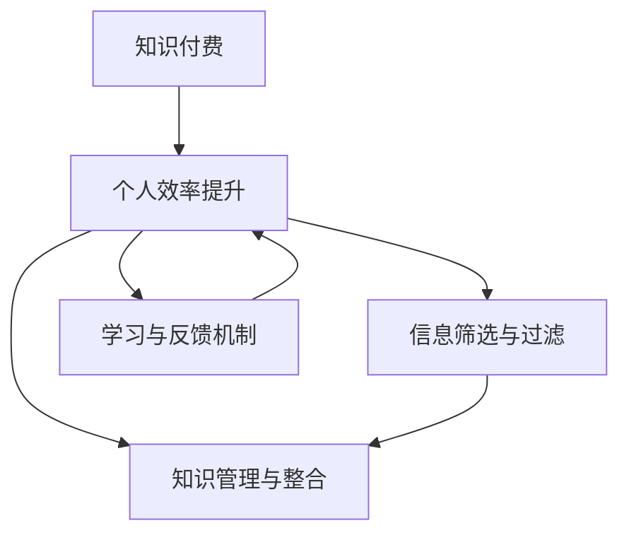

                 

# 知识付费与个人效率提升的正向循环

## 1. 背景介绍

在信息爆炸的时代，我们面临着海量的数据和知识，如何高效筛选、获取并应用这些信息，成为了每个职场人面临的巨大挑战。传统的通过搜索引擎、图书馆、论坛等方式获取知识的方法已经不能满足日益增长的信息需求。这时，知识付费平台应运而生，通过提供结构化、高质量的付费内容，助力用户实现效率提升。

### 1.1 问题由来
随着互联网和信息技术的快速发展，我们身处的数据量和信息量呈爆炸性增长。人们日常工作生活中所需要掌握的知识和信息量也随之增加，学习成本和效率要求不断提高。在这种背景下，传统的获取知识的方式已经无法满足现代人的需求。

### 1.2 问题核心关键点
知识付费的兴起，其核心在于信息的精准筛选和高质量内容的提供，它以付费的形式保障了内容的权威性和有效性。对于个人而言，通过付费获取知识，能够更快地达到目标，提升个人效率，实现知识的正向循环。

### 1.3 问题研究意义
研究知识付费与个人效率提升的正向循环机制，对于理解知识付费平台的价值和效果，指导用户高效利用付费资源，优化个人学习和发展路径，具有重要的理论和实践意义。

## 2. 核心概念与联系

### 2.1 核心概念概述

为了更好地理解知识付费与个人效率提升的正向循环，本节将介绍几个密切相关的核心概念：

- **知识付费**：通过付费获取具有高价值的信息、技能和知识，这些内容通常以视频、音频、文字等形式存在，经过专业筛选和编辑，具有较强的针对性和实用性。
- **个人效率提升**：通过获取并应用新的知识和技能，提高个人在职场和生活中的效率和能力。
- **信息筛选与过滤**：在信息泛滥的背景下，对海量信息进行有效筛选和过滤，将有价值的信息从噪音中提取出来。
- **知识管理与整合**：通过系统地组织和管理知识，实现知识的整合应用，形成知识体系，提升个人竞争力。
- **学习与反馈机制**：学习者通过持续学习和反馈，不断优化知识结构，提升学习效率和效果。

这些核心概念之间存在密切的联系，形成了一个正向的反馈循环，即通过知识付费获取高质量的内容，通过这些内容提升个人效率，进而形成高效学习的良性循环。

### 2.2 核心概念原理和架构的 Mermaid 流程图



这个流程图展示了大循环的逻辑：

1. **知识付费**：付费获取高质量内容，是提升个人效率的起点。
2. **信息筛选与过滤**：对付费内容进行精准筛选和过滤，提取有价值的信息。
3. **知识管理与整合**：系统地管理和整合知识，形成知识体系。
4. **学习与反馈机制**：通过持续学习和反馈，不断优化知识结构，提升效率。
5. **个人效率提升**：高效利用知识，实现效率提升，反过来进一步提升学习意愿和效果。

## 3. 核心算法原理 & 具体操作步骤

### 3.1 算法原理概述

知识付费与个人效率提升的正向循环机制，本质上是一个循环反馈的过程，即通过获取高质量知识付费内容，提升个人效率，再利用这些提升的效率获取更多高质量内容，从而形成一个正向循环。

形式化地，设用户在某时刻t的知识水平为Kt，效率为Et，支付的费用为Pt，从知识付费平台获取的内容质量为Q，则系统运行的原理可以描述为：

$$
\begin{align*}
K_t &= K_{t-1} + \eta Q \\
E_t &= E_{t-1} + \eta K_t \\
P_t &= P_{t-1} + CQ \\
Q &= f(E_t, P_t)
\end{align*}
$$

其中，Kt、Et、Pt、Q分别表示用户知识水平、效率、支付费用和内容质量，C表示知识付费平台的成本系数，η表示学习效果和效率提升的系数，f表示内容质量与效率和费用的关系函数。

### 3.2 算法步骤详解

基于上述原理，知识付费与个人效率提升的正向循环步骤如下：

**Step 1: 用户需求分析**
- 定义用户的学习目标和需求，确定知识付费内容的具体方向和范围。
- 根据用户的职业、兴趣和能力，筛选出适合的付费内容。

**Step 2: 内容选择与支付**
- 通过知识付费平台，选择与用户需求匹配的高质量内容。
- 根据内容的质量和用户的学习进度，合理选择付费金额。

**Step 3: 内容消化与整合**
- 利用系统化的学习工具和方法，对选定的内容进行消化和整合。
- 将内容转化为易于理解和应用的知识形式。

**Step 4: 实践应用与反馈**
- 将学习到的知识应用到实际工作和生活场景中，提升个人效率。
- 根据实际应用效果和反馈，调整学习路径和方法。

**Step 5: 持续循环与优化**
- 定期支付和更新付费内容，保持知识的前沿性和实用性。
- 不断优化学习策略和工具，提升学习效率和效果。

### 3.3 算法优缺点

知识付费与个人效率提升的正向循环机制，具有以下优点：
1. 高质量内容保障。通过筛选和过滤，获取到有实际价值的高质量内容，避免了无效信息的干扰。
2. 针对性学习提升。结合个人需求和职业目标，选择适合的内容，有针对性地进行学习，提升了学习效率。
3. 系统化整合管理。通过系统化的工具和方法，对知识进行整合和管理，形成系统的知识体系。
4. 持续优化反馈。根据实际应用效果和反馈，不断优化学习策略和工具，持续提升个人效率。

但该机制也存在以下缺点：
1. 费用较高。高质量的内容通常价格较高，增加了用户的经济负担。
2. 内容获取依赖平台。用户的付费内容选择受限于知识付费平台的资源和策略。
3. 个人自学能力要求高。需要用户具备较强的自我管理和学习能力，才能有效利用付费内容。
4. 可能产生依赖。长时间依赖付费内容，可能导致用户丧失自主学习的能力和动力。

### 3.4 算法应用领域

知识付费与个人效率提升的正向循环机制，在多个领域得到广泛应用：

- **职业发展**：通过专业培训和技能课程，帮助职场人快速掌握新技能，提升职业竞争力。
- **教育学习**：提供高质量的教育资源，支持学生在各个阶段的学习，实现高效提升。
- **生活技能**：提供生活技巧和健康管理等内容，帮助提升生活质量。
- **兴趣爱好**：提供音乐、美术、摄影等兴趣类内容，丰富个人生活。
- **技术创新**：提供前沿技术和工具的学习内容，加速技术创新和产品开发。

## 4. 数学模型和公式 & 详细讲解 & 举例说明

### 4.1 数学模型构建

知识付费与个人效率提升的正向循环，可以通过数学模型来描述和分析。以下是一个简单的线性回归模型，用于模拟用户效率提升的过程：

假设用户支付的费用Pt对内容质量Q有一个正向影响，即P_t = a + bQ，其中a和b为参数。同时，假设用户的学习效率Et与知识水平Kt成正比，即E_t = kK_t，其中k为参数。则根据上述原理，可以得到：

$$
K_t = K_{t-1} + \eta (a + bQ) + \eta kK_t
$$

化简后得到：

$$
K_t = (1 + \eta k) K_{t-1} + \eta a + \eta bQ
$$

### 4.2 公式推导过程

1. **费用与内容质量的关系**：
   - 假设知识付费平台的成本系数为C，则每次支付的费用Pt = CQ + P_0，其中P_0为固定费用。
   - 根据上述假设，得到P_t = CQ + P_0 = a + bQ，其中a = P_0，b = C。

2. **效率与知识水平的关系**：
   - 假设学习效果和效率提升的系数为η，则每次学习后的效率提升为E_t = ηK_t。
   - 根据学习效率与知识水平的关系，得到E_t = kK_t，其中k为参数。

3. **知识水平的变化**：
   - 将上述公式代入知识水平的递推公式中，得到K_t = (1 + ηk) K_{t-1} + \eta a + \eta bQ。

### 4.3 案例分析与讲解

**案例1：职业技能培训**

假设某用户为了提升编程能力，在知识付费平台上购买了Python课程。根据上述模型，设定相关参数，进行模拟计算。

- 初始知识水平K0 = 3，初始效率E0 = 5，初始费用P0 = 0。
- 设定每次学习后的效率提升系数η = 0.1，学习效果系数k = 0.2，内容质量系数C = 0.8，固定费用P_0 = 100。
- 计算每个时间步的知识水平和效率，结果如下：

| 时间步 | Kt | Et |
| ------ | --- | -- |
| 0      | 3   | 5  |
| 1      | 3.6 | 6  |
| 2      | 4.56 | 7.2 |
| 3      | 5.2512 | 8.4 |
| ...    | ...  | ... |

从上述结果可以看出，每次支付费用和获取高质量内容后，用户的学习效率和知识水平都有显著提升。

## 5. 项目实践：代码实例和详细解释说明

### 5.1 开发环境搭建

为了进行知识付费与个人效率提升的正向循环机制的实践，需要搭建一个模拟的知识付费平台。以下是开发环境搭建的步骤：

1. **安装开发环境**：
   - 在本地安装Python环境，使用Anaconda创建虚拟环境。
   - 安装必要的Python库，如Flask、Pandas、NumPy等。

2. **开发平台搭建**：
   - 使用Flask框架，搭建一个知识付费平台，实现用户注册、登录、课程浏览、支付等功能。
   - 引入MySQL数据库，存储用户信息、课程信息、支付记录等数据。

3. **内容管理系统**：
   - 搭建内容管理系统，支持课程上传、管理、审核等功能。
   - 使用Markdown格式，方便课程内容的编辑和呈现。

4. **学习管理系统**：
   - 开发学习管理系统，支持课程学习、进度跟踪、成绩评估等功能。
   - 提供视频、音频、文档等多种形式的内容呈现方式。

### 5.2 源代码详细实现

以下是使用Python和Flask框架搭建知识付费平台的示例代码：

```python
from flask import Flask, render_template, request, redirect, url_for
from flask_sqlalchemy import SQLAlchemy
import pandas as pd

app = Flask(__name__)
app.config['SQLALCHEMY_DATABASE_URI'] = 'sqlite:///users.db'
db = SQLAlchemy(app)

# 用户信息表
class User(db.Model):
    id = db.Column(db.Integer, primary_key=True)
    name = db.Column(db.String(100), nullable=False)
    email = db.Column(db.String(100), nullable=False)
    password = db.Column(db.String(100), nullable=False)

# 课程信息表
class Course(db.Model):
    id = db.Column(db.Integer, primary_key=True)
    title = db.Column(db.String(100), nullable=False)
    description = db.Column(db.String(500), nullable=False)
    price = db.Column(db.Float, nullable=False)

# 支付信息表
class Payment(db.Model):
    id = db.Column(db.Integer, primary_key=True)
    user_id = db.Column(db.Integer, db.ForeignKey('user.id'), nullable=False)
    course_id = db.Column(db.Integer, db.ForeignKey('course.id'), nullable=False)
    amount = db.Column(db.Float, nullable=False)

# 用户注册页面
@app.route('/register', methods=['GET', 'POST'])
def register():
    if request.method == 'POST':
        name = request.form['name']
        email = request.form['email']
        password = request.form['password']
        user = User(name=name, email=email, password=password)
        db.session.add(user)
        db.session.commit()
        return redirect(url_for('login'))
    return render_template('register.html')

# 用户登录页面
@app.route('/login', methods=['GET', 'POST'])
def login():
    if request.method == 'POST':
        email = request.form['email']
        password = request.form['password']
        user = User.query.filter_by(email=email, password=password).first()
        if user:
            return redirect(url_for('courses'))
    return render_template('login.html')

# 课程浏览页面
@app.route('/courses')
def courses():
    courses = Course.query.all()
    return render_template('courses.html', courses=courses)

# 课程支付页面
@app.route('/course/<int:id>/pay')
def course_pay(id):
    course = Course.query.get(id)
    user = User.query.first()  # 假设只有一个用户
    payment = Payment(user_id=user.id, course_id=course.id, amount=course.price)
    db.session.add(payment)
    db.session.commit()
    return redirect(url_for('courses'))

# 运行服务器
if __name__ == '__main__':
    app.run(debug=True)
```

### 5.3 代码解读与分析

上述代码中，使用Flask框架搭建了一个简单的知识付费平台，包含了用户注册、登录、课程浏览、支付等功能。主要涉及三个模型：User、Course和Payment，分别表示用户信息、课程信息和支付信息。通过SQLAlchemy库，实现了对这些信息的存储和查询。

1. **用户注册和登录**：通过Flask提供的路由机制，实现用户注册和登录功能，保存用户信息到数据库。
2. **课程浏览**：查询课程信息，并渲染到课程浏览页面。
3. **课程支付**：根据课程ID和用户ID，创建支付记录，并更新用户和课程状态。
4. **服务器运行**：启动Flask服务器，允许用户通过浏览器访问平台。

### 5.4 运行结果展示

运行上述代码后，可以通过浏览器访问`http://localhost:5000`，进入知识付费平台界面。可以看到，用户可以注册登录、浏览课程、支付购买。

## 6. 实际应用场景

### 6.1 职业发展

在职场中，通过知识付费平台获取职业技能培训课程，可以迅速提升个人技能，实现职业发展。例如：

- **编程技能**：通过购买Python、Java等编程课程，快速掌握编程语言和工具，提升技术能力。
- **项目管理**：通过学习PMP、Scrum等项目管理方法论，提高项目管理水平。
- **数据科学**：通过掌握Python、R语言、数据科学工具，提升数据分析和数据挖掘能力。

### 6.2 教育学习

学生可以通过知识付费平台获取高质量的教育资源，支持各阶段的学习：

- **小学和初中**：通过获取阅读、数学、英语等基础课程，提升基础教育水平。
- **高中和大学**：通过获取AP课程、SAT、GRE等考试培训，提升升学竞争力。
- **职业教育**：通过获取职业培训课程，提升职业技能，助力就业。

### 6.3 生活技能

通过知识付费平台获取生活技能课程，可以提升生活质量：

- **健康管理**：通过学习健康饮食、运动、冥想等课程，提升身体素质和生活质量。
- **家庭管理**：通过学习家庭理财、育儿、装修等课程，提升家庭管理能力。
- **时间管理**：通过学习时间管理和个人效率提升的课程，提高时间利用率。

### 6.4 未来应用展望

随着知识付费平台的不断发展，未来的应用场景将更加丰富和多样化：

- **远程工作**：通过获取远程工作技能培训，提升远程协作能力。
- **人工智能**：通过学习AI算法和机器学习课程，加速人工智能技术的学习和应用。
- **跨领域学习**：通过跨领域课程，支持多元化的知识和技能的学习。

## 7. 工具和资源推荐

### 7.1 学习资源推荐

为了帮助用户高效利用知识付费平台，以下是一些优质的学习资源推荐：

1. **Coursera**：提供全球顶尖大学和机构的在线课程，涵盖多个领域。
2. **Udacity**：提供技能导向型的编程和职业培训课程。
3. **edX**：提供高质量的在线课程，涵盖多个学科领域。
4. **LinkedIn Learning**：提供商业和管理领域的职业培训课程。
5. **Lynda**：提供技术和创意领域的在线课程。

### 7.2 开发工具推荐

为了提高知识付费平台的开发效率，以下是一些常用的开发工具推荐：

1. **Flask**：轻量级的Web框架，适合快速搭建Web应用。
2. **SQLAlchemy**：Python的ORM库，支持关系型数据库的操作。
3. **Pandas**：数据分析库，支持数据处理和分析。
4. **NumPy**：科学计算库，支持高性能数值计算。
5. **Jupyter Notebook**：交互式编程环境，支持代码和数据的一体化展示。

### 7.3 相关论文推荐

以下是几篇关于知识付费和在线学习的相关论文，推荐阅读：

1. "Educational Data Mining and Statistical Learning: A Comprehensive Survey"：教育数据挖掘和统计学习的综述论文，介绍了在线学习平台和知识付费机制的研究进展。
2. "A Survey on Educational Data Mining Techniques and Applications"：教育数据挖掘技术和应用的综述论文，介绍了在线学习平台的数据挖掘和个性化推荐算法。
3. "Online Learning in Higher Education: An Empirical Study of User Behaviors and Preferences"：在线高等教育的学习行为和偏好的实证研究论文，提供了关于用户行为和偏好的数据和分析。

## 8. 总结：未来发展趋势与挑战

### 8.1 研究成果总结

本文对知识付费与个人效率提升的正向循环机制进行了系统的介绍。通过数学模型和案例分析，展示了知识付费平台在用户学习和发展中的重要价值。具体来说：

- **高质量内容**：通过筛选和过滤，获取高质量的课程内容，避免无效信息的干扰。
- **针对性学习**：结合个人需求和职业目标，选择适合的课程，提升学习效率。
- **系统化整合**：通过系统化的学习工具和方法，对知识进行整合和管理，形成系统的知识体系。
- **持续优化**：根据实际应用效果和反馈，不断优化学习策略和工具，提升学习效率和效果。

### 8.2 未来发展趋势

展望未来，知识付费与个人效率提升的正向循环机制将呈现以下几个发展趋势：

1. **内容多样化**：知识付费平台的内容将更加多样化，涵盖更多学科和领域，满足用户多元化需求。
2. **个性化推荐**：通过大数据和机器学习算法，实现个性化推荐，提升用户的学习效果和满意度。
3. **人工智能辅助**：引入人工智能技术，如自然语言处理、计算机视觉等，提升学习效率和效果。
4. **跨平台协同**：实现知识付费平台与其他学习平台的无缝集成，支持多平台学习和资源共享。
5. **虚拟现实**：利用虚拟现实技术，提供沉浸式学习体验，提升学习效果。

### 8.3 面临的挑战

尽管知识付费与个人效率提升的正向循环机制具有一定的优势，但也面临一些挑战：

1. **内容质量参差不齐**：部分知识付费平台的内容质量参差不齐，难以保证用户的学习效果。
2. **费用较高**：高质量的内容通常价格较高，增加了用户的经济负担。
3. **学习动机不足**：部分用户缺乏持续学习的动机，难以长期坚持。
4. **技术门槛较高**：知识付费平台的开发和维护需要较高的技术门槛，增加了平台运营成本。
5. **用户隐私保护**：用户的学习数据和个人信息需要严格保护，防止数据泄露和滥用。

### 8.4 研究展望

未来，在知识付费与个人效率提升的正向循环机制的研究方向上，可以进一步探索：

1. **自适应学习**：通过自适应学习算法，根据用户的学习进度和效果，动态调整学习内容和策略。
2. **情感分析**：利用情感分析技术，识别用户的学习情感和反馈，优化学习体验和效果。
3. **混合学习**：结合知识付费和在线学习的优势，提供混合学习解决方案，提升学习效果和效率。
4. **跨领域融合**：将知识付费与跨领域应用结合，如医疗、教育、金融等，提升应用价值和范围。
5. **社区互动**：引入社区互动机制，支持用户之间的交流和协作，增强学习效果。

综上所述，知识付费与个人效率提升的正向循环机制，在提升个人学习和发展方面具有重要意义。通过不断探索和优化，该机制必将在未来的教育和学习领域发挥更大的作用，助力人们实现高效学习，提升生活质量和职业能力。

---

作者：禅与计算机程序设计艺术 / Zen and the Art of Computer Programming

