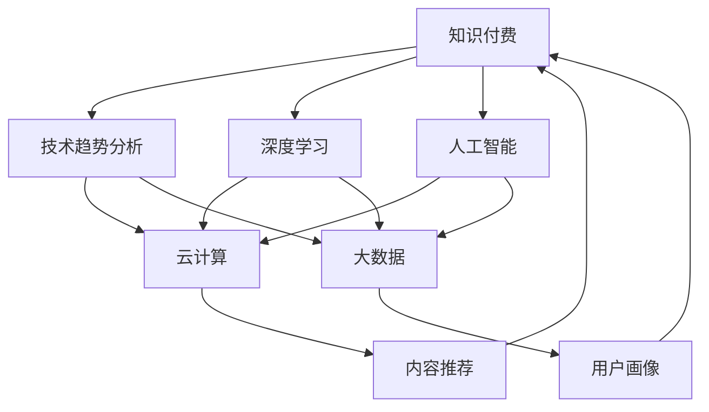

                 

# 知识付费与技术趋势分析的商业化

> 关键词：知识付费, 技术趋势, 商业化, 深度学习, 人工智能, 云计算, 大数据, 机器学习

## 1. 背景介绍

### 1.1 问题由来

近年来，随着互联网技术和智能设备的普及，知识付费逐渐成为一种新的经济形态。无论是线上平台，如得到、喜马拉雅、知乎等，还是线下课程、图书，都在不断涌现。然而，这种模式面临诸多挑战：内容质量参差不齐、用户粘性难以维持、商业模式可持续性不足等。如何在技术上提升知识付费平台的竞争力，同时实现商业可持续发展，成为当前亟需解决的问题。

## 2. 核心概念与联系

### 2.1 核心概念概述

为更好地理解知识付费与技术趋势分析的商业化方法，本节将介绍几个关键概念及其联系：

- **知识付费**：用户通过付费获取有价值、高质量的数字化知识内容，包括在线课程、电子书、音频、视频等。
- **技术趋势分析**：通过对各类技术发展、应用前景的预测和评估，指导内容生产、平台建设和商业策略。
- **商业化**：将技术开发与商业运营相结合，实现知识付费平台可持续的收入模式。
- **深度学习**：利用神经网络模型解决复杂问题的技术，在大数据和计算资源支持下，实现高效、精准的内容推荐、用户画像等应用。
- **人工智能(AI)**：涵盖机器学习、自然语言处理、计算机视觉等多个领域的交叉学科，是知识付费平台核心技术之一。
- **云计算**：通过互联网提供计算资源、软件、数据服务等服务，为平台提供高效、稳定的技术支撑。
- **大数据**：通过收集、处理、分析海量数据，实现知识付费平台的数据驱动决策。
- **机器学习(ML)**：利用算法优化、自动化数据分析等手段，提升内容推荐、用户行为预测的准确性。

这些核心概念之间的逻辑关系可以通过以下Mermaid流程图来展示：



这个流程图展示了这个系统的主要组件和它们之间的联系：

1. 知识付费平台通过技术趋势分析，了解最新的技术和趋势。
2. 利用深度学习和人工智能技术，对平台内容进行精准推荐和个性化定制。
3. 结合云计算和大数据技术，提供高效、稳定的平台运营支撑。
4. 最终提升平台的用户体验和商业价值。

## 3. 核心算法原理 & 具体操作步骤
### 3.1 算法原理概述

知识付费平台的商业化，本质上是一个基于技术的市场化过程。其核心在于通过精准的数据分析和高效的算法技术，为用户提供个性化、高质量的知识内容，并实现收入的最大化。

形式化地，假设知识付费平台有用户集 $U$，内容集 $C$，平台通过数据分析和算法推荐，对用户-内容交互行为进行建模，得到预测模型 $P$。根据用户行为预测模型，平台可以判断用户对内容的兴趣程度，进而为其推荐相关内容。同时，通过用户对推荐内容的反馈，进一步优化预测模型，提升推荐效果。

平台收益的来源可以是订阅、单次购买、广告等。通过优化推荐算法，提升用户粘性，增加内容价值，平台可以实现收入的增长。

### 3.2 算法步骤详解

基于技术的知识付费平台商业化一般包括以下几个关键步骤：

**Step 1: 数据收集与处理**
- 收集平台用户行为数据，包括浏览、点赞、评论、购买等。
- 通过网络爬虫获取公开可用的技术趋势数据，如GitHub的最新项目、专利申请等。
- 利用自然语言处理技术，提取文本数据中的关键词、情感倾向等信息。

**Step 2: 特征工程与模型训练**
- 对用户行为数据进行特征工程，提取用户画像、兴趣标签等信息。
- 利用深度学习模型，如LSTM、CNN、BERT等，对用户画像和内容特征进行建模。
- 利用强化学习、推荐系统等算法，训练预测模型 $P$，优化推荐效果。

**Step 3: 内容推荐与反馈优化**
- 根据预测模型 $P$，为每个用户推荐与其兴趣相关的个性化内容。
- 收集用户对推荐内容的反馈数据，进行模型反馈和参数调整。
- 引入用户画像、内容质量等因子，动态调整推荐策略。

**Step 4: 用户交互与付费转化**
- 提供丰富的互动方式，如在线讨论、社区交流等，增强用户粘性。
- 通过精准的推荐和优质的内容，提升用户满意度。
- 设计合理的付费机制，引导用户进行付费订阅或单次购买。

**Step 5: 平台运营与盈利模式**
- 通过平台数据分析，优化内容供应链，提升平台效率。
- 拓展平台盈利模式，如开放API、知识付费分包等。
- 引入广告和推荐系统，提升平台收入。

### 3.3 算法优缺点

基于技术的知识付费平台商业化方法具有以下优点：
1. 数据驱动决策：通过大数据和机器学习技术，提升平台运营决策的准确性和效率。
2. 个性化推荐：通过深度学习算法，提供精准的个性化内容推荐，提升用户粘性。
3. 平台扩展性：借助云计算和大数据技术，实现平台的高可用性和扩展性。
4. 收入多元化：通过多样化的盈利模式，降低单一收入来源的风险。
5. 用户体验优化：通过技术手段提升内容质量和用户互动体验。

同时，该方法也存在一定的局限性：
1. 数据隐私：用户在平台上的行为数据可能被滥用，引发隐私保护问题。
2. 内容质量：算法推荐的准确性依赖于高质量的标注数据，低质量内容可能降低推荐效果。
3. 用户流失：推荐算法的个性化可能导致用户选择面变窄，流失用户。
4. 模型复杂：深度学习和大数据技术的实现复杂，需要大量人力和技术积累。
5. 资源消耗：大数据和深度学习模型的计算资源消耗较大，平台运营成本较高。

尽管存在这些局限性，但就目前而言，基于技术的数据分析和推荐算法，是知识付费平台实现商业化最有效的方式之一。未来相关研究的重点在于如何进一步优化算法，降低数据和计算资源的依赖，提高平台的商业可持续性。

### 3.4 算法应用领域

基于技术的知识付费平台商业化方法，在多个领域得到了广泛应用，例如：

- **在线教育**：通过推荐系统，为学生推荐适合的课程和资源，提升学习效率。
- **知识分享**：利用大数据和自然语言处理技术，筛选高质量的知识分享内容，吸引用户参与。
- **商业咨询**：通过智能推荐和用户画像分析，为商业决策提供数据支持。
- **医疗健康**：利用知识图谱和智能推荐，为医生和患者提供精准的医疗信息。
- **文化娱乐**：通过个性化推荐，提升用户的阅读、观看体验，推广高质量内容。

除了上述这些经典应用外，基于技术的知识付费平台商业化方法也被创新性地应用到更多场景中，如智慧城市、农业科技等，为各行各业的知识传播和信息获取提供了新的途径。随着技术的不断进步，相信知识付费平台的商业化将进一步拓展，为更多领域提供服务。

## 4. 数学模型和公式 & 详细讲解  
### 4.1 数学模型构建

本节将使用数学语言对基于技术的知识付费平台商业化过程进行更加严格的刻画。

记知识付费平台的用户集为 $U$，内容集为 $C$。设平台对内容 $c \in C$ 的预测评分向量为 $P_c$，用户 $u \in U$ 的实际评分向量为 $R_u$。则预测模型 $P$ 为：

$$
P = \mathop{\arg\min}_{P_c} \sum_{u \in U} ||P_c - R_u||^2
$$

其中，$||\cdot||$ 表示向量范数，$||P_c - R_u||^2$ 表示预测评分与实际评分之间的差距。

### 4.2 公式推导过程

以下我们以协同过滤算法为例，推导推荐系统的评分预测公式。

假设用户 $u$ 对内容 $c$ 的评分向量为 $R_u$，内容 $c$ 的评分向量为 $P_c$。利用协同过滤算法，对用户-内容评分进行预测，预测评分 $y_u^c$ 可以通过向量点积计算：

$$
y_u^c = \alpha \cdot R_u \cdot P_c^T
$$

其中 $\alpha$ 为调节因子，用于平衡协同过滤和用户历史行为的影响。

在得到评分预测公式后，即可对用户行为进行模拟预测，并根据预测结果，推荐最相关的优质内容。

## 5. 项目实践：代码实例和详细解释说明
### 5.1 开发环境搭建

在进行知识付费平台开发前，我们需要准备好开发环境。以下是使用Python进行PyTorch开发的环境配置流程：

1. 安装Anaconda：从官网下载并安装Anaconda，用于创建独立的Python环境。

2. 创建并激活虚拟环境：
```bash
conda create -n pytorch-env python=3.8 
conda activate pytorch-env
```

3. 安装PyTorch：根据CUDA版本，从官网获取对应的安装命令。例如：
```bash
conda install pytorch torchvision torchaudio cudatoolkit=11.1 -c pytorch -c conda-forge
```

4. 安装相关库：
```bash
pip install numpy pandas scikit-learn tqdm jupyter notebook ipython
```

完成上述步骤后，即可在`pytorch-env`环境中开始项目开发。

### 5.2 源代码详细实现

下面我们以推荐系统为例，给出使用Transformers库和PyTorch进行知识付费平台开发的代码实现。

首先，定义推荐系统的数据处理函数：

```python
from transformers import BertTokenizer
from torch.utils.data import Dataset
import torch

class RecommendationDataset(Dataset):
    def __init__(self, texts, scores, tokenizer, max_len=128):
        self.texts = texts
        self.scores = scores
        self.tokenizer = tokenizer
        self.max_len = max_len
        
    def __len__(self):
        return len(self.texts)
    
    def __getitem__(self, item):
        text = self.texts[item]
        score = self.scores[item]
        
        encoding = self.tokenizer(text, return_tensors='pt', max_length=self.max_len, padding='max_length', truncation=True)
        input_ids = encoding['input_ids'][0]
        attention_mask = encoding['attention_mask'][0]
        
        # 对评分向量进行编码
        encoded_score = [score] * self.max_len
        encoded_score.extend([0.0] * (self.max_len - len(encoded_score)))
        labels = torch.tensor(encoded_score, dtype=torch.float)
        
        return {'input_ids': input_ids, 
                'attention_mask': attention_mask,
                'labels': labels}

# 定义评分与ID的映射
score2id = {0.0: 0, 1.0: 1, 2.0: 2, 3.0: 3, 4.0: 4}
id2score = {v: k for k, v in score2id.items()}

# 创建dataset
tokenizer = BertTokenizer.from_pretrained('bert-base-cased')

train_dataset = RecommendationDataset(train_texts, train_scores, tokenizer)
dev_dataset = RecommendationDataset(dev_texts, dev_scores, tokenizer)
test_dataset = RecommendationDataset(test_texts, test_scores, tokenizer)
```

然后，定义模型和优化器：

```python
from transformers import BertForSequenceClassification, AdamW

model = BertForSequenceClassification.from_pretrained('bert-base-cased', num_labels=len(score2id))

optimizer = AdamW(model.parameters(), lr=2e-5)
```

接着，定义训练和评估函数：

```python
from torch.utils.data import DataLoader
from tqdm import tqdm
from sklearn.metrics import mean_absolute_error

device = torch.device('cuda') if torch.cuda.is_available() else torch.device('cpu')
model.to(device)

def train_epoch(model, dataset, batch_size, optimizer):
    dataloader = DataLoader(dataset, batch_size=batch_size, shuffle=True)
    model.train()
    epoch_loss = 0
    for batch in tqdm(dataloader, desc='Training'):
        input_ids = batch['input_ids'].to(device)
        attention_mask = batch['attention_mask'].to(device)
        labels = batch['labels'].to(device)
        model.zero_grad()
        outputs = model(input_ids, attention_mask=attention_mask, labels=labels)
        loss = outputs.loss
        epoch_loss += loss.item()
        loss.backward()
        optimizer.step()
    return epoch_loss / len(dataloader)

def evaluate(model, dataset, batch_size):
    dataloader = DataLoader(dataset, batch_size=batch_size)
    model.eval()
    preds, labels = [], []
    with torch.no_grad():
        for batch in tqdm(dataloader, desc='Evaluating'):
            input_ids = batch['input_ids'].to(device)
            attention_mask = batch['attention_mask'].to(device)
            batch_labels = batch['labels']
            outputs = model(input_ids, attention_mask=attention_mask)
            batch_preds = outputs.logits.argmax(dim=2).to('cpu').tolist()
            batch_labels = batch_labels.to('cpu').tolist()
            for pred_tokens, label_tokens in zip(batch_preds, batch_labels):
                pred_scores = [id2score[_id] for _id in pred_tokens]
                label_scores = [id2score[_id] for _id in label_tokens]
                preds.append(pred_scores[:len(label_scores)])
                labels.append(label_scores)
                
    print(mean_absolute_error(labels, preds))
```

最后，启动训练流程并在测试集上评估：

```python
epochs = 5
batch_size = 16

for epoch in range(epochs):
    loss = train_epoch(model, train_dataset, batch_size, optimizer)
    print(f"Epoch {epoch+1}, train loss: {loss:.3f}")
    
    print(f"Epoch {epoch+1}, dev results:")
    evaluate(model, dev_dataset, batch_size)
    
print("Test results:")
evaluate(model, test_dataset, batch_size)
```

以上就是使用PyTorch对知识付费平台进行推荐系统微调的完整代码实现。可以看到，得益于Transformers库的强大封装，我们可以用相对简洁的代码完成BERT模型的加载和微调。

### 5.3 代码解读与分析

让我们再详细解读一下关键代码的实现细节：

**RecommendationDataset类**：
- `__init__`方法：初始化文本、评分、分词器等关键组件。
- `__len__`方法：返回数据集的样本数量。
- `__getitem__`方法：对单个样本进行处理，将文本输入编码为token ids，将评分向量编码为数字，并对其进行定长padding，最终返回模型所需的输入。

**score2id和id2score字典**：
- 定义了评分与数字id之间的映射关系，用于将token-wise的预测结果解码回真实的评分。

**训练和评估函数**：
- 使用PyTorch的DataLoader对数据集进行批次化加载，供模型训练和推理使用。
- 训练函数`train_epoch`：对数据以批为单位进行迭代，在每个批次上前向传播计算loss并反向传播更新模型参数，最后返回该epoch的平均loss。
- 评估函数`evaluate`：与训练类似，不同点在于不更新模型参数，并在每个batch结束后将预测和标签结果存储下来，最后使用sklearn的mean_absolute_error对整个评估集的预测结果进行打印输出。

**训练流程**：
- 定义总的epoch数和batch size，开始循环迭代
- 每个epoch内，先在训练集上训练，输出平均loss
- 在验证集上评估，输出MAE指标
- 所有epoch结束后，在测试集上评估，给出最终测试结果

可以看到，PyTorch配合Transformers库使得知识付费平台推荐系统的开发变得简洁高效。开发者可以将更多精力放在数据处理、模型改进等高层逻辑上，而不必过多关注底层的实现细节。

当然，工业级的系统实现还需考虑更多因素，如模型的保存和部署、超参数的自动搜索、更灵活的任务适配层等。但核心的微调范式基本与此类似。

## 6. 实际应用场景
### 6.1 在线教育平台

基于推荐系统的在线教育平台可以为用户推荐适合其学习进度和兴趣的内容，提高学习效率。通过收集用户的学习记录、题目回答等数据，训练推荐模型，可以实现个性化的课程推荐、习题推荐等功能。

具体而言，可以收集用户的学习行为数据，利用协同过滤、矩阵分解等技术进行用户画像和内容画像的构建。将用户画像和内容画像进行相似度匹配，得到推荐结果。将推荐内容展示给用户，根据用户反馈进一步优化推荐算法，提升推荐效果。

### 6.2 知识分享社区

知识分享社区利用推荐系统，为内容生产者提供精准的目标受众。平台通过数据分析和机器学习技术，识别出高质量的分享内容，并将其推荐给感兴趣的受众，提升内容曝光率和平台活跃度。

在社区建设初期，可以采用基于内容的推荐方式，利用自然语言处理技术提取文本内容的关键特征，匹配用户兴趣，推荐相关内容。随着平台数据的积累，可以逐步引入协同过滤、深度学习等算法，提升推荐准确性。

### 6.3 商业咨询机构

商业咨询机构利用推荐系统，为咨询顾问提供定制化的客户匹配。通过收集咨询顾问的过往项目和客户反馈数据，训练推荐模型，可以为其推荐匹配度高的客户，提升咨询效果和客户满意度。

在实际应用中，可以引入客户画像、咨询顾问专业领域等因素，动态调整推荐策略。通过不断优化模型，提高客户匹配的精准度，提升咨询机构的商业价值。

### 6.4 医疗健康平台

医疗健康平台利用推荐系统，为医生和患者提供精准的医疗信息。通过收集医生和患者的历史行为数据，训练推荐模型，可以为其推荐相关的医学文献、治疗方案等信息，提升诊疗效果。

在平台建设初期，可以采用基于内容的推荐方式，利用自然语言处理技术提取医疗文献的关键特征，匹配医生和患者的兴趣，推荐相关文献。随着平台数据的积累，可以引入协同过滤、深度学习等算法，提升推荐效果。

## 7. 工具和资源推荐
### 7.1 学习资源推荐

为了帮助开发者系统掌握知识付费平台的推荐技术，这里推荐一些优质的学习资源：

1. 《推荐系统实战》系列博文：由推荐系统专家撰写，深入浅出地介绍了推荐算法、模型优化、系统设计等。

2. 《深度学习推荐系统》课程：由斯坦福大学开设的课程，详细讲解了深度学习在推荐系统中的应用。

3. 《Python推荐系统》书籍：全面介绍了使用Python进行推荐系统开发的实践经验。

4. 《Recommender Systems Handbook》书籍：推荐系统领域的经典著作，涵盖算法、模型、数据等多个方面。

通过对这些资源的学习实践，相信你一定能够快速掌握知识付费平台推荐技术的精髓，并用于解决实际的推荐问题。

### 7.2 开发工具推荐

高效的开发离不开优秀的工具支持。以下是几款用于推荐系统开发的常用工具：

1. PyTorch：基于Python的开源深度学习框架，灵活动态的计算图，适合快速迭代研究。

2. TensorFlow：由Google主导开发的开源深度学习框架，生产部署方便，适合大规模工程应用。

3. Scikit-learn：Python科学计算库，包含多种机器学习算法，适合快速原型开发。

4. Jupyter Notebook：交互式的开发环境，支持Python、R等多种语言，适合数据探索、模型验证等任务。

5. Weights & Biases：模型训练的实验跟踪工具，可以记录和可视化模型训练过程中的各项指标，方便对比和调优。

6. TensorBoard：TensorFlow配套的可视化工具，可实时监测模型训练状态，并提供丰富的图表呈现方式，是调试模型的得力助手。

合理利用这些工具，可以显著提升推荐系统的开发效率，加快创新迭代的步伐。

### 7.3 相关论文推荐

推荐系统的发展源于学界的持续研究。以下是几篇奠基性的相关论文，推荐阅读：

1. Personalized Web Search with Relevance Feedback and Sequential Data Mining（即协同过滤算法）：提出了协同过滤算法的思想，开启了推荐系统的研究。

2. The BellKor 2010 Recommender Challenge（即PRISM算法）：介绍了PRISM算法，利用矩阵分解方法提升推荐效果。

3. A New Recommender System: Algorithmic Trading with Deep Reinforcement Learning（即深度学习在推荐系统中的应用）：展示了深度学习在推荐系统中的潜力。

4. Deep Collaborative Filtering using Neural Networks（即深度学习推荐算法）：介绍了深度神经网络在协同过滤中的应用，提升推荐系统的准确性。

5. Fast User-Based Collaborative Filtering with Hashed Neural Networks（即哈希神经网络在推荐系统中的应用）：提出了哈希神经网络，有效提升了推荐系统的效率。

这些论文代表了大规模推荐系统的技术发展脉络。通过学习这些前沿成果，可以帮助研究者把握学科前进方向，激发更多的创新灵感。

## 8. 总结：未来发展趋势与挑战

### 8.1 总结

本文对基于技术的知识付费平台商业化方法进行了全面系统的介绍。首先阐述了知识付费与技术趋势分析的商业化背景和意义，明确了推荐技术在提升平台竞争力方面的独特价值。其次，从原理到实践，详细讲解了推荐算法的数学原理和关键步骤，给出了推荐任务开发的完整代码实例。同时，本文还广泛探讨了推荐技术在多个行业领域的应用前景，展示了推荐范式的巨大潜力。此外，本文精选了推荐技术的各类学习资源，力求为读者提供全方位的技术指引。

通过本文的系统梳理，可以看到，基于推荐技术的数据分析和算法优化，是知识付费平台实现商业化最有效的方式之一。推荐技术在提高内容推荐效果、提升用户体验和增加平台收入方面发挥了重要作用。未来，伴随推荐算法的不断演进，知识付费平台的商业化将进一步拓展，为更多领域提供服务。

### 8.2 未来发展趋势

展望未来，推荐技术将呈现以下几个发展趋势：

1. 实时化推荐：推荐系统从离线计算转向实时计算，提升推荐响应速度，增强用户体验。
2. 多模态推荐：结合视觉、音频、文本等多模态信息，提升推荐的全面性和准确性。
3. 元学习推荐：通过学习用户和内容的交互历史，动态调整推荐策略，提升推荐效果。
4. 社交推荐：利用用户间的社交关系，引入社会影响因素，提升推荐的相关性和多样性。
5. 跨域推荐：将用户画像和内容画像映射到不同的空间中，提升跨域推荐的效果。
6. 神经网络推荐：利用神经网络模型进行推荐，提升推荐的鲁棒性和泛化能力。

这些趋势凸显了推荐技术的广阔前景。这些方向的探索发展，必将进一步提升推荐系统的性能和应用范围，为知识付费平台带来新的突破。

### 8.3 面临的挑战

尽管推荐技术已经取得了瞩目成就，但在迈向更加智能化、普适化应用的过程中，它仍面临诸多挑战：

1. 数据隐私：用户行为数据的隐私保护问题亟待解决，需要设计更加有效的匿名化技术。
2. 算法复杂度：高维稀疏数据的处理和深度学习算法的复杂度提升，带来了更高的计算资源需求。
3. 用户兴趣演化：用户兴趣动态变化，推荐系统需要不断更新和优化用户画像，以适应新的兴趣点。
4. 冷启动问题：新用户或新内容进入平台，缺乏足够的交互数据，推荐效果难以保证。
5. 多属性推荐：用户需求多样化，需要综合考虑多个属性进行推荐，提升推荐的多样性和精准性。
6. 推荐公平性：算法推荐的公平性问题，需要避免对某些用户或内容产生偏见。

尽管存在这些挑战，但推荐技术的发展为知识付费平台提供了强有力的技术支撑，未来的研究还需要进一步优化算法，提升推荐系统的稳定性和可靠性。

### 8.4 研究展望

面对推荐系统面临的种种挑战，未来的研究需要在以下几个方面寻求新的突破：

1. 探索无监督和半监督推荐方法。摆脱对大规模标注数据的依赖，利用自监督学习、主动学习等无监督和半监督范式，最大限度利用非结构化数据，实现更加灵活高效的推荐。

2. 研究参数高效和计算高效的推荐范式。开发更加参数高效的推荐方法，在固定大部分模型参数的同时，只更新极少量的推荐特征。同时优化推荐系统的计算图，减少前向传播和反向传播的资源消耗，实现更加轻量级、实时性的部署。

3. 引入更多先验知识。将符号化的先验知识，如知识图谱、逻辑规则等，与神经网络模型进行巧妙融合，引导推荐过程学习更准确、合理的用户画像和内容画像。

4. 结合因果分析和博弈论工具。将因果分析方法引入推荐系统，识别出推荐结果的关键特征，增强推荐过程的透明性和可解释性。借助博弈论工具刻画人机交互过程，主动探索并规避推荐结果的脆弱点，提高系统稳定性。

5. 纳入伦理道德约束。在推荐算法中引入伦理导向的评估指标，过滤和惩罚有偏见、有害的推荐结果。同时加强人工干预和审核，建立推荐系统的监管机制，确保推荐的公正性和合法性。

这些研究方向的探索，必将引领推荐系统技术迈向更高的台阶，为知识付费平台提供更加智能、可靠的推荐服务。面向未来，推荐技术需要与其他人工智能技术进行更深入的融合，如知识表示、因果推理、强化学习等，多路径协同发力，共同推动推荐系统技术的进步。只有勇于创新、敢于突破，才能不断拓展推荐系统的边界，为知识付费平台带来新的动力。

## 9. 附录：常见问题与解答

**Q1：知识付费平台如何获取高质量内容？**

A: 高质量内容的获取是知识付费平台的核心。可以从以下几方面入手：
1. 内容筛选：通过专家评审、用户反馈等方式，筛选高质量的内容。
2. 内容推荐：利用推荐算法，提升优质内容的曝光率。
3. 内容合作：与内容生产者、学术机构等合作，引入高质量的内容资源。
4. 内容生成：通过算法生成高质量的内容，满足用户的个性化需求。

**Q2：推荐系统如何应对多样化的用户需求？**

A: 用户需求的多样性是推荐系统的挑战之一。可以通过以下方式应对：
1. 多属性推荐：考虑用户需求的多样性，综合多个属性进行推荐。
2. 个性化推荐：利用用户画像和内容画像，提供个性化的推荐内容。
3. 推荐多样化：避免推荐结果过于单一，提供多样化的推荐选项。

**Q3：推荐系统如何保护用户隐私？**

A: 用户隐私保护是推荐系统的关键。可以采取以下措施：
1. 数据匿名化：在推荐算法中使用匿名化技术，保护用户隐私。
2. 数据加密：对用户行为数据进行加密处理，防止数据泄露。
3. 用户授权：获取用户授权，明确数据使用范围。
4. 法律合规：遵守相关法律法规，保护用户隐私。

**Q4：推荐系统如何优化冷启动问题？**

A: 冷启动问题是推荐系统的常见挑战。可以采取以下措施：
1. 利用行为数据：通过用户历史行为数据，推断其兴趣和偏好。
2. 引入多样性：为冷启动用户推荐多样化的内容，增加用户的互动机会。
3. 增加数据收集：通过多种渠道收集冷启动用户的行为数据，提升推荐效果。

**Q5：推荐系统如何提高推荐效果？**

A: 推荐效果的提升需要综合考虑多个因素：
1. 数据质量：提升数据质量和标注数据的丰富度，提高推荐模型的准确性。
2. 模型优化：不断优化推荐模型，引入新的算法和技术。
3. 用户反馈：利用用户反馈，优化推荐算法和内容策略。
4. 算法组合：结合多种推荐算法，提升推荐效果和鲁棒性。

这些问题的解答，为我们提供了实现知识付费平台推荐系统的关键思路和策略，有助于开发者构建高效、可靠、用户满意的知识付费平台。总之，推荐系统需要综合考虑数据、算法、技术等多个方面，不断优化推荐效果，提升平台的商业价值。

---

作者：禅与计算机程序设计艺术 / Zen and the Art of Computer Programming

