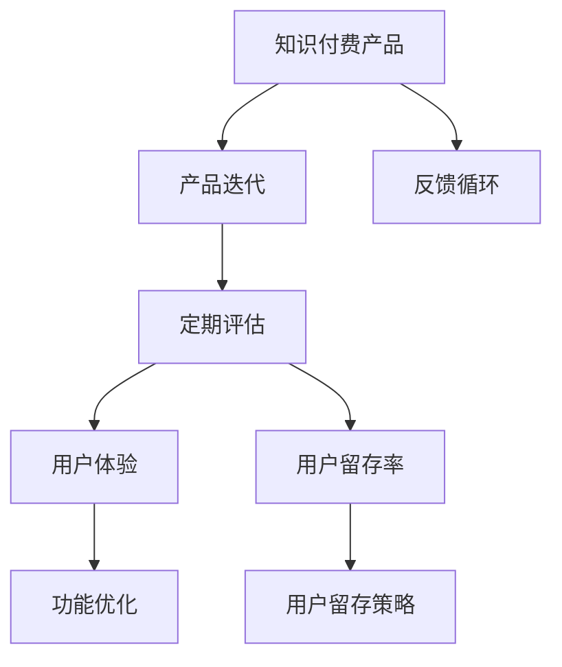

                 

# 知识付费产品的定期评估与迭代

## 1. 背景介绍

随着知识付费平台的兴起，越来越多的人开始享受“买知识，卖时间”的便利。这种模式不仅提升了知识传播的效率，也刺激了知识创作者的积极性。然而，知识付费产品的商业化运作仍存在诸多挑战，其中产品迭代与市场调整是关键。本文旨在探讨知识付费产品的定期评估与迭代方法，通过深入分析核心概念，详细阐述算法原理，提供具体案例实践，为知识付费平台的产品经理和技术开发者提供切实可行的指导。

## 2. 核心概念与联系

### 2.1 核心概念概述

为更好地理解知识付费产品的定期评估与迭代方法，本节将介绍几个密切相关的核心概念：

- **知识付费产品（Knowledge-Paid Products）**：指通过互联网平台，用户为获取特定知识内容而支付费用的产品形式。例如在线课程、电子书、视频讲座等。

- **产品迭代（Product Iteration）**：指在产品开发过程中，不断改进和优化产品功能与性能的持续改进过程。

- **定期评估（Periodic Evaluation）**：指在产品生命周期中，定期进行的功能与性能评估，以判断产品是否达到预期目标，并根据评估结果进行相应的调整。

- **用户体验（User Experience, UX）**：指用户在使用产品过程中的感知和情感体验，是衡量产品满意度和忠诚度的重要指标。

- **用户留存率（User Retention Rate）**：指在一定时间周期内，继续使用产品的用户比例，反映了用户粘性。

- **反馈循环（Feedback Loop）**：指产品通过收集用户反馈，不断优化产品，并反过来影响用户行为的过程。

这些核心概念之间的逻辑关系可以通过以下Mermaid流程图来展示：



这个流程图展示知识付费产品的核心概念及其之间的关系：

1. 知识付费产品通过不断迭代优化功能与性能。
2. 定期评估帮助判断产品是否达到预期目标。
3. 用户体验和用户留存率作为关键指标，指导产品迭代方向。
4. 反馈循环确保产品能够及时响应用户需求，形成正向循环。

## 3. 核心算法原理 & 具体操作步骤

### 3.1 算法原理概述

知识付费产品的定期评估与迭代，本质上是一个持续优化和反馈调整的过程。其核心思想是通过用户行为数据和反馈信息，不断优化产品功能，提升用户体验，从而增加用户留存率和产品收益。

形式化地，假设知识付费产品为 $P$，其功能集合为 $\mathcal{F}$，用户集合为 $\mathcal{U}$。设 $P^t$ 为第 $t$ 轮迭代后的产品，$P^{t+1}$ 为第 $t+1$ 轮迭代后的产品。目标是通过一系列迭代过程，找到最优产品 $P^*$，使得：

$$
P^* = \mathop{\arg\min}_{P \in \mathcal{P}} \mathcal{L}(P, U)
$$

其中 $\mathcal{L}$ 为评估函数，衡量产品 $P$ 与用户集 $U$ 之间的适配度，通常由用户体验和用户留存率等指标组成。通过迭代优化，不断更新产品 $P$，使其性能逼近最优解 $P^*$。

### 3.2 算法步骤详解

基于以上框架，知识付费产品的定期评估与迭代过程一般包括以下几个关键步骤：

**Step 1: 定义评估指标**

- 确定评估目标，如提高用户体验、增加用户留存率等。
- 选择关键指标，如页面加载速度、内容质量、互动频率、付费转化率等。
- 设计数据收集流程，明确数据采集渠道和频次。

**Step 2: 收集与处理数据**

- 通过日志、用户反馈、行为分析等手段，收集用户使用数据。
- 对数据进行清洗、预处理，确保数据的质量和一致性。
- 将数据按不同维度进行分类汇总，如按用户群体、行为路径、时间周期等。

**Step 3: 分析和评估产品表现**

- 根据设定的评估指标，计算产品性能指标。
- 使用统计分析方法，识别问题区域和改进点。
- 结合定性分析，例如用户访谈、焦点小组等，深入理解用户需求。

**Step 4: 制定优化方案**

- 根据评估结果，明确需要优化的功能和性能。
- 设计具体的优化措施，如改进算法、增加新功能、提升用户体验等。
- 确定迭代优先级和资源分配，确保优化方案的可行性和有效性。

**Step 5: 实施迭代**

- 按计划实施优化方案，更新产品功能。
- 监测迭代效果，确保改进措施符合预期。
- 进行产品发布，获取用户反馈，开启下一轮评估与迭代。

### 3.3 算法优缺点

知识付费产品的定期评估与迭代方法具有以下优点：

1. **系统性**：通过科学的方法和流程，持续改进产品，确保产品不断适应市场变化和用户需求。
2. **可控性**：可以通过精细化的数据监控和反馈机制，及时调整产品策略，避免因市场波动导致的较大风险。
3. **灵活性**：根据不同的市场环境，灵活调整产品功能，提升用户满意度和市场竞争力。

同时，该方法也存在一些局限性：

1. **资源消耗**：需要大量资源进行数据收集和处理，尤其是大流量平台，数据处理成本较高。
2. **技术门槛**：涉及到复杂的数据分析和算法优化，需要较高的技术能力。
3. **时间周期长**：每个迭代周期相对较长，从评估到实施再到效果评估，整体周期较长。
4. **效果不易衡量**：用户需求和市场环境变化复杂，难以准确衡量优化措施的效果。

尽管存在这些局限性，但就目前而言，基于定期评估与迭代的持续优化方法仍是知识付费产品开发的重要手段。未来相关研究的重点在于如何进一步降低数据收集和处理的成本，提高评估和迭代的效率，同时兼顾优化措施的效果评估。

### 3.4 算法应用领域

基于定期评估与迭代的知识付费产品开发方法，已在各类在线教育平台、专业社群、技术博客等知识付费场景中广泛应用。例如：

- **在线教育平台**：通过定期评估学习体验，增加互动功能，提升用户学习效果和满意度。
- **专业社群**：根据用户反馈，优化内容质量，增加专业讨论功能，提升社群活跃度。
- **技术博客**：根据用户阅读行为，推荐相关内容，提升内容传播效果和用户粘性。

除了上述这些典型应用外，知识付费产品还创新性地应用于更多场景中，如知识社区、职业培训、在线咨询等，为知识传播和用户成长提供了新的途径。随着知识付费平台的不断创新和优化，相信产品迭代范式将在更多领域得到应用，为知识传播带来新的活力。

## 4. 数学模型和公式 & 详细讲解 & 举例说明

### 4.1 数学模型构建

本节将使用数学语言对知识付费产品的定期评估与迭代过程进行更加严格的刻画。

设知识付费产品 $P$ 在用户群体 $\mathcal{U}$ 上的表现评估函数为 $\mathcal{L}(P, \mathcal{U})$。假设目标是通过 $N$ 轮迭代达到最优解，则迭代过程可形式化为：

$$
P^{t+1} = P^{t} + \alpha \mathcal{G}(P^{t}, \mathcal{U})
$$

其中 $\alpha$ 为迭代步长，$\mathcal{G}$ 为优化函数，根据评估结果对产品进行微调。

### 4.2 公式推导过程

以下我们以用户体验为例，推导用户满意度（Satisfaction Score）的评估函数及其梯度计算公式。

假设用户体验 $S$ 由以下因素决定：页面加载速度 $V$、内容质量 $Q$、互动频率 $I$ 和付费转化率 $C$。用户体验的评估函数可以表示为：

$$
S(P) = w_1 V(P) + w_2 Q(P) + w_3 I(P) + w_4 C(P)
$$

其中 $w_i$ 为各因素的权重，$V, Q, I, C$ 为相应的性能指标函数。

假设 $P^t$ 为第 $t$ 轮迭代后的产品，其用户体验为 $S(P^t)$。通过梯度下降优化算法，使得 $S(P^{t+1})$ 逼近 $S(P^*)$，即：

$$
P^{t+1} = P^t - \eta \nabla_{P} S(P^t)
$$

其中 $\eta$ 为学习率，$\nabla_{P} S(P^t)$ 为 $S(P^t)$ 对产品参数 $P$ 的梯度，可以通过链式法则递归展开，利用自动微分技术完成计算。

在得到用户体验的梯度后，即可带入迭代公式，完成产品的优化过程。重复上述过程直至收敛，最终得到适应用户需求的最佳产品 $P^*$。

### 4.3 案例分析与讲解

以下我们以某在线教育平台为例，展示如何使用上述模型进行用户体验的评估与优化：

**Step 1: 数据收集**
- 收集用户在平台上的行为数据，如学习时长、点击次数、互动评论等。
- 采集用户反馈数据，例如课程评分、评价内容等。

**Step 2: 数据分析**
- 计算页面加载速度 $V$ 和内容质量 $Q$，通过API接口获取。
- 根据用户互动和反馈，计算互动频率 $I$ 和付费转化率 $C$。
- 使用回归分析等方法，计算用户满意度的评估函数 $S(P)$。

**Step 3: 评估与优化**
- 在评估函数 $S(P)$ 的基础上，计算当前产品的用户体验 $S(P^t)$。
- 通过对比理想用户满意度 $S(P^*)$，计算梯度 $\nabla_{P} S(P^t)$。
- 根据梯度方向和大小，确定优化措施，如改进视频加载机制、优化课程推荐算法等。
- 实施优化措施，监测效果，进行下一轮迭代。

通过这种方法，在线教育平台能够持续提升用户体验，增加用户粘性和满意度。

## 5. 项目实践：代码实例和详细解释说明

### 5.1 开发环境搭建

在进行产品评估与迭代实践前，我们需要准备好开发环境。以下是使用Python进行TensorFlow开发的环境配置流程：

1. 安装Anaconda：从官网下载并安装Anaconda，用于创建独立的Python环境。

2. 创建并激活虚拟环境：
```bash
conda create -n tf-env python=3.8 
conda activate tf-env
```

3. 安装TensorFlow：根据CUDA版本，从官网获取对应的安装命令。例如：
```bash
conda install tensorflow -c conda-forge
```

4. 安装Pandas、NumPy、Matplotlib等工具包：
```bash
pip install pandas numpy matplotlib tensorflow-io
```

5. 安装Jupyter Notebook：
```bash
pip install jupyter notebook
```

完成上述步骤后，即可在`tf-env`环境中开始产品评估与迭代实践。

### 5.2 源代码详细实现

这里我们以用户满意度评估为例，给出使用TensorFlow进行评估与优化的PyTorch代码实现。

首先，定义用户满意度的计算函数：

```python
import tensorflow as tf

def calculate_satisfaction_score(V, Q, I, C):
    # 定义各指标的权重
    w = [0.3, 0.3, 0.2, 0.2]
    # 计算用户满意度
    score = tf.reduce_sum(tf.multiply(V, w[0])) + tf.reduce_sum(tf.multiply(Q, w[1])) + tf.reduce_sum(tf.multiply(I, w[2])) + tf.reduce_sum(tf.multiply(C, w[3]))
    return score
```

然后，定义优化目标函数和优化算法：

```python
# 假设优化目标为用户满意度最大化
loss = -calculate_satisfaction_score(V, Q, I, C)

# 定义优化算法
optimizer = tf.keras.optimizers.Adam(learning_rate=0.001)

# 定义优化器应用的代码
with tf.GradientTape() as tape:
    score = calculate_satisfaction_score(V, Q, I, C)
    loss = -score
gradient = tape.gradient(loss, [V, Q, I, C])
optimizer.apply_gradients(zip(gradient, [V, Q, I, C]))
```

最后，定义训练流程并在评估集上评估：

```python
# 假设训练集为V, Q, I, C的样本数据
# 假设评估集为V, Q, I, C的实际数据
# 假设优化轮数为10
epochs = 10

# 训练
for epoch in range(epochs):
    with tf.GradientTape() as tape:
        score = calculate_satisfaction_score(V_train, Q_train, I_train, C_train)
        loss = -score
    gradient = tape.gradient(loss, [V, Q, I, C])
    optimizer.apply_gradients(zip(gradient, [V, Q, I, C]))
    
# 评估
print("测试集上的用户满意度：", calculate_satisfaction_score(V_test, Q_test, I_test, C_test))
```

以上就是使用TensorFlow进行用户满意度评估与优化的完整代码实现。可以看到，TensorFlow提供了强大的数学计算和优化工具，可以高效地进行评估函数和优化算法的实现。

### 5.3 代码解读与分析

让我们再详细解读一下关键代码的实现细节：

**calculate_satisfaction_score函数**：
- 定义了用户满意度的计算方式，通过加权平均各指标，得到综合满意度得分。

**optimizer定义与应用**：
- 使用Adam优化器，定义学习率为0.001，并通过GradientTape记录梯度。
- 应用优化器，更新各指标函数（V, Q, I, C）的参数。

**训练与评估流程**：
- 通过循环，不断计算损失函数和梯度，更新模型参数。
- 在训练集上训练10轮，得到优化后的模型参数。
- 在测试集上评估优化后的模型，输出用户满意度得分。

可以看到，TensorFlow提供了完整的优化和评估框架，使得代码实现更加简洁和高效。开发者可以灵活使用各种数学模型和优化算法，进行产品的定期评估与迭代。

当然，工业级的系统实现还需考虑更多因素，如模型的保存和部署、超参数的自动搜索、更灵活的用户满意度指标等。但核心的评估与迭代范式基本与此类似。

## 6. 实际应用场景

### 6.1 在线教育平台

基于定期评估与迭代的产品开发方法，可以广泛应用于在线教育平台的构建。传统教育往往难以针对不同用户进行个性化教学，而在线教育平台则可以通过持续优化，更好地满足用户需求。

在技术实现上，可以收集用户的学习行为数据，包括学习时长、课程互动情况、学习反馈等。通过分析这些数据，找出用户的学习偏好、薄弱环节，不断优化课程内容、推荐算法和互动设计，提供个性化学习体验。例如，对于学习效率低的学生，可以通过视频解说、个性化练习等手段，帮助其提升学习效果。

### 6.2 职业培训平台

在线职业培训平台需要根据市场变化和用户需求，灵活调整培训内容和方法。通过定期评估与迭代，可以动态更新课程体系，提升培训效果和市场竞争力。

具体而言，可以收集学员的反馈和评估数据，识别出课程中存在的问题和改进点。根据学员的实际需求，灵活调整课程结构、增加实践操作、增加互动环节，提升培训效果和满意度。同时，还可以通过在线考试、作业提交等方式，动态监控学员的学习效果，及时反馈和调整。

### 6.3 知识社区平台

知识社区平台需要通过不断的用户互动和内容优化，提升社区活跃度和知识传播效果。定期评估与迭代方法，可以持续提升社区的用户体验，吸引更多高质量用户和内容。

具体而言，可以收集用户互动数据，包括发帖、评论、点赞等行为，分析用户偏好和兴趣点。通过优化社区界面、增加互动激励、定期推荐热门话题等方式，提升用户活跃度和知识传播效果。例如，对于热门话题，可以增加推荐力度，吸引更多用户参与讨论，提升社区氛围。

### 6.4 未来应用展望

随着知识付费平台的不断创新和优化，基于定期评估与迭代的持续优化方法将在更多领域得到应用，为知识传播和用户成长提供新的动力。

在智慧教育领域，通过持续优化学习体验和内容质量，可以提升在线教育的普及率和效果，为社会提供更多高质量的教育资源。

在职业培训领域，通过动态调整培训内容和方式，可以提升培训效果和学员满意度，为职业发展提供更多支持。

在知识社区领域，通过持续优化用户互动和内容质量，可以提升社区的活跃度和影响力，为知识传播和用户成长提供更多平台和机会。

此外，在企业培训、在线咨询、智能客服等更多场景中，基于定期评估与迭代的持续优化方法，也将不断推动知识付费平台的创新发展，为社会提供更多智能化、个性化的知识服务。

## 7. 工具和资源推荐

### 7.1 学习资源推荐

为了帮助开发者系统掌握定期评估与迭代的方法，这里推荐一些优质的学习资源：

1. **《机器学习实践》系列博文**：由大模型技术专家撰写，深入浅出地介绍了机器学习模型和评估方法。

2. **Coursera《机器学习》课程**：由斯坦福大学开设的机器学习明星课程，涵盖了机器学习的基本概念和经典模型。

3. **《深度学习》书籍**：深度学习领域的经典书籍，系统讲解了深度学习的基本原理和应用方法。

4. **TensorFlow官方文档**：TensorFlow的官方文档，提供了丰富的API接口和样例代码，是开发和调试的重要资源。

5. **Kaggle竞赛平台**：全球知名的数据科学竞赛平台，提供大量数据集和比赛，用于实践和提升数据处理和模型优化能力。

通过对这些资源的学习实践，相信你一定能够快速掌握定期评估与迭代的技术，并用于解决实际的产品优化问题。

### 7.2 开发工具推荐

高效的开发离不开优秀的工具支持。以下是几款用于知识付费产品评估与迭代开发的常用工具：

1. **Jupyter Notebook**：Jupyter Notebook是Python开发者的标配，支持代码编写、数据可视化、文档记录等多种功能，方便开发者进行数据处理和模型评估。

2. **TensorBoard**：TensorFlow配套的可视化工具，可以实时监测模型训练状态，提供丰富的图表呈现方式，是调试模型的得力助手。

3. **GitHub**：全球最大的代码托管平台，可以方便地进行代码版本控制和协作开发，是知识付费产品迭代开发的重要工具。

4. **Kaggle竞赛平台**：全球知名的数据科学竞赛平台，提供大量数据集和比赛，用于实践和提升数据处理和模型优化能力。

5. **Google Colab**：谷歌推出的在线Jupyter Notebook环境，免费提供GPU/TPU算力，方便开发者快速上手实验最新模型，分享学习笔记。

合理利用这些工具，可以显著提升知识付费产品评估与迭代的开发效率，加快创新迭代的步伐。

### 7.3 相关论文推荐

定期评估与迭代方法的发展源于学界的持续研究。以下是几篇奠基性的相关论文，推荐阅读：

1. **《K-means: Algorithms and Applications》**：介绍了K-means聚类算法，可用于用户分群和需求分析。

2. **《Deep Reinforcement Learning for Personalized Video Recommendation》**：展示了深度强化学习在个性化视频推荐中的应用，提供了优化推荐算法的思路。

3. **《User-Centered Design and Experience》**：介绍了用户体验设计的理论和方法，有助于提升知识付费产品的用户体验。

4. **《A Survey on Machine Learning Based Online User Modelling》**：综述了基于机器学习的用户建模方法，提供了用户行为预测和个性化推荐的思路。

这些论文代表了大模型微调技术的发展脉络。通过学习这些前沿成果，可以帮助研究者把握学科前进方向，激发更多的创新灵感。

## 8. 总结：未来发展趋势与挑战

### 8.1 总结

本文对知识付费产品的定期评估与迭代方法进行了全面系统的介绍。首先阐述了定期评估与迭代的重要意义，明确了其在提升用户体验、增加用户留存率和优化产品性能方面的关键作用。其次，从原理到实践，详细讲解了评估与迭代的技术方法，提供了具体案例实现，为知识付费平台的产品经理和技术开发者提供切实可行的指导。同时，本文还广泛探讨了评估与迭代方法在多个行业领域的应用前景，展示了其广阔的应用空间。

通过本文的系统梳理，可以看到，基于定期评估与迭代的持续优化方法已经成为知识付费产品开发的重要手段，极大地提升了产品的市场竞争力和用户满意度。未来，伴随持续评估与迭代技术的不断演进，知识付费平台将在更多领域得到应用，为知识传播带来新的活力。

### 8.2 未来发展趋势

展望未来，知识付费产品的定期评估与迭代方法将呈现以下几个发展趋势：

1. **智能化**：通过引入人工智能技术，如深度学习、强化学习等，实现更加精准的用户需求预测和产品优化。

2. **个性化**：基于用户行为数据和历史数据，提供更加个性化的内容推荐和学习路径，提升用户体验。

3. **实时化**：通过实时数据监控和反馈，实现快速响应和调整，缩短优化周期。

4. **多渠道**：结合多种渠道的数据，如社交媒体、APP数据等，进行综合分析和优化。

5. **跨平台**：通过跨平台数据整合，实现全渠道用户行为分析，提升产品优化效果。

以上趋势凸显了知识付费产品评估与迭代方法的不断进步，通过智能、个性化、实时化的优化，将极大提升产品的市场竞争力和用户满意度。

### 8.3 面临的挑战

尽管知识付费产品的定期评估与迭代方法已经取得了瞩目成就，但在迈向更加智能化、个性化应用的过程中，它仍面临着诸多挑战：

1. **数据质量问题**：高质量数据是评估与迭代的基础，但数据收集和处理成本较高，数据质量难以保证。

2. **技术复杂性**：涉及到复杂的数据分析和模型优化，需要较高的技术能力和时间投入。

3. **用户需求多样性**：用户需求和市场环境变化复杂，难以准确衡量优化措施的效果。

4. **隐私和安全问题**：用户数据隐私和安全保护问题，需进行严格的数据处理和保护。

5. **资源消耗**：需要大量资源进行数据收集和处理，特别是大流量平台，数据处理成本较高。

尽管存在这些挑战，但通过不断优化数据收集和处理流程，提升技术能力，加强隐私保护措施，合理分配资源，定期评估与迭代方法仍将是大模型微调技术的重要手段，为知识付费平台的持续优化提供可靠保障。

### 8.4 研究展望

面对知识付费产品评估与迭代所面临的种种挑战，未来的研究需要在以下几个方面寻求新的突破：

1. **引入更多数据源**：通过引入更多的数据源，如社交媒体、APP数据等，进行综合分析和优化。

2. **优化数据处理流程**：优化数据收集和处理流程，降低数据处理成本，提高数据质量。

3. **引入更多算法**：结合更多算法，如强化学习、深度学习等，提升评估与迭代效果。

4. **增强用户互动**：通过增强用户互动和反馈，提升用户满意度和产品优化效果。

5. **加强隐私保护**：加强用户数据隐私保护措施，确保数据安全。

6. **优化资源分配**：合理分配资源，确保评估与迭代的有效性和实时性。

这些研究方向将引领知识付费产品评估与迭代技术迈向更高的台阶，为知识付费平台的持续优化提供坚实基础。

## 9. 附录：常见问题与解答

**Q1：定期评估与迭代是否适用于所有产品？**

A: 定期评估与迭代方法在大多数知识付费产品中都能取得不错的效果，特别是对于数据量较大的产品。但对于一些特定领域的产品，如医疗、法律等，需要针对具体需求进行定制化的评估与迭代。

**Q2：如何进行高效的定期评估？**

A: 高效的定期评估需要结合多种数据源和分析方法，如实时数据监控、用户行为分析、用户反馈等。同时，需要灵活应用多种评估指标，如用户体验、用户留存率、用户满意度等，综合分析产品表现。

**Q3：如何评估用户满意度？**

A: 用户满意度评估可以基于多项指标，如页面加载速度、内容质量、互动频率、付费转化率等。通过加权平均这些指标，得到综合的用户满意度得分。

**Q4：如何进行用户分群分析？**

A: 用户分群分析可以通过聚类算法实现，如K-means聚类、层次聚类等。通过分析用户行为数据和历史数据，将用户分为不同的群体，进行针对性的优化。

**Q5：如何优化产品功能？**

A: 产品功能的优化需要结合用户反馈和行为数据，找出用户需求和改进点，灵活调整产品功能和设计。可以通过A/B测试、多轮迭代等方式，不断优化产品功能。

---

作者：禅与计算机程序设计艺术 / Zen and the Art of Computer Programming

