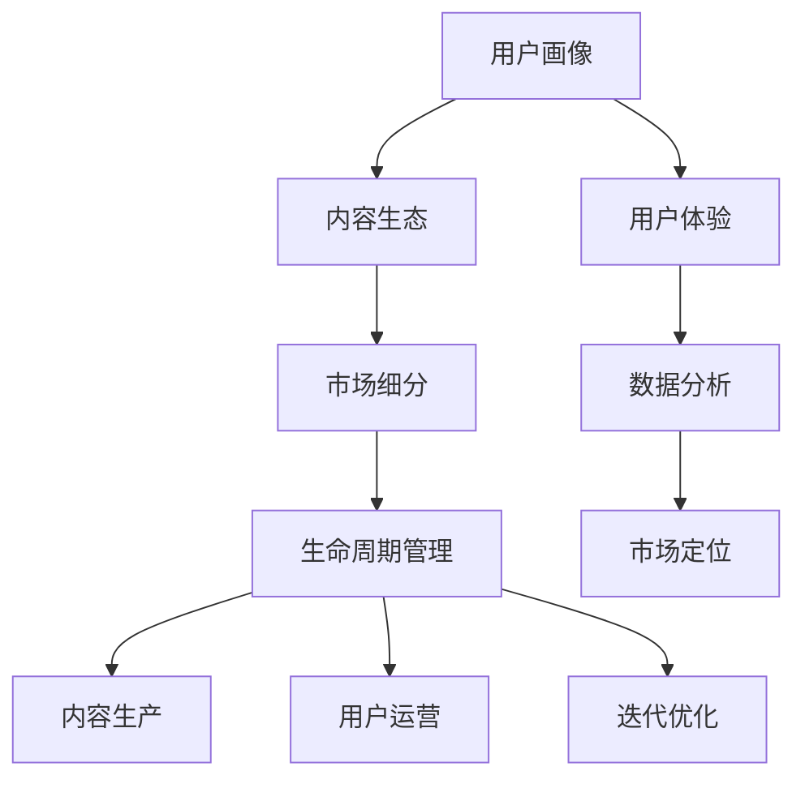

                 

# 知识付费产品的生命周期管理

在当今信息爆炸的时代，知识付费成为一种热门商业模式，无论是教育、专业培训，还是各类主题知识分享，都在知识付费的浪潮中快速成长。然而，知识付费产品的成功不仅仅是内容质量和形式的创新，更离不开有效的生命周期管理。本文将深入探讨知识付费产品的生命周期管理，从市场分析到运营策略，再到产品迭代与用户忠诚度维护，为您提供全面的指导。

## 1. 背景介绍

### 1.1 问题由来
知识付费产品的兴起，得益于互联网的普及和知识传播的便捷性。人们对于个性化、专业化的知识需求日益增长，愿意为高质量内容支付费用。然而，这种新兴商业模式也面临着诸多挑战，如市场竞争激烈、内容同质化严重、用户流失率高，以及如何长期保持用户粘性等。

### 1.2 问题核心关键点
知识付费产品的生命周期管理，涵盖了市场调研、产品规划、内容生产、用户运营、反馈迭代等多个环节。其核心关键点在于：
1. **市场定位**：明确产品目标用户和核心价值主张，制定差异化的市场策略。
2. **内容生产**：建立优质内容生产体系，确保内容的时效性、专业性和可操作性。
3. **用户运营**：设计有效的用户互动和留存机制，提升用户满意度和忠诚度。
4. **迭代优化**：根据用户反馈和市场变化，持续优化产品功能和内容，保持竞争优势。

### 1.3 问题研究意义
有效的生命周期管理对于知识付费产品的成功至关重要。它不仅决定了产品能否吸引并留住用户，还影响着产品的长期价值和盈利能力。通过科学管理，知识付费产品可以实现从产品设计、推广、运营到扩展的持续优化，最大化用户价值，提升市场竞争力。

## 2. 核心概念与联系

### 2.1 核心概念概述

为更好地理解知识付费产品的生命周期管理，本节将介绍几个密切相关的核心概念：

- **生命周期管理**：指从产品构思、设计、开发到推广、运营、维护和迭代升级的全流程管理，确保产品在每个阶段都能最大化用户价值和市场收益。
- **用户画像**：指对目标用户的特征、需求、行为等进行分析，以便制定精准的市场策略和产品定位。
- **内容生态**：指构建多元化的内容生产体系，形成专业的作者社区和丰富的内容库，确保内容质量与多样性。
- **用户体验**：指通过界面设计、功能实现、交互方式等手段提升用户在使用过程中的满意度。
- **数据分析**：指利用大数据、机器学习等技术手段，分析用户行为和产品表现，为产品优化提供数据支持。
- **市场细分**：指将目标市场细分为若干子市场，针对不同细分市场制定差异化的营销策略，提升市场覆盖率和用户转化率。

这些核心概念之间的逻辑关系可以通过以下Mermaid流程图来展示：



这个流程图展示了几大核心概念及其之间的关系：

1. 用户画像为内容生产、市场定位提供依据。
2. 内容生态与用户体验相辅相成，提升用户满意度和忠诚度。
3. 市场细分帮助识别和拓展目标市场，制定差异化策略。
4. 数据分析为产品优化提供数据支持，帮助持续迭代。
5. 生命周期管理贯穿产品生命全流程，确保产品的成功和可持续性。

## 3. 核心算法原理 & 具体操作步骤
### 3.1 算法原理概述

知识付费产品的生命周期管理，本质上是一个多目标优化过程。其核心思想是：通过科学的市场分析、内容生产、用户运营和产品迭代，最大化产品整体价值和用户满意度。

形式化地，假设知识付费产品为 $P$，目标市场为 $M$，内容生产质量为 $C$，用户体验为 $U$，用户满意度为 $S$，市场推广成本为 $P_C$，生命周期总收益为 $R$。则目标函数为：

$$
\max_{P, M, C, U, S} R = \int_{0}^T (R_{t} - P_C \times t) dt
$$

其中 $R_t$ 表示第 $t$ 时间的收益，$P_C$ 表示每单位时间的市场推广成本。

生命周期管理的目标是最大化长期收益 $R$，同时控制推广成本 $P_C$，确保用户满意度 $S$，提升用户体验 $U$ 和内容质量 $C$。

### 3.2 算法步骤详解

知识付费产品的生命周期管理一般包括以下几个关键步骤：

**Step 1: 市场调研与用户画像构建**
- 收集目标市场的数据，包括人口统计、行为特征、需求偏好等。
- 使用数据分析工具，如Tableau、Google Analytics等，对数据进行可视化分析。
- 根据市场数据，构建用户画像，识别目标用户特征和需求。

**Step 2: 产品规划与市场定位**
- 基于用户画像，制定产品规划，明确产品的核心价值主张。
- 选择适合的业务模式，如订阅制、按需付费、内容合作等。
- 设定初始市场定位，包括价格策略、渠道选择等。

**Step 3: 内容生产与生态构建**
- 招募或培养专业作者，建立内容生产团队。
- 制定内容标准和审核流程，确保内容质量与多样性。
- 建立内容合作平台，引入外部高质量内容，形成内容生态。

**Step 4: 用户体验与界面设计**
- 设计简洁易用的界面，提升用户操作体验。
- 开发友好的功能模块，如个性化推荐、学习进度跟踪等。
- 进行用户测试，收集反馈，不断优化产品界面和功能。

**Step 5: 用户运营与留存机制**
- 设计用户互动和反馈机制，提升用户参与度和满意度。
- 实施会员计划、积分系统等激励措施，提升用户粘性。
- 建立客户支持体系，及时处理用户问题和反馈。

**Step 6: 数据分析与市场优化**
- 收集用户行为数据，进行行为分析，识别用户偏好和需求。
- 利用机器学习模型，预测市场趋势，优化产品策略。
- 定期评估产品表现，进行迭代优化，提升用户价值。

**Step 7: 迭代优化与长期维护**
- 根据用户反馈和市场需求，不断迭代产品功能和内容。
- 定期进行产品升级，引入新技术和新功能。
- 建立长期维护机制，持续提升产品稳定性和性能。

### 3.3 算法优缺点

知识付费产品的生命周期管理具有以下优点：
1. 全面覆盖产品生命周期的各个环节，确保产品整体性能和用户满意度。
2. 通过科学的市场分析和用户画像，制定精准的市场策略和产品定位。
3. 建立专业的内容生产体系和用户运营机制，提升产品竞争力。
4. 利用数据分析和机器学习技术，为产品优化提供科学依据，实现持续迭代。

同时，该方法也存在一定的局限性：
1. 对数据收集和分析能力要求较高，需投入较多资源。
2. 在产品迭代过程中，需要不断平衡新功能和用户体验，协调成本较高。
3. 市场竞争激烈，需时刻关注市场动态，调整策略。
4. 用户需求多样，需灵活调整产品策略，保持灵活性。

尽管存在这些局限性，但就目前而言，生命周期管理方法仍是知识付费产品成功的重要保障。未来相关研究的重点在于如何更有效地利用数据分析，提高产品迭代效率，同时兼顾用户体验和用户粘性。

### 3.4 算法应用领域

知识付费产品的生命周期管理，在多个领域得到了广泛的应用，例如：

- 教育培训：通过科学的课程规划和内容生产，提升学习效果，满足用户个性化学习需求。
- 职业培训：针对特定职业，提供专业技能培训课程，帮助用户快速提升职业能力。
- 心理健康：提供专业的心理咨询和心理健康指导，帮助用户应对心理压力。
- 技能提升：提供各类技能培训课程，如编程、设计、营销等，提升用户职业技能。
- 健康管理：提供健康知识、饮食、运动指导，帮助用户提升健康水平。

除了这些经典应用外，知识付费产品的生命周期管理还被创新性地应用到更多场景中，如职业规划、法律咨询、财税知识等，为各行各业提供专业的知识服务。

## 4. 数学模型和公式 & 详细讲解 & 举例说明

### 4.1 数学模型构建

本节将使用数学语言对知识付费产品的生命周期管理过程进行更加严格的刻画。

假设知识付费产品为 $P$，目标市场为 $M$，内容生产质量为 $C$，用户体验为 $U$，用户满意度为 $S$，市场推广成本为 $P_C$，生命周期总收益为 $R$。

定义产品 $P$ 在时间 $t$ 的收益为 $R_t = f(C, U, S, t)$，推广成本为 $P_C = k \times t$，其中 $k$ 为推广成本系数。

生命周期总收益为 $R = \int_{0}^T R_t dt = \int_{0}^T f(C, U, S, t) dt - \int_{0}^T P_C dt$。

### 4.2 公式推导过程

以下我们以教育培训课程为例，推导收益模型及其优化策略。

假设课程内容质量为 $C_t$，用户体验为 $U_t$，用户满意度为 $S_t$，推广成本为 $P_C$，则课程在时间 $t$ 的收益为：

$$
R_t = C_t \times U_t \times S_t
$$

其中 $C_t$ 为内容生产质量，$U_t$ 为用户体验，$S_t$ 为用户满意度。

推广成本为：

$$
P_C = k \times t
$$

其中 $k$ 为推广成本系数，$t$ 为时间。

根据上述模型，生命周期总收益为：

$$
R = \int_{0}^T R_t dt - \int_{0}^T P_C dt = \int_{0}^T C_t \times U_t \times S_t dt - k \times \frac{T^2}{2}
$$

为了最大化 $R$，需要优化 $C_t$、$U_t$、$S_t$，同时控制 $P_C$。

### 4.3 案例分析与讲解

假设某教育培训平台有三种课程：编程、设计、营销。根据历史数据和市场调研，我们可以得到以下优化策略：

- 编程课程用户画像：20-30岁的年轻群体，偏好在线学习，需求多样。
- 设计课程用户画像：25-35岁的职场人士，注重实用性和互动性。
- 营销课程用户画像：20-40岁的中青年，重视职业提升和市场营销。

基于这些用户画像，我们可以制定不同的市场策略和内容生产计划。

**编程课程**：
- 内容生产：与知名编程公司合作，引入高质量课程内容。
- 用户体验：设计互动式学习工具，提升用户学习效果。
- 用户满意度：引入社区反馈机制，持续改进课程质量。
- 推广成本：通过社交媒体、搜索引擎优化等方式推广，控制成本。

**设计课程**：
- 内容生产：聘请设计领域专家，提供实战项目导向的课程。
- 用户体验：利用虚拟现实技术，提供沉浸式学习体验。
- 用户满意度：定期进行课程满意度调查，优化课程设计。
- 推广成本：利用线下设计展览、行业交流会等活动，提升品牌知名度。

**营销课程**：
- 内容生产：邀请市场营销专家，提供实战案例分析。
- 用户体验：设计个性化推荐系统，推荐相关课程和资源。
- 用户满意度：提供一对一咨询和指导，提升用户学习效果。
- 推广成本：通过线上线下广告投放，精准触达目标用户。

通过上述优化策略，可以最大化课程的长期收益 $R$，同时控制推广成本 $P_C$，提升用户满意度 $S$ 和用户体验 $U$。

## 5. 项目实践：代码实例和详细解释说明

### 5.1 开发环境搭建

在进行知识付费产品的生命周期管理实践前，我们需要准备好开发环境。以下是使用Python进行Flask开发的环境配置流程：

1. 安装Python：确保Python版本为3.6及以上，推荐使用Anaconda进行环境管理。
2. 安装Flask：使用pip安装Flask框架。
3. 安装SQLAlchemy：用于数据库操作。
4. 安装Jinja2：用于模板渲染。
5. 安装Flask-RESTful：用于API开发。
6. 安装Flask-SocketIO：用于实时通信。
7. 安装Flask-WTF：用于表单验证。
8. 安装Flask-Login：用于用户认证。
9. 安装Flask-Admin：用于后台管理。
10. 安装Gunicorn：用于WSGI服务器。

完成上述步骤后，即可在开发环境中进行知识付费产品的生命周期管理开发。

### 5.2 源代码详细实现

下面我们以知识付费平台的数据分析和用户运营模块为例，给出使用Flask进行开发的PyTorch代码实现。

**数据分析模块**：

```python
from flask import Flask, request
from sqlalchemy import create_engine
from sqlalchemy.orm import sessionmaker
from transformers import BertTokenizer, BertForSequenceClassification
import torch

app = Flask(__name__)

# 连接数据库
engine = create_engine('sqlite:///example.db')
Session = sessionmaker(bind=engine)
session = Session()

# 定义数据分析模型
class AnalyticData:
    def __init__(self, id, name, date, value):
        self.id = id
        self.name = name
        self.date = date
        self.value = value

# 加载模型
model = BertForSequenceClassification.from_pretrained('bert-base-cased', num_labels=2)
tokenizer = BertTokenizer.from_pretrained('bert-base-cased')

# 定义数据分析函数
@app.route('/analytic_data', methods=['POST'])
def analytic_data():
    data = request.get_json()
    text = data['text']
    date = data['date']
    value = data['value']

    # 处理文本数据
    input_ids = tokenizer(text, return_tensors='pt', max_length=128, padding='max_length', truncation=True).input_ids
    outputs = model(input_ids)
    label = outputs.logits.argmax().item()

    # 存储分析结果
    new_data = AnalyticData(id=session.query(AnalyticData.id).max() + 1, name='sentiment', date=date, value=label)
    session.add(new_data)
    session.commit()

    return 'Data analysis successful'

# 启动Flask应用
if __name__ == '__main__':
    app.run(debug=True)
```

**用户运营模块**：

```python
from flask import Flask, request
from sqlalchemy import create_engine
from sqlalchemy.orm import sessionmaker
from transformers import BertTokenizer, BertForSequenceClassification
import torch

app = Flask(__name__)

# 连接数据库
engine = create_engine('sqlite:///example.db')
Session = sessionmaker(bind=engine)
session = Session()

# 定义用户运营模型
class UserOperation:
    def __init__(self, id, name, date, value):
        self.id = id
        self.name = name
        self.date = date
        self.value = value

# 加载模型
model = BertForSequenceClassification.from_pretrained('bert-base-cased', num_labels=2)
tokenizer = BertTokenizer.from_pretrained('bert-base-cased')

# 定义用户运营函数
@app.route('/user_operation', methods=['POST'])
def user_operation():
    data = request.get_json()
    text = data['text']
    date = data['date']
    value = data['value']

    # 处理文本数据
    input_ids = tokenizer(text, return_tensors='pt', max_length=128, padding='max_length', truncation=True).input_ids
    outputs = model(input_ids)
    label = outputs.logits.argmax().item()

    # 存储运营结果
    new_operation = UserOperation(id=session.query(UserOperation.id).max() + 1, name='churn', date=date, value=label)
    session.add(new_operation)
    session.commit()

    return 'User operation successful'

# 启动Flask应用
if __name__ == '__main__':
    app.run(debug=True)
```

### 5.3 代码解读与分析

让我们再详细解读一下关键代码的实现细节：

**AnalyticData类**：
- `__init__`方法：初始化数据分析结果，包括id、名称、日期、值。
- `id`：自动递增的id，用于唯一标识数据记录。
- `name`：数据分析结果的名称，如"sentiment"表示情感分析结果。
- `date`：数据分析结果的日期，用于记录时间。
- `value`：数据分析结果的值，通常为二分类结果，0或1。

**UserOperation类**：
- `__init__`方法：初始化用户运营结果，包括id、名称、日期、值。
- `id`：自动递增的id，用于唯一标识用户运营结果。
- `name`：用户运营结果的名称，如"churn"表示用户流失情况。
- `date`：用户运营结果的日期，用于记录时间。
- `value`：用户运营结果的值，通常为二分类结果，0或1。

**数据分析模块代码**：
- `analytic_data`函数：接收用户提交的文本和日期，进行处理后进行数据分析，并将结果存储到数据库中。
- 加载BERT模型，将输入文本处理为token ids，输入到模型中进行预测，获取二分类结果。
- 将预测结果存储到数据库中，返回成功消息。

**用户运营模块代码**：
- `user_operation`函数：接收用户提交的文本和日期，进行处理后进行用户运营，并将结果存储到数据库中。
- 加载BERT模型，将输入文本处理为token ids，输入到模型中进行预测，获取二分类结果。
- 将预测结果存储到数据库中，返回成功消息。

**Flask应用启动**：
- `app.run(debug=True)`：启动Flask应用，在调试模式下运行，方便调试和测试。

可以看到，Flask框架提供了丰富的工具和库，使得知识付费产品的数据分析和用户运营模块开发变得相对简单。开发者可以将更多精力放在业务逻辑和数据处理上，而不必过多关注底层的Web开发细节。

当然，工业级的系统实现还需考虑更多因素，如数据库设计、安全性、性能优化等。但核心的生命周期管理流程基本与此类似。

## 6. 实际应用场景
### 6.1 教育培训

教育培训行业的知识付费产品生命周期管理，重点在于内容生产和用户体验的优化。通过科学的课程规划和内容生产，提升课程质量，满足用户个性化学习需求。

**市场调研**：收集用户反馈，分析课程效果，优化课程设计和教学方法。

**内容生产**：与知名教育机构合作，引入高质量课程内容，建立专业的作者团队，持续生产优质课程。

**用户体验**：设计互动式学习工具，如在线测验、学习进度跟踪等，提升用户学习效果。

**用户运营**：实施会员计划、积分系统等激励措施，提升用户粘性。建立客户支持体系，及时处理用户问题和反馈。

**数据分析**：收集用户行为数据，进行行为分析，识别用户偏好和需求，优化课程内容和推荐系统。

通过上述策略，可以最大化教育培训产品的长期收益，同时提升用户满意度，保持市场竞争力。

### 6.2 职业培训

职业培训行业的知识付费产品生命周期管理，重点在于提供专业技能培训，帮助用户快速提升职业能力。

**市场调研**：分析行业发展趋势和市场需求，确定课程方向和内容。

**内容生产**：邀请行业专家，提供实战项目导向的课程，确保课程实用性和前沿性。

**用户体验**：利用虚拟现实技术，提供沉浸式学习体验，提升用户学习效果。

**用户运营**：实施项目指导、实践机会等激励措施，提升用户学习动力。建立职业指导体系，提供个性化职业规划服务。

**数据分析**：收集用户学习数据，分析学习效果和职业发展路径，优化课程内容和教学方法。

通过上述策略，可以最大化职业培训产品的长期收益，同时提升用户职业技能，满足用户职业发展需求。

### 6.3 健康管理

健康管理行业的知识付费产品生命周期管理，重点在于提供健康知识、饮食、运动指导，帮助用户提升健康水平。

**市场调研**：分析健康管理需求和市场趋势，确定课程方向和内容。

**内容生产**：邀请健康管理专家，提供科学健康指导和实践建议。

**用户体验**：设计个性化推荐系统，推荐相关健康课程和资源，提升用户健康管理效果。

**用户运营**：实施健康挑战、健康评估等激励措施，提升用户健康管理动力。建立健康支持体系，提供专业健康咨询和指导。

**数据分析**：收集用户健康数据，分析健康管理和用户行为，优化课程内容和推荐系统。

通过上述策略，可以最大化健康管理产品的长期收益，同时提升用户健康水平，满足用户健康管理需求。

### 6.4 未来应用展望

随着知识付费产品的持续发展，未来将在更多领域得到应用，为各行各业提供专业的知识服务。

在智慧医疗领域，基于知识付费的健康咨询、医疗知识普及等应用将提升医疗服务的智能化水平，帮助用户快速获得健康建议。

在智能教育领域，知识付费产品将与AI技术结合，提供个性化学习方案，提升教育效果和效率。

在职业培训领域，通过知识付费平台，用户可以随时随地获取专业技能培训，满足职业发展需求。

在心理健康领域，基于知识付费的产品将提供心理健康指导和支持，帮助用户应对心理压力，提升心理健康水平。

在健康管理领域，知识付费产品将帮助用户科学管理健康，提升健康管理效果。

此外，在金融、旅游、美食等多个领域，知识付费产品也将不断涌现，为各行各业提供知识服务和解决方案。相信随着技术的不断进步和应用的不断深入，知识付费产品必将在更多领域展现其独特的价值。

## 7. 工具和资源推荐
### 7.1 学习资源推荐

为了帮助开发者系统掌握知识付费产品的生命周期管理理论基础和实践技巧，这里推荐一些优质的学习资源：

1. **《知识付费：商业模式的未来》**：一本关于知识付费行业的研究著作，涵盖市场分析、用户运营、内容生产等多个方面。
2. **Coursera《知识付费的创新与挑战》课程**：由知名教育专家讲授，详细解读知识付费行业的现状和未来趋势。
3. **EdX《在线课程设计与运营》课程**：提供系统化的在线课程设计和运营知识，涵盖课程内容生产、用户互动等多个环节。
4. **Udemy《知识付费产品开发》课程**：全面讲解知识付费产品的开发流程和实战技巧，包括市场分析、数据分析等多个方面。
5. **Khan Academy《数据科学与分析》课程**：通过数据分析技术，提升用户行为分析和产品优化的能力。

通过对这些资源的学习实践，相信你一定能够快速掌握知识付费产品的生命周期管理精髓，并用于解决实际问题。

### 7.2 开发工具推荐

高效的开发离不开优秀的工具支持。以下是几款用于知识付费产品开发的常用工具：

1. **Flask**：Python的Web开发框架，简单易用，适合快速开发和部署。
2. **SQLAlchemy**：Python的数据库访问工具，提供ORM和SQL语句自动生成功能，方便数据库操作。
3. **Jinja2**：Python的模板渲染引擎，支持模板继承、变量扩展等高级特性。
4. **Flask-RESTful**：Python的RESTful API开发工具，支持无状态的HTTP请求处理。
5. **Flask-SocketIO**：Python的实时通信工具，支持WebSocket协议，实现即时数据交互。
6. **Flask-WTF**：Python的表单验证工具，支持CSRF保护、数据验证等安全特性。
7. **Flask-Login**：Python的用户认证工具，支持用户登录、注销、权限控制等功能。
8. **Flask-Admin**：Python的后台管理工具，提供可视化界面和数据操作功能。
9. **Gunicorn**：Python的WSGI服务器，支持多进程、多线程等并发处理能力。

合理利用这些工具，可以显著提升知识付费产品的开发效率，加快创新迭代的步伐。

### 7.3 相关论文推荐

知识付费产品的生命周期管理，源于学界的持续研究。以下是几篇奠基性的相关论文，推荐阅读：

1. **《知识付费的市场趋势与用户行为分析》**：研究知识付费市场的发展趋势和用户行为，提出市场细分的策略和用户运营的措施。
2. **《基于机器学习的数据驱动用户行为分析》**：探讨机器学习技术在用户行为分析中的应用，提出数据驱动的用户运营策略。
3. **《知识付费平台的内容推荐系统研究》**：详细介绍了知识付费平台的内容推荐系统，包括推荐算法、数据处理等多个方面。
4. **《知识付费产品的用户参与度提升策略》**：分析用户参与度的影响因素，提出提升用户参与度的策略和措施。
5. **《知识付费产品的用户体验设计》**：研究知识付费产品的用户体验设计，提出提升用户体验的设计原则和方法。

这些论文代表了大数据和人工智能在知识付费产品中的应用，为知识付费产品的生命周期管理提供了理论基础和实践指导。

## 8. 总结：未来发展趋势与挑战
### 8.1 总结

本文对知识付费产品的生命周期管理进行了全面系统的介绍。首先阐述了知识付费产品的兴起背景和核心关键点，明确了市场定位、内容生产、用户运营、迭代优化等管理流程。其次，从数学模型和公式的角度，详细讲解了收益模型的构建和优化策略。最后，给出了知识付费产品在不同领域的实际应用案例，展示了其在教育培训、职业培训、健康管理等诸多领域的应用前景。

通过本文的系统梳理，可以看到，知识付费产品的生命周期管理是一个复杂的多目标优化问题，需要通过科学的市场分析、内容生产、用户运营和产品迭代，最大化用户价值和市场收益。未来，伴随技术的发展和应用的深入，知识付费产品必将在更多领域大放异彩，成为各行各业知识服务的重要手段。

### 8.2 未来发展趋势

展望未来，知识付费产品的生命周期管理将呈现以下几个发展趋势：

1. **个性化定制**：利用大数据和人工智能技术，为用户提供个性化的学习方案，满足用户多样化的学习需求。
2. **多元化内容**：引入多种形式的内容，如视频、音频、互动式课程等，提升用户学习效果和体验。
3. **实时反馈**：通过实时数据分析和用户互动，提供即时反馈，提升用户学习动力和满意度。
4. **数据驱动**：利用大数据和机器学习技术，优化产品策略和内容生产，提升用户价值和市场竞争力。
5. **跨平台整合**：将知识付费产品与社交媒体、在线社区等平台整合，提升用户参与度和留存率。
6. **国际化扩展**：面向全球市场，开发多语言、多文化的内容和产品，扩大用户基础和市场规模。

以上趋势凸显了知识付费产品生命周期管理的广阔前景。这些方向的探索发展，必将进一步提升知识付费产品的用户体验和用户满意度，实现可持续发展。

### 8.3 面临的挑战

尽管知识付费产品已经取得了一定的成功，但在迈向更加智能化、普适化应用的过程中，它仍面临着诸多挑战：

1. **用户需求多样化**：不同用户的需求差异较大，需灵活调整产品策略，保持灵活性。
2. **内容生产成本高**：高质量内容的生产需要专业团队和大量资源，成本较高。
3. **市场竞争激烈**：知识付费产品市场竞争激烈，需不断创新和优化，保持竞争优势。
4. **数据隐私和安全**：用户数据的隐私和安全需得到充分保障，避免数据泄露和滥用。
5. **用户转化率低**：如何提高用户转化率和留存率，提升用户粘性，仍是一个难题。

尽管存在这些挑战，但只要积极应对并寻求突破，知识付费产品必将在未来取得更大的成功和突破。

### 8.4 研究展望

面对知识付费产品所面临的挑战，未来的研究需要在以下几个方面寻求新的突破：

1. **用户需求分析**：深入研究用户需求和行为，制定更加精准的市场策略和产品定位。
2. **内容生产优化**：优化内容生产流程和内容审核机制，降低生产成本，提高内容质量。
3. **用户运营创新**：创新用户互动和留存机制，提升用户满意度和忠诚度。
4. **数据分析技术**：引入先进的数据分析技术，优化产品策略和内容生产，提升用户价值。
5. **数据隐私保护**：加强数据隐私和安全保护，确保用户数据不被滥用。
6. **用户体验设计**：提升用户体验设计，满足用户多样化的学习需求，提升用户粘性。

这些研究方向的探索，必将引领知识付费产品生命周期管理的不断优化和提升，为知识付费产品提供更多的创新和发展空间。总之，知识付费产品生命周期管理需要从市场分析、内容生产、用户运营和产品迭代等多个环节进行全面优化，方能真正实现产品的成功和可持续发展。

## 9. 附录：常见问题与解答

**Q1: 知识付费产品的生命周期管理与传统培训有何不同？**

A: 知识付费产品的生命周期管理与传统培训的主要区别在于：

1. **目标导向**：知识付费产品更加注重用户需求和市场趋势，以用户价值最大化为根本目标。
2. **灵活性**：知识付费产品具有更高的灵活性，能够快速响应市场需求，调整产品策略和内容生产。
3. **技术驱动**：知识付费产品高度依赖大数据和人工智能技术，能够提供更加个性化、智能化的服务。
4. **用户自主性**：知识付费产品更加注重用户自主学习和参与，提供丰富的互动和反馈机制。

这些区别使得知识付费产品具有更高的市场竞争力和用户满意度。

**Q2: 知识付费产品如何进行市场定位？**

A: 知识付费产品进行市场定位，主要包括以下几个步骤：

1. **用户画像**：收集用户数据，分析用户特征、需求和行为，构建用户画像。
2. **需求分析**：分析市场需求和竞争情况，识别目标用户群体的核心需求。
3. **竞争分析**：分析竞争对手的优势和劣势，确定自身产品的差异化策略。
4. **价值主张**：基于用户画像和需求分析，制定核心价值主张，明确产品定位和竞争优势。
5. **市场推广**：制定推广策略和渠道，确保产品能够精准触达目标用户。

通过这些步骤，可以制定科学的市场定位策略，提升产品市场覆盖率和用户转化率。

**Q3: 知识付费产品的数据分析有哪些关键指标？**

A: 知识付费产品的数据分析关键指标包括：

1. **用户参与度**：如用户登录频率、学习时长、互动次数等，评估用户对产品的使用情况。
2. **课程完成度**：如课程完成率、章节通过率等，评估用户的学习效果和课程质量。
3. **用户转化率**：如新用户注册率、付费转化率等，评估产品的市场效果和用户粘性。
4. **用户留存率**：如月活跃用户数、日活跃用户数等，评估用户流失情况和产品稳定度。
5. **课程满意度**：如课程评价分数、用户反馈等，评估用户对课程的满意度。
6. **推荐准确率**：如推荐系统的效果，评估个性化推荐的效果和用户参与度。

通过这些关键指标，可以全面评估产品的用户价值和市场表现，为产品优化和策略调整提供数据支持。

**Q4: 知识付费产品如何进行内容生产优化？**

A: 知识付费产品进行内容生产优化，主要包括以下几个步骤：

1. **需求调研**：收集用户需求和市场趋势，确定课程方向和内容形式。
2. **内容策划**：制定课程大纲和内容设计，确保课程内容全面、系统、实用。
3. **专家合作**：邀请行业专家和领域权威，提供高质量的课程内容，确保课程专业性和权威性。
4. **内容审核**：建立内容审核机制，确保内容质量和版权合法。
5. **内容迭代**：根据用户反馈和市场变化，持续优化课程内容和教学方法，提升课程效果。

通过这些步骤，可以建立专业、高效的内容生产体系，提升产品竞争力和用户满意度。

**Q5: 知识付费产品如何进行用户运营优化？**

A: 知识付费产品进行用户运营优化，主要包括以下几个步骤：

1. **用户画像**：收集用户数据，分析用户特征和行为，构建用户画像。
2. **用户互动**：设计用户互动机制，如问答、评论、学习进度跟踪等，提升用户参与度和满意度。
3. **激励措施**：实施会员计划、积分系统、学习挑战等激励措施，提升用户粘性。
4. **客户支持**：建立客户支持体系，及时处理用户问题和反馈，提升用户满意度。
5. **数据分析**：收集用户行为数据，进行行为分析，识别用户偏好和需求，优化产品策略。

通过这些步骤，可以提升用户运营效果，提升用户满意度和粘性，保持市场竞争力。

---

作者：禅与计算机程序设计艺术 / Zen and the Art of Computer Programming

