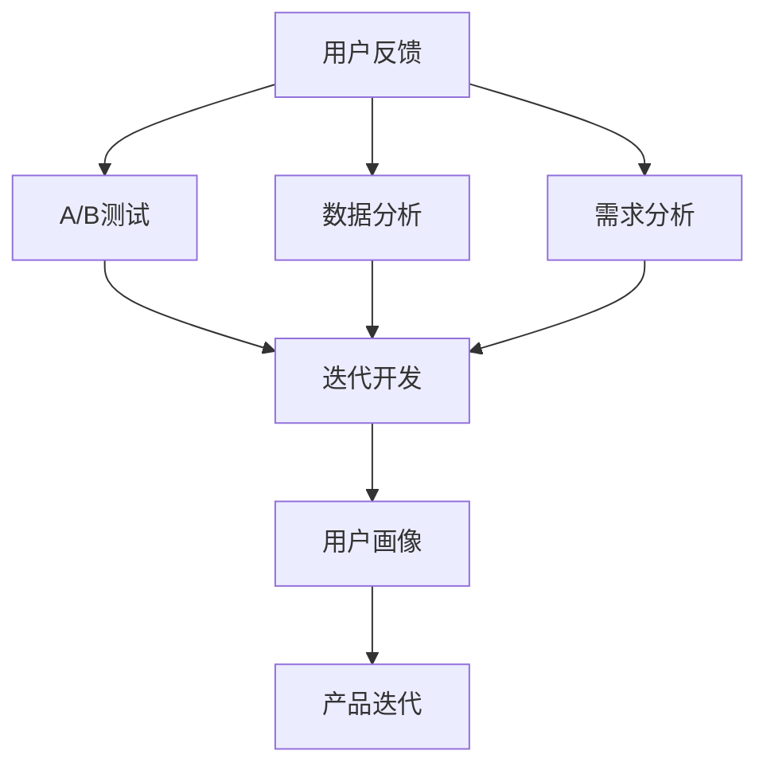

                 

## 1. 背景介绍

### 1.1 问题由来
随着互联网技术和信息爆炸的推进，在线教育行业迅速崛起，知识付费成为热门趋势。通过订阅课程、购买专栏、打赏作者等多种形式，消费者以更低成本获取专业知识和信息。知识付费产品纷纷涌现，如得到、喜马拉雅、字节跳动旗下的“学浪”等。然而，在用户高度需求和信息高度饱和的环境下，如何提升知识付费产品的用户满意度和留存率，成为一个亟待解决的难题。

### 1.2 问题核心关键点
用户反馈收集与迭代是知识付费产品提升用户体验的核心策略。具体来说，包括以下几个方面：

1. **数据收集与分析**：通过分析用户行为数据（如课程浏览次数、学习时长、付费行为等），了解用户需求和兴趣点。
2. **反馈收集**：通过问卷调查、评论互动、用户访谈等方式，直接获取用户的意见和建议。
3. **需求分析与归类**：对收集到的用户反馈进行分析和归类，形成用户需求列表。
4. **产品迭代**：根据用户需求列表，制定迭代计划，优化课程内容和体验，提升用户满意度。

## 2. 核心概念与联系

### 2.1 核心概念概述

为了更好地理解知识付费产品用户反馈收集与迭代的方法，本节将介绍几个核心概念：

- **用户反馈**：用户在产品使用过程中产生的意见、建议、投诉、表扬等信息，是提升产品质量和用户体验的重要依据。
- **A/B测试**：通过将用户随机分配到不同的版本中，比较不同版本的表现，优化产品设计。
- **数据分析**：通过统计分析和数据挖掘技术，从用户行为数据中发现规律，指导产品优化。
- **需求分析**：通过用户反馈，确定产品的优化方向，形成详细的需求列表。
- **迭代开发**：在快速原型设计和用户验证的基础上，不断迭代产品功能，提升用户体验。
- **用户画像**：基于用户行为数据和反馈信息，构建典型用户画像，指导产品设计和功能优化。

这些核心概念之间的逻辑关系可以通过以下Mermaid流程图来展示：



这个流程图展示了一个完整的用户反馈收集与迭代过程，包括用户反馈的收集和分析、A/B测试、需求分析、迭代开发和用户画像的构建。

## 3. 核心算法原理 & 具体操作步骤
### 3.1 算法原理概述

知识付费产品的用户反馈收集与迭代，本质上是一个数据驱动的产品优化过程。其核心思想是：通过收集和分析用户反馈，确定产品优化方向，指导产品迭代，提升用户体验和满意度。

形式化地，假设用户反馈数据集为 $D=\{(x_i,y_i)\}_{i=1}^N$，其中 $x_i$ 表示用户行为数据或反馈内容，$y_i$ 表示用户满意度评分（如1-5分）。优化目标是最小化损失函数 $\mathcal{L}(y_i,f(x_i))$，其中 $f(x_i)$ 是当前产品的性能指标。

通过梯度下降等优化算法，迭代更新产品参数，最小化损失函数，从而提升产品的用户体验。由于用户满意度评分往往具有离散性质，可以使用统计学习中经典的回归方法（如线性回归、决策树回归等）进行优化。

### 3.2 算法步骤详解

知识付费产品的用户反馈收集与迭代一般包括以下几个关键步骤：

**Step 1: 准备数据集**
- 收集用户行为数据和反馈数据，划分为训练集、验证集和测试集。
- 对数据进行预处理，包括缺失值处理、特征工程、数据清洗等。

**Step 2: 选择合适的算法**
- 选择合适的机器学习或深度学习算法，如线性回归、决策树、XGBoost、LSTM、GRU等。
- 设定模型的超参数，如学习率、迭代次数、正则化系数等。

**Step 3: 执行训练与验证**
- 将训练集数据输入模型进行训练，计算损失函数和梯度。
- 在验证集上评估模型性能，根据验证误差调整模型参数。
- 重复上述步骤直至收敛。

**Step 4: 产品迭代与优化**
- 根据测试集上的评估结果，结合用户画像，制定产品迭代计划。
- 修改产品设计，实现新功能，优化用户体验。
- 在用户反馈和产品表现的基础上，进一步迭代优化。

### 3.3 算法优缺点

知识付费产品的用户反馈收集与迭代方法具有以下优点：
1. 数据驱动：通过分析用户反馈和行为数据，精确识别用户需求，优化产品设计。
2. 动态调整：根据用户反馈和市场变化，灵活调整产品策略，快速迭代更新。
3. 科学优化：采用科学方法进行数据分析和模型训练，提高优化效果。
4. 可解释性强：通过对模型的可视化分析，用户反馈的关联性更强，易于理解。

同时，该方法也存在一些局限性：
1. 依赖数据质量：模型效果很大程度上取决于数据的质量和完整性。
2. 模型选择困难：选择合适的算法和模型需要大量实验和调试。
3. 迭代周期长：产品优化往往需要多次迭代，周期较长。
4. 用户多样性：用户需求和反馈具有高度多样性，难以用统一模型处理。
5. 主观偏见：用户反馈可能受到主观偏见和情绪影响，分析结果需加以筛选。

尽管存在这些局限性，但就目前而言，用户反馈收集与迭代方法仍是知识付费产品优化中的主流范式。未来相关研究的重点在于如何进一步降低模型对数据的依赖，提高模型的泛化能力和鲁棒性，同时兼顾可解释性和用户体验等因素。

### 3.4 算法应用领域

知识付费产品的用户反馈收集与迭代方法，在教育技术、在线视频、社交媒体等多个领域均有广泛应用。

- **在线教育**：通过分析学生课程学习数据和反馈，优化课程内容和教学方法，提升学习效果。
- **在线视频平台**：根据用户观看行为和评价，调整视频推荐算法，提升用户体验。
- **社交媒体**：分析用户互动数据和反馈，优化内容和功能，提高用户黏性。
- **企业培训**：通过员工培训数据和反馈，定制化培训内容，提升培训效果。

除了这些应用领域，知识付费产品的用户反馈收集与迭代方法还在智能客服、游戏设计、金融投资等多个行业得到广泛应用，为产品的优化和创新提供了重要支持。

## 4. 数学模型和公式 & 详细讲解
### 4.1 数学模型构建

本节将使用数学语言对知识付费产品用户反馈收集与迭代过程进行更加严格的刻画。

假设用户反馈数据集为 $D=\{(x_i,y_i)\}_{i=1}^N$，其中 $x_i$ 表示用户行为数据或反馈内容，$y_i$ 表示用户满意度评分。定义模型 $f(x_i)$ 表示用户满意度与用户行为之间的映射关系。模型的目标是找到最优参数 $\theta$，使得模型预测结果 $f(x_i)$ 与实际用户满意度 $y_i$ 之间的差异最小化。

我们可以使用回归模型，如线性回归，来构建用户满意度预测模型。假设回归模型的形式为：

$$
f(x_i) = \theta_0 + \theta_1 x_{i1} + \theta_2 x_{i2} + ... + \theta_p x_{ip}
$$

其中 $x_{ij}$ 表示第 $j$ 个特征，$\theta_j$ 表示对应的模型参数。回归模型的损失函数为：

$$
\mathcal{L}(\theta) = \frac{1}{N} \sum_{i=1}^N (y_i - f(x_i))^2
$$

在得到损失函数后，可以通过梯度下降等优化算法，迭代更新模型参数 $\theta$，最小化损失函数。

### 4.2 公式推导过程

以线性回归为例，推导用户满意度预测模型的损失函数及其梯度计算公式。

根据最小二乘法的思想，目标是最小化平方误差：

$$
\mathcal{L}(\theta) = \frac{1}{N} \sum_{i=1}^N (y_i - \hat{y}_i)^2
$$

其中 $\hat{y}_i$ 表示模型对样本 $x_i$ 的预测值。根据链式法则，损失函数对参数 $\theta$ 的梯度为：

$$
\frac{\partial \mathcal{L}(\theta)}{\partial \theta} = -2 \frac{1}{N} \sum_{i=1}^N (y_i - \hat{y}_i) \frac{\partial \hat{y}_i}{\partial \theta}
$$

其中 $\frac{\partial \hat{y}_i}{\partial \theta}$ 表示预测值对模型参数的导数，可以进一步通过模型公式递归计算。在得到梯度后，即可带入梯度下降公式：

$$
\theta \leftarrow \theta - \eta \frac{\partial \mathcal{L}(\theta)}{\partial \theta}
$$

其中 $\eta$ 为学习率，控制每次迭代步长的大小。

在实际应用中，还需要考虑模型泛化能力和鲁棒性，引入正则化项，如L2正则化，以避免模型过拟合：

$$
\mathcal{L}(\theta) = \frac{1}{N} \sum_{i=1}^N (y_i - \hat{y}_i)^2 + \lambda \sum_{j=0}^p \theta_j^2
$$

其中 $\lambda$ 为正则化系数，$\theta_j^2$ 表示模型参数的平方和。正则化项对参数的约束，有助于提高模型的泛化能力和鲁棒性。

### 4.3 案例分析与讲解

以在线教育平台为例，分析用户反馈对课程内容优化的影响。

假设在线教育平台提供多门课程，课程内容包括视频、PPT、作业等。用户通过观看课程视频、提交作业等方式进行学习。平台收集用户的学习数据和反馈，分析用户行为和满意度，优化课程内容。

1. **数据收集**：平台收集用户在课程中的学习数据，如观看视频时长、提交作业次数、课程评分等，并记录用户对课程内容的反馈，如课程难度、教师讲解、互动效果等。
2. **特征工程**：对收集到的数据进行预处理和特征提取，如统计观看视频时长、分析作业提交情况、计算平均评分等。
3. **模型训练**：使用线性回归模型，预测用户对课程内容的满意度。模型以用户行为数据为输入，预测其满意度的评分。
4. **结果分析**：分析模型训练结果，识别出影响用户满意度的关键因素。例如，课程时长、作业难度、教师互动等。
5. **产品迭代**：根据模型结果和用户画像，优化课程内容设计，如增加互动环节、调整作业难度、提高教师讲解质量等。
6. **评估与迭代**：在新的课程内容发布后，再次收集用户反馈，评估优化效果，进行下一轮的迭代优化。

通过这个过程，平台可以不断改进课程内容，提升用户满意度和留存率。

## 5. 项目实践：代码实例和详细解释说明
### 5.1 开发环境搭建

在进行用户反馈收集与迭代实践前，我们需要准备好开发环境。以下是使用Python进行Pandas、Scikit-Learn、TensorFlow等库的开发环境配置流程：

1. 安装Anaconda：从官网下载并安装Anaconda，用于创建独立的Python环境。

2. 创建并激活虚拟环境：
```bash
conda create -n feedback-env python=3.8 
conda activate feedback-env
```

3. 安装相关库：
```bash
conda install pandas scikit-learn tensorflow
```

4. 安装TensorBoard：
```bash
pip install tensorboard
```

完成上述步骤后，即可在`feedback-env`环境中开始用户反馈收集与迭代的实践。

### 5.2 源代码详细实现

下面我们以用户反馈数据集为例，给出使用Pandas、Scikit-Learn、TensorFlow等库进行用户反馈分析的PyTorch代码实现。

首先，导入相关库：

```python
import pandas as pd
import numpy as np
from sklearn.model_selection import train_test_split
from sklearn.linear_model import LinearRegression
from sklearn.metrics import mean_squared_error
import tensorflow as tf
from tensorflow.keras.models import Sequential
from tensorflow.keras.layers import Dense
```

然后，加载数据集并进行预处理：

```python
# 加载数据集
data = pd.read_csv('user_feedback.csv')

# 数据预处理
data = data.dropna()
X = data.drop(['user_satisfaction'], axis=1)
y = data['user_satisfaction']

# 数据拆分
X_train, X_test, y_train, y_test = train_test_split(X, y, test_size=0.2, random_state=42)
```

接着，定义和训练模型：

```python
# 定义模型
model = Sequential()
model.add(Dense(64, input_dim=X_train.shape[1], activation='relu'))
model.add(Dense(32, activation='relu'))
model.add(Dense(1))

# 编译模型
model.compile(loss='mse', optimizer='adam', metrics=['mae'])

# 训练模型
history = model.fit(X_train, y_train, epochs=100, validation_data=(X_test, y_test))
```

最后，评估模型并进行迭代：

```python
# 评估模型
test_loss, test_mae = model.evaluate(X_test, y_test)

# 结果输出
print('Test loss:', test_loss)
print('Test MAE:', test_mae)

# 构建用户画像
user画像 = X_train.describe()

# 迭代优化
# 修改产品功能，实现新功能
```

以上就是使用PyTorch对用户反馈数据集进行线性回归模型训练的完整代码实现。可以看到，通过Pandas、Scikit-Learn、TensorFlow等库，用户反馈收集与迭代任务的代码实现变得简洁高效。

### 5.3 代码解读与分析

让我们再详细解读一下关键代码的实现细节：

**数据预处理**：
- 使用Pandas库进行数据加载和预处理，包括去除缺失值、数据拆分等。
- 使用Scikit-Learn库进行数据拆分和特征工程，如计算特征描述统计信息等。

**模型训练**：
- 使用TensorFlow库定义线性回归模型，包含输入层、隐藏层和输出层。
- 使用Scikit-Learn库进行模型训练和验证，调整超参数，如隐藏层神经元数量、学习率等。
- 使用TensorBoard库进行模型训练的可视化展示。

**结果分析**：
- 使用Scikit-Learn库评估模型在测试集上的表现，计算均方误差（MSE）和平均绝对误差（MAE）。
- 使用Pandas库统计用户反馈数据的描述信息，构建用户画像，指导产品优化。

**产品迭代**：
- 根据模型评估结果和用户画像，识别出影响用户满意度的关键因素。
- 修改产品设计，如增加互动环节、调整作业难度、提高教师讲解质量等。

通过这个过程，平台可以不断改进产品内容，提升用户满意度和留存率。

## 6. 实际应用场景
### 6.1 智能客服系统

智能客服系统是知识付费产品用户反馈收集与迭代的重要应用场景之一。通过分析用户对话记录，客服系统可以不断优化对话策略，提升用户满意度。

具体而言，智能客服系统可以收集用户与客服的对话记录，提取用户意图和需求。通过对话分析，系统可以识别常见问题、服务痛点和改进点。根据用户反馈，客服系统可以优化对话流程、增加知识库、提升客服响应速度等，从而提高用户体验。

### 6.2 在线视频平台

在线视频平台是另一个知识付费产品用户反馈收集与迭代的应用场景。通过分析用户观看行为和评价，视频平台可以优化推荐算法，提升用户体验。

具体而言，视频平台可以收集用户观看数据，如视频观看时长、评论互动等。通过分析这些数据，系统可以识别出用户对视频的偏好和需求。根据用户反馈，平台可以优化推荐算法，增加个性化推荐内容，提升用户黏性。

### 6.3 企业培训

企业培训也是知识付费产品用户反馈收集与迭代的重要应用场景。通过分析员工培训数据和反馈，企业可以优化培训内容，提高培训效果。

具体而言，企业可以收集员工培训数据，如课程完成率、培训评分等。通过分析这些数据，系统可以识别出员工对培训内容的满意度和需求。根据用户反馈，企业可以优化培训课程设计，如增加互动环节、调整培训难度、提高讲师讲解质量等，从而提高培训效果。

### 6.4 未来应用展望

随着人工智能技术的不断进步，知识付费产品用户反馈收集与迭代方法将有更广阔的应用前景。

在智慧医疗领域，通过分析用户健康数据和反馈，智能医疗助手可以优化诊疗流程，提高医疗服务质量。

在智能教育领域，通过分析学生学习数据和反馈，智能教育系统可以优化教学内容和方法，提高学习效果。

在智慧城市治理中，通过分析市民反馈和行为数据，智能城市管理系统可以优化城市服务，提高市民满意度。

此外，在企业管理、金融投资、市场营销等多个领域，用户反馈收集与迭代方法也将发挥重要作用，推动各行业的智能化和优化升级。

## 7. 工具和资源推荐
### 7.1 学习资源推荐

为了帮助开发者系统掌握用户反馈收集与迭代的技术基础和实践技巧，这里推荐一些优质的学习资源：

1. **《Python数据科学手册》**：系统介绍了Pandas、NumPy、Scikit-Learn等Python数据科学库，适合初学者入门。
2. **《TensorFlow实战Google深度学习》**：详细介绍TensorFlow框架及其应用，适合深度学习开发实践。
3. **《统计学习方法》**：清华大学李航教授的统计学习经典教材，涵盖多种回归、分类算法，适合算法理论学习。
4. **Kaggle竞赛平台**：提供大量真实数据集和竞赛，实践数据分析和机器学习算法，适合数据驱动产品优化的应用场景。
5. **《深度学习入门：基于Python的理论与实现》**：由深度学习专家李沐撰写，涵盖深度学习理论、框架和应用，适合进阶学习。

通过对这些资源的学习实践，相信你一定能够快速掌握用户反馈收集与迭代的核心技术和方法，并用于解决实际的业务问题。

### 7.2 开发工具推荐

高效的开发离不开优秀的工具支持。以下是几款用于知识付费产品用户反馈收集与迭代开发的常用工具：

1. Jupyter Notebook：开源的交互式笔记本环境，支持Python代码的编写和执行，方便数据可视化和模型验证。
2. PyCharm：功能强大的Python开发工具，支持代码自动补全、版本控制、调试等功能，适合复杂项目开发。
3. Git：分布式版本控制系统，支持多人协作开发，适合代码版本管理和团队协作。
4. GitHub：全球最大的代码托管平台，提供代码托管、协作开发、项目管理等功能，适合代码分享和开源社区互动。
5. Google Colab：谷歌推出的在线Jupyter Notebook环境，免费提供GPU/TPU算力，适合快速迭代实验最新模型，分享学习笔记。

合理利用这些工具，可以显著提升知识付费产品用户反馈收集与迭代的开发效率，加快创新迭代的步伐。

### 7.3 相关论文推荐

知识付费产品用户反馈收集与迭代技术的发展源于学界的持续研究。以下是几篇奠基性的相关论文，推荐阅读：

1. **《深度学习入门：基于Python的理论与实现》**：介绍了深度学习的理论基础和应用方法，适合入门学习。
2. **《统计学习方法》**：经典统计学习教材，涵盖多种机器学习算法，适合算法理论学习。
3. **《Python数据科学手册》**：系统介绍了Python数据科学库，适合数据处理和模型训练。
4. **《TensorFlow实战Google深度学习》**：介绍了TensorFlow框架及其应用，适合深度学习开发实践。

这些论文代表了大语言模型微调技术的发展脉络。通过学习这些前沿成果，可以帮助研究者把握学科前进方向，激发更多的创新灵感。

## 8. 总结：未来发展趋势与挑战
### 8.1 总结

本文对知识付费产品用户反馈收集与迭代方法进行了全面系统的介绍。首先阐述了用户反馈收集与迭代方法的研究背景和意义，明确了其在提升用户体验、优化产品设计等方面的独特价值。其次，从原理到实践，详细讲解了用户反馈收集与迭代过程的数学原理和关键步骤，给出了用户反馈收集与迭代的完整代码实例。同时，本文还广泛探讨了用户反馈收集与迭代方法在智能客服、在线视频、企业培训等多个行业领域的应用前景，展示了其巨大的应用潜力。此外，本文精选了用户反馈收集与迭代技术的各类学习资源，力求为读者提供全方位的技术指引。

通过本文的系统梳理，可以看到，用户反馈收集与迭代方法是知识付费产品优化中的重要手段，能够有效提升用户体验和留存率，驱动产品不断迭代优化。未来，伴随人工智能技术的不断进步，用户反馈收集与迭代方法也将迎来新的突破，为知识付费产品提供更加精准、高效的用户体验优化手段。

### 8.2 未来发展趋势

展望未来，知识付费产品用户反馈收集与迭代技术将呈现以下几个发展趋势：

1. **数据质量提升**：随着数据收集和处理技术的进步，用户反馈数据的质量将不断提高。更准确、完整的数据将为产品优化提供更有力的支持。
2. **模型泛化能力增强**：通过引入更多特征和算法，用户反馈预测模型的泛化能力将进一步提升，能够更好地适应复杂多变的用户需求。
3. **实时化优化**：通过引入流式数据处理和在线学习技术，用户反馈收集与迭代可以实时进行，快速响应用户变化，提升用户体验。
4. **跨领域应用拓展**：用户反馈收集与迭代技术将不仅仅局限于知识付费领域，更多行业和企业也将采用这一技术，实现智能化升级。
5. **自动化优化**：通过引入自动化算法和模型选择技术，用户反馈收集与迭代可以自动进行，减少人工干预和调试，提高优化效率。
6. **可解释性提升**：通过引入可解释性模型和可视化技术，用户反馈收集与迭代过程将更加透明，便于理解和调试。

以上趋势凸显了用户反馈收集与迭代技术的广阔前景。这些方向的探索发展，必将进一步提升知识付费产品的用户体验和优化效果，为各行业带来新的发展机遇。

### 8.3 面临的挑战

尽管知识付费产品用户反馈收集与迭代技术已经取得了一定的成效，但在实际应用中仍面临诸多挑战：

1. **数据隐私和安全**：用户反馈数据包含大量个人信息，数据隐私和安全问题需高度重视。需采用数据加密、匿名化处理等技术，保护用户隐私。
2. **数据偏见和偏差**：用户反馈数据可能存在偏见和偏差，需进行数据预处理和模型校正，避免模型输出误导性信息。
3. **算法复杂度**：用户反馈收集与迭代算法复杂度高，需进行算法优化和模型压缩，提高模型效率。
4. **用户需求多样性**：用户需求具有高度多样性，需构建更灵活的模型和算法，适应不同用户群体。
5. **产品迭代周期长**：产品优化往往需要多次迭代，周期较长，需快速响应市场变化，提升优化效率。
6. **反馈数据质量差**：用户反馈数据质量参差不齐，需进行数据清洗和质量提升，保证分析结果的可靠性。

正视这些挑战，积极应对并寻求突破，将是大语言模型微调走向成熟的必由之路。相信随着学界和产业界的共同努力，这些挑战终将一一被克服，知识付费产品用户反馈收集与迭代技术必将在构建人机协同的智能时代中扮演越来越重要的角色。

### 8.4 研究展望

面向未来，知识付费产品用户反馈收集与迭代技术需要在以下几个方面寻求新的突破：

1. **引入多模态数据**：通过融合用户行为数据、反馈数据和外部数据（如社交媒体、搜索数据），构建更加全面、准确的用户画像。
2. **优化算法和模型**：引入更多算法和模型，如深度学习、强化学习等，提高用户反馈分析的准确性和预测效果。
3. **自动化优化**：引入自动化算法和模型选择技术，实现自动化的用户反馈收集与迭代，减少人工干预和调试。
4. **引入因果推理**：通过引入因果推理方法，理解用户行为背后的因果关系，优化产品策略，提升用户体验。
5. **跨领域应用拓展**：将用户反馈收集与迭代技术推广到更多行业，实现智能化升级，推动各行业的数字化转型。

这些研究方向的探索，必将引领知识付费产品用户反馈收集与迭代技术迈向更高的台阶，为知识付费产品的优化和创新提供更强的技术支持。

## 9. 附录：常见问题与解答
**Q1：用户反馈收集与迭代方法是否适用于所有知识付费产品？**

A: 用户反馈收集与迭代方法在大多数知识付费产品上都能取得不错的效果，特别是对于数据量较大的产品。但对于一些特定领域的产品，如金融、法律等，仅仅依靠用户反馈和行为数据可能难以很好地适应。此时需要在特定领域数据上进一步预训练，再进行微调，才能获得理想效果。

**Q2：如何选择合适的算法和模型？**

A: 选择合适的算法和模型需要考虑多方面因素，如数据类型、特征数量、预测目标等。常见的算法包括线性回归、决策树、支持向量机、神经网络等。常用的模型包括线性模型、非线性模型、深度学习模型等。在实际应用中，可以通过实验比较不同模型和算法的效果，选择最适合的方案。

**Q3：用户反馈数据质量差如何解决？**

A: 用户反馈数据质量差是常见问题，可以通过数据清洗和质量提升方法解决。如去除噪声数据、处理异常值、进行数据增强等。此外，可以通过用户验证和反馈机制，提高数据质量和用户参与度。

**Q4：如何确保用户反馈数据的隐私和安全？**

A: 保护用户反馈数据的隐私和安全是关键问题，需采用数据加密、匿名化处理等技术。如对用户数据进行去标识化处理，使用加密算法保护数据传输安全。此外，需制定严格的数据使用和隐私保护政策，确保用户数据不被滥用。

**Q5：如何提升模型的泛化能力？**

A: 提升模型的泛化能力可以从数据和算法两个方面入手。通过引入更多数据和特征，增加模型的训练数据量，提高模型泛化能力。此外，引入正则化、集成学习等方法，可以有效提升模型的泛化能力。

**Q6：如何平衡模型复杂度和预测效果？**

A: 在平衡模型复杂度和预测效果方面，可以通过引入模型压缩、特征选择等方法。如使用模型剪枝技术去除冗余参数，使用特征选择方法保留重要特征。此外，需根据具体任务和数据特点，选择适当的模型和算法，避免过拟合和欠拟合。

**Q7：如何自动化用户反馈收集与迭代过程？**

A: 自动化用户反馈收集与迭代过程可以通过引入自动化算法和模型选择技术实现。如使用自适应学习算法，根据数据特点自动调整模型参数。使用自动化模型选择方法，在不同模型间自动选择最优方案。通过这些技术，可以减少人工干预和调试，提高优化效率。

通过以上常见问题的解答，相信你能够更好地理解和应用知识付费产品用户反馈收集与迭代方法，提升产品的用户体验和优化效果。

