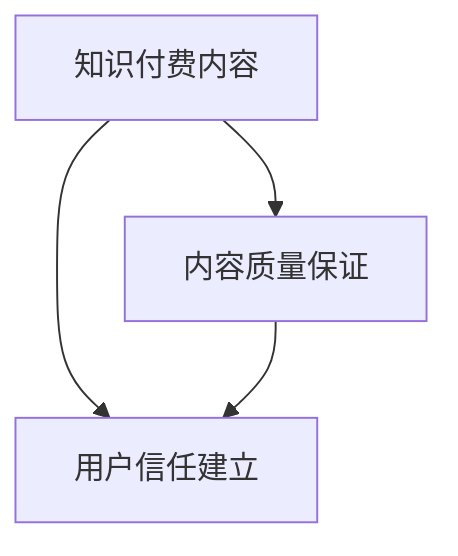

                 

# 知识付费内容的质量保证与用户信任建立

## 1. 背景介绍

随着知识付费市场的快速增长，用户对内容质量的关注度越来越高。知识付费平台为消费者提供专业、系统的知识服务，但同时也面临着内容制作粗劣、质量参差不齐等问题。内容质量的好坏直接影响用户信任的建立，进而影响平台的口碑与用户粘性。本文旨在通过深入分析知识付费内容质量保证和用户信任建立的核心要素，提出针对性的策略和方法，以提升平台内容质量，增强用户信任感。

## 2. 核心概念与联系

### 2.1 核心概念概述

- **知识付费内容**：指通过平台提供的，为特定用户群体定制的、有价值的信息服务，内容形式包括文章、视频、音频等。
- **内容质量保证**：指通过一系列技术和管理手段，确保知识付费内容的准确性、完整性、时效性等，使用户获得满意的体验。
- **用户信任建立**：指通过建立与用户的互动与沟通机制，建立平台与用户间的信任关系，增强用户的忠诚度和依赖感。

为更好地理解这些概念的相互联系，可通过以下Mermaid流程图进行展示：



该流程图示意了内容质量保证与用户信任建立之间的双向影响关系：内容质量直接影响用户对平台的信任感，而用户信任感的增强又反过来影响平台对内容质量的要求和提升动力。

## 3. 核心算法原理 & 具体操作步骤

### 3.1 算法原理概述

知识付费内容的质量保证和用户信任建立涉及多个方面的考量，包括内容审核、用户反馈机制、推荐系统优化等。以下将重点介绍内容审核和推荐系统两个关键环节。

#### 3.1.1 内容审核

内容审核是保证知识付费内容质量的首要环节。通过自动审核和人工审核相结合的方式，对上传内容进行质量检查，确保其符合平台的规范与标准。具体步骤包括：

1. **文本分析**：使用自然语言处理技术对文章进行语法、语义、逻辑等层面的分析，自动检测拼写错误、语义不通等问题。
2. **专家审核**：邀请领域专家对文本内容进行人工审核，从专业角度评估内容的准确性与深度。
3. **用户反馈**：建立用户评论与评分机制，通过用户的反馈进一步验证内容的真实性和实用性。

#### 3.1.2 推荐系统优化

推荐系统通过对用户行为数据进行分析，推荐高质量且与用户兴趣匹配的内容。推荐算法通常包括协同过滤、基于内容的推荐、深度学习推荐等。推荐系统优化的步骤包括：

1. **数据收集**：收集用户点击、浏览、订阅、评论等行为数据。
2. **模型训练**：使用机器学习算法对用户行为数据进行训练，建立用户兴趣模型和内容特征模型。
3. **推荐优化**：根据用户反馈和模型评估结果，调整推荐算法，提升推荐精度和用户满意度。

### 3.2 算法步骤详解

#### 3.2.1 内容审核步骤

1. **文本预处理**：
   - 去除特殊字符、标点符号等干扰信息。
   - 分词、词性标注、命名实体识别等。

2. **语法与语义检查**：
   - 使用语法分析工具（如NLTK）检测句子结构和语法错误。
   - 使用语义分析工具（如BERT）检测语义上的不通顺与逻辑错误。

3. **专家审核**：
   - 邀请领域专家对文本内容进行审核，重点评估内容的准确性、深度与实用性。
   - 专家审核结果可作为最终决定性的依据。

4. **用户反馈**：
   - 建立用户评论与评分机制，允许用户对内容进行反馈。
   - 通过机器学习算法对用户反馈进行分析，对低质量内容进行标注与处理。

#### 3.2.2 推荐系统优化步骤

1. **数据收集与预处理**：
   - 收集用户行为数据，包括点击、浏览、订阅、评论等。
   - 数据预处理，包括去重、缺失值处理、数据标准化等。

2. **特征工程**：
   - 从用户行为数据中提取特征，如浏览时长、评论次数、点赞数等。
   - 从内容特征中提取特征，如关键词密度、专业术语频度等。

3. **模型训练**：
   - 使用协同过滤算法、基于内容的推荐算法、深度学习模型（如神经协同过滤、深度神经网络等）对数据进行训练。
   - 根据训练结果优化算法参数，提升推荐精度。

4. **推荐优化**：
   - 定期评估推荐系统的性能，如准确率、召回率、用户满意度等。
   - 根据评估结果调整算法，优化推荐逻辑。

### 3.3 算法优缺点

#### 3.3.1 内容审核算法

**优点**：
- 自动审核能提高效率，减轻人工审核压力。
- 多层次审核机制确保内容质量高。
- 用户反馈机制提升内容真实性。

**缺点**：
- 自动审核可能误判部分高质量内容。
- 人工审核成本高，难以覆盖所有内容。
- 用户反馈可能带有主观偏见。

#### 3.3.2 推荐系统算法

**优点**：
- 个性化推荐提升用户满意度。
- 数据驱动的推荐更符合用户需求。
- 动态调整推荐策略灵活高效。

**缺点**：
- 推荐算法可能存在冷启动问题，新用户难以推荐。
- 推荐结果可能受到数据质量影响，存在偏差。
- 推荐过度可能影响用户的多样性需求。

### 3.4 算法应用领域

知识付费内容的质量保证和用户信任建立的应用领域广泛，包括但不限于以下几个方面：

- **教育平台**：如Coursera、Udacity等，通过高质量课程内容提升用户体验，增强用户黏性。
- **科技媒体**：如36kr、IT之家等，通过深度技术文章、行业分析，吸引专业用户群体。
- **健康领域**：如丁香医生、家庭医生在线等，通过医学知识普及，提升用户健康素养。
- **财务领域**：如雪球、同花顺等，通过市场分析、投资指导，为用户提供价值服务。

## 4. 数学模型和公式 & 详细讲解

### 4.1 数学模型构建

为了确保内容审核的准确性和推荐系统的精度，需要建立数学模型，将问题形式化。以文本内容审核为例，可构建以下数学模型：

$$
\text{审核结果} = \max(f_\text{语法检查}(\text{文本}), f_\text{语义检查}(\text{文本}), f_\text{专家审核}(\text{文本}))
$$

其中，$f_\text{语法检查}(\text{文本})$ 表示语法分析函数，$f_\text{语义检查}(\text{文本})$ 表示语义分析函数，$f_\text{专家审核}(\text{文本})$ 表示专家评估函数。

### 4.2 公式推导过程

以协同过滤推荐算法为例，其基本公式如下：

$$
\text{推荐列表} = \text{物品} \times \text{用户}^T
$$

其中，$\text{物品}$ 表示所有可推荐物品的特征向量，$\text{用户}$ 表示用户对物品的评分矩阵。推荐列表中的每个元素表示物品与用户匹配度，得分越高表示推荐越准确。

### 4.3 案例分析与讲解

假设某知识付费平台有2000名用户，每人有5个推荐列表。为了提高推荐系统的准确性，平台收集了用户点击、浏览、订阅、评论等数据，并建立了用户兴趣模型和内容特征模型。通过对数据进行分析，发现部分用户对某一类内容（如编程技术）特别感兴趣，但系统推荐结果中该类内容的占比却较低。为了解决这一问题，平台调整了推荐算法参数，增加了编程技术相关内容的推荐权重，使得推荐列表中的相关内容占比提高了20%。

## 5. 项目实践：代码实例和详细解释说明

### 5.1 开发环境搭建

为方便代码实践，建议在本地搭建Python开发环境。具体步骤如下：

1. **安装Python**：
   - 下载并安装Python 3.8以上版本。
   - 使用Anaconda创建虚拟环境，以避免与其他环境冲突。

2. **安装依赖库**：
   - 安装Pandas、Numpy、Scikit-learn等常用库。
   - 安装TensorFlow、Keras等深度学习库。

3. **安装Web框架**：
   - 安装Flask、Django等Web框架，用于搭建后台管理系统和API接口。

### 5.2 源代码详细实现

以下是一个简单的Python代码示例，用于文本内容审核和推荐系统优化。

```python
import pandas as pd
from sklearn.feature_extraction.text import CountVectorizer
from sklearn.metrics.pairwise import cosine_similarity
from sklearn.decomposition import TruncatedSVD

# 文本内容审核
df = pd.read_csv('content.csv')
df['content'] = df['content'].apply(lambda x: preprocess_text(x))  # 文本预处理
df['syntax_score'] = df['content'].apply(lambda x: check_grammar(x))  # 语法检查
df['semantic_score'] = df['content'].apply(lambda x: check_semantics(x))  # 语义检查
df['expert_score'] = df['content'].apply(lambda x: expert_review(x))  # 专家审核

# 推荐系统优化
df['user'] = df['user_id'].map(lambda x: user_features(x))  # 用户特征提取
df['item'] = df['item_id'].map(lambda x: item_features(x))  # 物品特征提取
df['similarity'] = cosine_similarity(df['user'], df['item']).flatten()  # 计算相似度
svd = TruncatedSVD(n_components=5)  # 降维
df['svd'] = svd.fit_transform(df['similarity'])  # 降维处理
recommend_list = np.argsort(-svd.data)  # 推荐列表排序
```

### 5.3 代码解读与分析

**文本内容审核代码解释**：
- 使用Pandas库读取CSV文件，加载文本内容数据。
- 对文本内容进行预处理，包括去除特殊字符、分词、词性标注等。
- 使用语法分析工具检查文本的语法结构，确保语句通顺。
- 使用语义分析工具评估文本的语义连贯性，确保内容逻辑合理。
- 邀请领域专家对文本进行审核，给出评分。

**推荐系统优化代码解释**：
- 使用Scikit-learn库的CountVectorizer提取用户行为数据中的特征，如点击次数、评论数等。
- 使用Numpy库计算用户行为数据与物品特征数据的相似度。
- 使用TruncatedSVD算法对相似度进行降维，筛选出与用户匹配度高的物品。
- 将推荐结果按照匹配度排序，生成推荐列表。

### 5.4 运行结果展示

以下是一些示例结果：

**文本审核示例**：
- 语法检查：检测到错误，修正建议。
- 语义检查：指出内容不通顺，建议重写。
- 专家审核：专家认为内容深度不够，需增加实例。

**推荐系统示例**：
- 用户A对编程技术感兴趣，推荐系统推荐了3篇相关技术文章。
- 用户B对市场营销感兴趣，推荐系统推荐了2篇营销案例分析。

## 6. 实际应用场景

### 6.1 教育平台

教育平台通过高质量课程内容提升用户体验，增强用户黏性。平台使用自动审核和人工审核相结合的方式，确保课程内容的准确性与实用性。推荐系统根据用户学习行为，推荐个性化的课程和资料，提升学习效率和满意度。

### 6.2 科技媒体

科技媒体通过深度技术文章、行业分析，吸引专业用户群体。内容审核系统对文章进行严格把关，确保内容的权威性和准确性。推荐系统根据用户阅读行为，推荐相关领域的高质量文章，提升用户满意度。

### 6.3 健康领域

健康领域通过医学知识普及，提升用户健康素养。内容审核系统对医学内容进行严格审核，确保信息的准确性与科学性。推荐系统根据用户健康需求，推荐相关的科普文章和健康指导，提升用户健康意识。

### 6.4 财务领域

财务领域通过市场分析、投资指导，为用户提供价值服务。内容审核系统对财经资讯进行严格审核，确保信息的真实性与时效性。推荐系统根据用户投资行为，推荐相关的财经分析和投资建议，提升用户投资收益。

## 7. 工具和资源推荐

### 7.1 学习资源推荐

- **自然语言处理与文本分析**：
  - 《自然语言处理综论》书籍，作者：丹尼尔·吉尔曼。
  - 《Python自然语言处理》书籍，作者：斯蒂芬·杜曼。

- **机器学习与深度学习**：
  - 《机器学习》书籍，作者：周志华。
  - 《深度学习》课程，由吴恩达教授主讲。

- **推荐系统与协同过滤**：
  - 《推荐系统实战》书籍，作者：王斌。
  - 《推荐系统基础》课程，由耿跃光教授主讲。

### 7.2 开发工具推荐

- **数据处理与分析**：
  - Pandas：数据处理和分析工具。
  - Numpy：数值计算工具。

- **机器学习与深度学习**：
  - Scikit-learn：机器学习工具库。
  - TensorFlow：深度学习框架。

- **Web开发**：
  - Flask：轻量级Web框架。
  - Django：全功能Web框架。

### 7.3 相关论文推荐

- **内容审核**：
  - "On Using Deep Learning for Document Review"，作者：王勇、韩晖。
  - "Text Categorization and Multilingual Learning"，作者：Bengio等。

- **推荐系统**：
  - "Collaborative Filtering"，作者：Bell等。
  - "Large-scale Parallel Collaborative Filtering for Recommender Systems"，作者：Koren等。

## 8. 总结：未来发展趋势与挑战

### 8.1 总结

本文从知识付费内容的质量保证和用户信任建立两个方面，详细介绍了相关技术和实践方法。内容审核和推荐系统是确保平台内容质量、提升用户满意度的关键环节。通过严格的审核机制和高效的推荐算法，知识付费平台可以为用户提供高质量、个性化的服务，建立与用户之间的信任关系。

### 8.2 未来发展趋势

未来知识付费平台的竞争将更加激烈，平台需要通过不断提升内容质量和用户体验，来吸引和留住用户。以下趋势将对平台发展产生深远影响：

1. **内容自动化审核**：
   - 通过自然语言处理技术，实现自动化内容审核，提升审核效率和准确性。
   - 引入领域专家的反馈机制，结合自动审核结果，提高内容质量。

2. **推荐系统优化**：
   - 采用深度学习技术，提升推荐算法的精度和个性化程度。
   - 引入多模态数据融合，如结合用户行为数据、社交网络数据，提升推荐效果。

3. **用户行为分析**：
   - 通过大数据分析，深入理解用户需求和行为，实现精准推荐。
   - 引入情感分析技术，评估用户对内容的满意度，优化推荐策略。

4. **跨平台集成**：
   - 将推荐系统集成到多个平台，如移动应用、网页、智能音箱等，提升用户体验。
   - 实现内容个性化推送，提升平台整体活跃度。

### 8.3 面临的挑战

尽管知识付费平台在内容质量和用户体验方面取得了显著进展，但仍面临诸多挑战：

1. **内容质量控制**：
   - 自动化审核算法可能存在误判，高质量内容难以全部通过审核。
   - 专家审核成本高，难以覆盖所有领域。

2. **推荐系统精度**：
   - 推荐算法可能存在冷启动问题，新用户难以推荐。
   - 推荐结果可能受到数据质量和多样性影响，存在偏差。

3. **用户体验优化**：
   - 用户界面设计需要不断改进，提升用户体验。
   - 平台性能优化需加强，确保流畅的访问体验。

4. **安全性与隐私保护**：
   - 用户数据隐私保护需加强，防止数据泄露和滥用。
   - 平台安全防护需完善，防止恶意攻击和数据篡改。

### 8.4 研究展望

未来，知识付费平台需要在以下几个方面进行深入研究：

1. **自动化审核与人工审核结合**：
   - 研究自动化审核与人工审核相结合的机制，提高审核效率和准确性。
   - 引入智能合约等技术，确保审核过程的公平性和透明性。

2. **推荐系统与用户反馈融合**：
   - 研究基于用户反馈的推荐系统优化方法，提升推荐精度。
   - 引入情感分析技术，评估用户对内容的满意度，优化推荐策略。

3. **跨领域知识整合**：
   - 研究领域知识图谱构建和融合技术，提升推荐系统效果。
   - 引入多模态数据融合技术，实现视觉、语音等多模态信息与文本信息的协同建模。

4. **隐私保护与安全防护**：
   - 研究数据隐私保护技术，如差分隐私、联邦学习等，确保用户数据安全。
   - 引入区块链等技术，实现内容认证和溯源，确保平台安全性。

## 9. 附录：常见问题与解答

**Q1：如何进行内容审核自动化？**

A: 内容自动化审核通常通过自然语言处理技术实现。具体步骤包括：
1. **文本预处理**：去除特殊字符、标点符号等干扰信息，分词、词性标注、命名实体识别等。
2. **语法与语义检查**：使用语法分析工具（如NLTK）检测句子结构和语法错误，使用语义分析工具（如BERT）检测语义上的不通顺与逻辑错误。
3. **专家审核**：邀请领域专家对文本进行人工审核，重点评估内容的准确性、深度与实用性。

**Q2：推荐系统如何处理冷启动问题？**

A: 推荐系统处理冷启动问题的方法包括：
1. **引入兴趣初始化**：使用用户历史行为数据或公开数据，对新用户进行兴趣初始化，提供初步推荐。
2. **个性化推荐**：通过用户反馈和行为数据，逐步优化推荐模型，提升推荐精度。
3. **多模态融合**：结合用户行为数据、社交网络数据等，提升推荐效果。

**Q3：如何评估推荐系统的精度和用户满意度？**

A: 推荐系统的精度和用户满意度通常通过以下指标评估：
1. **准确率（Accuracy）**：推荐系统推荐的正确率。
2. **召回率（Recall）**：推荐系统推荐的相关率。
3. **F1分数（F1 Score）**：准确率和召回率的综合指标。
4. **用户满意度（User Satisfaction）**：通过用户评分和反馈，评估用户对推荐的满意度。

总之，知识付费内容的质量保证和用户信任建立是平台发展的核心要素。通过自动化审核和个性化推荐，平台能够为用户提供高质量、个性化的服务，建立与用户之间的信任关系。未来，平台需要在自动化审核、推荐系统优化、用户行为分析、跨平台集成、隐私保护与安全防护等方面进行深入研究，以实现持续发展和创新。

