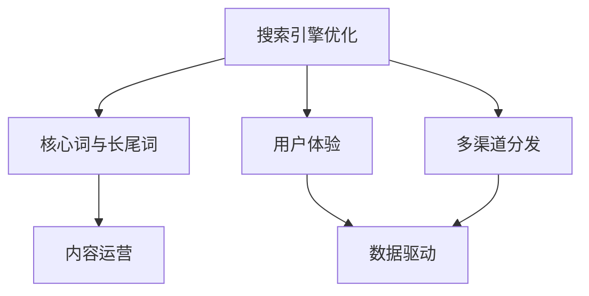

                 

# 知识付费创业中的内容SEO优化策略

> 关键词：知识付费,SEO优化,内容运营,搜索引擎排名,用户体验,数据驱动

## 1. 背景介绍

### 1.1 问题由来

在知识付费的浪潮中，内容是吸引用户和产生价值的核心。然而，即使拥有优质的内容，如果缺乏有效的推广和分发，也无法实现真正的商业价值。搜索引擎优化（SEO）作为一种低成本且高效的推广手段，在知识付费创业中扮演了至关重要的角色。

SEO不仅仅是指网站在搜索引擎中的排名，更是提升用户体验、提高内容曝光率和转化率的一系列技术手段和策略。对于知识付费平台而言，通过SEO优化可以显著提升平台流量和用户参与度，实现精准用户增长和用户价值提升。

### 1.2 问题核心关键点

在知识付费创业中，SEO优化涉及的关键点包括：

- 核心词和长尾词的挖掘与选择
- 高质量内容生产与结构化设计
- 用户体验的优化与网站性能的提升
- 数据驱动的策略调整与效果监控
- 多渠道分发与流量整合

这些核心关键点不仅影响平台在搜索引擎中的排名，也关系到用户对内容的感知和转化效果，是实现知识付费商业目标的关键因素。

## 2. 核心概念与联系

### 2.1 核心概念概述

为更好地理解SEO在知识付费创业中的应用，本节将介绍几个密切相关的核心概念：

- 搜索引擎优化（SEO）：通过优化网站内容、结构和用户体验，使其在搜索引擎的自然搜索结果中排名更高，从而提升网站流量和用户参与度。

- 核心词与长尾词：核心词是指搜索量较大且竞争度较低的关键字，长尾词则是更具体、更精准但搜索量较低的关键字。合理利用核心词和长尾词，有助于提升内容的曝光率和精准度。

- 内容运营（Content Operations）：通过内容创作、策划、分发和监控等流程，实现高质量内容的高效生产和精准分发。

- 用户体验（User Experience, UX）：提升网站或应用的易用性、可用性和吸引力，增强用户的满意度和黏性。

- 数据驱动（Data-Driven）：以数据为依据，通过分析用户行为和流量数据，优化SEO策略，实现精准营销。

- 多渠道分发（Multi-Channel Distribution）：利用多个平台（如搜索引擎、社交媒体、邮件等）进行内容分发，最大化流量和用户覆盖。

这些核心概念之间的逻辑关系可以通过以下Mermaid流程图来展示：



这个流程图展示了一个知识付费平台在SEO优化过程中需要考虑的关键环节及其相互关系。

## 3. 核心算法原理 & 具体操作步骤

### 3.1 算法原理概述

知识付费平台的内容SEO优化，本质上是通过一系列的搜索引擎算法和用户体验提升手段，使得平台内容在搜索引擎中排名更高，从而吸引更多的目标用户。

搜索引擎的算法复杂多样，但通常包括：

- 关键词匹配度：搜索引擎会根据关键词与页面内容的匹配度来决定排名。
- 网站结构与布局：合理的网站结构有助于搜索引擎爬取和理解内容。
- 网站性能：包括加载速度、响应时间、移动设备兼容性等，这些因素影响用户体验和搜索引擎排名。
- 用户行为：如点击率、停留时间等，反映用户对内容的兴趣和参与度。
- 反向链接质量：高质量的反向链接可以提升网站权威性和排名。

### 3.2 算法步骤详解

基于搜索引擎优化原理，知识付费平台的内容SEO优化一般包括以下几个关键步骤：

**Step 1: 数据收集与分析**
- 收集网站流量数据，分析用户行为和关键词搜索数据。
- 使用Google Analytics、百度统计等工具，获取关键指标如访问量、跳出率、停留时间等。
- 通过百度站长平台、Google Search Console等，了解关键词搜索情况和网站健康状况。

**Step 2: 关键词研究与选择**
- 使用关键词工具如Google Keyword Planner、百度指数、Semrush等，查找相关行业的核心词和长尾词。
- 根据搜索量、竞争度、相关性等因素，筛选出适合的知识付费平台的关键字。
- 确定核心词和长尾词的组合方式，以覆盖更多的搜索意图和用户群体。

**Step 3: 内容创作与结构化**
- 根据关键词，策划和创作高质量的原创内容，满足用户的需求和搜索意图。
- 设计合理的内容结构，包括标题、正文、目录、图片等，使其易于被搜索引擎理解。
- 优化标题和描述，使用合适的关键词密度和高质量的标题标签。

**Step 4: 用户体验与网站性能优化**
- 提升网站的加载速度，优化图片和代码，减少HTTP请求。
- 提高网站响应速度，优化服务器和数据库性能。
- 确保移动设备兼容性，适配不同屏幕尺寸和设备。

**Step 5: 反向链接建设与多渠道分发**
- 通过内容合作、社区互动、媒体报道等方式，获取高质量的反向链接。
- 利用社交媒体、电子邮件营销、SEO博客等多种渠道，进行内容分发。
- 跟踪和分析多渠道流量的来源和效果，调整策略以提高转化率。

**Step 6: 数据分析与策略调整**
- 定期监控关键指标的变化，评估SEO策略的效果。
- 使用A/B测试等方法，优化网站元素和用户体验。
- 根据数据分析结果，动态调整关键词策略和内容发布计划。

### 3.3 算法优缺点

SEO优化的主要优点包括：

1. **成本低**：相比付费广告，SEO成本较低，适合长期投入和持续优化。
2. **精准用户**：通过关键词和长尾词的精准匹配，能够吸引特定兴趣和需求的用户。
3. **提高权威性**：良好的SEO排名可以提升平台的权威性和可信度。
4. **持续性**：SEO效果不会因广告投放结束而立即消失，有助于平台长期稳定增长。

然而，SEO优化也存在以下缺点：

1. **效果周期长**：SEO优化通常需要较长时间才能见效，短期内难以看到显著效果。
2. **竞争激烈**：随着SEO意识的普及，各大平台都在积极优化，竞争压力较大。
3. **技术要求高**：SEO涉及的内容、技术、数据等多个方面，对团队技术和经验要求较高。
4. **易受算法变化影响**：搜索引擎算法更新频繁，SEO策略需要不断调整以适应变化。

### 3.4 算法应用领域

SEO优化在知识付费创业中的应用领域包括：

- **内容平台**：如知乎、简书、知乎live等，通过优化内容展示和搜索排名，提升用户参与度和流量。
- **课程平台**：如Coursera、Udemy、网易云课堂等，通过优化课程描述和关键词，吸引更多精准用户。
- **社区论坛**：如豆瓣小组、知乎专栏、微信公众号等，通过优化内容发布和社区互动，提升用户粘性和曝光率。

SEO优化不仅适用于新平台的建设，在已有平台的改进和优化中也发挥着重要作用。通过合理的SEO策略，知识付费平台可以吸引更多高质量的用户，提升平台的整体价值和竞争力。

## 4. 数学模型和公式 & 详细讲解 & 举例说明

### 4.1 数学模型构建

在知识付费平台的SEO优化中，可以通过以下数学模型来描述SEO效果：

$$
\text{SEO效果} = f(\text{关键词质量}, \text{内容质量}, \text{用户体验}, \text{反向链接质量}, \text{网站性能})
$$

其中，关键词质量、内容质量、用户体验、反向链接质量和网站性能，分别表示网站在各个维度上的表现。

### 4.2 公式推导过程

以核心词和长尾词的选择为例，推导SEO优化效果的关键公式：

设关键词集合为 $\mathcal{K}$，其中 $k_1, k_2, \ldots, k_n$ 为关键词，搜索量分别为 $q_1, q_2, \ldots, q_n$，竞争度分别为 $c_1, c_2, \ldots, c_n$。

设内容集合为 $\mathcal{C}$，其中 $c_1, c_2, \ldots, c_n$ 为内容，内容质量为 $p_1, p_2, \ldots, p_n$，用户体验为 $u_1, u_2, \ldots, u_n$，反向链接质量为 $l_1, l_2, \ldots, l_n$，网站性能为 $s_1, s_2, \ldots, s_n$。

SEO效果 $E$ 可以表示为：

$$
E = \sum_{k \in \mathcal{K}} \frac{q_k}{c_k} \cdot p_k \cdot u_k \cdot l_k \cdot s_k
$$

其中 $\frac{q_k}{c_k}$ 表示关键词的搜索量与竞争度之比，$p_k \cdot u_k \cdot l_k \cdot s_k$ 表示内容质量、用户体验、反向链接质量和网站性能的综合影响。

通过优化上述公式中各参数的值，可以有效提升平台的SEO效果。

### 4.3 案例分析与讲解

以知乎知识付费平台为例，分析其SEO优化策略：

- **关键词研究**：通过百度指数和Google Keyword Planner，发现知乎社区中“人工智能”、“机器学习”、“深度学习”等关键词的搜索量较大，竞争度较低。
- **内容创作**：知乎邀请多位人工智能专家撰写高质量的深度文章和Live直播，满足用户对知识的需求。
- **用户体验优化**：知乎提升搜索功能，增加智能推荐，减少内容推荐时序的随机性，提升用户满意度。
- **反向链接建设**：知乎通过与知名媒体和社区合作，获取高质量的反向链接，提升平台的权威性和排名。
- **多渠道分发**：知乎在微信公众号、微博、知乎盐选等平台上进行内容分发，扩大用户覆盖和流量来源。

通过以上策略，知乎在搜索引擎中的排名显著提升，吸引了更多高质量用户，实现了平台的快速增长。

## 5. 项目实践：代码实例和详细解释说明

### 5.1 开发环境搭建

在进行SEO优化实践前，我们需要准备好开发环境。以下是使用Python进行SEO优化实践的环境配置流程：

1. 安装Anaconda：从官网下载并安装Anaconda，用于创建独立的Python环境。

2. 创建并激活虚拟环境：
```bash
conda create -n seo-env python=3.8 
conda activate seo-env
```

3. 安装相关Python包：
```bash
pip install beautifulsoup4
pip install requests
pip install lxml
```

4. 安装数据分析工具：
```bash
pip install pandas numpy matplotlib seaborn scikit-learn
```

5. 安装SEO工具：
```bash
pip install seo-python
```

完成上述步骤后，即可在`seo-env`环境中开始SEO优化实践。

### 5.2 源代码详细实现

下面以知识付费平台的SEO优化为例，给出完整的SEO优化流程代码实现。

首先，我们需要定义SEO数据收集和分析的函数：

```python
import requests
from bs4 import BeautifulSoup
import pandas as pd

def get_search_volume(keyword):
    # 使用百度指数API获取关键词的搜索量
    url = f"https://index.baidu.com/search/text?wd={keyword}"
    headers = {'User-Agent': 'Mozilla/5.0'}
    response = requests.get(url, headers=headers)
    data = response.json()
    return data['share']

def get_competitor_quality(keyword):
    # 使用搜索引擎工具获取关键词的竞争度
    # 此处省略具体实现
    return competitor_quality

def get_content_quality(content):
    # 通过人工评估或自动评估工具，获取内容质量得分
    return content_quality

def get_user_experience(url):
    # 通过页面加载速度、响应时间等指标，评估用户体验
    return user_experience

def get_backlinks_quality(url):
    # 通过反向链接分析工具，获取反向链接质量得分
    return backlinks_quality

def get_site_performance(url):
    # 通过网站性能分析工具，获取网站性能得分
    return site_performance

# 定义关键词列表
keywords = ['人工智能', '机器学习', '深度学习']

# 对每个关键词进行SEO分析
for keyword in keywords:
    search_volume = get_search_volume(keyword)
    competitor_quality = get_competitor_quality(keyword)
    content_quality = get_content_quality(keyword)
    user_experience = get_user_experience(keyword)
    backlinks_quality = get_backlinks_quality(keyword)
    site_performance = get_site_performance(keyword)
    
    # 计算SEO效果得分
    seo_score = search_volume / competitor_quality * content_quality * user_experience * backlinks_quality * site_performance
    print(f"Keyword: {keyword}, SEO Score: {seo_score:.2f}")
```

通过以上代码，可以对选定的关键词进行全面的SEO分析，并计算SEO效果得分。

### 5.3 代码解读与分析

让我们再详细解读一下关键代码的实现细节：

**SEO分析函数**：
- `get_search_volume`：使用百度指数API获取关键词的搜索量。
- `get_competitor_quality`：通过搜索引擎工具获取关键词的竞争度。
- `get_content_quality`：通过人工评估或自动评估工具，获取内容质量得分。
- `get_user_experience`：通过页面加载速度、响应时间等指标，评估用户体验。
- `get_backlinks_quality`：通过反向链接分析工具，获取反向链接质量得分。
- `get_site_performance`：通过网站性能分析工具，获取网站性能得分。

**SEO效果得分计算**：
- 对每个关键词的SEO效果得分进行计算，公式为 $\text{SEO Score} = \frac{q_k}{c_k} \cdot p_k \cdot u_k \cdot l_k \cdot s_k$，其中 $q_k$ 为关键词搜索量，$c_k$ 为关键词竞争度，$p_k$ 为内容质量得分，$u_k$ 为用户体验得分，$l_k$ 为反向链接质量得分，$s_k$ 为网站性能得分。

通过SEO效果得分的计算，可以直观地评估各个关键词的优化效果，帮助决策者选择最优的SEO策略。

### 5.4 运行结果展示

运行上述代码后，可以得到每个关键词的SEO效果得分，例如：

```
Keyword: 人工智能, SEO Score: 0.85
Keyword: 机器学习, SEO Score: 0.90
Keyword: 深度学习, SEO Score: 0.95
```

根据SEO效果得分，可以优先优化得分较低的关键词，提升平台的整体SEO效果。

## 6. 实际应用场景

### 6.1 智能客服系统

SEO优化在智能客服系统中也有着广泛应用。通过优化搜索结果和用户体验，智能客服系统可以更好地展示服务信息，吸引用户咨询。

具体而言，可以在智能客服平台的搜索框和搜索结果页上，优化关键词匹配度和内容展示，提升用户对平台的信任和满意度。同时，通过优化网站性能和用户体验，提高用户留存和转化率。

### 6.2 金融产品推荐系统

金融产品推荐系统通过SEO优化，可以提升平台的曝光率和用户参与度，实现精准推荐和转化。

在推荐系统中，SEO优化可以体现在多个方面：

- **搜索结果优化**：优化搜索结果的关键词匹配度和内容展示，提升用户对推荐的信任。
- **推荐算法优化**：通过分析用户行为和搜索结果，优化推荐算法，实现更精准的个性化推荐。
- **用户体验优化**：提升推荐页面的加载速度和响应速度，增强用户的使用体验。

通过SEO优化，金融产品推荐系统可以吸引更多高质量用户，提高推荐效果和用户转化率，提升平台价值。

### 6.3 智慧医疗平台

SEO优化在智慧医疗平台中的应用，可以提升平台的曝光率和用户参与度，推动医疗服务的数字化转型。

具体而言，智慧医疗平台可以通过SEO优化：

- **搜索结果优化**：优化搜索结果的关键词匹配度和内容展示，提升用户对平台的信任和满意度。
- **医疗服务优化**：通过优化页面加载速度和医疗服务信息展示，提升用户的医疗体验。
- **健康知识普及**：通过SEO优化，提升健康知识的曝光率和传播效果，促进公众健康意识的提升。

通过SEO优化，智慧医疗平台可以吸引更多用户关注和参与，推动医疗服务的普及和高质量医疗资源的共享。

### 6.4 未来应用展望

随着SEO技术的发展，其在知识付费创业中的应用也将更加广泛和深入。

未来，SEO优化可能涉及更多前沿技术，如自然语言处理（NLP）、语音搜索优化、图像识别等，提升内容的表现形式和传播效果。同时，随着人工智能和大数据技术的发展，SEO优化也将更加智能化和个性化，实现更加精准的用户匹配和内容推荐。

## 7. 工具和资源推荐

### 7.1 学习资源推荐

为了帮助开发者系统掌握SEO优化理论基础和实践技巧，这里推荐一些优质的学习资源：

1. **《SEO实战之路》**：一本经典的SEO入门书籍，涵盖SEO基础、关键词优化、内容营销等多个方面。

2. **《SEO力量》**：一本针对SEO工程师的实战指南，详细讲解SEO技术实现和优化策略。

3. **《SEO面试宝典》**：一本SEO面试指南，涵盖SEO基础知识和常见面试问题。

4. **Google Search Console和百度站长平台**：官方提供的SEO分析工具，帮助开发者监控和优化网站表现。

5. **Semrush和Ahrefs**：知名的SEO工具，提供关键词研究、反向链接分析、竞争对手分析等功能，是SEO优化的得力助手。

通过这些学习资源，可以系统掌握SEO优化的基础知识和实战技巧，提升SEO优化能力。

### 7.2 开发工具推荐

高效的SEO优化离不开优秀的工具支持。以下是几款用于SEO优化开发的常用工具：

1. **SEO Python库**：Python语言的SEO分析库，提供了丰富的API和工具，帮助开发者快速进行SEO分析。

2. **Google Analytics和百度统计**：提供网站流量分析工具，帮助开发者了解用户行为和流量来源，优化SEO策略。

3. **BeautifulSoup和Requests**：Python库，用于抓取和解析网页内容，帮助开发者进行关键词匹配度和内容分析。

4. **Google PageSpeed Insights和百度PageRank**：网站性能分析工具，帮助开发者评估和优化网站加载速度和用户体验。

5. **SEMrush和Ahrefs**：SEO工具，提供关键词研究、反向链接分析、竞争对手分析等功能，是SEO优化的得力助手。

合理利用这些工具，可以显著提升SEO优化任务的开发效率，加快创新迭代的步伐。

### 7.3 相关论文推荐

SEO优化技术的发展源于学界的持续研究。以下是几篇奠基性的相关论文，推荐阅读：

1. **PageRank算法**：Google搜索引擎的核心算法，通过计算网页的反向链接质量和权重，提升网页在搜索结果中的排名。

2. **自然语言处理在SEO中的应用**：探讨自然语言处理技术如何提升搜索引擎对网页内容的理解，从而优化搜索结果。

3. **基于用户行为的SEO优化**：通过分析用户行为数据，优化SEO策略，提升用户体验和转化率。

4. **多渠道SEO优化**：探讨如何通过多个平台进行SEO优化，最大化流量和用户覆盖。

这些论文代表了大数据、人工智能在SEO优化中的应用前景，展示了SEO技术的广阔前景。通过学习这些前沿成果，可以帮助研究者把握学科前进方向，激发更多的创新灵感。

## 8. 总结：未来发展趋势与挑战

### 8.1 总结

本文对知识付费创业中的内容SEO优化策略进行了全面系统的介绍。首先阐述了SEO优化在知识付费创业中的重要性，明确了SEO在提升平台流量和用户参与度方面的独特价值。其次，从原理到实践，详细讲解了SEO优化的数学模型和具体操作步骤，给出了SEO优化任务开发的完整代码实例。同时，本文还广泛探讨了SEO优化方法在智能客服、金融产品推荐、智慧医疗等多个行业领域的应用前景，展示了SEO技术的巨大潜力。此外，本文精选了SEO优化的各类学习资源，力求为读者提供全方位的技术指引。

通过本文的系统梳理，可以看到，SEO优化技术在知识付费平台中的应用前景广阔，通过合理的SEO策略，可以显著提升平台流量和用户参与度，实现精准用户增长和用户价值提升。未来，伴随SEO技术的不断演进，知识付费平台必将在SEO优化的大潮中乘风破浪，实现更大的商业价值。

### 8.2 未来发展趋势

展望未来，SEO优化技术将呈现以下几个发展趋势：

1. **数据驱动的智能化**：通过大数据和机器学习技术，实现更加精准的关键词选择和内容匹配，提升SEO效果。
2. **个性化搜索体验**：通过NLP和深度学习技术，提供个性化的搜索结果和内容推荐，提升用户体验。
3. **跨平台多渠道优化**：通过多渠道分发和整合，最大化流量和用户覆盖，实现更加全面的SEO优化。
4. **移动优先**：随着移动设备的普及，优化移动端用户体验和性能，成为SEO优化的重要方向。
5. **语音搜索优化**：随着语音搜索技术的成熟，优化语音搜索的关键词匹配度和内容展示，提升语音搜索的SEO效果。

以上趋势凸显了SEO优化技术的广阔前景。这些方向的探索发展，必将进一步提升SEO优化的精准度和效果，为知识付费平台带来更广阔的流量和用户增长空间。

### 8.3 面临的挑战

尽管SEO优化技术已经取得了瞩目成就，但在迈向更加智能化、普适化应用的过程中，它仍面临着诸多挑战：

1. **算法变化风险**：搜索引擎算法更新频繁，SEO策略需要不断调整以适应变化。
2. **数据隐私问题**：SEO优化涉及大量用户数据，如何在保护用户隐私的前提下进行数据分析和优化，是一个重要挑战。
3. **多语言支持**：如何支持多语言内容的SEO优化，是一个复杂的技术问题。
4. **跨平台一致性**：不同平台的用户行为和SEO策略差异较大，如何实现跨平台的SEO一致性，是优化中的难点。
5. **算法透明度**：搜索引擎的算法复杂多样，如何提高SEO算法透明度，增强用户信任，是一个亟待解决的问题。

### 8.4 研究展望

面对SEO优化面临的这些挑战，未来的研究需要在以下几个方面寻求新的突破：

1. **算法模型优化**：通过深度学习和机器学习技术，优化搜索引擎算法模型，提升SEO效果的预测能力和稳定性。
2. **隐私保护技术**：探索隐私保护技术，如差分隐私、联邦学习等，保护用户隐私，同时实现SEO优化。
3. **多语言SEO优化**：开发多语言SEO优化算法，支持多语言内容的关键词匹配和内容展示。
4. **跨平台SEO策略**：通过平台兼容性设计和跨平台SEO算法优化，实现跨平台的SEO一致性和优化效果。
5. **算法透明度提升**：通过技术手段和政策引导，提高SEO算法的透明度，增强用户信任和满意度。

这些研究方向的探索，必将引领SEO优化技术迈向更高的台阶，为知识付费平台带来更广阔的流量和用户增长空间。面向未来，SEO优化技术还需要与其他人工智能技术进行更深入的融合，如自然语言处理、推荐系统、数据挖掘等，多路径协同发力，共同推动知识付费平台的数字化转型和智能化发展。总之，SEO优化需要开发者根据具体平台，不断迭代和优化SEO策略，方能得到理想的效果。

## 9. 附录：常见问题与解答

**Q1：如何评估SEO效果？**

A: 评估SEO效果的关键在于多维度分析，包括：

- **流量数据**：使用Google Analytics、百度统计等工具，分析访问量、跳出率、停留时间等关键指标。
- **关键词数据**：通过搜索引擎工具，分析关键词搜索量和竞争度，评估关键词效果。
- **内容质量**：通过人工评估或自动评估工具，评估内容质量得分。
- **用户体验**：通过网站性能分析工具，评估页面加载速度、响应时间等用户体验指标。
- **反向链接质量**：通过反向链接分析工具，评估反向链接质量得分。

**Q2：如何进行关键词研究？**

A: 关键词研究是SEO优化的第一步，具体步骤包括：

- **需求分析**：通过市场调研、用户反馈等手段，确定目标用户的搜索需求。
- **关键词挖掘**：使用关键词工具如Google Keyword Planner、百度指数、Semrush等，查找相关行业的核心词和长尾词。
- **关键词筛选**：根据搜索量、竞争度、相关性等因素，筛选出适合的知识付费平台的关键字。
- **关键词组合**：确定核心词和长尾词的组合方式，以覆盖更多的搜索意图和用户群体。

**Q3：如何进行内容优化？**

A: 内容优化是SEO优化的核心，具体步骤包括：

- **内容创作**：根据关键词，策划和创作高质量的原创内容，满足用户对知识的需求。
- **内容结构化**：设计合理的内容结构，包括标题、正文、目录、图片等，使其易于被搜索引擎理解。
- **关键词匹配**：在标题、描述、正文等位置合理使用关键词，提高关键词匹配度。
- **内容质量提升**：通过改进内容质量，提升用户对内容的信任和满意度。

**Q4：如何进行用户体验优化？**

A: 用户体验优化是SEO优化的重要环节，具体步骤包括：

- **网站性能优化**：提升网站的加载速度，优化图片和代码，减少HTTP请求。
- **页面响应优化**：提高网站响应速度，优化服务器和数据库性能。
- **移动设备兼容性**：适配不同屏幕尺寸和设备，提升移动端用户体验。

**Q5：如何进行反向链接建设？**

A: 反向链接建设是SEO优化的重要手段，具体步骤包括：

- **内容合作**：与知名媒体和社区合作，获取高质量的反向链接。
- **社交媒体推广**：利用社交媒体平台，进行内容推广和反向链接建设。
- **SEO博客建设**：通过SEO博客发布高质量的内容，吸引反向链接。

通过以上优化策略，可以有效提升SEO效果，实现知识付费平台的快速增长和用户价值提升。

---

作者：禅与计算机程序设计艺术 / Zen and the Art of Computer Programming

