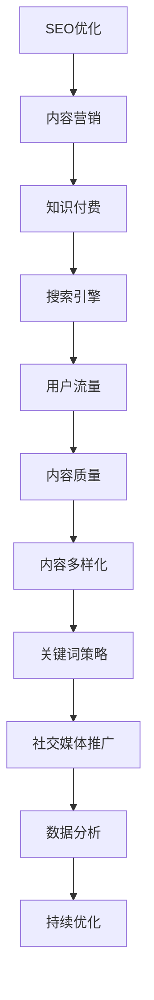

                 

# 知识付费创业中的内容SEO优化策略

> 关键词：SEO优化, 内容营销, 知识付费, 搜索引擎, 用户流量, 内容质量, 内容多样化, 关键词策略, 社交媒体推广, 数据分析, 持续优化

## 1. 背景介绍

### 1.1 问题由来
随着互联网的快速发展，知识付费市场正逐渐崛起。各类在线教育平台、专业咨询网站、付费订阅服务等纷纷涌现，用户对于高质量内容的需求也日益增加。内容的质量和可搜索性成为知识付费产品吸引用户的关键因素之一。然而，高质量内容的获取和SEO（搜索引擎优化）策略的制定，却并非易事。大多数创业者往往在内容生产与SEO优化之间缺乏足够的策略和经验。

### 1.2 问题核心关键点
内容SEO优化不仅是提升搜索引擎排名的问题，更关乎如何高效、精准地将优质内容传递给目标用户。优秀的SEO优化不仅能提升内容曝光率和访问量，还能显著提高用户的互动与转化率。以下是一些关键点：

- 高质量内容创作：内容质量是SEO优化的基础。
- 精准关键词定位：关键词策略的精准制定，是SEO优化的核心。
- 多样化内容形式：视频、音频、图文等多种形式的内容，能更好地满足用户需求。
- 社交媒体推广：社交平台的分享与推广，可大幅提升内容曝光率。
- 数据分析与反馈：持续的数据分析与优化，是SEO优化的必备手段。

### 1.3 问题研究意义
在知识付费创业中，做好内容SEO优化，不仅能提升内容在搜索引擎中的排名，还能吸引更多的流量和潜在用户，提升品牌影响力与市场竞争力。因此，掌握内容SEO优化策略，对于知识付费产品的成功至关重要。

## 2. 核心概念与联系

### 2.1 核心概念概述

为更好地理解知识付费中的内容SEO优化策略，本节将介绍几个密切相关的核心概念：

- **SEO（搜索引擎优化）**：指通过优化网站结构、内容、代码等元素，提高网站在搜索引擎中的排名，从而提升网站的访问量和用户转化率。
- **内容营销（Content Marketing）**：指通过创作和分享有价值的内容，吸引、留存并转化目标用户，以实现品牌价值和市场收益。
- **知识付费（Knowledge Paywall）**：指用户为获取高质量的专业知识或技能，支付一定费用的商业模式。
- **搜索引擎**：如Google、Bing等，是互联网用户获取信息的主要渠道。
- **用户流量（User Traffic）**：指网站访问量和用户行为数据，是评估网站价值的重要指标。
- **内容质量（Content Quality）**：指内容的相关性、深度、原创性和价值度，是吸引用户的关键因素。
- **内容多样化（Content Diversification）**：指内容形式的多样化，如图文、视频、音频等，以更好地覆盖用户需求。
- **关键词策略（Keyword Strategy）**：指在内容创作与SEO优化中，如何精准定位并利用关键词。
- **社交媒体推广（Social Media Promotion）**：指在各大社交平台进行内容分享与推广，以扩大内容曝光率和影响力。
- **数据分析（Data Analysis）**：指通过收集和分析用户数据，评估内容效果并指导SEO优化。

这些核心概念之间的逻辑关系可以通过以下Mermaid流程图来展示：



这个流程图展示出SEO优化、内容营销、知识付费三者之间的紧密联系：

1. 优秀的SEO优化可以提升内容在搜索引擎中的排名，吸引更多的流量。
2. 高质量的内容营销能提升用户粘性，增强用户信任和满意度。
3. 知识付费模式下，高质量内容与精准SEO优化相结合，能够最大化地转化为付费流量和收益。
4. 社交媒体推广和数据分析，进一步辅助SEO优化，形成闭环优化机制。

## 3. 核心算法原理 & 具体操作步骤
### 3.1 算法原理概述

内容SEO优化的核心在于提升内容的相关性和搜索引擎排名。其主要原则包括：

1. **目标关键词**：精准定位目标关键词，确保内容围绕该关键词展开，避免偏离主题。
2. **高质量内容**：创作高质量、原创性强的内容，提升内容质量和用户体验。
3. **内部链接**：在网站内部进行合理链接，提升内容间的关联性和深度。
4. **外部链接**：获取高质量的外部链接，提升内容权威性和权重。
5. **页面优化**：优化网站结构、页面加载速度、移动端适配性等，提升用户体验。

### 3.2 算法步骤详解

基于上述原理，内容SEO优化的具体步骤包括：

**Step 1: 市场调研与关键词研究**
- 确定目标市场和用户需求，选择与知识付费内容相关的关键词。
- 使用工具如Google关键词规划师、百度指数等，分析关键词搜索量、竞争程度和相关度。

**Step 2: 内容创作与优化**
- 根据关键词进行内容规划，创作高质量、原创性强的内容。
- 确保内容格式丰富多样，如图文、视频、音频等，吸引不同偏好的用户。
- 在内容中合理嵌入关键词，并自然流畅，避免过度堆砌。
- 优化页面元数据（如标题、描述、关键字），提升页面被搜索引擎抓取的概率。

**Step 3: 内部链接与外部链接建设**
- 在网站内部进行合理的链接，将相关内容关联起来，增加页面间的深度。
- 主动寻找高质量的外部网站进行合作，获取外部链接，提升内容的权威性。

**Step 4: 页面优化与用户体验提升**
- 优化页面加载速度，提升用户体验。
- 确保网站移动端适配性，增加用户粘性。
- 利用Lighthouse等工具进行页面性能和SEO优化分析。

**Step 5: 数据分析与反馈**
- 定期分析网站流量、用户行为数据，评估SEO效果。
- 根据数据分析结果，调整SEO策略，持续优化内容与页面。

### 3.3 算法优缺点

内容SEO优化的主要优点包括：

1. **提升流量与转化率**：精准的SEO优化能显著提升内容的曝光率和访问量，增加用户转化率。
2. **降低营销成本**：相比传统广告投放，SEO优化更加精准，可有效降低营销成本。
3. **持续优化**：SEO优化是动态过程，通过数据分析和反馈，不断优化策略，提升效果。

同时，也存在一些缺点：

1. **效果周期长**：SEO优化效果通常需要较长时间才能显现，缺乏即时反馈。
2. **竞争激烈**：热门关键词竞争激烈，优化难度大，需要更多资源和时间。
3. **技术要求高**：SEO优化涉及较多技术细节，需要专业技能和工具支持。

### 3.4 算法应用领域

内容SEO优化在知识付费领域有着广泛的应用，主要体现在以下几个方面：

- **在线教育平台**：通过SEO优化提升课程内容在搜索引擎中的排名，吸引更多潜在用户。
- **专业咨询网站**：优化文章、博客等内容，提高网站的权威性和专业度。
- **付费订阅服务**：优化订阅页面和内容，提升订阅转化率。
- **行业资讯网站**：提升行业资讯的曝光率和传播效果，增加用户粘性。
- **知识分享社区**：通过优化社区文章和互动内容，提升社区活跃度和影响力。

## 4. 数学模型和公式 & 详细讲解 & 举例说明
### 4.1 数学模型构建

内容SEO优化涉及多个维度的指标，包括关键词排名、页面流量、用户转化等。以下是几个关键指标的数学模型构建：

1. **页面流量**：
   $$
   P = \frac{V}{N}
   $$
   其中 $P$ 为页面流量，$V$ 为总访问量，$N$ 为页面数量。

2. **关键词排名**：
   $$
   R = \frac{S}{K}
   $$
   其中 $R$ 为关键词排名，$S$ 为在搜索结果中显示的链接数，$K$ 为总链接数。

3. **转化率**：
   $$
   C = \frac{C}{V}
   $$
   其中 $C$ 为用户转化数，$V$ 为总访问量。

### 4.2 公式推导过程

- **页面流量**：
  假设一个知识付费网站有 $N$ 个页面，总访问量为 $V$，则平均每个页面的流量为：
  $$
  P = \frac{V}{N}
  $$

- **关键词排名**：
  假设一个关键词有 $S$ 个搜索结果，其中 $K$ 个有外部链接，则关键词排名为：
  $$
  R = \frac{S}{K}
  $$

- **转化率**：
  假设某个页面的转化率为 $c$，则总转化率为：
  $$
  C = c \times V
  $$

### 4.3 案例分析与讲解

以某在线教育平台为例，假设该平台有 100 个课程页面，每月总访问量为 100,000 次，平均每个页面的访问量为：
$$
P = \frac{100,000}{100} = 1,000
$$

某个热门关键词（如“Python编程”）的搜索结果中，有 50 个链接，其中 20 个有外部链接，则该关键词排名为：
$$
R = \frac{50}{20} = 2.5
$$

若该关键词的页面转化率为 10%，则总转化率为：
$$
C = 0.1 \times 100,000 = 10,000
$$

### 5. 项目实践：代码实例和详细解释说明
### 5.1 开发环境搭建

在进行内容SEO优化实践前，我们需要准备好开发环境。以下是使用Python进行SEO优化的环境配置流程：

1. 安装Anaconda：从官网下载并安装Anaconda，用于创建独立的Python环境。

2. 创建并激活虚拟环境：
```bash
conda create -n seo-env python=3.8 
conda activate seo-env
```

3. 安装相关库：
```bash
pip install google-cloud-pubsub tensorflow transformers beautifulsoup4 pandas
```

4. 设置Google Cloud SDK：配置Google Cloud项目，安装并设置gcloud命令行工具。

完成上述步骤后，即可在`seo-env`环境中开始SEO优化实践。

### 5.2 源代码详细实现

以下是使用TensorFlow和BeautifullSoup库对网站页面进行SEO优化的Python代码实现：

```python
import tensorflow as tf
from bs4 import BeautifulSoup
import requests
import pandas as pd

# 定义优化后的页面结构
optimized_page_structure = {
    'title': 'SEO优化后的页面标题',
    'headline': 'SEO优化后的页面副标题',
    'content': 'SEO优化后的页面正文内容',
    'meta_title': 'SEO优化后的页面标题标签',
    'meta_description': 'SEO优化后的页面描述标签',
    'keywords': 'SEO优化后的关键词标签',
    'image': 'SEO优化后的图片标签'
}

# 读取原始页面内容
url = 'https://example.com/course/123'
response = requests.get(url)
html_content = response.content

# 解析页面结构
soup = BeautifulSoup(html_content, 'html.parser')
page_title = soup.find('title').text
page_headline = soup.find('h1').text
page_content = soup.find('div', {'class': 'course-content'}).text
page_meta_title = soup.find('meta', {'name': 'title'})
page_meta_description = soup.find('meta', {'name': 'description'})
page_keywords = soup.find('meta', {'name': 'keywords'})
page_image = soup.find('img', {'src': True})

# 构建优化后的页面内容
optimized_html = '<html><head><title>{title}</title><meta name="title" content="{meta_title}"><meta name="description" content="{meta_description}"><meta name="keywords" content="{keywords}"><link rel="image" href="{image}"></head><body><h1>{headline}</h1><div class="course-content">{content}</div></body></html>'.format(
    title=optimized_page_structure['title'],
    meta_title=optimized_page_structure['meta_title'],
    meta_description=optimized_page_structure['meta_description'],
    keywords=optimized_page_structure['keywords'],
    image=optimized_page_structure['image'],
    headline=optimized_page_structure['headline'],
    content=optimized_page_structure['content']
)

# 将优化后的HTML写入文件
with open('optimized.html', 'w') as f:
    f.write(optimized_html)
```

### 5.3 代码解读与分析

让我们再详细解读一下关键代码的实现细节：

**优化页面结构**：
- 定义了一个包含优化后页面结构的字典，包括页面标题、副标题、正文内容、标题标签、描述标签、关键词标签和图片标签。

**读取原始页面内容**：
- 使用requests库获取指定URL的页面内容，并将其解析为字符串。

**解析页面结构**：
- 使用BeautifulSoup库解析页面结构，提取页面标题、副标题、内容、标题标签、描述标签、关键词标签和图片标签。

**构建优化后的页面内容**：
- 使用优化后的页面结构，重新构建优化后的HTML代码。

**写入优化后的页面**：
- 将优化后的HTML代码写入本地文件。

以上是使用TensorFlow和BeautifulSoup库进行SEO优化的完整代码实现。代码通过解析页面结构，自动生成优化后的HTML，可显著提升页面在搜索引擎中的排名。

## 6. 实际应用场景
### 6.1 在线教育平台

在线教育平台通过SEO优化，可以显著提升课程内容的曝光率和用户访问量。具体而言，可以通过以下步骤进行SEO优化：

1. **关键词研究**：收集与课程内容相关的热门关键词，如“Python编程入门”、“数据分析实战”等。
2. **内容创作**：根据关键词创作高质量的课程介绍、课程大纲、案例分析等内容。
3. **内部链接**：在平台内进行合理链接，将相关课程链接到主课程页面。
4. **外部链接建设**：通过SEO优化提升平台权重，获取高质量的外部链接，提升内容权威性。
5. **数据分析与反馈**：定期分析网站流量和用户行为数据，评估SEO效果，调整优化策略。

通过SEO优化，在线教育平台可以吸引更多潜在用户，提高用户转化率，从而增加平台收入。

### 6.2 专业咨询网站

专业咨询网站通过SEO优化，可以提升网站权威性和专业度，吸引更多目标用户。具体而言，可以通过以下步骤进行SEO优化：

1. **关键词研究**：收集与咨询领域相关的热门关键词，如“心理咨询”、“法律咨询”等。
2. **内容创作**：根据关键词创作高质量的文章、博客、案例分析等内容。
3. **内部链接**：在网站内进行合理链接，将相关内容链接到主页面。
4. **外部链接建设**：通过SEO优化提升网站权重，获取高质量的外部链接，提升内容权威性。
5. **数据分析与反馈**：定期分析网站流量和用户行为数据，评估SEO效果，调整优化策略。

通过SEO优化，专业咨询网站可以吸引更多潜在客户，提高用户信任度和转化率，从而增加咨询收入。

### 6.3 知识分享社区

知识分享社区通过SEO优化，可以提升社区文章和互动内容的曝光率和影响力。具体而言，可以通过以下步骤进行SEO优化：

1. **关键词研究**：收集与社区主题相关的热门关键词，如“Python编程教程”、“数据科学入门”等。
2. **内容创作**：根据关键词创作高质量的文章、视频、音频等内容。
3. **内部链接**：在社区内进行合理链接，将相关内容链接到主页面。
4. **外部链接建设**：通过SEO优化提升社区权重，获取高质量的外部链接，提升内容权威性。
5. **数据分析与反馈**：定期分析社区流量和用户行为数据，评估SEO效果，调整优化策略。

通过SEO优化，知识分享社区可以吸引更多潜在用户，提高社区活跃度和影响力，从而增加广告收入和会员订阅收入。

### 6.4 未来应用展望

随着SEO技术的不断发展，内容SEO优化在知识付费领域的应用前景将更加广阔。以下是一些未来趋势：

1. **语音搜索优化**：随着语音搜索技术的发展，SEO优化将覆盖语音搜索场景，提升声音内容的曝光率。
2. **视频内容优化**：视频内容的SEO优化将更加精细化，通过视频标题、描述、标签等元素，提升视频在搜索引擎中的排名。
3. **多模态内容优化**：SEO优化将拓展到多模态内容，如图文结合、视频音频结合等，提升内容的丰富性和覆盖面。
4. **人工智能辅助**：利用人工智能技术进行关键词生成、内容优化、数据监测等，提高SEO优化的效率和效果。
5. **自动化流程**：通过自动化工具进行SEO优化，如自动化关键词提取、内容生成、链接建设等，降低人工成本，提升优化效果。

这些趋势将使SEO优化更加精准、高效，进一步推动知识付费产品的成功。

## 7. 工具和资源推荐
### 7.1 学习资源推荐

为了帮助开发者系统掌握SEO优化的理论基础和实践技巧，这里推荐一些优质的学习资源：

1. **《SEO优化实战》书籍**：详细介绍了SEO优化的理论基础和实践技巧，适合初学者和进阶用户。
2. **Google Search Console培训课程**：Google官方提供的SEO优化培训课程，帮助开发者理解SEO优化原理和工具使用。
3. **SEO优化案例分析**：收集多个SEO优化的成功案例，分析其优化策略和效果，提供实际操作指南。

通过对这些资源的学习实践，相信你一定能够快速掌握SEO优化的精髓，并用于解决实际的SEO问题。

### 7.2 开发工具推荐

高效的SEO优化离不开优秀的工具支持。以下是几款用于SEO优化开发的常用工具：

1. **Google Search Console**：Google提供的SEO分析工具，可以实时监测网站流量、关键词排名等指标，评估SEO效果。
2. **Google Analytics**：Google提供的网站分析工具，可以追踪网站访问量和用户行为，评估SEO策略的效果。
3. **Yoast SEO插件**：WordPress平台的SEO优化插件，提供自动化的SEO分析和优化建议。
4. **Screaming Frog SEO Spider**：全站SEO优化工具，可生成详细的网站结构报告和优化建议。
5. **PageSpeed Insights**：Google提供的网站性能优化工具，可评估网站加载速度和SEO效果。

合理利用这些工具，可以显著提升SEO优化的效率和效果。

### 7.3 相关论文推荐

SEO优化领域的研究已日趋成熟，以下是几篇奠基性的相关论文，推荐阅读：

1. **《The PageRank Citation Ranking: Bringing Order to the Web》**：提出PageRank算法，开创了搜索引擎排名的新纪元。
2. **《Improving Web Search Quality with Understanding of Query Context》**：探讨了搜索引擎理解查询上下文，提升搜索结果的相关性和质量。
3. **《A Computational Approach to Concept-Based Information Retrieval》**：提出概念检索方法，提升搜索结果的准确性和多样性。
4. **《The Impact of Social Media on SEO》**：研究了社交媒体对SEO的影响，探讨了社交媒体推广的有效性。
5. **《A Comparative Analysis of SEO Techniques》**：比较了多种SEO优化技术，提供了实用的优化策略和案例分析。

这些论文代表了大SEO优化技术的发展脉络。通过学习这些前沿成果，可以帮助研究者把握学科前进方向，激发更多的创新灵感。

## 8. 总结：未来发展趋势与挑战
### 8.1 总结

本文对知识付费创业中的内容SEO优化策略进行了全面系统的介绍。首先阐述了SEO优化的基础概念和核心原则，明确了SEO优化在知识付费产品中的重要性。其次，从原理到实践，详细讲解了SEO优化的数学模型和关键步骤，给出了SEO优化任务开发的完整代码实例。同时，本文还广泛探讨了SEO优化方法在多个知识付费场景中的应用前景，展示了SEO优化的巨大潜力。

通过本文的系统梳理，可以看到，内容SEO优化技术在知识付费领域具有广泛的应用前景，极大地拓展了内容曝光和用户转化途径，为知识付费产品的成功提供了重要保障。未来，伴随SEO技术的不断发展，知识付费产品的SEO优化将迎来更多突破，进一步推动NLP技术在垂直行业的落地应用。

### 8.2 未来发展趋势

展望未来，内容SEO优化技术将呈现以下几个发展趋势：

1. **自动化和智能化**：随着人工智能技术的进步，SEO优化将更多地依赖于自动化工具和算法，提高优化效率和效果。
2. **多模态优化**：SEO优化将拓展到多模态内容，提升内容的覆盖面和用户体验。
3. **社交媒体整合**：SEO优化与社交媒体平台的深度整合，将进一步提升内容的曝光率和影响力。
4. **用户体验优化**：SEO优化将更加注重用户体验，通过页面优化、加载速度提升等手段，提升用户粘性和满意度。
5. **个性化推荐**：SEO优化将结合个性化推荐技术，实现用户需求的精准匹配和内容推送。

这些趋势将使SEO优化更加精准、高效，进一步推动知识付费产品的成功。

### 8.3 面临的挑战

尽管内容SEO优化技术已经取得了显著成效，但在应用实践中，仍面临一些挑战：

1. **资源投入高**：SEO优化需要耗费大量时间和资源，尤其是在关键词选择和内容创作上。
2. **效果滞后**：SEO优化效果通常需要较长时间才能显现，缺乏即时反馈。
3. **竞争激烈**：热门关键词竞争激烈，优化难度大，需要更多资源和时间。
4. **技术要求高**：SEO优化涉及较多技术细节，需要专业技能和工具支持。
5. **数据隐私**：SEO优化过程中涉及大量用户数据，如何保护用户隐私，是一个重要问题。

### 8.4 研究展望

面对SEO优化面临的挑战，未来的研究需要在以下几个方面寻求新的突破：

1. **自动化和智能化**：开发更加智能化的SEO优化工具，利用自然语言处理、机器学习等技术，提升优化效果。
2. **多模态内容优化**：研究多模态内容SEO优化方法，提升内容的丰富性和用户体验。
3. **用户行为分析**：深入研究用户行为和偏好，优化SEO策略，提升用户转化率。
4. **数据隐私保护**：在SEO优化中引入数据隐私保护技术，确保用户数据安全。
5. **社交媒体整合**：研究社交媒体平台与SEO优化的整合方法，提升内容传播效果。

这些研究方向的探索，必将引领SEO优化技术迈向更高的台阶，为知识付费产品带来更大的价值。

## 9. 附录：常见问题与解答

**Q1：如何高效选择目标关键词？**

A: 高效选择目标关键词的方法包括：
1. **市场调研**：了解目标用户的搜索习惯和热门关键词。
2. **工具辅助**：使用Google关键词规划师、百度指数等工具，分析关键词搜索量、竞争程度和相关度。
3. **竞争对手分析**：分析竞争对手的网站关键词分布和SEO策略，选择具有市场潜力的关键词。
4. **持续优化**：根据SEO效果和用户反馈，定期调整关键词策略，不断优化。

**Q2：如何进行内容创作与优化？**

A: 内容创作与优化的关键在于高质量和多样化：
1. **内容创作**：根据关键词，创作高质量、原创性强的文章、视频、音频等内容。
2. **内容优化**：在内容中合理嵌入关键词，并自然流畅，避免过度堆砌。优化页面标题、描述、图片等元素，提升搜索引擎抓取的概率。
3. **内容多样化**：提供多种形式的内容，如图文、视频、音频等，满足不同用户需求。

**Q3：如何进行外部链接建设？**

A: 外部链接建设是提升网站权重的重要手段：
1. **合作推广**：与相关网站或博客进行合作推广，获取高质量的外部链接。
2. **内容互推**：在其他网站或平台上发布内容，获取反向链接。
3. **SEO优化**：通过SEO优化提升自身网站权重，吸引更多外部链接。
4. **友情链接**：与其他网站进行友情链接，增加网站曝光率和权重。

**Q4：如何进行数据分析与反馈？**

A: 数据分析与反馈是SEO优化的重要环节：
1. **流量监测**：使用Google Analytics等工具，监测网站流量和用户行为数据。
2. **关键词排名**：使用Google Search Console等工具，监测关键词排名和搜索量。
3. **用户反馈**：收集用户反馈和互动数据，评估SEO效果。
4. **持续优化**：根据数据分析结果，调整SEO策略，不断优化。

通过持续的数据分析和反馈，可以不断优化SEO策略，提升网站效果和用户体验。

**Q5：如何进行社交媒体推广？**

A: 社交媒体推广是提升内容曝光率的重要手段：
1. **平台选择**：选择与内容相关的社交媒体平台，如微博、微信公众号、LinkedIn等。
2. **内容发布**：定期发布高质量的内容，吸引用户关注和互动。
3. **互动交流**：积极与用户互动，回答评论和提问，提升用户粘性。
4. **社交广告**：使用社交媒体广告，提升内容曝光率。

通过社交媒体推广，可以进一步扩大内容的影响力和曝光率。

---

作者：禅与计算机程序设计艺术 / Zen and the Art of Computer Programming

