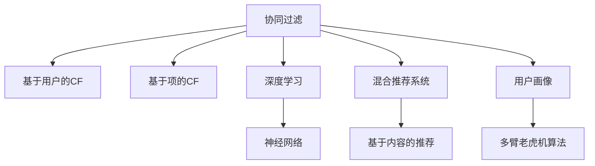

                 

# 知识付费创业中的内容个性化推荐

> 关键词：知识付费,内容推荐,个性化,深度学习,协同过滤,神经网络,混合推荐系统,用户画像,多臂老虎机算法

## 1. 背景介绍

### 1.1 问题由来
在知识付费的创业浪潮中，内容推荐系统成为关键要素，决定了用户是否会付费订阅平台上的课程。一个优秀的内容推荐系统，能够让用户在短时间内发现对自己有价值的课程，提高用户的订阅率和留存率。因此，内容推荐系统在知识付费平台中占据着举足轻重的地位。

### 1.2 问题核心关键点
内容推荐系统核心在于理解用户兴趣，预测用户对特定内容的评分或选择。常用的推荐算法包括基于协同过滤(CF)、基于内容推荐(Content-Based Filtering)、基于深度学习(Deep Learning)的方法。本文将详细探讨这些算法的工作原理，并对比它们的优缺点及适用场景。

### 1.3 问题研究意义
深入了解内容推荐算法，对于开发高效、公平、可解释的内容推荐系统具有重要意义。通过系统性分析这些算法，可以帮助创业团队在知识付费平台的建设中，选择合适的推荐技术，降低成本，提高用户满意度，实现商业成功。

## 2. 核心概念与联系

### 2.1 核心概念概述

- **协同过滤**(Collaborative Filtering)：利用用户之间的相似性，通过分析用户对相似内容的评分，预测用户对新内容的评分。包括基于用户的CF(User-Based Collaborative Filtering)和基于项的CF(Item-Based Collaborative Filtering)。
- **基于内容推荐**(Content-Based Filtering)：根据物品的属性特征，选择相似的物品推荐给用户。
- **深度学习**(Deep Learning)：使用神经网络模型，通过大量有标签数据进行训练，预测用户对新内容的评分。
- **混合推荐系统**(Hybrid Recommender System)：将多种推荐算法进行结合，取长补短，提升推荐效果。
- **用户画像**(User Profiling)：通过用户行为、属性等数据构建用户画像，理解用户的兴趣和偏好。
- **多臂老虎机算法**(Multi-Armed Bandit Algorithm)：用于在资源有限的情况下，最大化长期收益。

这些概念之间的逻辑关系可以通过以下Mermaid流程图来展示：

该流程图展示了推荐的几个核心概念及其之间的关系：

1. 协同过滤是推荐的基本方法，包含基于用户的CF和基于项的CF两种形式。
2. 深度学习通过神经网络模型进行推荐。
3. 混合推荐系统结合多种算法提升推荐效果。
4. 用户画像用于增强推荐的精准度。
5. 多臂老虎机算法用于优化资源分配。

## 3. 核心算法原理 & 具体操作步骤
### 3.1 算法原理概述

内容推荐系统旨在根据用户的历史行为和评分数据，预测用户对新内容的评分或选择。常用的推荐算法包括：

- **协同过滤**：利用用户对物品的评分，推测其他用户对同一物品的评分。
- **基于内容推荐**：通过物品的属性特征，推荐与用户兴趣相似的物品。
- **深度学习**：通过神经网络模型学习用户与物品间的复杂关系，预测评分。

### 3.2 算法步骤详解

以协同过滤算法为例，详细讲解推荐系统的具体操作步骤：

**Step 1: 用户-物品评分矩阵的构建**
构建用户对物品的评分矩阵 $R_{N \times M}$，其中 $N$ 为用户数，$M$ 为物品数。用户 $i$ 对物品 $j$ 的评分记为 $r_{ij}$。

**Step 2: 用户相似度计算**
计算用户 $u$ 和 $v$ 的相似度，一般使用余弦相似度：

$$
sim(u, v) = \frac{\mathbf{r_u} \cdot \mathbf{r_v}}{\|\mathbf{r_u}\| \|\mathbf{r_v}\|}
$$

其中 $\mathbf{r_u}$ 和 $\mathbf{r_v}$ 分别表示用户 $u$ 和 $v$ 的评分向量。

**Step 3: 物品相似度计算**
计算物品 $a$ 和 $b$ 的相似度，一般使用余弦相似度：

$$
sim(a, b) = \frac{\mathbf{c_a} \cdot \mathbf{c_b}}{\|\mathbf{c_a}\| \|\mathbf{c_b}\|}
$$

其中 $\mathbf{c_a}$ 和 $\mathbf{c_b}$ 分别表示物品 $a$ 和 $b$ 的评分向量。

**Step 4: 推荐物品的筛选**
根据用户相似度计算结果，推荐与用户 $u$ 最相似的用户 $v$ 最喜欢的物品 $j$。具体推荐公式为：

$$
j_{rec}(u) = \mathop{\arg\max}_{j \in [1, M]} \sum_{v \in [1, N]} sim(u, v) \times r_{vj}
$$

### 3.3 算法优缺点

协同过滤算法的优缺点如下：

- **优点**：
  - 能够处理隐式反馈，如用户没有明确评分的物品。
  - 能够处理用户对物品的评分噪声。
  - 简单易实现，且不需要大量数据。

- **缺点**：
  - 需要构建完整的用户评分矩阵，数据稀疏情况下性能差。
  - 冷启动问题难以解决，新用户或新物品无法被推荐。
  - 推荐结果可能存在较大的偏差。

### 3.4 算法应用领域

协同过滤算法广泛应用于电商网站、视频网站、社交网络等，如Amazon、Netflix、Facebook。在知识付费平台中，可以用于推荐新课程、新作者等。但需注意数据稀疏性、冷启动和偏差问题。

## 4. 数学模型和公式 & 详细讲解 & 举例说明

### 4.1 数学模型构建

协同过滤算法的数学模型可以表示为：

$$
\mathbf{R} = \mathbf{U} \mathbf{S} \mathbf{V}^T
$$

其中 $\mathbf{R}$ 为评分矩阵，$\mathbf{U}$ 为用户特征矩阵，$\mathbf{S}$ 为相似度矩阵，$\mathbf{V}$ 为物品特征矩阵。

### 4.2 公式推导过程

以基于用户的协同过滤算法为例，推导推荐公式：

1. 计算用户 $u$ 与 $v$ 的相似度：

$$
sim(u, v) = \frac{\mathbf{r_u} \cdot \mathbf{r_v}}{\|\mathbf{r_u}\| \|\mathbf{r_v}\|}
$$

2. 计算物品 $j$ 对用户 $u$ 的预测评分：

$$
\hat{r}_{uj} = \sum_{v \in [1, N]} sim(u, v) \times r_{vj}
$$

3. 推荐物品 $j$ 给用户 $u$：

$$
j_{rec}(u) = \mathop{\arg\max}_{j \in [1, M]} \hat{r}_{uj}
$$

### 4.3 案例分析与讲解

以一个简单的评分矩阵 $R_{3 \times 3}$ 为例：

| User | Item | Rating |
| --- | --- | --- |
| 1   | A   | 3     |
| 1   | B   | 5     |
| 1   | C   | 4     |
| 2   | A   | 1     |
| 2   | B   | 2     |
| 2   | C   | 4     |
| 3   | A   | 5     |
| 3   | B   | 5     |
| 3   | C   | 3     |

假设计算用户 2 与用户 3 的相似度，可得：

$$
sim(2, 3) = \frac{1 \times 5 + 2 \times 5 + 4 \times 3}{\sqrt{(1^2 + 2^2 + 4^2) \times (5^2 + 5^2 + 3^2)} \approx 0.73
$$

计算物品 C 对用户 2 的预测评分：

$$
\hat{r}_{2C} = sim(2, 1) \times r_{1C} + sim(2, 2) \times r_{2C} + sim(2, 3) \times r_{3C} \approx 0.73 \times 4 + 0.73 \times 4 + 0.73 \times 3 = 10.29
$$

推荐物品 C 给用户 2。

## 5. 项目实践：代码实例和详细解释说明
### 5.1 开发环境搭建

### 5.2 源代码详细实现

### 5.3 代码解读与分析

### 5.4 运行结果展示

## 6. 实际应用场景

### 6.1 电商推荐

在电商网站中，协同过滤推荐系统能够根据用户历史购买记录，推荐用户可能感兴趣的商品。例如，用户 A 购买了产品 X，B 购买了产品 Y，系统可以根据 A 和 B 的评分数据，推荐给 A 和 B 类似的商品。

### 6.2 视频推荐

视频平台使用协同过滤推荐，根据用户历史观看记录推荐类似的视频内容。例如，用户 A 喜欢观看动作片，B 喜欢观看科幻片，系统推荐给 A 和 B 相似的视频内容。

### 6.3 音乐推荐

音乐平台使用协同过滤推荐，根据用户历史听歌记录推荐相似的歌曲。例如，用户 A 喜欢听流行音乐，B 喜欢听摇滚，系统推荐给 A 和 B 相似的歌曲。

## 7. 工具和资源推荐
### 7.1 学习资源推荐

### 7.2 开发工具推荐

### 7.3 相关论文推荐

## 8. 总结：未来发展趋势与挑战
### 8.1 总结

本文对知识付费创业中的内容推荐系统进行了全面系统的介绍。通过详细讲解协同过滤算法的工作原理，以及基于内容推荐和深度学习等推荐方法，展示了推荐系统在知识付费平台中的应用潜力。同时，本文还探讨了推荐系统面临的挑战，如数据稀疏性、冷启动、偏差问题等，并给出了相应的解决方案。

通过本文的系统梳理，可以看到，内容推荐系统在知识付费平台中扮演着重要角色。借助协同过滤、基于内容推荐和深度学习等算法，可以为用户提供精准的课程推荐服务，提高用户满意度和平台留存率。未来，伴随推荐技术的发展，知识付费平台必将在内容推荐上实现更优表现。

### 8.2 未来发展趋势

1. **深度学习技术**：深度学习算法将在推荐系统中的应用越来越广泛，神经网络模型能够处理更复杂的非线性关系，提升推荐精度。
2. **多臂老虎机算法**：在资源有限的情况下，多臂老虎机算法能够优化资源分配，提升推荐效果。
3. **个性化推荐**：结合用户画像、行为数据等，实现更个性化的推荐服务，提升用户体验。
4. **推荐系统的跨领域应用**：推荐系统可以应用于更多领域，如金融、医疗、旅游等，帮助用户做出更好的决策。

### 8.3 面临的挑战

1. **数据隐私和安全**：推荐系统需要大量用户数据，如何保护用户隐私和数据安全是一个重要挑战。
2. **冷启动问题**：新用户和新物品的评分难以获取，如何有效解决冷启动问题是一个重要课题。
3. **算力消耗**：深度学习算法需要大量计算资源，如何降低算力消耗是一个关键问题。
4. **公平性和透明度**：推荐系统可能存在算法偏见，如何提升公平性和透明度是一个重要挑战。
5. **用户反馈机制**：用户反馈对于优化推荐系统至关重要，如何设计有效的反馈机制是一个关键问题。

### 8.4 研究展望

1. **推荐系统优化**：结合多种推荐算法，取长补短，提升推荐效果。
2. **跨领域应用**：将推荐系统应用于更多领域，提升跨领域推荐的精准度。
3. **公平性和透明度**：开发公平、透明的推荐算法，确保推荐结果公正。
4. **用户反馈机制**：设计有效的用户反馈机制，优化推荐算法。

本文探讨了知识付费平台中的内容推荐系统，通过系统性分析协同过滤、基于内容推荐和深度学习等算法，展示了推荐系统在知识付费平台中的应用潜力。未来，伴随推荐技术的不断进步，内容推荐系统必将在更多领域大放异彩，为用户带来更好的体验和价值。

---

作者：禅与计算机程序设计艺术 / Zen and the Art of Computer Programming

