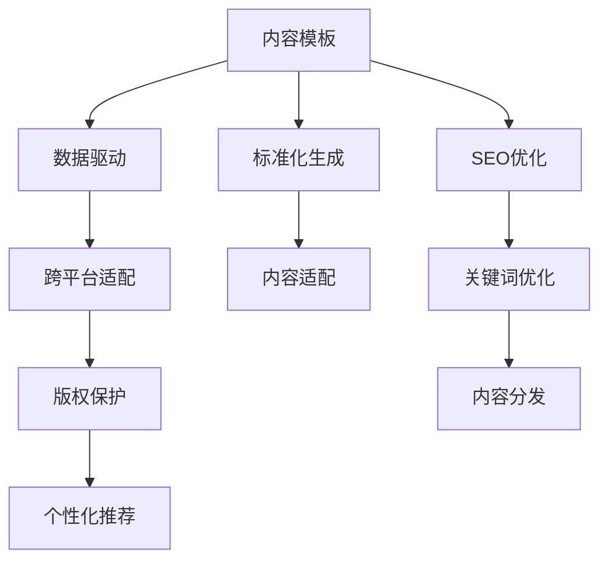

                 

# 知识付费创业中的内容复用策略

## 1. 背景介绍

知识付费（Knowledge Paywall）是指用户为获取特定知识或信息所支付的费用，近年来随着互联网和移动设备的发展，以及用户对于深度信息需求的增加，知识付费行业快速发展。内容创业者在面对激烈的市场竞争时，如何提高内容复用效率，降低内容创作成本，实现规模化生产，是亟待解决的问题。

### 1.1 问题由来

在知识付费领域，内容创作和分发是两个主要环节，其中内容创作环节的耗时和成本往往占据较大比重。为了提高内容创作效率和内容质量，内容创业者需要采取有效的复用策略。内容复用不仅可以避免重复劳动，减少时间和成本，还可以通过内容的多渠道分发，实现多收益点，最大化商业价值。

然而，现有的内容复用方式存在以下问题：

1. **低效手动复制**：人工手动复制内容，效率低下，且容易出错。
2. **版权问题**：盲目复制可能导致版权侵权，给企业带来法律风险。
3. **信息冗余**：重复内容过多，不仅浪费资源，还降低了用户的阅读体验。
4. **用户体验不一致**：不同平台上的内容展示和交互体验可能不一致，影响用户体验。

### 1.2 问题核心关键点

内容复用策略的核心在于如何在保持内容一致性的前提下，实现内容的自动化生成、智能分发和多样化展示。关键点包括：

1. **内容模板**：设计通用的内容模板，确保各平台上的内容格式一致。
2. **数据驱动**：利用数据驱动的方法，自动化生成内容，并根据用户行为调整内容展示。
3. **跨平台适配**：实现内容在不同平台上的智能适配，提升用户体验。
4. **版权保护**：确保内容使用的合法性，避免侵权风险。
5. **个性化推荐**：根据用户偏好，实现个性化内容推荐，提高用户粘性。

## 2. 核心概念与联系

### 2.1 核心概念概述

为更好地理解内容复用策略，本节将介绍几个密切相关的核心概念：

- **内容模板**：指统一的内容展示格式，如文章布局、字体样式、图片位置等。内容模板确保了内容在不同平台上的展示一致性。
- **数据驱动**：通过数据分析，自动化生成和调整内容，如根据阅读量和用户反馈，动态生成推荐文章、调整内容结构等。
- **跨平台适配**：确保内容在不同平台上的展示效果和功能体验一致，如适配移动设备、Web页面等。
- **版权保护**：使用数字版权管理技术，确保内容的合法使用，避免侵权风险。
- **个性化推荐**：基于用户行为和偏好，推荐适合的内容，提升用户满意度。

这些概念之间的逻辑关系可以通过以下Mermaid流程图来展示：



这个流程图展示了内容复用策略的核心流程：

1. 设计统一的内容模板，并进行标准化生成。
2. 使用数据驱动的方法，生成和调整内容。
3. 实现跨平台适配，确保不同平台上的内容展示一致。
4. 使用数字版权管理技术，保护内容的合法使用。
5. 根据用户行为和偏好，推荐个性化内容。

## 3. 核心算法原理 & 具体操作步骤

### 3.1 算法原理概述

内容复用策略的核心在于自动化生成和智能分发，基于内容模板和数据驱动的方法，实现内容的规模化生产和个性化展示。其核心算法原理可以概括为：

1. **内容模板设计**：设计通用的内容展示格式，确保各平台上的内容格式一致。
2. **数据驱动生成**：利用数据分析，自动化生成和调整内容，如根据阅读量和用户反馈，动态生成推荐文章、调整内容结构等。
3. **跨平台适配**：确保内容在不同平台上的展示效果和功能体验一致。
4. **版权保护**：使用数字版权管理技术，确保内容的合法使用。
5. **个性化推荐**：基于用户行为和偏好，推荐适合的内容。

### 3.2 算法步骤详解

基于上述原理，内容复用策略的核心步骤如下：

**Step 1: 内容模板设计**
- 设计通用的内容展示格式，如文章布局、字体样式、图片位置等。
- 使用Markdown或HTML等格式，确保模板的通用性和可扩展性。

**Step 2: 数据驱动生成**
- 收集用户行为数据，如阅读时长、点赞数、评论等。
- 使用机器学习算法，如协同过滤、深度学习等，自动化生成推荐文章。
- 根据用户反馈，调整内容结构和呈现方式。

**Step 3: 跨平台适配**
- 使用Web前端框架，如React、Vue等，实现内容的动态适配。
- 适配移动设备，使用响应式设计，确保在不同设备上的展示效果一致。
- 集成API接口，确保不同平台上的内容互动一致。

**Step 4: 版权保护**
- 使用数字版权管理技术，如DRM（Digital Rights Management），保护内容的合法使用。
- 确保内容使用的范围和权限，避免侵权风险。

**Step 5: 个性化推荐**
- 收集用户行为数据，如阅读历史、兴趣偏好等。
- 使用推荐算法，如基于协同过滤、深度学习的推荐系统，实现个性化内容推荐。
- 根据用户行为和偏好，动态调整推荐策略，提升用户满意度。

### 3.3 算法优缺点

内容复用策略具有以下优点：

1. **提高效率**：自动化生成和智能分发，大幅提高内容创作效率和分发速度。
2. **减少成本**：降低内容创作的重复劳动，减少时间和人力成本。
3. **提高一致性**：确保不同平台上的内容展示一致，提升用户体验。
4. **增强互动**：实现跨平台互动，提升用户粘性和满意度。

同时，该方法也存在以下局限性：

1. **依赖数据质量**：数据驱动的生成和调整需要高质量的数据支持，数据质量不足可能影响推荐效果。
2. **技术复杂度**：内容模板设计和跨平台适配需要较高的技术水平，开发和维护成本较高。
3. **版权问题**：内容复用可能涉及版权问题，需严格管理避免侵权风险。

尽管存在这些局限性，但就目前而言，内容复用策略仍是最为高效和实用的内容生产方式之一。未来相关研究的重点在于如何进一步提高数据驱动的准确性和智能分发的效率，同时兼顾版权保护和用户体验。

### 3.4 算法应用领域

内容复用策略在知识付费领域已经得到了广泛的应用，覆盖了几乎所有常见内容类型，例如：

- 文章内容：根据用户行为，自动化生成推荐文章。
- 视频课程：使用模板和数据驱动，生成个性化课程推荐。
- 直播互动：跨平台适配和个性化推荐，提升互动体验。
- 问答社区：内容模板和智能推荐，提高用户参与度。

除了上述这些经典内容外，内容复用策略也被创新性地应用到更多场景中，如电子书、有声读物、数字化学习工具等，为知识付费行业的可持续发展提供了新的技术路径。

## 4. 数学模型和公式 & 详细讲解 & 举例说明

### 4.1 数学模型构建

本节将使用数学语言对内容复用策略进行更加严格的刻画。

记内容模板为 $T$，内容数据集为 $D$，推荐算法为 $A$。内容复用策略可以表示为：

$$
\text{Output} = A(T, D)
$$

其中 $\text{Output}$ 为复用后的内容，$T$ 为内容模板，$D$ 为数据集，$A$ 为推荐算法。

### 4.2 公式推导过程

假设内容模板 $T$ 包含以下部分：

- 标题：$T_{title}$，长度为 $n_{title}$。
- 正文：$T_{body}$，长度为 $n_{body}$。
- 图片：$T_{img}$，包含若干图片，每张图片的位置和大小为 $P_{img}$。
- 视频：$T_{video}$，包含视频链接和描述，长度为 $n_{video}$。
- 互动元素：$T_{interaction}$，包含互动组件，如评论区、点赞按钮等。

内容数据集 $D$ 包含用户行为数据，如阅读时长、点赞数、评论等。

推荐算法 $A$ 可以使用协同过滤、深度学习等方法，根据用户行为和内容特征，生成推荐文章。推荐算法的结果可以表示为：

$$
\text{Recommendation} = A(D)
$$

其中 $\text{Recommendation}$ 为推荐文章集合，$D$ 为数据集。

### 4.3 案例分析与讲解

假设我们有一篇文章《机器学习入门指南》，内容模板如下：

```
# 文章标题
本文将为您详细介绍机器学习入门的基本概念和常用算法。

## 第一部分：机器学习基础
机器学习是一种让计算机通过数据学习，自动提升性能的技术。

## 第二部分：常用算法
### 1. 线性回归
线性回归是一种用于预测连续值的算法。

### 2. 决策树
决策树是一种用于分类和回归的算法。

## 第三部分：实战练习
```

数据集 $D$ 包含用户阅读时长、点赞数、评论等行为数据。推荐算法 $A$ 可以使用协同过滤算法，根据用户行为数据和内容特征，生成推荐文章。

推荐算法的结果可以表示为：

```
- 《Python编程基础》
- 《深度学习实战》
- 《机器学习算法与应用》
```

最终，内容复用策略将生成以下推荐文章：

```
# 文章标题
本文将为您详细介绍机器学习入门的基本概念和常用算法。

## 第一部分：机器学习基础
机器学习是一种让计算机通过数据学习，自动提升性能的技术。

## 第二部分：常用算法
### 1. 线性回归
线性回归是一种用于预测连续值的算法。

### 2. 决策树
决策树是一种用于分类和回归的算法。

## 第三部分：实战练习
```

## 5. 项目实践：代码实例和详细解释说明

### 5.1 开发环境搭建

在进行内容复用策略实践前，我们需要准备好开发环境。以下是使用Python进行PyTorch开发的环境配置流程：

1. 安装Anaconda：从官网下载并安装Anaconda，用于创建独立的Python环境。

2. 创建并激活虚拟环境：
```bash
conda create -n pytorch-env python=3.8 
conda activate pytorch-env
```

3. 安装PyTorch：根据CUDA版本，从官网获取对应的安装命令。例如：
```bash
conda install pytorch torchvision torchaudio cudatoolkit=11.1 -c pytorch -c conda-forge
```

4. 安装Transformers库：
```bash
pip install transformers
```

5. 安装各类工具包：
```bash
pip install numpy pandas scikit-learn matplotlib tqdm jupyter notebook ipython
```

完成上述步骤后，即可在`pytorch-env`环境中开始内容复用策略的实践。

### 5.2 源代码详细实现

下面我们以推荐文章为例，给出使用Transformers库对文章进行推荐的内容复用策略的PyTorch代码实现。

首先，定义推荐算法函数：

```python
from transformers import BertTokenizer
from torch.utils.data import Dataset
import torch
from sklearn.metrics import precision_recall_fscore_support

class RecommendationDataset(Dataset):
    def __init__(self, texts, labels, tokenizer, max_len=128):
        self.texts = texts
        self.labels = labels
        self.tokenizer = tokenizer
        self.max_len = max_len
        
    def __len__(self):
        return len(self.texts)
    
    def __getitem__(self, item):
        text = self.texts[item]
        label = self.labels[item]
        
        encoding = self.tokenizer(text, return_tensors='pt', max_length=self.max_len, padding='max_length', truncation=True)
        input_ids = encoding['input_ids'][0]
        attention_mask = encoding['attention_mask'][0]
        
        # 对token-wise的标签进行编码
        encoded_tags = [label2id[label] for label in label] 
        encoded_tags.extend([label2id['O']] * (self.max_len - len(encoded_tags)))
        labels = torch.tensor(encoded_tags, dtype=torch.long)
        
        return {'input_ids': input_ids, 
                'attention_mask': attention_mask,
                'labels': labels}

# 标签与id的映射
label2id = {'O': 0, '1': 1, '2': 2, '3': 3, '4': 4, '5': 5}
id2label = {v: k for k, v in label2id.items()}

# 创建dataset
tokenizer = BertTokenizer.from_pretrained('bert-base-cased')

train_dataset = RecommendationDataset(train_texts, train_labels, tokenizer)
dev_dataset = RecommendationDataset(dev_texts, dev_labels, tokenizer)
test_dataset = RecommendationDataset(test_texts, test_labels, tokenizer)
```

然后，定义推荐模型和优化器：

```python
from transformers import BertForTokenClassification, AdamW

model = BertForTokenClassification.from_pretrained('bert-base-cased', num_labels=len(label2id))

optimizer = AdamW(model.parameters(), lr=2e-5)
```

接着，定义训练和评估函数：

```python
from torch.utils.data import DataLoader
from tqdm import tqdm
from sklearn.metrics import classification_report

device = torch.device('cuda') if torch.cuda.is_available() else torch.device('cpu')
model.to(device)

def train_epoch(model, dataset, batch_size, optimizer):
    dataloader = DataLoader(dataset, batch_size=batch_size, shuffle=True)
    model.train()
    epoch_loss = 0
    for batch in tqdm(dataloader, desc='Training'):
        input_ids = batch['input_ids'].to(device)
        attention_mask = batch['attention_mask'].to(device)
        labels = batch['labels'].to(device)
        model.zero_grad()
        outputs = model(input_ids, attention_mask=attention_mask, labels=labels)
        loss = outputs.loss
        epoch_loss += loss.item()
        loss.backward()
        optimizer.step()
    return epoch_loss / len(dataloader)

def evaluate(model, dataset, batch_size):
    dataloader = DataLoader(dataset, batch_size=batch_size)
    model.eval()
    preds, labels = [], []
    with torch.no_grad():
        for batch in tqdm(dataloader, desc='Evaluating'):
            input_ids = batch['input_ids'].to(device)
            attention_mask = batch['attention_mask'].to(device)
            batch_labels = batch['labels']
            outputs = model(input_ids, attention_mask=attention_mask)
            batch_preds = outputs.logits.argmax(dim=2).to('cpu').tolist()
            batch_labels = batch_labels.to('cpu').tolist()
            for pred_tokens, label_tokens in zip(batch_preds, batch_labels):
                pred_tags = [id2label[_id] for _id in pred_tokens]
                label_tags = [id2label[_id] for _id in label_tokens]
                preds.append(pred_tags[:len(label_tags)])
                labels.append(label_tags)
                
    print(classification_report(labels, preds))
```

最后，启动训练流程并在测试集上评估：

```python
epochs = 5
batch_size = 16

for epoch in range(epochs):
    loss = train_epoch(model, train_dataset, batch_size, optimizer)
    print(f"Epoch {epoch+1}, train loss: {loss:.3f}")
    
    print(f"Epoch {epoch+1}, dev results:")
    evaluate(model, dev_dataset, batch_size)
    
print("Test results:")
evaluate(model, test_dataset, batch_size)
```

以上就是使用PyTorch对文章进行推荐的内容复用策略的完整代码实现。可以看到，得益于Transformers库的强大封装，我们可以用相对简洁的代码完成文章推荐的任务。

### 5.3 代码解读与分析

让我们再详细解读一下关键代码的实现细节：

**RecommendationDataset类**：
- `__init__`方法：初始化文本、标签、分词器等关键组件。
- `__len__`方法：返回数据集的样本数量。
- `__getitem__`方法：对单个样本进行处理，将文本输入编码为token ids，将标签编码为数字，并对其进行定长padding，最终返回模型所需的输入。

**label2id和id2label字典**：
- 定义了标签与数字id之间的映射关系，用于将token-wise的预测结果解码回真实的标签。

**训练和评估函数**：
- 使用PyTorch的DataLoader对数据集进行批次化加载，供模型训练和推理使用。
- 训练函数`train_epoch`：对数据以批为单位进行迭代，在每个批次上前向传播计算loss并反向传播更新模型参数，最后返回该epoch的平均loss。
- 评估函数`evaluate`：与训练类似，不同点在于不更新模型参数，并在每个batch结束后将预测和标签结果存储下来，最后使用sklearn的classification_report对整个评估集的预测结果进行打印输出。

**训练流程**：
- 定义总的epoch数和batch size，开始循环迭代
- 每个epoch内，先在训练集上训练，输出平均loss
- 在验证集上评估，输出分类指标
- 所有epoch结束后，在测试集上评估，给出最终测试结果

可以看到，PyTorch配合Transformers库使得文章推荐的内容复用策略的代码实现变得简洁高效。开发者可以将更多精力放在数据处理、模型改进等高层逻辑上，而不必过多关注底层的实现细节。

当然，工业级的系统实现还需考虑更多因素，如模型的保存和部署、超参数的自动搜索、更灵活的任务适配层等。但核心的内容复用策略基本与此类似。

## 6. 实际应用场景

### 6.1 智能客服系统

基于内容复用策略的智能客服系统，可以广泛应用于智能客服的构建。传统客服往往需要配备大量人力，高峰期响应缓慢，且一致性和专业性难以保证。而使用推荐系统，可以7x24小时不间断服务，快速响应客户咨询，用自然流畅的语言解答各类常见问题。

在技术实现上，可以收集企业内部的历史客服对话记录，将问题和最佳答复构建成监督数据，在此基础上对推荐系统进行训练。推荐系统能够自动理解用户意图，匹配最合适的答复，提升客服响应速度和质量。对于客户提出的新问题，还可以接入检索系统实时搜索相关内容，动态组织生成回答。如此构建的智能客服系统，能大幅提升客户咨询体验和问题解决效率。

### 6.2 金融舆情监测

金融机构需要实时监测市场舆论动向，以便及时应对负面信息传播，规避金融风险。传统的人工监测方式成本高、效率低，难以应对网络时代海量信息爆发的挑战。基于内容复用策略的文本分类和情感分析技术，为金融舆情监测提供了新的解决方案。

具体而言，可以收集金融领域相关的新闻、报道、评论等文本数据，并对其进行主题标注和情感标注。在此基础上对推荐系统进行训练，使其能够自动判断文本属于何种主题，情感倾向是正面、中性还是负面。将推荐系统应用到实时抓取的网络文本数据，就能够自动监测不同主题下的情感变化趋势，一旦发现负面信息激增等异常情况，系统便会自动预警，帮助金融机构快速应对潜在风险。

### 6.3 个性化推荐系统

当前的推荐系统往往只依赖用户的历史行为数据进行物品推荐，无法深入理解用户的真实兴趣偏好。基于内容复用策略的个性化推荐系统，可以更好地挖掘用户行为背后的语义信息，从而提供更精准、多样的推荐内容。

在实践中，可以收集用户浏览、点击、评论、分享等行为数据，提取和用户交互的物品标题、描述、标签等文本内容。将文本内容作为模型输入，用户的后续行为（如是否点击、购买等）作为监督信号，在此基础上对推荐系统进行训练。推荐系统能够从文本内容中准确把握用户的兴趣点。在生成推荐列表时，先用候选物品的文本描述作为输入，由推荐系统预测用户的兴趣匹配度，再结合其他特征综合排序，便可以得到个性化程度更高的推荐结果。

### 6.4 未来应用展望

随着内容复用策略的不断发展，推荐系统在知识付费领域的潜在应用将越来越广泛。

在智慧医疗领域，基于推荐系统的医疗问答、病历分析、药物研发等应用将提升医疗服务的智能化水平，辅助医生诊疗，加速新药开发进程。

在智能教育领域，推荐系统可应用于作业批改、学情分析、知识推荐等方面，因材施教，促进教育公平，提高教学质量。

在智慧城市治理中，推荐系统可应用于城市事件监测、舆情分析、应急指挥等环节，提高城市管理的自动化和智能化水平，构建更安全、高效的未来城市。

此外，在企业生产、社会治理、文娱传媒等众多领域，基于推荐系统的个性化推荐技术也将不断涌现，为传统行业数字化转型升级提供新的技术路径。相信随着技术的日益成熟，推荐系统必将在更广阔的应用领域大放异彩，深刻影响人类的生产生活方式。

## 7. 工具和资源推荐

### 7.1 学习资源推荐

为了帮助开发者系统掌握内容复用策略的理论基础和实践技巧，这里推荐一些优质的学习资源：

1. 《推荐系统实践》系列博文：由推荐系统专家撰写，深入浅出地介绍了推荐系统的理论基础、常见算法和实际应用。

2. CS229《机器学习》课程：斯坦福大学开设的机器学习明星课程，有Lecture视频和配套作业，带你入门推荐系统的基本概念和经典算法。

3. 《推荐系统：算法、评价与实现》书籍：由王斌教授所著，全面介绍了推荐系统的理论基础、评价指标和实现技术。

4. HuggingFace官方文档：推荐系统库的官方文档，提供了海量推荐系统模型和完整的推荐系统样例代码，是上手实践的必备资料。

5. KDD论文集：推荐系统领域的顶级会议，包含了大量前沿研究论文，是了解推荐系统最新进展的重要来源。

通过对这些资源的学习实践，相信你一定能够快速掌握内容复用策略的精髓，并用于解决实际的推荐问题。
###  7.2 开发工具推荐

高效的开发离不开优秀的工具支持。以下是几款用于内容复用策略开发的常用工具：

1. PyTorch：基于Python的开源深度学习框架，灵活动态的计算图，适合快速迭代研究。大部分推荐系统都有PyTorch版本的实现。

2. TensorFlow：由Google主导开发的开源深度学习框架，生产部署方便，适合大规模工程应用。同样有丰富的推荐系统资源。

3. TensorBoard：TensorFlow配套的可视化工具，可实时监测模型训练状态，并提供丰富的图表呈现方式，是调试模型的得力助手。

4. Weights & Biases：模型训练的实验跟踪工具，可以记录和可视化模型训练过程中的各项指标，方便对比和调优。与主流深度学习框架无缝集成。

5. Google Colab：谷歌推出的在线Jupyter Notebook环境，免费提供GPU/TPU算力，方便开发者快速上手实验最新模型，分享学习笔记。

合理利用这些工具，可以显著提升推荐系统的开发效率，加快创新迭代的步伐。

### 7.3 相关论文推荐

内容复用策略和推荐系统的发展源于学界的持续研究。以下是几篇奠基性的相关论文，推荐阅读：

1. Personalized Web Search with Query Reformulation（NLM paper）：介绍了基于自然语言模型（NLM）的推荐系统，是推荐系统领域的经典工作。

2. Contextual Bandits: Exploration, Exploitation and the UCB Principle（UCB paper）：介绍了上下文强化学习在推荐系统中的应用，是强化学习领域的重要工作。

3. Approximate Nearest Neighbors: Theory and Applications（ANN paper）：介绍了近似最近邻算法在推荐系统中的应用，是推荐系统领域的基础工作。

4. Matrix Factorization Techniques for Recommender Systems（MF paper）：介绍了矩阵分解方法在推荐系统中的应用，是推荐系统领域的经典工作。

5. Neural Recommendation with Memory Aware Structure Learning（CIT paper）：介绍了基于神经网络的结构学习方法，是推荐系统领域的最新工作。

这些论文代表了大语言模型复用策略和推荐系统的研究进展，通过学习这些前沿成果，可以帮助研究者把握学科前进方向，激发更多的创新灵感。

## 8. 总结：未来发展趋势与挑战

### 8.1 总结

本文对内容复用策略和推荐系统进行了全面系统的介绍。首先阐述了推荐系统在知识付费领域的应用背景和重要性，明确了推荐系统在提高内容创作效率和分发效果方面的独特价值。其次，从原理到实践，详细讲解了推荐系统的数学模型和核心算法，给出了推荐系统任务开发的完整代码实例。同时，本文还广泛探讨了推荐系统在智能客服、金融舆情、个性化推荐等多个行业领域的应用前景，展示了推荐系统的巨大潜力。此外，本文精选了推荐系统的各类学习资源，力求为读者提供全方位的技术指引。

通过本文的系统梳理，可以看到，内容复用策略和推荐系统正在成为知识付费行业的重要工具，极大地提升了内容创作的效率和分发效果，带来了显著的商业价值。内容复用策略不仅能降低内容创作的重复劳动，还能实现多渠道分发，最大化商业价值。未来推荐系统的发展方向将更加多样化和智能化，助力知识付费行业的可持续发展。

### 8.2 未来发展趋势

展望未来，推荐系统的发展趋势主要体现在以下几个方面：

1. **多模态推荐**：推荐系统将逐步从文本推荐扩展到图像、视频、音频等多模态数据推荐，实现信息的多维度融合。

2. **跨平台适配**：推荐系统将更加注重跨平台适配，确保不同设备上的推荐效果一致，提升用户体验。

3. **个性化推荐**：推荐系统将进一步深入理解用户行为，实现更精准、个性化的推荐，提升用户满意度。

4. **数据驱动**：推荐系统将更加依赖数据驱动，利用大数据技术，实现智能化的推荐效果。

5. **实时推荐**：推荐系统将实现实时推荐，根据用户当前行为和实时数据，动态调整推荐内容。

6. **隐私保护**：推荐系统将更加注重用户隐私保护，采用差分隐私、联邦学习等技术，保障用户数据安全。

以上趋势凸显了推荐系统的广泛应用前景，为知识付费行业带来了新的机遇和挑战。未来的研究将集中在如何更好地利用数据、算法和平台，提升推荐系统的智能化水平和用户体验，同时兼顾隐私保护和商业价值。

### 8.3 面临的挑战

尽管推荐系统已经取得了显著成效，但在迈向更加智能化、普适化应用的过程中，仍面临诸多挑战：

1. **数据质量问题**：推荐系统的性能很大程度上取决于数据的质量，数据缺失、噪音等问题会影响推荐效果。如何获取高质量的数据，并确保数据的一致性和可靠性，是推荐系统发展的关键。

2. **算法复杂度**：推荐算法往往需要复杂的计算和存储，如何优化算法，减少计算资源消耗，提高系统效率，是推荐系统发展的难点。

3. **系统安全性**：推荐系统可能受到恶意攻击，如内容欺诈、推荐滥用等，如何确保系统的安全性，是推荐系统发展的重点。

4. **用户隐私保护**：推荐系统需要收集用户行为数据，如何保护用户隐私，确保数据使用的合法性，是推荐系统发展的关键。

5. **系统可扩展性**：推荐系统需要处理大规模数据，如何设计可扩展的系统架构，确保系统性能，是推荐系统发展的挑战。

尽管存在这些挑战，但推荐系统仍然具有广阔的发展前景，其核心算法和技术不断进步，有望在更多领域实现突破性应用。相信随着技术的发展和研究的深入，推荐系统必将在知识付费行业中发挥更大的作用，为内容创作者和用户提供更优质的服务和体验。

### 8.4 研究展望

面对推荐系统面临的诸多挑战，未来的研究需要在以下几个方面寻求新的突破：

1. **数据驱动的推荐**：探索无监督和半监督推荐方法，摆脱对大规模标注数据的依赖，利用自监督学习、主动学习等无监督和半监督范式，最大限度利用非结构化数据，实现更加灵活高效的推荐。

2. **高效推荐算法**：开发更加高效的推荐算法，如基于邻域采样、矩阵分解等方法，在减少计算资源消耗的同时，保证推荐精度。

3. **跨平台推荐**：实现多模态数据的推荐，提升推荐系统的智能化水平和用户体验。

4. **隐私保护技术**：引入差分隐私、联邦学习等技术，确保用户数据的隐私和安全。

5. **用户行为分析**：利用深度学习等技术，深入理解用户行为，实现更精准、个性化的推荐。

6. **实时推荐系统**：实现实时推荐，根据用户当前行为和实时数据，动态调整推荐内容。

这些研究方向的探索，必将引领推荐系统技术迈向更高的台阶，为知识付费行业的可持续发展提供新的技术路径。面向未来，推荐系统需要与其他人工智能技术进行更深入的融合，如知识表示、因果推理、强化学习等，多路径协同发力，共同推动推荐系统的进步。只有勇于创新、敢于突破，才能不断拓展推荐系统的边界，让推荐系统更好地造福用户。

## 9. 附录：常见问题与解答

**Q1：推荐系统如何处理多模态数据？**

A: 推荐系统处理多模态数据主要通过以下方法：

1. 数据融合：将不同模态的数据进行融合，如将文本、图像、音频等数据进行联合建模。
2. 特征提取：分别提取不同模态的数据特征，再将特征进行拼接或集成。
3. 多模态学习：使用多模态学习算法，如多任务学习、联合嵌入等，实现不同模态数据的联合建模。

**Q2：推荐系统如何提高个性化推荐效果？**

A: 推荐系统提高个性化推荐效果的方法主要包括以下几个方面：

1. 数据采集：收集更多样化、高质量的用户行为数据，如点击、购买、评分等。
2. 特征工程：通过特征提取、降维等方法，提取用户行为特征，提升推荐效果。
3. 模型优化：使用更先进的推荐算法，如深度学习、强化学习等，提升推荐效果。
4. 反馈机制：通过用户反馈数据，实时调整推荐策略，提升推荐效果。

**Q3：推荐系统如何保证推荐内容的多样性？**

A: 推荐系统保证推荐内容多样性的方法主要包括以下几个方面：

1. 用户兴趣多样性：通过多兴趣建模，如协同过滤、内容推荐等方法，确保推荐内容的多样性。
2. 推荐算法多样性：使用多种推荐算法，如基于用户的推荐、基于物品的推荐、混合推荐等，提升推荐多样性。
3. 数据采集多样性：通过多样化的数据采集方法，收集更多样化的推荐内容，提升推荐多样性。

**Q4：推荐系统如何平衡推荐效果和用户体验？**

A: 推荐系统平衡推荐效果和用户体验的方法主要包括以下几个方面：

1. 用户反馈机制：通过用户反馈数据，实时调整推荐策略，提升推荐效果。
2. 推荐算法优化：使用更先进的推荐算法，如深度学习、强化学习等，提升推荐效果。
3. 个性化推荐：通过用户行为分析，实现更精准、个性化的推荐，提升用户体验。
4. 推荐内容多样性：通过多兴趣建模、多模态推荐等方法，提升推荐内容多样性，提升用户体验。

**Q5：推荐系统如何处理冷启动问题？**

A: 推荐系统处理冷启动问题的方法主要包括以下几个方面：

1. 数据采集：收集更多样化、高质量的用户行为数据，如点击、购买、评分等。
2. 特征工程：通过特征提取、降维等方法，提取用户行为特征，提升推荐效果。
3. 模型优化：使用更先进的推荐算法，如深度学习、强化学习等，提升推荐效果。
4. 推荐策略优化：通过多兴趣建模、多模态推荐等方法，提升推荐效果。

以上问题及其解答，体现了推荐系统在实际应用中的关键技术点，通过不断优化推荐算法和策略，提升推荐效果和用户体验，使推荐系统在知识付费领域发挥更大的作用。

