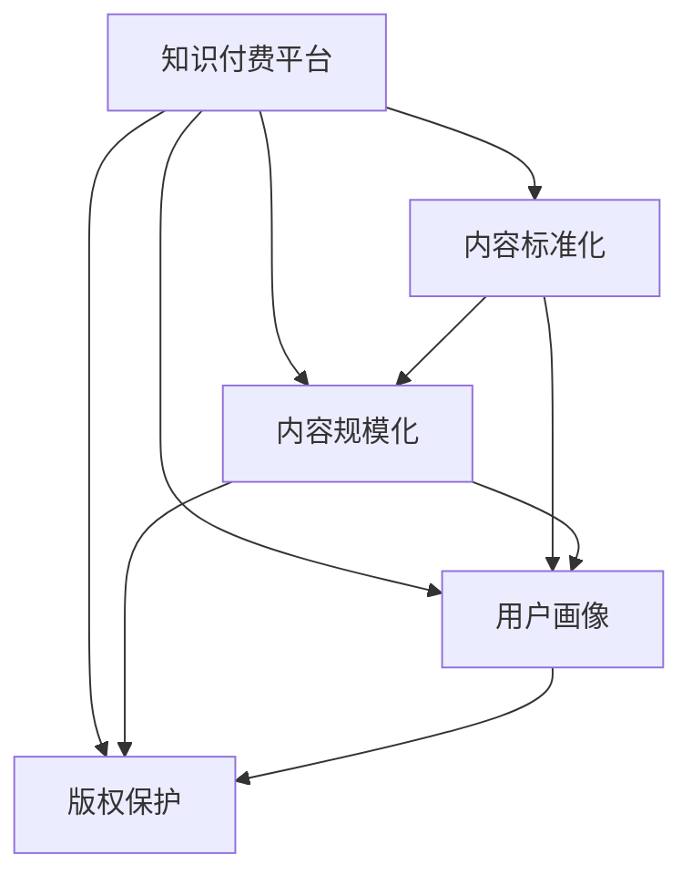

                 

# 知识付费创业中的内容标准化与规模化

## 1. 背景介绍

### 1.1 问题由来
随着互联网技术的快速发展，知识付费市场正迅速崛起，用户对高质量、高价值的知识内容需求日益增长。然而，如何有效整合海量信息，提供结构化、标准化、易获取的内容，是知识付费平台面临的重大挑战。

具体而言，知识付费市场存在以下痛点：
1. **内容零散**：各类内容来源广泛，格式多样，缺乏统一标准，难以系统组织。
2. **内容质量参差不齐**：质量高、有深度的内容稀缺，大量内容质量不高或偏离主题。
3. **用户匹配困难**：难以精准匹配用户需求与内容，用户体验不佳。
4. **版权问题**：版权保护和内容二次创作权难以平衡，盗版和抄袭现象频发。

为解决上述问题，本文提出基于内容标准化的知识付费平台架构，以提高内容质量、增强用户体验，并通过规模化运营提升平台竞争力。

## 2. 核心概念与联系

### 2.1 核心概念概述

- **知识付费平台**：基于互联网技术，为用户提供付费获取高质量知识内容的服务平台。
- **内容标准化**：通过对内容进行格式、分类、结构化等统一处理，确保内容的易获取、易理解。
- **内容规模化**：通过高效的生产、分发和运营机制，大幅提升内容产出效率和覆盖范围。
- **用户画像**：基于用户行为数据和特征，构建用户画像，精准匹配推荐内容。
- **版权保护**：通过技术手段和法律手段，保护内容版权，促进健康有序的内容生态。

这些概念通过一个合法的架构加以联系和关联。内容标准化和规模化是知识付费平台的核心能力，用户画像则用于内容匹配，版权保护则确保内容的合法权益。下面用Mermaid图示表示这些概念的联系：



## 3. 核心算法原理 & 具体操作步骤
### 3.1 算法原理概述

基于内容标准化的知识付费平台主要涉及以下算法原理：

1. **内容结构化**：将非结构化文本、音频、视频等转换为结构化数据，便于管理和搜索。
2. **内容分类与标签**：利用自然语言处理、图像识别等技术，对内容进行分类和标注，便于用户快速查找和浏览。
3. **内容推荐算法**：基于用户画像和内容特征，推荐个性化内容，提升用户体验。
4. **版权识别与保护**：通过水印、加密等技术，确保内容的版权，防止盗版和抄袭。

这些算法原理通过一系列操作步骤实现，下面详细介绍。

### 3.2 算法步骤详解

**步骤1：内容收集与预处理**

1. **内容采集**：通过API接口、爬虫、用户上传等方式，收集各类知识内容。
2. **内容预处理**：对采集到的内容进行格式转换、分词、去噪等处理，确保数据质量。

**步骤2：内容标准化**

1. **文本标准化**：利用自然语言处理技术，将文本转换为统一格式，如分词、去停用词、词性标注等。
2. **图像与音频标准化**：将图像、音频等非文本内容转换为结构化数据，如将图像转换为特征向量、音频转换为文本等。

**步骤3：内容分类与标签**

1. **内容分类**：利用机器学习或规则方法，对内容进行分类，如学科、主题、难度等。
2. **内容标签**：为每篇内容添加标签，如关键词、所属学科等，便于用户搜索和浏览。

**步骤4：内容推荐算法**

1. **用户画像**：基于用户行为数据，如浏览记录、搜索历史等，构建用户画像。
2. **内容匹配**：利用推荐算法，如协同过滤、内容-based推荐等，将内容匹配到用户。
3. **推荐优化**：根据用户反馈和点击行为，不断优化推荐算法，提高推荐的精准度。

**步骤5：版权保护**

1. **内容加密**：对内容进行加密处理，防止未授权访问。
2. **版权水印**：在内容中添加水印，用于版权追溯和侵权识别。
3. **法律保护**：通过版权登记、法律诉讼等方式，保护内容版权。

### 3.3 算法优缺点

**优点**：
1. **提升内容质量**：标准化处理确保内容结构化，提高内容质量。
2. **增强用户体验**：通过推荐算法精准匹配内容，提升用户体验。
3. **规模化运营**：高效的内容生成与分发机制，支持大规模运营。
4. **版权保护**：确保内容权益，促进健康内容生态。

**缺点**：
1. **技术复杂**：涉及文本处理、图像识别、推荐算法等技术，技术难度较高。
2. **成本较高**：技术开发与维护需要投入大量资源，初期成本较高。
3. **内容审核**：需要严格的内容审核机制，防止低质量内容和版权侵权。

### 3.4 算法应用领域

基于内容标准化的知识付费平台架构，适用于多种场景，如：
1. **教育培训**：为学习者提供结构化、标准化的课程内容，提升学习效果。
2. **职业培训**：为专业人士提供标准化、高质量的培训资源，提高职业素养。
3. **健康医疗**：为患者提供标准化、专业化的健康知识，促进健康管理。
4. **技能提升**：为个人提供个性化、系统化的技能提升课程，满足职业发展需求。

## 4. 数学模型和公式 & 详细讲解 & 举例说明

### 4.1 数学模型构建

本节将使用数学语言对知识付费平台的内容标准化与规模化过程进行严格的刻画。

设平台内容集合为 $C=\{c_i\}_{i=1}^n$，其中 $c_i$ 为第 $i$ 篇内容。设用户画像集合为 $U=\{u_j\}_{j=1}^m$，其中 $u_j$ 为第 $j$ 个用户。设推荐结果集合为 $R=\{r_{ij}\}_{i,j}$，其中 $r_{ij}$ 表示内容 $c_i$ 是否被推荐给用户 $u_j$。

定义内容分类函数 $f_i: C \rightarrow \{1,2,...,k\}$，其中 $k$ 为内容分类数。设内容标签集合为 $L=\{l_{ik}\}_{i,k}$，其中 $l_{ik}$ 表示内容 $c_i$ 是否具有标签 $k$。

定义推荐算法函数 $g: U \times C \rightarrow R$，其中 $g(u_j,c_i)=1$ 表示内容 $c_i$ 被推荐给用户 $u_j$，$g(u_j,c_i)=0$ 表示未被推荐。

### 4.2 公式推导过程

基于上述模型，推荐算法可以表示为：

$$
\begin{aligned}
g(u_j,c_i) &= \text{Predict}(u_j,c_i) \\
&= \text{softmax}(\langle W_u, \phi(u_j)\rangle + \langle W_c, \phi(c_i)\rangle + b)
\end{aligned}
$$

其中，$W_u$ 和 $W_c$ 为内容与用户画像的权重矩阵，$\phi(u_j)$ 和 $\phi(c_i)$ 为内容与用户画像的特征表示，$b$ 为偏置项。

设 $D$ 为用户行为数据，包括浏览记录、搜索历史、评分等，则用户画像 $\phi(u_j)$ 可以表示为：

$$
\phi(u_j) = \frac{1}{|D_j|} \sum_{d \in D_j} f(d)
$$

其中，$D_j$ 为用户 $u_j$ 的浏览记录，$f(d)$ 为行为数据的特征函数。

内容特征 $\phi(c_i)$ 可以表示为：

$$
\phi(c_i) = \langle \mathbf{V}_i, \text{Tag}(c_i)\rangle + \text{BERT}(c_i) + \text{ImageFeatures}(c_i)
$$

其中，$\mathbf{V}_i$ 为内容分类向量的权重向量，$\text{Tag}(c_i)$ 为内容标签向量，$\text{BERT}(c_i)$ 为使用BERT模型提取的文本特征向量，$\text{ImageFeatures}(c_i)$ 为使用图像识别技术提取的图像特征向量。

### 4.3 案例分析与讲解

以教育培训平台为例，分析内容标准化的具体实现。

**步骤1：内容收集**

通过API接口、爬虫等方式，收集各类课程内容，包括文本、视频、音频等。

**步骤2：内容预处理**

对采集到的内容进行格式转换、去噪、分词等预处理，确保数据质量。

**步骤3：内容分类**

使用机器学习算法，如K-means、LDA等，对课程内容进行学科、难度、主题分类。

**步骤4：内容标签**

为每门课程添加标签，如课程名称、作者、时长、评分等，便于用户搜索和浏览。

**步骤5：用户画像**

基于用户浏览记录、评分、搜索历史等，构建用户画像，如年龄、兴趣、学科等。

**步骤6：推荐算法**

利用协同过滤算法，为用户推荐与其兴趣匹配的课程，提升用户体验。

**步骤7：版权保护**

对课程内容进行加密处理，添加水印，确保内容权益。

## 5. 项目实践：代码实例和详细解释说明

### 5.1 开发环境搭建

在进行内容标准化与规模化实践前，我们需要准备好开发环境。以下是使用Python进行Flask开发的环境配置流程：

1. 安装Anaconda：从官网下载并安装Anaconda，用于创建独立的Python环境。

2. 创建并激活虚拟环境：
```bash
conda create -n flask-env python=3.8 
conda activate flask-env
```

3. 安装Flask：
```bash
pip install flask
```

4. 安装各类工具包：
```bash
pip install numpy pandas scikit-learn torch transformers
```

完成上述步骤后，即可在`flask-env`环境中开始内容标准化与规模化实践。

### 5.2 源代码详细实现

这里我们以内容推荐系统的实现为例，给出基于Flask的推荐系统的PyTorch代码实现。

首先，定义推荐系统的架构和参数：

```python
import torch
import torch.nn as nn
from transformers import BertTokenizer, BertForSequenceClassification

class RecommendationModel(nn.Module):
    def __init__(self, num_classes, num_features):
        super(RecommendationModel, self).__init__()
        self.num_classes = num_classes
        self.num_features = num_features
        
        self.user_embedding = nn.Embedding(num_users, num_features)
        self.content_embedding = nn.Embedding(num_contents, num_features)
        self.bert = BertForSequenceClassification.from_pretrained('bert-base-cased', num_labels=num_classes, output_attentions=False)
        self.dropout = nn.Dropout(0.5)
        self.fc = nn.Linear(num_features, num_classes)
        self.softmax = nn.Softmax(dim=1)

    def forward(self, user, content):
        user_embedding = self.user_embedding(user)
        content_embedding = self.content_embedding(content)
        
        user_features = self.bert(user_embedding)[0]
        content_features = self.bert(content_embedding)[0]
        
        user_features = self.dropout(user_features)
        content_features = self.dropout(content_features)
        
        user_features = user_features.mean(dim=1)
        content_features = content_features.mean(dim=1)
        
        concat_features = torch.cat((user_features, content_features), dim=1)
        logits = self.fc(concat_features)
        logits = self.softmax(logits)
        return logits
```

然后，定义模型训练函数：

```python
import torch.optim as optim
from sklearn.metrics import accuracy_score

def train_model(model, optimizer, loss_fn, train_loader, val_loader):
    model.train()
    total_loss = 0
    total_correct = 0
    for batch in train_loader:
        user_ids, content_ids = batch['user_ids'], batch['content_ids']
        labels = batch['labels']
        
        logits = model(user_ids, content_ids)
        loss = loss_fn(logits, labels)
        optimizer.zero_grad()
        loss.backward()
        optimizer.step()
        
        total_loss += loss.item()
        total_correct += accuracy_score(labels, logits.argmax(dim=1))
        
    model.eval()
    val_loss = 0
    val_correct = 0
    for batch in val_loader:
        user_ids, content_ids = batch['user_ids'], batch['content_ids']
        labels = batch['labels']
        
        logits = model(user_ids, content_ids)
        val_loss += loss_fn(logits, labels).item()
        val_correct += accuracy_score(labels, logits.argmax(dim=1))
        
    print(f'Train Loss: {total_loss / len(train_loader)}')
    print(f'Train Accuracy: {total_correct / len(train_loader)}')
    print(f'Val Loss: {val_loss / len(val_loader)}')
    print(f'Val Accuracy: {val_correct / len(val_loader)}')
```

最后，启动模型训练流程：

```python
epochs = 10
batch_size = 32
learning_rate = 0.001

model = RecommendationModel(num_classes=num_classes, num_features=num_features)
optimizer = optim.Adam(model.parameters(), lr=learning_rate)

train_loader = DataLoader(train_dataset, batch_size=batch_size, shuffle=True)
val_loader = DataLoader(val_dataset, batch_size=batch_size, shuffle=False)

for epoch in range(epochs):
    train_model(model, optimizer, loss_fn, train_loader, val_loader)
```

以上就是基于Flask的推荐系统的完整代码实现。可以看到，利用Transformers库和PyTorch框架，我们可以便捷地构建和训练内容推荐模型。

### 5.3 代码解读与分析

让我们再详细解读一下关键代码的实现细节：

**RecommendationModel类**：
- `__init__`方法：初始化模型参数，包括用户、内容嵌入层、BERT分类器、全连接层等。
- `forward`方法：定义前向传播过程，将用户、内容特征拼接，输入全连接层和softmax层输出logits。

**train_model函数**：
- 通过训练集训练模型，计算损失并更新参数。
- 在训练过程中记录损失和精度。
- 在验证集上评估模型性能。

**训练流程**：
- 设置总的epoch数、batch size和learning rate，循环迭代训练。
- 在每个epoch内，先训练模型并计算损失，再评估模型性能。
- 打印出训练和验证集上的损失和精度。

通过这个简单的例子，可以看出Flask+PyTorch搭建推荐系统的便捷性。开发者可以快速搭建模型、训练模型，并进行性能评估，不断迭代优化。

## 6. 实际应用场景

### 6.1 教育培训平台

内容标准化和规模化在教育培训平台中的应用尤为明显。传统的教育培训资源往往分散在各类书籍、视频、课程中，难以统一管理和推荐。基于内容标准化的教育培训平台，能够为学习者提供结构化、系统化的学习内容，提升学习效果。

**步骤1：内容收集与预处理**

通过爬虫、用户上传等方式，收集各类教育资源，进行格式转换、去噪、分词等预处理。

**步骤2：内容分类与标签**

利用机器学习算法，对各类教育资源进行学科、难度、主题分类，并为每门课程添加标签。

**步骤3：用户画像**

基于用户学习记录、考试成绩、反馈等，构建用户画像，如学习水平、兴趣偏好等。

**步骤4：推荐算法**

利用协同过滤、内容-based推荐算法，为学习者推荐与其兴趣匹配的课程，提高学习效率。

**步骤5：版权保护**

对教育资源进行加密处理，添加水印，确保版权权益。

### 6.2 职业培训平台

职业培训平台需要为专业人士提供系统化、专业化的培训资源。通过内容标准化和规模化，平台能够高效生成和分发培训内容，满足不同行业的需求。

**步骤1：内容收集与预处理**

通过API接口、爬虫等方式，收集各类培训视频、课程讲义、教材等，进行格式转换、去噪、分词等预处理。

**步骤2：内容分类与标签**

利用机器学习算法，对各类培训资源进行行业、难度、主题分类，并为每门课程添加标签。

**步骤3：用户画像**

基于用户职业、学习记录、反馈等，构建用户画像，如职业背景、培训需求等。

**步骤4：推荐算法**

利用协同过滤、内容-based推荐算法，为专业人士推荐与其职业匹配的培训资源，提高培训效果。

**步骤5：版权保护**

对培训资源进行加密处理，添加水印，确保版权权益。

### 6.3 健康医疗平台

健康医疗平台需要为患者提供系统化、专业化的健康知识。通过内容标准化和规模化，平台能够高效生成和分发健康知识内容，提升健康管理效果。

**步骤1：内容收集与预处理**

通过爬虫、用户上传等方式，收集各类健康科普文章、视频、音频等，进行格式转换、去噪、分词等预处理。

**步骤2：内容分类与标签**

利用机器学习算法，对各类健康知识进行疾病、疗法、治疗等分类，并为每篇文章添加标签。

**步骤3：用户画像**

基于用户健康记录、历史浏览记录、反馈等，构建用户画像，如疾病类型、健康需求等。

**步骤4：推荐算法**

利用协同过滤、内容-based推荐算法，为患者推荐与其疾病匹配的健康知识，提升健康管理效果。

**步骤5：版权保护**

对健康知识进行加密处理，添加水印，确保版权权益。

## 7. 工具和资源推荐

### 7.1 学习资源推荐

为了帮助开发者系统掌握内容标准化与规模化的原理和实践技巧，这里推荐一些优质的学习资源：

1. 《深度学习》系列书籍：由Ian Goodfellow、Yoshua Bengio、Aaron Courville合著，是深度学习领域的经典教材，涵盖了深度学习的基础和进阶知识。

2. 《TensorFlow官方文档》：Google官方提供的TensorFlow文档，提供了丰富的API接口和示例代码，是TensorFlow开发的必备资料。

3. 《Flask官方文档》：Flask官方提供的文档，详细介绍了Flask框架的使用方法，适合Flask开发者的学习参考。

4. 《自然语言处理综述》论文：Yoshua Bengio、Ian Goodfellow、Aaron Courville合著，介绍了自然语言处理的基础理论和最新进展，是NLP领域的经典综述。

5. Kaggle数据集：Kaggle提供大量公开数据集，包括文本分类、情感分析、推荐系统等，适合进行实践练习。

通过对这些资源的学习实践，相信你一定能够快速掌握内容标准化与规模化的精髓，并用于解决实际的NLP问题。

### 7.2 开发工具推荐

高效的开发离不开优秀的工具支持。以下是几款用于内容标准化与规模化开发的常用工具：

1. PyTorch：基于Python的开源深度学习框架，灵活动态的计算图，适合快速迭代研究。支持GPU加速，适合大规模模型训练。

2. TensorFlow：由Google主导开发的开源深度学习框架，生产部署方便，适合大规模工程应用。支持TPU加速，适合高并发场景。

3. Flask：轻量级Web框架，易于上手，适合搭建Web应用和API接口。

4. Docker：容器化技术，便于应用程序的打包、分发和管理。

5. GitLab CI/CD：持续集成和持续部署平台，支持自动化测试和部署，提高开发效率。

6. Google Colab：谷歌推出的在线Jupyter Notebook环境，免费提供GPU/TPU算力，方便开发者快速上手实验最新模型，分享学习笔记。

合理利用这些工具，可以显著提升内容标准化与规模化任务的开发效率，加快创新迭代的步伐。

### 7.3 相关论文推荐

内容标准化与规模化技术的不断发展源于学界的持续研究。以下是几篇奠基性的相关论文，推荐阅读：

1. Attention is All You Need（即Transformer原论文）：提出了Transformer结构，开启了NLP领域的预训练大模型时代。

2. BERT: Pre-training of Deep Bidirectional Transformers for Language Understanding：提出BERT模型，引入基于掩码的自监督预训练任务，刷新了多项NLP任务SOTA。

3. 《大规模语言模型的知识图谱融合方法》：提出利用知识图谱与语言模型结合的方法，增强模型的知识表征能力。

4. 《内容推荐系统研究综述》：全面介绍了内容推荐系统的经典算法和最新进展，适合进行系统学习和研究。

5. 《基于深度学习的内容生成与推荐系统》：介绍深度学习在内容生成和推荐系统中的应用，适合进行深度学习和NLP的交叉学习。

这些论文代表了大规模语言模型微调技术的发展脉络。通过学习这些前沿成果，可以帮助研究者把握学科前进方向，激发更多的创新灵感。

## 8. 总结：未来发展趋势与挑战

### 8.1 研究成果总结

本文对基于内容标准化的知识付费平台进行了全面系统的介绍。首先阐述了内容标准化的核心算法原理，并给出了一系列的操作步骤。通过Flask+PyTorch的代码实例，展示了内容标准化与规模化的具体实现。通过多个实际应用场景的讲解，展示了内容标准化在教育培训、职业培训、健康医疗等多个领域的应用前景。

### 8.2 未来发展趋势

展望未来，内容标准化与规模化技术将呈现以下几个发展趋势：

1. **技术融合**：内容标准化与规模化技术将与其他人工智能技术如深度学习、自然语言处理等进行更深入的融合，提升内容生成与推荐的准确性和效率。

2. **个性化推荐**：利用用户画像和推荐算法，实现更加个性化、精准化的内容推荐，提升用户体验。

3. **多模态内容处理**：支持文本、图像、视频等多模态内容的处理与推荐，拓展内容标准化的应用范围。

4. **版权保护**：引入区块链、数字水印等技术，进一步增强内容的版权保护，防止盗版和抄袭。

5. **智能内容生成**：利用生成对抗网络（GAN）等技术，实现智能内容生成，丰富内容形式和内容多样性。

6. **自动化内容生产**：利用自然语言生成（NLG）等技术，实现自动化的内容生产，降低人力成本。

以上趋势凸显了内容标准化与规模化技术的广阔前景。这些方向的探索发展，必将进一步提升内容质量、增强用户体验，促进知识付费平台的规模化运营。

### 8.3 面临的挑战

尽管内容标准化与规模化技术已经取得了瞩目成就，但在迈向更加智能化、普适化应用的过程中，它仍面临着诸多挑战：

1. **内容审核**：大量内容需要严格审核，以确保内容质量。审核过程繁琐且容易出错。

2. **数据隐私**：用户行为数据和个人信息需要妥善保护，避免数据泄露和滥用。

3. **版权纠纷**：内容版权问题复杂，涉及多方利益，容易引发版权纠纷。

4. **技术门槛**：内容标准化与规模化技术涉及多种技术，如深度学习、自然语言处理等，对技术要求较高。

5. **用户习惯**：改变用户使用习惯，提升对内容标准化的认同度，需要时间和努力。

6. **商业模型**：构建商业模型，实现可持续盈利，需要清晰的市场定位和运营策略。

正视这些挑战，积极应对并寻求突破，将是大规模内容平台成功落地的关键。相信通过不断优化和创新，内容标准化与规模化技术必将逐步成熟，推动知识付费平台的发展。

### 8.4 研究展望

面对内容标准化与规模化面临的挑战，未来的研究需要在以下几个方面寻求新的突破：

1. **自动化内容审核**：引入自动化审核工具，提升内容审核效率和准确性。

2. **隐私保护技术**：引入隐私保护技术，确保用户数据的安全性和隐私性。

3. **版权保护机制**：引入区块链等技术，构建内容版权保护机制，防止盗版和抄袭。

4. **多模态内容生成**：利用多模态内容处理技术，实现文本、图像、视频等多种形式的内容生成。

5. **智能内容推荐**：引入智能推荐算法，提升推荐系统的准确性和个性化。

6. **商业模型创新**：构建新型的商业模型，实现知识付费平台的可持续发展。

这些研究方向的探索，必将引领内容标准化与规模化技术迈向更高的台阶，为知识付费平台带来新的发展机遇。面向未来，内容标准化与规模化技术需要与其他人工智能技术进行更深入的融合，共同推动知识付费平台的发展。

## 9. 附录：常见问题与解答

**Q1：内容标准化如何影响用户体验？**

A: 内容标准化通过提升内容质量和精准度，提升用户体验。结构化、标准化的内容更易获取、易理解，且推荐的精准度更高，有助于提升用户满意度。

**Q2：如何应对内容审核的高成本？**

A: 引入自动化审核工具，如文本分类、图像识别等技术，提升审核效率和准确性。同时，建立人工审核与机器审核相结合的机制，确保内容审核的质量。

**Q3：如何平衡数据隐私和内容获取？**

A: 采用数据匿名化和加密技术，确保用户隐私。同时，通过用户画像和推荐算法，实现个性化内容推荐，提升用户满意度。

**Q4：如何避免版权纠纷？**

A: 引入区块链等技术，确保内容版权的追溯和保护。同时，建立完善的版权使用协议，明确各方权益，减少版权纠纷。

**Q5：如何提升技术门槛？**

A: 通过在线课程、技术社区等形式，普及内容标准化与规模化技术，提升开发者的技术水平。同时，引入开源工具和框架，降低技术门槛。

通过本文的系统梳理，可以看到，基于内容标准化的知识付费平台架构具有广阔的应用前景。通过系统化、标准化的内容管理和推荐，提升内容质量、增强用户体验，并通过规模化运营提升平台竞争力。相信随着技术的发展，内容标准化与规模化技术必将进一步成熟，推动知识付费平台的规模化发展。

