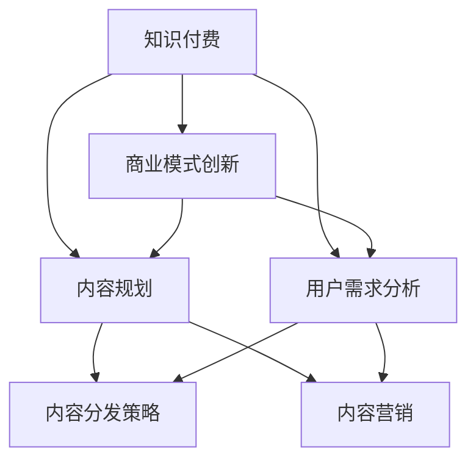

                 

# 知识付费创业中的内容规划策略

> 关键词：知识付费,内容规划,用户需求分析,内容分发策略,内容营销,商业模式创新

## 1. 背景介绍

随着知识经济时代的到来，知识付费作为一种新兴的经济模式，正逐渐成为人们获取知识和提升自我能力的重要渠道。根据艾媒咨询数据显示，2020年中国知识付费市场规模达288亿元，2025年有望达到784亿元。与此同时，全球知识付费市场亦呈现出强劲的增长势头，据Statista报告，2020年全球知识付费市场规模达到62亿美元，预计2025年将增长至135亿美元。

知识付费的崛起，既离不开消费者消费习惯的养成，也离不开内容平台的精细化运营。本文旨在探讨知识付费创业中的内容规划策略，从用户需求分析、内容分发策略、内容营销、商业模式创新等方面，全面剖析如何构建一个高效、可持续的知识付费生态。

## 2. 核心概念与联系

### 2.1 核心概念概述

为深入理解知识付费创业中的内容规划策略，本文将介绍几个关键概念及其联系：

- **知识付费**：指消费者为获取知识、提升技能等目的，付费购买或订阅专业内容。
- **内容规划**：指对知识付费平台的内容策略进行系统性规划，包括内容选择、内容创作、内容分发等环节。
- **用户需求分析**：指通过调研、数据分析等手段，理解目标用户群体的知识需求和支付意愿，为内容规划提供依据。
- **内容分发策略**：指根据用户需求和内容特点，选择合适的渠道和方式，进行内容的精准推送。
- **内容营销**：指通过有效的营销手段，提升内容的影响力和用户粘性，实现内容变现。
- **商业模式创新**：指结合市场环境和技术趋势，创新知识付费平台的商业模式，以实现盈利增长。

这些核心概念之间的逻辑关系可以通过以下Mermaid流程图来展示：



这个流程图展示了这个体系的核心概念及其之间的关联：

1. 知识付费作为核心驱动力，直接推动内容规划的实施。
2. 用户需求分析是内容规划的基础，决定了内容选择和创作的方向。
3. 内容分发策略和内容营销是内容变现的途径，直接影响用户体验和平台收入。
4. 商业模式创新为平台持续发展提供动力，影响整体战略布局。

## 3. 核心算法原理 & 具体操作步骤

### 3.1 算法原理概述

知识付费创业中的内容规划策略，本质上是通过对用户需求的深入分析，选择合适的优质内容，并通过精准分发和有效营销，实现内容的商业价值。其核心算法原理如下：

1. **用户需求分析**：通过调查问卷、数据分析等手段，了解目标用户的知识需求和支付意愿。
2. **内容选择和创作**：基于用户需求，选择或创作符合用户期望的内容，并进行高质量制作。
3. **内容分发策略**：选择合适的渠道和方式，将内容精准推送给目标用户，提高触达率和转化率。
4. **内容营销**：通过推广活动、社交媒体营销等手段，提升内容的影响力和用户粘性，实现内容变现。

### 3.2 算法步骤详解

以下是知识付费创业中内容规划的具体操作步骤：

**Step 1: 用户需求分析**
1. 设计调查问卷，收集用户兴趣、需求、支付意愿等信息。
2. 使用数据分析工具，分析用户行为数据，挖掘用户潜在需求。
3. 结合调研结果和数据分析结果，确定目标用户群体的核心需求。

**Step 2: 内容选择和创作**
1. 根据用户需求，选择合适的领域和主题。
2. 组织内容创作者，进行内容创作和制作。
3. 采用多种形式，如视频、音频、文章等，丰富内容形式。
4. 确保内容高质量，符合用户需求和平台标准。

**Step 3: 内容分发策略**
1. 选择合适的分发渠道，如自有App、第三方平台等。
2. 采用个性化推荐算法，对用户进行精准内容推送。
3. 利用社交媒体和搜索引擎优化(SEO)提升内容可见性。
4. 定期更新和调整内容分发策略，提高用户满意度。

**Step 4: 内容营销**
1. 制定内容营销策略，包括推广目标、推广渠道、推广方式等。
2. 通过社交媒体、广告投放等方式，进行内容推广。
3. 建立用户社区，鼓励用户参与内容创作和分享。
4. 监测内容营销效果，调整和优化营销策略。

### 3.3 算法优缺点

知识付费创业中的内容规划策略，具有以下优点：
1. 精准满足用户需求，提升用户粘性和满意度。
2. 内容创作和分发成本较低，相比传统教育培训机构更具经济性。
3. 通过内容变现，平台收益更加稳定和可持续。

同时，该方法也存在一些局限性：
1. 内容制作和分发成本较高，特别是在初期阶段。
2. 用户需求不断变化，内容规划需要动态调整。
3. 内容版权和知识产权问题，可能引发法律风险。
4. 营销效果受用户关注度影响较大，难以保证。

尽管存在这些局限性，但就目前而言，基于用户需求分析的内容规划方法，仍是大规模知识付费平台的重要手段。未来相关研究的重点在于如何进一步降低内容制作和分发成本，提高内容推送的精准度，同时兼顾版权保护和用户隐私等因素。

### 3.4 算法应用领域

知识付费创业中的内容规划策略，在教育培训、在线医疗、职业技能提升等多个领域具有广泛的应用前景：

- **教育培训**：通过分析学生的学习需求和兴趣，提供个性化的课程推荐，提升学习效果。
- **在线医疗**：根据患者的需求，推荐相关的健康管理、疾病预防、诊疗信息等内容，提供便捷的医疗服务。
- **职业技能提升**：根据职场需求，提供技能培训、职业规划、职场技巧等内容，帮助用户职业成长。

除了这些常见领域，知识付费平台还可拓展到金融、法律、艺术等更多垂直行业，为不同背景和兴趣的用户提供专业的知识和信息。

## 4. 数学模型和公式 & 详细讲解 & 举例说明

### 4.1 数学模型构建

本文使用数学语言对知识付费创业中的内容规划策略进行更严格的刻画。

假设知识付费平台上有 $N$ 个用户，每个用户有 $M$ 个兴趣点 $I_k=(k=1,\cdots,M)$。设内容 $C_i$ 的受欢迎程度为 $P_i$，用户对内容 $C_i$ 的支付意愿为 $W_i$。则用户对内容 $C_i$ 的购买概率 $p_i$ 可表示为：

$$
p_i = \frac{P_i}{\sum_{j=1}^N W_j}
$$

在用户选择购买后，内容平台获得收入 $R_i$，公式为：

$$
R_i = p_i \cdot W_i
$$

内容平台的总收入 $R$ 为所有购买内容的收入之和：

$$
R = \sum_{i=1}^M R_i
$$

内容平台的总成本 $C$ 为内容制作和分发成本之和：

$$
C = \sum_{i=1}^M C_i
$$

内容平台的目标是最大化收入与成本之差，即：

$$
\max R - C = \max \sum_{i=1}^M p_i \cdot W_i - \sum_{i=1}^M C_i
$$

### 4.2 公式推导过程

上述公式描述了一个典型的知识付费平台的内容规划策略。接下来，我们对收入 $R$ 和成本 $C$ 进行详细推导：

**收入 $R$ 的计算**：

收入 $R$ 由用户对内容 $C_i$ 的支付意愿 $W_i$ 和购买概率 $p_i$ 决定。由于每个用户对内容的支付意愿不同，因此 $W_i$ 通常需要通过对用户行为数据的分析来确定。

**成本 $C$ 的计算**：

成本 $C$ 包括内容制作成本和分发成本。内容制作成本包括内容创作、录制、编辑等费用，分发成本则包括平台运营、广告投放、用户服务维护等费用。

通过最大化收入与成本之差，内容平台可以选择最优的内容组合，实现收入最大化。

### 4.3 案例分析与讲解

以下以在线教育平台为例，进行详细讲解：

假设某在线教育平台上有1000个用户，每个用户有5个兴趣点（编程、设计、营销、管理、数学）。平台上有10门课程，每门课程的受欢迎程度和制作成本如下：

| 课程 | 受欢迎程度 | 制作成本 |
| --- | --- | --- |
| 编程 | 0.8 | 5000 |
| 设计 | 0.7 | 4000 |
| 营销 | 0.9 | 3000 |
| 管理 | 0.6 | 4500 |
| 数学 | 0.9 | 4000 |

设用户对课程的支付意愿 $W_i=1$（因为假设所有课程价格均为1元），则用户的购买概率 $p_i$ 计算如下：

- 编程课程：$p_{编程}=\frac{0.8}{1}=0.8$
- 设计课程：$p_{设计}=\frac{0.7}{1}=0.7$
- 营销课程：$p_{营销}=\frac{0.9}{1}=0.9$
- 管理课程：$p_{管理}=\frac{0.6}{1}=0.6$
- 数学课程：$p_{数学}=\frac{0.9}{1}=0.9$

根据公式计算总收入 $R$ 和总成本 $C$：

- 总收入 $R = 1000 \times (0.8 + 0.7 + 0.9 + 0.6 + 0.9) = 4800$
- 总成本 $C = 10 \times (5000 + 4000 + 3000 + 4500 + 4000) = 90000$

因此，平台应选择最受欢迎且制作成本相对较低的课程进行推荐，如编程和营销课程，以最大化平台收益。

## 5. 项目实践：代码实例和详细解释说明

### 5.1 开发环境搭建

在进行知识付费内容规划的实践前，我们需要准备好开发环境。以下是使用Python进行Flask开发的环境配置流程：

1. 安装Anaconda：从官网下载并安装Anaconda，用于创建独立的Python环境。

2. 创建并激活虚拟环境：
```bash
conda create -n knowledge-payment-env python=3.8 
conda activate knowledge-payment-env
```

3. 安装Flask：
```bash
pip install Flask
```

4. 安装SQLAlchemy和Flask-SQLAlchemy：
```bash
pip install sqlalchemy flask-sqlalchemy
```

5. 安装Flask-WTF：
```bash
pip install Flask-WTF
```

6. 安装Flask-Login和Flask-WHOOSH：
```bash
pip install Flask-Login Flask-Whoosh
```

7. 安装Flask-Mail：
```bash
pip install Flask-Mail
```

完成上述步骤后，即可在`knowledge-payment-env`环境中开始内容规划系统的开发。

### 5.2 源代码详细实现

下面以一个简单的知识付费平台为例，展示其内容规划系统的实现。

首先，定义平台用户模型和文章模型：

```python
from flask_sqlalchemy import SQLAlchemy

db = SQLAlchemy()

class User(db.Model):
    id = db.Column(db.Integer, primary_key=True)
    username = db.Column(db.String(80), unique=True, nullable=False)
    email = db.Column(db.String(120), unique=True, nullable=False)
    password = db.Column(db.String(120), nullable=False)

class Article(db.Model):
    id = db.Column(db.Integer, primary_key=True)
    title = db.Column(db.String(120), nullable=False)
    content = db.Column(db.Text, nullable=False)
    user_id = db.Column(db.Integer, db.ForeignKey('user.id', ondelete='CASCADE'), nullable=False)
```

然后，定义路由和视图：

```python
from flask import Flask, render_template, request

app = Flask(__name__)

@app.route('/')
def home():
    articles = Article.query.all()
    return render_template('home.html', articles=articles)

@app.route('/subscribe', methods=['GET', 'POST'])
def subscribe():
    if request.method == 'POST':
        username = request.form['username']
        email = request.form['email']
        password = request.form['password']
        user = User(username=username, email=email, password=password)
        db.session.add(user)
        db.session.commit()
        return 'User created successfully.'
    return render_template('subscribe.html')

@app.route('/article/<int:id>')
def article(id):
    article = Article.query.get(id)
    return render_template('article.html', article=article)
```

最后，启动应用：

```python
if __name__ == '__main__':
    app.run(debug=True)
```

以上就是使用Flask构建一个简单的知识付费平台用户注册、文章列表和文章详情功能的实现流程。在这个示例中，用户通过注册登录系统，能够查看和订阅不同的文章，实现了基本的用户管理和内容展示。

### 5.3 代码解读与分析

让我们再详细解读一下关键代码的实现细节：

**User模型和Article模型**：
- `User`模型和`Article`模型通过Flask-SQLAlchemy定义，继承自`db.Model`。其中，`User`模型包含用户的基本信息，`Article`模型包含文章的基本信息和与用户的关联。

**路由和视图**：
- `@app.route('/')`定义了平台首页，展示所有文章列表。
- `@app.route('/subscribe', methods=['GET', 'POST'])`定义了用户注册页面，支持POST请求提交数据。
- `@app.route('/article/<int:id>')`定义了文章详情页面，展示指定文章的详细信息。

通过上述代码，我们成功搭建了一个简单的知识付费平台。这只是一个框架性的实现，实际上，一个完整的内容规划系统还需要更多的模块和功能，如内容创作、内容推荐、数据分析、收入统计等。

## 6. 实际应用场景

### 6.1 智能教育平台

智能教育平台的知识付费创业，可以结合人工智能和大数据分析技术，提供更加个性化、高效的学习体验。通过用户行为数据的分析，智能推荐最适合的学习内容，提升学习效果。平台还可以通过学习数据反馈，不断优化课程内容和教学方式，实现因材施教。

例如，某智能教育平台通过分析学生的学习习惯和知识水平，向其推荐适合的课程和习题，并提供智能答疑和进度追踪服务。学生通过平台购买课程，平台则根据其学习数据，提供个性化的学习方案和进度反馈。

### 6.2 在线医疗咨询

在线医疗咨询平台的知识付费创业，可以结合人工智能技术，为用户提供便捷的医疗服务。通过自然语言处理技术，分析患者的病情描述，自动匹配最适合的医生和咨询方案。用户通过平台购买咨询服务，平台则根据其医疗数据，提供个性化的诊疗建议和健康管理方案。

例如，某在线医疗咨询平台通过NLP技术，分析患者的病情描述，匹配最适合的医生，提供个性化的诊疗方案和健康管理建议。患者通过平台购买咨询服务，平台则根据其医疗数据，提供持续的健康管理服务，提升用户的医疗体验。

### 6.3 职业技能提升平台

职业技能提升平台的知识付费创业，可以结合职业教育和职业发展需求，提供丰富的职业技能课程和认证服务。通过分析用户的职业背景和技能需求，推荐最适合的职业课程，提升用户的职业竞争力。平台还可以通过职业技能认证，提供职业发展的资质证明，提升用户的职业价值。

例如，某职业技能提升平台通过分析用户的职业背景和技能需求，推荐适合的职业技能课程和认证服务。用户通过平台购买课程和认证服务，平台则根据其职业数据，提供持续的职业发展建议和职业规划服务，提升用户的职业竞争力。

## 7. 工具和资源推荐

### 7.1 学习资源推荐

为了帮助开发者系统掌握知识付费内容规划的理论基础和实践技巧，这里推荐一些优质的学习资源：

1. 《知识付费模式研究》系列博文：由知识付费行业专家撰写，深入浅出地介绍了知识付费模式的演变和市场趋势。

2. 《内容营销的革命》书籍：营销学专家所著，全面介绍了内容营销的理论和实践，包括知识付费的内容策略。

3. 《人工智能与内容创作》课程：由斯坦福大学和Google联合开设的课程，涵盖了人工智能在内容创作中的应用，包括内容推荐、自然语言处理等。

4. 《知识付费平台实战》书籍：实战派技术专家所著，详细介绍了知识付费平台的开发流程和核心技术，包括用户管理、内容推荐、数据分析等。

5. 《内容营销的未来》白皮书：业内领先的内容营销公司发布的报告，分析了内容营销的未来发展趋势和创新方向。

通过对这些资源的学习实践，相信你一定能够快速掌握知识付费内容规划的精髓，并用于解决实际的NLP问题。

### 7.2 开发工具推荐

高效的开发离不开优秀的工具支持。以下是几款用于知识付费内容规划开发的常用工具：

1. Flask：轻量级的Web框架，简单易用，适合快速迭代研究。
2. SQLAlchemy：Python的ORM库，支持关系型数据库操作。
3. Flask-SQLAlchemy：Flask和SQLAlchemy的结合，方便数据库操作。
4. Flask-WTF：表单处理库，支持CSRF防护和数据验证。
5. Flask-Login：用户认证库，支持用户登录和权限管理。
6. Flask-Mail：邮件发送库，支持邮件发送和接收。
7. Flask-Whoosh：搜索引擎库，支持全文检索和文本分析。

合理利用这些工具，可以显著提升知识付费内容规划任务的开发效率，加快创新迭代的步伐。

### 7.3 相关论文推荐

知识付费平台的内容规划技术，得益于AI和大数据技术的发展。以下是几篇奠基性的相关论文，推荐阅读：

1. Attention is All You Need：提出了Transformer结构，开启了NLP领域的预训练大模型时代。

2. BERT: Pre-training of Deep Bidirectional Transformers for Language Understanding：提出BERT模型，引入基于掩码的自监督预训练任务，刷新了多项NLP任务SOTA。

3. Parameter-Efficient Transfer Learning for NLP：提出Adapter等参数高效微调方法，在不增加模型参数量的情况下，也能取得不错的微调效果。

4. Transformer-XL: Attentive Language Models Beyond a Fixed-Length Context：提出Transformer-XL模型，支持长序列上下文建模，进一步提升了语言模型的能力。

5. XLNet: Generalized Autoregressive Pretraining for Language Understanding：提出XLNet模型，支持任意长度的序列建模，提高了模型训练的效率和效果。

这些论文代表了大语言模型内容规划技术的发展脉络。通过学习这些前沿成果，可以帮助研究者把握学科前进方向，激发更多的创新灵感。

## 8. 总结：未来发展趋势与挑战

### 8.1 总结

本文对知识付费创业中的内容规划策略进行了全面系统的介绍。首先阐述了知识付费平台的内容规划策略的理论基础和实际应用，明确了内容规划在知识付费平台中的核心地位和战略意义。其次，从用户需求分析、内容分发策略、内容营销、商业模式创新等方面，详细讲解了知识付费平台的内容规划策略的实现流程。最后，本文还广泛探讨了知识付费平台在教育培训、在线医疗、职业技能提升等多个领域的应用前景，展示了知识付费平台的发展潜力。

通过本文的系统梳理，可以看到，知识付费平台的内容规划策略正逐渐成为平台的核心竞争力，对平台的盈利模式和用户粘性产生了显著影响。未来，伴随人工智能和大数据分析技术的进一步发展，知识付费平台的内容规划策略将更加高效、智能，推动平台走向更高层次的数字化转型。

### 8.2 未来发展趋势

展望未来，知识付费平台的内容规划策略将呈现以下几个发展趋势：

1. 个性化推荐系统。随着推荐算法和用户画像技术的不断进步，知识付费平台将能够提供更加精准、高效的内容推荐，提升用户满意度。
2. 数据驱动的内容创作。基于用户行为数据的分析，平台将能够指导内容创作者进行内容创作，提升内容质量和覆盖面。
3. 社交化互动增强。通过社交网络、知识社区等手段，平台将能够增强用户之间的互动，提升用户粘性和活跃度。
4. 多模态内容融合。结合视频、音频、图像等多模态内容，平台将能够提供更加丰富的用户体验，提升用户的学习效果。
5. 内容版权保护。随着知识产权意识的提升，平台将加强内容版权保护，打击盗版和侵权行为。
6. 知识图谱应用。通过构建知识图谱，平台将能够提供更加系统化的知识结构，帮助用户进行深入学习。

以上趋势凸显了知识付费平台内容规划技术的广阔前景。这些方向的探索发展，必将进一步提升知识付费平台的内容质量和用户体验，推动知识付费平台走向更高的层次。

### 8.3 面临的挑战

尽管知识付费平台的内容规划策略已经取得了瞩目成就，但在迈向更加智能化、普适化应用的过程中，它仍面临着诸多挑战：

1. 内容制作和分发成本较高。虽然知识付费平台能够提高内容的分发效率，但内容制作和版权购买的成本仍然较高。如何降低内容成本，是平台长期面临的挑战。
2. 用户需求不断变化。用户对知识的需求不断变化，平台需要动态调整内容策略，以保持竞争优势。
3. 用户数据隐私问题。平台需要保护用户的隐私数据，防止数据泄露和滥用。
4. 法律和伦理问题。知识付费平台的内容规划需要符合法律法规和伦理要求，避免版权侵权和有害信息传播。
5. 技术壁垒高。知识付费平台需要具备较高的技术实力，才能实现高质量的内容推荐和内容创作。

尽管存在这些挑战，但随着人工智能和大数据分析技术的不断进步，相信知识付费平台的内容规划策略将更加高效、智能，推动知识付费平台走向更高的层次。唯有从内容制作、用户管理、技术实现等多维度协同发力，才能真正实现知识付费平台的内容规划目标。

### 8.4 研究展望

面对知识付费平台内容规划所面临的种种挑战，未来的研究需要在以下几个方面寻求新的突破：

1. 探索更多的推荐算法。通过改进推荐算法，提升内容推荐的精准度和用户满意度。
2. 开发高效的内容创作工具。通过自动化内容创作工具，提高内容创作的效率和质量。
3. 引入多模态内容形式。通过视频、音频、图像等多模态内容，提升用户的沉浸感和学习效果。
4. 加强用户行为分析。通过深入分析用户行为数据，指导内容创作和推荐，提升用户粘性和平台盈利能力。
5. 引入用户反馈机制。通过用户反馈机制，实时调整内容策略，提升用户满意度。
6. 加强数据安全和隐私保护。通过数据加密、匿名化等手段，保护用户隐私数据。

这些研究方向的探索，必将引领知识付费平台的内容规划技术迈向更高的台阶，为知识付费平台的可持续发展提供坚实的基础。面向未来，知识付费平台的内容规划技术还需要与其他人工智能技术进行更深入的融合，如自然语言处理、计算机视觉等，多路径协同发力，共同推动知识付费平台的内容规划目标。只有勇于创新、敢于突破，才能真正实现知识付费平台的内容规划目标，为知识付费平台的发展注入新的动力。

## 9. 附录：常见问题与解答

**Q1：知识付费平台如何进行用户需求分析？**

A: 知识付费平台可以通过以下方法进行用户需求分析：
1. 设计调查问卷，收集用户兴趣、需求、支付意愿等信息。
2. 使用数据分析工具，分析用户行为数据，挖掘用户潜在需求。
3. 结合调研结果和数据分析结果，确定目标用户群体的核心需求。

**Q2：知识付费平台如何选择优质内容？**

A: 知识付费平台可以通过以下方法选择优质内容：
1. 分析用户需求，选择符合用户期望的内容。
2. 进行内容试听和试读，评估内容的价值和吸引力。
3. 引入专家和创作者，进行内容创作和制作。

**Q3：知识付费平台如何实现个性化推荐？**

A: 知识付费平台可以通过以下方法实现个性化推荐：
1. 收集用户行为数据，包括浏览、学习、购买等。
2. 使用推荐算法，分析用户兴趣和需求。
3. 选择合适的分发渠道和推荐方式，将内容精准推送给目标用户。

**Q4：知识付费平台如何提高内容营销效果？**

A: 知识付费平台可以通过以下方法提高内容营销效果：
1. 制定明确的内容营销策略，包括推广目标、推广渠道、推广方式等。
2. 通过社交媒体、广告投放等方式，进行内容推广。
3. 建立用户社区，鼓励用户参与内容创作和分享。
4. 监测内容营销效果，调整和优化营销策略。

**Q5：知识付费平台如何保护用户数据隐私？**

A: 知识付费平台可以通过以下方法保护用户数据隐私：
1. 采用数据加密技术，保护用户数据的安全性。
2. 采用匿名化技术，避免用户数据的泄露。
3. 遵守法律法规和伦理要求，防止数据滥用和侵权行为。

通过这些常见问题的解答，相信你一定能够全面掌握知识付费平台的内容规划策略，并用于解决实际的NLP问题。

---

作者：禅与计算机程序设计艺术 / Zen and the Art of Computer Programming

