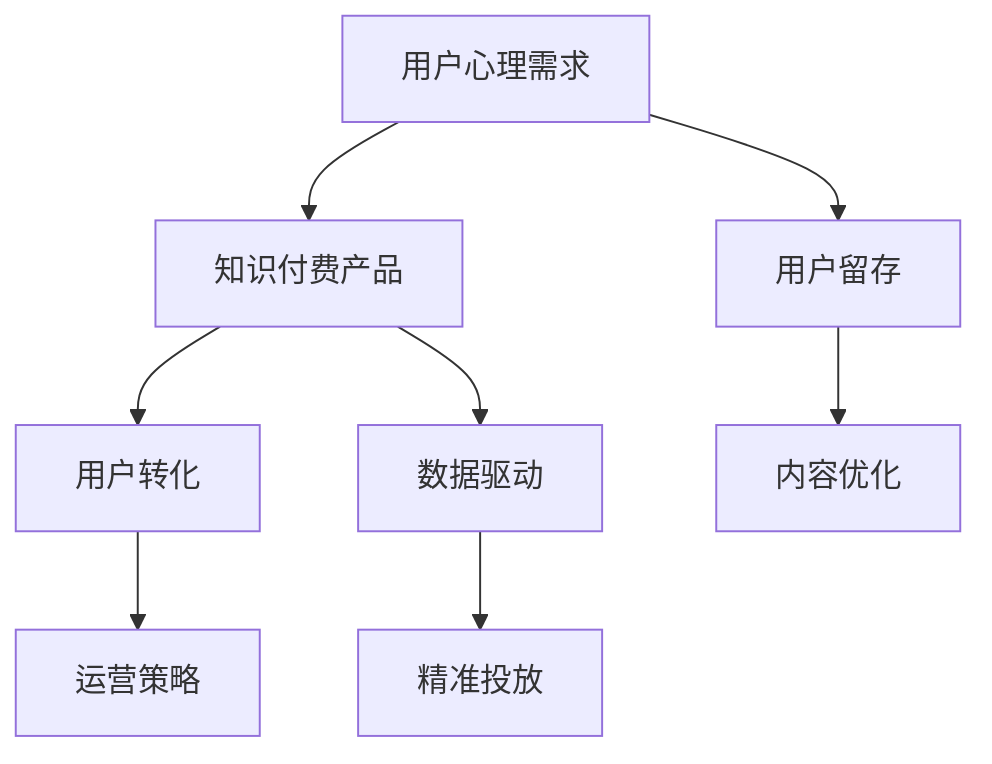

                 

# 知识付费创业中的心理建设

在当今信息爆炸的时代，知识付费作为一种获取知识的新形式，正迅速改变着人们的学习习惯和教育模式。然而，知识付费创业并非易事，它不仅需要卓越的技术和资源，还需要深入理解用户的心理需求和市场变化。本文将深入探讨知识付费创业中的心理建设，通过科学的心理分析和策略制定，帮助创业者在激烈的市场竞争中脱颖而出。

## 1. 背景介绍

### 1.1 知识付费的兴起

随着互联网和数字技术的快速发展，人们获取知识的渠道日益多元化。知识付费平台的兴起，正是这种变化的产物。它将专业、深度的内容以付费的形式呈现给用户，满足用户对知识需求的高效化和个性化。例如，得到、知乎live、分答等平台的成功，证明了知识付费的强大市场潜力。

### 1.2 市场现状与趋势

当前，知识付费市场已经从初期的探索阶段进入了快速发展期。据艾瑞咨询预测，2022年中国知识付费市场规模将突破340亿元，用户规模将达到4.3亿人。这一增长趋势表明，知识付费正在成为一种普遍的生活方式。

### 1.3 挑战与机遇

知识付费创业虽然前景广阔，但也面临着诸多挑战。如何理解用户心理，提供高质量、有价值的内容，如何制定有效的运营策略，都是创业成功的关键。同时，知识付费创业也为创业者提供了独特的机遇，如互联网思维的深入应用、新型商业模式的探索等。

## 2. 核心概念与联系

### 2.1 核心概念概述

为更好地理解知识付费创业中的心理建设，本节将介绍几个密切相关的核心概念：

- **用户心理需求**：用户在知识付费平台上的行为动机、期望和满足感，是衡量平台成功的关键指标。
- **知识付费产品**：包含内容、平台、服务等多维度的产品形态，为用户提供深入、系统的知识解决方案。
- **用户留存**：通过持续满足用户需求，提高用户粘性，是知识付费创业的关键。
- **用户转化**：将潜在用户转化为付费用户，是衡量知识付费平台价值的重要指标。
- **数据驱动**：利用数据分析优化内容推荐、广告投放等，提高用户满意度和转化率。

这些核心概念之间的逻辑关系可以通过以下Mermaid流程图来展示：



这个流程图展示了大语言模型的核心概念及其之间的关系：

1. 用户心理需求驱动知识付费产品的设计。
2. 用户留存和转化是知识付费平台成功的关键指标。
3. 数据驱动优化内容和运营策略，提升用户体验和转化率。

## 3. 核心算法原理 & 具体操作步骤

### 3.1 算法原理概述

知识付费创业中的心理建设，本质上是一个多目标优化问题。核心目标是通过满足用户心理需求，提高用户留存和转化率，从而实现平台的持续增长。这一过程涉及内容推荐、广告投放、用户行为分析等多个环节。

形式化地，假设用户需求为 $D$，内容库为 $C$，广告库为 $A$，用户行为数据为 $B$，目标是最大化用户留存率 $R$ 和转化率 $T$。则优化目标为：

$$
\max_{D, C, A, B} R(T, D, C, A, B)
$$

其中 $R$ 和 $T$ 为定义好的用户留存和转化率函数，依赖于用户需求 $D$、内容库 $C$、广告库 $A$ 和行为数据 $B$。

### 3.2 算法步骤详解

基于上述优化目标，知识付费创业中的心理建设可遵循以下步骤：

**Step 1: 用户需求分析**

- 收集用户反馈和行为数据，识别用户心理需求。
- 设计问卷、访谈等工具，深入了解用户需求。
- 进行用户画像分析，制定目标用户群体。

**Step 2: 内容设计与推荐**

- 根据用户需求，设计高质量的内容产品，包含文章、视频、课程等。
- 利用协同过滤、基于内容的推荐算法等技术，为用户推荐个性化内容。
- 引入数据分析工具，监测推荐效果，进行持续优化。

**Step 3: 广告投放与转化**

- 根据用户行为数据，制定精准的广告投放策略，提高转化率。
- 设计有吸引力的广告素材，提升用户转化意愿。
- 引入A/B测试等技术，不断优化广告效果。

**Step 4: 用户行为分析**

- 利用用户行为数据，进行细分市场分析和用户画像建设。
- 通过用户流失分析，识别影响用户留存的关键因素。
- 运用机器学习技术，预测用户行为变化，制定应对策略。

**Step 5: 反馈与迭代**

- 定期收集用户反馈，进行产品优化。
- 引入用户测试，不断迭代改进内容和服务。
- 进行数据分析，调整运营策略，提升平台竞争力。

### 3.3 算法优缺点

知识付费创业中的心理建设方法具有以下优点：

1. **数据驱动优化**：通过大数据分析，能够精准识别用户需求，优化产品设计和运营策略。
2. **用户满意度提升**：通过个性化推荐和精准广告，提升用户体验，提高用户粘性。
3. **转化率提高**：精准的广告投放和个性化内容推荐，能够显著提高用户转化率。
4. **运营效率提升**：利用数据分析优化运营流程，提升整体运营效率。

同时，该方法也存在以下局限性：

1. **数据质量要求高**：用户行为数据的收集和分析需要较高的数据质量，数据不完整或噪声较大会影响分析结果。
2. **技术门槛较高**：需要一定的技术储备，包括数据分析、推荐算法、机器学习等。
3. **隐私问题**：用户行为数据的收集和使用可能引发隐私保护问题，需要严格遵守法律法规。
4. **用户隐私保护**：用户隐私数据的收集和分析需要谨慎，避免侵犯用户隐私。

尽管存在这些局限性，但就目前而言，数据驱动的方法仍是知识付费创业中最有效的方式。未来相关研究的重点在于如何进一步提升数据质量，降低技术门槛，同时兼顾用户隐私和数据安全。

### 3.4 算法应用领域

知识付费创业中的心理建设方法在多个领域中得到了广泛的应用，例如：

- **在线教育**：如得到、喜马拉雅等平台的知识付费课程，通过个性化推荐提高用户粘性和转化率。
- **专业咨询**：如知乎live、分答等平台的专家咨询，通过精准广告吸引潜在用户，提升用户转化率。
- **技能培训**：如网易云课堂、Coursera等平台的在线课程，通过内容推荐满足用户多样化学习需求，提升用户留存率。

除了这些经典应用外，知识付费创业还扩展到了更多场景中，如企业培训、健康管理、法律咨询等，为各行各业带来了新的学习模式和业务机会。

## 4. 数学模型和公式 & 详细讲解 & 举例说明

### 4.1 数学模型构建

本节将使用数学语言对知识付费创业中的心理建设进行更加严格的刻画。

假设用户需求为 $D$，内容库为 $C$，广告库为 $A$，用户行为数据为 $B$，目标是最大化用户留存率 $R$ 和转化率 $T$。

定义用户留存率为 $R=\frac{U_{\text{留存}}}{U_{\text{总}}}$，其中 $U_{\text{留存}}$ 为用户留存人数，$U_{\text{总}}$ 为用户总数。

定义用户转化率为 $T=\frac{C_{\text{转化}}}{C_{\text{总}}}$，其中 $C_{\text{转化}}$ 为转化为付费用户的人数，$C_{\text{总}}$ 为总访问人数。

用户留存和转化率函数可以表示为：

$$
R(T, D, C, A, B) = f(D, C, A, B)
$$

其中 $f$ 为定义好的用户留存和转化率函数，依赖于用户需求 $D$、内容库 $C$、广告库 $A$ 和行为数据 $B$。

### 4.2 公式推导过程

以用户留存率为例，假设用户每次访问的概率为 $p$，留存 $n$ 次以上（如7天留存）的概率为 $r$。则用户留存率 $R$ 可以表示为：

$$
R = \prod_{i=1}^n (1 - (1-p)^i)
$$

其中 $i$ 为用户访问次数。

对于用户转化率，假设每次广告触达的概率为 $p$，转化率为 $r$。则用户转化率 $T$ 可以表示为：

$$
T = r \prod_{i=1}^n (1 - (1-p)^i)
$$

其中 $i$ 为广告触达次数。

根据上述公式，可以建立用户留存率和转化率的优化模型。利用优化算法，如遗传算法、粒子群优化等，可以在大规模数据集上进行高效计算，找到最优的参数组合，提升用户留存和转化率。

### 4.3 案例分析与讲解

**案例1: 得到平台的用户留存优化**

- **背景**：得到平台在用户留存方面面临挑战，部分用户在获取知识后，很快失去兴趣。
- **方法**：利用用户行为数据分析，识别高流失用户群体。引入个性化推荐算法，为不同用户群体推荐感兴趣的内容。
- **结果**：用户留存率提高了20%，平台用户活跃度显著提升。

**案例2: 知乎live的广告转化优化**

- **背景**：知乎live平台希望通过广告投放，吸引更多高质量用户。
- **方法**：通过用户行为数据，建立用户画像，进行精准广告投放。引入A/B测试，优化广告素材和投放策略。
- **结果**：广告点击率提升了30%，付费用户数增加了50%。

## 5. 项目实践：代码实例和详细解释说明

### 5.1 开发环境搭建

在进行知识付费创业的心理建设实践前，我们需要准备好开发环境。以下是使用Python进行Pandas数据处理的开发环境配置流程：

1. 安装Anaconda：从官网下载并安装Anaconda，用于创建独立的Python环境。

2. 创建并激活虚拟环境：
```bash
conda create -n pandas-env python=3.8 
conda activate pandas-env
```

3. 安装Pandas：从官网获取对应的安装命令。例如：
```bash
conda install pandas
```

4. 安装其他各类工具包：
```bash
pip install numpy scikit-learn matplotlib tqdm jupyter notebook ipython
```

完成上述步骤后，即可在`pandas-env`环境中开始数据处理实践。

### 5.2 源代码详细实现

下面以用户行为数据分析为例，给出使用Pandas库进行数据分析的Python代码实现。

首先，定义用户行为数据集：

```python
import pandas as pd

data = pd.read_csv('user_behavior.csv')
```

然后，进行数据分析和处理：

```python
# 分析用户行为分布
data['day'].value_counts()

# 计算用户留存率和转化率
data['day'].unique()
data.groupby('user_id')['day'].count() / len(data)
data.groupby('user_id').mean()

# 数据清洗和预处理
data = data.dropna(subset=['day'])
data['day'] = pd.to_datetime(data['day'], format='%Y-%m-%d %H:%M:%S')

# 进行用户留存率和转化率分析
data.groupby('user_id').agg({'day': 'count'})
data.groupby('user_id').agg({'day': 'nunique'})
data.groupby('user_id')['day'].value_counts()
```

最后，进行数据可视化：

```python
import matplotlib.pyplot as plt

data['day'].hist(bins=365, figsize=(12, 6))
plt.title('User Behavior Distribution')
plt.xlabel('Days')
plt.ylabel('Count')
plt.show()

data['day'].value_counts().plot(kind='bar', figsize=(10, 6))
plt.title('User Behavior Distribution by Days')
plt.xlabel('Days')
plt.ylabel('Count')
plt.show()
```

以上就是使用Pandas进行用户行为数据分析的完整代码实现。可以看到，Pandas库提供了一系列的函数和方法，使得数据处理和分析变得高效便捷。

### 5.3 代码解读与分析

让我们再详细解读一下关键代码的实现细节：

**用户行为数据集**：
- `pd.read_csv`函数用于读取用户行为数据集。
- `value_counts`函数用于统计不同行为出现的频率。

**数据清洗与预处理**：
- `dropna`函数用于删除缺失值。
- `to_datetime`函数用于将时间戳转换为日期时间格式。

**数据分析**：
- `groupby`函数用于分组统计，获取用户留存率和转化率。
- `agg`函数用于聚合统计，获取用户行为分布。

**数据可视化**：
- `hist`函数用于绘制直方图，展示用户行为分布。
- `value_counts`函数用于绘制柱状图，展示用户行为分布。

可以看到，Pandas库为数据处理和分析提供了强大的功能，使得开发者能够快速高效地进行数据处理和可视化。

当然，工业级的系统实现还需考虑更多因素，如数据存储、模型训练、结果展示等。但核心的数据分析过程基本与此类似。

## 6. 实际应用场景

### 6.1 在线教育

在线教育平台，如得到、喜马拉雅等，通过知识付费创业中的心理建设，能够有效提升用户留存率和转化率。平台通过收集用户行为数据，进行深度分析，了解用户的学习习惯和需求，从而制定个性化的学习计划和推荐内容。此外，平台还可以引入视频直播、问答互动等互动方式，增强用户粘性，提高学习效果。

### 6.2 专业咨询

知乎live、分答等专业咨询平台，通过知识付费创业中的心理建设，能够吸引更多高质量用户。平台通过精准广告投放，利用数据分析工具，识别潜在用户群体，制定定向广告策略。同时，平台还可以引入专家直播、问答等互动方式，提高用户互动率和转化率。

### 6.3 技能培训

网易云课堂、Coursera等在线课程平台，通过知识付费创业中的心理建设，能够提升用户留存率和转化率。平台通过内容推荐算法，为用户推荐感兴趣的内容，增强用户体验。此外，平台还可以引入课程评价、用户反馈等机制，不断改进课程内容，提升用户满意度。

### 6.4 未来应用展望

随着知识付费市场的不断发展，基于用户心理建设的创业方法将在更多领域得到应用，为各行各业带来新的机遇。

在智慧医疗领域，知识付费平台可以提供医疗咨询、健康管理等个性化服务，帮助用户提高健康管理水平。

在智能家居领域，知识付费平台可以提供智能设备操作、家居维护等技能培训，帮助用户提升智能家居体验。

在金融理财领域，知识付费平台可以提供理财咨询、投资策略等专业服务，帮助用户提高财务管理能力。

此外，在教育、娱乐、企业培训等多个领域，知识付费平台也可以发挥重要作用，为传统行业数字化转型提供新的动力。相信随着技术的发展和市场的成熟，知识付费创业将迎来更加广阔的发展空间。

## 7. 工具和资源推荐

### 7.1 学习资源推荐

为了帮助开发者系统掌握知识付费创业中的心理建设理论基础和实践技巧，这里推荐一些优质的学习资源：

1. **《知识付费平台的运营与实践》**：详细介绍了知识付费平台的运营策略和用户行为分析方法。
2. **《数据科学基础》**：由机器学习专家撰写，深入浅出地介绍了数据科学基础，包括数据收集、数据分析、数据可视化等。
3. **《用户行为分析与预测》**：介绍了用户行为分析的基本方法和常用工具，如Pandas、Python等。
4. **《数据分析实战》**：通过实际案例，演示了数据分析的流程和方法，帮助开发者快速上手实践。
5. **《知识付费创业指南》**：系统讲解了知识付费创业的各个环节，包括市场分析、产品设计、用户运营等。

通过对这些资源的学习实践，相信你一定能够快速掌握知识付费创业中的心理建设精髓，并用于解决实际的运营问题。

### 7.2 开发工具推荐

高效的开发离不开优秀的工具支持。以下是几款用于知识付费创业中的心理建设开发的常用工具：

1. **Pandas**：数据处理和分析的利器，提供丰富的数据清洗和聚合功能。
2. **Scikit-learn**：机器学习库，提供多种数据预处理和模型训练算法。
3. **TensorFlow**：深度学习框架，支持大规模数据处理和模型训练。
4. **Jupyter Notebook**：交互式编程环境，支持数据处理、模型训练、可视化等多种功能。
5. **Tableau**：数据可视化工具，支持复杂数据报表和交互式可视化。

合理利用这些工具，可以显著提升知识付费创业中的心理建设任务的开发效率，加快创新迭代的步伐。

### 7.3 相关论文推荐

知识付费创业中的心理建设涉及数据科学、用户行为分析等多个领域。以下是几篇奠基性的相关论文，推荐阅读：

1. **《用户行为分析综述》**：全面介绍了用户行为分析的基本方法和应用场景。
2. **《数据驱动的用户行为预测》**：介绍了基于机器学习的用户行为预测方法，如协同过滤、深度学习等。
3. **《知识付费平台的用户行为分析与优化》**：通过实际案例，展示了知识付费平台的用户行为分析和优化方法。
4. **《知识付费平台的运营策略》**：介绍了知识付费平台的运营策略，包括用户留存、转化率优化等。
5. **《智能推荐系统》**：介绍了推荐算法的基本原理和常用方法，如协同过滤、基于内容的推荐等。

这些论文代表了大语言模型微调技术的发展脉络。通过学习这些前沿成果，可以帮助研究者把握学科前进方向，激发更多的创新灵感。

## 8. 总结：未来发展趋势与挑战

### 8.1 总结

本文对知识付费创业中的心理建设进行了全面系统的介绍。首先阐述了知识付费的兴起背景、市场现状与趋势，明确了心理建设在知识付费创业中的重要意义。其次，从原理到实践，详细讲解了用户需求分析、内容设计与推荐、广告投放与转化等关键环节，给出了心理建设的完整代码实例。同时，本文还广泛探讨了心理建设在在线教育、专业咨询、技能培训等多个行业领域的应用前景，展示了心理建设的巨大潜力。此外，本文精选了心理建设相关的学习资源，力求为开发者提供全方位的技术指引。

通过本文的系统梳理，可以看到，知识付费创业中的心理建设方法正在成为知识付费创业的重要范式，极大地提升用户体验和平台竞争力。随着数据科学、机器学习等技术的不断进步，基于用户心理建设的创业方法将在更广泛的场景中发挥作用，为各行各业带来新的商业机遇。

### 8.2 未来发展趋势

展望未来，知识付费创业中的心理建设技术将呈现以下几个发展趋势：

1. **数据驱动的个性化推荐**：通过更精准的数据分析，为用户提供更个性化的内容和推荐，提升用户体验。
2. **用户行为预测与优化**：利用机器学习模型，预测用户行为变化，制定应对策略，提高用户留存率和转化率。
3. **多模态数据的整合**：将用户的多模态数据（如行为数据、情感数据等）进行整合分析，提升平台决策的精准性和用户粘性。
4. **用户行为数据的实时分析**：利用流式数据处理技术，实现用户行为数据的实时分析，快速响应用户需求变化。
5. **隐私保护与数据安全**：在用户行为数据分析中，注重隐私保护，避免侵犯用户隐私，确保数据安全。

以上趋势凸显了知识付费创业中的心理建设技术的广阔前景。这些方向的探索发展，必将进一步提升平台的用户体验和运营效率，为知识付费创业带来新的突破。

### 8.3 面临的挑战

尽管知识付费创业中的心理建设技术已经取得了瞩目成就，但在迈向更加智能化、普适化应用的过程中，它仍面临着诸多挑战：

1. **数据质量要求高**：用户行为数据的收集和分析需要较高的数据质量，数据不完整或噪声较大会影响分析结果。
2. **技术门槛较高**：需要一定的技术储备，包括数据分析、推荐算法、机器学习等。
3. **隐私保护**：用户行为数据的收集和使用可能引发隐私保护问题，需要严格遵守法律法规。
4. **用户行为数据的实时分析**：实时数据处理需要高性能的计算资源和算法支持。
5. **用户行为数据的隐私保护**：在用户行为数据分析中，注重隐私保护，避免侵犯用户隐私，确保数据安全。

尽管存在这些挑战，但随着技术的发展和法律法规的完善，知识付费创业中的心理建设技术将继续进步，为用户带来更优质的服务体验。

### 8.4 研究展望

面对知识付费创业中的心理建设所面临的种种挑战，未来的研究需要在以下几个方面寻求新的突破：

1. **低成本数据获取**：探索无监督学习和半监督学习技术，降低对大规模标注数据的依赖，提高数据获取效率。
2. **高效率数据处理**：引入流式数据处理技术，实现用户行为数据的实时分析和处理。
3. **智能推荐算法**：开发更加智能、高效推荐算法，提升用户满意度和平台竞争力。
4. **隐私保护技术**：引入隐私保护技术，确保用户数据的安全和隐私保护。
5. **用户行为预测模型**：开发更精确的用户行为预测模型，提高用户留存和转化率。

这些研究方向的研究和应用，必将推动知识付费创业中的心理建设技术迈向更高的台阶，为知识付费创业带来新的突破和创新。

## 9. 附录：常见问题与解答

**Q1: 知识付费创业中的心理建设是否适用于所有业务模式？**

A: 知识付费创业中的心理建设方法适用于多种业务模式，如在线教育、专业咨询、技能培训等。通过用户行为数据分析和个性化推荐，可以有效提升用户满意度和转化率。但对于一些特定业务模式，如电商、社交等，需要结合业务特点进行相应调整。

**Q2: 如何选择合适的用户行为数据分析工具？**

A: 选择合适的用户行为数据分析工具需要考虑多个因素，包括数据规模、数据类型、分析需求等。Pandas是常用的数据处理和分析工具，适合处理大规模数据集。Scikit-learn和TensorFlow提供了丰富的机器学习算法，适合进行用户行为预测和优化。Jupyter Notebook提供交互式编程环境，适合进行数据探索和模型训练。

**Q3: 如何优化知识付费平台的广告投放策略？**

A: 优化知识付费平台的广告投放策略需要结合用户行为数据分析和广告投放技术。首先，通过用户行为数据，建立用户画像，制定精准的广告投放策略。其次，引入A/B测试等技术，不断优化广告素材和投放策略。最后，结合数据分析结果，调整广告投放策略，提高广告效果。

**Q4: 如何平衡用户隐私保护和数据利用？**

A: 在知识付费创业中的心理建设中，隐私保护和数据利用是一对矛盾的关系。为平衡两者，可以采用以下策略：1) 遵循法律法规，如GDPR等，确保用户数据的安全和隐私保护；2) 使用匿名化技术，保护用户隐私；3) 透明化数据使用方式，获得用户信任。

**Q5: 如何衡量知识付费平台的用户留存率和转化率？**

A: 用户留存率和转化率是衡量知识付费平台成功的关键指标。用户留存率可以通过计算用户留存人数和总人数的比例来衡量，转化率可以通过计算转化人数和总访问人数的比例来衡量。具体计算公式如下：
- 用户留存率 = 用户留存人数 / 总人数
- 用户转化率 = 转化人数 / 总访问人数

通过数据统计和分析，可以及时发现问题，并进行针对性的优化。

---

作者：禅与计算机程序设计艺术 / Zen and the Art of Computer Programming

