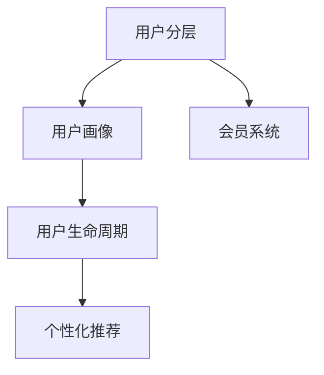

                 

# 知识付费创业中的用户分层运营策略

> 关键词：知识付费, 用户分层, 运营策略, 数据分析, 个性化推荐, 会员系统, 营销策略, 增长黑客

## 1. 背景介绍

### 1.1 问题由来

知识付费，作为内容经济的重要分支，近年来受到广泛关注。随着互联网与数字技术的发展，人们获取知识的方式越来越多元化，从传统的线下培训、阅读书籍，转向网络课程、音频、视频、博客等形式，以更高效便捷地获取知识。

知识付费创业的兴起，为内容创作者和知识分享者提供了新的市场机遇。但面对如此庞大的用户群体，如何制定有效的用户运营策略，提高用户留存率与转化率，实现商业模式闭环，成为创业公司的一大难题。

### 1.2 问题核心关键点

用户运营策略的核心在于对用户的精准划分，通过不同用户群体的特性和行为分析，制定针对性的运营方案，最大化用户价值。以下是知识付费创业中用户分层的关键点：

- **用户画像建立**：通过大数据分析，建立详细的用户画像，了解用户的兴趣、需求、行为习惯。
- **用户行为预测**：根据用户历史数据和行为特征，预测用户未来的行为模式，指导个性化运营策略。
- **用户价值评估**：衡量用户对业务的贡献度，区分高价值用户与低价值用户，分配相应的运营资源。
- **个性化推荐**：利用用户画像和行为数据，推送最符合用户需求的内容，提升用户体验和满意度。
- **会员系统构建**：设计会员制度，通过阶梯化的服务与激励，鼓励用户进行长期消费与内容付费。

### 1.3 问题研究意义

制定科学有效的用户分层运营策略，对于知识付费创业公司来说，具有重要的战略意义：

1. **提升用户留存**：通过精细化的运营手段，提高用户黏性和忠诚度，减少用户流失。
2. **增加用户转化**：针对不同用户群体，设计多样化的转化策略，提高用户付费率。
3. **优化资源分配**：根据用户价值进行差异化服务与资源分配，最大化营销与运营效率。
4. **探索业务模型**：通过精准的用户分层与个性化运营，探索多元化的盈利模式，实现业务模式升级。

## 2. 核心概念与联系

### 2.1 核心概念概述

本节将介绍几个核心的概念，并详细阐述它们之间的联系。

- **用户分层(User Segmentation)**：基于用户数据，将用户划分为多个具有相似特征的群体，方便进行个性化运营。
- **用户画像(User Persona)**：描述一个用户群体的主要特征和行为习惯，作为运营策略制定的依据。
- **用户生命周期(User Lifecycle)**：用户从首次接触产品到最终流失或升级的整个周期，是分析用户行为的重要框架。
- **个性化推荐(Personalized Recommendation)**：根据用户画像和行为数据，推送最适合用户需求的内容。
- **会员系统(Membership System)**：通过会员体系，提供差异化的服务，激励用户长期消费。

这些概念之间的逻辑关系可以通过以下Mermaid流程图来展示：



这个流程图展示了各个核心概念之间的关系：

1. 用户分层是整个运营策略的起点，通过将用户划分到不同群体，能够更加精细地进行个性化运营。
2. 用户画像是分层的基础，通过构建详细的用户画像，理解用户需求，指导分层策略的制定。
3. 用户生命周期反映了用户行为的演变过程，通过分析不同阶段的特征，优化运营策略。
4. 个性化推荐在用户画像和生命周期的基础上，进一步提升用户体验，增强用户粘性。
5. 会员系统为个性化推荐提供机制保障，通过设计激励机制，鼓励用户进行长期消费。

## 3. 核心算法原理 & 具体操作步骤
### 3.1 算法原理概述

用户分层运营策略的实施，本质上是基于数据驱动的用户行为分析与决策优化过程。其核心算法包括用户画像构建、用户行为预测、个性化推荐、会员系统设计等。

通过用户历史行为数据和特征，运用机器学习与数据分析技术，构建用户画像和预测用户行为，然后根据用户画像和行为预测结果，设计个性化推荐策略，并搭建会员系统，持续优化用户运营模型。

### 3.2 算法步骤详解

下面详细介绍用户分层运营策略的核心算法步骤：

**Step 1: 用户数据收集与预处理**
- 收集用户注册信息、浏览行为、购买记录、反馈评价等多维度数据。
- 对数据进行清洗和标准化处理，去除异常值和缺失值，确保数据质量。

**Step 2: 用户画像构建**
- 使用特征工程方法，提取用户的关键特征，如兴趣、行为、人口统计信息等。
- 通过聚类算法（如K-means、层次聚类）或异常检测算法（如孤立森林）对用户进行分类。
- 利用用户画像构建工具，如图谱化展示用户特征和分类结果。

**Step 3: 用户行为预测**
- 使用机器学习算法，如线性回归、决策树、随机森林等，根据历史行为数据预测用户未来行为。
- 设计特征工程流程，提取对预测结果影响较大的特征。
- 采用交叉验证等方法评估模型预测性能，优化预测模型。

**Step 4: 个性化推荐**
- 基于用户画像和行为预测结果，设计推荐模型，如协同过滤、基于内容的推荐、混合推荐等。
- 利用推荐系统框架，如TensorFlow、PyTorch，实现推荐算法的编程和训练。
- 实时获取用户行为数据，更新推荐模型，不断优化推荐结果。

**Step 5: 会员系统设计**
- 设计会员等级体系，设定不同等级的权益与激励措施。
- 设计积分系统，记录用户消费行为，生成积分，用于兑换会员等级。
- 使用A/B测试等方法评估会员系统的实际效果，不断调整和优化。

**Step 6: 运营策略评估与优化**
- 监控关键运营指标，如用户留存率、转化率、会员续费率等。
- 定期分析用户反馈，识别改进点，迭代优化运营策略。
- 根据市场动态，灵活调整运营策略，以应对市场变化。

### 3.3 算法优缺点

用户分层运营策略的优势在于：
1. **提升用户体验**：通过个性化推荐，能够提供符合用户需求的内容，提高用户满意度。
2. **提高运营效率**：用户分层有助于集中运营资源，优化运营策略，提升运营效率。
3. **增加用户转化**：通过设计激励机制，引导用户进行消费，提升用户付费率。
4. **优化资源分配**：对高价值用户进行重点运营，提高资源利用效率。

然而，该方法也存在一些局限性：
1. **数据需求高**：需要大量用户数据进行画像构建和行为预测。
2. **算法复杂度**：个性化推荐和会员系统设计涉及复杂算法和编程工作。
3. **运营成本高**：需要持续监控和优化运营策略，运营成本较高。
4. **用户隐私问题**：用户数据的收集与使用可能引发隐私保护和数据安全问题。

### 3.4 算法应用领域

用户分层运营策略在知识付费创业中的应用非常广泛，涵盖以下几个主要领域：

1. **内容推荐系统**：根据用户兴趣和行为，推荐个性化的课程与文章，提升用户粘性。
2. **用户忠诚计划**：设计会员制度，通过积分、优惠券、专属内容等方式激励用户长期消费。
3. **广告投放策略**：根据用户画像和行为预测结果，定向投放广告，提升广告转化率。
4. **客户细分与维护**：通过用户分层，制定针对性的营销和客户维护策略，提升客户满意度。
5. **内容定价与优化**：根据用户分层结果，设计差异化的定价策略，优化内容结构与更新频率。

## 4. 数学模型和公式 & 详细讲解 & 举例说明

### 4.1 数学模型构建

为更好地理解用户分层运营策略的数学模型，本节将详细介绍相关模型构建流程。

记用户特征为 $X$，行为数据为 $Y$，则用户行为预测模型的构建过程如下：

- **特征工程**：从原始数据中提取特征，如用户注册时间、浏览时长、购买金额等。
- **数据准备**：将用户特征和行为数据标准化，转换为模型所需格式。
- **模型选择**：选择合适的机器学习算法，如线性回归、决策树、随机森林等。
- **模型训练**：使用历史数据对模型进行训练，调整模型参数。
- **模型评估**：使用测试集对模型进行评估，选择最优模型。

用户行为预测的数学模型可以表示为：

$$
Y = f(X; \theta)
$$

其中 $f$ 为预测函数，$\theta$ 为模型参数，$X$ 为输入特征。

### 4.2 公式推导过程

以线性回归模型为例，推导用户行为预测的数学公式。

设用户行为数据为 $y_i$，对应的用户特征为 $x_{ij}$，$i=1,...,N$ 表示样本，$j=1,...,D$ 表示特征维度。线性回归模型的目标是最小化预测误差平方和：

$$
\min_{\theta} \sum_{i=1}^N (y_i - f(x_i, \theta))^2
$$

其中 $f(x_i, \theta) = \theta_0 + \sum_{j=1}^D \theta_j x_{ij}$，$\theta=(\theta_0, \theta_1, ..., \theta_D)^T$ 为模型参数。

根据最小二乘法，求导并令导数为零：

$$
\frac{\partial}{\partial \theta} \sum_{i=1}^N (y_i - \theta_0 - \sum_{j=1}^D \theta_j x_{ij})^2 = 0
$$

解得参数 $\theta$ 的值为：

$$
\theta = (\mathbf{X}^T\mathbf{X})^{-1}\mathbf{X}^T\mathbf{Y}
$$

其中 $\mathbf{X}$ 为特征矩阵，$\mathbf{Y}$ 为目标向量。

### 4.3 案例分析与讲解

以某知识付费平台的课程推荐系统为例，详细分析用户行为预测的应用。

**数据准备**：
- 收集用户注册时间、浏览时长、购买记录等数据。
- 对数据进行清洗，去除异常值和缺失值，生成用户特征和行为数据。

**特征工程**：
- 提取用户注册时间、观看课程时长、购买次数、课程评分等特征。
- 将连续型特征进行离散化处理，如将观看时长分为多个区间。

**模型训练**：
- 选择线性回归模型，使用训练集对模型进行训练。
- 评估模型预测性能，使用交叉验证方法优化模型参数。

**模型应用**：
- 将训练好的模型应用于课程推荐系统，根据用户特征预测其对不同课程的兴趣。
- 结合个性化推荐算法，为用户推荐最符合其需求和兴趣的课程。

## 5. 项目实践：代码实例和详细解释说明
### 5.1 开发环境搭建

在进行项目实践前，我们需要准备好开发环境。以下是使用Python进行Scikit-learn开发的环境配置流程：

1. 安装Anaconda：从官网下载并安装Anaconda，用于创建独立的Python环境。

2. 创建并激活虚拟环境：
```bash
conda create -n sklearn-env python=3.8 
conda activate sklearn-env
```

3. 安装Scikit-learn：从官网获取对应的安装命令，例如：
```bash
conda install scikit-learn
```

4. 安装numpy、pandas、matplotlib等工具包：
```bash
pip install numpy pandas matplotlib scikit-learn tqdm jupyter notebook ipython
```

完成上述步骤后，即可在`sklearn-env`环境中开始项目实践。

### 5.2 源代码详细实现

下面以用户行为预测为例，给出使用Scikit-learn库进行模型训练的Python代码实现。

首先，定义数据预处理函数：

```python
import pandas as pd
import numpy as np
from sklearn.preprocessing import StandardScaler

def preprocess_data(df):
    # 处理缺失值和异常值
    df = df.dropna()
    df = df.drop_duplicates()
    
    # 特征工程
    df['观看时长'] = pd.cut(df['观看时长'], bins=[0, 300, 600, 900], labels=[1, 2, 3, 4])
    df['评分'] = pd.cut(df['评分'], bins=[1, 2, 3, 4, 5], labels=[1, 2, 3, 4, 5])
    
    # 标准化处理
    scaler = StandardScaler()
    df[['观看时长', '评分']] = scaler.fit_transform(df[['观看时长', '评分']])
    
    return df
```

然后，定义模型训练函数：

```python
from sklearn.linear_model import LinearRegression
from sklearn.metrics import mean_squared_error

def train_model(df):
    # 数据划分
    train_df = df.sample(frac=0.8, random_state=42)
    test_df = df.drop(train_df.index)
    
    # 特征选择
    X = train_df[['观看时长', '评分']]
    y = train_df['购买次数']
    
    # 模型训练
    model = LinearRegression()
    model.fit(X, y)
    
    # 模型评估
    y_pred = model.predict(X)
    mse = mean_squared_error(y, y_pred)
    return model, mse
```

接着，进行模型训练和评估：

```python
# 读取数据
df = pd.read_csv('user_data.csv')

# 数据预处理
df = preprocess_data(df)

# 模型训练与评估
model, mse = train_model(df)

print(f'Mean Squared Error: {mse:.4f}')
```

以上就是使用Scikit-learn库进行用户行为预测的完整代码实现。可以看到，Scikit-learn提供了丰富的机器学习算法，使得数据预处理和模型训练变得简洁高效。

### 5.3 代码解读与分析

让我们再详细解读一下关键代码的实现细节：

**preprocess_data函数**：
- 处理缺失值和异常值：使用dropna()和drop_duplicates()方法去除缺失值和重复记录。
- 特征工程：使用pandas的cut()方法将连续型特征离散化，生成更符合模型需求的离散型特征。
- 标准化处理：使用StandardScaler()对特征进行标准化，使其符合正态分布，提高模型预测性能。

**train_model函数**：
- 数据划分：使用sample()方法随机划分训练集和测试集。
- 特征选择：选择对用户行为预测影响较大的特征，构建特征矩阵X和目标向量y。
- 模型训练：使用LinearRegression()训练线性回归模型。
- 模型评估：使用mean_squared_error()计算模型预测误差，评估模型性能。

**数据预处理**：
- 读取用户数据，包含注册时间、观看时长、购买次数、评分等特征。
- 调用preprocess_data()函数进行数据预处理，包括处理缺失值、异常值、特征工程和标准化。

**模型训练与评估**：
- 调用train_model()函数进行模型训练和评估，获取训练好的模型和预测误差。

**代码结果展示**：
- 输出Mean Squared Error指标，反映模型预测性能。

## 6. 实际应用场景
### 6.1 智能课程推荐系统

智能课程推荐系统是知识付费平台的核心应用之一。通过对用户行为数据进行分析，能够构建详细的用户画像，实现个性化推荐。

具体而言，系统会根据用户注册时间、观看时长、购买次数等行为数据，预测用户对不同课程的兴趣，再结合协同过滤、基于内容的推荐等算法，为用户推荐最匹配的课程。

### 6.2 会员系统设计

会员系统是知识付费平台吸引用户长期消费的重要机制。通过设计差异化的会员等级与激励措施，能够提高用户粘性和续费率。

例如，可以根据用户的消费金额和课程数量，划分不同等级，并提供专属课程、优惠券、VIP专享内容等权益。通过积分系统记录用户消费行为，生成积分，用于兑换会员等级，进一步激励用户进行长期消费。

### 6.3 用户行为预测与干预

用户行为预测不仅可用于推荐系统，还能用于用户行为干预。例如，通过预测用户流失，提前进行干预，避免用户流失。

具体做法是，分析用户流失的关键特征，如长时间未登录、课程订阅数量减少等，建立流失预测模型。当系统预测用户可能流失时，通过发送个性化短信、推送优惠券等方式，进行挽留。

### 6.4 未来应用展望

未来，用户分层运营策略将进一步拓展，涵盖更多应用场景，带来更丰富的用户价值。

- **跨平台运营**：随着知识付费平台向移动端和Web端扩展，用户数据将更加分散。通过跨平台数据整合与分析，可以构建更全面的用户画像，实现统一的个性化推荐与运营策略。
- **内容动态调整**：根据用户行为预测，动态调整课程内容和结构，以适应用户需求的变化。
- **个性化营销**：结合用户画像和行为预测结果，设计更精准的营销方案，提高营销效果和ROI。
- **智能客服系统**：利用用户行为预测，设计智能客服系统，提供个性化客服服务，提升用户体验。

## 7. 工具和资源推荐
### 7.1 学习资源推荐

为帮助开发者系统掌握用户分层运营策略的理论基础和实践技巧，这里推荐一些优质的学习资源：

1. **《数据科学与机器学习》课程**：Coursera上的经典课程，由斯坦福大学教授讲授，涵盖机器学习基础与实践，是了解机器学习算法的绝佳起点。
2. **《Python数据科学手册》书籍**：一本介绍Python数据科学工具和库的入门书籍，内容包括数据清洗、特征工程、机器学习等。
3. **Scikit-learn官方文档**：Scikit-learn的官方文档，提供了丰富的机器学习算法示例和API文档，是学习机器学习的重要资料。
4. **Kaggle竞赛**：参加Kaggle数据科学竞赛，通过实战锻炼数据分析和机器学习技能，积累项目经验。
5. **《用户增长修炼手册》书籍**：一本介绍用户增长方法论的书籍，涵盖用户增长战略、渠道分析、产品优化等。

通过对这些资源的学习实践，相信你一定能够快速掌握用户分层运营策略的核心思想和技术方法。

### 7.2 开发工具推荐

高效的开发离不开优秀的工具支持。以下是几款用于用户分层运营策略开发的常用工具：

1. **Python编程语言**：作为一种灵活的脚本语言，Python支持丰富的第三方库和框架，适合数据分析和机器学习任务。
2. **Scikit-learn库**：提供了大量的机器学习算法，如线性回归、决策树、随机森林等，是用户分层运营策略的常用工具。
3. **TensorFlow和PyTorch**：两大深度学习框架，支持复杂的机器学习模型构建与训练，适用于大型的推荐系统和用户画像模型。
4. **A/B测试工具**：如Optimizely、Google Optimize等，用于评估和优化运营策略，验证新功能的实际效果。
5. **数据可视化工具**：如Matplotlib、Seaborn、Tableau等，用于数据可视化和报表生成，方便数据解读和决策支持。

合理利用这些工具，可以显著提升用户分层运营策略的开发效率，加快创新迭代的步伐。

### 7.3 相关论文推荐

用户分层运营策略的研究源于学界的持续探索。以下是几篇奠基性的相关论文，推荐阅读：

1. **《基于用户画像的个性化推荐研究》**：介绍用户画像的构建与个性化推荐系统设计，强调用户特征的重要性和推荐算法的适用性。
2. **《用户行为预测与流失干预研究》**：通过用户行为数据建立预测模型，探讨预测用户流失的关键因素和干预措施。
3. **《会员系统的设计与运营效果评估》**：分析会员系统的设计与运营策略，提出提升会员续费率的具体方法。
4. **《数据驱动的用户增长策略》**：介绍用户增长方法论，强调数据分析与决策优化在用户运营中的应用。

这些论文代表了大用户分层运营策略的发展脉络。通过学习这些前沿成果，可以帮助研究者把握学科前进方向，激发更多的创新灵感。

## 8. 总结：未来发展趋势与挑战

### 8.1 总结

本文对知识付费创业中的用户分层运营策略进行了全面系统的介绍。首先阐述了用户分层运营策略的背景和重要性，明确了其对用户留存、转化和付费的关键作用。其次，从原理到实践，详细讲解了用户分层运营策略的核心算法步骤，给出了实际项目开发的完整代码实现。同时，本文还广泛探讨了该策略在知识付费平台中的应用场景，展示了其广泛的应用前景。此外，本文精选了用户分层运营策略的学习资源和开发工具，力求为开发者提供全方位的技术指引。

通过本文的系统梳理，可以看到，用户分层运营策略在知识付费平台中的应用已经成为一种常态，极大地提升了用户体验和运营效率。未来，伴随数据科学的进一步发展，用户分层运营策略将更加智能化、精准化，为用户价值最大化提供更多可能。

### 8.2 未来发展趋势

展望未来，用户分层运营策略将呈现以下几个发展趋势：

1. **数据智能化**：随着大数据技术的进步，用户数据的收集和处理将更加高效，实时性更强。结合实时数据，可以构建动态的用户画像，实现即时个性化推荐与运营。
2. **算法多样化**：机器学习与深度学习技术的结合，将产生更多高效、精准的算法模型。未来的用户分层运营策略将不再局限于传统的线性回归、协同过滤等算法，而是涵盖更多的智能推荐与预测算法。
3. **场景泛化**：用户分层运营策略将从知识付费平台扩展到更多行业，如电商、金融、医疗等，实现跨行业的用户运营与推荐。
4. **用户体验优化**：基于用户行为预测和个性化推荐，设计更符合用户需求的产品和服务，提升用户体验和满意度。
5. **隐私保护强化**：随着用户隐私保护意识的增强，未来的用户分层运营策略将更加注重数据隐私与安全，采用匿名化、去标识化等技术手段，确保用户数据的安全与合规。

这些趋势凸显了用户分层运营策略在未来的广阔前景。这些方向的探索发展，必将进一步提升用户运营的智能化水平，为知识付费创业公司带来更高效、更精准的用户运营体验。

### 8.3 面临的挑战

尽管用户分层运营策略已经取得了显著成效，但在实践中仍面临一些挑战：

1. **数据质量问题**：用户数据的收集和处理需要确保数据的质量和完整性，存在数据噪声和缺失值的问题。
2. **算法复杂度**：用户分层运营策略涉及复杂的机器学习算法和编程工作，技术门槛较高。
3. **用户隐私保护**：用户数据的收集与使用可能引发隐私保护和数据安全问题，需要制定合理的隐私保护政策。
4. **模型可解释性**：用户分层运营策略中的机器学习模型往往具有"黑盒"特性，难以解释其决策过程。
5. **运营成本高**：用户分层运营策略需要持续监控和优化，运营成本较高。

面对这些挑战，未来需要从以下几个方面进行优化和改进：

1. **数据清洗与预处理**：引入更高效的数据清洗与预处理技术，提升数据质量，确保数据分析的准确性。
2. **模型简化与解释**：简化模型结构，提高模型解释性，确保模型的透明度和可信度。
3. **隐私保护技术**：采用匿名化、去标识化等技术手段，确保用户数据的安全与合规。
4. **成本控制**：引入自动化工具和系统优化技术，降低运营成本，提高运营效率。
5. **跨领域应用**：将用户分层运营策略扩展到更多行业，实现跨行业的知识迁移与应用。

这些改进方向将推动用户分层运营策略的进一步成熟，为知识付费创业公司提供更高效、更安全、更可靠的用户运营工具。

### 8.4 研究展望

面对知识付费创业公司面临的用户运营挑战，未来的研究需要在以下几个方面寻求新的突破：

1. **跨平台用户画像构建**：随着平台向移动端和Web端扩展，用户数据将更加分散。研究跨平台用户画像的构建方法，实现统一的用户画像与运营策略。
2. **高效推荐算法**：结合深度学习与强化学习，设计更高效、更精准的推荐算法，提升推荐系统的性能。
3. **用户行为理解**：通过心理学、行为学等方法，深入理解用户行为模式，设计更符合用户心理的运营策略。
4. **个性化内容生成**：结合自然语言处理和生成对抗网络等技术，生成个性化的课程与文章，提高用户粘性和满意度。
5. **智能客服系统**：利用机器学习和自然语言处理技术，设计智能客服系统，提升客服响应速度和质量。

这些研究方向将进一步拓展用户分层运营策略的应用范围，为知识付费创业公司带来更高效的运营模式，推动行业的快速发展。

## 9. 附录：常见问题与解答

**Q1：如何构建高效的用户画像？**

A: 构建高效的用户画像，需要综合考虑用户的基本信息、行为特征、兴趣偏好等多个维度。以下是一些具体步骤：

1. **数据收集**：收集用户注册信息、浏览行为、购买记录、反馈评价等多维度数据。
2. **数据清洗**：对数据进行清洗和标准化处理，去除异常值和缺失值。
3. **特征提取**：选择影响用户行为的关键特征，如年龄、性别、地理位置、浏览时长、观看时长、购买次数等。
4. **聚类分析**：使用聚类算法，如K-means、层次聚类等，将用户划分为多个具有相似特征的群体。
5. **可视化展示**：利用数据可视化工具，如图谱化展示用户画像的分类结果和特征分布。

通过以上步骤，可以构建详细、准确的用户画像，为个性化运营策略提供依据。

**Q2：如何设计有效的个性化推荐算法？**

A: 设计有效的个性化推荐算法，需要结合用户画像和行为预测结果，考虑以下几个关键点：

1. **特征工程**：选择对推荐效果影响较大的特征，进行标准化和特征选择。
2. **算法选择**：选择合适的推荐算法，如协同过滤、基于内容的推荐、混合推荐等。
3. **模型训练**：使用历史数据对推荐模型进行训练，优化模型参数。
4. **实时更新**：实时获取用户行为数据，更新推荐模型，保证推荐结果的时效性。
5. **A/B测试**：通过A/B测试，评估推荐算法的实际效果，不断优化推荐策略。

通过以上步骤，可以设计出高效、精准的个性化推荐算法，提升用户满意度与转化率。

**Q3：如何设计会员系统？**

A: 设计会员系统，需要考虑以下几个关键点：

1. **会员等级划分**：根据用户的消费金额和课程数量，划分不同等级，并提供专属权益。
2. **会员激励措施**：设计积分系统，记录用户消费行为，生成积分，用于兑换会员等级。
3. **会员权益设计**：提供差异化的会员权益，如专属课程、优惠券、VIP专享内容等。
4. **会员续费策略**：设计会员续费策略，如积分奖励、会员专属活动等，提高续费率。

通过以上步骤，可以设计出有效的会员系统，提高用户粘性和续费率。

**Q4：如何预测用户流失？**

A: 预测用户流失，需要考虑以下几个关键因素：

1. **特征选择**：选择对用户流失影响较大的特征，如长时间未登录、课程订阅数量减少、购买次数下降等。
2. **模型选择**：选择合适的预测模型，如逻辑回归、随机森林等。
3. **模型训练**：使用历史数据对流失预测模型进行训练，优化模型参数。
4. **模型评估**：使用测试集评估模型预测性能，调整模型参数。
5. **流失干预**：根据预测结果，进行个性化的干预措施，如发送个性化短信、推送优惠券等。

通过以上步骤，可以预测用户流失，及时进行干预，减少用户流失率。

**Q5：如何优化用户运营策略？**

A: 优化用户运营策略，需要综合考虑用户反馈、市场动态和业务目标，以下是一些具体方法：

1. **数据分析**：定期分析用户反馈和行为数据，识别改进点。
2. **市场调研**：进行市场调研，了解用户需求和市场变化。
3. **策略调整**：根据数据分析和市场调研结果，调整运营策略。
4. **持续优化**：持续监控运营效果，优化策略，确保运营效果的稳定和提升。

通过以上步骤，可以不断优化用户运营策略，提升用户满意度和业务绩效。

---

作者：禅与计算机程序设计艺术 / Zen and the Art of Computer Programming

