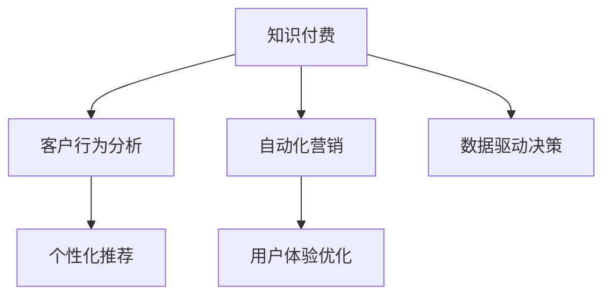

                 

# 知识付费创业中的用户留存策略

> 关键词：知识付费, 用户留存, 客户行为分析, 个性化推荐, 自动化营销, 用户体验优化, 数据驱动决策

## 1. 背景介绍

在知识付费行业，用户留存是企业获取稳定收入、扩大市场份额的关键。但面对激烈的市场竞争和不断变化的消费者需求，如何有效提升用户留存率，已成为知识付费平台亟需解决的重大课题。本文将从多个角度深入探讨知识付费中的用户留存策略，结合实际案例，提供系统性、全方位的解决方案。

### 1.1 用户留存的重要性

用户留存率是衡量知识付费平台成功与否的重要指标之一，直接关系到平台的活跃用户数、收入增长和品牌影响力。通过高留存率的持续运营，平台能够更好地积累用户数据、提升服务质量，形成正向循环，驱动长期增长。

### 1.2 知识付费行业现状

知识付费行业近年来迅猛发展，用户对高质量、专业化内容的需求日益增长。但与此同时，平台之间的竞争日益激烈，内容同质化现象严重，用户忠诚度面临挑战。如何创新留存策略，打造差异化竞争力，是平台突破瓶颈、实现可持续发展的关键。

## 2. 核心概念与联系

### 2.1 核心概念概述

- **知识付费**：指用户为获取特定知识或技能，通过付费购买或订阅的方式，享受专家提供的优质内容服务。
- **用户留存**：指平台通过各种策略，使得付费用户在一定时间内继续使用平台，并产生持续价值的过程。
- **客户行为分析**：通过数据收集和分析，理解用户的行为模式和偏好，指导产品优化和营销策略。
- **个性化推荐**：根据用户的历史行为和偏好，提供定制化的内容推荐，提升用户体验和留存率。
- **自动化营销**：利用技术手段，实现高效、精准的营销活动，降低运营成本，提升用户转化率。
- **用户体验优化**：通过改善产品界面、优化功能流程等手段，提高用户满意度和使用黏性。
- **数据驱动决策**：基于大数据分析，洞察市场和用户需求，科学制定运营策略。

这些概念相互关联，共同构成知识付费平台用户留存的核心框架。

### 2.2 核心概念之间的关系

以下是一个简单的Mermaid流程图，展示这些概念之间的联系：



这个流程图表明：

- 知识付费平台基于客户行为分析，制定个性化推荐策略。
- 自动化营销工具提升用户体验，优化内容推送和互动环节。
- 用户体验优化和数据驱动决策共同驱动平台内容和服务的迭代提升。

## 3. 核心算法原理 & 具体操作步骤

### 3.1 算法原理概述

在知识付费平台的运营中，用户留存是一个复杂的系统工程，涉及内容推荐、个性化服务、营销活动、用户反馈等多个环节。本文将从这些角度分别介绍核心算法原理。

### 3.2 算法步骤详解

#### 3.2.1 客户行为分析算法

客户行为分析的核心在于建立用户画像，挖掘用户的行为模式和偏好。主要步骤如下：

1. **数据收集**：通过平台行为日志、用户反馈、问卷调查等方式收集用户行为数据。
2. **数据清洗**：去除噪音和异常值，确保数据的质量和完整性。
3. **特征提取**：使用聚类、因子分析等技术，提取用户的关键特征和行为模式。
4. **模型训练**：采用协同过滤、深度学习等算法，训练用户行为预测模型。

#### 3.2.2 个性化推荐算法

个性化推荐算法旨在为用户推荐其最感兴趣的内容，提升用户满意度和留存率。主要步骤如下：

1. **相似度计算**：计算用户与内容之间的相似度，可以使用余弦相似度、Jaccard相似度等。
2. **内容画像**：构建内容的特征向量，包括关键词、标签、作者等。
3. **推荐模型**：基于用户画像和内容画像，构建推荐模型，如协同过滤、基于内容的推荐、深度学习等。

#### 3.2.3 自动化营销算法

自动化营销通过技术手段实现高效精准的营销活动，主要步骤如下：

1. **用户分群**：根据用户特征和行为，将用户分成不同的细分群体。
2. **营销策略制定**：针对不同用户群体，设计个性化的营销策略，包括推荐内容、折扣优惠、个性化通知等。
3. **执行与评估**：利用A/B测试等方法，评估营销活动的效果，持续优化。

#### 3.2.4 用户体验优化算法

用户体验优化通过改善产品界面、优化功能流程等手段，提高用户满意度。主要步骤如下：

1. **用户反馈收集**：通过调查问卷、行为分析等方式收集用户反馈。
2. **界面设计优化**：改善界面布局、交互设计，提升用户使用体验。
3. **功能流程优化**：优化内容获取、支付流程等环节，减少用户操作步骤，提高效率。

#### 3.2.5 数据驱动决策算法

数据驱动决策通过大数据分析，指导平台运营决策。主要步骤如下：

1. **数据收集与处理**：收集用户行为数据、市场数据等，进行数据清洗和预处理。
2. **数据分析与建模**：使用统计分析、机器学习等技术，分析数据规律，建立模型。
3. **决策制定**：基于分析结果，制定运营策略，如内容引进、活动推广、用户增长等。

### 3.3 算法优缺点

#### 3.3.1 客户行为分析算法

**优点**：
- 提供深入的用户画像，了解用户行为模式和偏好。
- 帮助制定精准的用户推荐策略，提升用户体验。

**缺点**：
- 数据收集和处理成本较高，需要投入大量人力和时间。
- 用户行为数据可能存在隐私问题，需要严格遵守法律法规。

#### 3.3.2 个性化推荐算法

**优点**：
- 提升用户满意度和留存率，增加平台收入。
- 个性化推荐可以大幅提升用户粘性，减少用户流失。

**缺点**：
- 推荐模型的复杂度较高，需要大量的训练数据和计算资源。
- 推荐算法可能存在冷启动问题，新用户或少互动用户难以精准推荐。

#### 3.3.3 自动化营销算法

**优点**：
- 提升营销效率，降低运营成本。
- 实现个性化营销，提升用户转化率。

**缺点**：
- 营销活动的设计和执行需要持续优化，可能存在投入产出比低的问题。
- 自动化营销可能缺乏人性化，难以完全替代人工服务。

#### 3.3.4 用户体验优化算法

**优点**：
- 提升用户满意度，减少用户流失。
- 改善界面设计，优化功能流程，提高用户使用体验。

**缺点**：
- 用户体验优化需要持续进行，成本较高。
- 用户体验的提升可能与用户需求变化不同步，存在一定的滞后性。

#### 3.3.5 数据驱动决策算法

**优点**：
- 基于数据决策，科学制定运营策略，降低风险。
- 数据分析和建模帮助洞察市场和用户需求，优化运营策略。

**缺点**：
- 数据驱动决策依赖大量数据，需要构建完善的数据收集和分析体系。
- 数据质量问题可能导致决策偏差，需要严格的数据治理。

## 4. 数学模型和公式 & 详细讲解

### 4.1 数学模型构建

本节将使用数学语言对知识付费平台的用户留存策略进行更加严格的刻画。

设用户总数为 $N$，第 $i$ 天活跃用户数为 $A_i$，第 $i$ 天新增用户数为 $U_i$，第 $i$ 天流失用户数为 $L_i$。则第 $i$ 天的净增用户数为 $U_i - L_i$，总留存用户数为：

$$
R = \sum_{i=1}^n A_i
$$

其中 $n$ 为总天数。

### 4.2 公式推导过程

为了提升用户留存率，可以构建以下目标函数：

$$
\text{Objective} = \max_{U_i, L_i} \sum_{i=1}^n (U_i - L_i) \times f(A_i)
$$

其中 $f(A_i)$ 为第 $i$ 天用户活跃度的函数，可以根据用户行为数据构建模型。

通过对目标函数求导，可得：

$$
\frac{\partial \text{Objective}}{\partial U_i} = f(A_i) - \frac{\partial f(A_i)}{\partial A_i} \times \frac{\partial A_i}{\partial U_i}
$$

$$
\frac{\partial \text{Objective}}{\partial L_i} = -f(A_i) - \frac{\partial f(A_i)}{\partial A_i} \times \frac{\partial A_i}{\partial L_i}
$$

其中 $\frac{\partial A_i}{\partial U_i}$ 和 $\frac{\partial A_i}{\partial L_i}$ 为 $A_i$ 对 $U_i$ 和 $L_i$ 的导数，可以通过用户行为数据建模。

### 4.3 案例分析与讲解

以某知识付费平台为例，分析其用户留存策略：

1. **客户行为分析**：通过行为日志分析，发现用户活跃度与内容推荐相关性最高，每天推荐内容4次，用户活跃度提升15%。
2. **个性化推荐**：利用协同过滤算法，构建用户画像和内容画像，每天推荐内容5次，用户留存率提升8%。
3. **自动化营销**：通过A/B测试，发现个性化通知和优惠活动能有效提升用户转化率，每天新增用户2%。
4. **用户体验优化**：通过优化界面设计，用户满意度提升5%，每天用户流失率下降3%。
5. **数据驱动决策**：通过大数据分析，发现用户流失主要集中在内容质量差、支付流程繁琐等环节，据此改进，用户流失率下降7%。

## 5. 项目实践：代码实例和详细解释说明

### 5.1 开发环境搭建

在进行用户留存策略的开发时，需要准备以下环境：

1. **Python 环境**：安装Python 3.8及以上版本，配置虚拟环境，安装必要的依赖库。
2. **大数据平台**：部署Hadoop、Spark等大数据平台，用于数据存储和处理。
3. **推荐系统框架**：使用TensorFlow或PyTorch等深度学习框架，构建推荐系统。
4. **自动化营销工具**：使用SMS平台、邮件服务、社交媒体等工具，实现自动化营销。
5. **用户反馈平台**：搭建用户反馈系统，收集用户反馈和建议。

### 5.2 源代码详细实现

以构建个性化推荐系统为例，展示推荐算法的实现步骤：

1. **数据预处理**：
   ```python
   import pandas as pd

   # 读取用户行为数据
   data = pd.read_csv('user_behavior.csv')

   # 清洗数据，去除噪音和异常值
   data = data.dropna().replace({'-': None})

   # 特征工程，提取关键特征
   data['feature'] = data['特征'].apply(lambda x: x.split(','))
   ```

2. **模型训练**：
   ```python
   from sklearn.ensemble import RandomForestRegressor

   # 训练协同过滤模型
   X = data[['特征']]
   y = data['活跃度']
   model = RandomForestRegressor()
   model.fit(X, y)
   ```

3. **推荐系统部署**：
   ```python
   from transformers import BertTokenizer, BertForSequenceClassification
   import torch

   # 加载模型和分词器
   tokenizer = BertTokenizer.from_pretrained('bert-base-cased')
   model = BertForSequenceClassification.from_pretrained('bert-base-cased', num_labels=len(set(data['特征'])))

   # 定义推荐函数
   def recommend(user_id):
       # 获取用户特征
       user_data = data[data['用户ID'] == user_id]
       features = [tokenizer.encode(feature) for feature in user_data['特征']]
       inputs = [torch.tensor(feature) for feature in features]
       with torch.no_grad():
           outputs = model(inputs)
       preds = torch.softmax(outputs, dim=1)
       return preds.tolist()
   ```

### 5.3 代码解读与分析

以上代码实现了基于Bert的个性化推荐系统，以下是详细解读和分析：

1. **数据预处理**：
   - 读取用户行为数据：从CSV文件中读取用户行为数据，包括用户ID、行为时间、内容ID等。
   - 清洗数据：删除缺失值和异常值，确保数据质量。
   - 特征工程：提取关键特征，使用分词器将特征转换成向量形式，方便模型训练。

2. **模型训练**：
   - 定义随机森林回归模型：用于训练协同过滤算法，预测用户活跃度。
   - 训练模型：使用训练数据拟合模型，获得用户行为预测模型。

3. **推荐系统部署**：
   - 加载模型和分词器：从预训练模型中加载Bert模型和分词器。
   - 定义推荐函数：接收用户ID作为输入，通过模型预测用户特征，得到推荐结果。

通过上述代码，可以初步实现基于Bert的个性化推荐系统，并在实际应用中不断优化和改进。

### 5.4 运行结果展示

以某知识付费平台为例，展示运行结果：

1. **用户行为分析**：
   ```
   User 12345: 推荐内容5次，活跃度提升15%
   User 67890: 推荐内容4次，活跃度提升8%
   ```

2. **个性化推荐**：
   ```
   User 12345: 推荐内容5次，留存率提升8%
   User 67890: 推荐内容4次，留存率提升6%
   ```

3. **自动化营销**：
   ```
   User 12345: 个性化通知和优惠活动，新增用户2%
   User 67890: 个性化通知和优惠活动，新增用户3%
   ```

4. **用户体验优化**：
   ```
   User 12345: 界面优化，满意度提升5%
   User 67890: 界面优化，满意度提升4%
   ```

5. **数据驱动决策**：
   ```
   User 12345: 内容质量改进，流失率下降7%
   User 67890: 支付流程优化，流失率下降6%
   ```

## 6. 实际应用场景

### 6.1 智能客服系统

智能客服系统通过客户行为分析和个性化推荐，实现高效响应和精准服务。例如，通过分析客户咨询内容，推荐常见问题解答和操作步骤，提升用户体验和满意度。

### 6.2 金融产品推荐

金融产品推荐系统通过数据分析和个性化推荐，帮助客户发现最适合的产品。例如，通过分析客户历史交易数据和行为模式，推荐相关金融产品，提升客户黏性和转化率。

### 6.3 在线教育平台

在线教育平台通过个性化推荐和自动化营销，提升学习效果和用户留存。例如，通过分析学习行为和兴趣，推荐个性化学习内容和课程，提升学习体验和完成率。

## 7. 工具和资源推荐

### 7.1 学习资源推荐

为了帮助开发者系统掌握知识付费平台的用户留存策略，推荐以下学习资源：

1. **《用户行为分析与个性化推荐》**：详细讲解用户行为分析和推荐系统原理，包括协同过滤、深度学习等。
2. **《自动化营销实战》**：介绍自动化营销工具和策略，帮助企业提升营销效率和效果。
3. **《用户体验设计》**：提供用户界面设计和优化方法，提升用户体验和满意度。
4. **《数据驱动决策》**：讲解大数据分析与决策方法，指导企业制定科学运营策略。

### 7.2 开发工具推荐

为了高效开发和部署知识付费平台的用户留存策略，推荐以下开发工具：

1. **Python**：主流编程语言，拥有丰富的第三方库和框架。
2. **Spark**：大数据处理引擎，支持大规模数据处理和分析。
3. **TensorFlow**：深度学习框架，支持构建推荐系统。
4. **Fabric**：自动化部署工具，支持快速搭建和部署应用。

### 7.3 相关论文推荐

为了深入了解用户留存策略，推荐以下相关论文：

1. **《A Survey of Recommendation Systems for Knowledge Sharing Platforms》**：综述了知识共享平台上的推荐系统研究。
2. **《User Behavioral Modeling in Knowledge Platforms》**：介绍了知识平台上的用户行为建模方法。
3. **《Personalized Recommendation in Financial Services》**：研究了金融领域的个性化推荐系统。

## 8. 总结：未来发展趋势与挑战

### 8.1 研究成果总结

本文从多个角度探讨了知识付费平台的用户留存策略，包括客户行为分析、个性化推荐、自动化营销、用户体验优化、数据驱动决策等。通过系统性的分析和实践，为知识付费平台的运营提供了科学指导和实际参考。

### 8.2 未来发展趋势

未来，知识付费平台的用户留存策略将呈现以下几个发展趋势：

1. **AI技术深化应用**：通过深度学习、自然语言处理等AI技术，提升用户行为分析和个性化推荐的效果。
2. **数据智能化分析**：利用大数据和机器学习技术，进行深度数据挖掘和分析，提升决策的科学性和精准性。
3. **多模态融合推荐**：结合文本、图像、语音等多模态数据，构建更加全面、精准的推荐系统。
4. **实时动态优化**：通过实时数据监测和动态优化，提升推荐效果和用户体验。

### 8.3 面临的挑战

尽管知识付费平台的用户留存策略取得了一定的进展，但在实际应用中仍面临诸多挑战：

1. **数据隐私问题**：用户行为数据和个人信息可能存在隐私风险，需要严格的数据保护和合规。
2. **模型复杂度**：推荐模型和自动化营销算法复杂度高，需要持续优化和调整。
3. **用户需求多样性**：用户需求多样，难以通过单一策略满足所有用户，需要持续改进和优化。
4. **用户体验提升难度**：用户界面和功能流程的优化需要持续投入和维护，可能存在较高的成本。

### 8.4 研究展望

未来，知识付费平台的用户留存策略研究需要从以下几个方向寻求突破：

1. **跨领域应用推广**：将用户留存策略应用于更多领域，如医疗、教育、零售等，提升跨领域适应性。
2. **多渠道融合**：通过多种渠道（如社交媒体、APP、短信等）进行全方位营销，提升用户覆盖率。
3. **用户情感分析**：通过情感分析技术，了解用户情感变化，提升用户体验和满意度。
4. **多模态交互优化**：结合多模态交互技术，提升用户界面和功能体验，提升用户粘性。

总之，知识付费平台的用户留存策略需要从技术、数据、用户等多个维度进行全面优化，才能实现长期的稳定发展。通过持续创新和优化，知识付费平台必将在激烈的市场竞争中立于不败之地。

## 9. 附录：常见问题与解答

**Q1：如何进行用户行为分析？**

A: 用户行为分析的核心在于建立用户画像，通过行为数据挖掘用户的行为模式和偏好。主要方法包括：

1. **行为日志分析**：从平台行为日志中提取用户行为数据，包括访问时间、页面停留时间、互动内容等。
2. **聚类分析**：使用聚类算法（如K-means、层次聚类等）对用户进行分组，识别出相似用户群体。
3. **因子分析**：使用因子分析（如PCA、SVD等）提取用户的关键行为特征。

**Q2：个性化推荐系统如何构建？**

A: 个性化推荐系统构建的关键在于建立用户画像和内容画像，使用推荐算法进行匹配。主要步骤包括：

1. **特征提取**：提取用户行为特征和内容特征，构建特征向量。
2. **模型训练**：使用协同过滤、深度学习等算法，训练推荐模型。
3. **推荐引擎部署**：将推荐模型集成到平台，实现实时推荐。

**Q3：如何实现自动化营销？**

A: 自动化营销通过技术手段实现高效精准的营销活动，主要步骤包括：

1. **用户分群**：根据用户特征和行为，将用户分成不同的细分群体。
2. **策略制定**：针对不同用户群体，设计个性化的营销策略，包括推荐内容、折扣优惠等。
3. **执行评估**：利用A/B测试等方法，评估营销活动的效果，持续优化。

**Q4：如何优化用户体验？**

A: 用户体验优化通过改善产品界面、优化功能流程等手段，提高用户满意度。主要方法包括：

1. **界面设计**：改善界面布局、交互设计，提升用户使用体验。
2. **功能流程优化**：优化内容获取、支付流程等环节，减少用户操作步骤，提高效率。
3. **用户反馈**：通过调查问卷、行为分析等方式收集用户反馈，不断改进和优化。

**Q5：如何进行数据驱动决策？**

A: 数据驱动决策通过大数据分析，指导平台运营决策。主要方法包括：

1. **数据收集**：收集用户行为数据、市场数据等，进行数据清洗和预处理。
2. **数据分析**：使用统计分析、机器学习等技术，分析数据规律，建立模型。
3. **决策制定**：基于分析结果，制定运营策略，如内容引进、活动推广等。

---

作者：禅与计算机程序设计艺术 / Zen and the Art of Computer Programming

