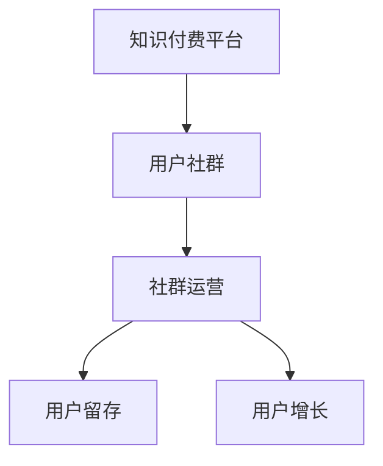

                 

# 知识付费创业中的用户社群运营

> 关键词：知识付费, 用户社群, 社群运营, 用户留存, 用户增长, 内容推荐, 社群管理

## 1. 背景介绍

随着互联网技术的发展，知识付费逐渐成为一种流行的消费模式。用户通过付费获取专业领域的知识和服务，满足自身学习和提升的需求。在这一过程中，用户社群的运营变得尤为重要。如何构建和管理一个活跃、有序、高效的社群，不仅能够提升用户满意度，还能促进知识付费平台的增长。

### 1.1 知识付费的兴起

知识付费的兴起可以追溯到O2O时代的知识分享平台，如知识付费行业的佼佼者知乎、得到、喜马拉雅等。这些平台以内容付费为核心，吸引了一部分专业领域爱好者和知识输出者，逐渐形成了稳定的用户基础。随着移动互联网的普及和智能手机的普及，用户对知识获取的需求变得更加多样化和即时化，知识付费也因此得到了飞速发展。

### 1.2 社群运营的重要性

用户社群是知识付费平台的核心资源，其运营水平直接影响了平台的用户留存率和用户增长。一个活跃的社群不仅能提供良好的用户体验，还能提升用户粘性，促进知识付费内容的消费。良好的社群运营还能帮助平台进行内容推荐，提高用户发现和消费优质内容的机会。

## 2. 核心概念与联系

### 2.1 核心概念概述

为更好地理解知识付费中的用户社群运营，本节将介绍几个关键概念：

- **知识付费平台**：指基于互联网提供专业知识和服务的平台，用户通过付费获得知识资源和服务。
- **用户社群**：指一群具有共同兴趣和需求的消费者，他们通过社群平台进行交流互动，形成以用户为中心的社区。
- **社群运营**：指通过有效的策略和手段，对用户社群进行管理和维护，提升用户满意度和平台用户增长。
- **用户留存**：指平台通过各种手段，减少用户流失，保持用户长期活跃。
- **用户增长**：指平台通过推广、引流等手段，不断吸引新用户注册和转化。

这些概念之间的逻辑关系可以通过以下Mermaid流程图来展示：



这个流程图展示了几大关键概念及其之间的关系：

1. 知识付费平台为用户提供专业知识和服务。
2. 用户社群是知识付费平台的核心资源，用户通过社群进行交流和互动。
3. 社群运营通过各种策略，提升用户满意度和活跃度。
4. 用户留存和用户增长是社群运营的重要目标。

## 3. 核心算法原理 & 具体操作步骤

### 3.1 算法原理概述

知识付费中的用户社群运营，本质上是一个多目标优化问题。平台需要平衡用户留存和用户增长，同时提升用户满意度和社群活跃度。其核心思想是通过有效的策略和手段，不断提升用户价值，从而实现平台整体的增长。

### 3.2 算法步骤详解

基于以上思路，知识付费平台的用户社群运营可以大致分为以下几个关键步骤：

**Step 1: 数据分析和用户画像**

- 通过用户行为数据分析，了解用户的基本需求和行为习惯。
- 构建用户画像，明确不同用户群体的特征和需求。

**Step 2: 用户分群**

- 基于用户画像，将用户分为不同的群体。
- 针对不同群体的特征和需求，设计有针对性的社群运营策略。

**Step 3: 内容推荐和社区互动**

- 利用推荐算法，对不同用户群体推荐合适的知识和内容。
- 设计社区互动机制，提升用户活跃度和参与度。

**Step 4: 用户留存和转化**

- 通过个性化推荐、专属特权等手段，提升用户留存率。
- 针对新用户，提供优惠和奖励，促进用户转化。

**Step 5: 社群管理和反馈机制**

- 建立社群管理机制，确保社群秩序和健康发展。
- 设置用户反馈机制，及时响应用户需求，优化社群运营策略。

### 3.3 算法优缺点

知识付费平台的用户社群运营方法具有以下优点：

1. 提高用户满意度：通过有针对性的内容和互动，提升用户满意度，增加用户粘性。
2. 提升用户留存率：通过个性化推荐和专属特权，减少用户流失，提升用户留存率。
3. 促进用户增长：通过精准引流和优惠活动，吸引新用户注册和转化。
4. 优化用户体验：通过用户反馈和社群管理，不断优化用户体验，提升平台口碑。

同时，该方法也存在一定的局限性：

1. 用户画像构建难度大：构建准确、全面的用户画像需要大量的数据分析和用户调研。
2. 内容推荐算法复杂：推荐算法需要考虑多维度的用户特征和内容特征，算法实现复杂。
3. 社群管理难度高：社群管理需要投入大量人力，且用户行为变化快，管理难度较大。
4. 反馈机制响应慢：用户反馈的快速响应和处理需要高效的系统支撑，否则影响用户体验。

尽管存在这些局限性，但就目前而言，用户社群运营是知识付费平台的核心策略之一，通过不断优化和创新，能够在用户增长和用户留存之间找到最佳平衡点。

### 3.4 算法应用领域

用户社群运营的应用领域非常广泛，几乎覆盖了所有知识付费平台，例如：

- 在线教育平台：如Coursera、Udemy等，通过社群运营提升课程购买率和用户留存率。
- 职业培训平台：如LinkedIn Learning、GitHub等，通过社群互动促进技能学习。
- 健康和健身平台：如MyFitnessPal、Fitbit等，通过社群管理提升用户粘性。
- 金融理财平台：如MoneyGuide、Robinhood等，通过社群运营提升用户信任和满意度。

除了以上提到的应用领域外，用户社群运营还将在更多垂直领域得到应用，如旅游、音乐、艺术等，为不同行业带来新的发展机遇。

## 4. 数学模型和公式 & 详细讲解 & 举例说明

### 4.1 数学模型构建

本节将使用数学语言对知识付费平台的用户社群运营进行更加严格的刻画。

设知识付费平台的用户数为 $U$，用户留存率为 $R$，用户增长率为 $G$，用户满意率为 $S$，社群活跃度为 $A$。则知识付费平台的整体运营目标可以表示为：

$$
\maximize R \times G \times S \times A
$$

其中 $R$ 和 $G$ 分别表示用户留存率和用户增长率，$S$ 表示用户满意度，$A$ 表示社群活跃度。

### 4.2 公式推导过程

以下是用户留存率和用户增长率的推导过程。

用户留存率 $R$ 可以表示为：

$$
R = \frac{U_{new}}{U_{current}}
$$

其中 $U_{new}$ 表示新用户数，$U_{current}$ 表示当前用户数。

用户增长率 $G$ 可以表示为：

$$
G = \frac{U_{new}}{U_{old}}
$$

其中 $U_{old}$ 表示上期用户数。

结合以上两个公式，可以得到用户增长率 $G$ 和用户留存率 $R$ 的关系：

$$
G = \frac{U_{new}}{U_{old}} = R \times \frac{U_{current}}{U_{old}}
$$

这意味着，用户留存率 $R$ 越高，用户增长率 $G$ 也越高。

### 4.3 案例分析与讲解

假设一个知识付费平台，目前有 $U_{old} = 10000$ 用户，每天新增 $U_{new} = 500$ 用户。设用户留存率 $R = 0.9$，则用户增长率 $G$ 为：

$$
G = R \times \frac{U_{current}}{U_{old}} = 0.9 \times \frac{10000 + 500}{10000} = 0.95
$$

这意味着，每天用户增长率比上期增长了 5%。

## 5. 项目实践：代码实例和详细解释说明

### 5.1 开发环境搭建

在进行用户社群运营实践前，我们需要准备好开发环境。以下是使用Python进行Django开发的环境配置流程：

1. 安装Python：从官网下载并安装Python，确保版本在3.6及以上。
2. 安装Django：通过pip安装Django框架，命令为：`pip install django`
3. 安装MySQLdb：通过pip安装MySQL数据库驱动程序，命令为：`pip install mysql-connector-python`
4. 创建虚拟环境：通过venv工具创建虚拟环境，命令为：`python -m venv myenv`
5. 激活虚拟环境：通过激活命令进入虚拟环境，命令为：`source myenv/bin/activate`

完成上述步骤后，即可在myenv环境中开始用户社群运营的开发工作。

### 5.2 源代码详细实现

以下是Django框架下用户社群运营的示例代码：

```python
# models.py
from django.db import models

class User(models.Model):
    username = models.CharField(max_length=30)
    email = models.EmailField()
    created_at = models.DateTimeField(auto_now_add=True)
    updated_at = models.DateTimeField(auto_now=True)

class Content(models.Model):
    title = models.CharField(max_length=100)
    content = models.TextField()
    created_at = models.DateTimeField(auto_now_add=True)
    updated_at = models.DateTimeField(auto_now=True)
    user = models.ForeignKey(User, on_delete=models.CASCADE)

# views.py
from django.shortcuts import render, redirect
from django.http import HttpResponse
from django.contrib.auth.decorators import login_required

@login_required
def home(request):
    user = request.user
    content = Content.objects.filter(user=user).order_by('-created_at')
    return render(request, 'home.html', {'user': user, 'content': content})

@login_required
def create_content(request):
    user = request.user
    if request.method == 'POST':
        title = request.POST['title']
        content = request.POST['content']
        Content.objects.create(title=title, content=content, user=user)
        return redirect('home')
    return render(request, 'create_content.html', {'user': user})

# templates/home.html
<!DOCTYPE html>
<html>
<head>
    <title>Home</title>
</head>
<body>
    <h1>Welcome, {{ user.username }}!</h1>
    <ul>
        
            <li><a href="">{{ content.title }}</a></li>
        
    </ul>
    <form method="post">
        
        {{ form.as_p }}
        <button type="submit">Publish</button>
    </form>
</body>
</html>

# templates/create_content.html
<!DOCTYPE html>
<html>
<head>
    <title>Create Content</title>
</head>
<body>
    <h1>Create New Content</h1>
    <form method="post">
        
        <label for="title">Title:</label>
        <input type="text" name="title"><br>
        <label for="content">Content:</label>
        <textarea name="content"></textarea><br>
        <button type="submit">Submit</button>
    </form>
</body>
</html>
```

以上代码实现了用户发布文章的基本功能，用户在登录后可以看到自己发布的文章列表。同时，用户也可以发布新的文章。

### 5.3 代码解读与分析

**models.py**：

- 定义了用户和内容两个模型，分别用于存储用户信息和发布的文章。
- 用户模型包含用户名、邮箱、创建时间和更新时间。
- 内容模型包含文章标题、内容、创建时间和更新时间，同时关联用户模型。

**views.py**：

- 实现了用户主页和文章发布的视图函数。
- 用户主页显示用户发布的文章列表，文章按照创建时间倒序排列。
- 文章发布视图函数实现了用户创建文章的逻辑，用户提交表单后，通过POST请求将文章信息保存到数据库。

**templates/home.html**：

- 渲染用户主页的HTML页面，展示用户发布的文章列表。
- 使用Django模板语言，将用户信息、文章列表动态渲染到页面中。

**templates/create_content.html**：

- 渲染文章发布页面，供用户提交新的文章。
- 页面包含文章的标题和内容输入框，以及提交按钮。

通过以上代码，我们实现了用户发布文章的基本功能。在实际应用中，还需要根据具体需求，添加用户管理、文章评论、社区互动等功能模块。

## 6. 实际应用场景

### 6.1 在线教育平台

在线教育平台可以通过用户社群运营，提升课程购买率和用户留存率。具体措施包括：

- 建立学习小组，鼓励学生互相交流学习心得。
- 定期举行在线直播课程，提供互动和答疑机会。
- 推送个性化推荐，引导学生关注和购买优质课程。
- 通过社群活动和奖励机制，提升学生参与度和满意度。

### 6.2 职业培训平台

职业培训平台可以通过社群运营，提升培训效果和用户满意度。具体措施包括：

- 建立职业论坛，分享职业技能和经验。
- 邀请行业专家进行在线讲座和培训。
- 利用推荐算法，为用户推荐最适合自己的培训课程。
- 提供个性化职业规划咨询，帮助用户制定职业发展路径。

### 6.3 健康和健身平台

健康和健身平台可以通过社群运营，提升用户粘性和健身效果。具体措施包括：

- 建立运动小组，组织线上或线下的运动活动。
- 邀请专业教练进行健身指导和知识分享。
- 利用健身数据监测，提供个性化健身建议和反馈。
- 通过社群活动和奖励机制，提升用户参与度和粘性。

### 6.4 未来应用展望

随着知识付费市场的不断成熟，用户社群运营将逐渐成为平台竞争的关键。未来，用户社群运营将呈现出以下几个趋势：

1. 数据驱动：利用大数据分析，精准定位用户需求，制定更有效的运营策略。
2. 社区自驱：通过用户自驱动的内容生产和分享，提升社群活跃度和参与度。
3. 多元化应用：将用户社群运营应用到更多垂直领域，如旅游、音乐、艺术等，开拓新的市场空间。
4. 智能推荐：利用人工智能算法，提升推荐精准度，优化用户体验。
5. 情感分析：通过情感分析技术，了解用户情感和需求，进行个性化运营。

## 7. 工具和资源推荐

### 7.1 学习资源推荐

为了帮助开发者系统掌握用户社群运营的理论基础和实践技巧，这里推荐一些优质的学习资源：

1. 《用户中心的产品设计与运营》：该书从用户需求出发，详细讲解了用户中心设计的核心理念和实践方法。
2. 《增长黑客：产品运营实战手册》：该书介绍了用户增长的多种策略和工具，帮助你系统提升用户留存和增长。
3. 《社交媒体营销实战》：该书介绍了社交媒体营销的多种技巧，帮助你提升社群互动和用户参与度。
4. 《数据驱动的产品运营》：该书详细讲解了数据驱动的运营策略和工具，帮助你更好地分析用户行为和优化运营效果。
5. 《用户增长圣经》：该书总结了全球领先的科技公司用户增长的成功经验，提供了一套系统化的增长方法。

通过对这些资源的学习实践，相信你一定能够快速掌握用户社群运营的精髓，并用于解决实际的运营问题。

### 7.2 开发工具推荐

高效的开发离不开优秀的工具支持。以下是几款用于用户社群运营开发的常用工具：

1. Django：基于Python的开源Web框架，灵活动态的计算图，适合快速迭代研究。同时提供了丰富的社群运营开发模块。
2. MySQLdb：用于连接MySQL数据库，提供高效的数据库访问功能。
3. Flask：轻量级的Web框架，适合快速搭建小型的社群运营应用。
4. Redis：高性能的内存数据库，用于缓存和消息队列，提升系统性能。
5. Celery：异步任务队列，用于处理后台任务，提升用户互动体验。

合理利用这些工具，可以显著提升用户社群运营的开发效率，加快创新迭代的步伐。

### 7.3 相关论文推荐

用户社群运营的研究源于学界的持续研究。以下是几篇奠基性的相关论文，推荐阅读：

1. "The Role of Community in Online Education Platforms"：详细研究了社区在在线教育平台中的作用和效果。
2. "User Growth Strategies for Mobile Applications"：介绍了移动应用用户增长的多种策略和工具。
3. "Social Media Marketing for Small Businesses"：介绍了社交媒体营销的多种技巧和平台，帮助小企业提升社群互动和用户参与度。
4. "Data-Driven User Growth Optimization"：详细讲解了数据驱动的用户增长优化方法。
5. "Community Management in Online Forums"：详细研究了在线论坛社区管理的最佳实践和工具。

这些论文代表了大用户社群运营的发展脉络。通过学习这些前沿成果，可以帮助研究者把握学科前进方向，激发更多的创新灵感。

## 8. 总结：未来发展趋势与挑战

### 8.1 总结

本文对知识付费平台中的用户社群运营进行了全面系统的介绍。首先阐述了知识付费的兴起和社群运营的重要性，明确了社群运营在平台整体增长中的关键作用。其次，从原理到实践，详细讲解了用户社群运营的数学模型和算法步骤，给出了用户社群运营的完整代码实例。同时，本文还广泛探讨了用户社群运营在多个领域的应用前景，展示了社群运营范式的巨大潜力。最后，本文精选了用户社群运营的学习资源、开发工具和相关论文，力求为读者提供全方位的技术指引。

通过本文的系统梳理，可以看到，用户社群运营是知识付费平台的核心策略之一，通过不断优化和创新，能够在用户增长和用户留存之间找到最佳平衡点。未来，伴随技术的不断进步，用户社群运营必将在知识付费市场中发挥更加重要的作用。

### 8.2 未来发展趋势

展望未来，用户社群运营将呈现以下几个发展趋势：

1. 数据驱动：利用大数据分析，精准定位用户需求，制定更有效的运营策略。
2. 社区自驱：通过用户自驱动的内容生产和分享，提升社群活跃度和参与度。
3. 多元化应用：将用户社群运营应用到更多垂直领域，如旅游、音乐、艺术等，开拓新的市场空间。
4. 智能推荐：利用人工智能算法，提升推荐精准度，优化用户体验。
5. 情感分析：通过情感分析技术，了解用户情感和需求，进行个性化运营。

以上趋势凸显了用户社群运营技术的广阔前景。这些方向的探索发展，必将进一步提升知识付费平台的性能和用户体验，为平台的长期发展提供坚实的基础。

### 8.3 面临的挑战

尽管用户社群运营技术已经取得了瞩目成就，但在迈向更加智能化、普适化应用的过程中，它仍面临着诸多挑战：

1. 用户画像构建难度大：构建准确、全面的用户画像需要大量的数据分析和用户调研。
2. 内容推荐算法复杂：推荐算法需要考虑多维度的用户特征和内容特征，算法实现复杂。
3. 社群管理难度高：社群管理需要投入大量人力，且用户行为变化快，管理难度较大。
4. 反馈机制响应慢：用户反馈的快速响应和处理需要高效的系统支撑，否则影响用户体验。

尽管存在这些挑战，但就目前而言，用户社群运营是知识付费平台的核心策略之一，通过不断优化和创新，能够在用户增长和用户留存之间找到最佳平衡点。相信随着学界和产业界的共同努力，这些挑战终将一一被克服，用户社群运营必将在知识付费市场中发挥更加重要的作用。

### 8.4 研究展望

面对用户社群运营所面临的种种挑战，未来的研究需要在以下几个方面寻求新的突破：

1. 探索无监督和半监督推荐算法：摆脱对大量标注数据的依赖，利用自监督学习、主动学习等无监督和半监督范式，最大限度利用非结构化数据，实现更加灵活高效的推荐。
2. 研究社区自驱动的运营策略：通过用户自驱动的内容生产和分享，提升社群活跃度和参与度。
3. 引入情感分析技术：通过情感分析技术，了解用户情感和需求，进行个性化运营。
4. 引入多模态数据融合：将图像、音频等多模态数据与文本数据融合，提升推荐精准度。
5. 优化社群管理机制：通过引入智能算法和自动化工具，优化社群管理流程，提高管理效率。
6. 引入用户行为预测：通过用户行为预测技术，提前预判用户需求，优化运营策略。

这些研究方向的探索，必将引领用户社群运营技术迈向更高的台阶，为知识付费平台带来新的发展机遇。

## 9. 附录：常见问题与解答

**Q1：用户社群运营是否适用于所有知识付费平台？**

A: 用户社群运营在大多数知识付费平台中都能取得不错的效果，特别是对于用户基数较大的平台。但对于一些用户群体较小或用户行为变化快的平台，社群运营的效果可能有限。因此，需要根据平台特性进行具体分析，制定合适的运营策略。

**Q2：用户社群运营需要投入多少人力？**

A: 用户社群运营需要投入一定的人力资源，包括社群管理、内容运营、数据分析等多个环节。具体投入量取决于平台的用户规模和运营目标。一般来说，平台用户规模越大，需要的运营人力也越多。

**Q3：如何衡量用户社群运营的效果？**

A: 用户社群运营的效果可以从多个维度进行衡量，包括用户留存率、用户增长率、社群活跃度、内容互动率等。具体指标需要根据平台特性和运营目标进行设定。一般来说，用户留存率和社群活跃度是衡量运营效果的重要指标。

**Q4：用户社群运营需要多久才能见效？**

A: 用户社群运营的效果通常在数周至数月内逐渐显现。平台需要持续投入人力和资源，进行分析和优化，才能逐步提升用户满意度和社群活跃度。同时，平台还需要进行持续的AB测试和迭代优化，不断调整运营策略，才能达到最佳效果。

**Q5：用户社群运营是否需要持续投入？**

A: 是的，用户社群运营需要持续投入人力和资源，才能保持社群的活跃度和用户的粘性。平台需要定期进行用户调研和数据分析，及时调整运营策略，才能实现长期稳定增长。

通过以上问题与解答，相信你一定能够更好地理解用户社群运营的核心原理和应用方法，并应用到实际的运营工作中。

---

作者：禅与计算机程序设计艺术 / Zen and the Art of Computer Programming

