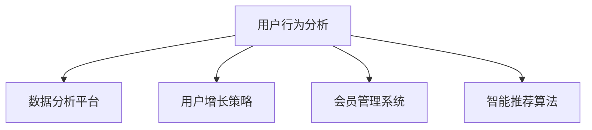

                 

# 知识付费创业中的用户行为分析与应用

> 关键词：知识付费,用户行为,数据分析,应用实践,用户增长策略,会员管理系统,用户留存,推荐算法,智能推荐

## 1. 背景介绍

### 1.1 问题由来
随着互联网和数字技术的快速发展，知识付费成为一种新兴的商业模式。用户愿意为优质内容付费，表明了知识付费市场潜在的巨大需求。然而，知识付费平台在运营过程中也面临诸多挑战，如用户流失率高、付费转化率低、内容同质化等问题。这些挑战的核心是缺乏对用户行为的有效分析和应用，难以制定科学的运营策略。

### 1.2 问题核心关键点
知识付费平台需要从多个维度理解用户行为，包括用户获取、付费行为、内容消费、会员续费等。通过深入分析这些行为数据，平台可以制定精准的用户增长策略，提升用户满意度和忠诚度。例如，通过分析用户支付转化路径，可以优化产品购买流程，降低流失率；通过分析内容偏好，可以推荐用户感兴趣的内容，提升内容消费时长。

## 2. 核心概念与联系

### 2.1 核心概念概述

为更好地理解知识付费平台的用户行为分析与策略应用，本节将介绍几个密切相关的核心概念：

- 用户行为分析：通过收集和分析用户在平台上的行为数据，了解用户行为模式和偏好，为优化产品功能和运营策略提供数据支持。
- 数据分析平台：利用大数据技术对用户行为数据进行采集、存储、处理和分析，提供科学的数据洞察。
- 用户增长策略：基于用户行为分析结果，制定精准的营销和运营策略，提升用户增长和转化率。
- 会员管理系统：通过会员付费体系，提供差异化服务，提升用户粘性和忠诚度。
- 智能推荐算法：通过分析用户行为数据，为用户推荐个性化的内容，提升用户满意度和留存率。

这些核心概念之间的逻辑关系可以通过以下Mermaid流程图来展示：



这个流程图展示了一些关键概念及其之间的相互关系：

1. 用户行为分析：是数据分析和策略制定的起点，通过用户行为数据获取和分析，为后续各个环节提供依据。
2. 数据分析平台：是实现用户行为分析的基础工具，提供数据处理、存储和分析能力。
3. 用户增长策略：是用户行为分析的应用目标，通过科学策略实现用户增长和转化。
4. 会员管理系统：是知识付费平台的重要组成部分，通过会员体系提高用户粘性和忠诚度。
5. 智能推荐算法：是提升内容消费和用户满意度的关键手段，通过个性化推荐增强用户互动。

这些核心概念共同构成了知识付费平台的用户行为分析与策略应用的框架，帮助平台通过数据驱动实现用户增长和收益最大化。

## 3. 核心算法原理 & 具体操作步骤
### 3.1 算法原理概述

知识付费平台的用户行为分析，本质上是一个多维度数据综合处理和挖掘的过程。其核心思想是：通过数据分析平台，从用户行为数据中提取出有价值的信息，如用户兴趣、消费偏好、购买意愿等，从而制定精准的用户增长和运营策略。

形式化地，假设用户行为数据为 $D=\{(x_i,y_i)\}_{i=1}^N, x_i \in \mathcal{X}, y_i \in \mathcal{Y}$，其中 $\mathcal{X}$ 为用户行为特征，$\mathcal{Y}$ 为用户行为标签。知识付费平台的目标是最大化用户增长和转化，即最大化目标函数：

$$
\maximize_{\theta} \mathcal{L}(D,\theta)
$$

其中 $\theta$ 为模型参数，$\mathcal{L}$ 为目标函数，如用户增长率、转化率等。

通过梯度下降等优化算法，平台可以近似求解上述最优化问题，找到最优模型参数 $\theta^*$，使得在用户行为数据 $D$ 上进行训练的模型 $M_{\theta}$ 能够在目标任务上获得最佳性能。

### 3.2 算法步骤详解

知识付费平台的用户行为分析一般包括以下几个关键步骤：

**Step 1: 数据收集与清洗**
- 收集用户在平台上的行为数据，包括注册信息、登录记录、浏览行为、购买行为等。
- 对数据进行清洗，去除噪声和异常值，保证数据质量和完整性。

**Step 2: 特征工程**
- 提取和构造用户行为特征，如访问次数、停留时间、页面转换率、支付金额等。
- 进行特征选择和降维，保留最相关和最具预测性的特征。

**Step 3: 数据分析与建模**
- 使用数据分析平台对用户行为数据进行统计分析，如用户分布、行为趋势、转化漏斗等。
- 选择适当的机器学习算法和模型，如线性回归、随机森林、神经网络等，建立预测模型。

**Step 4: 模型评估与优化**
- 在验证集上评估模型的预测效果，如准确率、召回率、F1分数等。
- 通过交叉验证等方法，选择最优模型和超参数，提高模型性能。

**Step 5: 应用与部署**
- 将优化后的模型应用于实际的运营策略中，如用户增长、会员续费、智能推荐等。
- 实时监测模型效果，根据反馈数据不断调整和优化模型参数。

以上是知识付费平台用户行为分析的一般流程。在实际应用中，还需要根据具体平台的特点，对各环节进行优化设计，如改进特征工程方法，引入更多用户行为指标，设计更合理的目标函数等，以进一步提升模型性能。

### 3.3 算法优缺点

知识付费平台的用户行为分析方法具有以下优点：
1. 数据驱动：通过用户行为数据分析，制定精准的运营策略，提高用户增长和转化率。
2. 预测能力：利用机器学习模型，对用户行为进行预测，帮助平台更好地理解用户需求和行为规律。
3. 自动化程度高：通过自动化分析工具和算法，减少人工干预，提高效率。
4. 模型灵活：可以应用多种机器学习模型，根据实际情况选择最优方法。

同时，该方法也存在一定的局限性：
1. 数据隐私：用户行为数据涉及个人隐私，需要严格保护和合规。
2. 数据质量：数据质量直接影响分析结果的准确性和可靠性，需要保证数据的完整性和一致性。
3. 模型复杂：高级模型如深度学习，需要更高的数据量和计算资源，增加了实现难度。
4. 应用场景有限：某些场景下，用户行为数据分析结果可能与实际业务目标不符，需要进一步优化。

尽管存在这些局限性，但就目前而言，用户行为数据分析已成为知识付费平台提升运营效果的重要手段。未来相关研究的重点在于如何进一步提高数据质量，降低数据隐私风险，同时兼顾模型的可解释性和实用性。

### 3.4 算法应用领域

知识付费平台的用户行为分析方法，在用户增长和运营策略优化中得到了广泛应用，涵盖以下几个主要领域：

- 用户获取与增长：通过分析用户转化路径，优化产品购买流程，降低流失率。
- 内容推荐系统：利用用户行为数据，为用户推荐个性化内容，提升用户满意度和留存率。
- 会员续费策略：基于用户行为分析，制定合理的会员续费方案，提高会员续费率。
- 用户细分与分群：对用户进行细分和分群，提供差异化服务，提升用户粘性和忠诚度。
- 付费转化分析：分析影响付费转化的关键因素，优化产品定价和营销策略。
- 运营效果评估：通过数据分析平台，实时监测和评估运营效果，持续改进运营策略。

除了上述这些经典应用外，用户行为分析还被创新性地应用于更多场景中，如动态定价策略、个性化推荐、行为预测等，为知识付费平台带来新的商业机遇。

## 4. 数学模型和公式 & 详细讲解
### 4.1 数学模型构建

本节将使用数学语言对知识付费平台的用户行为分析过程进行更加严格的刻画。

假设用户行为数据为 $D=\{(x_i,y_i)\}_{i=1}^N, x_i \in \mathcal{X}, y_i \in \mathcal{Y}$。定义模型 $M_{\theta}$ 在输入 $x_i$ 上的预测为 $\hat{y}_i=M_{\theta}(x_i)$，则损失函数 $\mathcal{L}$ 为：

$$
\mathcal{L}(\theta) = \frac{1}{N} \sum_{i=1}^N \ell(\hat{y}_i,y_i)
$$

其中 $\ell$ 为损失函数，如均方误差、交叉熵等。

### 4.2 公式推导过程

以下我们以用户增长预测为例，推导线性回归模型的公式及其梯度计算。

假设模型 $M_{\theta}$ 为线性回归模型，输入特征 $x$ 和目标变量 $y$ 之间的关系为：

$$
y = \theta_0 + \theta_1 x_1 + \theta_2 x_2 + \cdots + \theta_n x_n
$$

即：

$$
y = \sum_{i=1}^n \theta_i x_i + \theta_0
$$

将其代入损失函数 $\mathcal{L}$ 中，得到线性回归模型的损失函数为：

$$
\mathcal{L}(\theta) = \frac{1}{N} \sum_{i=1}^N (y_i - \sum_{i=1}^n \theta_i x_{i,i} - \theta_0)^2
$$

对上式求导，得到损失函数对参数 $\theta$ 的梯度：

$$
\frac{\partial \mathcal{L}(\theta)}{\partial \theta_i} = -2 \frac{1}{N} \sum_{i=1}^N (y_i - \sum_{i=1}^n \theta_i x_{i,i} - \theta_0) x_{i,i}
$$

其中 $x_{i,i}$ 为输入特征向量中的第 $i$ 个元素。

在得到损失函数的梯度后，即可带入参数更新公式，完成模型的迭代优化。重复上述过程直至收敛，最终得到适应用户增长预测的最优模型参数 $\theta^*$。

## 5. 项目实践：代码实例和详细解释说明
### 5.1 开发环境搭建

在进行用户行为分析实践前，我们需要准备好开发环境。以下是使用Python进行PyTorch开发的环境配置流程：

1. 安装Anaconda：从官网下载并安装Anaconda，用于创建独立的Python环境。

2. 创建并激活虚拟环境：
```bash
conda create -n pytorch-env python=3.8 
conda activate pytorch-env
```

3. 安装PyTorch：根据CUDA版本，从官网获取对应的安装命令。例如：
```bash
conda install pytorch torchvision torchaudio cudatoolkit=11.1 -c pytorch -c conda-forge
```

4. 安装Pandas、NumPy等数据处理库：
```bash
pip install pandas numpy scikit-learn matplotlib tqdm jupyter notebook ipython
```

完成上述步骤后，即可在`pytorch-env`环境中开始用户行为分析实践。

### 5.2 源代码详细实现

下面以用户增长预测为例，给出使用Transformers库对线性回归模型进行训练的PyTorch代码实现。

首先，定义用户行为数据集：

```python
import pandas as pd

# 加载用户行为数据
data = pd.read_csv('user_behavior.csv')

# 提取特征和目标变量
features = data[['visit_count', 'time_spent', 'purchase_amount']]
target = data['is_paid']

# 划分训练集和测试集
train_ratio = 0.8
train_size = int(train_ratio * len(features))
train_features, test_features = features.iloc[:train_size], features.iloc[train_size:]
train_target, test_target = target.iloc[:train_size], target.iloc[train_size:]
```

然后，定义模型和优化器：

```python
from torch.utils.data import TensorDataset, DataLoader
from torch import nn, optim

# 定义线性回归模型
class LinearRegression(nn.Module):
    def __init__(self, input_dim):
        super(LinearRegression, self).__init__()
        self.linear = nn.Linear(input_dim, 1)
    
    def forward(self, x):
        return self.linear(x)

# 初始化模型参数
input_dim = features.shape[1]
model = LinearRegression(input_dim)

# 定义优化器和损失函数
optimizer = optim.SGD(model.parameters(), lr=0.01)
criterion = nn.MSELoss()

# 定义数据加载器
train_dataset = TensorDataset(torch.tensor(train_features.values), torch.tensor(train_target.values))
test_dataset = TensorDataset(torch.tensor(test_features.values), torch.tensor(test_target.values))
train_loader = DataLoader(train_dataset, batch_size=32, shuffle=True)
test_loader = DataLoader(test_dataset, batch_size=32, shuffle=False)
```

接着，定义训练和评估函数：

```python
from tqdm import tqdm

# 训练函数
def train(model, train_loader, optimizer, criterion, num_epochs):
    model.train()
    total_loss = 0
    for epoch in range(num_epochs):
        for batch_idx, (features, targets) in enumerate(tqdm(train_loader)):
            features = features.to(device)
            targets = targets.to(device)
            optimizer.zero_grad()
            outputs = model(features)
            loss = criterion(outputs, targets)
            loss.backward()
            optimizer.step()
            total_loss += loss.item()
    return total_loss / len(train_loader)

# 评估函数
def evaluate(model, test_loader):
    model.eval()
    total_loss = 0
    for batch_idx, (features, targets) in enumerate(tqdm(test_loader)):
        features = features.to(device)
        targets = targets.to(device)
        with torch.no_grad():
            outputs = model(features)
            loss = criterion(outputs, targets)
            total_loss += loss.item()
    return total_loss / len(test_loader)

# 运行训练和评估过程
device = torch.device('cuda') if torch.cuda.is_available() else torch.device('cpu')
model.to(device)
num_epochs = 100

total_train_loss = train(model, train_loader, optimizer, criterion, num_epochs)
total_test_loss = evaluate(model, test_loader)
print(f'Train loss: {total_train_loss:.3f}, Test loss: {total_test_loss:.3f}')
```

以上就是使用PyTorch对线性回归模型进行用户增长预测的完整代码实现。可以看到，在 Transformers 库的帮助下，模型的搭建和训练过程非常简单，且易于扩展。

### 5.3 代码解读与分析

让我们再详细解读一下关键代码的实现细节：

**数据处理函数**：
- `data.read_csv()`：从CSV文件中加载用户行为数据，构建DataFrame对象。
- `features` 和 `target`：分别表示输入特征和目标变量，划分训练集和测试集。

**模型定义**：
- `nn.Linear()`：定义线性回归模型的线性层。
- `nn.Module`：定义模型类，继承自nn.Module，方便在模型中添加其他层。

**优化器与损失函数**：
- `optim.SGD()`：定义随机梯度下降优化器，用于参数更新。
- `nn.MSELoss()`：定义均方误差损失函数，用于衡量模型预测与真实值之间的差距。

**数据加载器**：
- `TensorDataset()`：定义Tensor形式的训练集和测试集，方便数据加载。
- `DataLoader()`：定义数据加载器，批量加载数据，并进行数据增强。

**训练与评估函数**：
- `train()`：定义训练函数，迭代训练模型。
- `evaluate()`：定义评估函数，计算模型在测试集上的损失。

**运行训练和评估过程**：
- `device`：定义使用GPU还是CPU进行计算。
- `model.to(device)`：将模型迁移到指定设备。
- `num_epochs`：定义训练轮数。

以上代码实现了线性回归模型的用户增长预测过程。开发者可以根据需要，继续添加更多用户行为特征，优化模型结构，提升预测准确率。

## 6. 实际应用场景
### 6.1 智能推荐系统

知识付费平台的智能推荐系统，通过对用户行为数据的分析，可以精准推荐用户感兴趣的内容，提升内容消费时长和用户粘性。

在技术实现上，可以收集用户的内容浏览、收藏、评论、购买等行为数据，构建用户画像。使用协同过滤、基于内容的推荐算法，为用户推荐相关内容。对于新内容，可以通过新闻推荐、热门推荐等手段提升曝光度，同时根据用户反馈进行动态调整，优化推荐效果。

### 6.2 用户增长与留存

知识付费平台的运营策略中，用户增长和留存至关重要。通过用户行为分析，平台可以制定更加精准的用户增长策略，如优化产品页面设计、改进购买流程、提升用户体验等。

对于已付费用户，通过分析用户的支付路径和消费行为，可以设计合理的续费策略，如赠送优惠、推出会员特权等，提升续费率。同时，可以通过分析用户流失原因，优化用户留存策略，如改进内容推荐、提供个性化服务、增强用户互动等，提升用户满意度，减少流失率。

### 6.3 个性化服务

知识付费平台可以通过用户行为数据分析，提供更加个性化的服务，提升用户体验和满意度。

例如，针对不同类型的用户，可以设计不同的内容推荐策略。对于新用户，可以推荐入门级的课程，提升其对平台的信任度；对于老用户，可以推荐其曾经感兴趣的内容，增强粘性；对于会员用户，可以推荐高价值课程，提升其满意度。同时，可以通过分析用户行为数据，提供定制化课程推荐、专属学习计划等服务，增强用户粘性和忠诚度。

### 6.4 未来应用展望

随着用户行为数据分析技术的不断进步，知识付费平台的应用前景将更加广阔。

在智慧教育领域，通过对学生行为数据的分析，可以制定更加精准的教学策略，提升教学效果。例如，通过分析学生的学习行为和偏好，推荐合适的课程和学习资源，提升学习效率和成绩。

在智慧企业服务中，通过对员工行为数据的分析，可以优化工作流程，提升工作效率。例如，通过分析员工的工作习惯和知识需求，推荐相关培训和资源，提升员工技能和绩效。

在智慧健康医疗领域，通过对患者的健康行为数据进行分析，可以提供更加个性化的健康管理方案。例如，通过分析患者的饮食、运动、作息等行为数据，推荐合适的健康建议和生活方式，提升患者的生活质量。

随着技术的不断演进，用户行为数据分析将应用于更多领域，为各个行业带来新的创新和机遇。

## 7. 工具和资源推荐
### 7.1 学习资源推荐

为了帮助开发者系统掌握用户行为分析的理论基础和实践技巧，这里推荐一些优质的学习资源：

1. 《数据科学与人工智能基础》课程：由Coursera平台提供，涵盖数据科学和人工智能的基本概念和技能，适合初学者入门。

2. 《Python数据分析》书籍：详细讲解Python在数据处理、数据可视化等方面的应用，适合需要学习数据分析的开发者。

3. 《机器学习实战》书籍：通过大量实际案例，深入浅出地介绍机器学习算法和实现方法，适合进阶学习者。

4. 《用户行为分析》在线课程：通过实际的案例讲解，帮助开发者掌握用户行为分析的方法和工具。

5. Kaggle：数据科学和机器学习的竞赛平台，提供大量的真实世界数据集和挑战，适合进行数据分析和模型训练实践。

通过对这些资源的学习实践，相信你一定能够快速掌握用户行为分析的精髓，并用于解决实际的运营问题。

### 7.2 开发工具推荐

高效的开发离不开优秀的工具支持。以下是几款用于用户行为分析开发的常用工具：

1. Jupyter Notebook：提供交互式编程环境，方便编写和运行代码，适合数据分析和模型训练。

2. Visual Studio Code：强大的代码编辑器，支持代码高亮、调试、自动补全等功能，适合开发者进行代码编写和调试。

3. Tableau：数据可视化工具，可以将复杂的数据分析结果以图形化的方式展示，方便业务人员理解和使用。

4. Apache Hadoop：分布式计算框架，支持大规模数据处理和存储，适合处理海量用户行为数据。

5. Apache Spark：快速的大数据处理引擎，支持数据清洗、数据处理和模型训练等，适合进行大规模数据分析。

合理利用这些工具，可以显著提升用户行为分析任务的开发效率，加快创新迭代的步伐。

### 7.3 相关论文推荐

用户行为分析技术的发展源于学界的持续研究。以下是几篇奠基性的相关论文，推荐阅读：

1. 《User Behavioral Data Analysis for Personalized Recommendation Systems》：介绍了用户行为数据分析的基本方法和应用，适合初学者入门。

2. 《Collaborative Filtering for Recommendation Systems》：详细讲解了协同过滤算法的原理和实现方法，适合进一步深入学习。

3. 《Deep Learning for Personalized Recommendation and Content Discovery》：介绍了深度学习在个性化推荐系统中的应用，适合进阶学习者。

4. 《A Deep Dive into User Behavior Analysis》：通过大量案例，深入讲解用户行为数据分析的方法和工具，适合实战应用。

5. 《User Growth Strategies with Machine Learning》：介绍了机器学习在用户增长策略中的应用，适合实际应用操作。

这些论文代表了大用户行为分析技术的发展脉络。通过学习这些前沿成果，可以帮助研究者把握学科前进方向，激发更多的创新灵感。

## 8. 总结：未来发展趋势与挑战

### 8.1 总结

本文对知识付费平台的用户行为分析方法进行了全面系统的介绍。首先阐述了用户行为分析在知识付费平台运营中的重要性和应用场景，明确了通过用户行为数据分析制定运营策略的目标。其次，从原理到实践，详细讲解了用户行为分析的数学模型和关键步骤，给出了用户行为分析任务开发的完整代码实例。同时，本文还广泛探讨了用户行为分析方法在智能推荐系统、用户增长、个性化服务等多个领域的应用前景，展示了用户行为分析技术的巨大潜力。此外，本文精选了用户行为分析技术的各类学习资源，力求为读者提供全方位的技术指引。

通过本文的系统梳理，可以看到，用户行为分析技术在知识付费平台运营中具有重要的战略意义，能够帮助平台提升用户增长、留存和满意度，推动平台向更加智能化、个性化的方向发展。未来，伴随用户行为数据分析技术的不断进步，知识付费平台的应用前景将更加广阔，为知识付费行业带来深远的影响。

### 8.2 未来发展趋势

展望未来，用户行为分析技术将呈现以下几个发展趋势：

1. 自动化程度更高：通过引入自动化机器学习工具，自动化用户行为分析流程，减少人工干预，提高效率。

2. 数据质量更高：通过数据清洗、去噪、补全等手段，提高数据质量，提升分析结果的准确性。

3. 多模态数据分析：将文本、图像、视频等多模态数据结合，全面分析用户行为，提供更加精准的服务。

4. 深度学习模型应用：利用深度学习模型，挖掘用户行为数据中的隐藏规律，提升预测和推荐效果。

5. 实时分析和反馈：实现用户行为分析的实时化，快速响应用户需求，提升用户体验。

6. 多用户分析：对多个用户的行为进行综合分析，找出共性规律和个性化特征，提升群体服务质量。

以上趋势凸显了用户行为分析技术的广阔前景。这些方向的探索发展，必将进一步提升知识付费平台的运营效果，为用户带来更好的体验，推动平台向更高的智能化水平迈进。

### 8.3 面临的挑战

尽管用户行为分析技术已经取得了瞩目成就，但在迈向更加智能化、普适化应用的过程中，它仍面临着诸多挑战：

1. 数据隐私和合规：用户行为数据涉及个人隐私，需要严格保护和合规，避免数据泄露和滥用。

2. 数据质量和多样性：数据质量和多样性直接影响分析结果的准确性和全面性，需要全面收集和处理用户行为数据。

3. 模型复杂度和效率：高级模型如深度学习，需要更高的计算资源和数据量，增加了实现难度。

4. 模型可解释性和透明性：模型决策过程的透明性和可解释性，对用户行为分析的应用推广具有重要意义。

5. 应用场景限制：用户行为分析方法在某些场景下可能与实际业务目标不符，需要进一步优化。

6. 用户习惯变化：用户行为和偏好会随时间变化，需要实时更新模型和算法，保持准确性和适用性。

正视用户行为分析面临的这些挑战，积极应对并寻求突破，将是大数据和人工智能技术共同演进的必然路径。相信随着技术的不断进步和应用的不断成熟，用户行为分析技术必将在知识付费平台运营中发挥更加重要的作用。

### 8.4 研究展望

面向未来，用户行为分析技术的研究方向主要集中在以下几个方面：

1. 自动化和智能化：探索自动化机器学习工具，提高用户行为分析的自动化程度和智能化水平。

2. 跨模态融合：研究多模态数据融合技术，提升用户行为分析的全面性和准确性。

3. 实时分析和反馈：研究实时分析和反馈技术，快速响应用户需求，提升用户体验。

4. 可解释性和透明性：研究可解释性和透明性技术，提高用户行为分析的可靠性和可信度。

5. 多用户分析：研究多用户行为综合分析方法，提升群体服务质量和个性化服务水平。

6. 大数据处理技术：研究大数据处理技术，提高用户行为分析的数据处理和存储能力。

这些研究方向将推动用户行为分析技术向更加自动化、智能化、实时化和可解释化的方向发展，为知识付费平台带来新的创新和机遇。相信伴随技术的不断进步和应用的不断成熟，用户行为分析技术必将推动知识付费平台向更高智能化水平迈进，为用户提供更加优质的服务。

## 9. 附录：常见问题与解答

**Q1：如何选择合适的用户行为特征？**

A: 选择合适的用户行为特征需要结合具体的业务场景和目标。一般可以从以下几个维度进行考虑：
1. 用户属性：如用户年龄、性别、职业、地域等，可以提供用户基本信息。
2. 行为数据：如访问次数、停留时间、页面转换率、购买金额等，可以反映用户行为特征。
3. 内容数据：如内容评分、评论、互动等，可以反映用户对内容的兴趣和评价。

通过特征工程和模型选择，找到最适合的特征组合，提升分析效果。

**Q2：如何处理用户行为数据的缺失值？**

A: 用户行为数据往往存在缺失值，需要采取适当的方法进行处理。常见的处理方法包括：
1. 删除缺失值：对于数据量较大的情况，可以删除缺失值。
2. 填补缺失值：使用均值、中位数、众数等方法填补缺失值。
3. 插值法：使用插值法根据已知数据进行填补。
4. 模型预测：使用模型预测缺失值，如KNN、随机森林等。

根据具体业务场景，选择合适的处理方法，确保数据质量。

**Q3：如何进行特征降维？**

A: 特征降维可以提升模型的计算效率和预测能力。常见的降维方法包括：
1. 主成分分析(PCA)：将高维特征转换为低维特征，保留主要信息。
2. 线性判别分析(LDA)：通过线性变换，将特征映射到低维空间，提高分类准确率。
3. 奇异值分解(SVD)：通过奇异值分解，保留主要信息，去除噪声。

通过特征降维，去除冗余特征，提升模型性能。

**Q4：如何评估用户行为分析模型的效果？**

A: 用户行为分析模型的效果评估需要结合具体业务场景和目标，常用的评估指标包括：
1. 准确率、召回率、F1分数：衡量模型的分类准确率。
2. ROC曲线、AUC值：衡量模型的分类效果。
3. RMSE、MAE：衡量模型的回归准确率。
4. 用户增长率、留存率：衡量运营策略的效果。

根据具体指标，评估模型效果，不断优化模型和策略。

**Q5：如何实现用户行为分析的实时化？**

A: 用户行为分析的实时化需要建立实时数据采集、存储和处理机制，常用的技术包括：
1. 数据流处理框架：如Apache Kafka、Apache Flink等，支持实时数据处理和存储。
2. 实时数据库：如Apache Cassandra、MongoDB等，支持实时查询和存储。
3. 数据流计算平台：如Apache Storm、Spark Streaming等，支持实时计算和分析。

通过实时数据处理和分析，实现用户行为分析的实时化，快速响应用户需求。

---

作者：禅与计算机程序设计艺术 / Zen and the Art of Computer Programming

