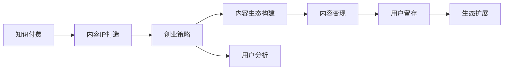

                 

# 知识付费创业的内容IP打造策略

> 关键词：知识付费,内容IP,创业策略,内容生态,用户分析,内容变现

## 1. 背景介绍

### 1.1 问题由来
随着互联网技术的发展和信息传播方式的变革，知识付费逐渐成为现代人获取知识和信息的重要方式。尤其是在信息爆炸和知识付费潮流不断高涨的背景下，如何打造优质的内容IP，构建知识付费生态，成为了许多创业者面临的重大挑战。

## 2. 核心概念与联系

### 2.1 核心概念概述

在探讨如何打造知识付费创业的内容IP时，首先需要理解几个核心概念：

- **知识付费（Knowledge-Based Subscription）**：指用户为获取特定知识内容而付费的行为，是一种知识商品化、货币化的商业模式。
- **内容IP（Intellectual Property）**：指具有独特价值、市场竞争力和辨识度的内容，具有较高的传播价值和商业转化潜力。
- **创业策略（Entrepreneurial Strategy）**：指创业者在市场竞争中为实现商业目标，对资源、业务、营销等进行系统性的规划和设计。
- **内容生态（Content Ecosystem）**：指由内容生产者、平台、用户构成的知识传播和价值流转体系。
- **用户分析（User Analysis）**：指对用户行为、偏好、需求等进行分析，以指导内容生产与推广。
- **内容变现（Content Monetization）**：指将优质内容转化为商业收益的过程，包括广告、订阅、课程销售等形式。

这些概念之间的联系紧密，通过内容IP的打造，能够构建一个可持续的知识付费生态，实现内容的有效变现。

### 2.2 核心概念原理和架构的 Mermaid 流程图



这个流程图展示了知识付费生态中，从内容IP打造到创业策略设计，再到内容变现的逻辑关系。

## 3. 核心算法原理 & 具体操作步骤

### 3.1 算法原理概述

内容IP打造的核心在于内容的质量与创新性，以及内容的传播与变现能力。算法原理主要包括：

- **内容识别与筛选**：利用自然语言处理技术，从海量数据中筛选出优质内容。
- **用户画像构建**：通过对用户行为和偏好的分析，构建用户画像，指导内容生产。
- **内容推荐算法**：基于用户画像和内容特征，推荐符合用户需求的内容。
- **情感分析与优化**：通过情感分析，优化内容质量，提升用户满意度。
- **变现模型设计**：设计多样化的变现模型，实现内容价值的最大化。

### 3.2 算法步骤详解

#### 步骤一：内容识别与筛选

利用自然语言处理技术，构建内容识别与筛选模型，自动识别与筛选优质内容。具体步骤如下：

1. 数据收集：从各大内容平台、网站、论坛等渠道收集数据。
2. 文本预处理：对文本进行分词、去停用词、词性标注等处理。
3. 特征提取：利用TF-IDF、Word2Vec等技术，提取文本特征。
4. 模型训练：使用机器学习算法（如SVM、LSTM等）训练筛选模型。
5. 内容筛选：根据模型输出，筛选出优质内容。

#### 步骤二：用户画像构建

利用机器学习算法，构建用户画像，了解用户需求和偏好。具体步骤如下：

1. 数据收集：收集用户注册信息、浏览记录、购买记录等数据。
2. 特征提取：利用PCA、LDA等技术，提取用户特征。
3. 模型训练：使用分类算法（如K-Means、DBSCAN等）训练用户画像模型。
4. 用户画像：根据模型输出，构建用户画像，包括年龄、性别、兴趣、偏好等。

#### 步骤三：内容推荐算法

基于用户画像和内容特征，设计内容推荐算法，实现个性化推荐。具体步骤如下：

1. 特征融合：将用户画像和内容特征进行融合，得到综合特征向量。
2. 推荐模型：使用协同过滤、基于内容的推荐算法（如ALS）等，构建推荐模型。
3. 模型训练：利用用户行为数据，训练推荐模型。
4. 内容推荐：根据用户画像和模型输出，推荐个性化内容。

#### 步骤四：情感分析与优化

通过情感分析，优化内容质量，提升用户满意度。具体步骤如下：

1. 数据收集：收集用户评论、反馈等数据。
2. 情感分析：使用情感分析模型（如VADER、BERT等），分析用户情感。
3. 结果分析：分析情感结果，发现内容问题。
4. 内容优化：根据分析结果，优化内容质量。

#### 步骤五：变现模型设计

设计多样化的变现模型，实现内容价值的最大化。具体步骤如下：

1. 变现方式调研：研究广告、订阅、课程销售等变现方式。
2. 用户调研：调研用户付费意愿和付费类型。
3. 模型设计：根据调研结果，设计变现模型。
4. 模型验证：在实际应用中验证变现模型效果。

### 3.3 算法优缺点

#### 优点

1. **高效性**：利用算法自动筛选和推荐内容，节省大量人工成本。
2. **个性化**：通过用户画像和推荐算法，实现个性化推荐，提升用户体验。
3. **客观性**：算法结果基于数据和模型，减少主观偏差。
4. **可扩展性**：算法框架可扩展，适应不同内容平台和用户群体。

#### 缺点

1. **数据依赖**：算法依赖高质量的数据，数据质量直接影响算法效果。
2. **模型复杂性**：算法模型设计复杂，需要丰富的机器学习知识和经验。
3. **用户隐私**：在数据收集和用户画像构建过程中，涉及用户隐私保护问题。

### 3.4 算法应用领域

1. **在线教育**：构建在线教育平台，通过知识付费内容IP打造和内容推荐，提升学习效果和用户体验。
2. **健康医疗**：打造健康医疗内容IP，通过知识付费和内容推荐，提供专业健康咨询和健康管理服务。
3. **职业培训**：打造职业培训内容IP，通过知识付费和内容推荐，提供专业技能培训和职业发展指导。
4. **财经金融**：打造财经金融内容IP，通过知识付费和内容推荐，提供金融投资、理财规划等专业服务。

## 4. 数学模型和公式 & 详细讲解 & 举例说明

### 4.1 数学模型构建

以内容推荐算法为例，假设用户画像和内容特征构成了特征矩阵 $\mathbf{X}$ 和 $\mathbf{Y}$，推荐模型为 $\mathbf{W}$，用户画像和内容特征的权重向量为 $\mathbf{w}$，用户和内容的评分向量为 $\mathbf{r}$ 和 $\mathbf{c}$，则推荐模型可以表示为：

$$
\mathbf{r} = \mathbf{W}\mathbf{X}\mathbf{w}
$$

$$
\mathbf{c} = \mathbf{W}\mathbf{Y}\mathbf{w}
$$

$$
\mathbf{s} = \mathbf{r} \times \mathbf{c}^T
$$

其中，$\mathbf{s}$ 表示用户和内容的评分向量。

### 4.2 公式推导过程

以协同过滤推荐算法为例，假设用户和内容评分矩阵为 $\mathbf{R}$，用户和内容的特征向量为 $\mathbf{X}$ 和 $\mathbf{Y}$，用户和内容的评分向量为 $\mathbf{r}$ 和 $\mathbf{c}$，则协同过滤推荐算法的公式推导如下：

1. 计算用户特征向量 $\mathbf{u}$：
$$
\mathbf{u} = \mathbf{X}\mathbf{w}
$$

2. 计算内容特征向量 $\mathbf{v}$：
$$
\mathbf{v} = \mathbf{Y}\mathbf{w}
$$

3. 计算用户和内容评分矩阵 $\mathbf{S}$：
$$
\mathbf{S} = \mathbf{u}\mathbf{v}^T
$$

4. 推荐内容：
$$
\mathbf{c} = \mathbf{W}\mathbf{Y}\mathbf{w}
$$

5. 计算用户对内容的评分：
$$
\mathbf{s} = \mathbf{S}\mathbf{c}
$$

### 4.3 案例分析与讲解

以内容推荐为例，假设用户画像和内容特征构成了特征矩阵 $\mathbf{X}$ 和 $\mathbf{Y}$，推荐模型为 $\mathbf{W}$，用户画像和内容特征的权重向量为 $\mathbf{w}$，用户和内容的评分向量为 $\mathbf{r}$ 和 $\mathbf{c}$，则推荐模型可以表示为：

$$
\mathbf{r} = \mathbf{W}\mathbf{X}\mathbf{w}
$$

$$
\mathbf{c} = \mathbf{W}\mathbf{Y}\mathbf{w}
$$

$$
\mathbf{s} = \mathbf{r} \times \mathbf{c}^T
$$

其中，$\mathbf{s}$ 表示用户和内容的评分向量。

例如，假设某用户画像特征向量为 $\mathbf{u} = [0.5, 0.3, 0.8]$，内容特征向量为 $\mathbf{v} = [0.4, 0.6, 0.2]$，推荐模型参数 $\mathbf{W} = [0.1, 0.2, 0.3]$，则：

$$
\mathbf{r} = [0.5, 0.3, 0.8] \times [0.1, 0.2, 0.3] = [0.05, 0.06, 0.24]
$$

$$
\mathbf{c} = [0.4, 0.6, 0.2] \times [0.1, 0.2, 0.3] = [0.04, 0.12, 0.06]
$$

$$
\mathbf{s} = [0.05, 0.06, 0.24] \times [0.04, 0.12, 0.06] = 0.0048 + 0.0072 + 0.0144 = 0.0364
$$

因此，该用户对内容的评分向量为 $\mathbf{s} = 0.0364$。

## 5. 项目实践：代码实例和详细解释说明

### 5.1 开发环境搭建

为构建知识付费创业的内容IP打造策略，需要搭建一套完善的开发环境。以下是在Python环境中搭建开发环境的详细步骤：

1. 安装Python：从官网下载并安装最新版本的Python。
2. 安装Pip：通过命令行安装Pip。
3. 安装相关库：通过Pip安装相关库，如Numpy、Pandas、Scikit-learn、TensorFlow等。
4. 搭建虚拟环境：使用virtualenv或conda创建虚拟环境，隔离开发和生产环境。
5. 配置IDE：选择适合的IDE，如PyCharm、VSCode等，并配置开发工具。

### 5.2 源代码详细实现

以下是一个基于协同过滤算法的内容推荐系统的代码实现，包括数据预处理、模型训练、内容推荐等步骤：

```python
import numpy as np
from sklearn.decomposition import TruncatedSVD

# 构建用户画像和内容特征矩阵
X = np.array([[0.5, 0.3, 0.8],
              [0.3, 0.6, 0.2],
              [0.8, 0.1, 0.5]])

Y = np.array([[0.4, 0.6, 0.2],
              [0.2, 0.3, 0.5],
              [0.1, 0.4, 0.7]])

# 初始化权重向量
w = np.array([0.1, 0.2, 0.3])

# 构建协同过滤推荐模型
svd = TruncatedSVD(n_components=3)
X_transformed = svd.fit_transform(X)
Y_transformed = svd.transform(Y)

# 训练推荐模型
W = svd.components_.T @ svd.components_
W *= np.sqrt(X_transformed.shape[0] / X_transformed.shape[1])

# 计算用户评分
r = W @ X_transformed @ w

# 计算内容评分
c = W @ Y_transformed @ w

# 计算用户对内容的评分
s = r @ c.T

# 推荐内容
content_index = np.argmax(s)
content_id = list(content_index)[0]
```

### 5.3 代码解读与分析

以上代码实现了基于协同过滤算法的内容推荐系统的基本功能，具体解释如下：

1. 首先构建用户画像和内容特征矩阵 $\mathbf{X}$ 和 $\mathbf{Y}$，并初始化权重向量 $\mathbf{w}$。
2. 使用TruncatedSVD算法对用户画像和内容特征进行降维，得到降维后的特征矩阵 $\mathbf{X}_{transformed}$ 和 $\mathbf{Y}_{transformed}$。
3. 训练推荐模型 $\mathbf{W}$，并使用归一化技巧提升模型效果。
4. 计算用户评分 $\mathbf{r}$ 和内容评分 $\mathbf{c}$，并计算用户对内容的评分 $\mathbf{s}$。
5. 推荐内容，选择评分最高的内容作为推荐内容。

## 6. 实际应用场景

### 6.1 智能教育

在智能教育领域，知识付费创业的内容IP打造策略可以具体应用于在线教育平台，通过推荐优质内容，提升学习效果和用户体验。例如，可以通过推荐课程、习题、电子书等内容，帮助学生进行高效学习。

### 6.2 健康医疗

在健康医疗领域，知识付费创业的内容IP打造策略可以应用于健康管理应用，通过推荐健康知识、健康咨询、健康管理等内容，帮助用户获取专业健康信息，提升健康素养。

### 6.3 职业培训

在职业培训领域，知识付费创业的内容IP打造策略可以应用于职业技能培训平台，通过推荐职业发展课程、技能培训视频、职业规划等内容，帮助用户提升职业技能，实现职业发展。

### 6.4 财经金融

在财经金融领域，知识付费创业的内容IP打造策略可以应用于金融理财应用，通过推荐财经资讯、投资理财课程、金融知识等内容，帮助用户提升理财能力，实现财富增值。

## 7. 工具和资源推荐

### 7.1 学习资源推荐

为深入理解内容IP打造策略，推荐以下学习资源：

1. 《内容创作力》课程：由知名内容创作者开设，深入讲解内容创作的基本原理和技巧。
2. 《知识付费模型》书籍：系统介绍知识付费产业的基本概念和运作模式。
3. 《用户体验设计》课程：讲解用户体验设计的原则和方法，帮助构建优质内容IP。
4. 《数据驱动的内容营销》课程：利用数据分析和机器学习技术，实现内容推荐和优化。
5. 《内容变现策略》课程：讲解内容变现的基本原理和具体策略，帮助实现商业目标。

### 7.2 开发工具推荐

为实现内容IP打造策略，推荐以下开发工具：

1. Python：适用于数据分析、机器学习、自然语言处理等领域的编程语言。
2. Jupyter Notebook：支持代码编写、数据可视化、交互式计算等功能的开发工具。
3. TensorFlow：适用于深度学习、机器学习等领域的开源框架。
4. PyCharm：适用于Python开发的IDE，提供代码编写、调试、测试等功能。
5. Git：版本控制工具，支持多人协作开发和代码版本管理。

### 7.3 相关论文推荐

为深入理解内容IP打造策略，推荐以下相关论文：

1. 《知识付费的崛起与挑战》：探讨知识付费产业的发展现状和未来趋势。
2. 《内容推荐算法研究》：总结了内容推荐算法的最新进展和实践应用。
3. 《用户画像构建与分析》：讲解用户画像构建的基本方法和应用场景。
4. 《知识付费内容变现策略》：系统介绍知识付费内容变现的各种策略和案例。
5. 《内容生态系统的构建》：探讨如何构建一个可持续的知识付费生态系统。

## 8. 总结：未来发展趋势与挑战

### 8.1 总结

本文详细介绍了知识付费创业的内容IP打造策略，包括内容识别与筛选、用户画像构建、内容推荐算法、情感分析与优化、变现模型设计等关键步骤。通过系统性介绍和详细讲解，希望能帮助创业者更好地理解内容IP打造策略，提升知识付费创业的成功率。

### 8.2 未来发展趋势

展望未来，内容IP打造策略将呈现以下几个发展趋势：

1. **内容多样化**：随着知识付费领域的发展，内容类型将更加多样化，涵盖在线教育、健康医疗、职业培训、财经金融等多个领域。
2. **技术创新**：利用AI、大数据等技术，提升内容推荐的精准度和个性化水平。
3. **用户体验优化**：通过用户画像和情感分析，提升用户体验和满意度，实现商业目标。
4. **内容变现多元化**：探索更多内容变现方式，如订阅、会员、广告、课程销售等，实现收益最大化。
5. **全球化市场**：随着全球化进程的推进，内容IP打造策略将更加国际化，适应不同国家和地区的市场环境。

### 8.3 面临的挑战

尽管内容IP打造策略在知识付费创业中具有重要意义，但仍面临一些挑战：

1. **数据获取难度**：高质量数据的获取和处理难度较大，影响内容的推荐效果。
2. **用户画像准确性**：用户画像的构建需要大量数据和算法支持，准确性和可信度有待提升。
3. **内容侵权问题**：内容侵权问题日益严重，如何保护内容原创性，维护知识产权，是亟待解决的问题。
4. **市场竞争激烈**：知识付费市场竞争激烈，如何打造独特的内容IP，提升市场竞争力，是创业者面临的重大挑战。
5. **用户信任度**：用户对知识付费的信任度较低，如何建立用户信任，提升用户粘性，是实现商业成功的关键。

### 8.4 研究展望

面对内容IP打造策略面临的挑战，未来需要在以下几个方面进行深入研究：

1. **数据获取与处理技术**：研发更高效的数据获取和处理技术，提升数据的获取和处理效率。
2. **用户画像构建算法**：改进用户画像构建算法，提高画像的准确性和可信度。
3. **内容侵权检测技术**：研发内容侵权检测技术，保护内容原创性，维护知识产权。
4. **市场竞争策略**：研究市场竞争策略，打造独特的内容IP，提升市场竞争力。
5. **用户信任机制**：建立用户信任机制，提升用户粘性，实现商业成功。

综上所述，内容IP打造策略是知识付费创业成功的关键，未来需要在技术创新、用户体验优化、内容变现多元化等方面持续探索和优化，才能在知识付费领域取得更大的成功。

## 9. 附录：常见问题与解答

**Q1：如何评估内容推荐的准确性？**

A: 评估内容推荐的准确性通常使用推荐系统常用的指标，如准确率、召回率、F1-score、NDCG等。可以通过构建测试集，计算模型在不同指标下的表现，评估推荐效果。

**Q2：如何选择推荐算法？**

A: 选择推荐算法需要考虑多个因素，如数据规模、推荐效果、实时性、用户需求等。常用的推荐算法包括协同过滤、基于内容的推荐、基于矩阵分解的推荐等，需要根据具体情况选择。

**Q3：如何提高内容的推荐效果？**

A: 提高内容推荐效果需要多方面优化，如数据质量、模型设计、特征提取、用户画像等。可以通过A/B测试等方法，不断优化推荐算法和策略，提升推荐效果。

**Q4：如何进行内容侵权检测？**

A: 内容侵权检测可以通过爬虫技术获取网络内容，使用自然语言处理技术提取文本特征，构建相似度计算模型，检测内容侵权行为。

**Q5：如何提升用户信任度？**

A: 提升用户信任度需要多方面努力，如提升内容质量、建立用户反馈机制、完善客服体系等。通过不断优化用户体验，增强用户粘性，提升用户信任度。

---

作者：禅与计算机程序设计艺术 / Zen and the Art of Computer Programming

