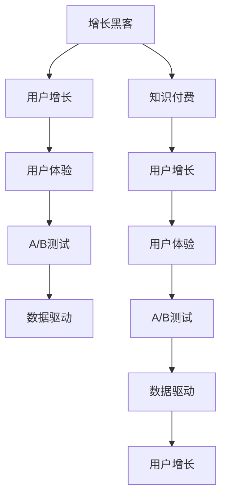

                 

# 知识付费创业的增长黑客技巧

> 关键词：知识付费, 增长黑客, 创业, 用户增长, 用户体验, 数据驱动

## 1. 背景介绍

### 1.1 问题由来
在互联网快速发展的今天，知识付费市场呈现出蓬勃发展的态势。知识付费不仅改变了人们获取信息的方式，也创造了新的商业模式和利润增长点。越来越多的创业者和企业加入到知识付费的行列中，希望通过优质的内容和服务获得用户增长和收益提升。然而，知识付费创业同样面临着巨大的挑战，用户增长和留存问题尤为突出。如何有效利用增长黑客技巧，推动知识付费业务的增长，成为当前亟待解决的重要课题。

### 1.2 问题核心关键点
知识付费创业的增长问题主要体现在以下几个方面：
- 用户获取难度大：知识付费平台需要精准定位目标用户，并以较低的成本获得有效流量。
- 用户体验复杂：知识付费产品内容丰富，使用场景复杂，如何提升用户体验，增加用户粘性，是核心挑战之一。
- 用户留存率低：大多数用户购买知识付费产品后，活跃度不高，难以转化为长期用户，提高留存率是关键。
- 数据驱动决策：知识付费平台需要依赖数据进行精准运营，优化产品策略，提升整体效果。

## 2. 核心概念与联系

### 2.1 核心概念概述

为更好地理解增长黑客技巧在知识付费创业中的应用，本节将介绍几个关键概念：

- 增长黑客(Growth Hacker)：一种以数据驱动、实验为基础的增长方法论，强调通过小步快跑、快速迭代的方式，优化产品策略，实现用户增长。
- 知识付费：基于互联网的知识产品化、货币化，用户通过付费获取深度、系统、优质的知识内容。
- 用户增长(User Growth)：通过精准的营销策略和产品优化，不断扩大用户基数和提升用户活跃度。
- 用户体验(User Experience)：用户在使用产品过程中的体验感受，包括易用性、满意度、流畅性等方面。
- A/B测试(A/B Testing)：通过对比两组不同策略的用户反馈，找出最有效的方案，优化产品功能。
- 数据驱动(Data-Driven)：通过收集和分析数据，指导产品策略优化，提升业务效果。

这些概念之间存在紧密的联系，共同构成了知识付费创业用户增长的核心框架，使得增长黑客技巧能够有效应用在各个环节，实现持续的用户增长和留存。

### 2.2 核心概念原理和架构的 Mermaid 流程图



该流程图展示了增长黑客在知识付费创业中的作用机制：通过数据驱动的策略优化，利用A/B测试验证效果，持续提升用户体验，最终实现用户增长和留存。

## 3. 核心算法原理 & 具体操作步骤

### 3.1 算法原理概述

增长黑客技巧的核心理念是通过快速迭代、小步快跑的方式，不断测试和优化产品策略，实现用户增长和留存。基于知识付费的特点，增长黑客在应用时需重点关注以下几个方面：

- 用户获取：通过精准的用户画像和高效的渠道投放，以较低成本获取有效流量。
- 转化率提升：优化产品体验和价值主张，提高用户从潜在客户到付费用户的转化率。
- 留存策略：通过个性化推荐、社群互动等策略，提高用户活跃度和忠诚度，降低流失率。
- 数据驱动：依赖数据分析和反馈，优化产品策略，指导增长方向。

### 3.2 算法步骤详解

**Step 1: 用户画像和市场定位**

- 构建用户画像：通过调研和数据分析，明确目标用户群体的特征，如年龄、性别、职业、兴趣等。
- 市场定位：根据用户画像，明确产品定位和价值主张，确定核心用户群体。

**Step 2: 渠道和内容优化**

- 选择合适的渠道：根据用户画像和市场定位，选择高效的流量来源，如社交媒体、搜索引擎、邮件营销等。
- 优化内容和形式：设计符合用户需求和喜好的内容形式，如视频、图文、音频等，增加用户粘性。

**Step 3: 转化率提升**

- 价值主张优化：突出产品的独特价值，如内容深度、专家背景、互动体验等，吸引用户付费。
- 使用心理定价策略：如限时折扣、套餐组合等，提升用户转化率。

**Step 4: 用户留存策略**

- 个性化推荐：根据用户行为和偏好，提供个性化的内容推荐，增加用户停留时间。
- 社群互动：建立用户社群，通过互动和分享，增强用户归属感和忠诚度。

**Step 5: A/B测试和数据分析**

- 设置测试组和对照组：通过A/B测试，对比不同策略的用户反馈，找出最佳方案。
- 数据分析：定期收集用户行为数据，进行分析和评估，指导产品策略优化。

**Step 6: 迭代和优化**

- 快速迭代：根据测试结果和数据反馈，快速调整产品策略，持续优化用户增长效果。
- 长效优化：在不断迭代中，建立长期的用户增长机制，形成可持续的增长引擎。

### 3.3 算法优缺点

基于增长黑客技巧的策略优化方法，具有以下优点：

- 快速迭代：通过小步快跑的方式，不断测试和优化策略，快速提升用户增长效果。
- 数据驱动：依赖数据反馈，指导产品策略，提升决策的科学性和准确性。
- 灵活调整：根据市场变化和用户反馈，灵活调整策略，确保用户增长的持续性。

同时，该方法也存在一定的局限性：

- 策略复杂：需要综合考虑多方面因素，如用户需求、渠道特点、市场环境等，策略设计较为复杂。
- 数据依赖：策略优化高度依赖数据质量，数据缺失或不完整可能导致决策错误。
- 成本较高：尤其是初期获取用户阶段，可能需要较高的成本投入，难以快速见效。

尽管存在这些局限性，但增长黑客技巧仍然是一种高效的、科学的用户增长方法，在知识付费创业中具有重要价值。

### 3.4 算法应用领域

增长黑客技巧在知识付费创业中的应用非常广泛，以下是几个典型的应用场景：

- 内容推荐系统：通过分析用户行为数据，推荐符合其兴趣和需求的内容，提升用户粘性。
- 用户增长营销：利用社交媒体、搜索引擎等渠道，精准投放广告，快速获取新用户。
- 付费转化策略：通过优化价值主张、使用心理定价等策略，提高用户从潜在客户到付费用户的转化率。
- 用户留存方案：通过社群互动、个性化推荐等措施，增加用户活跃度和忠诚度，降低流失率。

这些应用场景展示了增长黑客技巧在知识付费创业中的广泛适用性，帮助企业不断优化产品策略，提升用户增长效果。

## 4. 数学模型和公式 & 详细讲解 & 举例说明

### 4.1 数学模型构建

假设知识付费平台有N个潜在用户，每个用户被转化为付费用户的概率为p，流失率为q。平台的目标是通过营销策略，最大化付费用户数。我们定义如下变量：

- $P$：当前的总付费用户数
- $C$：每期新增的付费用户数
- $L$：每期流失的付费用户数
- $R$：每期付费用户的复购率

则用户增长的数学模型可以表示为：

$$
P_{t+1} = P_t + C - L + R \times P_t
$$

其中 $P_t$ 表示在第t期结束时的付费用户数，$P_{t+1}$ 表示在第t+1期结束时的付费用户数。

### 4.2 公式推导过程

通过上述模型，我们可以计算出在各种策略下的用户增长率。例如，假设每期新增付费用户数 $C=10$，每期流失付费用户数 $L=2$，复购率 $R=0.2$，初始付费用户数 $P_0=100$。则在第t+1期结束时的付费用户数可以表示为：

$$
P_{t+1} = 100 + 10 - 2 + 0.2 \times 100 = 108
$$

这意味着在第t+1期，平台将有108个付费用户。通过不断调整 $C$、$L$、$R$ 等参数，可以探索出最优的用户增长策略。

### 4.3 案例分析与讲解

假设某知识付费平台通过A/B测试，对比两种不同的推广策略，结果如下：

| 策略 | C | L | R |
| --- | --- | --- | --- |
| 策略A | 20 | 4 | 0.1 |
| 策略B | 10 | 5 | 0.2 |

我们通过公式计算两种策略下的用户增长情况：

- 策略A的用户增长率为：$(100 + 20 - 4 + 0.1 \times 100) / 100 = 1.14$
- 策略B的用户增长率为：$(100 + 10 - 5 + 0.2 \times 100) / 100 = 1.25$

显然，策略B的用户增长率更高，因此选择策略B进行推广，有助于更快地增加付费用户数。

## 5. 项目实践：代码实例和详细解释说明

### 5.1 开发环境搭建

在进行项目实践前，我们需要准备好开发环境。以下是使用Python进行Flask开发的环境配置流程：

1. 安装Anaconda：从官网下载并安装Anaconda，用于创建独立的Python环境。

2. 创建并激活虚拟环境：
```bash
conda create -n flask-env python=3.8 
conda activate flask-env
```

3. 安装Flask：
```bash
pip install Flask
```

4. 安装Flask-RESTful：
```bash
pip install flask-restful
```

5. 安装Flask-Cors：
```bash
pip install flask-cors
```

6. 安装Flask-SQLAlchemy：
```bash
pip install flask-sqlalchemy
```

7. 安装SQLite：
```bash
pip install sqlite3
```

完成上述步骤后，即可在`flask-env`环境中开始项目开发。

### 5.2 源代码详细实现

以下是使用Flask实现知识付费平台用户增长的完整代码实现：

```python
from flask import Flask, request, jsonify
from flask_restful import Resource, Api
from flask_sqlalchemy import SQLAlchemy
from flask_cors import CORS

app = Flask(__name__)
api = Api(app)
app.config['SQLALCHEMY_DATABASE_URI'] = 'sqlite:////tmp/test.db'
app.config['SQLALCHEMY_TRACK_MODIFICATIONS'] = False
CORS(app)

db = SQLAlchemy(app)

class User(db.Model):
    id = db.Column(db.Integer, primary_key=True)
    name = db.Column(db.String(80), unique=True, nullable=False)
    email = db.Column(db.String(120), unique=True, nullable=False)
    password = db.Column(db.String(120), nullable=False)

class UserLoginResource(Resource):
    def post(self):
        data = request.get_json()
        name = data['name']
        email = data['email']
        password = data['password']
        
        user = User.query.filter_by(name=name).first()
        if not user:
            user = User(name=name, email=email, password=password)
            db.session.add(user)
            db.session.commit()
        
        return jsonify({'message': 'User created successfully'})

class UserListResource(Resource):
    def get(self):
        users = User.query.all()
        result = [{'id': user.id, 'name': user.name, 'email': user.email} for user in users]
        return jsonify(result)

api.add_resource(UserLoginResource, '/user/login')
api.add_resource(UserListResource, '/user/list')
```

这个代码示例实现了一个简单的用户登录和用户列表的RESTful API。通过Flask框架，我们可以方便地处理HTTP请求，并进行数据操作。接下来，我们将在实际应用中进一步扩展和优化这些API，以满足知识付费平台的用户增长需求。

### 5.3 代码解读与分析

让我们再详细解读一下关键代码的实现细节：

**Flask框架**：
- Flask是一个轻量级的Web框架，非常适合快速开发API应用。
- 通过Flask-RESTful扩展，可以方便地实现RESTful风格的API接口。
- Flask-CORS扩展，用于处理跨域请求，确保API可以安全地被访问。

**SQLAlchemy**：
- SQLAlchemy是一个ORM框架，可以将Python对象和数据库表进行映射，方便进行数据操作。
- 通过Flask-SQLAlchemy扩展，可以快速创建和操作数据库。

**User模型**：
- 定义了用户的基本信息，如姓名、邮箱、密码等。
- 通过SQLAlchemy框架，将User模型映射到数据库表，方便进行增删改查操作。

**UserLoginResource**：
- 实现了用户登录API，通过post方法接收用户提交的姓名、邮箱和密码，查询数据库是否存在该用户，如果不存在则创建新用户。
- 返回一个JSON格式的响应，告知用户创建成功。

**UserListResource**：
- 实现了用户列表API，通过get方法查询数据库中的所有用户，返回一个JSON格式的列表。
- 可以通过URL访问，例如`http://localhost:5000/user/list`，获取所有用户信息。

通过Flask框架，可以方便地处理HTTP请求，并进行数据操作，快速搭建出知识付费平台的用户增长API。在实际应用中，还需要结合Flask-RESTful、Flask-CORS等扩展，进一步优化API接口，确保其安全性和可用性。

### 5.4 运行结果展示

启动Flask应用后，我们可以通过访问`http://localhost:5000/user/login`进行用户登录，访问`http://localhost:5000/user/list`获取用户列表。通过这些API，可以方便地进行用户管理，为知识付费平台的用户增长提供支持。

## 6. 实际应用场景

### 6.1 智能推荐系统

智能推荐系统是知识付费平台的核心功能之一，通过个性化推荐，提升用户粘性和活跃度，增加用户留存率。推荐系统通常包括以下几个环节：

- 用户画像构建：通过分析用户行为数据，如浏览历史、购买记录、搜索关键词等，构建用户画像。
- 内容库搭建：建立内容库，存储所有课程、文章、视频等资源。
- 推荐模型训练：选择合适的推荐算法，如协同过滤、基于内容的推荐等，训练推荐模型。
- 实时推荐：根据用户画像和内容库，实时生成个性化推荐，并通过API接口展示给用户。

### 6.2 社群互动功能

知识付费平台可以通过建立用户社群，增加用户之间的互动和交流，提升用户粘性。社群互动功能通常包括以下几个方面：

- 用户分组：根据用户兴趣、需求等特征，建立不同的用户分组，如学术类、技术类、生活类等。
- 交流平台：建立用户交流平台，支持用户发布问题、分享知识、参与讨论等。
- 定期活动：组织线上线下活动，增加用户互动频率，提升用户活跃度。

### 6.3 积分和会员体系

积分和会员体系是知识付费平台的重要激励手段，通过设置积分奖励、会员特权等，增加用户粘性和留存率。积分和会员体系通常包括以下几个方面：

- 积分规则：设定积分获取规则，如购买课程、参与讨论、完成学习等。
- 积分兑换：允许用户将积分兑换为优惠券、会员特权等。
- 会员等级：设定会员等级，不同等级的会员享有不同的特权和权益。

## 7. 工具和资源推荐

### 7.1 学习资源推荐

为了帮助开发者系统掌握知识付费创业的用户增长技巧，这里推荐一些优质的学习资源：

1. 《增长黑客》一书：详细介绍了增长黑客的理念和实践方法，是增长领域的重要参考资料。
2. 《知识付费白皮书》：行业内的专家总结了知识付费领域的成功经验和失败教训，提供丰富的实际案例。
3. Coursera《数据科学基础》课程：通过学习数据分析和机器学习的基本知识，提升数据驱动决策的能力。
4. Udemy《A/B Testing》课程：深入介绍A/B测试的设计和实施，掌握优化用户增长的科学方法。

通过对这些资源的学习实践，相信你一定能够快速掌握知识付费创业的用户增长技巧，并用于解决实际的增长问题。

### 7.2 开发工具推荐

高效的开发离不开优秀的工具支持。以下是几款用于知识付费平台用户增长的常用工具：

1. Flask：轻量级的Web框架，简单易用，适合快速搭建API。
2. SQLAlchemy：ORM框架，方便进行数据操作。
3. Flask-RESTful：扩展Flask，实现RESTful风格的API接口。
4. Flask-Cors：扩展Flask，处理跨域请求，确保API可以安全地被访问。
5. PostgreSQL：强大且可靠的关系型数据库，适合存储复杂的数据结构。
6. Elasticsearch：全文搜索数据库，适合存储和检索大量文本数据。

合理利用这些工具，可以显著提升知识付费平台用户增长的开发效率，加快创新迭代的步伐。

### 7.3 相关论文推荐

知识付费创业的用户增长研究涉及多个领域，以下是几篇奠基性的相关论文，推荐阅读：

1. "A/B Testing in a Nutshell"：详细介绍了A/B测试的设计和实施，是增长领域的重要参考资料。
2. "The Principles of Growth Hacking"：探讨了增长黑客的核心理念和实践方法，提供了丰富的实际案例。
3. "Machine Learning in Recommendation Systems"：介绍了推荐系统的基本原理和算法，适合了解智能推荐系统的实现细节。
4. "The Role of Social Proof in User Behavior"：研究了社交证明在用户行为中的作用，提供了优化社群互动的科学依据。

这些论文代表了大语言模型微调技术的发展脉络。通过学习这些前沿成果，可以帮助研究者把握学科前进方向，激发更多的创新灵感。

## 8. 总结：未来发展趋势与挑战

### 8.1 总结

本文对知识付费创业中的用户增长技巧进行了全面系统的介绍。首先阐述了用户增长的重要性和核心关键点，明确了用户增长的目标和路径。其次，从原理到实践，详细讲解了用户增长的数学模型和具体步骤，给出了用户增长API的完整代码实现。同时，本文还广泛探讨了用户增长在知识付费创业中的多个应用场景，展示了用户增长的广泛适用性。

通过本文的系统梳理，可以看到，基于数据驱动的用户增长技巧在知识付费创业中具有重要价值。用户增长不仅需要依靠精准的营销策略，还需要优化产品体验，提升用户粘性，才能实现持续的用户增长和留存。未来，伴随用户增长技术的持续演进，相信知识付费创业将在更广阔的应用领域大放异彩。

### 8.2 未来发展趋势

展望未来，知识付费创业的用户增长技术将呈现以下几个发展趋势：

1. 数据驱动：依赖数据驱动决策，通过精确的用户画像和行为分析，指导产品策略优化。
2. 多渠道整合：利用多渠道推广，如社交媒体、搜索引擎、邮件营销等，扩大用户获取渠道，提升效果。
3. 个性化推荐：通过个性化推荐系统，提升用户粘性和活跃度，增加用户留存率。
4. 社群互动：通过建立用户社群，增加用户之间的互动和交流，提升用户粘性。
5. 用户激励：通过积分和会员体系等激励手段，提升用户粘性和留存率。
6. 用户体验优化：不断优化产品体验，提升用户满意度，增加用户粘性和活跃度。

以上趋势凸显了用户增长技术的广阔前景。这些方向的探索发展，必将进一步提升知识付费创业的用户增长效果，为知识付费平台带来新的增长机会。

### 8.3 面临的挑战

尽管知识付费创业的用户增长技术已经取得了瞩目成就，但在迈向更加智能化、普适化应用的过程中，它仍面临着诸多挑战：

1. 数据获取难度：获取高质量的用户数据需要付出较高成本，数据获取难度较大。
2. 策略复杂性：用户增长策略设计复杂，需要综合考虑多方面因素，如用户需求、市场环境、渠道特点等。
3. 用户留存率低：用户流失率高，难以维持长期的用户粘性和活跃度。
4. 成本投入大：初期获取用户和运营维护需要较高的成本投入，难以快速见效。
5. 技术难度高：用户增长技术涉及多个领域，如推荐系统、数据分析、社群管理等，技术难度较高。

尽管存在这些挑战，但增长黑客技巧仍然是一种高效的、科学的用户增长方法，在知识付费创业中具有重要价值。相信随着技术的不断进步和创新，这些挑战终将一一克服，知识付费创业必将在用户增长的道路上取得新的突破。

### 8.4 研究展望

面对知识付费创业用户增长的挑战，未来的研究需要在以下几个方面寻求新的突破：

1. 数据获取和处理：开发高效的数据获取和处理工具，提升数据质量，降低数据获取成本。
2. 策略优化算法：研究更加高效和自动化的用户增长策略优化算法，提升策略设计的科学性和精准性。
3. 用户留存策略：开发更加个性化和动态化的用户留存策略，增加用户粘性和留存率。
4. 多渠道协同：研究多渠道协同推广策略，最大化推广效果。
5. 用户体验优化：不断优化产品体验，提升用户满意度，增加用户粘性和活跃度。
6. 技术栈整合：研究整合推荐系统、数据分析、社群管理等技术的最佳实践，提升整体效果。

这些研究方向的探索，必将引领知识付费创业用户增长技术的迈向更高的台阶，为知识付费平台的持续发展提供强有力的技术支撑。总之，用户增长需要开发者根据具体业务场景，不断迭代和优化产品策略，方能得到理想的效果。

## 9. 附录：常见问题与解答

**Q1：知识付费创业的用户增长面临哪些挑战？**

A: 知识付费创业的用户增长面临的主要挑战包括：
- 数据获取难度大：获取高质量的用户数据需要付出较高成本。
- 策略设计复杂：用户增长策略设计复杂，需要综合考虑多方面因素。
- 用户留存率低：用户流失率高，难以维持长期的用户粘性和活跃度。
- 成本投入大：初期获取用户和运营维护需要较高的成本投入。
- 技术难度高：用户增长技术涉及多个领域，如推荐系统、数据分析、社群管理等，技术难度较高。

**Q2：如何优化知识付费平台的个性化推荐系统？**

A: 个性化推荐系统是知识付费平台的核心功能之一，可以通过以下方法进行优化：
- 用户画像构建：通过分析用户行为数据，如浏览历史、购买记录、搜索关键词等，构建用户画像。
- 内容库搭建：建立内容库，存储所有课程、文章、视频等资源。
- 推荐模型训练：选择合适的推荐算法，如协同过滤、基于内容的推荐等，训练推荐模型。
- 实时推荐：根据用户画像和内容库，实时生成个性化推荐，并通过API接口展示给用户。

**Q3：如何建立知识付费平台的用户社群？**

A: 建立知识付费平台的用户社群，可以通过以下方法：
- 用户分组：根据用户兴趣、需求等特征，建立不同的用户分组，如学术类、技术类、生活类等。
- 交流平台：建立用户交流平台，支持用户发布问题、分享知识、参与讨论等。
- 定期活动：组织线上线下活动，增加用户互动频率，提升用户活跃度。

**Q4：如何在知识付费平台中引入A/B测试？**

A: 引入A/B测试可以通过以下步骤：
- 设计对比方案：设计两组不同的用户增长策略，如A策略和B策略。
- 设置测试组和对照组：将目标用户分为测试组和对照组，每组人数相等。
- 实施测试：在测试期内，测试组应用A策略，对照组应用B策略。
- 数据分析：测试结束后，对比两组的用户增长效果，找出最优方案。
- 持续优化：根据A/B测试结果，不断优化用户增长策略，提升效果。

这些解答为知识付费创业的用户增长提供了具体的解决方案，希望能对读者有所帮助。

