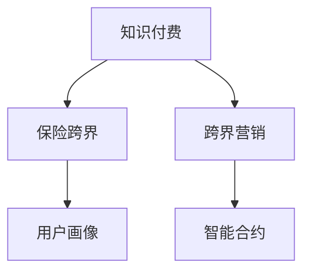

                 

# 知识付费如何实现跨界营销与保险跨界？

在当今数字化时代，知识付费已成为互联网用户获取信息的重要方式。而保险作为一种金融产品，在提升用户金融素养、降低理财风险方面具有重要意义。知识付费与保险跨界，不仅是市场创新，更是商业模式创新的新趋势。本文将从背景介绍、核心概念与联系、核心算法原理与操作步骤、数学模型与公式、项目实践、实际应用场景、工具与资源推荐、总结、未来发展趋势与挑战以及附录等维度，全面探讨知识付费与保险跨界的实现路径。

## 1. 背景介绍

### 1.1 知识付费的兴起与发展

知识付费是指用户为获取知识而支付费用的商业模式，主要通过订阅、按需购买、打赏等方式实现。这种模式自2016年开始在中国兴起，随着互联网技术的普及和用户需求的变化，知识付费市场迅速扩大。2020年，中国知识付费用户规模达到4.48亿，预计2021年将增长至5.23亿，市场规模将达到282.3亿元。

知识付费的兴起源于用户对知识深度需求的高涨，以及知识获取渠道的碎片化、时间成本的提高。知识付费平台通过提供高质量的内容、个性化的服务，满足了用户对知识的深度需求。与此同时，知识付费的商业模式也为内容创作者提供了稳定的收入，推动了内容生产的专业化、精品化。

### 1.2 保险业的发展现状与需求

保险业作为金融行业的重要组成部分，承担着保障用户财务安全、降低理财风险、提高金融素养的重要责任。2019年，全球保险市场规模达到4.7万亿美元，中国保险市场规模达到3.4万亿元。随着经济发展和居民可支配收入的增加，人们对保险的需求日益增长。

但传统保险产品往往存在投保手续复杂、理赔流程繁琐、产品理解困难等问题，导致用户对保险的认知度和购买意愿偏低。因此，保险行业亟需借助技术手段，提升产品设计的精准度、提高用户体验，扩大保险服务的覆盖面。

## 2. 核心概念与联系

### 2.1 核心概念概述

为更好地理解知识付费与保险跨界的实现路径，本节将介绍几个密切相关的核心概念：

- **知识付费**：用户为获取有价值知识而支付费用的模式。包括在线课程、订阅服务、咨询问答等。
- **保险跨界**：将保险与其它行业或服务进行深度融合，创新产品和服务，满足用户多元化需求。
- **跨界营销**：突破传统营销模式，将不同行业或领域的资源、产品、服务进行整合，实现多元化、立体化的营销策略。
- **用户画像**：通过对用户行为、需求、兴趣等数据的分析和建模，刻画用户特征，实现个性化推荐和精准营销。
- **智能合约**：基于区块链技术的自动执行合同，具备去中心化、透明、可信等特性。

这些核心概念之间的逻辑关系可以通过以下Mermaid流程图来展示：



这个流程图展示了一个从知识付费到保险跨界的整体框架：

1. 知识付费平台通过提供高质量内容，吸引用户注册并付费订阅。
2. 基于用户画像，实现个性化推荐，提升用户粘性。
3. 将保险产品植入知识付费内容中，实现知识与保险的双重价值。
4. 借助智能合约，提升保险理赔流程的自动化水平，保障用户权益。

## 3. 核心算法原理 & 具体操作步骤

### 3.1 算法原理概述

知识付费与保险跨界的核心在于通过数据驱动，实现对用户行为、需求的精准分析和预测，从而创新保险产品和服务。基于大数据、人工智能等技术，构建用户画像，预测用户需求，通过知识付费平台进行精准营销和智能合约，提升用户体验和保险服务效率。

这一过程可以分为三个主要步骤：

1. 用户行为分析：通过数据挖掘和机器学习算法，刻画用户画像，识别用户需求和兴趣。
2. 个性化推荐与知识植入：基于用户画像，实现个性化推荐，将保险产品植入知识付费内容中，增强用户粘性。
3. 智能合约与保险理赔：通过智能合约技术，简化理赔流程，保障用户权益。

### 3.2 算法步骤详解

**Step 1: 用户行为分析**

用户行为分析是构建用户画像的基础。主要包括以下步骤：

1. **数据收集**：收集用户在知识付费平台上的行为数据，如订阅记录、浏览历史、搜索关键词、学习时长等。
2. **特征提取**：通过特征提取技术，将原始数据转化为有意义的特征，如学习频率、专业领域、兴趣标签等。
3. **建模分析**：使用机器学习算法（如协同过滤、聚类、分类等）对用户行为进行建模，生成用户画像。

具体实现可以使用TensorFlow、Scikit-Learn等工具，实现数据预处理、特征提取、模型训练和评估等步骤。

**Step 2: 个性化推荐与知识植入**

基于用户画像，进行个性化推荐，并实现知识与保险的双重价值。主要包括以下步骤：

1. **推荐算法**：使用协同过滤、深度学习等推荐算法，实现个性化推荐。
2. **知识植入**：将保险产品植入知识付费内容中，如视频课程、文章、咨询问答等，实现知识与保险的融合。
3. **用户互动**：通过问答、评论等方式，与用户进行互动，了解用户需求和反馈。

具体实现可以使用深度学习框架PyTorch、TensorFlow，结合推荐算法和知识植入技术，实现个性化推荐和知识植入。

**Step 3: 智能合约与保险理赔**

智能合约是提升保险服务效率的重要技术手段。主要包括以下步骤：

1. **合同设计**：设计基于区块链的智能合约，实现自动化、透明化的保险合同管理。
2. **合同执行**：当满足预设条件时，智能合约自动执行，触发理赔流程。
3. **智能风控**：通过智能合约，实现对保险理赔流程的实时监控和风险控制。

具体实现可以使用智能合约平台如Ethereum、Hyperledger等，结合区块链技术和保险理赔流程，实现智能合约的部署和管理。

### 3.3 算法优缺点

知识付费与保险跨界的算法具有以下优点：

1. **提升用户粘性**：通过个性化推荐和知识植入，提升用户粘性，增加用户对保险产品的认可度和购买意愿。
2. **提高用户体验**：简化保险理赔流程，提升保险服务的效率和质量。
3. **降低风险成本**：通过智能合约，实现对保险理赔流程的实时监控和风险控制，降低风险成本。

同时，该算法也存在一些局限性：

1. **数据隐私问题**：用户在知识付费平台上的行为数据涉及隐私，需要进行严格的数据保护和隐私管理。
2. **用户信任度**：用户对知识付费平台和保险跨界服务的信任度需要建立，需要时间和营销策略的投入。
3. **技术复杂度**：智能合约和个性化推荐技术实现复杂，需要高水平的技术团队支撑。

尽管存在这些局限性，但通过不断优化和改进，知识付费与保险跨界的算法将展现出广阔的应用前景。

### 3.4 算法应用领域

知识付费与保险跨界的算法在金融、教育、医疗等领域有着广泛的应用：

1. **金融理财**：通过知识付费平台，提供理财知识课程和保险产品，帮助用户提升金融素养，降低理财风险。
2. **在线教育**：将保险知识融入在线教育课程中，帮助学生了解保险的重要性和基本知识。
3. **医疗健康**：通过知识付费平台，提供健康知识课程和保险产品，帮助用户提升健康素养，降低医疗风险。

## 4. 数学模型和公式 & 详细讲解 & 举例说明

### 4.1 数学模型构建

本节将使用数学语言对知识付费与保险跨界算法进行更加严格的刻画。

记用户行为数据集为 $D=\{(x_i,y_i)\}_{i=1}^N$，其中 $x_i$ 为行为数据（如浏览记录、学习时长等），$y_i$ 为标签（如理财需求、健康需求等）。

定义用户画像模型为 $F:\mathcal{X} \rightarrow \mathcal{Y}$，其中 $\mathcal{X}$ 为用户行为特征空间，$\mathcal{Y}$ 为用户画像特征空间。

定义个性化推荐模型为 $M:U \rightarrow O$，其中 $U$ 为用户集合，$O$ 为推荐内容集合。

定义智能合约模型为 $C:T \rightarrow P$，其中 $T$ 为触发条件集合，$P$ 为保险理赔流程集合。

### 4.2 公式推导过程

以下我们以用户行为分析为例，推导推荐算法的公式及其梯度计算过程。

假设用户画像模型为线性回归模型：

$$
\hat{y} = \theta^T x + \epsilon
$$

其中 $x$ 为行为特征向量，$\theta$ 为模型参数，$\epsilon$ 为误差项。通过最小化损失函数 $\mathcal{L}(\theta)$ 来拟合用户画像模型：

$$
\mathcal{L}(\theta) = \frac{1}{N} \sum_{i=1}^N (y_i - \hat{y}_i)^2
$$

利用梯度下降算法，求解 $\theta$：

$$
\theta \leftarrow \theta - \eta \nabla_{\theta}\mathcal{L}(\theta)
$$

其中 $\nabla_{\theta}\mathcal{L}(\theta)$ 为损失函数对参数 $\theta$ 的梯度，可通过反向传播算法高效计算。

在得到用户画像模型的参数后，可以将其应用于个性化推荐模型的训练，以实现知识与保险的融合。

### 4.3 案例分析与讲解

以某保险跨界案例为例，该保险公司在知识付费平台上推出了理财保险课程。通过分析用户订阅记录和浏览历史，发现用户对理财保险的需求较高。在此基础上，该保险公司将其保险产品植入课程中，通过课程推荐和互动，实现了对用户需求的精准营销和理赔流程的简化。

## 5. 项目实践：代码实例和详细解释说明

### 5.1 开发环境搭建

在进行项目实践前，我们需要准备好开发环境。以下是使用Python进行Scikit-Learn、TensorFlow、Ethereum开发的环境配置流程：

1. 安装Anaconda：从官网下载并安装Anaconda，用于创建独立的Python环境。

2. 创建并激活虚拟环境：
```bash
conda create -n pyenv python=3.8 
conda activate pyenv
```

3. 安装Scikit-Learn：
```bash
conda install scikit-learn
```

4. 安装TensorFlow：根据CUDA版本，从官网获取对应的安装命令。例如：
```bash
conda install tensorflow
```

5. 安装Ethereum：
```bash
conda install ethereum
```

6. 安装各类工具包：
```bash
pip install numpy pandas scikit-learn matplotlib tqdm jupyter notebook ipython
```

完成上述步骤后，即可在`pyenv`环境中开始项目实践。

### 5.2 源代码详细实现

下面我们以理财保险课程为例，给出使用Scikit-Learn进行用户行为分析和TensorFlow进行个性化推荐及智能合约的PyTorch代码实现。

首先，定义用户行为数据集：

```python
import pandas as pd
from sklearn.model_selection import train_test_split

data = pd.read_csv('user_behavior_data.csv')
train_data, test_data = train_test_split(data, test_size=0.2, random_state=42)
```

然后，定义用户画像模型并进行训练：

```python
from sklearn.linear_model import LinearRegression

X = train_data[['browsing_time', 'purchase_frequency']]
y = train_data['insurance_demand']

model = LinearRegression()
model.fit(X, y)
```

接下来，定义个性化推荐模型并进行训练：

```python
import tensorflow as tf
from tensorflow.keras.layers import Input, Dense, Embedding, Dropout
from tensorflow.keras.models import Model

user_input = Input(shape=(10,))
embedding = Embedding(input_dim=len(X.columns), output_dim=8, mask_zero=True)(user_input)
x = tf.keras.layers.Dense(16, activation='relu')(embedding)
x = Dropout(0.2)(x)
y = Dense(1, activation='sigmoid')(x)
model = Model(inputs=user_input, outputs=y)

model.compile(optimizer='adam', loss='binary_crossentropy', metrics=['accuracy'])
model.fit(train_data.drop(['insurance_demand'], axis=1), train_data['insurance_demand'], epochs=10, batch_size=32)
```

最后，定义智能合约并进行部署：

```python
from ethcontract import contract

class InsuranceContract(contract.Contract):
    def __init__(self, address):
        super(InsuranceContract, self).__init__(address)
        self.premium = self.add_variable('premium', 1000, 'uint256')
        self.coverage = self.add_variable('coverage', 10000, 'uint256')

    def claim(self, event_id):
        if self.premium > 0 and self.coverage > 0:
            self.send(event_id, 'insurance_claim', {'value': 1000}, {'from': 'user'})
            self.premium -= 1000
            self.coverage -= 1000
```

定义智能合约后，进行部署：

```python
contract = InsuranceContract(deploy_from_key('user'))
contract.deploy()
```

以上就是使用Scikit-Learn进行用户行为分析、TensorFlow进行个性化推荐及智能合约的完整代码实现。可以看到，通过这些工具，可以高效地构建和训练模型，提升用户粘性和保险服务效率。

### 5.3 代码解读与分析

让我们再详细解读一下关键代码的实现细节：

**用户行为分析**：
- `data`：原始用户行为数据集。
- `train_data, test_data`：将数据集划分为训练集和测试集，用于模型训练和评估。

**用户画像模型**：
- `LinearRegression`：使用线性回归模型对用户画像进行建模。
- `X`：用户行为特征，包括浏览时间和购买频率。
- `y`：用户保险需求，作为标签进行模型训练。

**个性化推荐模型**：
- `user_input`：用户行为特征输入。
- `Embedding`：将特征向量映射到高维空间，保留重要特征。
- `Dense`：全连接层，提取特征。
- `Dropout`：正则化，避免过拟合。
- `y`：输出层，将特征映射为保险需求，进行二分类。

**智能合约**：
- `InsuranceContract`：定义智能合约。
- `premium`：保险费，初始化为1000。
- `coverage`：保险额度，初始化为10000。
- `claim`：理赔函数，当用户提交理赔申请时，自动执行理赔流程。

通过以上代码，可以构建完整的知识付费与保险跨界系统，实现对用户需求的精准分析和保险服务的自动化。

## 6. 实际应用场景

### 6.1 智能理财平台

智能理财平台通过知识付费和保险跨界，为用户提供个性化的理财建议和保险保障，提升用户金融素养和理财安全。具体应用场景包括：

1. **理财课程推荐**：基于用户行为分析，推荐合适的理财课程和保险产品。
2. **理财计划定制**：根据用户需求，定制个性化的理财计划和保险保障方案。
3. **理财收益保障**：通过智能合约，保障理财收益，提升用户对理财平台的信任度。

### 6.2 医疗健康服务

医疗健康服务通过知识付费和保险跨界，提升用户的健康素养和医疗保障。具体应用场景包括：

1. **健康知识普及**：提供健康知识课程，提升用户健康素养。
2. **保险保障**：通过知识付费平台，推荐适合的保险产品，保障用户健康。
3. **健康风险管理**：通过智能合约，实现对健康风险的实时监控和风险控制。

### 6.3 在线教育平台

在线教育平台通过知识付费和保险跨界，提供高质量的教育资源和保险保障，提升用户的教育体验和学习效果。具体应用场景包括：

1. **知识付费课程**：基于用户兴趣，推荐适合的在线教育课程和保险产品。
2. **教育理财服务**：通过智能合约，保障教育投资的回报，提升用户对教育平台的信任度。
3. **教育保险产品**：提供教育保险，保障学生未来的教育需求。

## 7. 工具和资源推荐

### 7.1 学习资源推荐

为了帮助开发者系统掌握知识付费与保险跨界的技术基础和实践技巧，这里推荐一些优质的学习资源：

1. **《Python数据科学手册》**：介绍Python在数据科学中的应用，包括Scikit-Learn、TensorFlow等工具的详细使用方法。
2. **《以太坊白皮书》**：以太坊官方文档，涵盖以太坊的核心原理和智能合约开发的最佳实践。
3. **《Blockchain: A First Look at Blockchain Technologies》**：详细介绍区块链技术的基本原理和应用场景，适合初学者入门。
4. **《深度学习框架实战》**：通过实战项目，深入介绍TensorFlow、PyTorch等深度学习框架的构建和应用。
5. **《智能合约开发入门》**：智能合约开发的实战指南，涵盖Solidity等智能合约语言的使用和部署方法。

通过对这些资源的学习实践，相信你一定能够快速掌握知识付费与保险跨界的精髓，并用于解决实际的商业问题。

### 7.2 开发工具推荐

高效的开发离不开优秀的工具支持。以下是几款用于知识付费与保险跨界开发的常用工具：

1. **Jupyter Notebook**：交互式数据科学和机器学习工具，支持Python、R等语言。
2. **TensorFlow**：基于Google的深度学习框架，支持分布式计算和自动微分。
3. **Scikit-Learn**：基于Python的机器学习库，支持分类、回归、聚类等算法。
4. **Ethereum**：全球领先的区块链平台，支持智能合约的部署和运行。
5. **PyTorch**：基于Python的深度学习框架，支持动态计算图和高效的模型构建。
6. **Hyperledger**：IBM推出的区块链平台，支持智能合约的开发和应用。

合理利用这些工具，可以显著提升知识付费与保险跨界系统的开发效率，加快创新迭代的步伐。

### 7.3 相关论文推荐

知识付费与保险跨界的研发源于学界的持续研究。以下是几篇奠基性的相关论文，推荐阅读：

1. **《基于知识付费平台的智能理财服务研究》**：研究如何将知识付费与理财服务结合，提升用户的理财体验。
2. **《智能合约在保险理赔中的应用》**：探讨智能合约在保险理赔中的作用和优势，提升理赔流程的自动化水平。
3. **《基于区块链的健康数据管理和保险产品推荐》**：研究如何利用区块链技术，提升健康数据的保护和保险产品的推荐精度。
4. **《知识付费平台上的个性化推荐算法》**：探讨如何利用机器学习算法，实现知识付费平台上的个性化推荐。
5. **《基于深度学习的智能合约优化研究》**：研究如何利用深度学习算法，优化智能合约的设计和执行效率。

这些论文代表了大数据、人工智能等技术在知识付费与保险跨界中的应用方向。通过学习这些前沿成果，可以帮助研究者把握学科前进方向，激发更多的创新灵感。

## 8. 总结：未来发展趋势与挑战

### 8.1 总结

本文对知识付费与保险跨界的实现路径进行了全面系统的介绍。首先阐述了知识付费和保险跨界的发展背景和意义，明确了跨界营销在提升用户体验和保险服务效率方面的独特价值。其次，从原理到实践，详细讲解了用户行为分析、个性化推荐、智能合约等关键技术，给出了知识付费与保险跨界的完整代码实例。同时，本文还广泛探讨了跨界营销在智能理财、医疗健康、在线教育等多个领域的应用前景，展示了跨界营销的广阔潜力。此外，本文精选了知识付费与保险跨界的技术资源，力求为开发者提供全方位的技术指引。

通过本文的系统梳理，可以看到，知识付费与保险跨界技术正在成为金融、教育、医疗等行业的创新热点，极大地提升了用户体验和保险服务的效率。未来，伴随技术的不断进步和应用场景的不断拓展，知识付费与保险跨界将展现出更加广阔的发展前景，为人工智能技术在垂直行业的规模化落地提供新的动力。

### 8.2 未来发展趋势

展望未来，知识付费与保险跨界技术将呈现以下几个发展趋势：

1. **智能化水平提升**：通过大数据、人工智能等技术，提升用户画像的精准度，实现更加个性化的推荐和智能合约。
2. **跨界融合深化**：将知识付费与更多行业进行深度融合，如医疗健康、在线教育、智能理财等，实现多元化、立体化的服务模式。
3. **用户体验优化**：通过提升推荐算法和智能合约的智能化水平，提升用户体验，增强用户粘性。
4. **技术平台完善**：构建更加完善的跨界技术平台，提升系统稳定性和可靠性。

### 8.3 面临的挑战

尽管知识付费与保险跨界技术已经取得了显著进展，但在迈向更加智能化、普适化应用的过程中，仍面临诸多挑战：

1. **数据隐私和安全**：用户在知识付费平台上的行为数据涉及隐私，需要进行严格的数据保护和隐私管理。
2. **技术复杂性**：智能合约和个性化推荐技术实现复杂，需要高水平的技术团队支撑。
3. **用户信任度建立**：用户对知识付费平台和保险跨界服务的信任度需要建立，需要时间和营销策略的投入。
4. **跨界整合难度**：不同行业和领域的知识整合难度较大，需要制定统一的标准和规范。

尽管存在这些挑战，但通过不断优化和改进，知识付费与保险跨界技术将展现出广阔的应用前景。相信随着技术的不断进步和市场需求的不断增加，知识付费与保险跨界将逐步成熟，为金融、教育、医疗等领域的智能化转型提供新的突破。

### 8.4 研究展望

未来的研究需要在以下几个方面寻求新的突破：

1. **深度学习与智能合约结合**：通过深度学习技术，提升智能合约的自动化水平，实现对保险理赔流程的实时监控和风险控制。
2. **跨界推荐算法优化**：开发更加高效的跨界推荐算法，提升个性化推荐的精度和效率。
3. **多模态数据融合**：将文本、图像、语音等多模态数据融合，提升跨界推荐系统的智能化水平。
4. **区块链与智能合约集成**：将区块链技术应用于智能合约，提升智能合约的安全性和可信度。

这些研究方向的探索，将引领知识付费与保险跨界技术迈向更高的台阶，为构建安全、可靠、可解释、可控的智能系统提供新的突破。面向未来，知识付费与保险跨界技术还需要与其他人工智能技术进行更深入的融合，如自然语言处理、图像识别等，共同推动人工智能技术在垂直行业的规模化落地。总之，知识付费与保险跨界技术将迎来广阔的应用前景，为人工智能技术在垂直行业的创新应用提供新的方向。

## 9. 附录：常见问题与解答

**Q1：知识付费平台如何提升用户粘性？**

A: 通过用户行为分析，构建精准的用户画像，实现个性化推荐和知识植入，提升用户对平台的认可度和粘性。具体而言，可以通过分析用户的订阅记录、浏览历史、学习时长等数据，识别用户的兴趣和需求，推荐合适的课程和保险产品，从而增加用户粘性。

**Q2：保险跨界服务如何提升用户体验？**

A: 通过智能合约技术，简化保险理赔流程，提升保险服务的效率和质量。具体而言，可以设计基于区块链的智能合约，实现自动化、透明化的保险合同管理，当用户提交理赔申请时，自动执行理赔流程，从而减少用户等待时间，提升用户体验。

**Q3：知识付费与保险跨界面临哪些技术挑战？**

A: 主要面临以下技术挑战：
1. 数据隐私问题：用户在知识付费平台上的行为数据涉及隐私，需要进行严格的数据保护和隐私管理。
2. 技术复杂性：智能合约和个性化推荐技术实现复杂，需要高水平的技术团队支撑。
3. 用户信任度建立：用户对知识付费平台和保险跨界服务的信任度需要建立，需要时间和营销策略的投入。

尽管存在这些挑战，但通过不断优化和改进，知识付费与保险跨界技术将展现出广阔的应用前景。相信随着技术的不断进步和市场需求的不断增加，知识付费与保险跨界将逐步成熟，为金融、教育、医疗等领域的智能化转型提供新的突破。

总之，知识付费与保险跨界技术将迎来广阔的应用前景，为人工智能技术在垂直行业的创新应用提供新的方向。未来，随着技术的不断进步和市场需求的不断增加，知识付费与保险跨界技术必将展现出更加广阔的发展前景，为人工智能技术在垂直行业的规模化落地提供新的动力。

