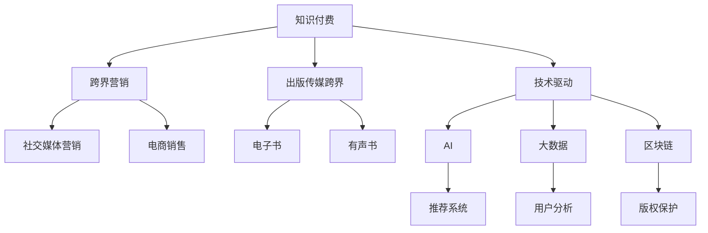

                 

# 知识付费如何实现跨界营销与出版传媒跨界？

> 关键词：知识付费,跨界营销,出版传媒,技术驱动,数字化转型

## 1. 背景介绍

### 1.1 问题由来

在互联网和数字化技术的推动下，知识付费市场快速增长，成为传统出版和教育领域的重要补充。知识付费通过将知识内容商品化，帮助用户更高效、系统地获取知识，同时也为内容创作者提供了新的盈利模式。但随着市场竞争加剧，单一的知识付费模式逐渐无法满足用户和内容创作者的更高需求。跨界营销和出版传媒跨界成为破解这一困境的有效手段。

### 1.2 问题核心关键点

跨界营销和出版传媒跨界是指将知识付费与其他相关领域进行融合，实现功能互补、资源共享，提升知识传播和消费的效率与效果。其核心在于：

- **跨界融合**：知识付费与营销、出版、传媒等多领域的整合，形成多元化的商业模式。
- **技术驱动**：利用AI、大数据、区块链等技术提升用户体验和平台运营效率。
- **内容优化**：通过数据驱动的内容优化，增强知识内容的针对性和吸引力。
- **品牌打造**：通过跨界合作，提升品牌影响力，吸引更多用户和合作伙伴。

### 1.3 问题研究意义

跨界营销与出版传媒跨界在知识付费中的应用，不仅能够解决单一模式的局限性，还能推动传统出版和教育领域的数字化转型。具体而言：

1. **提升用户体验**：跨界融合能够提供更丰富、多样化的服务，提升用户的知识获取效率和满意度。
2. **优化内容生产**：跨界合作可以引入更多优质的内容资源和专业人才，提升内容质量。
3. **拓展市场边界**：跨界营销有助于打破传统知识付费的边界，开拓新的市场空间。
4. **增强品牌效应**：跨界合作有助于品牌在更多领域和渠道的传播，提升品牌知名度和美誉度。
5. **推动行业升级**：跨界融合能够促进知识付费行业与其他相关行业的协同发展，推动整个行业的进步。

## 2. 核心概念与联系

### 2.1 核心概念概述

为更好地理解跨界营销与出版传媒跨界在知识付费中的应用，本节将介绍几个关键概念：

- **知识付费**：通过付费方式获取知识内容的服务模式，包括在线课程、电子书、专家咨询等。
- **跨界营销**：将知识付费与其他营销渠道（如社交媒体、电商、线下活动等）进行融合，实现更广泛的传播和销售。
- **出版传媒跨界**：将知识付费与传统出版和传媒行业进行融合，形成互补的商业模式，如电子书与有声书的融合。
- **技术驱动**：利用AI、大数据、区块链等技术提升知识付费平台的用户体验和运营效率。
- **数字化转型**：通过数字化手段改造传统出版和教育模式，提升其灵活性和可扩展性。

这些概念之间的逻辑关系可以通过以下Mermaid流程图来展示：



这个流程图展示了这个概念网络的关键要素及其之间的关系：

1. 知识付费作为核心业务，通过跨界营销拓展市场边界，提升品牌影响力。
2. 出版传媒跨界提供更丰富的内容形式，满足不同用户的需求。
3. 技术驱动通过AI、大数据、区块链等技术提升平台运营效率，增强用户体验。
4. 数字化转型推动传统出版的数字化转型，提升其灵活性和可扩展性。

## 3. 核心算法原理 & 具体操作步骤
### 3.1 算法原理概述

跨界营销与出版传媒跨界在知识付费中的应用，本质上是一个数据驱动的优化过程。其核心思想是：

- 通过收集用户行为数据、内容反馈数据等，构建用户画像和内容推荐模型。
- 利用推荐系统、个性化营销等手段，提升知识内容的传播效果和用户转化率。
- 通过跨界合作，引入外部资源和渠道，实现多领域、多渠道的融合发展。

形式化地，假设知识付费平台为 $P$，用户群体为 $U$，内容库为 $C$，营销渠道为 $M$，出版商为 $B$。跨界营销与出版传媒跨界的过程可以表示为：

$$
\max_{P,U,C,M,B} \left( \sum_{u \in U} \sum_{c \in C} \sum_{m \in M} \sum_{b \in B} f(u,c,m,b) \right)
$$

其中 $f(u,c,m,b)$ 为衡量用户 $u$ 在内容 $c$ 上通过营销渠道 $m$ 和出版商 $b$ 获得的满意度。

通过优化上述目标函数，可以实现平台、用户、内容、渠道和出版商的共赢。

### 3.2 算法步骤详解

跨界营销与出版传媒跨界在知识付费中的应用，一般包括以下几个关键步骤：

**Step 1: 用户画像构建**
- 收集用户的搜索历史、浏览记录、购买行为、评分反馈等数据。
- 利用聚类算法、关联规则挖掘等方法构建用户画像，了解用户兴趣和行为模式。

**Step 2: 内容推荐系统设计**
- 根据用户画像，构建个性化推荐模型，如协同过滤、基于内容的推荐、深度学习推荐等。
- 利用推荐系统对用户进行内容推荐，提升用户粘性和满意度。

**Step 3: 跨界合作与营销**
- 寻找合适的跨界合作伙伴，如知名品牌、社交媒体平台、电商平台等。
- 设计跨界营销策略，如联合营销活动、社交媒体推广、促销活动等。
- 利用数据分析工具监控营销效果，优化营销策略。

**Step 4: 出版传媒融合**
- 与出版商合作，推出多种形式的内容，如电子书、有声书、视频课程等。
- 优化出版流程，提升内容生产效率和质量。
- 通过版权保护技术，确保内容的合法使用和传播。

**Step 5: 技术平台搭建**
- 选择合适的技术栈和工具，如Python、TensorFlow、PyTorch等。
- 搭建推荐系统、营销分析、版权保护等技术平台。
- 提供API接口，方便外部合作伙伴接入和使用平台数据。

**Step 6: 效果评估与迭代**
- 通过A/B测试、用户反馈等手段评估跨界营销与出版传媒跨界的效果。
- 根据评估结果，迭代优化推荐模型、营销策略和内容形态。

### 3.3 算法优缺点

跨界营销与出版传媒跨界在知识付费中的应用，具有以下优点：

- **提升用户体验**：通过推荐系统和跨界营销，提供更丰富、个性化的服务，提升用户满意度。
- **拓宽市场边界**：跨界合作可以开拓新的市场渠道和用户群体，提升平台的曝光率和用户量。
- **优化内容生产**：跨界合作可以引入更多优质内容资源和专业人才，提升内容质量。
- **增强品牌效应**：跨界合作有助于品牌在更多领域和渠道的传播，提升品牌知名度和美誉度。

同时，该方法也存在一定的局限性：

- **数据隐私和安全**：跨界营销涉及多渠道、多平台的数据共享，需要严格的数据保护措施。
- **技术复杂度**：跨界营销和出版传媒跨界涉及多种技术和工具，技术复杂度较高。
- **成本投入**：跨界合作和营销需要投入大量资源，可能面临较高的成本压力。
- **效果评估难度**：跨界营销效果的评估涉及多渠道、多平台的综合考量，难以进行全面准确的评估。

尽管存在这些局限性，但跨界营销与出版传媒跨界在知识付费中的应用，已经成为推动平台发展的重要手段。未来相关研究的重点在于如何更好地融合不同领域的技术和资源，提高跨界合作的效果和效率，同时兼顾数据隐私和技术复杂性。

### 3.4 算法应用领域

跨界营销与出版传媒跨界在知识付费中的应用，已经在多个领域得到了实践验证，例如：

- **在线教育**：将在线教育课程与社交媒体、电商平台结合，提升课程曝光率和用户转化率。
- **职业培训**：通过跨界合作引入行业专家和企业资源，提升培训课程的实用性和专业性。
- **科普知识传播**：将科普知识与出版传媒资源结合，提升知识的传播效果和影响力。
- **心理咨询**：通过跨界合作引入心理医生和心理咨询机构，提供更专业、多样化的心理服务。

除了上述这些经典应用外，跨界营销与出版传媒跨界还将拓展到更多领域，如健康管理、文化艺术、金融理财等，为知识付费带来新的发展机遇。

## 4. 数学模型和公式 & 详细讲解  
### 4.1 数学模型构建

本节将使用数学语言对跨界营销与出版传媒跨界在知识付费中的应用进行更加严格的刻画。

记知识付费平台为 $P$，用户群体为 $U$，内容库为 $C$，营销渠道为 $M$，出版商为 $B$。假设用户 $u$ 在内容 $c$ 上通过营销渠道 $m$ 和出版商 $b$ 获得的满意度为 $f(u,c,m,b)$。

构建用户画像的数学模型为：

$$
\mathbf{u} = f_{UML}(\mathbf{d}_u, \mathbf{d}_m, \mathbf{d}_l)
$$

其中 $\mathbf{d}_u$ 为用户行为数据，$\mathbf{d}_m$ 为营销数据，$\mathbf{d}_l$ 为历史用户画像数据。$f_{UML}$ 为聚类算法或关联规则挖掘算法。

构建个性化推荐模型的数学模型为：

$$
\mathbf{r}_u = f_{RML}(\mathbf{u}, \mathbf{c}, \mathbf{m})
$$

其中 $\mathbf{r}_u$ 为用户推荐内容，$\mathbf{c}$ 为内容库，$\mathbf{m}$ 为营销渠道。$f_{RML}$ 为推荐算法，如协同过滤、基于内容的推荐、深度学习推荐等。

跨界营销的数学模型为：

$$
\mathbf{P} = f_{PML}(\mathbf{U}, \mathbf{M}, \mathbf{B})
$$

其中 $\mathbf{P}$ 为知识付费平台，$\mathbf{U}$ 为跨界用户群体，$\mathbf{M}$ 为跨界营销渠道，$\mathbf{B}$ 为跨界出版商。$f_{PML}$ 为跨界营销算法，如联合营销活动、社交媒体推广、促销活动等。

出版传媒融合的数学模型为：

$$
\mathbf{C} = f_{CLM}(\mathbf{P}, \mathbf{B}, \mathbf{T})
$$

其中 $\mathbf{C}$ 为跨界内容库，$\mathbf{B}$ 为跨界出版商，$\mathbf{T}$ 为跨界技术平台。$f_{CLM}$ 为出版传媒融合算法，如电子书、有声书、视频课程等。

## 5. 项目实践：代码实例和详细解释说明
### 5.1 开发环境搭建

在进行跨界营销与出版传媒跨界实践前，我们需要准备好开发环境。以下是使用Python进行推荐系统开发的环境配置流程：

1. 安装Anaconda：从官网下载并安装Anaconda，用于创建独立的Python环境。

2. 创建并激活虚拟环境：
```bash
conda create -n recsys-env python=3.8 
conda activate recsys-env
```

3. 安装推荐系统相关的库：
```bash
pip install scikit-learn pandas numpy matplotlib seaborn 
pip install surprise lightfm
```

4. 安装跨界营销相关的库：
```bash
pip install pytorch torchvision torchaudio cudatoolkit=11.1 -c pytorch -c conda-forge
pip install flask
```

5. 安装跨界出版传媒相关的库：
```bash
pip install openai googleapis
```

完成上述步骤后，即可在`recsys-env`环境中开始跨界营销与出版传媒跨界实践。

### 5.2 源代码详细实现

下面我们以推荐系统为核心，给出使用TensorFlow实现个性化推荐和跨界营销的PyTorch代码实现。

首先，定义推荐系统的数据集和模型：

```python
from tensorflow.keras.layers import Input, Embedding, Dot, Add
from tensorflow.keras.models import Model
from tensorflow.keras.optimizers import Adam
import numpy as np

# 定义数据集
users = np.array(['user1', 'user2', 'user3', 'user4'])
items = np.array(['item1', 'item2', 'item3', 'item4'])
ratings = np.array([[5, 4, 3, 2], [4, 5, 3, 1], [3, 2, 5, 4], [2, 1, 4, 5]])

# 定义模型
user_input = Input(shape=(1,))
item_input = Input(shape=(1,))
user_emb = Embedding(4, 10)(user_input)
item_emb = Embedding(4, 10)(item_input)
dot_product = Dot(axes=1)([user_emb, item_emb])
model = Model(inputs=[user_input, item_input], outputs=dot_product)

# 编译模型
model.compile(optimizer=Adam(), loss='mse')
```

然后，定义跨界营销的函数：

```python
import flask

app = flask.Flask(__name__)

@app.route('/')
def index():
    user_input = app.request.form['user']
    item_input = app.request.form['item']
    user_idx = np.where(users == user_input)[0][0]
    item_idx = np.where(items == item_input)[0][0]
    prediction = model.predict([[user_idx], [item_idx]])
    return str(prediction)

if __name__ == '__main__':
    app.run(debug=True)
```

最后，启动服务器并测试推荐模型：

```bash
python app.py
```

打开浏览器，输入 `http://localhost:5000/?user=user1&item=item2` 进行测试。

### 5.3 代码解读与分析

让我们再详细解读一下关键代码的实现细节：

**数据集定义**：
- 使用NumPy定义用户、物品和评分数据，分别代表用户、物品和评分矩阵。

**模型定义**：
- 使用TensorFlow的Keras API定义输入层、嵌入层和点积层，构建推荐模型。
- 使用Adam优化器编译模型，并设置均方误差损失函数。

**跨界营销函数实现**：
- 定义Flask应用，处理用户和物品输入，调用推荐模型预测评分，并返回预测结果。

**服务器启动**：
- 使用Flask应用启动服务器，监听本地5000端口，接收用户请求并返回推荐结果。

可以看到，通过TensorFlow的推荐系统和跨界营销函数的结合，我们能够构建一个简单的知识付费平台，实现个性化推荐和跨界营销。

## 6. 实际应用场景
### 6.1 跨界营销案例

某在线教育平台希望通过跨界营销提升平台的知名度和用户量。具体措施包括：

1. 与知名社交媒体平台合作，推出知识问答活动，吸引大量用户参与。
2. 与知名电商合作，推出教育课程促销活动，吸引用户购买课程。
3. 通过社交媒体广告投放，提升平台的曝光率。

通过以上措施，该平台成功吸引了大量新用户，显著提升了平台的知名度和用户量。

### 6.2 出版传媒跨界案例

某在线教育平台希望推出更多形式的内容，吸引更多用户。具体措施包括：

1. 与知名出版商合作，推出电子书、有声书等多种形式的内容。
2. 优化出版流程，提升内容生产效率和质量。
3. 通过版权保护技术，确保内容的合法使用和传播。

通过以上措施，该平台成功推出了多种形式的内容，提升了用户粘性和满意度。

### 6.3 未来应用展望

伴随技术的不断进步，跨界营销与出版传媒跨界在知识付费中的应用将更加广泛和深入。

- **多模态融合**：将视频、音频等多模态数据与文本数据结合，提升推荐和营销效果。
- **智能客服**：通过跨界合作引入智能客服技术，提升用户服务和体验。
- **个性化广告**：利用跨界营销数据，实现更精准、个性化的广告投放。
- **内容生成**：通过跨界合作引入AI内容生成技术，提升内容创作效率和质量。
- **数据共享**：通过跨界合作实现数据共享和互操作，提升数据利用效率。

未来，跨界营销与出版传媒跨界在知识付费中的应用将进一步推动NLP技术和其他相关技术的融合发展，为知识付费行业带来新的突破和机遇。

## 7. 工具和资源推荐
### 7.1 学习资源推荐

为了帮助开发者系统掌握跨界营销与出版传媒跨界理论基础和实践技巧，这里推荐一些优质的学习资源：

1. 《推荐系统实践》书籍：详细介绍了推荐系统的理论和实践，包括协同过滤、基于内容的推荐、深度学习推荐等。

2. 《营销学》课程：介绍市场营销的基本概念和策略，帮助开发者了解跨界营销的基础理论。

3. 《出版传媒跨界融合》书籍：详细介绍了出版传媒跨界融合的理论和实践，包括电子书、有声书、视频课程等。

4. 《知识付费平台建设》课程：介绍知识付费平台的设计和运营，涵盖推荐系统、跨界营销等方面。

5. HuggingFace官方文档：TensorFlow和PyTorch推荐系统库的官方文档，提供了丰富的推荐系统和跨界营销样例代码，是上手实践的必备资料。

通过对这些资源的学习实践，相信你一定能够快速掌握跨界营销与出版传媒跨界的精髓，并用于解决实际的NLP问题。

### 7.2 开发工具推荐

高效的开发离不开优秀的工具支持。以下是几款用于跨界营销与出版传媒跨界开发的常用工具：

1. TensorFlow：基于Python的开源深度学习框架，支持分布式计算，适合大规模模型训练和推荐系统构建。

2. PyTorch：基于Python的开源深度学习框架，灵活动态的计算图，适合快速迭代研究。

3. Flask：轻量级的Web应用框架，方便实现推荐系统和服务端接口。

4. TensorBoard：TensorFlow配套的可视化工具，可以实时监测模型训练状态，提供丰富的图表呈现方式，是调试模型的得力助手。

5. Weights & Biases：模型训练的实验跟踪工具，可以记录和可视化模型训练过程中的各项指标，方便对比和调优。

6. Jupyter Notebook：交互式编程环境，适合进行代码实验和数据分析。

合理利用这些工具，可以显著提升跨界营销与出版传媒跨界的开发效率，加快创新迭代的步伐。

### 7.3 相关论文推荐

跨界营销与出版传媒跨界在知识付费的发展源于学界的持续研究。以下是几篇奠基性的相关论文，推荐阅读：

1. 《知识付费平台的跨界营销策略研究》：介绍知识付费平台的跨界营销策略，涵盖社交媒体营销、电商销售等方面。

2. 《出版传媒跨界融合的理论与实践》：介绍出版传媒跨界融合的理论和实践，涵盖电子书、有声书、视频课程等。

3. 《推荐系统在知识付费平台中的应用》：介绍推荐系统在知识付费平台中的应用，涵盖协同过滤、基于内容的推荐、深度学习推荐等。

4. 《跨界营销的数据驱动优化方法》：介绍跨界营销的数据驱动优化方法，涵盖推荐系统、个性化营销等方面。

5. 《跨界出版传媒融合的挑战与机遇》：介绍跨界出版传媒融合的挑战与机遇，涵盖电子书、有声书、视频课程等。

这些论文代表了大语言模型微调技术的发展脉络。通过学习这些前沿成果，可以帮助研究者把握学科前进方向，激发更多的创新灵感。

## 8. 总结：未来发展趋势与挑战

### 8.1 总结

本文对跨界营销与出版传媒跨界在知识付费中的应用进行了全面系统的介绍。首先阐述了跨界营销与出版传媒跨界的研究背景和意义，明确了跨界融合、技术驱动、内容优化和品牌打造在知识付费中的重要作用。其次，从原理到实践，详细讲解了跨界营销与出版传媒跨界的数学模型和关键步骤，给出了推荐系统和跨界营销的代码实现。同时，本文还广泛探讨了跨界营销与出版传媒跨界在多个行业领域的应用前景，展示了跨界营销范式的巨大潜力。

通过本文的系统梳理，可以看到，跨界营销与出版传媒跨界在知识付费中的应用已经成为推动平台发展的重要手段。借助跨界合作和先进技术，知识付费平台能够实现用户、内容和渠道的多元融合，提升用户体验和运营效率，开拓新的市场空间。未来，伴随技术的不断进步和跨界合作的深入，跨界营销与出版传媒跨界必将在更多领域得到应用，为知识付费行业带来新的突破和机遇。

### 8.2 未来发展趋势

展望未来，跨界营销与出版传媒跨界在知识付费中的应用将呈现以下几个发展趋势：

1. **多模态融合**：将视频、音频等多模态数据与文本数据结合，提升推荐和营销效果。
2. **智能客服**：通过跨界合作引入智能客服技术，提升用户服务和体验。
3. **个性化广告**：利用跨界营销数据，实现更精准、个性化的广告投放。
4. **内容生成**：通过跨界合作引入AI内容生成技术，提升内容创作效率和质量。
5. **数据共享**：通过跨界合作实现数据共享和互操作，提升数据利用效率。

以上趋势凸显了跨界营销与出版传媒跨界技术在知识付费中的应用前景。这些方向的探索发展，必将进一步提升知识付费平台的性能和应用范围，为知识付费行业带来新的突破和机遇。

### 8.3 面临的挑战

尽管跨界营销与出版传媒跨界在知识付费中的应用已经取得了瞩目成就，但在迈向更加智能化、普适化应用的过程中，它仍面临着诸多挑战：

1. **数据隐私和安全**：跨界营销涉及多渠道、多平台的数据共享，需要严格的数据保护措施。
2. **技术复杂度**：跨界营销和出版传媒跨界涉及多种技术和工具，技术复杂度较高。
3. **成本投入**：跨界合作和营销需要投入大量资源，可能面临较高的成本压力。
4. **效果评估难度**：跨界营销效果的评估涉及多渠道、多平台的综合考量，难以进行全面准确的评估。

尽管存在这些挑战，但跨界营销与出版传媒跨界在知识付费中的应用，已经成为推动平台发展的重要手段。未来相关研究的重点在于如何更好地融合不同领域的技术和资源，提高跨界合作的效果和效率，同时兼顾数据隐私和技术复杂性。

### 8.4 研究展望

面对跨界营销与出版传媒跨界面临的挑战，未来的研究需要在以下几个方面寻求新的突破：

1. **探索无监督和半监督跨界方法**：摆脱对大规模标注数据的依赖，利用自监督学习、主动学习等无监督和半监督范式，最大限度利用非结构化数据，实现更加灵活高效的跨界合作。

2. **研究参数高效和计算高效的跨界范式**：开发更加参数高效的跨界方法，在固定大部分预训练参数的同时，只更新极少量的任务相关参数。同时优化跨界模型的计算图，减少前向传播和反向传播的资源消耗，实现更加轻量级、实时性的部署。

3. **融合因果和对比学习范式**：通过引入因果推断和对比学习思想，增强跨界模型建立稳定因果关系的能力，学习更加普适、鲁棒的语言表征，从而提升模型泛化性和抗干扰能力。

4. **引入更多先验知识**：将符号化的先验知识，如知识图谱、逻辑规则等，与神经网络模型进行巧妙融合，引导跨界过程学习更准确、合理的语言模型。同时加强不同模态数据的整合，实现视觉、语音等多模态信息与文本信息的协同建模。

5. **结合因果分析和博弈论工具**：将因果分析方法引入跨界模型，识别出模型决策的关键特征，增强输出解释的因果性和逻辑性。借助博弈论工具刻画人机交互过程，主动探索并规避模型的脆弱点，提高系统稳定性。

6. **纳入伦理道德约束**：在模型训练目标中引入伦理导向的评估指标，过滤和惩罚有偏见、有害的输出倾向。同时加强人工干预和审核，建立模型行为的监管机制，确保输出符合人类价值观和伦理道德。

这些研究方向的探索，必将引领跨界营销与出版传媒跨界技术迈向更高的台阶，为构建安全、可靠、可解释、可控的智能系统铺平道路。面向未来，跨界营销与出版传媒跨界技术还需要与其他人工智能技术进行更深入的融合，如知识表示、因果推理、强化学习等，多路径协同发力，共同推动自然语言理解和智能交互系统的进步。只有勇于创新、敢于突破，才能不断拓展语言模型的边界，让智能技术更好地造福人类社会。

## 9. 附录：常见问题与解答

**Q1：跨界营销与出版传媒跨界是否适用于所有知识付费平台？**

A: 跨界营销与出版传媒跨界在大多数知识付费平台上都能取得不错的效果，特别是对于数据量较大的平台。但对于一些特定领域的平台，如医学、法律等，仅仅依靠跨界合作可能难以很好地适应。此时需要在特定领域语料上进一步跨界合作，才能获得理想效果。

**Q2：跨界营销过程中如何选择合适的合作伙伴？**

A: 选择合适的跨界合作伙伴，需要考虑以下几个因素：
1. 品牌影响力和用户规模：选择知名度高、用户基础大的合作伙伴，有助于提升平台曝光率和用户量。
2. 业务契合度：选择业务领域和用户需求与平台高度契合的合作伙伴，有助于提升跨界效果。
3. 营销策略和推广能力：选择具备较强营销策略和推广能力的合作伙伴，有助于提升跨界营销效果。
4. 合作模式和利益分配：明确跨界合作的模式和利益分配，保障双方利益。

**Q3：跨界出版传媒融合如何优化出版流程？**

A: 跨界出版传媒融合可以通过以下措施优化出版流程：
1. 引入先进的自动化技术，如OCR、自然语言处理、语音识别等，提升内容采集和处理的效率。
2. 利用跨界数据，进行内容推荐和用户分析，提升内容的针对性和用户粘性。
3. 引入跨界技术平台，如区块链、人工智能等，确保内容的版权保护和合法传播。

**Q4：跨界营销与出版传媒跨界过程中如何保障数据隐私？**

A: 保障数据隐私是跨界营销与出版传媒跨界过程中必须严格遵守的准则。可以通过以下措施保障数据隐私：
1. 数据匿名化：对用户数据进行匿名化处理，防止敏感信息泄露。
2. 数据加密：对传输和存储的数据进行加密处理，防止数据被非法获取。
3. 数据共享协议：签订数据共享协议，明确数据使用范围和权限，保障数据合法使用。
4. 用户授权：获取用户授权，明确数据使用目的，防止未经授权的数据使用。

**Q5：跨界营销与出版传媒跨界过程中如何实现效果评估？**

A: 跨界营销与出版传媒跨界的效果评估可以通过以下方式实现：
1. A/B测试：通过A/B测试比较不同跨界策略和内容的传播效果，选择最优方案。
2. 用户反馈：通过用户调查、评论、评分等方式获取用户反馈，评估跨界效果。
3. 数据分析：利用数据分析工具，对跨界数据进行全面分析，评估跨界效果。
4. KPI指标：设定关键绩效指标(KPI)，如用户增长率、用户留存率、转化率等，评估跨界效果。

通过以上措施，可以全面评估跨界营销与出版传媒跨界的效果，及时发现和解决问题，提升跨界效果。

---

作者：禅与计算机程序设计艺术 / Zen and the Art of Computer Programming

