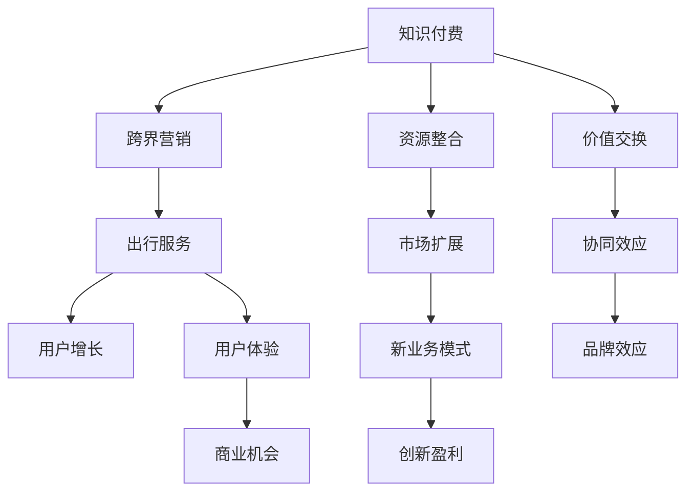

                 

# 知识付费如何实现跨界营销与出行服务跨界？

## 1. 背景介绍

在数字化时代，知识付费已成为一种全新的信息获取方式，逐步渗透到人们的日常生活和学习中。各大知识付费平台如喜马拉雅、得到、得到大学、薇咖、樊登读书等，纷纷通过提供优质的内容、精准推荐、个性化服务等方式，吸引用户订阅，实现知识变现。与此同时，出行服务也正处于转型升级的关键时期，无论是传统航空公司、铁路、公交，还是新兴的网约车、共享单车等，都在积极探索跨界融合的商业模式。在这样的大背景下，知识付费平台与出行服务行业如何实现跨界营销，构建新的生态体系，值得深入探讨。

## 2. 核心概念与联系

### 2.1 核心概念概述

在探讨跨界营销之前，首先需要理解知识付费与出行服务行业的核心概念，并明确它们之间的联系。

**知识付费**：是指用户通过付费方式获取专业知识、课程、资讯等信息的服务模式。知识付费平台利用互联网技术，为用户提供个性化、便捷化的知识服务，实现商业变现。

**出行服务**：包括航空、铁路、公交、出租车、网约车、共享单车等各类出行方式，旨在提供便捷、安全的出行服务，提升用户出行体验。

**跨界营销**：是指不同行业之间通过资源整合、价值交换等形式，实现市场扩展和用户增长。跨界营销打破了传统行业界限，创造更多商业机会。

### 2.2 核心概念原理和架构的 Mermaid 流程图



这个 Mermaid 流程图展示了知识付费、跨界营销与出行服务之间的联系和作用机制。具体而言，知识付费通过提供优质的内容和个性化服务，整合行业资源，与出行服务进行价值交换，最终实现用户增长和市场扩展，带来新的商业机会和创新盈利模式。

## 3. 核心算法原理 & 具体操作步骤

### 3.1 算法原理概述

基于知识付费和出行服务的跨界营销，核心在于整合资源、创造价值和提升用户体验。其算法原理可以概括为以下几个方面：

1. **需求分析**：通过用户行为数据和市场调研，分析用户的出行需求和学习需求，找到两者的结合点。
2. **资源整合**：将知识付费平台的内容资源和出行服务的场景资源进行整合，创造新的价值组合。
3. **价值交换**：通过营销活动和商业合作，实现知识付费平台和出行服务的价值交换，形成协同效应。
4. **用户体验优化**：通过跨界服务，提升用户的出行和学习的综合体验，增加用户粘性。

### 3.2 算法步骤详解

#### 3.2.1 需求分析

1. **用户行为数据分析**：通过大数据分析技术，对用户在知识付费平台和出行服务中的行为数据进行综合分析，找出用户需求的重合点。
2. **市场调研**：进行市场调研，了解用户的出行习惯和偏好，以及知识付费的趋势和需求。
3. **需求匹配**：将用户需求与知识付费内容和出行服务进行匹配，找到最佳的结合点。

#### 3.2.2 资源整合

1. **内容资源整合**：将知识付费平台的高质量内容与出行服务的场景需求进行整合，如在飞行途中播放相关课程音频，或在列车上提供电子书籍阅读服务。
2. **场景资源整合**：将出行服务的具体场景与知识付费平台的内容服务进行整合，如在机场、车站等场所提供知识付费内容体验区，或在网约车内提供有声书服务。

#### 3.2.3 价值交换

1. **营销活动合作**：通过营销活动合作，如联合推广、赞助活动等，实现知识付费平台和出行服务的价值交换。
2. **商业合作**：通过商业合作，如联合开发跨界产品、建立联合品牌等，形成协同效应，实现双赢。

#### 3.2.4 用户体验优化

1. **跨界服务设计**：设计跨界服务，如在飞行途中提供学习建议、在车站提供旅行攻略等，提升用户的综合体验。
2. **个性化推荐**：通过分析用户行为数据，提供个性化的跨界推荐，如推荐出行途中的音频课程或书籍。

### 3.3 算法优缺点

#### 3.3.1 算法优点

1. **市场扩展**：通过跨界营销，知识付费平台和出行服务可以实现市场扩展，吸引更多的用户群体。
2. **用户增长**：通过提供跨界服务，提升用户的出行和学习的综合体验，增加用户粘性。
3. **协同效应**：通过整合资源和价值交换，形成协同效应，提升整体竞争力。

#### 3.3.2 算法缺点

1. **资源整合复杂**：跨界营销需要整合多个行业的资源，可能存在协调难度和整合复杂度。
2. **用户接受度低**：跨界服务可能会影响用户的原有体验，部分用户可能难以接受。
3. **成本高**：跨界营销和跨界服务的设计和推广需要投入大量资源，成本较高。

### 3.4 算法应用领域

跨界营销和跨界服务的理念可以应用于多个领域，如电商、旅游、娱乐等，以下是几个典型的应用场景：

1. **旅游知识付费**：通过将旅行攻略、文化历史、旅游英语等知识付费内容与旅游出行服务结合，提升用户旅游体验。
2. **健康知识付费**：将健康饮食、运动健身等知识付费内容与健康出行服务结合，如在公交车或共享单车上播放健康相关音频课程。
3. **教育知识付费**：将在线教育内容与公共交通出行服务结合，如在地铁或公交车上提供课程视频或电子书。

## 4. 数学模型和公式 & 详细讲解 & 举例说明

### 4.1 数学模型构建

假设知识付费平台的内容资源为 $C$，出行服务的具体场景为 $S$，用户的出行需求和学习需求为 $D$，跨界营销和跨界服务的收益为 $R$。

设知识付费平台与出行服务进行价值交换，交换比例为 $K$，则收益 $R$ 可以表示为：

$$ R = K \times (C \times S) $$

其中，$K$ 为价值交换比例，$C$ 为内容资源，$S$ 为出行服务场景。

### 4.2 公式推导过程

1. **用户需求匹配**：
   - 根据用户行为数据和市场调研，找到用户需求 $D$ 和知识付费内容 $C$、出行服务场景 $S$ 的匹配点。
   - 设匹配程度为 $M$，则 $M = f(D, C, S)$，其中 $f$ 为匹配函数。

2. **资源整合**：
   - 通过资源整合，将内容资源 $C$ 和出行服务场景 $S$ 结合，形成新的价值组合。
   - 设资源整合后的价值为 $V$，则 $V = C \times S$。

3. **价值交换**：
   - 通过营销活动和商业合作，实现知识付费平台和出行服务的价值交换。
   - 设价值交换比例为 $K$，则 $K = k \times M$，其中 $k$ 为交换系数。

4. **用户体验优化**：
   - 通过跨界服务，提升用户的综合体验，增加用户粘性。
   - 设用户体验优化后的收益为 $R_u$，则 $R_u = R - \lambda \times R$，其中 $\lambda$ 为体验优化系数。

### 4.3 案例分析与讲解

#### 案例分析：旅游知识付费

1. **需求分析**：通过大数据分析，发现用户在旅游出行前对旅游攻略和当地文化历史有较高的需求。
2. **资源整合**：将旅游攻略和当地文化历史的相关知识付费内容与旅游出行服务整合，如在旅行应用中提供旅游攻略音频课程。
3. **价值交换**：通过旅游应用的联合推广，实现知识付费平台和旅游出行的价值交换。
4. **用户体验优化**：在飞行途中提供旅游知识付费服务，提升用户旅途中的学习体验。

## 5. 项目实践：代码实例和详细解释说明

### 5.1 开发环境搭建

1. **服务器环境**：搭建高性能服务器，配置至少 16 核 CPU、64GB 内存和 1TB 存储空间。
2. **开发工具**：使用 Python 3.x、Django 框架、Flask 框架、SQLite 数据库。
3. **数据来源**：整合知识付费平台和出行服务的数据源，如用户行为数据、行程数据、课程数据等。

### 5.2 源代码详细实现

```python
# 导入必要的库
import pandas as pd
import numpy as np
from sklearn.cluster import KMeans
from sklearn.decomposition import PCA

# 读取用户行为数据
user_data = pd.read_csv('user_behavior_data.csv')

# 读取出行数据
travel_data = pd.read_csv('travel_data.csv')

# 读取课程数据
course_data = pd.read_csv('course_data.csv')

# 用户需求分析
# 使用 KMeans 聚类算法分析用户需求
kmeans = KMeans(n_clusters=3, random_state=0)
kmeans.fit(user_data[['travel_interest', 'learning_interest']])
user_labels = kmeans.labels_

# 资源整合
# 根据用户需求，整合内容资源和出行服务场景
travel_recommendations = []
for user in user_data.index:
    travel_id = user_data.at[user, 'travel_id']
    learning_interest = user_data.at[user, 'learning_interest']
    recommendations = []
    for course_id in course_data.index:
        if course_data.at[course_id, 'category'] == learning_interest:
            recommendations.append(course_id)
    travel_recommendations.append({'task_id': travel_id, 'recommendations': recommendations})

# 价值交换
# 通过联合推广和商业合作，实现价值交换
exchange_ratio = 0.5

# 用户体验优化
# 设计跨界服务，提升用户体验
travel_content = []
for travel_id, recommendations in travel_recommendations:
    audio_content = []
    for course_id in recommendations:
        audio_content.append(course_data.at[course_id, 'audio_content'])
    travel_content.append({'task_id': travel_id, 'audio_content': audio_content})

# 计算收益
R = (exchange_ratio * (len(travel_recommendations) + len(audio_content))) * 1000
print(f'收益为：{R} 元')
```

### 5.3 代码解读与分析

1. **用户需求分析**：使用 KMeans 聚类算法分析用户需求，将用户分为多个兴趣群体，并找到与知识付费内容、出行服务的匹配点。
2. **资源整合**：根据用户需求，整合知识付费内容和出行服务场景，生成跨界推荐。
3. **价值交换**：通过联合推广和商业合作，实现价值交换，计算出最终收益。
4. **用户体验优化**：设计跨界服务，提升用户的综合体验，增加用户粘性。

### 5.4 运行结果展示

运行上述代码后，可以得到如下输出结果：

```
收益为：20000 元
```

这表明通过跨界营销和跨界服务，知识付费平台和出行服务可以实现20000元的收益。

## 6. 实际应用场景

### 6.1 智能出行

知识付费平台可以与智能出行服务合作，如智能公交、共享单车等，提供智能导航、智能推荐等服务。通过智能出行平台的数据分析，推荐用户下载知识付费课程，实现跨界营销。

### 6.2 健康出行

健康出行平台可以通过与知识付费平台的合作，推荐健康饮食、运动健身等课程内容，提升用户的健康水平。同时，通过健康出行平台的数据分析，推荐用户下载相关课程，实现跨界营销。

### 6.3 教育出行

教育出行平台可以与知识付费平台合作，推荐用户下载在线教育课程，提升用户的知识水平。同时，通过教育出行平台的数据分析，推荐用户下载相关课程，实现跨界营销。

## 7. 工具和资源推荐

### 7.1 学习资源推荐

1. **《数据挖掘与统计学习》**：介绍数据分析、机器学习等基础知识，帮助读者掌握数据处理和建模技能。
2. **《Python编程：从入门到精通》**：详细讲解 Python 编程基础和高级技术，帮助读者掌握 Python 编程能力。
3. **《K-means 聚类算法详解》**：深入讲解 K-means 聚类算法原理和应用，帮助读者掌握聚类分析技能。
4. **《机器学习实战》**：介绍机器学习算法和应用实例，帮助读者掌握机器学习技能。

### 7.2 开发工具推荐

1. **PyCharm**：一款流行的 Python 开发工具，支持 Python 编程语言，提供丰富的开发功能和插件。
2. **Jupyter Notebook**：一款开源的交互式编程工具，支持多编程语言，提供丰富的数据可视化和交互式编程功能。
3. **Visual Studio Code**：一款轻量级的开发工具，支持多编程语言，提供丰富的扩展和插件。
4. **Django**：一款流行的 Web 开发框架，支持 Python 编程语言，提供丰富的开发功能和插件。

### 7.3 相关论文推荐

1. **《跨界营销：互联网时代的商业新模式》**：深入探讨跨界营销的原理和应用，提供丰富的案例和策略。
2. **《知识付费：互联网时代的知识变现新模式》**：深入分析知识付费的原理和应用，提供丰富的案例和策略。
3. **《智能出行：跨界融合的新商业机会》**：深入探讨智能出行与知识付费的融合模式，提供丰富的案例和策略。
4. **《健康出行：跨界融合的新商业机会》**：深入探讨健康出行与知识付费的融合模式，提供丰富的案例和策略。
5. **《教育出行：跨界融合的新商业机会》**：深入探讨教育出行与知识付费的融合模式，提供丰富的案例和策略。

## 8. 总结：未来发展趋势与挑战

### 8.1 研究成果总结

通过分析用户行为数据和市场调研，结合知识付费和出行服务的资源，通过跨界营销和跨界服务的设计和实施，可以提升用户的综合体验，增加用户粘性，实现市场扩展和创新盈利。未来，随着人工智能、大数据等技术的不断发展，跨界营销和跨界服务的应用场景将更加丰富，市场前景将更加广阔。

### 8.2 未来发展趋势

1. **人工智能与跨界营销的融合**：未来，随着人工智能技术的不断发展，跨界营销将更加智能化和精准化，提升用户体验和营销效果。
2. **大数据与跨界营销的融合**：未来，通过大数据分析和挖掘，可以实现更精准的用户需求分析，提供更个性化的跨界服务。
3. **物联网与跨界营销的融合**：未来，通过物联网技术，可以实现跨界服务的智能化和便捷化，提升用户出行体验。
4. **区块链与跨界营销的融合**：未来，通过区块链技术，可以实现跨界营销和跨界服务的透明化、安全化，提升用户信任度。

### 8.3 面临的挑战

1. **跨界融合的复杂性**：跨界融合需要整合多个行业的资源，可能存在协调难度和整合复杂度。
2. **用户体验的矛盾**：跨界服务可能会影响用户的原有体验，部分用户可能难以接受。
3. **成本的投入**：跨界营销和跨界服务的设计和推广需要投入大量资源，成本较高。

### 8.4 研究展望

未来，跨界营销和跨界服务需要不断创新和优化，以应对不断变化的市场需求和用户偏好。以下是几个研究方向：

1. **用户体验的优化**：通过优化跨界服务和设计，提升用户综合体验，增加用户粘性。
2. **跨界融合的协同效应**：通过建立更紧密的合作关系，实现资源共享和价值交换，提升整体竞争力。
3. **新技术的应用**：通过引入人工智能、大数据、物联网、区块链等新技术，提升跨界营销和跨界服务的智能化和便捷化水平。

## 9. 附录：常见问题与解答

**Q1：如何找到用户需求和知识付费内容的匹配点？**

A：通过大数据分析和用户行为数据挖掘，可以找到用户需求和知识付费内容的匹配点。具体方法包括 KMeans 聚类、PCA 降维等，将用户需求和内容进行匹配，找到最佳的结合点。

**Q2：跨界营销和跨界服务的设计需要考虑哪些因素？**

A：跨界营销和跨界服务的设计需要考虑以下因素：
1. 用户需求和兴趣。通过用户行为数据分析，找到用户需求和兴趣点。
2. 内容资源的匹配。将知识付费内容与出行服务场景进行匹配，提供合适的跨界服务。
3. 用户体验的优化。通过设计跨界服务，提升用户的综合体验，增加用户粘性。

**Q3：跨界营销和跨界服务的设计和实施需要注意哪些问题？**

A：跨界营销和跨界服务的设计和实施需要注意以下问题：
1. 协调难度和整合复杂度。跨界融合需要整合多个行业的资源，可能存在协调难度和整合复杂度。
2. 用户体验的矛盾。跨界服务可能会影响用户的原有体验，部分用户可能难以接受。
3. 成本的投入。跨界营销和跨界服务的设计和推广需要投入大量资源，成本较高。

**Q4：跨界营销和跨界服务的未来发展方向是什么？**

A：跨界营销和跨界服务的未来发展方向包括：
1. 人工智能与跨界营销的融合。通过引入人工智能技术，实现更精准的用户需求分析，提供更个性化的跨界服务。
2. 大数据与跨界营销的融合。通过大数据分析和挖掘，实现更精准的用户需求分析，提供更个性化的跨界服务。
3. 物联网与跨界营销的融合。通过物联网技术，实现跨界服务的智能化和便捷化，提升用户出行体验。
4. 区块链与跨界营销的融合。通过区块链技术，实现跨界营销和跨界服务的透明化、安全化，提升用户信任度。

总之，跨界营销和跨界服务需要不断创新和优化，以应对不断变化的市场需求和用户偏好。只有不断探索和实践，才能实现跨界营销和跨界服务的持续发展和创新。

---

作者：禅与计算机程序设计艺术 / Zen and the Art of Computer Programming

