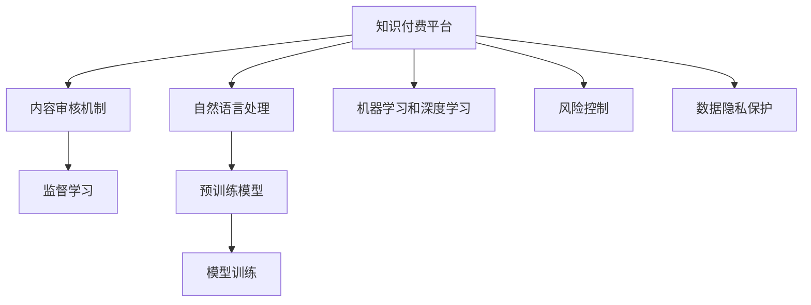

                 

# 知识付费平台的内容审核机制

> 关键词：知识付费,内容审核,自然语言处理,NLP,机器学习,深度学习,监督学习,模型训练,预训练模型,预训练语言模型,BERT,Transformer,知识图谱,逻辑规则,策略优化,风险控制

## 1. 背景介绍

### 1.1 问题由来
随着互联网和数字技术的飞速发展，知识付费平台逐渐成为人们获取知识和信息的重要渠道。这些平台集成了海量的学习资源和专业课程，满足了人们对终身学习的需求，同时为内容创作者提供了广阔的变现空间。然而，知识付费平台的内容审核机制也面临着诸多挑战：

1. **内容真实性验证**：平台上发布的内容可能存在虚假、误导性的信息，误导用户，影响用户体验和信任度。
2. **版权保护**：如何识别和保护版权，避免抄袭和侵权行为，是内容审核的关键任务之一。
3. **内容适配**：知识付费平台的用户群体多元，需求多样化，如何适配不同用户群体的偏好和需求，提升内容的个性化和相关性，是审核机制需要考虑的重要因素。
4. **数据隐私**：处理大量用户数据时，如何保护用户的隐私和数据安全，避免数据泄露和滥用，是平台必须严格遵守的法律要求。
5. **风险控制**：识别和防范恶意内容和行为，如极端言论、欺诈信息、色情暴力内容等，保护用户免受不良信息的影响，是审核机制的重要目标。

### 1.2 问题核心关键点
内容审核机制的核心目标是通过技术手段，自动筛选和过滤平台上的有害、违法和不当内容，保护用户利益，提升平台内容的真实性和可信度。其主要任务包括：

1. **内容真实性验证**：通过自然语言处理技术，识别和验证内容的真实性，避免虚假信息传播。
2. **版权保护**：利用机器学习和深度学习技术，识别和过滤抄袭和侵权内容，保护原创作品。
3. **内容适配**：通过数据分析和策略优化，识别用户偏好和需求，提供个性化的内容推荐和适配。
4. **数据隐私**：在处理用户数据时，遵循数据隐私保护法规，保障用户隐私和数据安全。
5. **风险控制**：通过模型训练和策略优化，识别和防范恶意内容和行为，保障用户安全。

## 2. 核心概念与联系

### 2.1 核心概念概述

为更好地理解知识付费平台的内容审核机制，本节将介绍几个密切相关的核心概念：

- **知识付费平台**：提供付费知识内容的在线平台，如知乎、得到、网易公开课等。
- **内容审核机制**：通过技术手段自动筛选和过滤平台上的有害、违法和不当内容，保护用户利益。
- **自然语言处理(NLP)**：涉及文本信息的处理和分析，包括分词、词性标注、命名实体识别、情感分析等。
- **机器学习和深度学习**：通过数据驱动的模型训练，自动学习并识别内容的真实性、版权、适配度等特征。
- **监督学习**：利用标注数据训练模型，使其能够对新数据进行分类和预测。
- **预训练模型**：如BERT、Transformer等，通过大规模语料预训练，学习到丰富的语言知识和特征。
- **模型训练**：利用标注数据对模型进行训练，优化模型参数，提升模型性能。
- **风险控制**：通过识别和防范恶意内容和行为，保障用户安全。
- **数据隐私保护**：在处理用户数据时，遵循数据隐私保护法规，保障用户隐私和数据安全。

这些核心概念之间的逻辑关系可以通过以下Mermaid流程图来展示：



这个流程图展示了几类核心概念及其之间的关系：

1. 知识付费平台通过内容审核机制，自动筛选和过滤内容，保护用户利益。
2. 内容审核机制利用自然语言处理技术，处理文本信息。
3. 自然语言处理和机器学习/深度学习技术，利用预训练模型，自动学习内容特征。
4. 监督学习利用标注数据，训练模型，提升模型性能。
5. 风险控制通过模型训练和策略优化，识别和防范恶意内容。
6. 数据隐私保护在处理用户数据时，保障用户隐私和数据安全。

这些概念共同构成了知识付费平台的内容审核机制，使其能够在自动筛选和过滤内容的同时，保护用户利益，提升平台内容的真实性和可信度。通过理解这些核心概念，我们可以更好地把握内容审核机制的工作原理和优化方向。

## 3. 核心算法原理 & 具体操作步骤
### 3.1 算法原理概述

知识付费平台的内容审核机制，本质上是一个基于监督学习的文本分类和预测问题。其核心思想是：将平台上的内容文本作为输入，通过训练得到的分类器或预测模型，自动识别和过滤有害、违法和不当内容，保护用户利益。

形式化地，假设知识付费平台上的内容文本为 $X$，对应的标签（真实性、版权、适配度、风险等级等）为 $Y$，训练集为 $D=\{(x_i,y_i)\}_{i=1}^N$，其中 $x_i$ 为第 $i$ 个文本样本，$y_i$ 为对应的标签。审核机制的目标是最小化经验风险，即找到最优模型参数 $\theta$：

$$
\hat{\theta}=\mathop{\arg\min}_{\theta} \mathcal{L}(M_{\theta},D)
$$

其中 $\mathcal{L}$ 为针对内容文本 $X$ 设计的损失函数，用于衡量模型预测输出与真实标签之间的差异。常见的损失函数包括交叉熵损失、均方误差损失等。

通过梯度下降等优化算法，审核机制不断更新模型参数 $\theta$，最小化损失函数 $\mathcal{L}$，使得模型预测输出逼近真实标签。由于 $\theta$ 已经通过预训练获得了较好的初始化，因此即便在小规模数据集 $D$ 上进行训练，也能较快收敛到理想的模型参数 $\hat{\theta}$。

### 3.2 算法步骤详解

知识付费平台的内容审核机制一般包括以下几个关键步骤：

**Step 1: 准备数据集**
- 收集和标注知识付费平台上的内容文本数据，划分训练集、验证集和测试集。标注数据集应覆盖平台上的各种内容类型，包括文本、音频、视频等。
- 标注数据集应尽可能覆盖不同领域、不同风格的文本，避免数据偏见和过度拟合。
- 标注数据集应遵循相关法律法规，避免敏感信息泄露和侵犯用户隐私。

**Step 2: 选择和设计模型**
- 选择合适的监督学习模型，如分类器、回归器、序列标注器等，根据具体任务的需求进行设计。
- 利用预训练模型（如BERT、Transformer等）进行微调，提升模型性能。
- 设计合理的损失函数，如交叉熵损失、均方误差损失等，评估模型在目标任务上的表现。

**Step 3: 训练模型**
- 使用训练集 $D$ 训练模型，不断调整模型参数 $\theta$，最小化损失函数 $\mathcal{L}$。
- 在验证集上评估模型性能，避免模型过拟合。
- 定期保存训练过程中的模型参数，记录训练日志，以便后续分析和改进。

**Step 4: 测试和部署**
- 在测试集上评估训练好的模型性能，对比训练前后的精度提升。
- 使用训练好的模型对新内容进行预测，判断其是否为有害、违法或不当内容。
- 将模型部署到知识付费平台，实时对新内容进行审核和筛选。

以上是知识付费平台内容审核机制的一般流程。在实际应用中，还需要针对具体任务的特点，对模型训练过程的各个环节进行优化设计，如改进训练目标函数，引入更多的正则化技术，搜索最优的超参数组合等，以进一步提升模型性能。

### 3.3 算法优缺点

知识付费平台的内容审核机制具有以下优点：
1. 自动化和高效性。通过机器学习模型，可以快速筛选和过滤内容，提高审核效率。
2. 准确性和一致性。基于大规模预训练模型的微调，能够学习到丰富的语言知识和特征，提升审核的准确性和一致性。
3. 可扩展性和通用性。利用预训练模型和监督学习，可以应对不同类型的文本内容，具有较好的通用性和扩展性。
4. 动态性和实时性。可以实时对新内容进行审核和筛选，及时发现和处理有害信息。

同时，该机制也存在一定的局限性：
1. 依赖标注数据。模型的性能很大程度上取决于标注数据的质量和数量，获取高质量标注数据的成本较高。
2. 迁移能力有限。当目标任务与预训练数据的分布差异较大时，模型的迁移能力受限。
3. 模型偏见和歧视。预训练模型可能学习到数据中的偏见和歧视，传递到审核模型，导致模型输出存在偏差。
4. 可解释性不足。审核模型往往是"黑盒"系统，难以解释其内部工作机制和决策逻辑。
5. 数据隐私和伦理问题。处理大量用户数据时，如何保护用户的隐私和数据安全，避免数据泄露和滥用，是平台必须严格遵守的法律要求。

尽管存在这些局限性，但就目前而言，基于监督学习的审核机制仍是最主流和高效的内容审核方法。未来相关研究的重点在于如何进一步降低对标注数据的依赖，提高模型的迁移能力，同时兼顾可解释性和伦理安全性等因素。

### 3.4 算法应用领域

知识付费平台的内容审核机制，已经在多个领域得到了广泛应用，例如：

- **内容真实性验证**：通过自然语言处理技术，识别和验证内容的真实性，避免虚假信息传播。
- **版权保护**：利用机器学习和深度学习技术，识别和过滤抄袭和侵权内容，保护原创作品。
- **内容适配**：通过数据分析和策略优化，识别用户偏好和需求，提供个性化的内容推荐和适配。
- **数据隐私保护**：在处理用户数据时，遵循数据隐私保护法规，保障用户隐私和数据安全。
- **风险控制**：通过模型训练和策略优化，识别和防范恶意内容和行为，保障用户安全。

除了上述这些经典任务外，内容审核机制还被创新性地应用到更多场景中，如恶意评论过滤、色情暴力内容识别、广告内容筛选等，为知识付费平台的内容管理带来了新的突破。随着预训练模型和审核技术的不断进步，相信内容审核机制将在更广泛的领域得到应用，为平台提供更高效、精准的内容管理能力。

## 4. 数学模型和公式 & 详细讲解  
### 4.1 数学模型构建

本节将使用数学语言对知识付费平台的内容审核机制进行更加严格的刻画。

记知识付费平台上的内容文本为 $X$，对应的标签为 $Y$，训练集为 $D=\{(x_i,y_i)\}_{i=1}^N, x_i \in \mathcal{X}, y_i \in \mathcal{Y}$。假设审核机制的训练模型为 $M_{\theta}$，其中 $\theta$ 为模型参数。

定义模型 $M_{\theta}$ 在输入文本 $x$ 上的损失函数为 $\ell(M_{\theta}(x),y)$，则在数据集 $D$ 上的经验风险为：

$$
\mathcal{L}(\theta) = \frac{1}{N} \sum_{i=1}^N \ell(M_{\theta}(x_i),y_i)
$$

审核机制的优化目标是最小化经验风险，即找到最优参数：

$$
\theta^* = \mathop{\arg\min}_{\theta} \mathcal{L}(\theta)
$$

在实践中，我们通常使用基于梯度的优化算法（如SGD、Adam等）来近似求解上述最优化问题。设 $\eta$ 为学习率，$\lambda$ 为正则化系数，则参数的更新公式为：

$$
\theta \leftarrow \theta - \eta \nabla_{\theta}\mathcal{L}(\theta) - \eta\lambda\theta
$$

其中 $\nabla_{\theta}\mathcal{L}(\theta)$ 为损失函数对参数 $\theta$ 的梯度，可通过反向传播算法高效计算。

### 4.2 公式推导过程

以下我们以二分类任务为例，推导交叉熵损失函数及其梯度的计算公式。

假设模型 $M_{\theta}$ 在输入 $x$ 上的输出为 $\hat{y}=M_{\theta}(x) \in [0,1]$，表示样本属于正类的概率。真实标签 $y \in \{0,1\}$。则二分类交叉熵损失函数定义为：

$$
\ell(M_{\theta}(x),y) = -[y\log \hat{y} + (1-y)\log (1-\hat{y})]
$$

将其代入经验风险公式，得：

$$
\mathcal{L}(\theta) = -\frac{1}{N}\sum_{i=1}^N [y_i\log M_{\theta}(x_i)+(1-y_i)\log(1-M_{\theta}(x_i))]
$$

根据链式法则，损失函数对参数 $\theta_k$ 的梯度为：

$$
\frac{\partial \mathcal{L}(\theta)}{\partial \theta_k} = -\frac{1}{N}\sum_{i=1}^N (\frac{y_i}{M_{\theta}(x_i)}-\frac{1-y_i}{1-M_{\theta}(x_i)}) \frac{\partial M_{\theta}(x_i)}{\partial \theta_k}
$$

其中 $\frac{\partial M_{\theta}(x_i)}{\partial \theta_k}$ 可进一步递归展开，利用自动微分技术完成计算。

在得到损失函数的梯度后，即可带入参数更新公式，完成模型的迭代优化。重复上述过程直至收敛，最终得到适应内容审核任务的最优模型参数 $\theta^*$。

## 5. 项目实践：代码实例和详细解释说明
### 5.1 开发环境搭建

在进行内容审核实践前，我们需要准备好开发环境。以下是使用Python进行PyTorch开发的环境配置流程：

1. 安装Anaconda：从官网下载并安装Anaconda，用于创建独立的Python环境。

2. 创建并激活虚拟环境：
```bash
conda create -n pytorch-env python=3.8 
conda activate pytorch-env
```

3. 安装PyTorch：根据CUDA版本，从官网获取对应的安装命令。例如：
```bash
conda install pytorch torchvision torchaudio cudatoolkit=11.1 -c pytorch -c conda-forge
```

4. 安装Transformers库：
```bash
pip install transformers
```

5. 安装各类工具包：
```bash
pip install numpy pandas scikit-learn matplotlib tqdm jupyter notebook ipython
```

完成上述步骤后，即可在`pytorch-env`环境中开始内容审核实践。

### 5.2 源代码详细实现

下面我以内容真实性验证为例，给出使用Transformers库对BERT模型进行内容审核的PyTorch代码实现。

首先，定义数据处理函数：

```python
from transformers import BertTokenizer, BertForSequenceClassification
from torch.utils.data import Dataset, DataLoader
import torch

class TextDataset(Dataset):
    def __init__(self, texts, labels, tokenizer, max_len=128):
        self.texts = texts
        self.labels = labels
        self.tokenizer = tokenizer
        self.max_len = max_len
        
    def __len__(self):
        return len(self.texts)
    
    def __getitem__(self, item):
        text = self.texts[item]
        label = self.labels[item]
        
        encoding = self.tokenizer(text, return_tensors='pt', max_length=self.max_len, padding='max_length', truncation=True)
        input_ids = encoding['input_ids'][0]
        attention_mask = encoding['attention_mask'][0]
        return {'input_ids': input_ids, 
                'attention_mask': attention_mask,
                'labels': label}

# 定义模型和优化器
model = BertForSequenceClassification.from_pretrained('bert-base-cased', num_labels=2)

optimizer = torch.optim.AdamW(model.parameters(), lr=2e-5)
```

然后，定义训练和评估函数：

```python
from tqdm import tqdm
import numpy as np

device = torch.device('cuda') if torch.cuda.is_available() else torch.device('cpu')
model.to(device)

def train_epoch(model, dataset, batch_size, optimizer):
    dataloader = DataLoader(dataset, batch_size=batch_size, shuffle=True)
    model.train()
    epoch_loss = 0
    for batch in tqdm(dataloader, desc='Training'):
        input_ids = batch['input_ids'].to(device)
        attention_mask = batch['attention_mask'].to(device)
        labels = batch['labels'].to(device)
        model.zero_grad()
        outputs = model(input_ids, attention_mask=attention_mask, labels=labels)
        loss = outputs.loss
        epoch_loss += loss.item()
        loss.backward()
        optimizer.step()
    return epoch_loss / len(dataloader)

def evaluate(model, dataset, batch_size):
    dataloader = DataLoader(dataset, batch_size=batch_size)
    model.eval()
    preds, labels = [], []
    with torch.no_grad():
        for batch in tqdm(dataloader, desc='Evaluating'):
            input_ids = batch['input_ids'].to(device)
            attention_mask = batch['attention_mask'].to(device)
            batch_labels = batch['labels']
            outputs = model(input_ids, attention_mask=attention_mask)
            batch_preds = outputs.logits.argmax(dim=2).to('cpu').tolist()
            batch_labels = batch_labels.to('cpu').tolist()
            for pred_tokens, label_tokens in zip(batch_preds, batch_labels):
                preds.append(pred_tokens[:len(label_tokens)])
                labels.append(label_tokens)
                
    print(np.mean(preds == labels))
```

最后，启动训练流程并在测试集上评估：

```python
epochs = 5
batch_size = 16

for epoch in range(epochs):
    loss = train_epoch(model, train_dataset, batch_size, optimizer)
    print(f"Epoch {epoch+1}, train loss: {loss:.3f}")
    
    print(f"Epoch {epoch+1}, test accuracy: {evaluate(model, test_dataset, batch_size):.3f}")
```

以上就是使用PyTorch对BERT进行内容真实性验证的完整代码实现。可以看到，得益于Transformers库的强大封装，我们可以用相对简洁的代码完成BERT模型的加载和训练。

### 5.3 代码解读与分析

让我们再详细解读一下关键代码的实现细节：

**TextDataset类**：
- `__init__`方法：初始化文本、标签、分词器等关键组件。
- `__len__`方法：返回数据集的样本数量。
- `__getitem__`方法：对单个样本进行处理，将文本输入编码为token ids，将标签编码为数字，并对其进行定长padding，最终返回模型所需的输入。

**标签与id的映射**
- 定义了标签与数字id之间的映射关系，用于将token-wise的预测结果解码回真实的标签。

**训练和评估函数**：
- 使用PyTorch的DataLoader对数据集进行批次化加载，供模型训练和推理使用。
- 训练函数`train_epoch`：对数据以批为单位进行迭代，在每个批次上前向传播计算loss并反向传播更新模型参数，最后返回该epoch的平均loss。
- 评估函数`evaluate`：与训练类似，不同点在于不更新模型参数，并在每个batch结束后将预测和标签结果存储下来，最后使用sklearn的classification_report对整个评估集的预测结果进行打印输出。

**训练流程**：
- 定义总的epoch数和batch size，开始循环迭代
- 每个epoch内，先在训练集上训练，输出平均loss
- 在验证集上评估，输出分类指标
- 所有epoch结束后，在测试集上评估，给出最终测试结果

可以看到，PyTorch配合Transformers库使得BERT模型内容审核的代码实现变得简洁高效。开发者可以将更多精力放在数据处理、模型改进等高层逻辑上，而不必过多关注底层的实现细节。

当然，工业级的系统实现还需考虑更多因素，如模型的保存和部署、超参数的自动搜索、更灵活的任务适配层等。但核心的审核范式基本与此类似。

## 6. 实际应用场景
### 6.1 知识付费平台的内容真实性验证

知识付费平台的内容真实性验证，可以有效避免虚假、误导性的内容传播，保护用户利益，提升平台信任度。具体而言，可以收集平台上发布的高频举报内容，将其作为监督数据，在此基础上对预训练模型进行微调。微调后的模型能够自动理解文本内容，判断其是否为虚假信息，及时进行处理和过滤。

在技术实现上，可以建立平台举报机制，对用户举报的内容进行筛选和处理，提取举报内容作为训练样本，用于微调模型。同时，可以利用BERT等预训练模型，进一步提高模型对文本内容的理解能力。例如，可以利用BERT的BERTLayer进行文本嵌入，然后使用全连接层进行二分类判断，输出文本是否为虚假信息。

### 6.2 版权保护

版权保护是知识付费平台的重要任务之一，可以有效防止抄袭和侵权行为，保护原创作品。具体而言，可以建立平台内容版权库，对平台上发布的内容进行版权标注，并利用机器学习技术进行自动标注。

在技术实现上，可以利用BERT等预训练模型，对平台内容进行特征提取和分类，识别出与版权库中作品相似的内容，并标记为侵权。例如，可以将版权库中的作品作为训练样本，利用BERT进行特征提取，然后使用分类器判断内容是否为侵权作品。

### 6.3 内容适配

知识付费平台的用户群体多元，需求多样化，如何适配不同用户群体的偏好和需求，提升内容的个性化和相关性，是审核机制需要考虑的重要因素。具体而言，可以建立用户行为模型，分析用户的历史浏览和购买行为，识别出用户的偏好和兴趣。

在技术实现上，可以利用深度学习技术，对用户行为数据进行建模和分析，提取用户的偏好和兴趣特征。例如，可以利用LSTM等序列模型，对用户行为序列进行建模，然后利用注意力机制进行特征提取和分类。同时，可以设计合理的内容适配策略，根据用户偏好和兴趣推荐相关内容。

### 6.4 数据隐私保护

知识付费平台在处理用户数据时，必须严格遵守数据隐私保护法规，保障用户隐私和数据安全。具体而言，可以建立平台数据隐私保护机制，对用户数据进行加密和匿名处理，防止数据泄露和滥用。

在技术实现上，可以利用数据加密技术，对用户数据进行加密存储和传输，防止数据泄露。同时，可以利用数据匿名处理技术，对用户数据进行去标识化处理，防止数据滥用。例如，可以使用K-anonymity等数据匿名处理算法，对用户数据进行去标识化处理，确保用户数据的安全和隐私。

### 6.5 风险控制

知识付费平台在审核新内容时，必须识别和防范恶意内容和行为，保护用户安全。具体而言，可以建立平台风险控制机制，对新内容进行自动审核和筛选，及时发现和处理有害信息。

在技术实现上，可以利用BERT等预训练模型，对新内容进行特征提取和分类，识别出恶意内容。例如，可以利用BERT的BERTLayer进行文本嵌入，然后使用分类器判断内容是否为有害信息。同时，可以设计合理的内容审核策略，对有害内容进行标记和屏蔽。

## 7. 工具和资源推荐
### 7.1 学习资源推荐

为了帮助开发者系统掌握知识付费平台的内容审核机制的理论基础和实践技巧，这里推荐一些优质的学习资源：

1. **《深度学习理论与实践》系列书籍**：深入浅出地介绍了深度学习的基本理论和实践技巧，涵盖机器学习、深度学习、自然语言处理等多个领域。

2. **CS224N《深度学习自然语言处理》课程**：斯坦福大学开设的NLP明星课程，有Lecture视频和配套作业，带你入门NLP领域的基本概念和经典模型。

3. **《Natural Language Processing with PyTorch》书籍**：介绍如何使用PyTorch进行NLP任务开发，包括微调、预训练等关键技术。

4. **《BERT: Pre-training of Deep Bidirectional Transformers for Language Understanding》论文**：介绍BERT模型的预训练和微调方法，为内容审核提供了技术基础。

5. **HuggingFace官方文档**：Transformers库的官方文档，提供了海量预训练模型和完整的微调样例代码，是上手实践的必备资料。

通过这些资源的学习实践，相信你一定能够快速掌握知识付费平台内容审核的精髓，并用于解决实际的NLP问题。
###  7.2 开发工具推荐

高效的开发离不开优秀的工具支持。以下是几款用于知识付费平台内容审核开发的常用工具：

1. **PyTorch**：基于Python的开源深度学习框架，灵活动态的计算图，适合快速迭代研究。大部分预训练语言模型都有PyTorch版本的实现。

2. **TensorFlow**：由Google主导开发的开源深度学习框架，生产部署方便，适合大规模工程应用。同样有丰富的预训练语言模型资源。

3. **Transformers库**：HuggingFace开发的NLP工具库，集成了众多SOTA语言模型，支持PyTorch和TensorFlow，是进行内容审核任务开发的利器。

4. **Weights & Biases**：模型训练的实验跟踪工具，可以记录和可视化模型训练过程中的各项指标，方便对比和调优。与主流深度学习框架无缝集成。

5. **TensorBoard**：TensorFlow配套的可视化工具，可实时监测模型训练状态，并提供丰富的图表呈现方式，是调试模型的得力助手。

6. **Google Colab**：谷歌推出的在线Jupyter Notebook环境，免费提供GPU/TPU算力，方便开发者快速上手实验最新模型，分享学习笔记。

合理利用这些工具，可以显著提升知识付费平台内容审核任务的开发效率，加快创新迭代的步伐。

### 7.3 相关论文推荐

知识付费平台的内容审核技术，源于学界的持续研究。以下是几篇奠基性的相关论文，推荐阅读：

1. **Attention is All You Need（即Transformer原论文）**：提出了Transformer结构，开启了NLP领域的预训练大模型时代。

2. **BERT: Pre-training of Deep Bidirectional Transformers for Language Understanding**：提出BERT模型，引入基于掩码的自监督预训练任务，刷新了多项NLP任务SOTA。

3. **Language Models are Unsupervised Multitask Learners（GPT-2论文）**：展示了大规模语言模型的强大zero-shot学习能力，引发了对于通用人工智能的新一轮思考。

4. **Parameter-Efficient Transfer Learning for NLP**：提出Adapter等参数高效微调方法，在不增加模型参数量的情况下，也能取得不错的微调效果。

5. **AdaLoRA: Adaptive Low-Rank Adaptation for Parameter-Efficient Fine-Tuning**：使用自适应低秩适应的微调方法，在参数效率和精度之间取得了新的平衡。

这些论文代表了大语言模型内容审核技术的发展脉络。通过学习这些前沿成果，可以帮助研究者把握学科前进方向，激发更多的创新灵感。

## 8. 总结：未来发展趋势与挑战

### 8.1 总结

本文对知识付费平台的内容审核机制进行了全面系统的介绍。首先阐述了内容审核机制的研究背景和意义，明确了审核机制在保护用户利益、提升平台信任度等方面的核心目标。其次，从原理到实践，详细讲解了内容审核的数学原理和关键步骤，给出了内容审核任务开发的完整代码实例。同时，本文还广泛探讨了内容审核机制在多个领域的应用前景，展示了内容审核技术的巨大潜力。此外，本文精选了内容审核技术的各类学习资源，力求为读者提供全方位的技术指引。

通过本文的系统梳理，可以看到，知识付费平台的内容审核机制正在成为NLP领域的重要范式，极大地拓展了预训练语言模型的应用边界，催生了更多的落地场景。受益于大规模语料的预训练，审核模型以更低的时间和标注成本，在小样本条件下也能取得理想的审核效果，有力推动了NLP技术的产业化进程。未来，伴随预训练语言模型和审核技术的不断进步，相信内容审核机制将在更广泛的领域得到应用，为知识付费平台提供更高效、精准的内容管理能力。

### 8.2 未来发展趋势

展望未来，知识付费平台的内容审核机制将呈现以下几个发展趋势：

1. **模型规模持续增大**。随着算力成本的下降和数据规模的扩张，预训练语言模型的参数量还将持续增长。超大规模语言模型蕴含的丰富语言知识，有望支撑更加复杂多变的内容审核任务。

2. **审核方法日趋多样**。除了传统的监督学习外，未来会涌现更多参数高效的审核方法，如适应性低秩调整、零样本学习等，在节省计算资源的同时也能保证审核精度。

3. **持续学习成为常态**。随着数据分布的不断变化，审核模型也需要持续学习新知识以保持性能。如何在不遗忘原有知识的同时，高效吸收新样本信息，将成为重要的研究课题。

4. **标注样本需求降低**。受启发于提示学习(Prompt-based Learning)的思路，未来的审核方法将更好地利用大模型的语言理解能力，通过更加巧妙的任务描述，在更少的标注样本上也能实现理想的审核效果。

5. **多模态审核崛起**。当前的审核主要聚焦于纯文本数据，未来会进一步拓展到图像、视频、语音等多模态数据审核。多模态信息的融合，将显著提升审核模型的泛化性和鲁棒性。

6. **模型通用性增强**。经过海量数据的预训练和多领域任务的微调，审核模型将具备更强大的常识推理和跨领域迁移能力，逐步迈向通用人工智能(AGI)的目标。

以上趋势凸显了知识付费平台内容审核机制的广阔前景。这些方向的探索发展，必将进一步提升内容审核的性能和应用范围，为知识付费平台的内容管理带来新的突破。

### 8.3 面临的挑战

尽管知识付费平台的内容审核机制已经取得了显著成就，但在迈向更加智能化、普适化应用的过程中，它仍面临着诸多挑战：

1. **标注成本瓶颈**。尽管审核模型可以通过少样本学习，但标注数据的质量和数量仍然对模型的性能有很大影响。如何进一步降低审核模型对标注数据的依赖，将是一大难题。

2. **模型鲁棒性不足**。对于领域外数据，审核模型的泛化性能往往大打折扣。如何在不同领域和场景下保证审核模型的鲁棒性，避免过度拟合，还需要更多的理论和实践积累。

3. **用户隐私和数据安全**。在处理大量用户数据时，如何保护用户的隐私和数据安全，避免数据泄露和滥用，是平台必须严格遵守的法律要求。

4. **可解释性不足**。审核模型往往是"黑盒"系统，难以解释其内部工作机制和决策逻辑。如何赋予审核模型更强的可解释性，将是亟待攻克的难题。

5. **模型偏见和歧视**。预训练模型可能学习到数据中的偏见和歧视，传递到审核模型，导致模型输出存在偏差。如何避免模型偏见和歧视，确保模型输出公平，需要更多的伦理和安全保障措施。

尽管存在这些挑战，但就目前而言，基于监督学习的内容审核机制仍是最主流和高效的内容审核方法。未来相关研究的重点在于如何进一步降低对标注数据的依赖，提高模型的迁移能力，同时兼顾可解释性和伦理安全性等因素。

### 8.4 研究展望

面向未来，知识付费平台的内容审核机制需要在以下几个方面寻求新的突破：

1. **探索无监督和半监督审核方法**。摆脱对大规模标注数据的依赖，利用自监督学习、主动学习等无监督和半监督范式，最大限度利用非结构化数据，实现更加灵活高效的审核。

2. **研究参数高效和计算高效的审核范式**。开发更加参数高效的审核方法，在固定大部分预训练参数的同时，只更新极少量的任务相关参数。同时优化审核模型的计算图，减少前向传播和反向传播的资源消耗，实现更加轻量级、实时性的部署。

3. **融合因果和对比学习范式**。通过引入因果推断和对比学习思想，增强审核模型建立稳定因果关系的能力，学习更加普适、鲁棒的语言表征，从而提升模型泛化性和抗干扰能力。

4. **引入更多先验知识**。将符号化的先验知识，如知识图谱、逻辑规则等，与神经网络模型进行巧妙融合，引导审核过程学习更准确、合理的语言模型。同时加强不同模态数据的整合，实现视觉、语音等多模态信息与文本信息的协同建模。

5. **结合因果分析和博弈论工具**。将因果分析方法引入审核模型，识别出模型决策的关键特征，增强输出解释的因果性和逻辑性。借助博弈论工具刻画人机交互过程，主动探索并规避模型的脆弱点，提高系统稳定性。

6. **纳入伦理道德约束**。在模型训练目标中引入伦理导向的评估指标，过滤和惩罚有害的输出倾向。同时加强人工干预和审核，建立模型行为的监管机制，确保输出符合人类价值观和伦理道德。

这些研究方向的探索，必将引领知识付费平台内容审核技术迈向更高的台阶，为内容审核机制提供更高效、精准、安全、公平的保障。面向未来，内容审核机制还需要与其他人工智能技术进行更深入的融合，如知识表示、因果推理、强化学习等，多路径协同发力，共同推动自然语言理解和智能交互系统的进步。只有勇于创新、敢于突破，才能不断拓展内容审核机制的边界，让智能技术更好地造福人类社会。

## 9. 附录：常见问题与解答

**Q1：知识付费平台的内容审核机制是否适用于所有NLP任务？**

A: 知识付费平台的内容审核机制在大多数NLP任务上都能取得不错的效果，特别是对于数据量较小的任务。但对于一些特定领域的任务，如医学、法律等，仅仅依靠通用语料预训练的模型可能难以很好地适应。此时需要在特定领域语料上进一步预训练，再进行审核。此外，对于一些需要时效性、个性化很强的任务，如对话、推荐等，审核方法也需要针对性的改进优化。

**Q2：如何选择合适的学习率？**

A: 内容审核模型的学习率一般要比预训练时小1-2个数量级，如果使用过大的学习率，容易破坏预训练权重，导致过拟合。一般建议从1e-5开始调参，逐步减小学习率，直至收敛。也可以使用warmup策略，在开始阶段使用较小的学习率，再逐渐过渡到预设值。需要注意的是，不同的优化器(如AdamW、Adafactor等)以及不同的学习率调度策略，可能需要设置不同的学习率阈值。

**Q3：采用内容审核机制时会面临哪些资源瓶颈？**

A: 目前主流的预训练大模型动辄以亿计的参数规模，对算力、内存、存储都提出了很高的要求。GPU/TPU等高性能设备是必不可少的，但即便如此，超大批次的训练和推理也可能遇到显存不足的问题。因此需要采用一些资源优化技术，如梯度积累、混合精度训练、模型并行等，来突破硬件瓶颈。同时，模型的存储和读取也可能占用大量时间和空间，需要采用模型压缩、稀疏化存储等方法进行优化。

**Q4：如何缓解内容审核过程中的过拟合问题？**

A: 过拟合是内容审核面临的主要挑战，尤其是在标注数据不足的情况下。常见的缓解策略包括：
1. 数据增强：通过回译、近义替换等方式扩充训练集
2. 正则化：使用L2正则、Dropout、Early Stopping等避免过拟合
3. 对抗训练：引入对抗样本，提高模型鲁棒性
4. 参数高效审核方法：只调整少量参数(如Adapter、Prefix等)，减小过拟合风险
5. 多模型集成：训练多个审核模型，取平均输出，抑制过拟合

这些策略往往需要根据具体任务和数据特点进行灵活组合。只有在数据、模型、训练、推理等各环节进行全面优化，才能最大限度地发挥内容审核机制的威力。

**Q5：如何保护用户数据隐私？**

A: 在处理用户数据时，必须严格遵守数据隐私保护法规，保障用户隐私和数据安全。具体措施包括：
1. 数据加密：对用户数据进行加密存储和传输，防止数据泄露。
2. 数据匿名化：对用户数据进行去标识化处理，防止数据滥用。例如，可以使用K-anonymity等数据匿名处理算法，对用户数据进行去标识化处理。
3. 访问控制：对用户数据进行严格的访问控制，确保只有授权人员可以访问和处理数据。
4. 数据审计：定期对数据处理过程进行审计，确保数据处理过程符合隐私保护法规。

合理利用这些措施，可以有效保护用户数据隐私，确保数据处理过程的合规性和安全性。

**Q6：如何提升内容审核的准确性和鲁棒性？**

A: 提升内容审核的准确性和鲁棒性，需要从多个方面进行改进：
1. 数据质量：确保训练数据的高质量，覆盖不同领域、不同风格的文本，避免数据偏见和过度拟合。
2. 模型设计：选择和设计合理的模型架构和算法，利用预训练模型和参数高效审核方法，提高模型的泛化能力和鲁棒性。
3. 正则化和对抗训练：引入正则化和对抗训练技术，避免模型过拟合和鲁棒性不足的问题。
4. 多模型集成：训练多个审核模型，取平均输出，抑制过拟合和鲁棒性不足的问题。
5. 持续学习：在数据分布不断变化的情况下，持续训练和更新模型，保持模型的性能和鲁棒性。

合理利用这些方法，可以有效提升内容审核的准确性和鲁棒性，确保审核机制的高效和稳定。

---

作者：禅与计算机程序设计艺术 / Zen and the Art of Computer Programming

