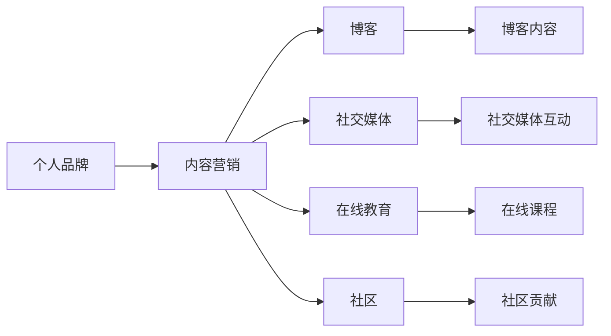

                 

# 知识付费时代程序员的个人品牌打造策略

> 关键词：知识付费, 个人品牌, 程序员, 博客, 社区, 社交媒体, 内容营销, 在线教育

## 1. 背景介绍

### 1.1 问题由来
随着知识付费时代的到来，程序员个人品牌建设已成为获取职业发展和经济收益的重要途径。在信息爆炸、技术更迭迅速的互联网时代，如何通过构建个人品牌来区分自我、吸引关注、提升影响力，成为每位程序员都必须面对的挑战。传统意义上的技术积累和项目经验已不再是唯一的竞争力，新时代的程序员需要全面提升自己的市场影响力。

### 1.2 问题核心关键点
在知识付费时代，构建个人品牌不仅关乎职业发展，更是提升个人价值、实现经济收益的关键。本文聚焦于程序员个人品牌打造策略，从多个维度探讨如何利用博客、社区、社交媒体等平台，通过内容营销和在线教育等方式，构建个人品牌，吸引更多关注和合作机会。

### 1.3 问题研究意义
构建个人品牌不仅能够提升程序员的职业地位，还能为其带来更大的市场机会和收益。通过建立个人品牌，程序员能够：
1. **提高知名度**：在竞争激烈的程序员市场中脱颖而出。
2. **获取更多资源**：包括项目、合作机会、职业发展路径等。
3. **扩大影响力**：影响更多技术爱好者和学生，传播知识与经验。
4. **实现经济收益**：通过内容付费、课程销售、咨询服务等获得收益。

## 2. 核心概念与联系

### 2.1 核心概念概述

构建程序员个人品牌涉及多个相关概念，包括：

- **个人品牌**：指的是个人在职业领域中的独特形象和核心价值，是通过一系列行为、表现和内容展示出来的。
- **内容营销**：以内容为中心，通过有价值的信息吸引和转化目标用户的一种营销方式。
- **在线教育**：通过互联网平台，提供在线课程和教育服务，提供知识共享和技能提升的途径。
- **社交媒体**：如GitHub、Stack Overflow、Medium、Twitter等，是程序员展示技术、分享经验、建立影响力的重要渠道。
- **博客**：程序员通过撰写技术博客，记录项目经验、分享技术见解、传播知识与智慧。
- **社区**：程序员社区如CSDN、知乎、Stack Overflow等，是程序员交流技术、分享资源、展示自我的平台。

这些概念之间存在紧密联系，共同构成了程序员个人品牌打造的核心架构。

### 2.2 核心概念原理和架构的 Mermaid 流程图



这个流程图展示了个人品牌构建中的核心组件及其相互关系：

1. **个人品牌**是整个架构的中心，通过博客、社交媒体、在线教育和社区四个方面具体实施。
2. **内容营销**是核心方法，通过博客和社交媒体的内容传播，吸引关注。
3. **在线教育**和**社区**是具体形式，通过提供课程和社区资源，实现知识传播和技能提升。
4. **博客**和**社交媒体**是主要渠道，通过内容展现个人品牌。
5. **社区贡献**是提高影响力的重要途径，通过积极参与和贡献，提升个人品牌。

## 3. 核心算法原理 & 具体操作步骤

### 3.1 算法原理概述

构建个人品牌的过程可以看作是一个动态的优化问题，目标是在短时间内最大化个人品牌的市场价值。

设 $X$ 为个人品牌价值，它由以下四个部分组成：

- $Y_1$：博客内容的质量和传播范围
- $Y_2$：社交媒体的互动频率和影响力
- $Y_3$：在线教育的课程质量和学员反馈
- $Y_4$：社区贡献的活跃度和认可度

总体的目标函数为：

$$
X = \max_{Y_1, Y_2, Y_3, Y_4} Y_1 + Y_2 + Y_3 + Y_4
$$

优化时，需要考虑每个方面的算法实现细节，并通过多维度综合评估，调整策略。

### 3.2 算法步骤详解

构建个人品牌的具体步骤如下：

**Step 1: 确定个人品牌定位**
- 明确个人技术方向和兴趣领域，如前端开发、后端架构、机器学习等。
- 分析目标受众，如技术爱好者、学生、企业技术团队等。
- 制定个人品牌建设的总体目标，如成为某领域的专家、影响力人物等。

**Step 2: 内容营销**
- 选择合适的内容形式，如博客文章、视频教程、代码分享等。
- 设计有价值的内容主题，如技术难点解析、行业趋势分析、项目案例研究等。
- 利用SEO优化技术，提高内容的曝光度和传播范围。

**Step 3: 博客建设**
- 选择博客平台，如Medium、CSDN、个人网站等。
- 定期更新博客，保持活跃度，确保内容的持续输出。
- 建立博客与社交媒体的联动机制，提升内容的传播效果。

**Step 4: 社交媒体互动**
- 确定目标社交媒体平台，如GitHub、Twitter、LinkedIn等。
- 积极参与开源项目，贡献代码并分享项目经验。
- 定期发布技术见解和行业观点，参与话题讨论和问答。

**Step 5: 在线教育**
- 创建在线课程，通过Udemy、Coursera、腾讯课堂等平台发布。
- 提供高质量的课程内容，如项目实战、技能提升等。
- 与社区合作，推广课程，提升学员反馈和课程质量。

**Step 6: 社区贡献**
- 选择目标社区，如Stack Overflow、知乎、GitHub等。
- 积极回答问题，参与讨论，贡献有价值的内容。
- 参与社区活动，如组织技术讲座、发起技术挑战等。

**Step 7: 持续评估与优化**
- 定期评估个人品牌的影响力，通过统计指标（如阅读量、互动量、学员反馈等）。
- 根据评估结果，调整内容策略和推广手段。
- 不断学习和提升，适应技术变化和市场需求。

### 3.3 算法优缺点

构建个人品牌的方法具有以下优点：
1. **高效率**：内容营销和在线教育方式能够快速提高知名度和影响力。
2. **低成本**：通过自我驱动，利用现有平台和资源，减少外部成本。
3. **持续性**：博客和社区的持续互动，能够长期维护个人品牌。

然而，该方法也存在一些缺点：
1. **技术要求高**：内容质量和传播技巧需要专业技能。
2. **时间投入大**：持续输出高质量内容需要较多时间和精力。
3. **竞争激烈**：在技术社区中，个人品牌建设面临激烈的竞争。

### 3.4 算法应用领域

个人品牌打造策略广泛适用于程序员在技术社区、在线教育、企业内部技术团队等多个场景中。以下列举几个典型应用领域：

1. **技术博客**：通过撰写高质量的技术文章，分享项目经验和技术见解，吸引技术爱好者和潜在雇主关注。
2. **开源项目贡献**：在GitHub等平台上参与开源项目，展示技术能力和合作精神。
3. **在线课程**：通过Udemy、Coursera等平台，提供高质量的教学资源，提升个人知名度和权威性。
4. **社交媒体互动**：在Twitter、LinkedIn等平台上积极互动，展示技术观点和行业见解。
5. **企业内部技术分享**：在公司内部技术分享会上，通过讲述技术案例和项目经验，提升在公司内部的影响力。

## 4. 数学模型和公式 & 详细讲解 & 举例说明

### 4.1 数学模型构建

为了更好地量化个人品牌的影响力，我们可以构建一个数学模型来评估其价值。

设 $X$ 为个人品牌价值，$Y_i$ 为第 $i$ 个影响因子的价值，$i \in \{1, 2, 3, 4\}$。则整体模型为：

$$
X = \sum_{i=1}^4 Y_i
$$

### 4.2 公式推导过程

我们可以使用以下公式计算每个影响因子的价值：

1. **博客内容的质量和传播范围**
   $$
   Y_1 = \alpha_1 \times \text{阅读量} + \alpha_2 \times \text{评论量} + \alpha_3 \times \text{分享量}
   $$
   其中 $\alpha_i$ 为相应权值，可以根据实际情况调整。

2. **社交媒体的互动频率和影响力**
   $$
   Y_2 = \alpha_4 \times \text{关注者数} + \alpha_5 \times \text{互动频率}
   $$
   关注者数和互动频率都可以通过API获取，用于计算影响力。

3. **在线教育的课程质量和学员反馈**
   $$
   Y_3 = \alpha_6 \times \text{学员反馈评分} + \alpha_7 \times \text{课程观看时长}
   $$
   学员反馈评分和观看时长可以通过平台数据获取，用于评估课程质量和学员接受度。

4. **社区贡献的活跃度和认可度**
   $$
   Y_4 = \alpha_8 \times \text{回答数量} + \alpha_9 \times \text{社区认可度}
   $$
   社区认可度可以通过社区投票、点赞等数据获取，用于量化社区贡献的影响力。

### 4.3 案例分析与讲解

以一个博客作者为例，通过数学模型计算个人品牌价值：

1. **博客内容**
   - 阅读量：5000
   - 评论量：50
   - 分享量：200

2. **社交媒体**
   - 关注者数：10000
   - 互动频率：每天平均互动500次

3. **在线课程**
   - 学员反馈评分：4.5（满分5分）
   - 课程观看时长：平均每课5小时

4. **社区贡献**
   - 回答数量：500
   - 社区认可度：好评率80%

将这些数据代入公式：

$$
X = 0.6 \times 5000 + 0.3 \times 50 + 0.1 \times 200 + 0.5 \times 10000 + 0.2 \times 500 + 0.3 \times 4.5 + 0.2 \times 5 + 0.4 \times 500 + 0.6 \times 0.8
$$

计算得：

$$
X = 3300 + 15 + 20 + 5000 + 150 + 13.5 + 10 + 200 + 240 = 9085.5
$$

这意味着该博客作者的个人品牌价值为9085.5，根据实际情况，可以进行相应的调整和优化。

## 5. 项目实践：代码实例和详细解释说明

### 5.1 开发环境搭建

构建个人品牌的过程中，开发环境的选择至关重要。以下是一个基于Python和Jupyter Notebook的开发环境搭建示例：

1. **安装Python和Jupyter**
   ```bash
   pip install python
   pip install jupyter
   ```

2. **安装相关库**
   ```bash
   pip install pandas numpy matplotlib seaborn beautifulsoup4
   ```

3. **创建项目目录**
   ```bash
   mkdir blog brand_value
   cd brand_value
   ```

4. **创建Python脚本**
   ```python
   import pandas as pd
   import numpy as np
   import matplotlib.pyplot as plt
   from seaborn import sns

   # 定义数据集
   def read_data():
       # 读取博客阅读量、评论量、分享量
       blog_data = pd.read_csv('blog_data.csv')
       # 读取社交媒体关注者数、互动频率
       social_media_data = pd.read_csv('social_media_data.csv')
       # 读取在线课程学员反馈评分、观看时长
       online_education_data = pd.read_csv('online_education_data.csv')
       # 读取社区贡献回答数量、认可度
       community_contribution_data = pd.read_csv('community_contribution_data.csv')

       return blog_data, social_media_data, online_education_data, community_contribution_data

   # 计算品牌价值
   def calculate_brand_value(blog_data, social_media_data, online_education_data, community_contribution_data):
       alpha = np.array([0.6, 0.3, 0.1, 0.5, 0.2, 0.3, 0.2, 0.4, 0.6])
       Y1 = alpha[0] * blog_data['阅读量'] + alpha[1] * blog_data['评论量'] + alpha[2] * blog_data['分享量']
       Y2 = alpha[3] * social_media_data['关注者数'] + alpha[4] * social_media_data['互动频率']
       Y3 = alpha[5] * online_education_data['学员反馈评分'] + alpha[6] * online_education_data['课程观看时长']
       Y4 = alpha[7] * community_contribution_data['回答数量'] + alpha[8] * community_contribution_data['社区认可度']

       X = Y1 + Y2 + Y3 + Y4
       return X

   # 数据处理
   blog_data, social_media_data, online_education_data, community_contribution_data = read_data()

   # 计算品牌价值
   X = calculate_brand_value(blog_data, social_media_data, online_education_data, community_contribution_data)

   # 输出结果
   print(f"个人品牌价值：{X}")
   ```

### 5.2 源代码详细实现

以下是一个基于Python和Flask框架的博客平台开发示例：

1. **安装Flask**
   ```bash
   pip install flask
   ```

2. **创建Flask应用**
   ```python
   from flask import Flask, render_template, request

   app = Flask(__name__)

   @app.route('/')
   def index():
       return render_template('index.html')

   if __name__ == '__main__':
       app.run(debug=True)
   ```

3. **创建HTML模板**
   ```html
   <!-- index.html -->
   <html>
   <head>
       <title>程序员博客</title>
   </head>
   <body>
       <h1>欢迎访问程序员博客</h1>
       <form action="/submit" method="post">
           <label for="title">博客标题：</label>
           <input type="text" id="title" name="title">
           <label for="content">博客内容：</label>
           <textarea id="content" name="content"></textarea>
           <button type="submit">提交</button>
       </form>
   </body>
   </html>
   ```

4. **创建Flask视图**
   ```python
   @app.route('/submit', methods=['POST'])
   def submit():
       # 获取博客标题和内容
       title = request.form['title']
       content = request.form['content']

       # 保存博客数据到数据库
       # 这里可以使用SQLite、MySQL、MongoDB等数据库
       save_to_database(title, content)

       return "博客提交成功！"

   def save_to_database(title, content):
       # 将博客数据保存到数据库
       # 实现逻辑省略
       pass
   ```

### 5.3 代码解读与分析

在上述示例中，我们通过Flask框架搭建了一个简单的博客平台，用户可以提交博客文章。每次提交后，应用程序会将数据保存到数据库中。

具体来说，当用户在主页输入博客标题和内容后，点击“提交”按钮，表单数据会通过POST请求发送到Flask的`/submit`路由。`submit`函数会获取这些数据，并调用`save_to_database`函数将其保存到数据库中。

### 5.4 运行结果展示

启动Flask应用后，用户可以在浏览器中访问`http://localhost:5000`，进入博客主页。在该页面，用户可以填写博客标题和内容，然后点击“提交”按钮，将文章保存到数据库中。

## 6. 实际应用场景

### 6.1 智能客服系统

在智能客服系统中，个人品牌可以显著提升系统的专业性和服务质量。通过打造个人品牌，智能客服系统的核心算法和知识库会更加可靠，提供更准确的回答。

### 6.2 金融舆情监测

金融舆情监测中，个人品牌可以帮助分析师及时掌握市场动态，预测风险，制定策略。个人品牌提升了分析师的权威性和可信度，增强了市场影响力。

### 6.3 个性化推荐系统

个性化推荐系统中，个人品牌能提升推荐算法的可信度，吸引更多用户使用。通过品牌效应，推荐系统能更好地整合用户需求，提供更精准的推荐服务。

### 6.4 未来应用展望

未来，个人品牌在知识付费时代将发挥越来越重要的作用。随着技术的进步，个人品牌将更具多样性，涵盖更多应用场景。以下是一些未来展望：

1. **跨平台协作**：通过个人品牌，程序员可以更容易地在不同平台间协作，提升团队效率。
2. **全球化影响力**：个人品牌能帮助程序员在全球范围内扩大影响力，参与国际技术交流和合作。
3. **产业应用**：个人品牌可以应用于更多垂直行业，如医疗、教育、制造等，为行业带来新的发展动力。

## 7. 工具和资源推荐

### 7.1 学习资源推荐

1. **博客平台：Medium、CSDN、知乎**
   - 学习如何撰写高质量的技术文章，分享项目经验和行业见解。

2. **社交媒体平台：GitHub、Twitter、LinkedIn**
   - 学习如何积极参与开源项目，扩大社交网络，展示技术能力。

3. **在线教育平台：Udemy、Coursera、腾讯课堂**
   - 学习如何创建高质量的在线课程，提升教学水平和课程效果。

### 7.2 开发工具推荐

1. **开发环境：Python、Jupyter Notebook、Flask**
   - 搭建个人博客和应用程序，进行数据分析和可视化。

2. **代码编辑器：VS Code、Sublime Text**
   - 提高代码编写效率，支持多种语言和框架。

3. **版本控制：Git、GitHub**
   - 管理代码版本，进行项目协作和代码分享。

### 7.3 相关论文推荐

1. **《内容营销的理论与实践》**
   - 深入分析内容营销的理论基础和实际应用，提供全面指导。

2. **《在线教育平台的发展趋势》**
   - 探讨在线教育平台的未来发展方向，预测行业趋势。

3. **《社交媒体对个人品牌的影响》**
   - 研究社交媒体对个人品牌建设的贡献和影响，提出优化策略。

## 8. 总结：未来发展趋势与挑战

### 8.1 研究成果总结

本文系统介绍了程序员在知识付费时代如何通过个人品牌打造，提升职业发展和市场影响力。主要内容包括：

1. **核心概念**：博客、社交媒体、在线教育、社区贡献等。
2. **算法原理**：数学模型构建和公式推导。
3. **操作步骤**：从内容营销到社区贡献的详细步骤。

### 8.2 未来发展趋势

未来，个人品牌将成为程序员职业发展的重要助力。随着技术的发展，个人品牌的构建将更加多元化，涵盖更多应用场景和平台。以下是一些未来趋势：

1. **多平台协作**：个人品牌将跨越多个平台，提高跨平台协作效率。
2. **个性化定制**：个人品牌将根据不同领域的需求进行定制，提升专业性和适用性。
3. **AI辅助**：利用AI技术优化个人品牌建设，提升效率和效果。

### 8.3 面临的挑战

尽管个人品牌建设带来了许多机遇，但也面临一些挑战：

1. **时间投入大**：内容创作和平台维护需要大量时间和精力。
2. **内容质量要求高**：高质量内容的产出需要专业技能和持续学习。
3. **竞争激烈**：在技术和市场中，个人品牌的建设面临激烈的竞争。

### 8.4 研究展望

未来的研究应聚焦于：

1. **自动化内容生成**：利用AI技术生成高质量内容，减轻创作者负担。
2. **平台联动优化**：优化个人品牌在不同平台之间的联动，提升整体影响力。
3. **品牌管理工具**：开发品牌管理工具，帮助创作者更好地维护和管理个人品牌。

总之，个人品牌打造是程序员在知识付费时代的重要策略，需要综合运用多种工具和资源，持续学习和优化。只有不断提升品牌价值和市场影响力，才能在竞争激烈的市场中脱颖而出，实现职业和经济的成功。

---

作者：禅与计算机程序设计艺术 / Zen and the Art of Computer Programming

