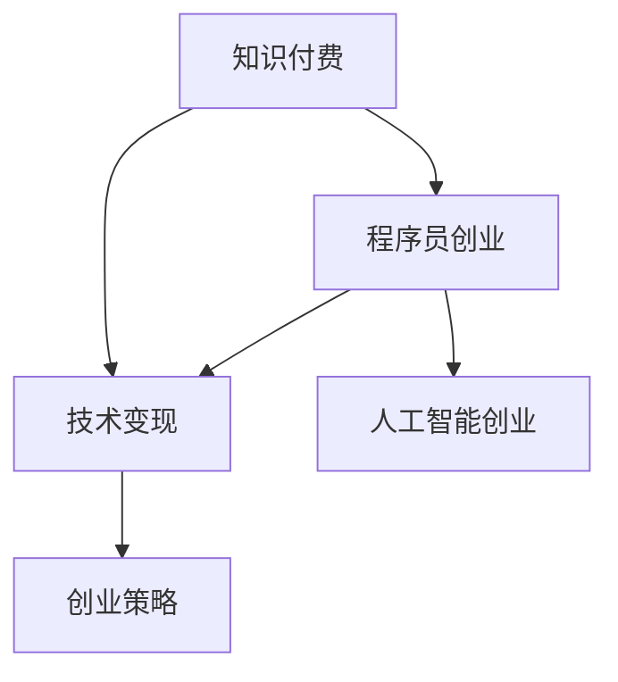

                 

# 知识付费时代程序员的创业思维

> 关键词：知识付费, 程序员创业, 技术变现, 人工智能创业, 创业策略, 产品化

## 1. 背景介绍

### 1.1 问题由来
近年来，随着互联网经济的快速发展和知识付费潮流的兴起，越来越多的程序员开始思考如何将自己的技术知识和经验转化为商业价值。特别是对于拥有一定技术积累和个人品牌的程序员，如何更好地抓住时代机遇，实现职业转型和创业梦想，成为许多人关注的焦点。

### 1.2 问题核心关键点
当前程序员面临的创业挑战主要有以下几点：
1. **技术变现能力不足**：程序员往往擅长技术开发，但对于如何将技术转化为实际产品或服务，缺乏系统和专业的知识。
2. **市场洞察力不足**：许多程序员对市场需求和用户痛点不够敏感，难以找到具有实际价值的产品切入点。
3. **商业化策略不明确**：缺乏商业化运营经验，不知道如何制定有效的市场推广和盈利策略。
4. **团队协作能力不足**：大多数程序员习惯于独立开发，但创业需要跨学科的团队协作和项目管理能力。

### 1.3 问题研究意义
在知识付费时代，程序员创业思维的提升，不仅能帮助个人实现职业转型，更能够带动整个IT行业的创新和进步。通过深入研究创业思维，可以提供更具实操性的指导和建议，助力程序员在快速变化的商业环境中更好地抓住机遇，创造价值。

## 2. 核心概念与联系

### 2.1 核心概念概述

为更好地理解程序员创业思维，本节将介绍几个核心概念：

- **知识付费**：基于知识的价值付费，以内容付费、课程、咨询等方式为代表，利用专业知识提供差异化的服务。
- **程序员创业**：程序员利用自身的技术优势，结合商业化运营能力，将技术转化为产品或服务，实现创业和盈利。
- **技术变现**：将技术开发转化为商业运营，实现收入的可持续增长，如软件销售、服务订阅、广告等。
- **人工智能创业**：利用人工智能技术，开发创新性产品或服务，实现市场竞争优势，满足用户需求。
- **创业策略**：围绕产品、市场、运营、营销等方面的策略规划，确保创业项目从0到1的成功。

这些概念之间的逻辑关系可以通过以下Mermaid流程图来展示：



这个流程图展示了几者之间的关联关系：

1. 知识付费是程序员创业的基础，通过提供差异化的知识和专业服务，获取收入。
2. 技术变现是实现商业化的手段，将技术转化为产品或服务，形成盈利模式。
3. 人工智能创业是技术创新的方向，利用前沿技术开发创新产品，获得市场竞争优势。
4. 创业策略是成功运营的保障，确保项目从创意到执行的每一步都能顺利推进。

## 3. 核心算法原理 & 具体操作步骤
### 3.1 算法原理概述

程序员创业思维的提升，本质上是一种将技术优势与商业运营相结合的创新能力。核心思想在于：

- **识别市场需求**：深入了解目标用户群体的需求和痛点，找到合适的切入点。
- **技术产品化**：将技术知识转化为实际的产品或服务，满足用户需求。
- **商业化运营**：通过市场推广、用户运营、盈利模式等手段，实现项目的商业化和可持续发展。

### 3.2 算法步骤详解

基于上述核心思想，程序员创业的基本流程可以分为以下几个步骤：

1. **市场调研**：
   - 确定目标用户群体。
   - 分析用户需求和市场痛点。
   - 识别潜在的商业模式。

2. **产品规划**：
   - 定义产品功能和特点。
   - 确定核心竞争力和差异化优势。
   - 设计用户体验和交互流程。

3. **技术开发**：
   - 选择合适的技术栈和工具。
   - 开发产品原型和MVP（最小可行产品）。
   - 进行技术迭代和优化。

4. **市场推广**：
   - 制定市场推广策略。
   - 开展营销活动，吸引用户关注。
   - 进行用户反馈和产品迭代。

5. **运营维护**：
   - 建立用户运营机制。
   - 制定盈利模式和商业策略。
   - 持续优化产品和服务。

### 3.3 算法优缺点

程序员创业思维具有以下优点：
1. **技术优势**：拥有技术开发能力，能够快速实现产品原型和功能迭代。
2. **创新能力**：在技术领域具备创新思维，能够开发具有竞争力的产品。
3. **用户视角**：通过技术开发直接接触用户，能够更好地理解用户需求。

同时，该方法也存在一些缺点：
1. **商业经验不足**：缺乏商业化运营经验，容易忽视市场变化和用户反馈。
2. **团队协作难度大**：从技术开发向商业运营转型，需要跨学科团队协作，管理难度较大。
3. **资金投入高**：产品从0到1需要大量资金支持，初期投入较高。
4. **风险大**：创业过程充满不确定性，失败风险较高。

### 3.4 算法应用领域

程序员创业思维在多个领域都有广泛应用，例如：

1. **软件服务**：开发并运营SaaS产品，如在线教育平台、项目管理工具等。
2. **技术咨询**：提供专业的技术咨询和解决方案，如云计算、大数据等。
3. **技术培训**：开展技术培训和课程开发，如在线编程教育、企业内训等。
4. **智能硬件**：开发智能硬件设备和应用，如智能家居、物联网设备等。
5. **创新产品**：利用人工智能和前沿技术，开发创新性产品，如自动驾驶、智能推荐等。

这些领域展示了程序员创业思维的广泛应用，同时也体现了其在技术创新和市场化运营方面的巨大潜力。

## 4. 数学模型和公式 & 详细讲解  
### 4.1 数学模型构建

在程序员创业思维的实践中，虽然不涉及复杂的数学模型，但可以从经济学和市场学的角度，使用一些基本模型来辅助理解和决策。

1. **用户需求模型**：
   - 假设用户需求满足正态分布，可以通过统计分析用户反馈和行为数据，确定市场需求分布。
   - 模型公式：$f(x) = \frac{1}{\sqrt{2\pi\sigma^2}} e^{-\frac{(x-\mu)^2}{2\sigma^2}}$

2. **市场竞争模型**：
   - 考虑市场中的竞争者和潜在进入者，分析各方的市场份额和竞争策略。
   - 模型公式：$P_i = \frac{D_i}{D}p_i$，其中 $P_i$ 为第 $i$ 个竞争者的市场份额，$D_i$ 为其市场需求，$p_i$ 为产品价格，$D$ 为总市场需求。

### 4.2 公式推导过程

以用户需求模型为例，推导其概率密度函数：

- 假设用户需求 $x$ 服从均值为 $\mu$，方差为 $\sigma^2$ 的正态分布。
- 根据正态分布的性质，概率密度函数为：$f(x) = \frac{1}{\sqrt{2\pi\sigma^2}} e^{-\frac{(x-\mu)^2}{2\sigma^2}}$

- 通过统计分析用户反馈数据，计算均值 $\mu$ 和方差 $\sigma^2$，即可得到用户需求的概率密度函数。

### 4.3 案例分析与讲解

以在线教育平台为例，假设平台的目标用户群体为初高中学生，需求分布为 $f(x) = \frac{1}{\sqrt{2\pi\sigma^2}} e^{-\frac{(x-\mu)^2}{2\sigma^2}}$。

- 通过分析用户反馈和行为数据，确定均值 $\mu$ 和方差 $\sigma^2$。
- 基于需求模型，制定市场推广策略，如重点推广偏高需求的产品，或针对低需求用户进行精准营销。

## 5. 项目实践：代码实例和详细解释说明
### 5.1 开发环境搭建

在进行程序员创业实践前，我们需要准备好开发环境。以下是使用Python进行Django开发的环境配置流程：

1. 安装Anaconda：从官网下载并安装Anaconda，用于创建独立的Python环境。

2. 创建并激活虚拟环境：
```bash
conda create -n django-env python=3.8 
conda activate django-env
```

3. 安装Django：使用pip安装Django框架。
```bash
pip install django
```

4. 安装必要的第三方库：
```bash
pip install Pillow psycopg2
```

完成上述步骤后，即可在`django-env`环境中开始创业项目的开发。

### 5.2 源代码详细实现

以下是一个简单的在线教育平台开发的Django代码实现：

```python
# settings.py
# ...

# urls.py
from django.urls import path

urlpatterns = [
    path('', views.home, name='home'),
    path('course/<str:course_name>/', views.course, name='course'),
]

# views.py
from django.shortcuts import render

def home(request):
    courses = models.Course.objects.all()
    return render(request, 'home.html', {'courses': courses})

def course(request, course_name):
    course = models.Course.objects.get(name=course_name)
    return render(request, 'course.html', {'course': course})
```

### 5.3 代码解读与分析

让我们再详细解读一下关键代码的实现细节：

**settings.py**：
- 配置项目的环境变量，如数据库类型、URL配置等。

**urls.py**：
- 定义路由规则，将请求映射到对应的视图函数。
- 使用`path`函数定义路由，包括首页和课程详情页。

**views.py**：
- 定义视图函数，处理用户请求并返回视图结果。
- 使用`render`函数渲染模板，将数据传递给模板进行处理。

**home.html**：
- 展示所有课程的列表。
- 使用循环结构遍历课程列表，渲染课程标题和简介。

**course.html**：
- 展示单个课程的详情。
- 使用模板语言访问课程对象的属性，渲染课程内容。

通过以上代码实现，可以看出Django框架提供了简洁高效的开发方式，使得开发人员可以快速构建Web应用，满足业务需求。

## 6. 实际应用场景
### 6.1 在线教育平台

在线教育平台是程序员创业中的热门选择。开发并运营在线教育平台，利用技术优势提供优质课程，满足学生学习需求。通过订阅、广告、付费课程等方式实现盈利。

在技术实现上，可以采用Django等Web框架搭建平台后台，使用PyTorch等工具进行课程内容的开发，利用SQL数据库或NoSQL数据库存储用户和课程信息，采用CDN等技术优化课程内容的加载速度。同时，还可以通过API接口与第三方服务集成，如视频上传、课程推荐等，提升用户体验。

### 6.2 技术咨询公司

技术咨询公司是将技术知识和经验转化为商业价值的典型代表。通过提供专业的技术咨询和解决方案，帮助企业解决技术难题，实现价值变现。

在业务模式上，可以采用项目制或顾问制，根据企业需求提供定制化的技术方案。通过技术报告、白皮书、培训等方式向客户提供价值，同时积累口碑和案例。采用Django等框架搭建公司官网和后台，使用CRM系统管理客户和项目信息，实现高效运营。

### 6.3 技术培训平台

技术培训平台利用自身技术优势，开展技术培训和课程开发，提供课程销售、订阅服务，实现盈利。通过在线直播、视频课程等方式，满足不同层次和需求的学习者。

在技术实现上，可以采用Django等Web框架搭建课程平台，使用Flask等框架开发课程内容，利用SQL数据库或NoSQL数据库存储课程和用户信息，采用CDN等技术优化课程内容的加载速度。同时，还可以通过API接口与第三方服务集成，如在线支付、课程推荐等，提升用户体验。

### 6.4 未来应用展望

伴随技术的不断进步和市场需求的变化，程序员创业思维将呈现以下几个发展趋势：

1. **AI和机器学习的应用**：利用AI技术开发智能化产品和服务，如智能推荐、智能客服等，提升用户体验和业务价值。

2. **区块链技术的应用**：利用区块链技术提供安全和透明的服务，如数字证书、去中心化教育平台等，保障数据安全和用户隐私。

3. **SaaS模式的普及**：SaaS模式具有低成本、高扩展性、按需服务的特点，成为程序员创业的重要方向。

4. **跨界融合**：结合多个领域的知识，开发创新型产品和服务，如AI+医疗、AI+金融、AI+教育等，开拓新的应用场景。

5. **全球化市场**：利用全球化视野和国际化的运营经验，拓展海外市场，提升品牌影响力和市场份额。

## 7. 工具和资源推荐
### 7.1 学习资源推荐

为了帮助程序员提升创业思维，这里推荐一些优质的学习资源：

1. **《程序员创业指南》**：详细讲解了程序员如何从技术开发转型为商业运营，涵盖市场调研、产品规划、技术开发、市场推广等环节。

2. **《商业模式画布》**：帮助创业者系统了解商业模式的设计和运营，提供实用的工具和方法。

3. **Coursera的《创业和创新》课程**：提供创业和创新的基础知识，涵盖市场需求、商业模式、团队管理等内容。

4. **Udemy的《Python Web开发》课程**：全面讲解Django、Flask等Web框架的使用，帮助程序员快速搭建Web应用。

5. **《LeetCode算法题解》**：提供大量编程面试题目和解析，提升程序员的技术水平和算法能力。

通过对这些资源的学习实践，相信程序员能够更好地理解创业思维，提升自身的创业能力和技术水平。

### 7.2 开发工具推荐

高效的开发离不开优秀的工具支持。以下是几款用于程序员创业开发的常用工具：

1. **Django**：Python Web开发框架，提供高效的ORM和模板引擎，适合快速搭建Web应用。

2. **Flask**：Python轻量级Web框架，灵活且易于扩展，适合开发小型Web应用。

3. **PyTorch**：开源深度学习框架，提供强大的深度学习模型开发能力，支持多种机器学习任务。

4. **PostgreSQL**：开源关系型数据库，支持复杂的数据管理和查询操作，适合大规模Web应用。

5. **Docker**：容器化技术，提供应用程序的打包和部署解决方案，提升应用的稳定性和可移植性。

6. **AWS**：云服务提供商，提供丰富的云计算资源，支持Web应用和数据库的快速部署和扩展。

合理利用这些工具，可以显著提升程序员创业项目的开发效率，加快创新迭代的步伐。

### 7.3 相关论文推荐

程序员创业思维的研究源于学界的持续探索。以下是几篇经典的相关论文，推荐阅读：

1. **《How Businesses Transform Technological Advances: Diffusion of Innovations and Impact of Digital Technologies in Financial Services》**：探讨了技术如何转化为商业价值的过程，提供了系统的框架和方法。

2. **《The Business Value of Technology Innovation: Technology Adaptation and Structural Changes》**：分析了技术创新对商业化的影响，提供了实证研究的案例和数据。

3. **《The Business and Economic Impact of Information Technology: An International Perspective》**：研究了信息技术对经济和社会的影响，提供了全球视角和政策建议。

这些论文展示了程序员创业思维的理论基础和实践经验，对理解创业过程提供了深刻的洞见。

## 8. 总结：未来发展趋势与挑战
### 8.1 总结

本文对程序员创业思维进行了全面系统的介绍。首先阐述了程序员在知识付费时代的创业背景和意义，明确了创业思维在技术变现、市场洞察、商业化运营等方面的核心价值。其次，从原理到实践，详细讲解了创业的基本流程和操作步骤，提供了系统化的创业指南。同时，本文还广泛探讨了程序员创业的实际应用场景，展示了创业思维在多个领域的应用前景。此外，本文精选了创业学习的各类资源，力求为读者提供全方位的指导和建议。

通过本文的系统梳理，可以看到，程序员创业思维在互联网经济和知识付费浪潮中，具有重要的实践意义。掌握创业思维，不仅能够实现技术变现，还能推动技术创新，为社会创造更多的价值。

### 8.2 未来发展趋势

展望未来，程序员创业思维将呈现以下几个发展趋势：

1. **技术多样化的趋势**：程序员创业不再局限于传统的Web应用，而是利用多种技术手段开发创新型产品，如人工智能、区块链、物联网等。

2. **用户需求多样化的趋势**：随着用户需求的不断变化，程序员需要更加灵活地应对市场变化，开发多样化的产品和服务。

3. **全球化市场的趋势**：互联网打破了地理和文化的壁垒，程序员可以更加容易地拓展全球市场，提升品牌影响力和市场份额。

4. **跨界融合的趋势**：程序员可以将多个领域的知识进行融合，开发跨领域的创新产品和服务，实现技术多样化和市场应用的有机结合。

5. **持续创新的趋势**：市场需求和技术趋势不断变化，程序员需要持续学习和创新，不断提升自身的创业能力和技术水平。

这些趋势展示了程序员创业思维的广阔前景，未来的创业者需要在技术、市场、管理等方面进行全面的提升，才能更好地抓住机遇，实现商业成功。

### 8.3 面临的挑战

尽管程序员创业思维具备诸多优势，但在实施过程中，仍然面临一些挑战：

1. **市场竞争激烈**：互联网经济中，市场竞争异常激烈，创业者需要在众多竞争者中脱颖而出。

2. **技术更新快**：技术发展迅速，程序员需要不断学习新技术，跟上市场和行业的变化。

3. **团队管理困难**：从技术开发到商业运营，需要跨学科团队合作，管理难度较大。

4. **资金筹集难**：初创项目需要大量资金支持，资金筹集难度较大，融资渠道有限。

5. **风险高**：创业过程中充满了不确定性，失败风险较高。

6. **合规和伦理问题**：在产品和服务开发过程中，需要遵守相关法律法规和伦理标准，确保合规性和安全性。

### 8.4 研究展望

针对这些挑战，未来的研究需要在以下几个方面进行探索和改进：

1. **市场分析和用户洞察**：利用大数据和人工智能技术，进行市场趋势分析和用户行为预测，提高市场决策的准确性。

2. **多技术融合**：结合多种技术和工具，开发创新性产品和服务，提升技术多样性和市场竞争力。

3. **持续学习和创新**：通过持续学习、技术交流和合作，保持技术前沿和市场敏锐度。

4. **团队协作和管理**：建立高效的团队协作机制，提升项目管理能力和团队凝聚力。

5. **资金筹集和风险管理**：利用众筹、天使投资等多种方式筹集资金，同时制定合理的风险管理策略。

6. **合规和伦理**：建立合规和伦理标准，确保产品和服务符合法律法规和伦理要求，保护用户隐私和安全。

这些研究方向的探索，将进一步推动程序员创业思维的成熟和完善，为IT行业的创新和进步提供更多动力。总之，程序员创业思维需要从技术、市场、运营等多个维度进行深入研究，才能在知识付费时代大放异彩，实现商业梦想。

## 9. 附录：常见问题与解答
----------------------------------------------------------------

**Q1：如何评估市场需求和用户痛点？**

A: 评估市场需求和用户痛点，需要进行市场调研和用户访谈。具体步骤如下：
1. 确定目标用户群体。
2. 收集和分析用户反馈和行为数据，了解用户需求和痛点。
3. 根据调研结果，分析市场趋势和竞争状况。
4. 制定市场推广策略，精准定位目标用户和市场切入点。

**Q2：如何制定有效的市场推广策略？**

A: 制定有效的市场推广策略，需要考虑以下几个因素：
1. 选择合适的营销渠道和方式，如社交媒体、搜索引擎、广告等。
2. 根据用户行为和偏好，制定个性化的推广方案。
3. 进行用户行为分析，实时调整推广策略。
4. 利用数据驱动的市场推广，提高推广效果和ROI。

**Q3：如何优化产品的用户体验？**

A: 优化产品的用户体验，需要从多个方面入手：
1. 设计简洁明了的界面和交互流程，降低用户操作难度。
2. 提供高质量的内容和服务，满足用户需求。
3. 进行用户反馈收集和分析，持续优化产品功能和体验。
4. 采用多渠道用户反馈机制，快速响应用户需求。

**Q4：如何进行有效的团队管理和协作？**

A: 进行有效的团队管理和协作，需要建立以下机制：
1. 明确团队目标和职责，建立清晰的项目计划和任务分配。
2. 定期进行团队沟通和汇报，及时解决团队问题。
3. 采用敏捷开发方法，灵活应对市场需求变化。
4. 利用协作工具和平台，提高团队协作效率。

**Q5：如何提升技术创新能力？**

A: 提升技术创新能力，需要以下步骤：
1. 持续学习和积累技术知识，关注行业动态和前沿技术。
2. 开展技术研究和创新，推出新技术和新产品。
3. 利用技术社区和平台，进行技术交流和合作。
4. 建立创新激励机制，激发团队成员的创新激情。

通过这些问题的解答，希望能帮助程序员更好地理解和应用创业思维，提升创业能力和技术水平。

---

作者：禅与计算机程序设计艺术 / Zen and the Art of Computer Programming

