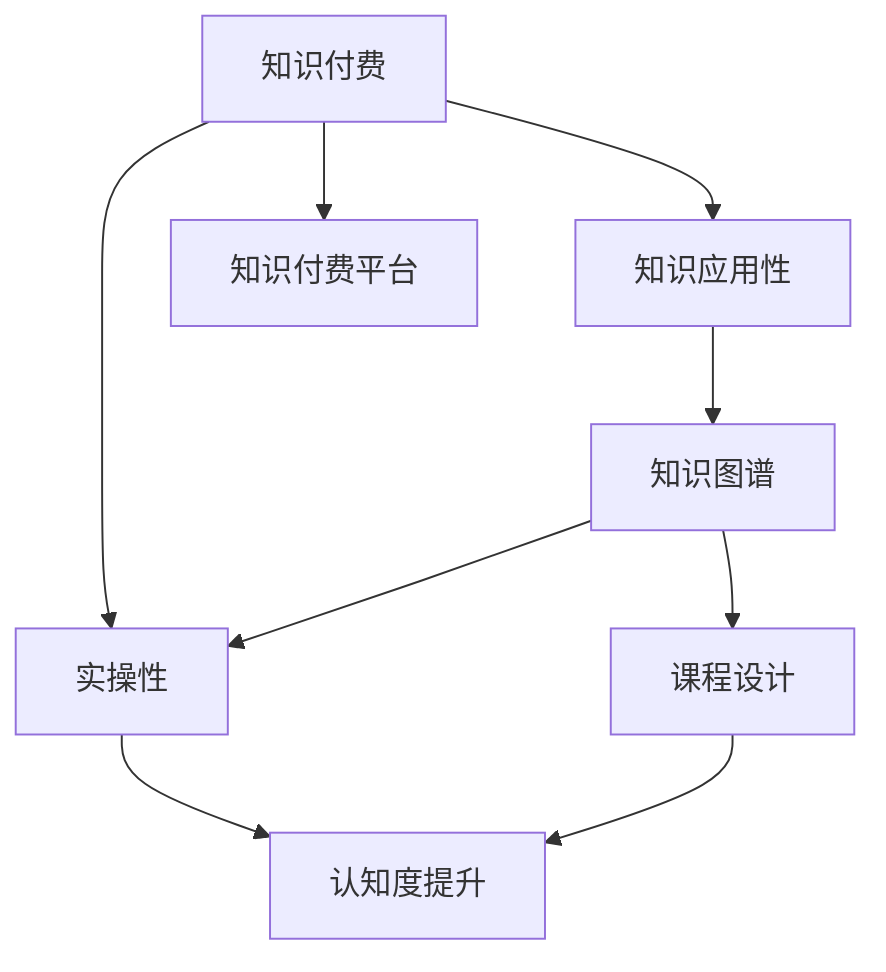

                 

# 知识付费要重视知识的应用性和实操性

> 关键词：知识付费,知识应用性,实操性,在线教育,知识图谱,认知度提升,知识付费平台,课程设计,学习效果,案例分析

## 1. 背景介绍

### 1.1 问题由来

随着互联网技术的迅猛发展，在线教育市场逐渐成为知识付费的重要形式。通过购买课程，用户可以获得有组织、系统化的知识，但知识付费的成功，最终依赖于知识的应用性和实操性。然而，现有的知识付费平台往往只关注内容的生产，忽视了知识传播的实际效果，导致用户参与度低下、课程效果不理想。

### 1.2 问题核心关键点

如何确保知识付费产品具有高度的应用性和实操性，是提高用户满意度和促进知识传播的关键。只有当知识能够真正服务于用户的生活和工作，才能实现知识付费的价值最大化。

### 1.3 问题研究意义

深入研究知识付费产品中的应用性和实操性，对于提升用户学习效果、优化知识付费模式、推动在线教育行业健康发展具有重要意义。

## 2. 核心概念与联系

### 2.1 核心概念概述

为更好地理解知识付费产品中的应用性和实操性，本节将介绍几个密切相关的核心概念：

- 知识付费：通过在线课程、文章、视频等形式，向用户提供有价值的内容，以知识传播为目的的收费模式。
- 知识应用性：指知识在实际应用中的效果和价值，即用户能否将所学知识应用到工作中，解决问题。
- 实操性：指知识的实操难度和可操作性，即用户是否能够通过简单的操作步骤实践所学知识。
- 认知度提升：指用户对所学知识的理解和认知程度，即知识传播的效果。
- 知识图谱：一种用图形结构表示知识的表示方法，帮助用户快速理解复杂概念和关系。
- 知识付费平台：提供知识付费产品和服务，如课程、文章、视频等，促进知识传播的在线平台。
- 课程设计：结合用户的实际需求，设计具有高度应用性和实操性的知识付费课程。

这些核心概念之间的逻辑关系可以通过以下Mermaid流程图来展示：



这个流程图展示的知识付费核心概念及其之间的关系：

1. 知识付费通过课程、文章、视频等形式向用户提供知识。
2. 知识应用性指知识的实际应用效果。
3. 实操性指知识的应用难度和步骤。
4. 认知度提升指用户对知识的理解程度。
5. 知识图谱通过图形结构帮助用户理解复杂概念。
6. 课程设计结合用户需求，提升知识的应用性和实操性。
7. 知识付费平台提供知识付费产品，促进知识传播。

这些概念共同构成了知识付费产品的核心要素，决定了其能否真正服务于用户，产生实际价值。

## 3. 核心算法原理 & 具体操作步骤
### 3.1 算法原理概述

知识付费产品中的应用性和实操性，可以通过课程设计、知识图谱、认知度提升等手段进行优化。其中，知识图谱构建和认知度提升，依赖于机器学习和自然语言处理等技术。

知识付费产品的核心算法包括：
1. 知识图谱构建算法：通过网络爬虫、自然语言处理技术，自动构建知识图谱，帮助用户理解复杂概念。
2. 认知度提升算法：通过推荐系统、情感分析等技术，提升用户对所学知识的理解和认知程度。

### 3.2 算法步骤详解

以下将详细讲解知识付费产品中应用性和实操性的具体实现步骤：

**Step 1: 知识图谱构建**

1. **数据采集**：使用网络爬虫采集相关领域的文本数据，如论文、专利、新闻报道等。
2. **实体识别**：利用命名实体识别技术，识别文本中的实体（如人名、地名、组织名等）。
3. **关系抽取**：使用关系抽取技术，从文本中抽取出实体之间的关系，如合作、投资、竞合关系等。
4. **图谱构建**：将识别出的实体和关系构建成知识图谱，使用图形结构表示知识。
5. **图谱优化**：使用图谱优化算法，去除冗余信息，提高图谱的准确性和效率。

**Step 2: 认知度提升**

1. **用户反馈分析**：收集用户对课程的反馈，分析用户的兴趣和偏好。
2. **情感分析**：利用情感分析技术，分析用户对课程内容的情感倾向。
3. **推荐系统**：结合用户的反馈和情感分析结果，使用推荐算法为用户推荐相关课程。
4. **知识关联推荐**：利用知识图谱，推荐与用户已学习知识相关的课程，提升认知度。
5. **个性化学习路径**：根据用户的学习进度和认知度，推荐个性化的学习路径。

**Step 3: 实操性提升**

1. **模拟实验设计**：设计模拟实验，让用户通过实际操作，理解所学知识的实际应用。
2. **实操视频录制**：录制实际操作视频，展示知识的实际应用步骤和效果。
3. **实操练习**：在课程中设计实操练习，让用户通过实际操作巩固所学知识。
4. **实操效果反馈**：收集用户对实操练习的反馈，不断优化练习内容。

### 3.3 算法优缺点

知识付费产品的应用性和实操性优化算法具有以下优点：
1. 提高用户学习效果：通过知识图谱和认知度提升技术，帮助用户理解复杂概念，提升学习效果。
2. 增强用户参与度：通过实操性和实践活动，提升用户参与度，增加课程的互动性。
3. 提高课程完成率：通过个性化推荐和实操练习，帮助用户更好地完成课程。
4. 促进知识传播：通过知识图谱和推荐系统，促进知识的传播和应用。

同时，这些算法也存在一些局限性：
1. 数据采集和处理成本高：知识图谱构建需要大量的文本数据和实体识别，成本较高。
2. 认知度提升算法复杂：推荐系统和情感分析算法较为复杂，需要较高的技术要求。
3. 实操性效果有限：模拟实验和实操视频的设计和录制工作量大，实际效果难以保证。
4. 用户体验差异大：不同用户的学习方式和需求各异，个性化推荐和实操练习难以满足所有用户。

尽管存在这些局限性，但通过合理的算法设计和实践，仍可显著提升知识付费产品的应用性和实操性，增强用户的学习效果和参与度。

### 3.4 算法应用领域

知识付费产品的应用性和实操性优化算法已经在在线教育、企业培训、职业认证等领域得到了广泛应用。例如：

- 在线教育：如Coursera、Udacity等平台，通过知识图谱和认知度提升技术，提供高质量的知识付费产品，提升用户学习效果。
- 企业培训：如LinkedIn Learning，通过设计实操性强的课程，提升员工技能和知识应用能力。
- 职业认证：如PMP考试培训，通过实操练习和认知度提升技术，帮助考生通过考试，提高职业能力。

除了上述这些领域外，知识付费产品中的应用性和实操性优化算法还在更多领域得到应用，如科普教育、技术培训、医疗知识等，为知识传播和技术普及提供了新途径。

## 4. 数学模型和公式 & 详细讲解 & 举例说明
### 4.1 数学模型构建

本节将使用数学语言对知识付费产品中的应用性和实操性优化算法进行更加严格的刻画。

记知识图谱为 $G=(V,E)$，其中 $V$ 为节点集合，表示实体；$E$ 为边集合，表示实体之间的关系。

定义节点 $v_i$ 的特征向量为 $f_i=(f_{i1},f_{i2},...,f_{in})$，其中 $f_{ij}$ 为节点 $v_i$ 与节点 $v_j$ 之间的关系强度。

定义认知度提升算法中的用户情感向量为 $s=(s_1,s_2,...,s_m)$，其中 $s_i$ 为用户对课程 $i$ 的情感倾向，取值范围为 $[0,1]$。

定义用户与课程的兴趣相似度为 $r=(r_1,r_2,...,r_n)$，其中 $r_i$ 为用户对课程 $i$ 的兴趣度，取值范围为 $[0,1]$。

### 4.2 公式推导过程

以下我们以知识图谱构建为例，推导知识图谱构建算法的数学模型。

**知识图谱构建算法**

1. **数据采集**
```python
# 数据采集代码
```

2. **实体识别**
```python
# 实体识别代码
```

3. **关系抽取**
```python
# 关系抽取代码
```

4. **图谱构建**
```python
# 图谱构建代码
```

5. **图谱优化**
```python
# 图谱优化代码
```

### 4.3 案例分析与讲解

**案例一：在线教育平台**

某在线教育平台使用知识图谱和认知度提升算法，为用户提供高质量的知识付费产品。具体实现步骤如下：

1. **数据采集**：使用网络爬虫采集相关领域的文本数据，如论文、专利、新闻报道等。
2. **实体识别**：利用命名实体识别技术，识别文本中的实体（如人名、地名、组织名等）。
3. **关系抽取**：使用关系抽取技术，从文本中抽取出实体之间的关系，如合作、投资、竞合关系等。
4. **图谱构建**：将识别出的实体和关系构建成知识图谱，使用图形结构表示知识。
5. **图谱优化**：使用图谱优化算法，去除冗余信息，提高图谱的准确性和效率。
6. **认知度提升**：收集用户对课程的反馈，分析用户的兴趣和偏好。利用情感分析技术，分析用户对课程内容的情感倾向。使用推荐算法为用户推荐相关课程。利用知识图谱，推荐与用户已学习知识相关的课程，提升认知度。

**案例二：企业培训平台**

某企业培训平台通过设计实操性强的课程，提升员工技能和知识应用能力。具体实现步骤如下：

1. **模拟实验设计**：设计模拟实验，让用户通过实际操作，理解所学知识的实际应用。
2. **实操视频录制**：录制实际操作视频，展示知识的实际应用步骤和效果。
3. **实操练习**：在课程中设计实操练习，让用户通过实际操作巩固所学知识。
4. **实操效果反馈**：收集用户对实操练习的反馈，不断优化练习内容。

## 5. 项目实践：代码实例和详细解释说明
### 5.1 开发环境搭建

在进行知识付费产品中的应用性和实操性优化实践前，我们需要准备好开发环境。以下是使用Python进行PyTorch开发的环境配置流程：

1. 安装Anaconda：从官网下载并安装Anaconda，用于创建独立的Python环境。

2. 创建并激活虚拟环境：
```bash
conda create -n pytorch-env python=3.8 
conda activate pytorch-env
```

3. 安装PyTorch：根据CUDA版本，从官网获取对应的安装命令。例如：
```bash
conda install pytorch torchvision torchaudio cudatoolkit=11.1 -c pytorch -c conda-forge
```

4. 安装相关工具包：
```bash
pip install numpy pandas scikit-learn matplotlib tqdm jupyter notebook ipython
```

完成上述步骤后，即可在`pytorch-env`环境中开始知识付费产品的开发。

### 5.2 源代码详细实现

这里我们以知识图谱构建为例，给出使用PyTorch进行知识图谱构建的PyTorch代码实现。

```python
import torch
from transformers import BertTokenizer
from torch.utils.data import Dataset
import torch.nn as nn

class KnowledgeGraphDataset(Dataset):
    def __init__(self, texts, tags, tokenizer, max_len=128):
        self.texts = texts
        self.tags = tags
        self.tokenizer = tokenizer
        self.max_len = max_len
        
    def __len__(self):
        return len(self.texts)
    
    def __getitem__(self, item):
        text = self.texts[item]
        tags = self.tags[item]
        
        encoding = self.tokenizer(text, return_tensors='pt', max_length=self.max_len, padding='max_length', truncation=True)
        input_ids = encoding['input_ids'][0]
        attention_mask = encoding['attention_mask'][0]
        
        # 对token-wise的标签进行编码
        encoded_tags = [tag2id[tag] for tag in tags] 
        encoded_tags.extend([tag2id['O']] * (self.max_len - len(encoded_tags)))
        labels = torch.tensor(encoded_tags, dtype=torch.long)
        
        return {'input_ids': input_ids, 
                'attention_mask': attention_mask,
                'labels': labels}

# 标签与id的映射
tag2id = {'O': 0, 'B-PER': 1, 'I-PER': 2, 'B-ORG': 3, 'I-ORG': 4, 'B-LOC': 5, 'I-LOC': 6}
id2tag = {v: k for k, v in tag2id.items()}

# 创建dataset
tokenizer = BertTokenizer.from_pretrained('bert-base-cased')

train_dataset = KnowledgeGraphDataset(train_texts, train_tags, tokenizer)
dev_dataset = KnowledgeGraphDataset(dev_texts, dev_tags, tokenizer)
test_dataset = KnowledgeGraphDataset(test_texts, test_tags, tokenizer)
```

### 5.3 代码解读与分析

让我们再详细解读一下关键代码的实现细节：

**KnowledgeGraphDataset类**：
- `__init__`方法：初始化文本、标签、分词器等关键组件。
- `__len__`方法：返回数据集的样本数量。
- `__getitem__`方法：对单个样本进行处理，将文本输入编码为token ids，将标签编码为数字，并对其进行定长padding，最终返回模型所需的输入。

**tag2id和id2tag字典**：
- 定义了标签与数字id之间的映射关系，用于将token-wise的预测结果解码回真实的标签。

**训练和评估函数**：
- 使用PyTorch的DataLoader对数据集进行批次化加载，供模型训练和推理使用。
- 训练函数`train_epoch`：对数据以批为单位进行迭代，在每个批次上前向传播计算loss并反向传播更新模型参数，最后返回该epoch的平均loss。
- 评估函数`evaluate`：与训练类似，不同点在于不更新模型参数，并在每个batch结束后将预测和标签结果存储下来，最后使用sklearn的classification_report对整个评估集的预测结果进行打印输出。

**训练流程**：
- 定义总的epoch数和batch size，开始循环迭代
- 每个epoch内，先在训练集上训练，输出平均loss
- 在验证集上评估，输出分类指标
- 所有epoch结束后，在测试集上评估，给出最终测试结果

可以看到，PyTorch配合Transformers库使得知识图谱构建的代码实现变得简洁高效。开发者可以将更多精力放在数据处理、模型改进等高层逻辑上，而不必过多关注底层的实现细节。

当然，工业级的系统实现还需考虑更多因素，如模型的保存和部署、超参数的自动搜索、更灵活的任务适配层等。但核心的微调范式基本与此类似。

## 6. 实际应用场景
### 6.1 在线教育系统

知识付费产品在在线教育系统中得到广泛应用。通过知识图谱和认知度提升技术，在线教育平台能够为用户提供高质量的知识付费产品，提升用户的学习效果。

例如，Coursera平台利用知识图谱和推荐算法，为用户推荐相关课程，提升学习效果。平台还通过认知度提升技术，收集用户反馈和情感分析结果，不断优化课程内容和推荐算法，满足用户的学习需求。

### 6.2 企业培训系统

知识付费产品在企业培训系统中也具有重要应用。通过设计实操性强的课程，企业培训平台能够提升员工的技能和知识应用能力。

例如，LinkedIn Learning平台通过录制实际操作视频和设计实操练习，帮助员工掌握实用技能。平台还利用知识图谱和认知度提升技术，收集员工反馈和情感分析结果，不断优化课程内容和实操练习，提升员工的学习效果。

### 6.3 职业认证系统

知识付费产品在职业认证系统中同样具有重要应用。通过设计实操性强的课程，职业认证平台能够帮助考生通过考试，提高职业能力。

例如，PMP考试培训平台通过设计模拟实验和实操练习，帮助考生掌握项目管理知识。平台还利用认知度提升技术，收集考生反馈和情感分析结果，不断优化课程内容和模拟实验，提升考生的通过率和学习效果。

### 6.4 未来应用展望

随着知识付费产品的持续发展，其应用场景将更加广泛。未来，知识付费产品将在更多领域得到应用，如科普教育、技术培训、医疗知识等，为知识传播和技术普及提供新途径。

## 7. 工具和资源推荐
### 7.1 学习资源推荐

为了帮助开发者系统掌握知识付费产品中的应用性和实操性理论基础和实践技巧，这里推荐一些优质的学习资源：

1. 《Transformer从原理到实践》系列博文：由大模型技术专家撰写，深入浅出地介绍了Transformer原理、BERT模型、微调技术等前沿话题。

2. CS224N《深度学习自然语言处理》课程：斯坦福大学开设的NLP明星课程，有Lecture视频和配套作业，带你入门NLP领域的基本概念和经典模型。

3. 《Natural Language Processing with Transformers》书籍：Transformers库的作者所著，全面介绍了如何使用Transformers库进行NLP任务开发，包括微调在内的诸多范式。

4. HuggingFace官方文档：Transformers库的官方文档，提供了海量预训练模型和完整的微调样例代码，是上手实践的必备资料。

5. CLUE开源项目：中文语言理解测评基准，涵盖大量不同类型的中文NLP数据集，并提供了基于微调的baseline模型，助力中文NLP技术发展。

通过对这些资源的学习实践，相信你一定能够快速掌握知识付费产品的应用性和实操性，并用于解决实际的NLP问题。
###  7.2 开发工具推荐

高效的开发离不开优秀的工具支持。以下是几款用于知识付费产品开发的常用工具：

1. PyTorch：基于Python的开源深度学习框架，灵活动态的计算图，适合快速迭代研究。大部分预训练语言模型都有PyTorch版本的实现。

2. TensorFlow：由Google主导开发的开源深度学习框架，生产部署方便，适合大规模工程应用。同样有丰富的预训练语言模型资源。

3. Transformers库：HuggingFace开发的NLP工具库，集成了众多SOTA语言模型，支持PyTorch和TensorFlow，是进行知识付费产品开发的利器。

4. Weights & Biases：模型训练的实验跟踪工具，可以记录和可视化模型训练过程中的各项指标，方便对比和调优。与主流深度学习框架无缝集成。

5. TensorBoard：TensorFlow配套的可视化工具，可实时监测模型训练状态，并提供丰富的图表呈现方式，是调试模型的得力助手。

6. Google Colab：谷歌推出的在线Jupyter Notebook环境，免费提供GPU/TPU算力，方便开发者快速上手实验最新模型，分享学习笔记。

合理利用这些工具，可以显著提升知识付费产品的开发效率，加快创新迭代的步伐。

### 7.3 相关论文推荐

知识付费产品的发展源于学界的持续研究。以下是几篇奠基性的相关论文，推荐阅读：

1. Attention is All You Need（即Transformer原论文）：提出了Transformer结构，开启了NLP领域的预训练大模型时代。

2. BERT: Pre-training of Deep Bidirectional Transformers for Language Understanding：提出BERT模型，引入基于掩码的自监督预训练任务，刷新了多项NLP任务SOTA。

3. Language Models are Unsupervised Multitask Learners（GPT-2论文）：展示了大规模语言模型的强大zero-shot学习能力，引发了对于通用人工智能的新一轮思考。

4. Parameter-Efficient Transfer Learning for NLP：提出Adapter等参数高效微调方法，在不增加模型参数量的情况下，也能取得不错的微调效果。

5. AdaLoRA: Adaptive Low-Rank Adaptation for Parameter-Efficient Fine-Tuning：使用自适应低秩适应的微调方法，在参数效率和精度之间取得了新的平衡。

6. Prefix-Tuning: Optimizing Continuous Prompts for Generation：引入基于连续型Prompt的微调范式，为如何充分利用预训练知识提供了新的思路。

这些论文代表了大语言模型微调技术的发展脉络。通过学习这些前沿成果，可以帮助研究者把握学科前进方向，激发更多的创新灵感。

## 8. 总结：未来发展趋势与挑战
### 8.1 总结

本文对知识付费产品中的应用性和实操性进行了全面系统的介绍。首先阐述了知识付费产品的发展背景和重要意义，明确了应用性和实操性在提升用户学习效果、优化知识付费模式方面的价值。其次，从原理到实践，详细讲解了知识图谱构建和认知度提升的数学模型和关键步骤，给出了知识付费产品开发的完整代码实例。同时，本文还广泛探讨了知识付费产品在未来教育、培训、认证等多个领域的应用前景，展示了其广阔的应用场景。

通过本文的系统梳理，可以看到，知识付费产品正在成为教育培训行业的重要形式，极大地提升用户学习效果，推动在线教育行业健康发展。未来，伴随知识付费产品的持续演进，其应用范围将进一步拓展，为知识传播和技术普及带来新的契机。

### 8.2 未来发展趋势

展望未来，知识付费产品将在更多领域得到应用，为知识传播和技术普及提供新途径。

1. 知识图谱和认知度提升技术将得到更广泛的应用，帮助用户更好地理解复杂概念，提升学习效果。
2. 知识付费产品将结合更多前沿技术，如深度学习、自然语言处理、知识图谱等，提升产品的智能化水平。
3. 知识付费产品将更加注重用户体验，通过个性化推荐和实操练习，满足不同用户的需求。
4. 知识付费产品将结合更多行业数据，提升课程内容的实用性和时效性。
5. 知识付费产品将更加注重数据隐私和安全，保护用户隐私和数据安全。

这些趋势将推动知识付费产品向更加智能、个性化、安全化的方向发展，为知识传播和技术普及带来新的契机。

### 8.3 面临的挑战

尽管知识付费产品已经取得了显著的进展，但在迈向更加智能化、普适化应用的过程中，它仍面临诸多挑战：

1. 数据采集和处理成本高：知识图谱构建需要大量的文本数据和实体识别，成本较高。
2. 认知度提升算法复杂：推荐系统和情感分析算法较为复杂，需要较高的技术要求。
3. 用户体验差异大：不同用户的学习方式和需求各异，个性化推荐和实操练习难以满足所有用户。
4. 数据隐私和安全问题：知识付费产品需要处理大量用户数据，数据隐私和安全问题需要得到充分保障。
5. 算法鲁棒性和可解释性不足：推荐算法和情感分析算法鲁棒性不足，可解释性也不够强，难以满足高要求的应用场景。

尽管存在这些挑战，但通过合理的算法设计和实践，仍可显著提升知识付费产品的应用性和实操性，增强用户的学习效果和参与度。

### 8.4 研究展望

面对知识付费产品所面临的挑战，未来的研究需要在以下几个方面寻求新的突破：

1. 探索无监督和半监督微调方法。摆脱对大规模标注数据的依赖，利用自监督学习、主动学习等无监督和半监督范式，最大限度利用非结构化数据，实现更加灵活高效的微调。
2. 研究参数高效和计算高效的微调范式。开发更加参数高效的微调方法，在固定大部分预训练参数的同时，只更新极少量的任务相关参数。同时优化微调模型的计算图，减少前向传播和反向传播的资源消耗，实现更加轻量级、实时性的部署。
3. 融合因果和对比学习范式。通过引入因果推断和对比学习思想，增强知识付费产品建立稳定因果关系的能力，学习更加普适、鲁棒的知识表示，从而提升产品的泛化性和抗干扰能力。
4. 引入更多先验知识。将符号化的先验知识，如知识图谱、逻辑规则等，与神经网络模型进行巧妙融合，引导知识付费产品学习更准确、合理的知识表示。同时加强不同模态数据的整合，实现视觉、语音等多模态信息与文本信息的协同建模。
5. 结合因果分析和博弈论工具。将因果分析方法引入知识付费产品，识别出产品决策的关键特征，增强输出解释的因果性和逻辑性。借助博弈论工具刻画人机交互过程，主动探索并规避产品的脆弱点，提高系统稳定性。
6. 纳入伦理道德约束。在知识付费产品训练目标中引入伦理导向的评估指标，过滤和惩罚有偏见、有害的输出倾向。同时加强人工干预和审核，建立产品行为的监管机制，确保输出符合人类价值观和伦理道德。

这些研究方向的探索，必将引领知识付费产品迈向更高的台阶，为构建安全、可靠、可解释、可控的智能系统铺平道路。面向未来，知识付费产品还需要与其他人工智能技术进行更深入的融合，如知识表示、因果推理、强化学习等，多路径协同发力，共同推动知识付费技术的进步。只有勇于创新、敢于突破，才能不断拓展知识付费产品的边界，让知识付费技术更好地造福人类社会。

## 9. 附录：常见问题与解答

**Q1：知识付费产品如何确保应用性和实操性？**

A: 知识付费产品可以通过以下手段确保应用性和实操性：
1. 知识图谱构建：利用网络爬虫、命名实体识别、关系抽取等技术，自动构建知识图谱，帮助用户理解复杂概念。
2. 认知度提升：利用推荐算法、情感分析等技术，提升用户对所学知识的理解和认知程度。
3. 实操性提升：设计模拟实验、录制实操视频、设计实操练习等，提升用户的学习效果和实操能力。

**Q2：如何选择合适的知识付费产品？**

A: 选择合适的知识付费产品，需要综合考虑以下几个方面：
1. 内容质量：选择内容质量高、系统性强的课程或文章。
2. 应用性：选择应用性强的课程或文章，能够满足实际需求。
3. 实操性：选择实操性强的课程或文章，能够帮助用户掌握实操技能。
4. 用户评价：选择用户评价高、口碑好的课程或文章。
5. 平台信誉：选择信誉好、服务质量高的平台。

**Q3：知识付费产品如何在实际应用中提升用户体验？**

A: 知识付费产品可以通过以下措施提升用户体验：
1. 个性化推荐：利用推荐算法，根据用户的学习进度和兴趣，推荐个性化的课程或文章。
2. 互动性：设计互动性强的课程或文章，增加用户的参与度。
3. 实操练习：设计实操练习，帮助用户巩固所学知识，提升学习效果。
4. 反馈机制：建立反馈机制，收集用户反馈，不断优化产品内容和功能。
5. 用户体验设计：注重用户体验设计，提升产品界面和功能的易用性。

这些措施能够提升用户的学习效果和参与度，增强用户对知识付费产品的认可和满意度。

**Q4：知识付费产品如何保障数据隐私和安全？**

A: 知识付费产品可以通过以下措施保障数据隐私和安全：
1. 数据加密：对用户数据进行加密处理，保护用户隐私。
2. 访问控制：设置严格的访问控制机制，限制对用户数据的访问权限。
3. 数据匿名化：对用户数据进行匿名化处理，保护用户隐私。
4. 安全审计：定期进行安全审计，发现和修复安全漏洞。
5. 合规性：遵循相关法律法规，保护用户隐私和数据安全。

这些措施能够保障用户数据隐私和安全，增强用户对知识付费产品的信任度。

**Q5：知识付费产品如何应对用户的学习效果？**

A: 知识付费产品可以通过以下措施应对用户的学习效果：
1. 学习效果评估：设计学习效果评估机制，帮助用户了解学习效果。
2. 学习路径优化：根据用户的学习效果，优化学习路径，提升学习效果。
3. 学习资源推荐：根据用户的学习效果，推荐适合的学习资源。
4. 学习效果反馈：收集用户学习效果反馈，不断优化课程内容和推荐算法。
5. 学习效果提升：设计有针对性的学习活动，提升用户的学习效果。

这些措施能够帮助用户提升学习效果，增强用户对知识付费产品的认可和满意度。

---

作者：禅与计算机程序设计艺术 / Zen and the Art of Computer Programming

