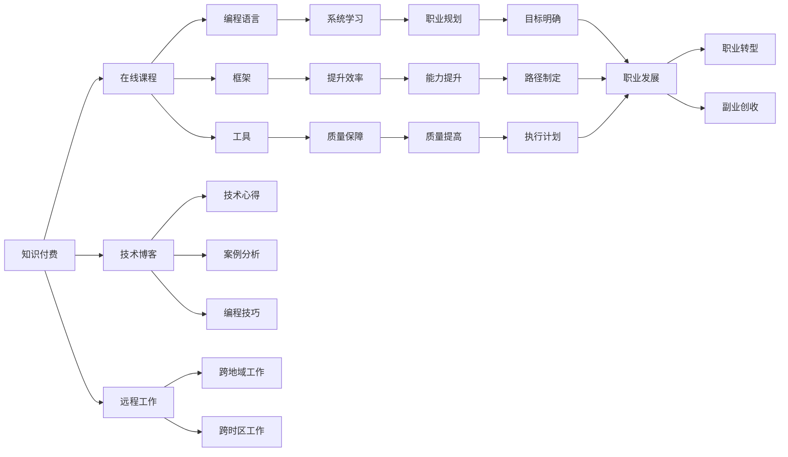

                 

# 知识付费让程序员实现职业自由

> 关键词：知识付费, 程序员职业自由, 在线课程, 远程工作, 职业发展, 技能提升, 技术博客, 职业规划, 副业, 创收, 职业转型, 学习资源, 职业机会

## 1. 背景介绍

在数字化时代，程序员已经成为全球最受欢迎的职业之一。他们不仅能够创造财富，更通过不断学习和进步，实现了个人职业自由。然而，传统教育模式与职业发展的鸿沟，使得很多程序员难以实现这一自由。但随着知识付费的兴起，程序员实现职业自由的道路被进一步拓宽。

### 1.1 问题由来

在以往，程序员的学习往往依赖于大学教育或自学，但由于这些途径难以覆盖最新的技术变化，程序员常常面临知识储备不足、技能更新速度慢等问题。加上工作繁忙、家庭责任，使得许多程序员难以抽出更多时间进行系统学习。

另一方面，企业培训项目往往被限制在特定公司内部，外部人员难以参与，难以获取跨行业、跨公司的最新知识。此外，部分企业培训资源有限，可能无法提供全面而深入的培训。

这些问题使得程序员的自我提升和职业发展受阻。而知识付费的兴起，为程序员提供了一条新路径。

## 2. 核心概念与联系

知识付费的本质是一种基于互联网的付费知识分享模式，用户通过付费获得特定知识或技能。在程序员领域，这一模式主要体现在各种在线课程、技术博客、书籍、培训讲座等形式。

### 2.1 核心概念概述

- **知识付费**：用户为获取特定知识或技能而支付费用，涵盖在线课程、技术博客、书籍、培训讲座等形式。
- **在线课程**：通过互联网平台提供的结构化课程，包含视频、文字、作业等多种教学资源。
- **技术博客**：程序员通过博客分享技术心得、案例分析、编程技巧等，形成社区互动。
- **远程工作**：通过网络平台进行跨地域、跨时区的远程工作，打破了传统工作时间和空间的限制。
- **职业发展**：利用付费资源获取新技能，拓展职业机会，实现职业转型或副业创收。
- **技能提升**：针对特定技能（如编程语言、框架、工具等）进行系统学习，提升工作效率和质量。
- **职业规划**：通过系统学习，明确职业目标，制定个人职业发展路线图。

这些核心概念通过互联网连接，形成了知识共享的生态，为程序员提供了丰富的学习和成长资源。

### 2.2 核心概念原理和架构的 Mermaid 流程图



这一流程图展示了知识付费的生态圈：程序员通过在线课程、技术博客等付费资源获取新知识，应用到远程工作中，提升技能和职业能力，制定和执行职业规划，实现职业转型和副业创收。

## 3. 核心算法原理 & 具体操作步骤

知识付费为程序员提供了系统化、结构化的学习路径，其算法原理和操作步骤可以概括如下：

### 3.1 算法原理概述

知识付费的核心在于高质量内容的分发和获取。平台通过算法推荐系统，将符合用户需求和兴趣的内容推荐给用户。用户通过支付费用，获取特定内容的访问权限。

算法原理主要包括以下几个方面：

1. **个性化推荐**：通过用户行为数据、历史学习记录、反馈等，使用协同过滤、基于内容的推荐等算法，向用户推荐相关内容。
2. **内容质量控制**：平台对内容进行审核和质量控制，确保推荐内容的准确性和相关性。
3. **支付与访问**：用户支付费用后，获得特定内容的访问权限，可以随时学习。
4. **知识验证**：通过用户反馈、评价、考试等方式，评估内容的效果，持续优化推荐系统。

### 3.2 算法步骤详解

1. **用户注册和付费**：用户注册账号，通过各种支付方式（如信用卡、支付宝、微信等）支付课程或博客的订阅费用。
2. **内容推荐**：平台根据用户的历史学习行为和兴趣偏好，使用个性化推荐算法为用户推荐课程和博客。
3. **内容获取**：用户登录账户，访问推荐的课程或博客，通过视频、文字、作业等形式获取知识。
4. **学习反馈**：用户在学习过程中，通过评论、提问、评分等方式，提供反馈，帮助平台优化推荐系统。
5. **知识应用**：用户将学到的知识应用于实际工作，提升编程技能和职业能力。

### 3.3 算法优缺点

**优点**：

1. **内容丰富**：涵盖各种编程语言、框架、工具、项目案例等，系统化学习。
2. **灵活高效**：随时随地学习，不受时间和空间限制，适应性强。
3. **质量保障**：由专业讲师或资深开发者提供内容，质量有保障。
4. **社区互动**：用户可以通过论坛、评论等形式，与讲师或同学互动，获得更多学习资源。

**缺点**：

1. **高成本**：部分高质量课程或博客费用较高，增加了用户经济负担。
2. **内容质量参差不齐**：平台内容质量受讲师水平和内容审核机制影响，可能存在低质量或误导性内容。
3. **学习依赖性强**：部分用户依赖于平台推荐，难以自行筛选适合自身的学习资源。
4. **学习动力不足**：付费压力可能降低部分用户的学习动力，特别是短期内容。

### 3.4 算法应用领域

知识付费在程序员领域的应用主要体现在以下几个方面：

1. **编程语言和框架学习**：如Python、Java、JavaScript等主流编程语言和框架的学习，包括语法、数据结构、算法、设计模式等。
2. **工具和库使用**：如Git、Docker、Kubernetes、TensorFlow等工具和库的深入学习和使用。
3. **项目管理与运维**：如敏捷开发、DevOps、云运维等项目管理与运维技能的提升。
4. **人工智能与大数据**：如机器学习、深度学习、数据挖掘等人工智能和大数据技能的系统学习。
5. **创业与投资**：如创业基础知识、商业模式、融资策略、投资分析等创业和投资技能的培养。

## 4. 数学模型和公式 & 详细讲解 & 举例说明

### 4.1 数学模型构建

知识付费平台通常使用协同过滤、基于内容的推荐等算法构建数学模型。以下以协同过滤为例，进行详细讲解。

设用户集合为 $U$，课程集合为 $I$，用户对课程的评分矩阵为 $R_{ui}$。协同过滤算法通过找到与用户 $u$ 相似的用户 $v$，将 $v$ 喜欢的课程 $i$ 推荐给用户 $u$。推荐算法可以表示为：

$$
R_{ui} = \frac{\sum_{v \in V} R_{vj} \times \text{similarity}(u,v)}{\sum_{v \in V} \text{similarity}(u,v)}
$$

其中 $\text{similarity}(u,v)$ 表示用户 $u$ 和用户 $v$ 的相似度，通常使用余弦相似度或皮尔逊相关系数计算。

### 4.2 公式推导过程

以余弦相似度为例，用户 $u$ 和用户 $v$ 的相似度计算公式为：

$$
\text{similarity}(u,v) = \frac{\sum_{i \in I} R_{ui} \times R_{vi}}{\sqrt{\sum_{i \in I} R_{ui}^2} \times \sqrt{\sum_{i \in I} R_{vi}^2}}
$$

代入推荐公式中，可得：

$$
R_{ui} = \frac{\sum_{v \in V} \sum_{j \in I} R_{vj} \times \frac{R_{vj}}{\sqrt{\sum_{i \in I} R_{vi}^2}}}{\sum_{v \in V} \frac{1}{\sqrt{\sum_{i \in I} R_{vi}^2}}}
$$

将推荐公式与原始评分矩阵 $R_{ui}$ 结合，即可构建协同过滤推荐系统。

### 4.3 案例分析与讲解

以某知识付费平台的推荐系统为例，使用协同过滤算法为用户推荐课程。

1. **用户注册**：用户在平台注册账号，完成身份验证。
2. **课程选择**：用户选择感兴趣课程，进行订阅或试听。
3. **评分反馈**：用户对课程评分并反馈，形成评分矩阵 $R_{ui}$。
4. **相似度计算**：系统计算用户 $u$ 与其他用户 $v$ 的余弦相似度。
5. **推荐生成**：系统使用推荐公式计算出用户 $u$ 对课程 $i$ 的评分，推荐给用户 $u$。
6. **用户反馈**：用户根据推荐结果选择学习，并继续评分和反馈，帮助系统优化推荐。

这一推荐过程使用协同过滤算法，利用用户之间的相似性，为用户推荐课程，帮助其系统化学习编程知识。

## 5. 项目实践：代码实例和详细解释说明

### 5.1 开发环境搭建

知识付费平台开发通常使用Python和Django或Flask等Web框架。以下是一个简单的开发环境搭建流程：

1. **安装Python**：从官网下载Python 3.7或以上版本，并安装。
2. **安装Django**：在命令行中执行 `pip install Django` 安装Django。
3. **创建项目**：在命令行中执行 `django-admin startproject project_name` 创建Django项目。
4. **创建应用**：在命令行中进入项目目录，执行 `python manage.py startapp app_name` 创建Django应用。
5. **配置数据库**：在项目设置文件中配置数据库。
6. **编写视图**：编写Django视图函数，处理用户请求和数据交互。
7. **设计界面**：使用HTML、CSS、JavaScript等技术，设计友好的用户界面。
8. **部署服务器**：使用Gunicorn、Nginx等工具，部署服务器。

完成上述步骤后，即可在开发环境中开始项目实践。

### 5.2 源代码详细实现

以下是一个简单的知识付费平台课程推荐系统的源代码实现：

```python
from django.shortcuts import render, redirect
from django.views.generic import ListView
from .models import User, Course, Rating

class CourseListView(ListView):
    model = Course
    template_name = 'courses/list.html'
    context_object_name = 'courses'

    def get_queryset(self):
        user = self.request.user
        similar_users = User.objects.filter(similarity_score=user)[:10]
        courses = []
        for user in similar_users:
            courses.extend(user.rated_courses.all())
        return Course.objects.filter(id__in=courses)
```

**代码解读与分析**：

- **User模型**：定义用户信息，包括姓名、性别、年龄、评分记录等。
- **Course模型**：定义课程信息，包括课程名、描述、评分等。
- **Rating模型**：定义用户对课程的评分记录。
- **CourseListView**：通过Django ListView类，实现课程列表页的展示。
- **get_queryset**：获取推荐课程列表，使用协同过滤算法，推荐用户相似用户已评分的课程。

该代码片段展示了课程推荐系统的基本实现逻辑，通过用户评分和相似度计算，为用户推荐课程。

### 5.3 运行结果展示

运行以上代码，可以在浏览器中访问推荐课程列表页，展示用户相似用户推荐的课程列表。这为程序员提供了系统化的学习路径，帮助其实现职业发展。

## 6. 实际应用场景

### 6.1 企业内部培训

在大型企业内部，知识付费平台可以为员工提供定制化的培训课程，帮助他们掌握新技能。

- **内部需求分析**：HR部门根据企业发展需求，分析员工的技能缺口。
- **课程选择与定制**：选择或定制适合员工的课程，通过知识付费平台进行分发。
- **员工学习**：员工通过平台支付订阅费用，获取课程学习资源。
- **学习评估**：平台记录员工学习情况，并进行评估，帮助改进培训效果。
- **技能提升**：员工通过系统学习，提升编程技能和职业能力。

通过知识付费平台，企业能够以较低成本、较高效率的方式，提升员工的技术水平和业务能力，推动企业发展。

### 6.2 在线教育平台

知识付费平台可以为在线教育机构提供课程分发渠道，吸引更多用户参与学习。

- **课程开发**：教育机构根据市场需求，开发高质量的在线课程。
- **平台接入**：教育机构将课程接入知识付费平台，获取流量和收益。
- **用户学习**：用户通过平台支付课程费用，获取学习资源。
- **平台收益**：知识付费平台从课程订阅费用中获取收益。
- **课程评价**：平台收集用户反馈，优化课程内容和推荐算法。

通过知识付费平台，在线教育机构能够拓宽课程分发渠道，提升用户参与度，实现商业变现。

### 6.3 开发者社区

知识付费平台可以为开发者社区提供高质量的技术博客和文章，帮助开发者提升编程技能和职业发展。

- **博主投稿**：博主撰写高质量的技术博客，并通过平台发布。
- **用户阅读**：用户支付订阅费用，获取博主的文章和资源。
- **评论互动**：用户可以通过评论、问答等方式，与博主互动，获得更多学习资源。
- **博主收益**：平台从博主投稿费用中获取收益。
- **知识传播**：知识付费平台成为技术知识的传播平台，提升程序员的职业水平。

通过知识付费平台，开发者社区能够吸引更多优质内容，促进技术交流和知识传播，提升程序员的编程水平和职业发展。

## 7. 工具和资源推荐

### 7.1 学习资源推荐

1. **《深入浅出Python编程》**：介绍Python编程基础和高级技术，适合初学者和进阶用户。
2. **《JavaScript高级程序设计》**：涵盖JavaScript编程语言和框架，帮助开发者掌握前端开发技能。
3. **《机器学习实战》**：介绍机器学习算法和实现技巧，帮助开发者掌握人工智能技能。
4. **Coursera、Udacity**：提供全球顶尖大学和企业的在线课程，涵盖各类编程语言和框架。
5. **GitHub**：提供开源项目和代码，帮助开发者学习、协作和分享代码。

### 7.2 开发工具推荐

1. **PyCharm**：由JetBrains开发的Python IDE，提供全面的开发工具和调试功能。
2. **Visual Studio Code**：微软开发的免费代码编辑器，支持多种编程语言和扩展。
3. **Git**：版本控制系统，帮助开发者管理和协作代码。
4. **Docker**：容器化技术，帮助开发者快速搭建和部署开发环境。
5. **Kubernetes**：容器编排技术，帮助开发者管理大规模容器集群。

### 7.3 相关论文推荐

1. **《协同过滤算法》**：介绍协同过滤推荐算法的原理和实现方法，适合对算法感兴趣的读者。
2. **《知识付费市场研究》**：分析知识付费市场的现状和未来趋势，适合对市场前景感兴趣的读者。
3. **《知识付费平台设计》**：介绍知识付费平台的架构和设计思路，适合开发人员参考。

## 8. 总结：未来发展趋势与挑战

### 8.1 总结

知识付费为程序员提供了系统化的学习路径，使其能够实现职业自由和职业发展。本文从背景、核心概念、算法原理、项目实践、应用场景等方面，全面介绍了知识付费的原理和操作步骤。

通过知识付费，程序员能够利用付费资源获取新知识，提升编程技能和职业能力，拓展职业机会，实现职业转型和副业创收。知识付费平台通过协同过滤等算法，推荐高质量课程和学习资源，满足程序员的学习需求。

### 8.2 未来发展趋势

未来，知识付费平台将呈现以下几个发展趋势：

1. **内容多样化**：知识付费平台将提供更多形式的内容，如视频、音频、动画等，提升用户体验。
2. **智能化推荐**：利用深度学习算法，实现更加智能化的课程推荐，提升推荐效果。
3. **个性化学习路径**：通过学习行为分析，为每个用户定制个性化的学习路径，提升学习效率。
4. **跨平台应用**：知识付费平台将支持更多设备和平台，提升用户覆盖率。
5. **社交化学习**：知识付费平台将增强社交功能，提供用户互动和协作机制，提升学习效果。

### 8.3 面临的挑战

尽管知识付费平台为程序员提供了丰富的学习资源，但仍然面临以下挑战：

1. **内容质量控制**：平台需要严格控制课程内容的质量，避免误导性内容。
2. **平台盈利模式**：知识付费平台的盈利模式尚需探索，需要平衡用户需求和商业利益。
3. **用户粘性**：平台需要吸引并留住用户，提升用户参与度和活跃度。
4. **市场竞争**：知识付费平台面临激烈的市场竞争，需要不断创新和优化。
5. **用户隐私保护**：平台需要保护用户隐私，避免数据泄露和滥用。

### 8.4 研究展望

未来，知识付费平台需要在以下方面进行深入研究：

1. **内容生成与分发**：开发高质量课程生成和分发技术，提升课程内容和推荐质量。
2. **用户行为分析**：深入研究用户学习行为，优化推荐算法和个性化学习路径。
3. **平台盈利模式**：探索多样化的盈利模式，提升平台收益。
4. **社交互动机制**：增强用户互动和协作机制，提升用户粘性和学习效果。
5. **用户隐私保护**：研究用户隐私保护技术，保护用户数据安全。

总之，知识付费平台为程序员提供了系统化的学习路径，帮助其实现职业自由和职业发展。通过不断创新和优化，知识付费平台将在未来成为程序员提升技能和实现职业发展的重要工具。

## 9. 附录：常见问题与解答

**Q1: 知识付费平台如何推荐高质量课程？**

A: 知识付费平台通常使用协同过滤、基于内容的推荐等算法，结合用户行为数据和评分记录，推荐高质量课程。具体而言，平台根据用户的历史学习行为和兴趣偏好，使用协同过滤算法，为用户推荐相关课程。用户通过支付费用，获取特定课程的访问权限，进行系统化学习。

**Q2: 知识付费平台的盈利模式有哪些？**

A: 知识付费平台的盈利模式主要包括：

1. **订阅费用**：用户支付课程订阅费用，获取课程学习资源。
2. **广告收入**：平台在课程页面插入广告，获取广告收入。
3. **内容分成**：平台将部分收益分配给内容创作者，激励优质内容的产生。
4. **VIP会员**：平台提供VIP会员服务，享受更多特权和优惠。

**Q3: 如何利用知识付费平台提升编程技能？**

A: 利用知识付费平台提升编程技能的主要步骤包括：

1. **选择课程**：根据自身需求和兴趣，选择适合的编程课程。
2. **购买订阅**：通过平台支付课程订阅费用，获取课程学习资源。
3. **系统学习**：按照课程安排，系统化学习编程知识和技能。
4. **实践应用**：将学到的知识应用到实际项目中，提升编程技能。
5. **评估反馈**：通过平台评估和反馈机制，不断优化学习效果。

**Q4: 知识付费平台和传统教育有何区别？**

A: 知识付费平台和传统教育的主要区别包括：

1. **灵活性**：知识付费平台提供灵活的学习时间和地点，而传统教育固定时间和地点。
2. **交互性**：知识付费平台提供更多的师生互动和社区交流，而传统教育互动较少。
3. **个性化**：知识付费平台根据用户需求和兴趣推荐课程，而传统教育无法实现个性化推荐。
4. **自主性**：知识付费平台强调自主学习，而传统教育侧重于课堂讲授。
5. **多样性**：知识付费平台提供更多形式的内容和学习方式，而传统教育形式单一。

**Q5: 知识付费平台如何保障用户隐私？**

A: 知识付费平台保障用户隐私的主要措施包括：

1. **数据加密**：对用户数据进行加密处理，防止数据泄露。
2. **权限控制**：严格控制用户数据访问权限，确保数据安全性。
3. **匿名处理**：对用户数据进行匿名化处理，避免隐私泄露。
4. **隐私政策**：制定明确的隐私政策，告知用户数据使用规则。
5. **隐私保护**：建立隐私保护机制，定期进行安全审计和漏洞修复。

通过以上措施，知识付费平台能够保障用户隐私，增强用户信任和平台粘性。

**Q6: 知识付费平台如何选择适合自己的课程？**

A: 选择适合自己的课程需要考虑以下几个因素：

1. **需求匹配**：根据自身需求选择适合的课程内容。
2. **讲师资质**：选择有资质的讲师或机构，确保课程质量。
3. **课程评价**：查看其他用户评价，了解课程效果。
4. **学习难度**：选择适合自己水平和时间的课程难度。
5. **平台口碑**：选择口碑良好、用户评价高的平台。

通过以上步骤，用户能够选择适合自己的课程，实现系统化学习，提升编程技能和职业能力。

**Q7: 知识付费平台如何应对市场竞争？**

A: 知识付费平台应对市场竞争的主要策略包括：

1. **内容创新**：不断推出高质量的课程内容，吸引用户参与。
2. **用户体验**：提升平台的用户体验，增加用户粘性。
3. **市场定位**：明确平台的市场定位和用户需求，差异化竞争。
4. **合作拓展**：与其他平台、机构合作，扩大用户覆盖面。
5. **技术创新**：采用先进的技术手段，提升平台效率和性能。

通过以上策略，知识付费平台能够在激烈的市场竞争中脱颖而出，实现商业成功和用户满意度提升。

---

作者：禅与计算机程序设计艺术 / Zen and the Art of Computer Programming

