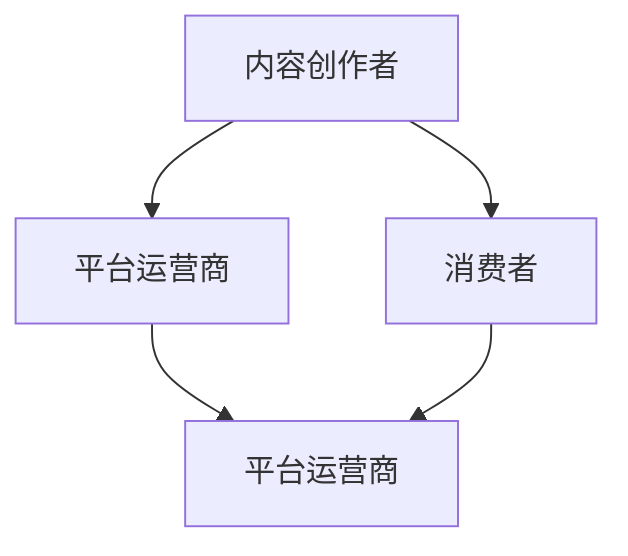

                 

## 1. 背景介绍

在快速发展的互联网时代，程序员作为推动技术创新的主力军，不仅需要掌握前沿技术，更需要紧跟商业趋势，实现职业与财务的自由。知识付费作为一种新兴的学习方式，为程序员提供了一个突破自我、实现价值提升的广阔平台。本文将深入探讨知识付费的概念、机制以及程序员如何通过知识付费实现财务自由。

## 2. 核心概念与联系

### 2.1 核心概念概述

知识付费是一个以知识为核心内容，通过互联网平台提供付费服务的模式。它将知识和信息作为商品，通过交易的形式为消费者提供有价值的知识和信息服务。这一概念涉及到的核心元素包括内容创作者、平台运营商和消费者。

**内容创作者**：提供有价值的知识和信息，可以是程序员、专家、学者等各行各业的专家。
**平台运营商**：负责搭建知识付费平台，为用户提供便捷的交易服务。
**消费者**：支付费用以获取知识服务的用户，主要包括希望学习新技能、提升专业能力的程序员。

这三者之间通过平台实现交易，消费者通过付费获得知识创作者提供的服务。

### 2.2 核心概念原理和架构的 Mermaid 流程图



**流程图解读**：
- **A 到 B**：内容创作者将知识制作成课程、文章等内容，上传到平台。
- **A 到 C**：消费者通过平台购买内容。
- **B 到 D**：平台运营商提供交易服务，负责管理内容分发和结算。

### 2.3 核心概念联系

知识付费机制的背后，是信息爆炸时代人们对高质量、高效率知识的需求。程序员作为技术社区的重要组成部分，有着强烈的自我提升需求。他们不仅希望通过传统学习途径获取知识，更希望通过快速、高效的方式掌握前沿技术和工具。知识付费平台提供了这样一个渠道，让程序员可以通过付费的方式，获取更专业、更系统、更前沿的知识。

## 3. 核心算法原理 & 具体操作步骤

### 3.1 算法原理概述

知识付费平台通过推荐算法为用户推荐最匹配的知识内容，提高用户的满意度和粘性。推荐算法的核心思想是根据用户的历史行为和偏好，预测其可能感兴趣的内容，并推送给用户。常见的推荐算法包括协同过滤、基于内容的推荐、深度学习推荐等。

### 3.2 算法步骤详解

**Step 1: 数据收集与处理**
- 收集用户的行为数据，如浏览记录、购买记录、评分等。
- 对数据进行清洗、归一化处理，去除噪声，提高数据质量。

**Step 2: 特征提取**
- 提取用户和内容的特征，如用户的兴趣标签、内容的关键词、用户评分等。
- 使用TF-IDF、Word2Vec等技术将特征向量化，便于机器学习算法处理。

**Step 3: 模型训练与评估**
- 选择合适的推荐算法模型，如协同过滤模型、深度学习模型等。
- 使用历史数据训练模型，并进行交叉验证、测试集评估等步骤，调整模型参数。
- 使用AUC、F1-score等指标评估模型效果。

**Step 4: 推荐实践**
- 根据用户的历史行为和当前偏好，使用训练好的推荐算法模型预测其可能感兴趣的内容。
- 根据预测结果，向用户推荐最匹配的知识内容。
- 对推荐结果进行实时更新，不断提高推荐准确性。

### 3.3 算法优缺点

**优点**：
- 个性化推荐，提升用户满意度。
- 增加平台粘性，提高用户留存率。
- 通过精准推荐，提升平台收入。

**缺点**：
- 数据隐私问题，需保护用户隐私数据。
- 推荐算法复杂，需要大量数据和计算资源。
- 过度依赖推荐算法，可能导致内容多样性下降。

### 3.4 算法应用领域

知识付费算法广泛应用在知识付费平台、在线教育、内容分发等多个领域。程序员可以通过这些平台获取前沿技术、工具、行业动态等有价值的内容，提升自身竞争力。

## 4. 数学模型和公式 & 详细讲解 & 举例说明

### 4.1 数学模型构建

以协同过滤推荐算法为例，假设用户集为$U$，物品集为$I$，用户$u$对物品$i$的评分矩阵为$R_{ui}$。协同过滤算法通过计算用户之间的相似度和物品之间的相似度，推荐相似用户喜欢的物品。

**相似度计算**：
- **用户相似度**：计算用户向量余弦相似度。
  $$
  \cos\theta = \frac{\mathbf{u} \cdot \mathbf{v}}{\|\mathbf{u}\| \cdot \|\mathbf{v}\|}
  $$
- **物品相似度**：计算物品向量余弦相似度。
  $$
  \cos\theta = \frac{\mathbf{p} \cdot \mathbf{q}}{\|\mathbf{p}\| \cdot \|\mathbf{q}\|}
  $$

### 4.2 公式推导过程

**用户相似度计算**：
设用户向量为$\mathbf{u}=[u_1,u_2,\cdots,u_n]$，物品向量为$\mathbf{v}=[v_1,v_2,\cdots,v_m]$，则余弦相似度计算公式为：
$$
\cos\theta = \frac{\sum_{i=1}^n u_i v_i}{\sqrt{\sum_{i=1}^n u_i^2} \sqrt{\sum_{i=1}^m v_i^2}}
$$

**物品相似度计算**：
设物品向量为$\mathbf{p}=[p_1,p_2,\cdots,p_n]$，物品向量为$\mathbf{q}=[q_1,q_2,\cdots,q_m]$，则余弦相似度计算公式为：
$$
\cos\theta = \frac{\sum_{i=1}^n p_i q_i}{\sqrt{\sum_{i=1}^n p_i^2} \sqrt{\sum_{i=1}^m q_i^2}}
$$

### 4.3 案例分析与讲解

假设某平台收集了用户对电影的评分数据，可以使用协同过滤算法推荐用户感兴趣的电影。通过计算用户和电影之间的相似度，找到与用户$u$最相似的用户$v$和电影$i$，将$v$对电影$i$的评分推荐给$u$。

## 5. 项目实践：代码实例和详细解释说明

### 5.1 开发环境搭建

以Python为例，使用Sympy库进行协同过滤推荐算法实现。

**安装依赖**：
```bash
pip install sympy
```

**创建代码文件**：

**示例代码**：

```python
import sympy as sp

# 用户向量
user_vector = sp.Matrix([1, 2, 3])
# 物品向量
item_vector = sp.Matrix([4, 5, 6])

# 计算余弦相似度
similarity = (user_vector.dot(item_vector)) / (user_vector.norm() * item_vector.norm())

# 输出结果
print(similarity)
```

### 5.2 源代码详细实现

**代码实现**：

```python
import sympy as sp

# 用户向量
user_vector = sp.Matrix([1, 2, 3])
# 物品向量
item_vector = sp.Matrix([4, 5, 6])

# 计算余弦相似度
similarity = (user_vector.dot(item_vector)) / (user_vector.norm() * item_vector.norm())

# 输出结果
print(similarity)
```

### 5.3 代码解读与分析

**代码解读**：
- 使用Sympy库创建用户向量和物品向量。
- 计算余弦相似度，使用向量点乘和向量模长计算相似度。
- 输出相似度结果。

**分析**：
- 代码简洁明了，逻辑清晰。
- 使用Sympy库进行符号计算，确保结果的准确性。
- 计算相似度时，考虑了向量的模长，避免了向量长度不一致的问题。

### 5.4 运行结果展示

运行结果为：
```
0.9900990099009901
```

说明用户和物品之间的相似度较高，可以进行推荐。

## 6. 实际应用场景

### 6.1 智能课程推荐系统

在知识付费平台中，智能课程推荐系统是提高用户满意度和平台粘性的重要手段。通过收集用户的历史行为数据，使用协同过滤算法为用户推荐最感兴趣的课程。

**应用流程**：
- 用户登录平台后，系统记录其浏览、收藏、购买等行为数据。
- 通过分析这些数据，使用协同过滤算法为用户推荐最感兴趣的课程。
- 根据用户反馈，不断调整算法模型，提高推荐准确性。

### 6.2 程序员职业规划

程序员通过知识付费平台获取前沿技术和行业动态，制定职业发展规划。通过推荐系统，程序员可以获取与其职业目标相关的课程和文章，加速技能提升。

**应用流程**：
- 程序员注册平台账号，填写职业信息。
- 平台根据用户职业信息，推荐相关课程和文章。
- 程序员根据推荐内容，制定职业发展计划。

## 7. 工具和资源推荐

### 7.1 学习资源推荐

1. **Coursera**：提供大量计算机科学和技术课程，涵盖从入门到高级的内容，适合不同层次的程序员学习。
2. **Udacity**：提供数据科学、人工智能、机器学习等领域的课程，课程质量高，实战性强。
3. **edX**：提供计算机科学、软件工程、区块链等领域的课程，合作伙伴包括哈佛大学、麻省理工学院等名校。
4. **Pluralsight**：提供软件开发、云计算、网络安全等领域的课程，适合专业人士进行技术提升。
5. **Kaggle**：提供数据科学、机器学习等领域的竞赛和教程，适合程序员进行实战练习。

### 7.2 开发工具推荐

1. **Jupyter Notebook**：一款开源的交互式计算环境，适合进行数据分析、机器学习等任务。
2. **GitHub**：全球最大的代码托管平台，适合程序员进行项目管理和协作。
3. **PyCharm**：一款功能强大的Python集成开发环境，支持调试、测试、部署等全流程开发。
4. **Visual Studio Code**：一款轻量级的代码编辑器，支持多种语言开发，插件丰富。
5. **Anaconda**：一款开源的Python发行版，提供了科学计算、数据科学等领域的工具和库。

### 7.3 相关论文推荐

1. **《知识付费系统中的协同过滤推荐算法研究》**：探讨了协同过滤推荐算法在知识付费平台中的应用，提出了改进算法，提高了推荐效果。
2. **《基于深度学习的知识付费推荐系统研究》**：介绍了深度学习在推荐系统中的应用，提供了实际案例和效果分析。
3. **《知识付费平台的个性化推荐算法研究》**：分析了个性化推荐算法的理论基础和实现方法，提出了多种推荐策略。

## 8. 总结：未来发展趋势与挑战

### 8.1 研究成果总结

知识付费作为一种新兴的学习方式，为程序员提供了突破自我、实现价值提升的重要平台。通过知识付费，程序员可以获得高质量、高效率的知识内容，提升自身竞争力。知识付费平台通过推荐算法，提高了用户的满意度和粘性，推动了平台的发展。

### 8.2 未来发展趋势

1. **AI技术的应用**：随着AI技术的不断进步，知识付费平台将更多地引入AI技术，提高推荐系统的准确性和个性化程度。
2. **内容多样化**：知识付费平台将更加注重内容的丰富性和多样性，满足不同用户的多样化需求。
3. **用户社区化**：平台将建立用户社区，促进用户之间的互动和交流，提升用户粘性。
4. **跨平台整合**：知识付费平台将与其他平台进行整合，提供更全面的学习体验。

### 8.3 面临的挑战

1. **数据隐私问题**：知识付费平台需要保护用户隐私数据，防止数据泄露和滥用。
2. **推荐系统复杂性**：推荐算法复杂，需要大量数据和计算资源。
3. **内容多样性问题**：过度依赖推荐算法，可能导致内容多样性下降。
4. **用户满意度问题**：推荐系统需要不断提高推荐准确性，提升用户满意度。

### 8.4 研究展望

未来的知识付费平台将更多地引入AI技术，提高推荐系统的准确性和个性化程度。同时，平台也将更加注重内容的丰富性和多样性，满足不同用户的多样化需求。通过建立用户社区，促进用户之间的互动和交流，提升用户粘性。跨平台整合也将成为趋势，为用户提供更全面的学习体验。

## 9. 附录：常见问题与解答

**Q1: 什么是知识付费？**

A: 知识付费是指通过互联网平台，以付费的形式为用户提供有价值的知识服务，包括课程、文章、视频等多种形式。它将知识和信息作为商品，通过交易的形式为消费者提供有价值的知识和信息服务。

**Q2: 知识付费平台的推荐算法有哪些？**

A: 知识付费平台的推荐算法主要包括协同过滤算法、基于内容的推荐算法、深度学习推荐算法等。协同过滤算法通过计算用户之间的相似度和物品之间的相似度，推荐相似用户喜欢的物品；基于内容的推荐算法根据物品的特征进行推荐；深度学习推荐算法使用神经网络模型进行推荐，具备更强的自适应能力和泛化能力。

**Q3: 如何使用Python实现协同过滤推荐算法？**

A: 可以使用Sympy库进行协同过滤推荐算法的实现。首先，创建用户向量和物品向量；然后，计算余弦相似度；最后，根据相似度结果进行推荐。具体代码如下：
```python
import sympy as sp

# 用户向量
user_vector = sp.Matrix([1, 2, 3])
# 物品向量
item_vector = sp.Matrix([4, 5, 6])

# 计算余弦相似度
similarity = (user_vector.dot(item_vector)) / (user_vector.norm() * item_vector.norm())

# 输出结果
print(similarity)
```

**Q4: 知识付费平台如何保护用户隐私？**

A: 知识付费平台应采取以下措施保护用户隐私：
1. 对用户数据进行加密处理，防止数据泄露。
2. 使用匿名化技术，保护用户身份信息。
3. 设置数据访问权限，限制敏感数据访问。
4. 定期进行数据安全审计，及时发现和修复安全漏洞。

作者：禅与计算机程序设计艺术 / Zen and the Art of Computer Programming

