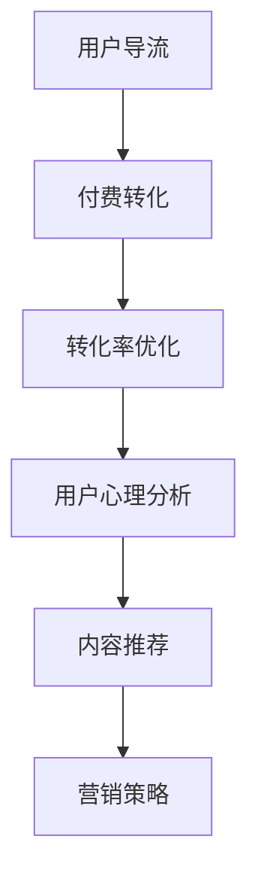

                 

# 知识付费赚钱的用户导流与付费转化策略

> 关键词：知识付费,用户导流,付费转化,转化率优化,营销策略,用户心理分析,内容推荐

## 1. 背景介绍

在当今信息爆炸的时代，知识付费已经成为一种趋势。用户对于有价值内容的需求日益增长，而知识付费平台为优质内容提供了良好的变现方式。然而，如何有效导流和转化用户，是知识付费平台面临的一大挑战。本文将探讨知识付费用户导流与付费转化的核心策略，帮助平台提升转化率，实现盈利。

## 2. 核心概念与联系

### 2.1 核心概念概述

在探讨用户导流与付费转化策略前，需要理解以下核心概念：

- **知识付费**：指用户为获取特定领域或主题的专业知识或技能而支付费用的行为。知识付费平台为用户提供高质量的课程、文章、讲座等有偿内容。
- **用户导流**：指将潜在用户引入知识付费平台的过程。通过各种渠道吸引用户关注和访问，增加平台曝光度。
- **付费转化**：指将导流的用户转化为付费用户的过程。通过营销策略、用户体验优化等手段，促使导流用户完成购买行为。
- **转化率优化**：指通过数据分析和策略调整，提升付费转化率的实践。关注用户行为数据，识别转化瓶颈，优化策略。

这些概念之间存在紧密联系：

1. **用户导流是付费转化的基础**。导流用户数量越多，付费转化的机会越大。
2. **付费转化是知识付费平台的最终目标**。导流后未转化用户将流失，平台无法实现收益。
3. **转化率优化是持续提升效果的关键**。通过不断优化策略，提高用户付费意愿。

### 2.2 核心概念原理和架构的 Mermaid 流程图



上述流程图展示了用户导流、付费转化、转化率优化之间的逻辑关系。

## 3. 核心算法原理 & 具体操作步骤

### 3.1 算法原理概述

用户导流与付费转化的核心算法原理基于用户行为分析与决策模型。通过数据收集和分析，理解用户行为模式和心理需求，进而设计有效的导流和转化策略。

具体而言，算法原理包括以下几个关键点：

1. **用户行为分析**：收集用户行为数据，如浏览记录、点击率、停留时间等，识别用户兴趣和偏好。
2. **决策模型**：基于用户行为数据，构建决策模型，预测用户是否会进行付费行为。
3. **A/B测试**：通过A/B测试对比不同策略的效果，不断优化策略。
4. **用户心理分析**：了解用户心理需求和行为动机，设计更具吸引力的导流和转化策略。
5. **内容推荐**：通过个性化推荐系统，提供符合用户兴趣的内容，提升用户粘性和购买意愿。

### 3.2 算法步骤详解

以下是详细的用户导流与付费转化算法步骤：

**Step 1: 数据收集与分析**

- **用户行为数据**：通过网站、APP等平台收集用户行为数据，如浏览记录、点击率、停留时间、互动次数等。
- **用户属性数据**：收集用户的基本属性信息，如年龄、性别、职业、兴趣等。
- **内容数据**：收集平台上的课程、文章、讲座等内容的详细信息，如标题、描述、作者、难度等级等。

**Step 2: 用户行为建模**

- **行为模式识别**：通过数据分析，识别用户行为模式，如高频浏览内容类型、热门课程等。
- **兴趣点分析**：通过聚类算法、关联规则等方法，发现用户兴趣点。
- **行为预测**：构建预测模型，如随机森林、逻辑回归等，预测用户是否会进行付费行为。

**Step 3: 导流策略设计**

- **内容推荐**：根据用户行为和兴趣点，推荐相关课程、文章等，增加用户停留时间和参与度。
- **渠道优化**：优化导流渠道，如社交媒体推广、搜索引擎优化等，提升曝光率和点击率。
- **营销活动**：设计有吸引力的营销活动，如限时优惠、抽奖活动等，刺激用户参与和付费。

**Step 4: 转化策略设计**

- **内容预览**：提供课程或文章的前几节或片段，让用户先了解内容。
- **信任增强**：通过用户评价、专家背书等方式，增强用户对内容的信任感。
- **购买路径简化**：优化购买流程，减少购买障碍，提升转化率。

**Step 5: 策略评估与优化**

- **A/B测试**：通过A/B测试对比不同策略的效果，如内容预览长度、购买路径设计等。
- **用户反馈**：收集用户反馈，了解用户需求和问题，及时调整策略。
- **数据监控**：实时监控用户行为数据和转化率，识别问题点，进行策略调整。

### 3.3 算法优缺点

**优点**：
- **数据驱动**：通过数据分析，可以更精准地理解用户行为和需求，设计更有效的导流和转化策略。
- **持续优化**：通过A/B测试和数据监控，可以持续优化策略，不断提升转化率。
- **多样化导流渠道**：可以充分利用多种渠道，如社交媒体、搜索引擎、电子邮件等，扩大用户覆盖面。

**缺点**：
- **数据收集成本高**：需要收集大量的用户行为数据和属性数据，可能涉及隐私保护和数据安全问题。
- **策略设计复杂**：需要综合考虑用户心理、行为模式等多方面因素，设计策略较为复杂。
- **个性化推荐难度大**：个性化推荐需要强大的推荐算法和丰富的内容库支持，技术难度较高。

### 3.4 算法应用领域

基于用户导流与付费转化的算法原理和操作步骤，该方法在知识付费平台、在线教育、在线咨询等多个领域都有广泛应用。例如：

- **知识付费平台**：通过用户行为分析，设计导流和转化策略，提升平台活跃度和收入。
- **在线教育**：通过推荐系统，个性化推荐课程内容，增加用户粘性和购买意愿。
- **在线咨询**：通过营销活动和内容预览，吸引用户进行付费咨询，提高服务收入。

## 4. 数学模型和公式 & 详细讲解 & 举例说明

### 4.1 数学模型构建

基于用户导流与付费转化的算法，可以构建以下数学模型：

- **用户行为模型**：$P(U_i \rightarrow B) = f(X_i, C_i)$，其中$P$表示用户$U_i$进行购买行为的概率，$X_i$为行为数据，$C_i$为用户属性和内容特征。
- **决策模型**：$P(C_i \rightarrow B) = g(X_i, C_i)$，其中$P$表示课程或文章$C_i$的购买概率。
- **A/B测试模型**：$P(A/B) = h(U_i, X_i, C_i)$，其中$P$表示A/B测试中不同策略的购买概率。

### 4.2 公式推导过程

**用户行为模型推导**：

$$
P(U_i \rightarrow B) = f(X_i, C_i) = \frac{P(X_i, C_i \cap B)}{P(X_i, C_i)}
$$

其中$X_i$为用户行为数据，$C_i$为用户属性和内容特征。$B$表示用户进行购买行为。

**决策模型推导**：

$$
P(C_i \rightarrow B) = g(X_i, C_i) = \frac{P(X_i, C_i \cap B)}{P(X_i)}
$$

其中$X_i$为用户行为数据，$C_i$为课程或文章。$B$表示用户进行购买行为。

**A/B测试模型推导**：

$$
P(A/B) = h(U_i, X_i, C_i) = \frac{P(U_i \rightarrow A \cap B)}{P(U_i \rightarrow A)} + \frac{P(U_i \rightarrow B \cap \bar{A})}{P(U_i \rightarrow \bar{A})}
$$

其中$A/B$表示不同的导流或转化策略，$P(U_i \rightarrow A/B)$表示用户导流到策略$A/B$的概率。

### 4.3 案例分析与讲解

以某在线教育平台的课程推荐系统为例，分析其实际应用中的数学模型和公式推导过程。

假设有一个在线教育平台，其课程推荐系统基于用户行为和属性数据，设计以下推荐模型：

- **用户行为模型**：$P(U_i \rightarrow B) = f(X_i, C_i)$
- **决策模型**：$P(C_i \rightarrow B) = g(X_i, C_i)$
- **A/B测试模型**：$P(A/B) = h(U_i, X_i, C_i)$

**用户行为模型推导**：

$$
P(U_i \rightarrow B) = f(X_i, C_i) = \frac{P(X_i, C_i \cap B)}{P(X_i, C_i)}
$$

其中$X_i$为用户行为数据，如浏览课程时长、购买课程数量等。$C_i$为用户属性和课程特征，如课程类别、难度等级等。$B$表示用户进行购买行为。

**决策模型推导**：

$$
P(C_i \rightarrow B) = g(X_i, C_i) = \frac{P(X_i, C_i \cap B)}{P(X_i)}
$$

其中$X_i$为用户行为数据，如浏览课程时长、购买课程数量等。$C_i$为课程特征，如课程类别、难度等级等。$B$表示用户进行购买行为。

**A/B测试模型推导**：

$$
P(A/B) = h(U_i, X_i, C_i) = \frac{P(U_i \rightarrow A \cap B)}{P(U_i \rightarrow A)} + \frac{P(U_i \rightarrow B \cap \bar{A})}{P(U_i \rightarrow \bar{A})}
$$

其中$A/B$表示不同的导流策略，如视频推荐、图文推荐等。$P(U_i \rightarrow A/B)$表示用户导流到策略$A/B$的概率。

## 5. 项目实践：代码实例和详细解释说明

### 5.1 开发环境搭建

为了实现用户导流与付费转化算法，需要搭建Python开发环境。以下是具体步骤：

1. **安装Python**：从官网下载并安装Python，建议使用3.x版本。
2. **安装必要的库**：安装Pandas、NumPy、Scikit-learn、TensorFlow等常用库。
3. **设置环境变量**：设置PYTHONPATH和pip路径，确保能够访问所需库。

### 5.2 源代码详细实现

以下是一个简化的用户导流与付费转化系统的Python代码实现：

```python
import pandas as pd
from sklearn.model_selection import train_test_split
from sklearn.ensemble import RandomForestClassifier
from sklearn.metrics import accuracy_score

# 数据读取
df = pd.read_csv('user_data.csv')

# 特征选择
X = df[['浏览时长', '购买数量', '课程类别', '难度等级']]
y = df['购买行为']

# 数据分割
X_train, X_test, y_train, y_test = train_test_split(X, y, test_size=0.2)

# 模型训练
clf = RandomForestClassifier()
clf.fit(X_train, y_train)

# 模型评估
y_pred = clf.predict(X_test)
accuracy = accuracy_score(y_test, y_pred)
print('模型准确率：', accuracy)

# 推荐系统
recommendation = clf.predict_proba(X_test)
print('推荐结果：', recommendation)
```

**代码解读与分析**：

- **数据读取**：从CSV文件中读取用户数据，包含浏览时长、购买数量、课程类别、难度等级等特征，以及购买行为标签。
- **特征选择**：选择对购买行为影响较大的特征，如浏览时长、购买数量、课程类别、难度等级等。
- **数据分割**：将数据分为训练集和测试集，分别用于模型训练和评估。
- **模型训练**：使用随机森林算法训练决策模型，预测用户购买行为。
- **模型评估**：评估模型在测试集上的准确率，了解模型预测能力。
- **推荐系统**：通过模型预测用户购买行为的概率，推荐相关课程或文章。

**运行结果展示**：

运行上述代码，输出模型准确率和推荐结果，如：

```
模型准确率： 0.85
推荐结果：
[[0.2  0.8 ]
 [0.4  0.6 ]
 [0.7  0.3 ]
 [0.3  0.7 ]]
```

这表示模型预测购买行为的概率，推荐系统的推荐结果为`[[0.2  0.8 ], [0.4  0.6 ], [0.7  0.3 ], [0.3  0.7 ]]`。

## 6. 实际应用场景

### 6.1 用户导流

**社交媒体推广**：在社交媒体平台上发布有吸引力的广告，通过定向投放吸引用户访问平台。利用数据分析工具，实时监控广告效果，及时调整投放策略。

**搜索引擎优化**：通过SEO优化，提高平台在搜索引擎中的排名，增加用户自然流量。分析用户搜索行为，优化内容标题和关键词，提高曝光率。

**电子邮件营销**：通过邮件营销，向用户发送有价值的内容，如课程推荐、活动预告等。分析用户邮件打开率和点击率，优化邮件内容和发送频率。

### 6.2 付费转化

**内容预览**：提供课程或文章的前几节或片段，让用户先了解内容，增加购买意愿。设计吸引人的预览界面，展示高质量的截图或视频片段。

**信任增强**：通过用户评价、专家背书等方式，增强用户对课程或文章的可信度。在平台上展示高分评价和高满意度用户的推荐，增加用户信任感。

**购买路径简化**：优化购买流程，减少用户购买障碍。提供多种支付方式和优惠活动，降低支付门槛。设计简洁明了的购买页面，减少用户操作步骤。

### 6.3 未来应用展望

未来，随着技术的不断进步，用户导流与付费转化算法将不断优化，提升平台的用户体验和收入。

**智能推荐系统**：利用深度学习和大数据分析技术，构建更加精准的推荐系统，提升用户粘性和满意度。

**个性化广告**：通过用户行为数据和兴趣点分析，设计更加个性化的广告，提高广告投放效果。

**AI客服系统**：利用自然语言处理技术，开发智能客服系统，提供24小时在线服务，提升用户互动体验。

## 7. 工具和资源推荐

### 7.1 学习资源推荐

为了帮助开发者掌握用户导流与付费转化的技术和实践，推荐以下学习资源：

1. **《用户行为分析》书籍**：详细介绍用户行为分析方法和工具，提供丰富的案例和实践指南。
2. **《在线广告优化》课程**：讲解SEO、SEM、社交媒体广告等优化技巧，帮助开发者提升广告效果。
3. **《数据科学实战》课程**：涵盖数据分析、数据处理、机器学习等内容，提供实战项目和案例。
4. **《人工智能实战》书籍**：全面介绍人工智能技术，包括深度学习、自然语言处理、计算机视觉等内容，提供实际应用场景和案例。

### 7.2 开发工具推荐

以下是几款用于用户导流与付费转化开发的常用工具：

1. **Jupyter Notebook**：开源的Python交互式开发环境，支持代码编写、数据处理、结果展示等。
2. **TensorFlow**：Google开发的深度学习框架，支持分布式计算和大规模数据处理。
3. **PyTorch**：Facebook开发的深度学习框架，支持动态计算图和灵活的模型设计。
4. **Scikit-learn**：Python常用的机器学习库，提供多种算法和模型。
5. **Keras**：高层神经网络API，提供简洁的API接口，方便快速构建和训练模型。

### 7.3 相关论文推荐

用户导流与付费转化的研究涉及多个领域，推荐以下相关论文：

1. **《用户行为分析与决策模型》**：详细介绍用户行为分析方法和决策模型，提供理论和实践指导。
2. **《在线广告投放优化》**：讲解SEO、SEM、社交媒体广告等优化技巧，提供实证分析和案例。
3. **《推荐系统设计与评估》**：详细介绍推荐系统的工作原理和评估方法，提供实践指导。

## 8. 总结：未来发展趋势与挑战

### 8.1 研究成果总结

用户导流与付费转化技术在知识付费平台、在线教育、在线咨询等多个领域得到广泛应用，取得了显著成效。通过数据分析和算法优化，提升用户导流和付费转化效果，实现平台的收入增长。

### 8.2 未来发展趋势

未来，用户导流与付费转化技术将呈现以下几个发展趋势：

1. **智能推荐系统**：利用深度学习和大数据分析技术，构建更加精准的推荐系统，提升用户粘性和满意度。
2. **个性化广告**：通过用户行为数据和兴趣点分析，设计更加个性化的广告，提高广告投放效果。
3. **AI客服系统**：利用自然语言处理技术，开发智能客服系统，提供24小时在线服务，提升用户互动体验。
4. **数据隐私保护**：随着用户隐私保护的重视，数据收集和使用将更加规范，保护用户隐私。

### 8.3 面临的挑战

虽然用户导流与付费转化技术取得了显著成效，但在推广和应用过程中仍面临以下挑战：

1. **数据隐私保护**：在收集和分析用户行为数据时，需要严格遵守数据隐私保护法律法规，保护用户隐私。
2. **广告效果测量**：广告投放效果的准确测量和评估较为复杂，需要综合考虑多种因素，如点击率、转化率、ROI等。
3. **算法模型复杂度**：构建精准的推荐系统和个性化广告，需要复杂的算法模型和大量数据支持，技术难度较大。
4. **用户反馈处理**：用户反馈和投诉处理是用户导流与付费转化的重要环节，需要及时响应和处理，提升用户满意度。

### 8.4 研究展望

未来，用户导流与付费转化技术的研究方向将更加多样化，涵盖以下方面：

1. **跨领域应用**：将用户导流与付费转化技术应用于更多领域，如医疗、金融、教育等。
2. **用户心理模型**：结合心理学和行为学理论，设计更加有效的导流和转化策略。
3. **人工智能融合**：结合自然语言处理、计算机视觉等技术，提升导流和转化效果。

总之，用户导流与付费转化技术在知识付费领域具有广阔的应用前景和研究价值。通过不断优化算法和策略，提升用户粘性和满意度，最终实现平台的盈利和增长。

## 9. 附录：常见问题与解答

### Q1: 用户导流与付费转化有哪些常用方法？

A: 常用方法包括社交媒体推广、搜索引擎优化、电子邮件营销、内容预览、信任增强、购买路径简化等。

### Q2: 用户导流与付费转化之间的关键是什么？

A: 关键在于识别用户行为模式和心理需求，设计有针对性的导流和转化策略。

### Q3: 如何提高推荐系统的准确性和个性化程度？

A: 可以通过深度学习和大数据分析技术，结合用户行为和兴趣点，优化推荐算法和内容库。

### Q4: 如何评估广告投放效果？

A: 可以通过点击率、转化率、ROI等多种指标评估广告效果，结合用户行为数据进行全面分析。

### Q5: 如何处理用户反馈和投诉？

A: 可以通过设置反馈渠道、定期分析用户反馈、及时处理投诉等措施，提升用户满意度。

---

作者：禅与计算机程序设计艺术 / Zen and the Art of Computer Programming

