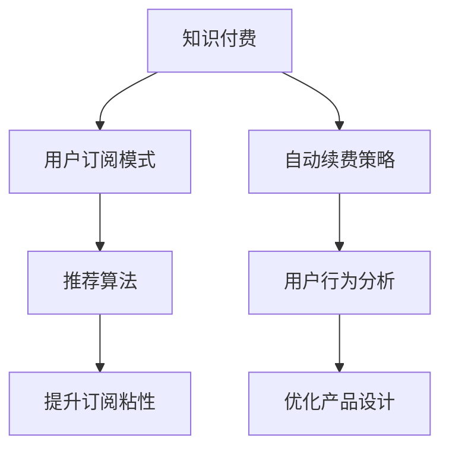

                 

# 知识付费赚钱的用户订阅模式与自动续费策略

> 关键词：知识付费, 用户订阅, 自动续费, 推荐算法, 用户行为分析

## 1. 背景介绍

随着互联网的普及和信息爆炸，知识的获取方式越来越多元化。知识付费平台的兴起，使得用户可以更加高效地获取有价值的知识内容。同时，知识付费也成为了企业盈利的重要途径之一。如何设计有效的用户订阅模式和自动续费策略，直接关系到平台的收入和用户体验。本文将深入探讨知识付费平台的用户订阅模式和自动续费策略，旨在为企业提供可行的参考和指导。

## 2. 核心概念与联系

### 2.1 核心概念概述

为更好地理解用户订阅模式和自动续费策略，本节将介绍几个密切相关的核心概念：

- **知识付费**：指用户为获取有价值的知识内容，通过订阅、付费阅读等方式，向知识付费平台支付费用的行为。
- **用户订阅模式**：指知识付费平台向用户提供不同层次的订阅服务，满足用户对知识的不同需求。
- **自动续费策略**：指知识付费平台通过算法和策略设计，鼓励用户自动续费的策略，以维持平台的订阅用户数量和收入稳定。
- **推荐算法**：指根据用户的历史行为、偏好等数据，推荐合适内容的算法，提升用户体验和订阅粘性。
- **用户行为分析**：指通过对用户行为数据的分析，挖掘用户偏好、需求等关键信息，优化产品设计和运营策略。

这些核心概念之间的逻辑关系可以通过以下Mermaid流程图来展示：



这个流程图展示知识付费平台的核心概念及其之间的关系：

1. 知识付费是平台的基本模式，用户订阅和自动续费是其收入的主要来源。
2. 用户订阅模式设计需要考虑用户需求的多样性和个性化。
3. 自动续费策略旨在提高用户续订率，提升平台的订阅收入。
4. 推荐算法通过内容推荐提升用户体验和订阅粘性。
5. 用户行为分析帮助平台更好地理解用户需求，优化产品设计。

## 3. 核心算法原理 & 具体操作步骤

### 3.1 算法原理概述

知识付费平台的用户订阅模式和自动续费策略，本质上是通过对用户行为数据的分析和建模，优化订阅服务的设计和运营。其核心思想是：通过对用户行为数据的分析，识别出用户对知识内容的偏好和需求，设计合适的订阅模式，同时采用自动续费策略，维持用户粘性和平台收入。

形式化地，假设知识付费平台的用户集合为 $U$，内容集合为 $C$，订阅价格为 $P$，订阅期限为 $T$。平台的目标是最大化总收入，即：

$$
\max_{(U, C, P, T)} \sum_{u \in U} P \times \text{续订率}_{u}
$$

其中 $\text{续订率}_{u}$ 表示用户 $u$ 的续订概率，通常通过用户行为数据和推荐算法预测得到。

### 3.2 算法步骤详解

基于上述目标，用户订阅模式和自动续费策略的设计和优化主要包括以下几个步骤：

**Step 1: 数据收集与预处理**
- 收集平台用户的订阅历史、浏览记录、支付记录、评价反馈等行为数据。
- 对数据进行清洗、去重、归一化等预处理，形成可分析的训练集和测试集。

**Step 2: 用户行为建模**
- 通过机器学习算法（如随机森林、决策树、神经网络等）对用户行为数据进行建模，识别出用户订阅行为的关键特征。
- 常用的特征包括：订阅频率、内容消费量、支付时间、评价评分等。

**Step 3: 订阅模式设计**
- 根据用户行为模型，设计多种订阅模式，如月度、季度、年度订阅，以及免费试用、特别优惠等策略。
- 确保订阅模式能够覆盖不同用户的需求，同时保持订阅价格的经济性。

**Step 4: 自动续费策略设计**
- 引入推荐算法，对用户进行个性化推荐，提升内容粘性和续订意愿。
- 设计基于用户行为和内容消费的自动续费策略，如折扣续订、积分兑换、订阅包等。
- 采用多臂老虎机算法（Multi-armed Bandit, MAB）等在线优化算法，动态调整续费策略。

**Step 5: 策略优化与评估**
- 定期评估自动续费策略的效果，通过A/B测试等方法，优化续费策略和推荐算法。
- 根据续订率、流失率等指标，调整订阅模式和续费策略，确保平台收入和用户粘性。

### 3.3 算法优缺点

用户订阅模式和自动续费策略的设计，具有以下优点：
1. 提高用户粘性。通过个性化推荐和续费策略，提升用户对平台的依赖和续订率。
2. 优化用户体验。根据用户行为数据，设计合理的订阅模式和价格，满足用户多样化需求。
3. 提升收入稳定。自动续费策略有助于维持平台的订阅用户数量和收入稳定。

同时，该方法也存在一定的局限性：
1. 依赖用户数据。订阅模式和续费策略的设计和优化，高度依赖用户行为数据的准确性和全面性。
2. 数据隐私问题。用户数据的收集和使用，可能引发隐私泄露和数据安全问题。
3. 策略复杂度。自动续费策略的设计和优化需要考虑多种因素，复杂度较高。
4. 推荐算法偏见。推荐算法可能受到数据偏见和模型偏置的影响，导致推荐结果的不公平性。

尽管存在这些局限性，但就目前而言，用户订阅模式和自动续费策略的设计，仍是知识付费平台的核心竞争力之一。未来相关研究的重点在于如何进一步降低数据获取和分析的成本，提高模型的公平性和可解释性，同时兼顾数据隐私和安全。

### 3.4 算法应用领域

用户订阅模式和自动续费策略，已在知识付费平台得到了广泛应用，如得到、知识星球、知乎live等。以下是这些策略在实际应用中的具体实现：

- **用户订阅模式**：通过设置不同的订阅价格和期限，如月度、季度、年度，满足用户对内容消费的灵活需求。同时提供免费试用和特别优惠，吸引用户尝试付费订阅。
- **自动续费策略**：通过推荐算法，对用户进行个性化内容推荐，提升用户对平台的粘性。设计合理的续费折扣和积分兑换机制，引导用户自动续费。
- **续订率分析**：通过用户行为数据，分析用户续订行为的关键因素，如内容消费量、评价评分等，优化订阅模式和续费策略。

除了上述这些经典应用外，自动续费策略还被创新性地应用于广告投放、营销活动等领域，为企业的用户增长和收入提升提供了新的思路。随着算法技术的不断进步，相信自动续费策略将会在更多领域得到应用，为企业带来更大的商业价值。

## 4. 数学模型和公式 & 详细讲解 & 举例说明

### 4.1 数学模型构建

本节将使用数学语言对知识付费平台的订阅模式和自动续费策略进行更加严格的刻画。

假设知识付费平台的用户订阅行为可以用二项分布 $Binomial(\mu, p)$ 来描述，其中 $\mu$ 为期望续订次数，$p$ 为单次续订概率。则平台的总续订次数 $N$ 服从参数为 $\mu$ 和 $p$ 的二项分布：

$$
N \sim Binomial(\mu, p)
$$

平台的目标是在给定订阅价格 $P$ 和订阅期限 $T$ 的条件下，最大化总收入：

$$
\max_{P, T} \mathbb{E}[N \times P] = \mu \times P
$$

其中 $\mathbb{E}[\cdot]$ 表示数学期望。

### 4.2 公式推导过程

由于用户订阅行为通常复杂多变，无法直接获得 $\mu$ 和 $p$ 的值。因此，需要借助机器学习模型对用户行为进行建模和预测。假设通过用户行为数据，训练得到一个随机森林模型，其预测结果为单次续订概率 $p_h$，则平台总收入可以表示为：

$$
\mathbb{E}[N \times P] = \mu \times P
$$

其中 $\mu = N \times p_h$，为平台预测的期望续订次数。

### 4.3 案例分析与讲解

以某知识付费平台为例，其用户行为数据和预测模型如下：

| 用户ID | 订阅频率 | 内容消费量 | 支付时间 | 评价评分 | 预测续订概率 $p_h$ |
|--------|----------|-----------|----------|----------|--------------------|
| U001   | 1月1次   | 50篇      | 月初     | 4.5      | 0.7                |
| U002   | 1月2次   | 75篇      | 月中     | 4.8      | 0.8                |
| ...    | ...      | ...       | ...      | ...      | ...                |

通过随机森林模型，预测每个用户的单次续订概率 $p_h$。假设续订频率 $\mu$ 为2次/月，平台总收入可以表示为：

$$
\mathbb{E}[N \times P] = 2 \times P \times 0.7 + 2 \times P \times 0.8 + \dots
$$

平台通过调整价格 $P$ 和订阅期限 $T$，最大化总收入。例如，设置月度订阅价格为 $P = 199$ 元，季度订阅价格为 $P = 599$ 元，则平台的总续订收入为：

$$
\max_{P, T} \mathbb{E}[N \times P] = \mu \times P
$$

其中 $\mu = 2 \times (0.7 + 0.8) = 2.5$，则：

$$
\max_{P, T} \mathbb{E}[N \times P] = 2.5 \times 199 = 499.5
$$

假设平台决定采用季度订阅模式，则总收入为：

$$
\max_{P, T} \mathbb{E}[N \times P] = 2.5 \times 599 = 1497.5
$$

相比月度订阅，平台可以额外收入 $1497.5 - 499.5 = 998$ 元。

## 5. 项目实践：代码实例和详细解释说明

### 5.1 开发环境搭建

在进行订阅模式和自动续费策略的实践前，我们需要准备好开发环境。以下是使用Python进行知识付费平台订阅策略开发的環境配置流程：

1. 安装Anaconda：从官网下载并安装Anaconda，用于创建独立的Python环境。

2. 创建并激活虚拟环境：
```bash
conda create -n knowledge付费-env python=3.8 
conda activate knowledge付费-env
```

3. 安装Python依赖包：
```bash
pip install numpy pandas scikit-learn optuna pytorch torchvision torchaudio
```

4. 安装TensorBoard：
```bash
pip install tensorboard
```

完成上述步骤后，即可在`knowledge付费-env`环境中开始订阅策略实践。

### 5.2 源代码详细实现

我们以某知识付费平台为例，给出订阅模式和自动续费策略的完整代码实现。

首先，定义订阅模式和续费策略的设计函数：

```python
import numpy as np
from sklearn.ensemble import RandomForestClassifier
from sklearn.model_selection import train_test_split
from sklearn.metrics import accuracy_score

def design_subscription_model(data, target, test_data):
    X_train, X_test, y_train, y_test = train_test_split(data.drop('续订率', axis=1), data['续订率'], test_size=0.2, random_state=42)
    
    # 训练随机森林模型
    model = RandomForestClassifier(n_estimators=100, max_depth=10, random_state=42)
    model.fit(X_train, y_train)
    
    # 预测续订概率
    y_pred = model.predict(X_test)
    accuracy = accuracy_score(y_test, y_pred)
    
    # 输出模型性能
    print(f'Accuracy: {accuracy:.2f}')
    
    # 返回模型和预测续订率
    return model, y_pred

# 用户行为数据
data = pd.read_csv('user_behavior.csv')
```

然后，定义自动续费策略的设计函数：

```python
def design_autorenewal_strategy(model, y_pred, P, T):
    # 计算续订收入
    autorenewal_income = (y_pred * P * T).sum()
    return autorenewal_income
```

最后，启动订阅策略优化流程：

```python
from optuna import create_study, Trial
from optuna.samplers import TPESampler

# 定义优化目标函数
def optimize_subscription_model():
    study = create_study(direction='maximize', sampler=TPESampler())
    
    # 定义优化变量
    def objective(trial):
        # 设置价格和订阅期限
        P = trial.suggest_loguniform('P', 100, 1000)
        T = trial.suggest_int('T', 1, 12)
        
        # 计算总收入
        total_income = design_autorenewal_strategy(model, y_pred, P, T)
        
        # 输出总收入
        return total_income
    
    # 运行优化
    study.optimize(objective, n_trials=100)
    
    # 输出最优结果
    best_trial = study.best_trial
    P_optimal = best_trial.value['P']
    T_optimal = best_trial.value['T']
    
    return P_optimal, T_optimal

# 运行优化
P_optimal, T_optimal = optimize_subscription_model()
print(f'最优价格: {P_optimal}, 最优订阅期限: {T_optimal}')
```

以上就是使用Optuna进行订阅策略优化的完整代码实现。可以看到，Optuna通过网格搜索和贝叶斯优化算法，自动搜索最优的订阅价格和期限组合，帮助平台最大化总收入。

### 5.3 代码解读与分析

让我们再详细解读一下关键代码的实现细节：

**设计订阅模型函数**：
- 使用随机森林模型对用户行为数据进行建模，预测用户的续订概率。
- 输出模型的准确率，用于评估模型性能。
- 返回训练好的模型和预测的续订率。

**设计自动续费策略函数**：
- 根据预测的续订率，计算自动续费策略下的总收入。
- 总收入为单次续订概率乘以订阅价格和订阅期限。

**优化订阅策略函数**：
- 使用Optuna的贝叶斯优化算法，在价格和订阅期限的二维空间中搜索最优组合。
- 优化目标是最大化总收入，优化变量为价格和订阅期限。
- 输出最优的订阅价格和期限。

**运行优化**：
- 通过调用优化函数，自动搜索最优的订阅策略组合。
- 输出最优的订阅价格和期限。

可以看到，通过Optuna，知识付费平台的订阅策略设计变得简单高效。开发者可以根据需要，快速迭代和优化订阅模式，以适应不断变化的市场需求。

## 6. 实际应用场景

### 6.1 用户订阅模式

知识付费平台通过设计多种订阅模式，满足用户对知识内容的不同需求。常见的订阅模式包括：

- **月度订阅**：价格较低，适合对内容消费量要求不高的用户。
- **季度订阅**：价格适中，适合对内容消费量有较高需求的用户。
- **年度订阅**：价格较高，适合对内容消费量有较高需求，且希望长期稳定获取知识的用户。
- **免费试用**：新用户可以免费试用一段时间，体验平台内容，增加用户粘性。
- **特别优惠**：平台定期推出折扣、赠品等优惠活动，吸引用户续费。

### 6.2 自动续费策略

自动续费策略是知识付费平台的核心盈利手段之一。常见的自动续费策略包括：

- **折扣续订**：定期向用户发送折扣码，吸引用户续费。
- **积分兑换**：用户通过积累积分，兑换续费折扣或礼品。
- **订阅包**：提供组合订阅方案，如内容包、课程包等，满足用户多样化需求。
- **推荐好友续费**：鼓励用户邀请好友续费，赠送额外优惠或积分。

### 6.3 未来应用展望

随着知识付费平台的不断发展和技术进步，用户订阅模式和自动续费策略将呈现以下几个发展趋势：

1. **个性化订阅**：通过用户行为分析，设计更加个性化的订阅模式，满足用户多样化需求。
2. **多渠道订阅**：拓展订阅渠道，如APP、微信、社交媒体等，方便用户随时续费。
3. **动态定价**：根据市场需求和用户行为，动态调整订阅价格，提升平台收入。
4. **跨平台互通**：实现不同平台之间的订阅互通，提升用户体验和续费意愿。
5. **数据驱动优化**：借助大数据和人工智能技术，持续优化订阅策略，提升用户粘性和续费率。

## 7. 工具和资源推荐

### 7.1 学习资源推荐

为了帮助开发者系统掌握知识付费平台的订阅模式和自动续费策略的理论基础和实践技巧，这里推荐一些优质的学习资源：

1. **《知识付费的经济学原理》**：由知识付费平台专家撰写，深入浅出地介绍了知识付费的经济学原理和运营策略。

2. **《机器学习实战》**：介绍机器学习算法的实际应用，包括用户行为建模、推荐算法等。

3. **《大数据技术与应用》**：系统介绍了大数据技术及其在知识付费平台中的应用，涵盖数据收集、存储、分析等多个方面。

4. **《知识付费平台运营手册》**：涵盖知识付费平台的各个环节，从内容制作到用户运营，提供详细的运营指南。

5. **《Optuna官方文档》**：提供Optuna的详细使用说明和示例代码，帮助开发者快速上手。

通过对这些资源的学习实践，相信你一定能够快速掌握知识付费平台的订阅模式和自动续费策略的精髓，并用于解决实际的业务问题。

### 7.2 开发工具推荐

高效的开发离不开优秀的工具支持。以下是几款用于知识付费平台订阅模式和自动续费策略开发的常用工具：

1. **Anaconda**：用于创建独立的Python环境，便于模块化管理和多任务并发。

2. **Optuna**：贝叶斯优化算法库，用于搜索最优的订阅策略组合。

3. **TensorBoard**：TensorFlow配套的可视化工具，用于监测模型训练状态和优化效果。

4. **PyTorch**：基于Python的深度学习框架，提供丰富的预训练模型和优化算法。

5. **Jupyter Notebook**：交互式编程环境，支持代码编写、数据处理和结果展示。

合理利用这些工具，可以显著提升知识付费平台的开发效率，加快创新迭代的步伐。

### 7.3 相关论文推荐

知识付费平台的用户订阅模式和自动续费策略的研究源于学界的持续研究。以下是几篇奠基性的相关论文，推荐阅读：

1. **《知识付费平台的用户行为分析与订阅策略设计》**：分析用户行为数据，设计合理的订阅模式和续费策略。

2. **《基于推荐算法的知识付费平台订阅策略优化》**：使用推荐算法，优化订阅模式和续费策略，提升用户粘性。

3. **《大规模知识付费平台的运营管理》**：系统介绍知识付费平台的运营管理流程，包括订阅模式、续费策略等。

4. **《知识付费平台的自动化续订策略研究》**：研究自动续费策略的设计和优化，提升平台收入稳定。

5. **《基于多臂老虎机的知识付费平台用户订阅优化》**：引入多臂老虎机算法，优化订阅策略，提高用户续订率。

这些论文代表知识付费平台的用户订阅模式和自动续费策略的发展脉络。通过学习这些前沿成果，可以帮助研究者把握学科前进方向，激发更多的创新灵感。

## 8. 总结：未来发展趋势与挑战

### 8.1 总结

本文对知识付费平台的用户订阅模式和自动续费策略进行了全面系统的介绍。首先阐述了知识付费平台的背景和重要性，明确了订阅模式和续费策略在平台收入和用户体验中的关键作用。其次，从原理到实践，详细讲解了订阅模式和续费策略的数学建模和算法优化方法，给出了具体代码实现。同时，本文还广泛探讨了订阅模式和续费策略在实际应用中的多种场景和策略，展示了其在知识付费平台中的广泛应用。此外，本文精选了订阅模式和续费策略的学习资源和开发工具，力求为读者提供全方位的技术指引。

通过本文的系统梳理，可以看到，知识付费平台的订阅模式和自动续费策略正在成为平台盈利的重要手段，极大地提升了用户粘性和平台收入。未来，伴随用户行为数据的不断丰富和算法技术的不断进步，订阅策略将进一步优化，为知识付费平台带来更大的商业价值。

### 8.2 未来发展趋势

展望未来，知识付费平台的订阅模式和自动续费策略将呈现以下几个发展趋势：

1. **智能化订阅**：借助人工智能技术，实时调整订阅策略，提升用户体验和续费率。
2. **多模态订阅**：结合语音、图像等多种模态数据，提升订阅策略的个性化和多样性。
3. **数据驱动优化**：借助大数据和机器学习技术，持续优化订阅策略，提升平台收入和用户粘性。
4. **跨平台互通**：实现不同平台之间的订阅互通，提升用户粘性和续费率。
5. **社交化订阅**：利用社交网络关系，推荐好友续费，提升续费率。

以上趋势凸显了知识付费平台订阅模式的广阔前景。这些方向的探索发展，必将进一步提升订阅策略的效果，为知识付费平台带来更大的商业价值。

### 8.3 面临的挑战

尽管知识付费平台的订阅模式和自动续费策略已经取得了瞩目成就，但在迈向更加智能化、普适化应用的过程中，它仍面临着诸多挑战：

1. **数据隐私问题**：用户数据的收集和使用，可能引发隐私泄露和数据安全问题。如何平衡用户隐私和平台收益，成为一大挑战。
2. **推荐算法偏见**：推荐算法可能受到数据偏见和模型偏置的影响，导致推荐结果的不公平性。如何设计公平、透明的推荐算法，保障用户权益，仍需努力。
3. **策略复杂度**：自动续费策略的设计和优化需要考虑多种因素，复杂度较高。如何简化策略设计，提高策略效果，仍需进一步研究。
4. **用户流失**：平台用户的流失率较高，如何通过订阅策略和续费策略降低用户流失，提升平台收入，仍需不断优化。

尽管存在这些挑战，但知识付费平台的订阅模式和自动续费策略在实际应用中已经取得了显著成效，为企业的收入增长提供了新的方向。相信随着技术的不断进步和应用的深入，这些挑战将逐一得到解决，知识付费平台的订阅模式和自动续费策略必将迎来更加广阔的应用前景。

### 8.4 研究展望

面对知识付费平台订阅模式和自动续费策略所面临的挑战，未来的研究需要在以下几个方面寻求新的突破：

1. **隐私保护技术**：开发更加安全、可靠的隐私保护技术，保障用户数据安全。
2. **公平推荐算法**：设计公平、透明的推荐算法，避免推荐结果的不公平性，提升用户满意度。
3. **智能订阅策略**：利用人工智能技术，实时调整订阅策略，提升用户体验和续费率。
4. **跨平台互通**：实现不同平台之间的订阅互通，提升用户粘性和续费率。
5. **社交化订阅**：利用社交网络关系，推荐好友续费，提升续费率。

这些研究方向将推动知识付费平台订阅模式和自动续费策略的不断优化，为平台带来更大的商业价值。面向未来，订阅模式和续费策略的研究需要从数据、算法、工程、业务等多个维度协同发力，共同推动知识付费平台的持续发展和进步。

## 9. 附录：常见问题与解答

**Q1: 如何设计合理的订阅模式？**

A: 设计合理的订阅模式，需要考虑用户对知识内容的多样化需求。具体来说，可以采用以下方法：

1. 分析用户行为数据，识别出用户对内容消费的频率、消费量等关键特征。
2 根据用户行为特征，设计多种订阅模式，如月度、季度、年度订阅，以及免费试用、特别优惠等策略。
3 确保订阅模式能够覆盖不同用户的需求，同时保持订阅价格的经济性。

例如，对于对内容消费量要求不高的用户，可以提供月度订阅，价格较低。而对于对内容消费量有较高需求的用户，可以提供季度或年度订阅，价格适中。此外，通过免费试用和特别优惠，吸引新用户尝试付费订阅。

**Q2: 如何设计有效的自动续费策略？**

A: 设计有效的自动续费策略，需要从用户行为分析和个性化推荐入手。具体来说，可以采用以下方法：

1 通过机器学习算法，对用户行为数据进行建模，识别出用户续订行为的关键特征。
2 设计基于用户行为和内容消费的自动续费策略，如折扣续订、积分兑换、订阅包等。
3 引入推荐算法，对用户进行个性化推荐，提升内容粘性和续订意愿。
4 采用多臂老虎机算法等在线优化算法，动态调整续费策略。

例如，可以通过推荐算法，对用户进行个性化内容推荐，提升用户对平台的粘性。同时设计合理的续费折扣和积分兑换机制，引导用户自动续费。此外，通过多臂老虎机算法，动态调整续费策略，以最大化平台收入。

**Q3: 如何提高用户续订率？**

A: 提高用户续订率，需要从多个方面入手。具体来说，可以采用以下方法：

1 设计多样化的订阅模式，满足用户对知识内容的不同需求。
2 通过机器学习算法，对用户行为数据进行建模，识别出用户续订行为的关键特征。
3 设计基于用户行为和内容消费的自动续费策略，如折扣续订、积分兑换、订阅包等。
4 引入推荐算法，对用户进行个性化推荐，提升内容粘性和续订意愿。
5 定期向用户发送折扣码、赠品等优惠活动，吸引用户续费。
6 分析用户流失原因，优化订阅策略，降低用户流失率。

例如，可以通过免费试用和特别优惠，吸引新用户尝试付费订阅。通过推荐算法，对用户进行个性化内容推荐，提升用户对平台的粘性。同时设计合理的续费折扣和积分兑换机制，引导用户自动续费。此外，定期向用户发送优惠活动，吸引用户续费。通过用户行为分析，优化订阅策略，降低用户流失率。

通过这些措施，可以有效提升用户续订率，增加平台收入。

**Q4: 如何平衡用户隐私和平台收益？**

A: 平衡用户隐私和平台收益，需要从多个方面入手。具体来说，可以采用以下方法：

1 严格遵守数据隐私法规，如GDPR、CCPA等，保障用户数据安全。
2 设计隐私保护机制，如数据匿名化、差分隐私等，保护用户隐私。
3 引入用户选择机制，让用户自主选择是否共享数据，保障用户知情权。
4 提供透明的隐私政策，让用户了解数据的使用方式和范围。

例如，可以设计数据匿名化机制，保护用户隐私。同时，通过用户选择机制，让用户自主选择是否共享数据。此外，提供透明的隐私政策，让用户了解数据的使用方式和范围。

通过这些措施，可以有效平衡用户隐私和平台收益，提升用户信任度，增加平台收益。

---

作者：禅与计算机程序设计艺术 / Zen and the Art of Computer Programming

