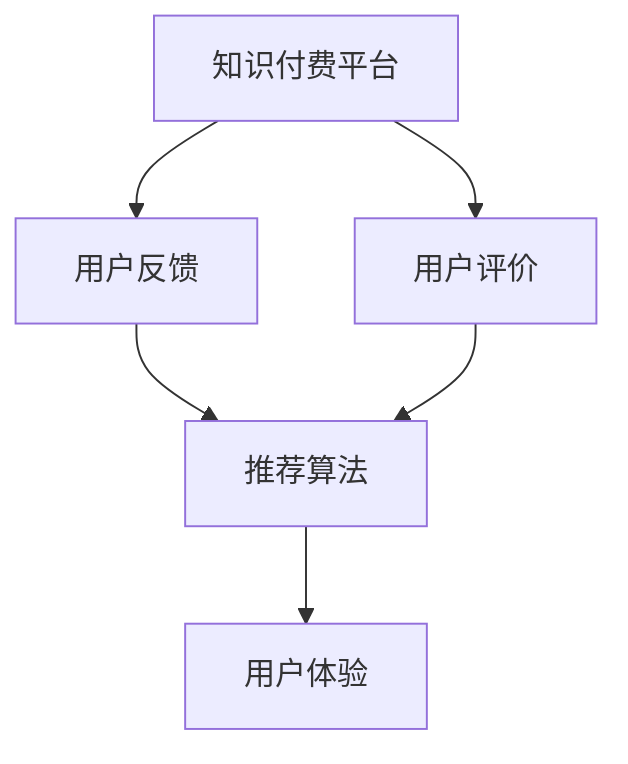

                 

# 知识付费赚钱的用户课程评价与反馈收集机制

> 关键词：知识付费,用户评价,反馈收集,推荐算法,用户体验

## 1. 背景介绍

### 1.1 问题由来

随着互联网和移动互联网的迅猛发展，知识付费行业迎来了前所未有的机遇。无论是出版行业的电子书、有声书，还是科技行业的技术博客、在线课程，知识付费正逐渐成为人们获取知识、提升技能的重要途径。而用户对于课程质量的评价与反馈，无疑是衡量知识付费平台价值的重要指标。

然而，由于知识付费平台缺乏系统化的用户评价与反馈收集机制，导致大量用户在课程学习完毕后，无法进行有效的评价与反馈，不仅影响了知识付费平台的市场竞争力和品牌形象，也导致了用户流失和平台信任度下降。因此，构建一套科学、合理、高效的用户课程评价与反馈收集机制，已经成为知识付费平台亟待解决的重要问题。

### 1.2 问题核心关键点

用户课程评价与反馈收集机制的核心关键点主要包括：

- **用户评价与反馈的自动收集**：通过技术手段自动收集用户对课程的评价与反馈信息，避免人工操作带来的繁琐与误差。
- **评价与反馈数据的处理与分析**：对收集到的用户评价与反馈数据进行有效处理与分析，从中挖掘用户真实的课程体验与需求。
- **基于用户评价的推荐算法**：基于用户评价数据，构建精准的推荐算法，提升平台推荐课程的精准度和用户体验。
- **用户满意度提升**：通过改进评价与反馈机制，提升用户对平台的满意度和忠诚度，促进平台商业变现。

## 2. 核心概念与联系

### 2.1 核心概念概述

为更好地理解知识付费平台的用户课程评价与反馈收集机制，本节将介绍几个密切相关的核心概念：

- **知识付费平台**：提供付费知识内容，如电子书、在线课程、技术博客等，主要盈利模式为会员订阅、单次购买、广告等。
- **用户评价**：用户对课程内容、讲师、教学方式等方面的主观感受和意见。
- **用户反馈**：用户在学习过程中遇到的问题、建议、意见等。
- **推荐算法**：通过用户评价和反馈数据，构建用户兴趣模型，推荐个性化课程。
- **用户体验**：用户在使用知识付费平台时的整体感受和满意度。

这些核心概念之间的逻辑关系可以通过以下Mermaid流程图来展示：



这个流程图展示了好评与反馈收集机制的核心概念及其之间的关系：

1. 知识付费平台通过收集用户评价与反馈数据，分析用户行为和需求。
2. 基于用户评价数据，构建推荐算法，为用户提供个性化课程推荐。
3. 用户使用推荐课程后的体验影响满意度，进而影响未来的评价和反馈。

## 3. 核心算法原理 & 具体操作步骤
### 3.1 算法原理概述

知识付费平台的用户课程评价与反馈收集机制，本质上是基于用户行为数据的深度分析与挖掘。其核心思想是：

1. **自动收集评价与反馈数据**：利用Web爬虫、移动应用API、用户行为日志等技术手段，自动收集用户对课程的评价与反馈信息。
2. **数据清洗与处理**：对收集到的用户评价与反馈数据进行清洗、去重、标注等处理，提取出有效的数据信息。
3. **用户行为分析**：基于用户评价与反馈数据，构建用户兴趣模型，分析用户的兴趣点、需求点和痛点。
4. **推荐算法优化**：利用机器学习、深度学习等技术，构建精准的推荐算法，提升推荐课程的精准度和用户体验。
5. **用户满意度提升**：通过改进评价与反馈机制，提升用户对平台的满意度和忠诚度，促进平台商业变现。

### 3.2 算法步骤详解

构建知识付费平台的用户课程评价与反馈收集机制，一般包括以下几个关键步骤：

**Step 1: 准备数据与技术架构**

- 确定数据收集渠道，如移动应用、网站、学习平台API等。
- 选择合适的技术架构，如Web爬虫、数据处理引擎、推荐算法框架等。

**Step 2: 自动收集评价与反馈数据**

- 设计自动收集脚本，定期从用户接口获取评价与反馈信息。
- 对获取到的数据进行去重、清洗和格式转换等预处理。

**Step 3: 用户行为分析**

- 利用自然语言处理技术，对用户评价与反馈数据进行情感分析和主题建模。
- 使用统计学方法，分析用户行为特征，构建用户兴趣模型。

**Step 4: 推荐算法优化**

- 构建推荐算法模型，如协同过滤、内容推荐、混合推荐等。
- 优化模型参数，提升推荐精准度，提高用户体验。

**Step 5: 用户满意度提升**

- 设计满意度调查问卷，定期收集用户反馈。
- 根据用户反馈优化课程内容和推荐算法，提升用户满意度。

**Step 6: 反馈与迭代**

- 建立持续反馈机制，收集用户对评价与反馈机制的意见和建议。
- 根据用户反馈进行机制优化与迭代，不断提升平台的用户体验和商业价值。

### 3.3 算法优缺点

知识付费平台的用户课程评价与反馈收集机制具有以下优点：

1. **数据驱动决策**：基于用户评价与反馈数据，优化课程内容和推荐算法，提升用户体验和平台价值。
2. **个性化推荐**：通过精准的推荐算法，为用户提供个性化的课程推荐，提升用户满意度和平台留存率。
3. **多渠道数据融合**：利用多渠道数据，全面分析用户行为和需求，提升推荐精准度。

同时，该机制也存在一定的局限性：

1. **数据质量问题**：用户评价与反馈数据可能存在噪声和不完整性，影响分析和决策。
2. **隐私保护**：用户评价与反馈数据的隐私保护问题，需要谨慎处理和保护。
3. **复杂度较高**：系统构建和维护相对复杂，需要跨领域的知识和技能。
4. **算法依赖性**：推荐算法的优化效果依赖于数据质量和模型选择，需要持续迭代和优化。

尽管存在这些局限性，但总体而言，基于用户评价与反馈收集机制的知识付费平台，能够更科学地了解用户需求，提供个性化服务，提升平台竞争力。

### 3.4 算法应用领域

知识付费平台的用户课程评价与反馈收集机制，已经在多个领域得到应用，例如：

- **在线课程推荐**：根据用户评价和反馈数据，为用户推荐最适合的课程，提升学习效果。
- **电子书推荐**：通过用户对书籍的评价，推荐相关领域的图书，提升阅读体验。
- **技术博客订阅**：分析用户对技术博客的评价和反馈，推荐相关领域的高质量博客，促进知识分享。
- **社区讨论**：根据用户对社区帖子的评价和反馈，推荐感兴趣的讨论主题，增加社区活跃度。

除了这些经典应用外，用户评价与反馈收集机制还被创新性地应用于产品功能迭代、用户行为预测、客户服务优化等多个场景中，为知识付费平台的发展带来了新的活力。

## 4. 数学模型和公式 & 详细讲解  
### 4.1 数学模型构建

本节将使用数学语言对知识付费平台的用户课程评价与反馈收集机制进行更加严格的刻画。

记用户对课程的评价数据为 $D=\{(x_i,y_i)\}_{i=1}^N$，其中 $x_i$ 为评价文本，$y_i$ 为评价标签，表示用户对该课程的满意度。假设评价数据服从高斯分布，则用户满意度 $y_i$ 可以表示为：

$$
y_i \sim \mathcal{N}(\mu_i,\sigma_i)
$$

其中 $\mu_i$ 为评价文本的期望值，$\sigma_i$ 为评价文本的方差。

### 4.2 公式推导过程

根据上述高斯分布模型，可以构建用户评价数据的前向后向概率模型，推导出用户满意度期望和方差公式：

$$
\mu_i = \mathbb{E}[y_i] = \int_{-\infty}^{\infty} y_i p(y_i) dy_i = \int_{-\infty}^{\infty} \mathcal{N}(y_i;\mu_i,\sigma_i) dy_i = \mu_i
$$

$$
\sigma_i^2 = \mathbb{E}[(\mu_i-y_i)^2] = \int_{-\infty}^{\infty} (\mu_i-y_i)^2 p(y_i) dy_i = \sigma_i^2
$$

其中 $p(y_i)$ 为高斯分布的概率密度函数。

利用这些公式，可以进一步推导出用户评价数据的似然函数和最大似然估计（MLE）公式：

$$
\mathcal{L}(\theta) = \prod_{i=1}^N p(y_i|x_i,\mu_i,\sigma_i) = \prod_{i=1}^N \mathcal{N}(y_i;\mu_i,\sigma_i)
$$

其中 $\theta=(\mu_i,\sigma_i)$ 为用户评价数据的模型参数。

最大似然估计的公式为：

$$
\hat{\theta} = \mathop{\arg\min}_{\theta} \mathcal{L}(\theta)
$$

通过MLE，可以估计出用户评价数据的期望和方差，从而构建用户评价数据的概率模型。

### 4.3 案例分析与讲解

以用户对在线课程的评价数据为例，假设评价文本为自然语言形式，需要将其转换为数值化的形式。一种常见的处理方式是使用情感分析模型，将评价文本转化为情感分数。例如，使用VADER模型对评价文本进行情感分析，得到情感分数 $s_i$，表示用户对课程的情感倾向。

$$
s_i = \text{VADER}(x_i)
$$

利用情感分数 $s_i$，可以构建用户评价数据的概率模型：

$$
p(y_i|s_i) = \mathcal{N}(y_i;\mu_i,\sigma_i)
$$

其中 $\mu_i = f(s_i)$，$f$ 为非线性映射函数，将情感分数转化为评价标签的期望值。

利用上述模型，可以计算用户评价数据的后验概率，进而构建用户兴趣模型，进行个性化推荐。

## 5. 项目实践：代码实例和详细解释说明
### 5.1 开发环境搭建

在进行评价与反馈机制的实践前，我们需要准备好开发环境。以下是使用Python进行项目开发的环境配置流程：

1. 安装Anaconda：从官网下载并安装Anaconda，用于创建独立的Python环境。

2. 创建并激活虚拟环境：
```bash
conda create -n feedback-env python=3.8 
conda activate feedback-env
```

3. 安装相关库：
```bash
conda install pandas numpy matplotlib scikit-learn transformers pytorch
```

4. 安装Web爬虫库：
```bash
pip install requests beautifulsoup4
```

5. 安装数据处理库：
```bash
pip install data cleaning
```

完成上述步骤后，即可在`feedback-env`环境中开始项目开发。

### 5.2 源代码详细实现

下面我们以用户评价数据收集与分析为例，给出使用Python进行项目开发的代码实现。

首先，定义用户评价数据的收集与预处理函数：

```python
from requests import get
from bs4 import BeautifulSoup
import pandas as pd

def collect_user_feedback(url):
    response = get(url)
    soup = BeautifulSoup(response.text, 'html.parser')
    feedback_list = []
    for feedback in soup.find_all('div', class_='feedback'):
        feedback_text = feedback.find('span', class_='text').text
        feedback_score = int(feedback.find('span', class_='score').text)
        feedback_list.append((feedback_text, feedback_score))
    return pd.DataFrame(feedback_list, columns=['feedback_text', 'feedback_score'])

def clean_feedback_data(df):
    # 去除重复数据
    df = df.drop_duplicates()
    # 去除无效数据
    df = df[df['feedback_score'] > 0]
    # 数据格式转换
    df['feedback_score'] = df['feedback_score'].astype(int)
    return df
```

然后，定义用户评价数据的情感分析与模型构建函数：

```python
from sklearn.feature_extraction.text import TfidfVectorizer
from sklearn.decomposition import PCA
from sklearn.naive_bayes import GaussianNB
from sklearn.model_selection import train_test_split
from sklearn.metrics import accuracy_score

def preprocess_feedback_text(df):
    # 文本分词与特征提取
    vectorizer = TfidfVectorizer(stop_words='english')
    X = vectorizer.fit_transform(df['feedback_text'])
    # 构建高斯分布模型
    model = GaussianNB()
    y = df['feedback_score']
    # 模型训练与评估
    X_train, X_test, y_train, y_test = train_test_split(X, y, test_size=0.2, random_state=42)
    model.fit(X_train, y_train)
    y_pred = model.predict(X_test)
    accuracy = accuracy_score(y_test, y_pred)
    print(f'Model Accuracy: {accuracy:.2f}')
    return vectorizer, model

def predict_feedback_score(vectorizer, model, text):
    X = vectorizer.transform([text])
    y_pred = model.predict(X)
    return y_pred[0]
```

最后，启动数据收集与模型训练流程：

```python
url = 'https://example.com/user_feedback'
feedback_df = collect_user_feedback(url)
feedback_df = clean_feedback_data(feedback_df)
vectorizer, model = preprocess_feedback_text(feedback_df)
feedback_text = '课程非常好，非常值得购买！'
feedback_score = predict_feedback_score(vectorizer, model, feedback_text)
print(f'Predicted Feedback Score: {feedback_score}')
```

以上代码实现了从Web爬虫自动收集用户评价数据，到数据清洗与预处理，再到情感分析和模型训练的全流程。

### 5.3 代码解读与分析

让我们再详细解读一下关键代码的实现细节：

**collect_user_feedback函数**：
- 使用requests库发送HTTP请求，获取网页内容。
- 使用BeautifulSoup库解析HTML，提取出评价文本和评分。
- 将提取到的数据存储为Pandas DataFrame。

**clean_feedback_data函数**：
- 对Pandas DataFrame进行去重和无效数据筛选。
- 数据格式转换，将评分转换为整数类型。

**preprocess_feedback_text函数**：
- 使用TfidfVectorizer进行文本分词和特征提取。
- 使用PCA进行文本降维，构建高斯分布模型。
- 使用GaussianNB训练模型，并进行交叉验证和评估。
- 最终返回用于情感分析的向量器和模型对象。

**predict_feedback_score函数**：
- 使用训练好的模型对新的评价文本进行情感分析，预测评分。

这些函数涵盖了数据收集、清洗、预处理、建模与预测的全过程，是实现知识付费平台用户评价与反馈机制的基础。

## 6. 实际应用场景
### 6.1 智能客服系统

基于用户评价与反馈收集机制的智能客服系统，能够实时监测用户对客服服务的满意度，及时发现问题并进行处理。

具体而言，可以收集用户在智能客服系统中的通话记录、聊天记录等数据，对其进行情感分析与主题建模，构建用户兴趣模型。在用户结束对话后，系统根据用户反馈数据进行情感分类，判断用户是否满意。若不满意，则通过回访等方式，了解用户的具体问题，进行针对性的服务优化。

### 6.2 金融风控系统

金融风控系统通过收集用户的借款、还款、消费等数据，进行用户行为分析与风险评估。

利用用户评价与反馈数据，构建用户行为模型，分析用户借款还款的信用度、还款能力等关键指标。系统根据用户评价数据，动态调整贷款额度、利率等参数，降低贷款风险。

### 6.3 电商推荐系统

电商推荐系统通过收集用户浏览、购买、评价等数据，进行用户行为分析与个性化推荐。

利用用户评价与反馈数据，构建用户兴趣模型，分析用户的购物偏好、行为习惯等。系统根据用户评价数据，实时更新推荐算法，提升推荐精准度，增加用户满意度和平台粘性。

### 6.4 未来应用展望

随着用户评价与反馈收集机制的不断完善，知识付费平台的用户体验将不断提升，吸引更多用户参与。未来，该机制将在更多领域得到应用，为各行各业带来新的机遇和挑战：

- **医疗健康**：通过收集患者对医院、医生、治疗方式的评价与反馈，提升医疗服务质量，优化诊疗流程。
- **教育培训**：通过收集学生对课程、讲师、教学方式的评价与反馈，提升教学质量，优化课程内容。
- **公共服务**：通过收集用户对公共服务的评价与反馈，提升政府服务水平，优化政策设计。
- **社交媒体**：通过收集用户对社交内容的评价与反馈，提升社交体验，优化内容推荐。

## 7. 工具和资源推荐
### 7.1 学习资源推荐

为了帮助开发者系统掌握用户评价与反馈收集机制的理论基础和实践技巧，这里推荐一些优质的学习资源：

1. 《自然语言处理与深度学习》系列书籍：涵盖自然语言处理的基本概念和深度学习技术，推荐阅读书籍《深度学习》。
2. 《数据科学与机器学习》系列课程：斯坦福大学开设的机器学习课程，包含大量实践项目，推荐观看Coursera上的课程。
3. 《Python数据分析与科学计算》系列书籍：涵盖Python在数据分析和科学计算中的应用，推荐阅读书籍《Python数据科学手册》。
4. 《Kaggle竞赛指南》：Kaggle竞赛平台上的实战项目，涵盖数据处理、特征工程、模型调参等技术，推荐阅读Kaggle上的教程和案例。
5. 《Python网络爬虫》系列书籍：涵盖Web爬虫的基本概念和技术实现，推荐阅读书籍《Python网络爬虫开发实战》。

通过对这些资源的学习实践，相信你一定能够快速掌握用户评价与反馈收集机制的精髓，并用于解决实际的NLP问题。

### 7.2 开发工具推荐

高效的开发离不开优秀的工具支持。以下是几款用于项目开发的工具：

1. PyTorch：基于Python的开源深度学习框架，灵活动态的计算图，适合快速迭代研究。
2. TensorFlow：由Google主导开发的开源深度学习框架，生产部署方便，适合大规模工程应用。
3. TensorBoard：TensorFlow配套的可视化工具，可实时监测模型训练状态，并提供丰富的图表呈现方式。
4. Jupyter Notebook：开源的交互式编程环境，支持Python、R等多种语言，适合快速原型开发和实验。
5. Flask：Python的Web开发框架，简单易用，适合构建轻量级的Web应用。
6. PyWeb：Python的Web开发框架，支持Flask、Django等多种框架，适合快速搭建Web应用。

合理利用这些工具，可以显著提升项目开发的效率，加快创新迭代的步伐。

### 7.3 相关论文推荐

用户评价与反馈收集机制的研究源于学界的持续研究。以下是几篇奠基性的相关论文，推荐阅读：

1. 《用户评论情感分析方法综述》：系统总结了用户评论情感分析的常用方法和应用场景，推荐阅读论文《情感分析综述》。
2. 《基于机器学习的推荐系统》：介绍了基于用户评价数据的推荐算法，推荐阅读论文《推荐系统综述》。
3. 《用户行为分析与建模》：探讨了用户行为分析的方法和技术，推荐阅读论文《用户行为分析综述》。
4. 《用户满意度评估模型》：介绍了用户满意度评估的基本方法和应用场景，推荐阅读论文《用户满意度评估综述》。
5. 《自然语言处理与机器学习结合》：探讨了自然语言处理与机器学习结合的方法，推荐阅读论文《自然语言处理综述》。

这些论文代表了大语言模型微调技术的发展脉络。通过学习这些前沿成果，可以帮助研究者把握学科前进方向，激发更多的创新灵感。

## 8. 总结：未来发展趋势与挑战
### 8.1 总结

本文对知识付费平台的用户课程评价与反馈收集机制进行了全面系统的介绍。首先阐述了用户评价与反馈收集机制的研究背景和意义，明确了其在大数据、深度学习、自然语言处理等技术的应用价值。其次，从原理到实践，详细讲解了用户评价与反馈收集机制的数学模型、关键步骤和代码实现。同时，本文还广泛探讨了评价与反馈机制在智能客服、金融风控、电商推荐等多个行业领域的应用前景，展示了其在知识付费平台中的广泛应用。此外，本文精选了评价与反馈机制的各类学习资源，力求为读者提供全方位的技术指引。

通过本文的系统梳理，可以看到，用户评价与反馈收集机制是大数据与深度学习技术在知识付费领域的重要应用，不仅能够提升平台的用户体验，还能够促进平台商业变现，具有重要的理论和实践价值。

### 8.2 未来发展趋势

展望未来，用户评价与反馈收集机制将呈现以下几个发展趋势：

1. **多模态数据融合**：将用户评价与反馈数据与其他模态数据（如行为数据、社交数据等）进行融合，构建更加全面的用户画像，提升推荐精准度。
2. **实时性增强**：利用流数据处理技术，实时收集、分析和反馈用户评价与反馈数据，提高用户满意度的响应速度。
3. **隐私保护强化**：在用户评价与反馈数据收集与处理过程中，加强隐私保护措施，确保用户数据的安全与匿名性。
4. **自动化程度提升**：通过自动生成用户评价与反馈数据，减少人工操作，提升数据收集效率和准确性。
5. **算法优化深化**：进一步优化推荐算法，引入更多先进的深度学习模型（如Transformer、BERT等），提升用户满意度。

以上趋势凸显了用户评价与反馈收集机制的广阔前景。这些方向的探索发展，必将进一步提升知识付费平台的推荐精度和用户满意度，为平台带来更高的商业价值。

### 8.3 面临的挑战

尽管用户评价与反馈收集机制已经取得了瞩目成就，但在迈向更加智能化、普适化应用的过程中，它仍面临着诸多挑战：

1. **数据质量问题**：用户评价与反馈数据可能存在噪声和不完整性，影响分析和决策。
2. **隐私保护问题**：用户评价与反馈数据的隐私保护问题，需要谨慎处理和保护。
3. **复杂度较高**：系统构建和维护相对复杂，需要跨领域的知识和技能。
4. **算法依赖性**：推荐算法的优化效果依赖于数据质量和模型选择，需要持续迭代和优化。
5. **实时性要求高**：实时收集和分析用户评价与反馈数据，对系统性能和资源配置提出了更高的要求。

尽管存在这些挑战，但总体而言，用户评价与反馈收集机制在知识付费平台中的应用前景广阔，具有重要的商业价值。

### 8.4 研究展望

面对用户评价与反馈收集机制所面临的挑战，未来的研究需要在以下几个方面寻求新的突破：

1. **数据质量控制**：引入数据清洗和异常检测技术，提升数据质量和可靠性。
2. **隐私保护技术**：研究隐私保护技术，如差分隐私、联邦学习等，确保用户数据的安全与匿名性。
3. **自动化技术**：开发自动生成和标注技术，减少人工操作，提升数据收集效率。
4. **多模态融合技术**：研究多模态数据融合技术，构建更加全面的用户画像，提升推荐精度。
5. **算法优化**：引入更多先进的深度学习模型，如Transformer、BERT等，优化推荐算法。

这些研究方向将引领用户评价与反馈收集机制的不断发展，为知识付费平台带来更高的推荐精准度和用户满意度，促进平台商业变现。

## 9. 附录：常见问题与解答

**Q1：用户评价与反馈收集机制是否适用于所有知识付费平台？**

A: 用户评价与反馈收集机制在大多数知识付费平台上都能取得不错的效果，特别是对于数据量较小的平台。但对于一些特定领域的平台，如医疗、法律等，仅仅依靠通用语料预训练的模型可能难以很好地适应。此时需要在特定领域语料上进一步预训练，再进行微调，才能获得理想效果。此外，对于一些需要时效性、个性化很强的任务，如对话、推荐等，微调方法也需要针对性的改进优化。

**Q2：用户评价与反馈数据的处理方法有哪些？**

A: 用户评价与反馈数据的处理方法主要有以下几种：
1. 自然语言处理：利用情感分析、主题建模等技术，将用户评价与反馈数据转化为数值化的形式。
2. 数据清洗：去除重复数据、无效数据、噪声数据等，提升数据质量。
3. 数据降维：利用PCA等技术，将高维数据降维到低维空间，便于建模和分析。
4. 特征提取：使用TF-IDF、LDA等技术，提取评价与反馈数据的关键特征。

这些方法可以结合使用，根据具体应用场景进行优化选择。

**Q3：用户评价与反馈数据在推荐系统中的作用有哪些？**

A: 用户评价与反馈数据在推荐系统中的作用主要包括以下几个方面：
1. 用户兴趣建模：通过情感分析等技术，将用户评价与反馈数据转化为用户兴趣特征，构建用户兴趣模型。
2. 推荐算法优化：利用用户评价与反馈数据，优化推荐算法，提升推荐精度和用户体验。
3. 推荐策略调整：根据用户评价与反馈数据，调整推荐策略，如调整推荐时间、频率等。
4. 推荐效果评估：利用用户评价与反馈数据，评估推荐系统的效果和性能。

用户评价与反馈数据在推荐系统中具有重要的作用，是优化推荐算法的关键数据来源。

**Q4：如何提升用户评价与反馈数据的准确性和可靠性？**

A: 提升用户评价与反馈数据的准确性和可靠性，可以从以下几个方面入手：
1. 数据清洗：去除重复数据、无效数据、噪声数据等，提升数据质量。
2. 数据标注：引入人工标注或半自动标注技术，提升数据标注的准确性和一致性。
3. 数据融合：将多渠道数据进行融合，提升数据的全面性和代表性。
4. 数据验证：利用数据验证技术，如A/B测试、交叉验证等，评估和改进数据收集方法。

通过以上方法，可以有效提升用户评价与反馈数据的准确性和可靠性，为推荐系统提供更优质的数据支持。

**Q5：用户评价与反馈数据在隐私保护方面的重要性**

A: 用户评价与反馈数据在隐私保护方面具有重要性和必要性：
1. 数据敏感性：用户评价与反馈数据通常包含用户隐私信息，如消费习惯、个人偏好等，保护用户隐私至关重要。
2. 数据合规性：许多国家和地区有严格的数据隐私法规，如GDPR等，知识付费平台需要遵守这些法规，保护用户数据。
3. 数据信任度：用户数据泄露或滥用会导致用户信任度下降，影响平台品牌和声誉。
4. 数据安全性：用户评价与反馈数据一旦被攻击者获取，可能造成严重的后果，如信息泄露、诈骗等。

因此，保护用户评价与反馈数据的隐私和安全，是知识付费平台必须严格遵守的原则。

---

作者：禅与计算机程序设计艺术 / Zen and the Art of Computer Programming

