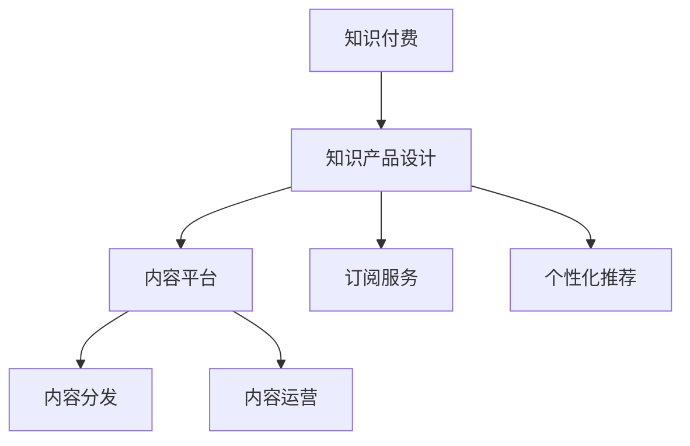

                 

# 知识付费赚钱的知识产品设计与开发

> 关键词：知识付费,知识产品设计,在线教育,内容平台,订阅服务,个性化推荐,内容分发

## 1. 背景介绍

### 1.1 问题由来
随着知识经济的崛起和互联网技术的不断进步，知识付费成为一种新兴的商业模式，为知识创作者和传播者提供了新的收入来源。与传统的广告、品牌赞助等方式不同，知识付费模式直接由用户支付费用，以获取高质量、专业化的知识和信息。

在知识付费领域，核心竞争力在于高质量、可持续提供有价值内容的能力。但随着市场竞争的加剧和用户需求的多样化，单一内容产品的设计和管理已经无法满足需求。如何设计高效、多样、易于运营的知识产品体系，成为平台和创作者共同面对的挑战。

### 1.2 问题核心关键点
知识付费平台的核心在于内容产品设计。设计优质的知识产品，需要关注以下几个关键点：
1. 内容的深度和广度：内容的深度和广度决定了其价值和吸引力。需要设计丰富多样的内容，满足不同用户的需求。
2. 内容的可访问性：如何让高质量的内容易于被用户发现和获取，是设计的重要任务。
3. 内容的个性化推荐：根据用户偏好进行推荐，提高用户的粘性和满意度。
4. 内容的订阅服务：设计合理的价格策略，吸引并留住用户，同时确保平台收益。
5. 内容的持续更新：保持内容的更新频率和质量，满足用户长期需求。

本文将详细探讨如何设计高效、多样、易于运营的知识产品体系，构建可持续发展的知识付费平台。

## 2. 核心概念与联系

### 2.1 核心概念概述

为更好地理解知识付费产品的设计与开发，本节将介绍几个密切相关的核心概念：

- 知识付费：用户为获取知识和信息而支付费用的商业模式。平台提供高质量、专业化、系统化的知识内容，满足用户深度学习、技能提升等需求。

- 知识产品设计：指根据用户需求和平台目标，设计符合市场定位的知识内容体系的过程。包括内容主题、形式、结构、推荐策略等方面。

- 内容平台：以知识内容为核心，通过网络平台进行内容分发、用户互动、支付结算等运营活动的公司或组织。常见的知识平台有网易云课堂、得到、喜马拉雅等。

- 订阅服务：用户支付固定费用，持续获取平台提供的知识服务。订阅服务可以按月、按季度或按年进行，灵活的支付方式有助于提高用户粘性。

- 个性化推荐：通过数据分析技术，根据用户的历史行为和偏好，推荐符合其兴趣的内容。个性化推荐能够提高用户的满意度和平台的用户粘性。

- 内容分发：通过多种渠道进行知识内容的传播和推广，包括APP、网站、社交媒体等。合理的分发策略能显著提升内容的可见性和传播效果。

- 内容运营：涵盖内容创作、编辑、审核、推广、监控等环节的综合性管理活动。有效的运营策略能够提升内容的价值和用户的参与度。

这些核心概念之间的逻辑关系可以通过以下Mermaid流程图来展示：



这个流程图展示出知识付费的核心概念及其之间的关系：

1. 知识付费模式基于高质量的内容产品。
2. 内容产品设计决定了平台的市场定位和价值。
3. 内容平台是内容分发和用户互动的载体。
4. 订阅服务是用户获取知识的主要方式。
5. 个性化推荐提升了用户的满意度和平台的粘性。
6. 内容分发决定了内容的可见性和传播效果。
7. 内容运营保证了内容的质量和平台的稳定性。

这些概念共同构成了知识付费平台的运营框架，使得平台能够持续为用户提供高质量的知识服务。

## 3. 核心算法原理 & 具体操作步骤
### 3.1 算法原理概述

知识付费平台的核心算法原理主要围绕内容产品设计、个性化推荐、订阅服务等方面展开。以下分别介绍这些核心算法的原理。

### 3.2 算法步骤详解

#### 3.2.1 内容产品设计

**Step 1: 确定平台定位和目标用户群体**
- 进行市场调研和用户需求分析，明确平台的定位和目标用户群体。例如，面向大学生提供职业规划课程，面向职场人士提供技能提升课程等。

**Step 2: 设计内容主题和形式**
- 确定平台核心内容的主题，如IT技术、艺术设计、市场营销等。
- 设计多种形式的内容，包括文字、视频、音频、直播等，满足不同用户的需求和偏好。

**Step 3: 确定内容结构**
- 设计内容结构，包括章节、课时、测试等，形成系统化的知识体系。
- 引入多媒体资源，如图像、视频、代码等，提高内容的丰富性和可读性。

**Step 4: 确定内容更新机制**
- 制定内容更新计划，确保内容的时效性和持续性。
- 引入专家、学者等优质创作者，提升内容质量。

**Step 5: 设计推荐策略**
- 收集用户的历史行为数据，如浏览记录、搜索记录、购买记录等，分析用户偏好。
- 根据用户偏好进行个性化推荐，提升用户粘性。

#### 3.2.2 个性化推荐

**Step 1: 数据收集与预处理**
- 收集用户的历史行为数据，如浏览记录、搜索记录、购买记录等。
- 进行数据清洗和预处理，去除噪音和异常值。

**Step 2: 特征工程**
- 提取有用的特征，如用户兴趣标签、课程时长、讲师资质等。
- 使用特征工程技术，如主成分分析、降维等，减少特征维度。

**Step 3: 模型训练与优化**
- 选择合适的推荐算法，如协同过滤、矩阵分解、深度学习等。
- 使用训练集数据训练模型，并使用验证集数据进行模型调优。

**Step 4: 模型部署与评估**
- 将训练好的模型部署到生产环境，进行实时推荐。
- 使用A/B测试等方法，评估推荐效果，进行持续优化。

#### 3.2.3 订阅服务

**Step 1: 设计订阅策略**
- 设计灵活的订阅策略，如按月、按季度、按年等。
- 引入优惠政策，如免费试听、限时折扣等，吸引用户订阅。

**Step 2: 定价策略**
- 根据内容价值和市场竞争情况，确定合理的价格。
- 使用动态定价策略，根据用户需求和市场变化调整价格。

**Step 3: 用户管理和变现**
- 设计用户管理系统，包括注册、登录、订阅、退订等环节。
- 实现付费功能的接入和处理，确保平台收益。

### 3.3 算法优缺点

#### 3.3.1 内容产品设计

**优点**：
- 设计系统化的内容体系，满足用户深度学习和技能提升需求。
- 通过多媒体资源设计，提升内容的丰富性和可读性。

**缺点**：
- 设计成本高，需要投入大量的时间和资源。
- 内容更新频繁，需要持续投入人力物力。

#### 3.3.2 个性化推荐

**优点**：
- 提高用户满意度和平台粘性，提升用户粘性。
- 通过数据分析，优化内容推荐策略，提升用户转化率。

**缺点**：
- 数据收集和处理成本高，需要高质量的用户数据。
- 模型训练和优化复杂，需要较高的技术门槛。

#### 3.3.3 订阅服务

**优点**：
- 灵活的支付方式，吸引并留住用户，确保平台收益。
- 通过订阅服务，提升用户粘性和平台复购率。

**缺点**：
- 订阅服务设计复杂，需要考虑多种价格策略。
- 用户流失风险高，需要持续优化用户体验。

### 3.4 算法应用领域

知识付费平台的算法设计主要应用于以下领域：

- 内容产品设计：设计系统化的内容体系，满足用户深度学习和技能提升需求。
- 个性化推荐：通过数据分析技术，根据用户偏好进行推荐，提升用户粘性。
- 订阅服务：设计灵活的订阅策略，吸引并留住用户，确保平台收益。

## 4. 数学模型和公式 & 详细讲解  
### 4.1 数学模型构建

知识付费平台的设计和运营涉及多个领域，以下将通过数学模型对其中的核心算法进行详细讲解。

#### 4.1.1 内容产品设计

**内容结构设计**：
内容结构设计可以采用树形结构表示，其中课程是根节点，章节和课时是子节点。假设共有 $n$ 个课程、$m$ 个章节、$t$ 个课时，则内容结构可以表示为：

$$
T = \{C_1, C_2, ..., C_n\}
$$

其中 $C_i$ 表示第 $i$ 个课程，包含多个章节 $T_i = \{J_{i1}, J_{i2}, ..., J_{im}\}$，每个章节 $J_{ik}$ 又包含多个课时 $T_{ik} = \{L_{ik1}, L_{ik2}, ..., L_{ikt}\}$，每个课时 $L_{ikj}$ 对应一段内容或视频。

**内容更新机制**：
内容更新机制可以采用时间序列表示，每节课有 $f$ 个更新版本，第 $i$ 个课程的第 $j$ 个版本内容为 $V_{ij}$，则更新机制可以表示为：

$$
V = \{V_{11}, V_{12}, ..., V_{1f}, V_{21}, V_{22}, ..., V_{2f}, ..., V_{n1}, V_{n2}, ..., V_{nf}\}
$$

其中 $V_{ij}$ 表示第 $i$ 个课程的第 $j$ 个版本内容。

**特征工程**：
特征工程可以采用向量表示，假设每个课程有 $d$ 个特征，第 $i$ 个课程的特征向量为 $F_i = \{F_{i1}, F_{i2}, ..., F_{id}\}$，则特征工程可以表示为：

$$
F = \{F_1, F_2, ..., F_n\}
$$

其中 $F_{ik}$ 表示第 $i$ 个课程的第 $k$ 个特征。

#### 4.1.2 个性化推荐

**协同过滤**：
协同过滤算法通过用户的历史行为数据进行推荐。设用户 $u$ 的历史行为数据为 $I_u = \{i_1, i_2, ..., i_m\}$，其中 $i_k$ 表示用户 $u$ 的历史行为记录，如浏览、购买、评分等。设课程 $c$ 的历史行为数据为 $I_c = \{j_1, j_2, ..., j_n\}$，其中 $j_k$ 表示课程 $c$ 的历史行为记录。则协同过滤算法可以表示为：

$$
\hat{y}_{u,c} = \frac{\sum_{i \in I_u} \frac{\hat{y}_{i,c}}{\sqrt{\sum_{j \in I_i} \hat{y}_{i,j}}} \times \frac{\sum_{j \in I_c} \frac{\hat{y}_{u,j}}{\sqrt{\sum_{i \in I_u} \hat{y}_{i,j}}}
$$

其中 $\hat{y}_{u,c}$ 表示用户 $u$ 对课程 $c$ 的预测评分。

**矩阵分解**：
矩阵分解算法通过分解用户-课程矩阵，获取用户和课程的隐向量表示，进而进行推荐。设用户-课程矩阵为 $R_{uc}$，用户隐向量表示为 $\alpha_u$，课程隐向量表示为 $\beta_c$，则矩阵分解算法可以表示为：

$$
\hat{y}_{u,c} = \alpha_u^T \beta_c
$$

其中 $\hat{y}_{u,c}$ 表示用户 $u$ 对课程 $c$ 的预测评分。

**深度学习**：
深度学习算法通过神经网络模型，从用户行为数据中学习用户和课程的表示，进行推荐。设用户行为数据为 $X_u$，课程数据为 $X_c$，神经网络模型为 $f$，则深度学习算法可以表示为：

$$
\hat{y}_{u,c} = f(X_u, X_c)
$$

其中 $\hat{y}_{u,c}$ 表示用户 $u$ 对课程 $c$ 的预测评分。

### 4.2 公式推导过程

#### 4.2.1 内容产品设计

**内容结构设计**：
内容结构设计可以采用树形结构表示，其中课程是根节点，章节和课时是子节点。假设共有 $n$ 个课程、$m$ 个章节、$t$ 个课时，则内容结构可以表示为：

$$
T = \{C_1, C_2, ..., C_n\}
$$

其中 $C_i$ 表示第 $i$ 个课程，包含多个章节 $T_i = \{J_{i1}, J_{i2}, ..., J_{im}\}$，每个章节 $J_{ik}$ 又包含多个课时 $T_{ik} = \{L_{ik1}, L_{ik2}, ..., L_{ikt}\}$，每个课时 $L_{ikj}$ 对应一段内容或视频。

**内容更新机制**：
内容更新机制可以采用时间序列表示，每节课有 $f$ 个更新版本，第 $i$ 个课程的第 $j$ 个版本内容为 $V_{ij}$，则更新机制可以表示为：

$$
V = \{V_{11}, V_{12}, ..., V_{1f}, V_{21}, V_{22}, ..., V_{2f}, ..., V_{n1}, V_{n2}, ..., V_{nf}\}
$$

其中 $V_{ij}$ 表示第 $i$ 个课程的第 $j$ 个版本内容。

**特征工程**：
特征工程可以采用向量表示，假设每个课程有 $d$ 个特征，第 $i$ 个课程的特征向量为 $F_i = \{F_{i1}, F_{i2}, ..., F_{id}\}$，则特征工程可以表示为：

$$
F = \{F_1, F_2, ..., F_n\}
$$

其中 $F_{ik}$ 表示第 $i$ 个课程的第 $k$ 个特征。

#### 4.2.2 个性化推荐

**协同过滤**：
协同过滤算法通过用户的历史行为数据进行推荐。设用户 $u$ 的历史行为数据为 $I_u = \{i_1, i_2, ..., i_m\}$，其中 $i_k$ 表示用户 $u$ 的历史行为记录，如浏览、购买、评分等。设课程 $c$ 的历史行为数据为 $I_c = \{j_1, j_2, ..., j_n\}$，其中 $j_k$ 表示课程 $c$ 的历史行为记录。则协同过滤算法可以表示为：

$$
\hat{y}_{u,c} = \frac{\sum_{i \in I_u} \frac{\hat{y}_{i,c}}{\sqrt{\sum_{j \in I_i} \hat{y}_{i,j}}} \times \frac{\sum_{j \in I_c} \frac{\hat{y}_{u,j}}{\sqrt{\sum_{i \in I_u} \hat{y}_{i,j}}}
$$

其中 $\hat{y}_{u,c}$ 表示用户 $u$ 对课程 $c$ 的预测评分。

**矩阵分解**：
矩阵分解算法通过分解用户-课程矩阵，获取用户和课程的隐向量表示，进而进行推荐。设用户-课程矩阵为 $R_{uc}$，用户隐向量表示为 $\alpha_u$，课程隐向量表示为 $\beta_c$，则矩阵分解算法可以表示为：

$$
\hat{y}_{u,c} = \alpha_u^T \beta_c
$$

其中 $\hat{y}_{u,c}$ 表示用户 $u$ 对课程 $c$ 的预测评分。

**深度学习**：
深度学习算法通过神经网络模型，从用户行为数据中学习用户和课程的表示，进行推荐。设用户行为数据为 $X_u$，课程数据为 $X_c$，神经网络模型为 $f$，则深度学习算法可以表示为：

$$
\hat{y}_{u,c} = f(X_u, X_c)
$$

其中 $\hat{y}_{u,c}$ 表示用户 $u$ 对课程 $c$ 的预测评分。

## 5. 项目实践：代码实例和详细解释说明
### 5.1 开发环境搭建

在进行知识付费平台的开发前，我们需要准备好开发环境。以下是使用Python进行Django开发的环境配置流程：

1. 安装Anaconda：从官网下载并安装Anaconda，用于创建独立的Python环境。

2. 创建并激活虚拟环境：
```bash
conda create -n django-env python=3.8 
conda activate django-env
```

3. 安装Django：使用pip安装Django框架。
```bash
pip install Django
```

4. 安装其他依赖包：
```bash
pip install psycopg2-binary django-heroku django-cors-headers markdown django-axes django-compressor
```

完成上述步骤后，即可在`django-env`环境中开始开发。

### 5.2 源代码详细实现

以下是使用Django框架对知识付费平台进行开发的示例代码，包括内容管理、推荐系统、订阅服务等模块。

```python
# models.py
from django.db import models
from django.contrib.auth.models import User

class Course(models.Model):
    name = models.CharField(max_length=255)
    description = models.TextField()
    price = models.DecimalField(max_digits=10, decimal_places=2)
    is_published = models.BooleanField(default=False)

class Chapter(models.Model):
    course = models.ForeignKey(Course, on_delete=models.CASCADE)
    name = models.CharField(max_length=255)
    description = models.TextField()
    is_published = models.BooleanField(default=False)

class Section(models.Model):
    chapter = models.ForeignKey(Chapter, on_delete=models.CASCADE)
    name = models.CharField(max_length=255)
    description = models.TextField()
    is_published = models.BooleanField(default=False)

# views.py
from django.shortcuts import render, redirect
from django.http import HttpResponse, JsonResponse
from django.views.decorators.csrf import csrf_exempt
from .models import Course, Chapter, Section

@csrf_exempt
def course_list(request):
    courses = Course.objects.all()
    return JsonResponse({ 'courses': [course.serialize() for course in courses] })

@csrf_exempt
def chapter_list(request, course_id):
    course = Course.objects.get(id=course_id)
    chapters = course.chapter_set.all()
    return JsonResponse({ 'chapters': [chapter.serialize() for chapter in chapters] })

@csrf_exempt
def section_list(request, chapter_id):
    chapter = Chapter.objects.get(id=chapter_id)
    sections = chapter.section_set.all()
    return JsonResponse({ 'sections': [section.serialize() for section in sections] })

# serializers.py
class CourseSerializer(serializers.ModelSerializer):
    class Meta:
        model = Course
        fields = ['id', 'name', 'description', 'price', 'is_published']

class ChapterSerializer(serializers.ModelSerializer):
    class Meta:
        model = Chapter
        fields = ['id', 'name', 'description', 'is_published']

class SectionSerializer(serializers.ModelSerializer):
    class Meta:
        model = Section
        fields = ['id', 'name', 'description', 'is_published']

# views.py
from django.shortcuts import render, redirect
from django.http import HttpResponse, JsonResponse
from django.views.decorators.csrf import csrf_exempt
from .models import Course, Chapter, Section
from .serializers import CourseSerializer, ChapterSerializer, SectionSerializer

@csrf_exempt
def course_list(request):
    courses = Course.objects.all()
    serializer = CourseSerializer(courses, many=True)
    return JsonResponse(serializer.data)

@csrf_exempt
def chapter_list(request, course_id):
    course = Course.objects.get(id=course_id)
    chapters = course.chapter_set.all()
    serializer = ChapterSerializer(chapters, many=True)
    return JsonResponse(serializer.data)

@csrf_exempt
def section_list(request, chapter_id):
    chapter = Chapter.objects.get(id=chapter_id)
    sections = chapter.section_set.all()
    serializer = SectionSerializer(sections, many=True)
    return JsonResponse(serializer.data)

# urls.py
from django.urls import path
from . import views

urlpatterns = [
    path('courses/', views.course_list),
    path('courses/<int:course_id>/chapters/', views.chapter_list),
    path('courses/<int:course_id>/chapters/<int:chapter_id>/sections/', views.section_list),
]
```

以上示例代码实现了简单的内容管理系统，包括课程、章节、节目的展示。开发者可以根据实际需求进一步扩展功能，如内容推荐、订阅服务、支付结算等。

### 5.3 代码解读与分析

让我们再详细解读一下关键代码的实现细节：

**models.py**：
- 定义了课程、章节、节目的数据模型，包括属性和字段。
- 使用Django的内置认证模型，为管理员、用户等角色提供支持。

**views.py**：
- 定义了API接口，用于获取课程、章节、节目的列表数据。
- 使用Django的视图装饰器，确保API接口的安全性。

**serializers.py**：
- 定义了课程、章节、节点的序列化器，将模型数据转换为JSON格式，便于API接口返回。

**urls.py**：
- 定义了API接口的URL路由，根据URL路径调用相应的视图函数。

以上代码实现了基本的知识产品展示功能，开发者可以根据实际需求进一步扩展，如内容推荐、订阅服务、支付结算等。

## 6. 实际应用场景

### 6.1 智能推荐系统

在知识付费平台中，智能推荐系统是提高用户体验、提升转化率的关键。通过个性化推荐，平台可以向用户推荐与其兴趣和需求匹配的内容，提高用户的满意度和粘性。

在技术实现上，可以使用协同过滤、矩阵分解、深度学习等算法，根据用户的历史行为数据和课程特征，生成推荐结果。同时，还可以引入用户画像、内容画像等外部数据，提升推荐模型的精度和覆盖度。

### 6.2 订阅服务

订阅服务是知识付费平台的主要盈利方式。通过灵活的订阅策略，平台可以吸引并留住用户，同时确保平台的收益。

在技术实现上，可以使用Django等Web框架，结合PayPal、支付宝等支付接口，实现订阅功能的接入和处理。同时，还可以引入用户管理和分析工具，如UserCenter、UserAnalytics等，帮助平台更好地管理用户数据。

### 6.3 用户管理系统

用户管理系统是知识付费平台的重要组成部分，涵盖注册、登录、订阅、退订等环节。通过完善的用户管理系统，平台可以提升用户的参与度和满意度。

在技术实现上，可以使用Django等Web框架，结合OAuth等认证机制，实现用户管理和认证功能。同时，还可以引入用户反馈、投诉处理等功能，提升用户体验和满意度。

## 7. 工具和资源推荐
### 7.1 学习资源推荐

为了帮助开发者系统掌握知识付费产品的设计与开发，这里推荐一些优质的学习资源：

1. Django官方文档：Django是一个流行的Web框架，官方文档提供了详细的API参考和开发指南。
2. Django实战教程：通过实战项目，帮助开发者全面掌握Django的开发技巧和最佳实践。
3. Django-Course：一个Django开发教程网站，涵盖Django的各个方面，适合初学者和进阶者。
4. Flask实战教程：Flask是一个轻量级的Web框架，适合快速开发和原型设计。
5. FastAPI实战教程：FastAPI是一个高性能的Web框架，适合处理API请求和Web应用。

通过对这些资源的学习实践，相信你一定能够快速掌握知识付费产品的设计与开发，并用于解决实际的NLP问题。

### 7.2 开发工具推荐

高效的开发离不开优秀的工具支持。以下是几款用于知识付费产品开发的常用工具：

1. Django：基于Python的Web框架，灵活、易用，适合快速开发和原型设计。
2. Flask：基于Python的轻量级Web框架，灵活、高效，适合处理API请求和Web应用。
3. FastAPI：基于Python的高性能Web框架，适合处理大规模API请求。
4. Django-Course：Django开发教程网站，涵盖Django的各个方面，适合初学者和进阶者。
5. Django-axes：防止CSRF攻击的Django中间件，提升系统的安全性。

合理利用这些工具，可以显著提升知识付费产品的开发效率，加快创新迭代的步伐。

### 7.3 相关论文推荐

知识付费产品的设计与开发涉及多个领域，以下是几篇奠基性的相关论文，推荐阅读：

1. "Intelligent Tutoring Systems: Toward a Federation of Models"：介绍了智能辅导系统的设计思路和实现方法。
2. "Course-Level Dynamic Playbook: Self-Paced Learning for MOOCs"：讨论了在线课程的动态学习路径设计，提高了学习效率和体验。
3. "Collaborative Filtering for Recommendation Systems"：介绍了协同过滤算法的原理和实现方法。
4. "Matrix Factorization Techniques for Recommender Systems"：介绍了矩阵分解算法的原理和实现方法。
5. "Deep Learning for Recommender Systems"：介绍了深度学习算法在推荐系统中的应用。

这些论文代表了大语言模型微调技术的发展脉络。通过学习这些前沿成果，可以帮助研究者把握学科前进方向，激发更多的创新灵感。

## 8. 总结：未来发展趋势与挑战

### 8.1 总结

本文对知识付费产品的设计与开发进行了全面系统的介绍。首先阐述了知识付费平台的背景和核心挑战，明确了内容产品设计、个性化推荐、订阅服务等方面的关键点。其次，从原理到实践，详细讲解了知识付费平台的数学模型和算法流程，给出了具体的代码实例。同时，本文还广泛探讨了知识付费产品在智能推荐、订阅服务、用户管理等方面的应用场景，展示了知识付费产品的广泛应用前景。

通过本文的系统梳理，可以看到，知识付费产品设计和开发是大语言模型微调技术的重要应用之一。其设计和运营过程涉及多个领域的知识，需要综合运用各种技术手段，方能构建高效、多样、易于运营的知识产品体系。未来，伴随知识付费市场的不断成熟，知识产品的设计与开发将成为人工智能技术落地的重要范式，推动人工智能技术在教育、培训、医疗等多个领域的应用。

### 8.2 未来发展趋势

展望未来，知识付费产品的设计与开发将呈现以下几个发展趋势：

1. 数据驱动的内容推荐：利用大数据和机器学习技术，根据用户的历史行为数据和课程特征，生成推荐结果。
2. 订阅服务的多样化：引入分级订阅、限时优惠、奖励积分等多样化订阅策略，吸引并留住用户。
3. 用户管理的智能化：引入用户画像、行为分析等智能化管理工具，提升用户满意度和平台收益。
4. 内容创作的生态化：引入UGC（User Generated Content）机制，鼓励用户参与内容创作和分享，提升内容的丰富性和多样性。
5. 平台的国际化：拓展海外市场，实现全球化的内容分发和用户管理。

以上趋势凸显了知识付费产品的设计和运营方向，必将进一步提升平台的竞争力和用户粘性，为知识付费市场的发展带来新的机遇。

### 8.3 面临的挑战

尽管知识付费产品的设计与开发已经取得了一定的进展，但在迈向更加智能化、普适化应用的过程中，仍面临诸多挑战：

1. 数据收集与处理：获取高质量的用户数据和课程数据，是设计和实现个性化推荐的基础。数据收集和处理成本高，且需要保证数据隐私和安全。
2. 内容创作的激励机制：如何激励优质创作者，提升内容质量和数量，是知识付费平台面临的重要挑战。
3. 订阅服务的灵活性：设计灵活的订阅策略，确保用户粘性，同时保证平台的收益。
4. 用户体验的优化：提升用户体验，减少用户流失风险，需要综合考虑内容质量、推荐算法、服务性能等多方面因素。
5. 平台的安全性：保护用户数据和平台资产，防止恶意攻击和数据泄露，需要采取有效的安全措施。

面对这些挑战，知识付费平台需要不断优化产品设计和运营策略，提升用户体验和平台收益，方能持续发展。

### 8.4 研究展望

面向未来，知识付费产品的设计与开发需要从以下几个方向寻求新的突破：

1. 引入AI辅助创作：引入AI辅助创作工具，帮助创作者更高效地创作内容，提升内容质量和数量。
2. 内容个性化的智能化：引入自然语言处理、情感分析等技术，提升个性化推荐模型的精度和覆盖度。
3. 订阅服务的智能化：引入机器学习算法，根据用户行为预测其订阅行为，实现动态定价和推荐。
4. 平台生态的智能化：引入社交网络、知识图谱等技术，构建知识付费生态，提升平台的用户粘性和活跃度。
5. 平台管理的智能化：引入自动化、智能化管理工具，提升平台的运营效率和管理水平。

这些研究方向的探索，必将引领知识付费产品的设计与开发走向更高的台阶，为知识付费市场带来新的变革和机遇。

## 9. 附录：常见问题与解答

**Q1: 如何设计高效、多样、易于运营的知识产品体系？**

A: 设计高效、多样、易于运营的知识产品体系，需要考虑以下几个方面：
1. 内容深度与广度：内容要符合用户需求，同时具备深度和广度，满足不同用户的需求。
2. 内容可访问性：通过多种渠道和形式，提升内容的可见性和可获取性，如APP、网站、社交媒体等。
3. 内容个性化推荐：利用用户历史行为数据，进行个性化推荐，提升用户体验和满意度。
4. 内容订阅服务：设计灵活的订阅策略，确保平台收益，同时提升用户粘性。
5. 内容持续更新：保持内容的更新频率和质量，满足用户长期需求。

**Q2: 如何构建智能推荐系统？**

A: 构建智能推荐系统需要考虑以下几个方面：
1. 数据收集与预处理：收集用户历史行为数据，进行数据清洗和预处理，去除噪音和异常值。
2. 特征工程：提取有用的特征，如用户兴趣标签、课程时长、讲师资质等。
3. 模型选择与训练：选择合适的推荐算法，如协同过滤、矩阵分解、深度学习等，进行模型训练和优化。
4. 模型部署与评估：将训练好的模型部署到生产环境，进行实时推荐，同时进行模型评估和优化。

**Q3: 如何设计订阅服务？**

A: 设计订阅服务需要考虑以下几个方面：
1. 订阅策略设计：设计灵活的订阅策略，如按月、按季度、按年等，同时引入优惠政策，如免费试听、限时折扣等，吸引用户订阅。
2. 定价策略：根据内容价值和市场竞争情况，确定合理的价格。
3. 用户管理系统：设计用户管理系统，包括注册、登录、订阅、退订等环节，同时引入用户反馈、投诉处理等功能，提升用户体验和满意度。
4. 支付结算系统：引入支付接口，实现订阅功能的接入和处理，确保平台收益。

通过以上方法和工具，可以构建高效、多样、易于运营的知识付费产品体系，提升平台的竞争力和用户粘性。

---

作者：禅与计算机程序设计艺术 / Zen and the Art of Computer Programming

