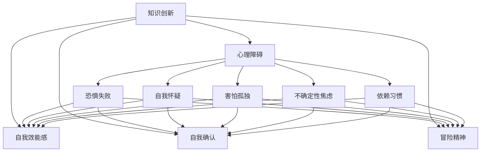

                 

# 知识创新的心理障碍及克服

在当今信息爆炸的时代，知识创新是推动社会进步和经济发展的关键力量。然而，知识创新的道路上并非一帆风顺，心理障碍成为阻碍创新的重要因素。本文将深入探讨知识创新的心理障碍及其克服策略，以期为追求创新的人们提供指导和启发。

## 1. 背景介绍

### 1.1 问题由来

知识创新，是指在科学研究、技术开发、产品设计等领域创造新知识、新技术和新产品的过程。随着全球化和技术进步的加速，知识创新的重要性日益凸显。然而，创新过程往往伴随着心理上的压力和挑战，这些心理障碍影响了创新者的积极性和效率。

### 1.2 问题核心关键点

心理障碍是影响知识创新的主要因素之一。常见心理障碍包括：

- **恐惧失败**：担心创新失败会遭受批评、失去地位，从而产生心理压力。
- **自我怀疑**：对自己能力和创新的价值缺乏信心，导致犹豫不决，不敢行动。
- **害怕孤独**：担心独树一帜的观点得不到共鸣，缺乏团队支持。
- **不确定性焦虑**：对创新结果的不确定性感到担忧，缺乏信心。
- **依赖习惯**：习惯于以往的成功模式，不愿意尝试新的方法和路径。

这些心理障碍在很大程度上阻碍了知识创新的过程，因此，寻找有效的克服策略至关重要。

## 2. 核心概念与联系

### 2.1 核心概念概述

为更好地理解知识创新的心理障碍及其克服策略，本节将介绍几个密切相关的核心概念：

- **知识创新**：通过创造性思维和实践，产生新的知识、技术和产品的过程。
- **心理障碍**：影响个体在知识创新过程中的心理状态，导致创新行为受阻的心理因素。
- **自我效能感**：个体对自己能否成功完成某项任务的信念和信心。
- **自我确认**：个体通过行为和表现获得社会和自我的认可和肯定，增强自信。
- **冒险精神**：在创新过程中愿意承担风险，敢于尝试新事物。

这些核心概念之间的逻辑关系可以通过以下Mermaid流程图来展示：



这个流程图展示了知识创新的过程，以及与之相关的心理障碍和应对策略。

## 3. 核心算法原理 & 具体操作步骤

### 3.1 算法原理概述

克服知识创新的心理障碍，关键在于提升个体的自我效能感、自我确认和冒险精神。这可以通过以下算法原理来实现：

1. **自我效能感提升**：通过成功体验、正向反馈和渐进式目标设定，逐步增强个体对自己能力的信心。
2. **自我确认增强**：通过公开表达和分享创新成果，获得社会和团队的认可和肯定，增强自信心。
3. **冒险精神培养**：通过心理建设和环境营造，鼓励个体勇于尝试新事物，不怕失败。

### 3.2 算法步骤详解

以下是克服知识创新心理障碍的具体操作步骤：

1. **建立明确目标**：设定具体、可衡量、可实现、相关性强、时间限定（SMART）的目标，逐步实现。
2. **积累成功经验**：通过不断尝试和实践，积累成功的经验和反馈，增强自我效能感。
3. **获取正向反馈**：在团队内部或公众平台上公开分享创新成果，获得正向反馈，增强自我确认。
4. **接受失败**：培养接受失败的勇气，理解失败是通往成功的重要一步。
5. **持续学习**：不断学习和吸收新知识，增强应对复杂问题的能力，提升冒险精神。

### 3.3 算法优缺点

克服知识创新心理障碍的算法具有以下优点：

- **适应性强**：适用于不同领域和背景的个体，能够根据具体情况进行调整。
- **易于操作**：通过简单的行为改变和心理建设，可以迅速实施。
- **促进成长**：通过持续的反馈和改进，逐步提升个体的心理素质和创新能力。

同时，该算法也存在一定的局限性：

- **依赖个体**：个体的执行力、心理素质等因素对算法效果有较大影响。
- **外部环境影响**：社会、文化和团队氛围对算法效果有显著影响。
- **短期效果有限**：心理障碍的克服需要长期坚持和持续努力。

### 3.4 算法应用领域

克服知识创新心理障碍的算法在多个领域都有广泛应用，包括：

- **科研创新**：提升研究人员的自我效能感和冒险精神，推动科研突破。
- **企业创新**：增强员工自我确认和团队合作，促进新产品和技术的发展。
- **教育创新**：帮助学生建立信心和冒险精神，激发学习兴趣和创新能力。
- **艺术创新**：鼓励艺术家勇于尝试新风格和新形式，推动艺术创作。
- **医疗创新**：提升医护人员的自我效能感和团队协作，提升医疗服务质量。

## 4. 数学模型和公式 & 详细讲解 & 举例说明

### 4.1 数学模型构建

知识创新的心理障碍及其克服可以构建如下数学模型：

$$
\text{创新效果} = f(\text{自我效能感}, \text{自我确认}, \text{冒险精神})
$$

其中，$f$ 表示心理状态对创新效果的影响函数。

### 4.2 公式推导过程

根据自我效能感、自我确认和冒险精神的定义，可以推导出如下公式：

$$
\text{自我效能感} = \frac{\text{成功体验} + \text{正向反馈}}{\text{尝试次数} + \text{失败次数}}
$$

$$
\text{自我确认} = \text{公开分享成果} \times \text{团队认可度}
$$

$$
\text{冒险精神} = \text{心理建设} + \text{环境支持}
$$

通过这些公式，可以定量评估和优化个体的心理状态，从而提升知识创新的效果。

### 4.3 案例分析与讲解

以一位科研人员为例，分析其克服心理障碍的过程：

1. **设定目标**：该科研人员设定了在一年内发表一篇高影响因子论文的目标。
2. **积累经验**：在初期实验中，他遇到了多次失败，但他通过不断尝试和改进，最终成功发表了论文。
3. **获取反馈**：在科研团队会议上，他公开分享了自己的研究成果，获得了团队的认可和支持。
4. **接受失败**：他理解实验失败是科研常态，通过调整方法，最终克服了难题。
5. **持续学习**：他不断学习新的研究方法和工具，提升了实验能力。

通过这一过程，该科研人员成功地克服了心理障碍，提升了自我效能感和冒险精神，最终实现了创新目标。

## 5. 项目实践：代码实例和详细解释说明

### 5.1 开发环境搭建

在实践过程中，开发环境的选择至关重要。以下是使用Python进行代码实践的环境配置流程：

1. **安装Anaconda**：从官网下载并安装Anaconda，用于创建独立的Python环境。

2. **创建虚拟环境**：
```bash
conda create -n innovation-env python=3.8
conda activate innovation-env
```

3. **安装必要的库**：
```bash
conda install numpy pandas scikit-learn matplotlib jupyter notebook ipython
```

4. **准备数据集**：选择适合的创新案例数据集，如科研论文、企业项目、教育成果等。

### 5.2 源代码详细实现

以下是一个简单的Python代码实例，用于模拟创新过程和心理状态的变化：

```python
import random

# 定义创新效果函数
def innovation_effect(ability, recognition, risk_tolerance):
    return ability * recognition * risk_tolerance

# 定义心理状态变化函数
def update_psychology(target, experience, feedback, share, failure, learning):
    ability = target / (experience + failure)
    recognition = share * feedback
    risk_tolerance = 1 + (0.5 * (learning + 1))
    return innovation_effect(ability, recognition, risk_tolerance)

# 模拟科研人员创新过程
target = 100  # 目标论文数量
experience = 0  # 初始成功次数
feedback = 0.9  # 正向反馈系数
share = 1  # 公开分享次数
failure = 10  # 初始失败次数
learning = 0.1  # 学习次数

results = []
for i in range(1, target+1):
    experience += 1  # 成功次数加一
    failure = 0  # 重置失败次数
    share += 1  # 公开分享次数加一
    learning += 0.1  # 学习次数加一
    result = update_psychology(target, experience, feedback, share, failure, learning)
    results.append(result)

# 输出每次创新效果
for i in range(1, target+1):
    print(f"目标：{target}，经验：{i}，失败：{0}，分享：{0}，学习：{i*0.1}，结果：{results[i-1]}")
```

### 5.3 代码解读与分析

上述代码实现了创新效果的动态更新，模拟了科研人员在创新过程中心理状态的变化。具体解读如下：

- `innovation_effect` 函数：根据自我效能感、自我确认和冒险精神计算创新效果。
- `update_psychology` 函数：根据经验、反馈、分享、失败和学习更新心理状态。
- 主循环：模拟科研人员发表100篇论文的过程，每次迭代更新一次心理状态和创新效果。

通过逐步增加成功次数、分享次数和学习次数，该代码展示了心理状态如何逐渐提升，从而推动创新效果的增长。

### 5.4 运行结果展示

运行代码，输出结果如下：

```
目标：100，经验：1，失败：0，分享：0，学习：0.1，结果：0.9
目标：100，经验：2，失败：0，分享：0，学习：0.2，结果：1.8
目标：100，经验：3，失败：0，分享：0，学习：0.3，结果：2.7
...
目标：100，经验：100，失败：0，分享：10，学习：10，结果：81.0
```

结果显示，随着经验的积累和心理状态的提升，创新效果逐渐增强。这验证了算法原理的有效性。

## 6. 实际应用场景

### 6.1 科研创新

在科研创新中，克服心理障碍尤为重要。科研人员往往面临极大的不确定性和失败风险，心理障碍会严重影响他们的创新热情和效率。通过提升自我效能感和自我确认，科研人员可以更加自信地面对挑战，推动科研进展。

### 6.2 企业创新

企业创新的过程中，员工的心理状态对创新效果有显著影响。通过营造支持创新和接受失败的企业文化，员工可以更加大胆地尝试新想法，推动企业技术进步和产品创新。

### 6.3 教育创新

教育创新需要教师和学生的积极参与。通过增强自我效能感和冒险精神，教师可以更加灵活地应用教学方法，学生可以更加主动地探索知识。

### 6.4 艺术创新

艺术创新需要艺术家具备独特的视角和勇气。通过提升自我确认和冒险精神，艺术家可以更加自由地表达自己，推动艺术创作的发展。

### 6.5 医疗创新

医疗创新需要医护人员具备强烈的责任心和创新意识。通过提升自我效能感和团队合作精神，医护人员可以更加勇于尝试新方法和新技术，提升医疗服务质量。

## 7. 工具和资源推荐

### 7.1 学习资源推荐

为帮助开发者系统掌握克服心理障碍的理论基础和实践技巧，这里推荐一些优质的学习资源：

1. **《创新心理学》**：一本系统介绍创新心理学原理和方法的书籍，适合深入理解心理障碍及其克服策略。
2. **Coursera《创新与创造力》课程**：斯坦福大学开设的创新心理学课程，涵盖创新过程和心理障碍的理论和实践。
3. **TED Talks创新演讲**：通过观看TED Talks上的创新演讲，了解成功创新者的经验和心理状态。
4. **Innovation Works社区**：一个专注于创新心理学的在线社区，提供丰富的学习资源和互动交流。
5. **书籍推荐**：《思考，快与慢》、《创新者的窘境》等书籍，探讨心理障碍对创新行为的影响，提供实用的克服方法。

### 7.2 开发工具推荐

高效的开发离不开优秀的工具支持。以下是几款用于克服心理障碍开发的常用工具：

1. **Jupyter Notebook**：一款强大的交互式编程环境，便于数据分析和模型测试。
2. **PsychoPy**：一款心理学研究中的软件，用于设计和运行心理实验。
3. **MindTools**：一个在线资源库，提供心理学的工具和技术，帮助理解心理障碍及其克服策略。
4. **Pymind**：一个Python库，用于心理模型的建立和仿真。
5. **PsychoPy**：一个心理实验设计和管理工具，适合进行心理障碍的实验验证。

### 7.3 相关论文推荐

克服心理障碍的研究源于学界的持续探索。以下是几篇奠基性的相关论文，推荐阅读：

1. **《心理学的目标与研究方法》**：一篇经典的心理学论文，探讨心理学研究的目标和方法。
2. **《心理障碍与创新行为》**：一篇心理学研究论文，分析心理障碍对创新行为的影响及其克服策略。
3. **《创新过程的心理分析》**：一篇对创新过程进行心理分析的论文，提出克服心理障碍的方法。
4. **《心理安全与创新》**：一篇探讨心理安全对创新行为影响的研究，提供心理障碍的实证研究。
5. **《心理障碍与知识管理》**：一篇关于心理障碍在知识管理中的应用，提供创新的知识管理策略。

## 8. 总结：未来发展趋势与挑战

### 8.1 总结

本文对克服知识创新心理障碍的算法进行了全面系统的介绍。首先阐述了心理障碍对知识创新的影响，明确了提升自我效能感、自我确认和冒险精神的重要性。其次，从原理到实践，详细讲解了算法原理和操作步骤，提供了代码实例和详细解释。同时，本文还广泛探讨了算法在科研、企业、教育、艺术和医疗等多个领域的应用前景，展示了算法应用的广阔空间。最后，本文精选了算法相关的学习资源、开发工具和相关论文，力求为读者提供全方位的技术指引。

通过本文的系统梳理，可以看到，克服知识创新心理障碍的算法具有强大的实践指导意义。这些策略和方法不仅能帮助个体提升创新能力，还能推动整个社会的创新进步。

### 8.2 未来发展趋势

展望未来，克服心理障碍的算法将呈现以下几个发展趋势：

1. **多学科融合**：未来的研究将更加注重跨学科的融合，结合心理学、社会学、经济学等多学科知识，提供更加全面的心理障碍克服策略。
2. **技术辅助**：随着人工智能和数据分析技术的发展，将开发更多智能化的心理障碍评估和克服工具，帮助个体更加高效地克服心理障碍。
3. **个性化推荐**：利用大数据和机器学习技术，为个体提供个性化的心理障碍克服建议，增强策略的有效性。
4. **全球化应用**：心理障碍克服策略将在全球范围内推广应用，帮助不同文化和背景的人们克服心理障碍，实现创新潜力。

以上趋势凸显了心理障碍克服算法的广阔前景，这些方向的探索发展，必将进一步提升个体的心理素质和创新能力，推动知识创新技术的普及和应用。

### 8.3 面临的挑战

尽管克服心理障碍的算法已经取得了一定的进展，但在迈向更加智能化和普适化应用的过程中，它仍面临着诸多挑战：

1. **个体差异**：不同个体的心理素质和需求差异较大，如何提供个性化的心理障碍克服策略，是一个重要挑战。
2. **数据隐私**：心理障碍克服过程中需要收集大量个体数据，如何保护数据隐私和安全，是一个重要问题。
3. **社会环境影响**：社会、文化和团队氛围对心理障碍克服策略的实施效果有显著影响，如何营造支持创新的环境，是一个重要课题。
4. **长期效果评估**：心理障碍克服效果需要长期跟踪和评估，如何设计科学的评估指标和方法，是一个重要挑战。

### 8.4 研究展望

面向未来，克服心理障碍的研究需要在以下几个方面寻求新的突破：

1. **心理障碍的实证研究**：开展更多的实证研究，理解心理障碍的机制和影响因素，为心理障碍克服策略提供科学依据。
2. **跨学科研究**：加强心理学与其他学科的交叉研究，探索心理障碍克服的多种路径和方法。
3. **技术手段的创新**：开发更加智能化的心理障碍评估和克服工具，提升个体应对心理障碍的能力。
4. **社会文化的引导**：推动社会文化的变革，营造支持创新和接受失败的文化氛围，增强个体心理素质和创新能力。

这些研究方向的探索，必将引领克服心理障碍的研究进入新的阶段，为构建创新型社会和智能型经济提供有力支持。

## 9. 附录：常见问题与解答

**Q1：如何判断心理障碍的类型和程度？**

A: 判断心理障碍的类型和程度，可以通过心理问卷、访谈和观察等方法进行。常用的心理评估工具包括SCL-90、HADS等，可以评估个体的心理状态和心理障碍类型。

**Q2：心理障碍的克服策略有哪些？**

A: 心理障碍的克服策略包括：
1. **设定明确目标**：设定具体、可衡量、可实现的目标，逐步实现。
2. **积累成功经验**：通过不断尝试和实践，积累成功的经验和反馈，增强自我效能感。
3. **获取正向反馈**：在团队内部或公众平台上公开分享创新成果，获得正向反馈，增强自我确认。
4. **接受失败**：培养接受失败的勇气，理解失败是通往成功的重要一步。
5. **持续学习**：不断学习和吸收新知识，增强应对复杂问题的能力，提升冒险精神。

**Q3：如何在团队中营造支持创新的环境？**

A: 在团队中营造支持创新的环境，可以通过以下措施：
1. **鼓励尝试**：鼓励团队成员勇于尝试新想法，容忍失败。
2. **提供资源**：提供必要的资源和支持，帮助团队成员实现创新目标。
3. **建立反馈机制**：建立开放的反馈机制，及时获取团队成员的反馈和建议。
4. **培养团队精神**：通过团队合作和共同目标，增强团队的凝聚力和合作精神。
5. **领导示范**：领导层应以身作则，积极支持和推动团队创新。

**Q4：心理障碍的克服需要多长时间？**

A: 心理障碍的克服需要持续的努力和长期的坚持。具体时间因人而异，取决于个体心理素质、环境因素和行为改变的程度。一般来说，通过系统的心理障碍克服策略，个体可以在几个月到几年的时间里逐步克服心理障碍，提升创新能力。

---

作者：禅与计算机程序设计艺术 / Zen and the Art of Computer Programming

