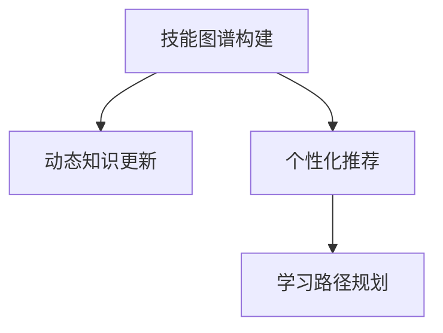
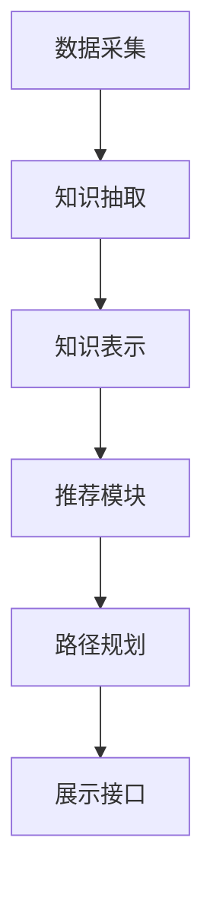
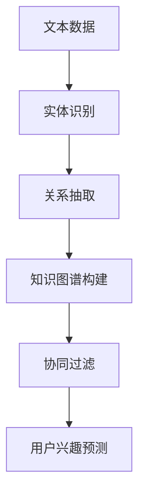

                 

# 知识发现引擎助力程序员技能更新迭代

> 关键词：知识发现引擎, 程序员技能, 技能更新, 迭代, 技术栈管理, 人工智能

## 1. 背景介绍

在快速变化的技术领域中，程序员技能更新迭代的重要性不言而喻。知识发现引擎作为这一过程的重要辅助工具，能够帮助程序员高效地获取和应用最新的技术知识，加速技能提升。本文将深入探讨知识发现引擎的基本原理、核心概念、操作步骤，并结合实际案例进行分析，展现其在日常开发、技术学习和项目管理中的应用。

## 2. 核心概念与联系

### 2.1 核心概念概述

知识发现引擎(Knowledge Discovery Engine, KDE)是指一种利用人工智能、数据挖掘和信息检索技术，自动从大量非结构化数据中提取和呈现知识的工具。在程序员技能更新迭代的过程中，KDE可以用于以下几个方面：

- **技能图谱构建**：通过分析开源项目、技术社区、培训课程等，构建涵盖多方面技术的技能图谱，帮助程序员了解整个技术生态。
- **动态知识更新**：定期监测最新技术动态，更新技能图谱，确保其始终保持最新。
- **个性化推荐**：根据程序员的技术栈和兴趣，提供定制化的学习资源和技能提升建议。
- **学习路径规划**：基于技能图谱和历史学习记录，规划出个性化的学习路径，帮助程序员逐步提升技能。

这些核心概念通过以下Mermaid流程图展示其相互联系：



### 2.2 核心概念原理和架构

知识发现引擎通常包括以下几个关键组件：

- **数据采集模块**：负责从各种来源（如GitHub、Stack Overflow、在线课程平台等）采集相关的技术信息。
- **知识抽取模块**：通过自然语言处理(NLP)、信息检索等技术，从采集到的文本中提取有用的知识片段。
- **知识表示模块**：将抽取的知识表示为结构化格式，如技能图谱、知识库等。
- **推荐模块**：根据用户的兴趣和历史行为，推荐个性化的学习资源和技术栈扩展建议。
- **路径规划模块**：基于用户的技能图谱和推荐，规划出详细的学习路径，提供可视化的学习路线图。

这些组件通过一个统一的知识仓库进行数据整合和查询，最终通过前端接口呈现给用户。以下是一个简单的知识发现引擎架构示意图：



## 3. 核心算法原理 & 具体操作步骤

### 3.1 算法原理概述

知识发现引擎的工作原理可以概括为以下几个步骤：

1. **数据采集**：从技术社区、开源项目、在线教育平台等渠道，收集相关的技术文档、代码库、培训视频等信息。
2. **知识抽取**：利用NLP技术，如实体识别、关系抽取、主题建模等，从文本数据中提取出关键的技术概念、工具库、编程语言等知识元素。
3. **知识表示**：将抽取出的知识元素构建为知识图谱、技能树等结构化表示，方便后续的查询和分析。
4. **推荐算法**：基于用户的兴趣、技能水平和历史行为，通过协同过滤、内容推荐、序列预测等算法，推荐个性化的学习资源和技术栈扩展建议。
5. **路径规划**：基于技能图谱和推荐结果，为用户规划出详细的学习路径，并提供可视化的学习路线图。

### 3.2 算法步骤详解

以下详细介绍知识发现引擎的关键操作步骤：

**Step 1: 数据采集**

数据采集是知识发现引擎的基础，通常采用爬虫技术和API调用等方式，从技术社区、开源项目、在线教育平台等渠道，收集相关的技术文档、代码库、培训视频等信息。例如，可以使用Scrapy框架搭建爬虫，从GitHub、Stack Overflow、Coursera等网站获取最新的技术文章、代码库和课程信息。

**Step 2: 知识抽取**

知识抽取是知识发现引擎的核心环节，通过NLP技术，从文本数据中提取出关键的技术概念、工具库、编程语言等知识元素。例如，可以使用SpaCy等NLP库进行实体识别、关系抽取等操作，提取出技术名词、开源项目、编程语言等关键信息。

**Step 3: 知识表示**

知识表示是将抽取出的知识元素构建为知识图谱、技能树等结构化表示，方便后续的查询和分析。例如，可以使用Neo4j等图数据库构建技能图谱，将技术概念、工具库、编程语言等元素连接起来，形成有机的知识体系。

**Step 4: 推荐算法**

推荐算法基于用户的兴趣、技能水平和历史行为，通过协同过滤、内容推荐、序列预测等算法，推荐个性化的学习资源和技术栈扩展建议。例如，可以使用TF-IDF、协同过滤等算法，基于用户的历史阅读记录和技能图谱，推荐相关的技术文章和培训课程。

**Step 5: 路径规划**

路径规划基于技能图谱和推荐结果，为用户规划出详细的学习路径，并提供可视化的学习路线图。例如，可以使用D3.js等库，将学习路径可视化展示，帮助用户直观了解自己的学习进度和目标。

### 3.3 算法优缺点

知识发现引擎具有以下优点：

- **高效性**：能够自动从大规模数据中提取和推荐知识，节省程序员寻找学习资源的时间和精力。
- **个性化**：根据用户的历史行为和兴趣，提供定制化的学习资源和技术栈扩展建议，提升学习效率。
- **动态更新**：能够实时监测最新技术动态，更新技能图谱，确保其始终保持最新。
- **可视化**：通过图表、路线图等形式，直观展示学习路径和进度，便于用户跟踪和调整学习计划。

同时，也存在以下局限性：

- **数据质量依赖**：推荐效果依赖于采集到的数据质量和准确性，低质量的数据可能导致误导性的推荐。
- **算法复杂性**：推荐算法通常较为复杂，需要考虑用户兴趣、历史行为、技能水平等多个因素，实现难度较大。
- **隐私问题**：在数据采集和处理过程中，可能涉及到用户的隐私数据，如何保障用户隐私是重要的问题。
- **知识图谱构建复杂**：构建一个全面的技能图谱需要大量的手动工作，且容易遗漏或错误。

### 3.4 算法应用领域

知识发现引擎在程序员技能更新迭代中，主要应用于以下几个领域：

- **技术栈管理**：帮助程序员了解当前技术生态，规划个人技术栈的扩展方向。
- **技术学习**：根据程序员的兴趣和需求，推荐相关的技术文章、课程、书籍等学习资源。
- **项目管理**：基于技能图谱和历史学习记录，为团队提供技能提升的建议和路径规划。
- **知识共享**：将团队内的技术知识进行结构化存储和共享，提升团队整体的技术水平。

## 4. 数学模型和公式 & 详细讲解 & 举例说明

### 4.1 数学模型构建

知识发现引擎的数学模型主要涉及数据挖掘、信息检索和推荐系统等领域。以下是一个简化的知识抽取和推荐模型的示意图：



**实体识别模型**：

实体识别模型通常基于序列标注模型，如条件随机场(CRF)、循环神经网络(RNN)、长短期记忆网络(LSTM)等，用于从文本中识别出关键的技术名词、工具库、编程语言等实体。例如，可以使用BiLSTM-CRF模型对技术文档进行实体识别，提取其中的技术概念和工具库。

**关系抽取模型**：

关系抽取模型通常基于图神经网络(GNN)等方法，用于从技术文档和代码库中提取技术概念之间的关系。例如，可以使用GraphSAGE模型从代码库中提取技术之间的依赖关系，构建技能图谱。

**协同过滤推荐模型**：

协同过滤推荐模型通常基于用户行为数据，如阅读记录、学习时长、代码提交等，通过计算用户之间的相似性，推荐相关的学习资源和技术栈扩展建议。例如，可以使用基于用户-项目相似度的协同过滤模型，推荐相关的技术文章和培训课程。

**用户兴趣预测模型**：

用户兴趣预测模型通常基于序列预测模型，如长短期记忆网络(LSTM)、Transformer等，用于预测用户的兴趣变化趋势，以便动态调整推荐策略。例如，可以使用基于LSTM的序列预测模型，预测用户的技术兴趣变化，实时调整推荐内容。

### 4.2 公式推导过程

以实体识别模型为例，推导BiLSTM-CRF模型的主要公式。

假设输入序列为 $x_1, x_2, ..., x_t$，每个位置的实体标签为 $y_i \in \{O, E, S\}$，其中 $O$ 表示非实体，$E$ 表示开始实体，$S$ 表示实体结束。则实体识别模型可以表示为：

$$
p(y_i|x_1, ..., x_t) = \frac{p(y_i|x_i)}{\sum_{y_i} p(y_i|x_i)}
$$

其中 $p(y_i|x_i)$ 为条件概率，表示在给定输入 $x_i$ 的情况下，识别出实体标签 $y_i$ 的概率。

假设 $x_i$ 由一个单词序列组成，BiLSTM-CRF模型的输出为 $\mathbf{h}_i = [h_{i,0}, ..., h_{i,n}]$，其中 $n$ 为单词数量。BiLSTM-CRF模型的输出可以表示为：

$$
p(y_i|x_i) = \frac{e^{\mathbf{w}^T\mathbf{h}_i}}{\sum_{y_i} e^{\mathbf{w}^T\mathbf{h}_i}}
$$

其中 $\mathbf{w}$ 为权重向量，表示模型参数。

### 4.3 案例分析与讲解

以一个简单的知识发现引擎为例，分析其实际应用过程。

假设我们有一个知识发现引擎，用于帮助程序员学习JavaScript框架React。首先，从Stack Overflow、GitHub等网站采集相关的技术文章和代码库，进行数据预处理。然后，使用NLP技术对采集到的文本进行实体识别，提取出React相关的技术概念和工具库。接着，将提取出的知识元素构建为技能图谱，展示React的技术栈和应用场景。最后，根据用户的学习行为和兴趣，推荐相关的技术文章、培训课程和代码示例，并规划出详细的学习路径，帮助用户逐步掌握React技术。

## 5. 项目实践：代码实例和详细解释说明

### 5.1 开发环境搭建

在开始项目实践前，需要搭建开发环境。以下是使用Python进行Flask开发的简单流程：

1. 安装Flask框架：通过pip安装Flask，例如 `pip install flask`。
2. 创建Flask应用：编写Python脚本，定义Flask应用。例如：

```python
from flask import Flask, request, jsonify

app = Flask(__name__)

@app.route('/')
def index():
    return "Hello, World!"

if __name__ == '__main__':
    app.run(debug=True)
```

3. 运行应用：在终端中执行 `python app.py`，启动Flask应用。

### 5.2 源代码详细实现

下面是一个简单的知识发现引擎的代码实现，用于推荐React的学习资源和技术栈扩展建议。

```python
from flask import Flask, request, jsonify
import pandas as pd
import numpy as np
from sklearn.feature_extraction.text import TfidfVectorizer
from sklearn.metrics.pairwise import cosine_similarity

app = Flask(__name__)

# 加载技能图谱数据
data = pd.read_csv('skill_graph.csv')
vectors = TfidfVectorizer().fit_transform(data['name'])
similarity_matrix = cosine_similarity(vectors)

# 定义推荐函数
@app.route('/recommend', methods=['POST'])
def recommend():
    user_interest = request.json['interest']
    user_skills = request.json['skills']
    user_recommendations = []
    
    # 计算用户兴趣与技能图谱的相似度
    user_vector = TfidfVectorizer().fit_transform(user_interest)
    similarity = cosine_similarity(user_vector, vectors)
    
    # 根据相似度排序，获取最相似的10个技能
    most_similar = np.argsort(similarity)[-10:]
    
    # 根据技能图谱中的推荐算法，为用户推荐学习资源
    for skill in most_similar:
        recommendation = data[data['name'].iloc[skill]]
        user_recommendations.append(recommendation.to_dict())
    
    return jsonify(user_recommendations)

if __name__ == '__main__':
    app.run(debug=True)
```

### 5.3 代码解读与分析

上述代码实现了一个简单的知识发现引擎，用于推荐React的学习资源和技术栈扩展建议。代码中使用了Flask框架搭建Web应用，通过API接口接收用户输入的兴趣和技能，返回推荐的学习资源。

- `data = pd.read_csv('skill_graph.csv')`：从CSV文件中加载技能图谱数据。
- `vectors = TfidfVectorizer().fit_transform(data['name'])`：将技能图谱中的技能名称转换为TF-IDF向量。
- `similarity_matrix = cosine_similarity(vectors)`：计算技能向量之间的余弦相似度，得到技能图谱的相似度矩阵。
- `@app.route('/recommend', methods=['POST'])`：定义API接口，接收用户兴趣和技能输入。
- `most_similar = np.argsort(similarity)[-10:]`：根据用户兴趣与技能图谱的相似度排序，获取最相似的10个技能。
- `user_recommendations.append(recommendation.to_dict())`：根据技能图谱中的推荐算法，为用户推荐学习资源。

## 6. 实际应用场景

### 6.1 智能学习平台

知识发现引擎可以广泛应用于智能学习平台的构建，帮助用户高效地获取和应用最新的技术知识，加速技能提升。例如，在Coursera等在线教育平台上，可以集成知识发现引擎，根据用户的学习历史和兴趣，推荐个性化的学习资源和技术栈扩展建议。

### 6.2 开源社区

开源社区中，知识发现引擎可以帮助开发者了解最新的技术动态和最佳实践。例如，在GitHub上，可以使用知识发现引擎分析开源项目的代码库和文档，提取技术概念和工具库，推荐相关的学习资源和技术栈扩展建议。

### 6.3 企业培训

企业培训中，知识发现引擎可以用于构建个性化的学习路径，帮助员工系统性地掌握新技能。例如，在大型企业的内部培训系统中，可以集成知识发现引擎，根据员工的技术栈和职业发展目标，推荐相关的培训课程和项目实践机会。

## 7. 工具和资源推荐

### 7.1 学习资源推荐

为了帮助开发者系统掌握知识发现引擎的理论基础和实践技巧，这里推荐一些优质的学习资源：

1. **《Python数据科学手册》**：介绍Python在数据科学中的应用，包括数据处理、机器学习、自然语言处理等。
2. **《深度学习》**：介绍深度学习的基础知识、算法原理和应用实践。
3. **《信息检索与知识发现》**：介绍信息检索和知识发现的基本概念、算法和技术。
4. **Coursera在线课程**：包括自然语言处理、数据科学、机器学习等领域的课程，涵盖了知识发现引擎的多个关键技术。
5. **Kaggle竞赛**：参与Kaggle上的数据挖掘和推荐系统竞赛，通过实际项目实践知识发现引擎的各个环节。

通过对这些资源的学习实践，相信你一定能够快速掌握知识发现引擎的精髓，并用于解决实际的编程技能更新问题。

### 7.2 开发工具推荐

高效的开发离不开优秀的工具支持。以下是几款用于知识发现引擎开发的常用工具：

1. **Flask框架**：轻量级的Web框架，易于上手，适合快速搭建API接口。
2. **TensorFlow**：强大的深度学习框架，支持多种机器学习算法，适合构建推荐系统。
3. **Scrapy爬虫框架**：强大的Web爬虫工具，支持数据采集、数据清洗等操作，适合从各类网站获取技术信息。
4. **Scikit-learn**：常用的机器学习库，支持多种数据预处理、特征提取和模型评估方法。
5. **D3.js**：数据可视化库，支持创建各种图表和交互式展示，适合构建学习路径可视化界面。

合理利用这些工具，可以显著提升知识发现引擎的开发效率，加快创新迭代的步伐。

### 7.3 相关论文推荐

知识发现引擎的研究始于学界持续的研究，以下是几篇奠基性的相关论文，推荐阅读：

1. **《Web知识的获取和组织》**：介绍如何从Web中提取和组织知识，构建知识图谱。
2. **《推荐系统》**：介绍推荐系统的基础知识和常见算法，包括协同过滤、内容推荐等。
3. **《信息检索中的知识发现》**：介绍信息检索和知识发现的结合应用，提升检索系统的准确性和效率。
4. **《深度学习在推荐系统中的应用》**：介绍深度学习在推荐系统中的多种应用，包括基于序列的推荐、基于内容的推荐等。

这些论文代表的知识发现引擎的发展脉络，通过学习这些前沿成果，可以帮助研究者把握学科前进方向，激发更多的创新灵感。

## 8. 总结：未来发展趋势与挑战

### 8.1 总结

本文对知识发现引擎的基本原理、核心概念、操作步骤进行了详细探讨，并通过实际案例展示了其在日常开发、技术学习和项目管理中的应用。通过本文的系统梳理，可以看到，知识发现引擎在程序员技能更新迭代中发挥了重要作用，帮助用户高效地获取和应用最新的技术知识。

### 8.2 未来发展趋势

展望未来，知识发现引擎将在以下几个方向取得重要进展：

1. **多模态数据融合**：知识发现引擎将不仅仅依赖文本数据，还将结合图像、音频等多模态数据，构建更全面的知识图谱。
2. **实时动态更新**：知识发现引擎将具备实时监测和动态更新的能力，能够实时捕获最新的技术动态和最佳实践。
3. **个性化推荐算法**：推荐算法将更加智能化，能够根据用户的学习历史和行为模式，提供更加精准和个性化的学习资源和技术栈扩展建议。
4. **知识图谱可视化**：知识图谱将更加可视化，通过交互式界面展示，提升用户的理解和操作体验。
5. **跨领域知识整合**：知识发现引擎将整合来自不同领域的知识，提升其跨领域的迁移能力和适应性。

这些趋势将进一步提升知识发现引擎的应用价值，使其成为程序员技能更新迭代的重要工具。

### 8.3 面临的挑战

尽管知识发现引擎在技术研发和应用实践中取得了显著进展，但在向更广泛场景推广的过程中，仍面临以下挑战：

1. **数据质量问题**：数据采集和处理过程中，可能存在数据噪音和不完整的问题，影响推荐效果。
2. **算法复杂度**：推荐算法通常较为复杂，需要考虑多因素和多维度的数据，实现难度较大。
3. **隐私保护**：在数据采集和处理过程中，可能涉及到用户的隐私数据，如何保障用户隐私是重要的问题。
4. **交互性不足**：现有的知识发现引擎通常较为静态，缺乏与用户互动的能力，难以充分获取用户反馈和调整推荐策略。
5. **跨领域知识整合**：将不同领域的知识进行整合，构建统一的跨领域知识图谱，需要更复杂的技术支持和大量的人工工作。

### 8.4 研究展望

为了解决上述挑战，未来的研究需要在以下几个方向进行深入探索：

1. **数据清洗和预处理**：开发更加高效和准确的数据清洗和预处理算法，提升数据质量。
2. **算法优化**：研究和优化推荐算法，提高算法的效率和效果。
3. **隐私保护技术**：研究和开发隐私保护技术，保障用户隐私。
4. **人机交互设计**：设计和实现更加智能和交互式的人机交互界面，提升用户的使用体验。
5. **跨领域知识图谱**：研究和构建跨领域知识图谱，提升知识发现引擎的跨领域迁移能力。

通过这些努力，知识发现引擎将更好地服务于程序员的技能更新迭代，为构建智能学习平台、优化企业培训、提升开源社区效率等提供有力支持。

## 9. 附录：常见问题与解答

**Q1: 知识发现引擎如何确保推荐结果的准确性？**

A: 知识发现引擎的推荐结果准确性依赖于数据质量、算法设计和用户行为数据的准确性。为确保推荐结果的准确性，可以从以下几个方面入手：
1. **数据清洗**：对采集到的数据进行清洗和预处理，去除噪音和不完整的数据。
2. **算法优化**：研究和优化推荐算法，提高算法的效率和效果。
3. **用户反馈**：引入用户反馈机制，根据用户的反馈不断调整推荐策略。
4. **多模态数据融合**：结合多种模态的数据，提高推荐的全面性和准确性。

**Q2: 知识发现引擎如何处理跨领域知识整合的问题？**

A: 知识发现引擎处理跨领域知识整合的问题，通常采用以下几种方法：
1. **知识映射**：通过知识图谱中的实体和关系，将不同领域的技术概念和工具库进行映射，构建统一的跨领域知识图谱。
2. **语义相似度计算**：通过计算不同领域技术概念的语义相似度，将相关领域的技术进行整合。
3. **领域专家知识库**：引入领域专家的知识库，结合人工审核和专家知识，提升跨领域知识的整合效果。

**Q3: 知识发现引擎的隐私保护有哪些策略？**

A: 知识发现引擎的隐私保护策略通常包括：
1. **数据匿名化**：对用户的数据进行匿名化处理，去除敏感信息。
2. **差分隐私**：采用差分隐私技术，确保个体数据的隐私保护。
3. **访问控制**：对用户数据的访问进行严格的控制，确保只有授权用户可以访问和处理数据。
4. **加密技术**：采用加密技术，对用户数据进行保护，防止数据泄露和篡改。

**Q4: 知识发现引擎在实际应用中需要注意哪些问题？**

A: 知识发现引擎在实际应用中需要注意以下问题：
1. **数据采集**：确保数据采集的合法性和全面性，避免侵犯用户隐私。
2. **算法设计**：选择合适的算法和模型，确保推荐结果的准确性和可解释性。
3. **用户隐私**：保障用户隐私，避免数据泄露和滥用。
4. **交互设计**：设计友好和易用的用户界面，提升用户的使用体验。
5. **动态更新**：定期更新和维护知识图谱和推荐算法，保持系统的时效性和准确性。

---

作者：禅与计算机程序设计艺术 / Zen and the Art of Computer Programming

