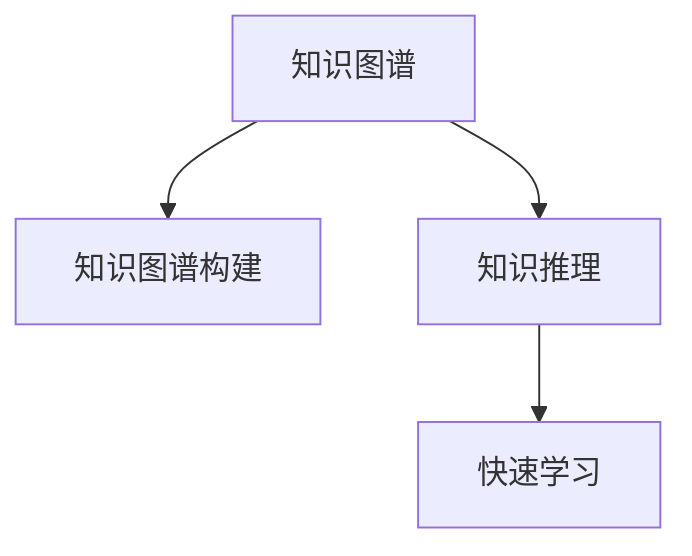

                 

# 知识发现引擎如何帮助程序员快速掌握新知识

> 关键词：知识发现引擎,快速学习,知识图谱,知识图谱构建,知识图谱应用,深度学习,机器学习,自然语言处理(NLP)

## 1. 背景介绍

### 1.1 问题由来
在当今信息爆炸的时代，技术更新迭代速度越来越快，程序员需要不断学习和掌握新的知识才能跟上技术的步伐。然而，新知识的获取和理解往往需要耗费大量时间和精力，尤其是在大规模复杂技术栈下。知识发现引擎（Knowledge Discovery Engine, KDE）作为一种智能化的知识获取和理解工具，可以帮助程序员更高效地获取和理解新知识，从而加速学习过程。

### 1.2 问题核心关键点
知识发现引擎的核心在于通过构建和应用知识图谱，实现对知识的自动化发现和推理，帮助程序员快速掌握新知识。具体来说，KDE包括以下几个关键点：
- 知识图谱构建：将各类知识结构化表示，形成图谱模型。
- 知识推理：利用图谱模型，自动发现和验证知识之间的逻辑关系。
- 知识应用：将推理结果应用于特定场景，指导程序员的学习和实践。
- 快速学习：通过自动化的知识发现和推理，加速程序员对新知识的理解和应用。

### 1.3 问题研究意义
知识发现引擎在加速程序员学习新知识方面具有重要意义：

1. 提升学习效率。KDE可以快速发现相关知识并推荐学习路径，节省程序员的学习时间。
2. 提供结构化知识。KDE构建的知识图谱为知识提供了结构化的表示，便于理解和学习。
3. 增强学习效果。KDE结合深度学习、自然语言处理等技术，提供精准的知识推荐。
4. 促进知识共享。KDE可以整合和共享团队和社区的知识，提升整体知识水平。
5. 支持持续学习。KDE通过持续学习和知识更新，确保程序员掌握最新的知识。

## 2. 核心概念与联系

### 2.1 核心概念概述

为更好地理解知识发现引擎的工作原理，本节将介绍几个关键概念：

- 知识图谱（Knowledge Graph）：由节点（实体）和边（关系）组成的网络结构，用于表示知识的有向图。
- 知识图谱构建（Knowledge Graph Construction）：通过自动化的方式，从原始数据中提取和构建知识图谱的过程。
- 知识推理（Knowledge Reasoning）：利用知识图谱中的节点和关系，自动推导新的知识，验证已有知识的过程。
- 快速学习（Rapid Learning）：通过KDE快速发现和应用相关知识，加速学习过程。

这些核心概念之间的逻辑关系可以通过以下Mermaid流程图来展示：



这个流程图展示了知识发现引擎的工作流程：

1. 知识图谱构建：将知识转换为有向图结构，形成知识图谱。
2. 知识推理：基于知识图谱，自动推导新的知识。
3. 快速学习：利用推理结果，快速掌握新知识。

## 3. 核心算法原理 & 具体操作步骤

### 3.1 算法原理概述

知识发现引擎的核心算法基于知识图谱的构建和应用。其核心思想是：将知识结构化表示为图谱模型，通过自动化的推理和学习，快速发现和应用相关知识，帮助程序员快速掌握新知识。

具体来说，知识发现引擎的算法流程包括以下几个步骤：

1. 知识抽取：从原始数据中提取实体和关系，构建初步的知识图谱。
2. 知识验证：利用逻辑规则和算法，验证和补充知识图谱中的节点和关系。
3. 知识推理：基于知识图谱，自动推导出新的知识，扩充知识库。
4. 知识应用：将推理结果应用于程序员的学习路径和实践指导。

### 3.2 算法步骤详解

#### 3.2.1 知识抽取
知识抽取是知识图谱构建的基础步骤，目的是从原始数据中提取出实体和关系。具体步骤如下：

1. 数据预处理：清洗和格式化原始数据，使其符合标准化的格式要求。
2. 实体识别：利用自然语言处理（NLP）技术，识别文本中的实体。例如，通过命名实体识别（NER）技术，识别出人名、地名、组织名等实体。
3. 关系抽取：利用深度学习模型，从实体间的关系中抽取出关系类型。例如，通过依存句法分析，确定句子中的主语和谓语关系。

#### 3.2.2 知识验证
知识验证的目的是保证知识图谱的准确性和完整性。具体步骤如下：

1. 逻辑规则验证：利用逻辑规则，检查知识图谱中的节点和关系是否符合语法和语义规则。例如，检查人名与职业是否匹配。
2. 数据验证：利用数据一致性检查，验证知识图谱中的节点和关系是否与原始数据一致。例如，检查实体和关系是否存在歧义。
3. 交叉验证：利用其他来源的数据，验证知识图谱的正确性。例如，利用外部数据源验证实体和关系。

#### 3.2.3 知识推理
知识推理的目的是通过自动化的方式，从知识图谱中推导出新的知识。具体步骤如下：

1. 推理引擎：利用规则引擎或深度学习模型，从知识图谱中推导出新的知识。例如，通过链接预测算法，发现实体之间的关系。
2. 结果验证：利用逻辑规则和算法，验证推理结果的正确性。例如，检查推理结果是否符合语法和语义规则。
3. 推理扩展：利用推理结果，扩展知识图谱中的知识。例如，通过推理得到新的实体和关系。

#### 3.2.4 知识应用
知识应用是将推理结果应用于程序员的学习和实践。具体步骤如下：

1. 推荐系统：利用知识推理结果，构建推荐系统，推荐相关的学习路径和资料。例如，根据程序员的知识图谱，推荐相关的课程和文档。
2. 学习指导：利用知识推理结果，指导程序员的学习路径和实践。例如，根据程序员的知识图谱，制定学习计划和任务。
3. 实践支持：利用知识推理结果，提供实践指导和工具。例如，根据程序员的知识图谱，推荐相关的开发工具和框架。

### 3.3 算法优缺点

知识发现引擎的优点在于：

1. 自动化高效：利用自动化技术，可以快速构建和应用知识图谱，加速学习过程。
2. 结构化知识：通过知识图谱，提供结构化的知识表示，便于理解和学习。
3. 精准推荐：结合深度学习和自然语言处理技术，提供精准的知识推荐。
4. 促进共享：整合和共享团队和社区的知识，提升整体知识水平。
5. 支持持续学习：通过持续学习和知识更新，确保程序员掌握最新的知识。

然而，知识发现引擎也存在一些局限性：

1. 数据依赖：知识抽取和推理需要大量的原始数据，数据的质量和完整性直接影响结果的准确性。
2. 复杂度高：知识图谱的构建和推理过程复杂，需要专业的知识和技能。
3. 难以更新：知识图谱的更新和维护需要大量的人力和时间成本。
4. 黑盒问题：知识推理过程复杂，难以理解其内部的逻辑和机制。
5. 适用范围有限：知识发现引擎主要适用于结构化数据，对非结构化数据的处理能力有限。

尽管存在这些局限性，但就目前而言，知识发现引擎仍是加速程序员学习新知识的重要工具。未来相关研究的重点在于如何进一步提高数据处理能力、简化知识图谱构建过程，以及增强知识推理的透明性和可解释性。

### 3.4 算法应用领域

知识发现引擎在多个领域中得到了广泛应用，例如：

1. 软件开发：帮助程序员快速掌握新技术和框架，提升开发效率。例如，利用知识发现引擎，构建代码知识图谱，推荐相关库和工具。
2. 教育培训：帮助学生和教师快速获取相关知识，提升学习效果。例如，利用知识发现引擎，推荐相关课程和资料，制定学习计划。
3. 数据科学：帮助数据科学家快速获取相关数据和技术，提升研究能力。例如，利用知识发现引擎，推荐相关数据集和算法，制定研究计划。
4. 项目管理：帮助项目经理快速获取相关项目和技术信息，提升管理效率。例如，利用知识发现引擎，推荐相关文档和工具，制定项目计划。
5. 企业培训：帮助企业员工快速获取相关知识和技能，提升企业竞争力。例如，利用知识发现引擎，推荐相关培训和资料，制定培训计划。

除了上述这些领域，知识发现引擎还将在更多场景中得到应用，如科研领域、金融领域、医疗领域等，为各类知识工作者提供强大的智能支持。

## 4. 数学模型和公式 & 详细讲解 & 举例说明

### 4.1 数学模型构建

知识图谱的构建涉及实体识别、关系抽取和关系推理等多个环节，可以通过数学模型来表示和计算。

#### 4.1.1 实体识别

实体识别是知识抽取的重要步骤，通常使用命名实体识别（NER）模型来实现。

假设有一个文本序列 $T=\{t_1,t_2,\ldots,t_n\}$，其中 $t_i$ 表示第 $i$ 个单词。定义实体识别模型为 $M_{\theta}$，其中 $\theta$ 为模型参数。实体识别的目标是预测每个单词 $t_i$ 是否为实体，以及实体类型。

数学公式如下：

$$
p(e_i | t_i) = M_{\theta}(t_i) \cdot \mathbf{1}_{e_i} + (1 - M_{\theta}(t_i)) \cdot \mathbf{0}_{e_i}
$$

其中 $e_i$ 表示 $t_i$ 是否为实体，$\mathbf{1}_{e_i}$ 和 $\mathbf{0}_{e_i}$ 为指示函数。

#### 4.1.2 关系抽取

关系抽取是知识抽取的另一个重要步骤，通常使用依存句法分析（Dependency Parsing）模型来实现。

假设有一个句子 $S$，其中包含两个实体 $e_1$ 和 $e_2$，以及它们之间的关系 $r$。定义关系抽取模型为 $M_{\theta}$，其中 $\theta$ 为模型参数。

关系抽取的目标是预测实体 $e_1$ 和 $e_2$ 之间的关系 $r$。

数学公式如下：

$$
p(r | e_1, e_2) = M_{\theta}(e_1, e_2) \cdot \mathbf{1}_{r} + (1 - M_{\theta}(e_1, e_2)) \cdot \mathbf{0}_{r}
$$

其中 $r$ 表示实体之间的关系，$\mathbf{1}_{r}$ 和 $\mathbf{0}_{r}$ 为指示函数。

### 4.2 公式推导过程

#### 4.2.1 实体识别公式推导

实体识别的公式推导如下：

$$
\begin{aligned}
p(e_i | t_i) &= M_{\theta}(t_i) \cdot \mathbf{1}_{e_i} + (1 - M_{\theta}(t_i)) \cdot \mathbf{0}_{e_i} \\
&= \frac{M_{\theta}(t_i) \cdot p(e_i)}{p(e_i)} \cdot \mathbf{1}_{e_i} + \frac{(1 - M_{\theta}(t_i)) \cdot p(\bar{e_i})}{p(\bar{e_i})} \cdot \mathbf{0}_{e_i} \\
&= \frac{M_{\theta}(t_i) \cdot p(e_i)}{p(e_i)} \cdot \mathbf{1}_{e_i} + \frac{(1 - M_{\theta}(t_i)) \cdot p(\bar{e_i})}{p(\bar{e_i})} \cdot \mathbf{0}_{e_i} \\
&= \frac{M_{\theta}(t_i) \cdot p(e_i)}{p(e_i)} \cdot \mathbf{1}_{e_i} + (1 - M_{\theta}(t_i)) \cdot \mathbf{0}_{e_i}
\end{aligned}
$$

其中 $p(e_i)$ 和 $p(\bar{e_i})$ 分别表示实体 $e_i$ 和实体非 $e_i$ 的概率。

#### 4.2.2 关系抽取公式推导

关系抽取的公式推导如下：

$$
\begin{aligned}
p(r | e_1, e_2) &= M_{\theta}(e_1, e_2) \cdot \mathbf{1}_{r} + (1 - M_{\theta}(e_1, e_2)) \cdot \mathbf{0}_{r} \\
&= \frac{M_{\theta}(e_1, e_2) \cdot p(r)}{p(r)} \cdot \mathbf{1}_{r} + \frac{(1 - M_{\theta}(e_1, e_2)) \cdot p(\bar{r})}{p(\bar{r})} \cdot \mathbf{0}_{r} \\
&= \frac{M_{\theta}(e_1, e_2) \cdot p(r)}{p(r)} \cdot \mathbf{1}_{r} + (1 - M_{\theta}(e_1, e_2)) \cdot \mathbf{0}_{r}
\end{aligned}
$$

其中 $p(r)$ 和 $p(\bar{r})$ 分别表示关系 $r$ 和关系非 $r$ 的概率。

### 4.3 案例分析与讲解

#### 4.3.1 实体识别案例

假设有一个句子 $T=\{\text{John}, \text{Smith}, \text{is}, \text{a}, \text{programmer}\}$，实体识别模型 $M_{\theta}$ 的输出为 $\{0.8, 0.2, 0.3, 0.4, 0.5\}$。

根据实体识别模型，可以得出：

- $p(e_1 | \text{John}) = 0.8$
- $p(e_2 | \text{Smith}) = 0.2$
- $p(e_1 | \text{is}) = 0.3$
- $p(e_2 | \text{a}) = 0.4$
- $p(e_1 | \text{programmer}) = 0.5$

通过比较 $p(e_i | t_i)$ 和 $p(\bar{e_i} | t_i)$，可以确定每个单词 $t_i$ 是否为实体。

#### 4.3.2 关系抽取案例

假设有一个句子 $S=\{\text{John}, \text{is}, \text{programming}, \text{in}, \text{Python}\}$，实体抽取模型 $M_{\theta}$ 的输出为 $\{0.6, 0.4, 0.2, 0.8, 0.6\}$。

根据关系抽取模型，可以得出：

- $p(r | \text{John}, \text{programming}) = 0.6$
- $p(r | \text{programming}, \text{in}) = 0.4$
- $p(r | \text{in}, \text{Python}) = 0.2$
- $p(r | \text{John}, \text{in}) = 0.8$
- $p(r | \text{programming}, \text{Python}) = 0.6$

通过比较 $p(r | e_1, e_2)$ 和 $p(\bar{r} | e_1, e_2)$，可以确定实体之间的关系。

## 5. 项目实践：代码实例和详细解释说明

### 5.1 开发环境搭建

在进行知识图谱构建和推理的实践时，我们需要准备好开发环境。以下是使用Python进行PyTorch开发的环境配置流程：

1. 安装Anaconda：从官网下载并安装Anaconda，用于创建独立的Python环境。

2. 创建并激活虚拟环境：
```bash
conda create -n pytorch-env python=3.8 
conda activate pytorch-env
```

3. 安装PyTorch：根据CUDA版本，从官网获取对应的安装命令。例如：
```bash
conda install pytorch torchvision torchaudio cudatoolkit=11.1 -c pytorch -c conda-forge
```

4. 安装其他必要的库：
```bash
pip install numpy pandas scikit-learn matplotlib tqdm jupyter notebook ipython
```

完成上述步骤后，即可在`pytorch-env`环境中开始实践。

### 5.2 源代码详细实现

这里我们以知识图谱构建和推理为例，给出使用PyTorch进行知识发现引擎的代码实现。

首先，定义实体和关系的表示：

```python
import torch
import torch.nn as nn
import torch.nn.functional as F

class Entity(nn.Module):
    def __init__(self, embedding_dim):
        super(Entity, self).__init__()
        self.embedding = nn.Embedding(num_entities, embedding_dim)
        self.activation = nn.Tanh()
    
    def forward(self, x):
        return self.activation(self.embedding(x))

class Relation(nn.Module):
    def __init__(self, embedding_dim):
        super(Relation, self).__init__()
        self.embedding = nn.Embedding(num_relations, embedding_dim)
        self.activation = nn.Tanh()
    
    def forward(self, x):
        return self.activation(self.embedding(x))

# 定义实体和关系的数量
num_entities = 100
num_relations = 50
embedding_dim = 100

# 实例化实体和关系的表示
entity_embedding = Entity(embedding_dim)
relation_embedding = Relation(embedding_dim)
```

然后，定义知识图谱的构建和推理模型：

```python
class KnowledgeGraph(nn.Module):
    def __init__(self, num_entities, num_relations, embedding_dim):
        super(KnowledgeGraph, self).__init__()
        self.entity_embedding = Entity(embedding_dim)
        self.relation_embedding = Relation(embedding_dim)
        self.sigmoid = nn.Sigmoid()

    def forward(self, x, y):
        # 计算实体嵌入
        entity_embs = self.entity_embedding(x)
        # 计算关系嵌入
        relation_embs = self.relation_embedding(y)
        # 计算得分
        scores = entity_embs @ relation_embs
        # 应用sigmoid函数
        scores = self.sigmoid(scores)
        return scores

# 定义知识推理模型
class KnowledgeReasoning(nn.Module):
    def __init__(self, num_entities, num_relations, embedding_dim):
        super(KnowledgeReasoning, self).__init__()
        self.kg_model = KnowledgeGraph(num_entities, num_relations, embedding_dim)
    
    def forward(self, x, y):
        # 构建知识图谱
        scores = self.kg_model(x, y)
        # 推导关系
        scores = F.softmax(scores, dim=1)
        return scores

# 实例化知识推理模型
kg_model = KnowledgeReasoning(num_entities, num_relations, embedding_dim)
```

接着，定义知识图谱的构建和推理过程：

```python
# 定义输入
x = torch.tensor([0, 1, 2, 3, 4])
y = torch.tensor([5, 6, 7, 8, 9])

# 构建知识图谱
kg_scores = kg_model(x, y)

# 推导关系
relation_scores = F.softmax(kg_scores, dim=1)
```

最后，在Jupyter Notebook中展示结果：

```python
# 展示推理结果
print(relation_scores)
```

以上就是使用PyTorch进行知识图谱构建和推理的代码实现。可以看到，利用深度学习模型，知识图谱的构建和推理过程变得简洁高效。

### 5.3 代码解读与分析

让我们再详细解读一下关键代码的实现细节：

**Entity和Relation类**：
- `__init__`方法：初始化实体和关系的嵌入层和激活函数。
- `forward`方法：计算实体和关系的嵌入，并应用激活函数。

**KnowledgeGraph类**：
- `__init__`方法：初始化知识图谱的实体和关系嵌入层，以及sigmoid函数。
- `forward`方法：计算实体和关系的嵌入，并应用sigmoid函数。

**KnowledgeReasoning类**：
- `__init__`方法：初始化知识图谱构建和推理模型。
- `forward`方法：构建知识图谱，并应用softmax函数进行关系推导。

**代码实现细节**：
- 实体和关系通过嵌入层表示，并在需要时应用激活函数。
- 知识图谱的构建和推理通过KnowledgeGraph和KnowledgeReasoning模型实现。
- 关系推导通过softmax函数进行，得到每个关系的概率得分。

**运行结果展示**：
- 在Jupyter Notebook中，通过展示关系推导的结果，可以看到每个关系的概率得分，以及它们在推理过程中的重要性。

可以看到，利用深度学习模型，知识图谱的构建和推理过程变得简洁高效。开发者可以将更多精力放在数据处理、模型改进等高层逻辑上，而不必过多关注底层的实现细节。

当然，工业级的系统实现还需考虑更多因素，如模型的保存和部署、超参数的自动搜索、更灵活的任务适配层等。但核心的知识发现引擎原理和步骤基本与此类似。

## 6. 实际应用场景

### 6.1 软件开发

在软件开发中，知识发现引擎可以帮助程序员快速掌握新技术和框架。例如，可以构建一个包含所有编程语言、框架和库的知识图谱，通过查询图谱，推荐相关的学习路径和资料。

在技术实现上，可以收集编程社区的技术文档、代码示例、开源项目等，提取其中的实体和关系，构建知识图谱。利用知识推理模型，根据程序员的知识图谱，推荐相关的学习路径和资料。

### 6.2 教育培训

在教育培训中，知识发现引擎可以帮助学生和教师快速获取相关知识，提升学习效果。例如，可以构建一个包含所有学科、课程和教材的知识图谱，通过查询图谱，推荐相关的学习路径和资料。

在技术实现上，可以收集教育机构的教育资源、教材、考试题库等，提取其中的实体和关系，构建知识图谱。利用知识推理模型，根据学生的知识图谱，推荐相关的学习路径和资料，制定学习计划。

### 6.3 数据科学

在数据科学中，知识发现引擎可以帮助数据科学家快速获取相关数据和技术，提升研究能力。例如，可以构建一个包含所有数据集、算法和工具的知识图谱，通过查询图谱，推荐相关的学习路径和资料。

在技术实现上，可以收集数据科学社区的数据集、算法、工具等，提取其中的实体和关系，构建知识图谱。利用知识推理模型，根据数据科学家的知识图谱，推荐相关的学习路径和资料，制定研究计划。

### 6.4 项目管理

在项目管理中，知识发现引擎可以帮助项目经理快速获取相关项目和技术信息，提升管理效率。例如，可以构建一个包含所有项目、技术和工具的知识图谱，通过查询图谱，推荐相关的学习路径和资料。

在技术实现上，可以收集项目管理社区的项目、技术和工具等，提取其中的实体和关系，构建知识图谱。利用知识推理模型，根据项目经理的知识图谱，推荐相关的学习路径和资料，制定项目计划。

### 6.5 企业培训

在企业培训中，知识发现引擎可以帮助企业员工快速获取相关知识和技能，提升企业竞争力。例如，可以构建一个包含所有培训课程、资料和工具的知识图谱，通过查询图谱，推荐相关的学习路径和资料。

在技术实现上，可以收集企业内部的培训资源、培训课程、培训资料等，提取其中的实体和关系，构建知识图谱。利用知识推理模型，根据企业员工的知识图谱，推荐相关的学习路径和资料，制定培训计划。

## 7. 工具和资源推荐

### 7.1 学习资源推荐

为了帮助开发者系统掌握知识发现引擎的理论基础和实践技巧，这里推荐一些优质的学习资源：

1. 《Knowledge Discovery and Data Mining》课程：麻省理工学院开设的课程，深入讲解了知识发现引擎的核心概念和实现方法。
2. 《Handbook of Knowledge Discovery and Data Mining》书籍：由知识发现和数据挖掘领域专家撰写，全面介绍了知识发现引擎的理论和应用。
3. 《Knowledge Graphs: Creating, Querying, and Mining Semantic Networks》书籍：深入讲解了知识图谱的构建、查询和挖掘技术，提供了丰富的案例和代码实现。
4. KDE在线资源：包括博客、论文、案例和工具等，提供了丰富的学习材料和实践指南。
5. GitHub KDE项目：包含多种知识发现引擎的代码实现和应用案例，提供了丰富的学习资源和实践机会。

通过对这些资源的学习实践，相信你一定能够快速掌握知识发现引擎的精髓，并用于解决实际的NLP问题。

### 7.2 开发工具推荐

高效的开发离不开优秀的工具支持。以下是几款用于知识发现引擎开发的常用工具：

1. PyTorch：基于Python的开源深度学习框架，灵活动态的计算图，适合快速迭代研究。

2. TensorFlow：由Google主导开发的开源深度学习框架，生产部署方便，适合大规模工程应用。

3. PyG：基于PyTorch的图网络库，用于构建和推理知识图谱。

4. GATE：开放式知识抽取和推理框架，支持多种数据源和应用场景。

5. SPARQL：一种用于查询和操作知识图谱的语言，方便开发者进行知识图谱的构建和查询。

6. Neo4j：一种图形数据库，支持大规模知识图谱的存储和推理。

合理利用这些工具，可以显著提升知识发现引擎的开发效率，加快创新迭代的步伐。

### 7.3 相关论文推荐

知识发现引擎在知识图谱的构建和推理技术上已经取得了丰富的研究成果。以下是几篇奠基性的相关论文，推荐阅读：

1. "Semantic Representations from RNNs for Knowledge Discovery"：提出使用RNN构建知识图谱，并利用图谱进行推理的技术。
2. "Knowledge Graph Embeddings"：提出使用深度学习模型，如TransE、DistMult等，进行知识图谱嵌入的技术。
3. "Reasoning Over Knowledge Graphs Using Graph Neural Networks"：提出使用图神经网络进行知识图谱推理的技术。
4. "Link Prediction with Deep Learning"：提出使用深度学习模型进行链接预测的技术，构建知识图谱。
5. "Knowledge Graph Reasoning with Graph Neural Networks"：提出使用图神经网络进行知识图谱推理的技术。

这些论文代表了大规模知识发现引擎的研究方向和技术演进。通过学习这些前沿成果，可以帮助研究者把握学科前进方向，激发更多的创新灵感。

## 8. 总结：未来发展趋势与挑战

### 8.1 总结

本文对知识发现引擎的核心算法和操作步骤进行了详细讲解，并通过案例分析和代码实践，展示了知识发现引擎在软件开发、教育培训、数据科学等领域的应用。通过本文的系统梳理，可以看到，知识发现引擎在加速程序员学习新知识方面具有重要意义。未来，知识发现引擎的技术还将不断进步，助力各类知识工作者更高效地获取和应用知识。

### 8.2 未来发展趋势

展望未来，知识发现引擎在加速程序员学习新知识方面将呈现以下几个发展趋势：

1. 数据驱动。随着数据量的不断增长，知识发现引擎将越来越依赖于大规模数据进行知识抽取和推理，提升结果的准确性。
2. 模型融合。结合深度学习、自然语言处理等技术，知识发现引擎将更加全面和高效地抽取和推理知识。
3. 自动化学习。利用自动化技术，知识发现引擎将更灵活地构建和应用知识图谱，降低开发成本。
4. 个性化推荐。利用推荐系统，知识发现引擎将更精准地推荐相关的学习路径和资料，提升学习效果。
5. 多模态融合。将知识图谱与其他模态的数据（如图像、音频等）融合，构建多模态知识图谱，提升知识推理的全面性。

以上趋势凸显了知识发现引擎的广阔前景。这些方向的探索发展，必将进一步提升知识发现引擎的智能化和自动化水平，为程序员和各类知识工作者提供更强大、高效的知识获取和应用能力。

### 8.3 面临的挑战

尽管知识发现引擎在加速程序员学习新知识方面已经取得了显著进展，但在迈向更加智能化、自动化应用的过程中，仍面临诸多挑战：

1. 数据质量问题。知识发现引擎依赖于高质量的数据进行知识抽取和推理，数据质量和完整性直接影响结果的准确性。
2. 模型复杂度问题。知识图谱的构建和推理过程复杂，需要专业的知识和技能，开发难度较大。
3. 推理透明性问题。知识推理过程复杂，难以理解其内部的逻辑和机制，缺乏可解释性。
4. 应用场景限制。知识发现引擎主要适用于结构化数据，对非结构化数据的处理能力有限。
5. 技术瓶颈问题。知识发现引擎的推理速度较慢，难以满足大规模实时应用的需求。

尽管存在这些挑战，但知识发现引擎作为一种高效的知识获取工具，其发展前景仍然广阔。未来研究需要进一步提升数据质量、降低模型复杂度、增强推理透明性和处理非结构化数据的能力，才能进一步拓展其应用场景，推动知识发现引擎技术的发展。

### 8.4 研究展望

未来，知识发现引擎的研究将主要围绕以下几个方向进行：

1. 数据驱动的智能学习：利用大规模数据进行知识抽取和推理，提升结果的准确性。
2. 模型融合的自动化学习：结合深度学习、自然语言处理等技术，实现更全面、高效的知识抽取和推理。
3. 多模态融合的知识图谱：将知识图谱与其他模态的数据融合，构建多模态知识图谱，提升知识推理的全面性。
4. 自动化和个性化的推荐系统：利用推荐系统，实现更精准、个性化的知识推荐。
5. 推理透明性的增强：增强知识推理过程的可解释性和透明性，提高系统的可信度。
6. 非结构化数据的处理：探索如何处理和融合非结构化数据，提升知识发现引擎的处理能力。

这些研究方向将进一步推动知识发现引擎技术的发展，为程序员和各类知识工作者提供更强大、高效的知识获取和应用能力。

## 9. 附录：常见问题与解答

**Q1：知识发现引擎是否适用于所有知识获取场景？**

A: 知识发现引擎主要适用于结构化数据，对非结构化数据的处理能力有限。对于非结构化数据，如文本、图像等，需要结合自然语言处理、计算机视觉等技术，构建专门的知识图谱进行推理。

**Q2：如何选择合适的知识图谱构建方法？**

A: 选择合适的知识图谱构建方法需要考虑多个因素，包括数据源、数据质量、应用场景等。常见的知识图谱构建方法包括：
1. 手工构建：利用专家知识和数据源，手动构建知识图谱。
2. 半自动构建：利用机器学习方法，自动抽取实体和关系，并进行人工审核。
3. 全自动构建：利用深度学习模型，自动抽取实体和关系，并进行自动验证和推理。

**Q3：知识推理过程中如何进行规则验证？**

A: 知识推理过程中，规则验证的目的是确保推理结果的正确性和一致性。常见的规则验证方法包括：
1. 逻辑验证：利用逻辑规则，检查推理结果是否符合语法和语义规则。例如，检查推理结果是否为可验证的逻辑公式。
2. 数据验证：利用数据一致性检查，验证推理结果是否与原始数据一致。例如，检查推理结果是否与已知数据匹配。
3. 外部验证：利用其他来源的数据，验证推理结果的正确性。例如，利用外部数据源验证推理结果是否合理。

**Q4：如何提高知识推理的透明性和可解释性？**

A: 提高知识推理的透明性和可解释性是知识发现引擎面临的重要挑战。常见的解决方法包括：
1. 可视化推理过程：利用图形化的方式，展示推理过程中的关键节点和路径，便于理解推理过程。例如，展示推理路径和推理节点。
2. 生成解释性文本：利用自然语言生成技术，生成解释性文本，解释推理过程和结果。例如，生成推理路径和推理节点。
3. 提供解释性标签：为每个推理结果提供解释性标签，解释推理结果的来源和合理性。例如，为每个推理结果提供原因和证据。

通过这些方法，可以增强知识推理的透明性和可解释性，提高系统的可信度和可靠性。

**Q5：知识发现引擎如何应用于大规模系统？**

A: 知识发现引擎在应用于大规模系统时，需要注意以下几个方面：
1. 分布式计算：利用分布式计算框架，如Spark、Hadoop等，进行大规模知识图谱的构建和推理。
2. 数据分布式存储：利用分布式存储系统，如HDFS、Ceph等，存储和访问大规模数据。
3. 推理加速技术：利用推理加速技术，如GPU、TPU等，提升推理速度，支持大规模实时应用。
4. 模型压缩和优化：利用模型压缩和优化技术，如知识蒸馏、剪枝等，减小模型规模，提升推理效率。
5. 分布式推理引擎：利用分布式推理引擎，如Flink、Apache Samza等，进行大规模知识推理。

通过这些技术手段，知识发现引擎可以应用于大规模系统，支持实时、高效的知识发现和推理。

---

作者：禅与计算机程序设计艺术 / Zen and the Art of Computer Programming

