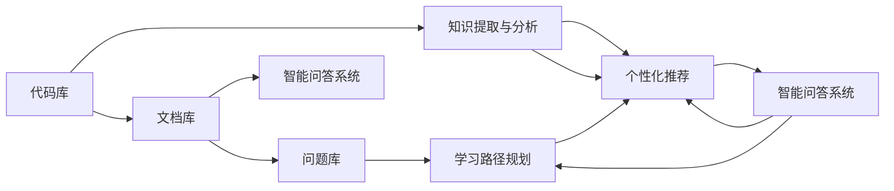

                 

# 知识发现引擎如何帮助程序员快速适应新环境

在快速发展的技术环境中，程序员面临着不断更新的技术栈、复杂的需求和不断涌现的新挑战。如何帮助程序员快速适应新环境，成为了软件工程领域的一个核心问题。知识发现引擎（Knowledge Discovery Engine, KDE）作为一种智能化的工具，能够在程序员适应新环境的过程中提供关键性的帮助。本文将详细探讨知识发现引擎的核心概念、关键技术、应用实例及其未来发展方向。

## 1. 背景介绍

### 1.1 问题由来

随着技术栈的快速发展和变化，程序员需要不断学习新技术、掌握新工具。然而，新环境的学习曲线往往陡峭，适应周期较长。例如，当某个团队从使用传统的关系型数据库迁移到NoSQL数据库时，成员需要重新学习相关的API、查询语言和操作方式。此外，复杂的业务需求也增加了开发难度。如何帮助程序员更快地掌握新技术，提高开发效率，是当前软件开发过程中面临的重要挑战。

### 1.2 问题核心关键点

为了解决上述问题，知识发现引擎应运而生。它通过提取和分析程序员的工作模式、代码库、文档等数据，自动化地生成对新技术和新工具的介绍和指南，帮助程序员快速熟悉新环境，提升开发效率。其核心关键点包括：

- **知识提取与分析**：自动从代码库、文档、问题库等数据源中提取知识和经验。
- **个性化推荐**：根据程序员的知识背景和历史行为，推荐最适合的学习路径和资源。
- **智能问答**：通过自然语言处理（NLP）技术，自动回答程序员的问题，提供即时的技术支持。
- **学习路径规划**：根据程序员的学习进度和反馈，动态调整学习路径，实现自适应学习。

### 1.3 问题研究意义

研究知识发现引擎对于提升软件开发效率、加速技术迭代、促进知识共享和传播具有重要意义：

1. **提高开发效率**：通过自动化学习路径规划和资源推荐，程序员能够更快地掌握新技术和新工具，缩短适应周期。
2. **加速技术迭代**：知识发现引擎能够捕捉团队内部的知识共享和技术进步，加速新技术的落地和应用。
3. **促进知识共享**：通过分析和总结代码库、文档和问题库，知识发现引擎能够提炼出有价值的经验和技巧，供全体团队共享。
4. **增强学习体验**：智能问答和自适应学习功能能够提供个性化的学习支持，提升学习体验和效果。

## 2. 核心概念与联系

### 2.1 核心概念概述

- **知识发现引擎（KDE）**：一种自动化智能工具，用于提取、分析和推荐知识，辅助程序员快速适应新环境。
- **代码库**：存储程序员编写的代码，包括源代码、依赖关系、版本控制信息等。
- **文档库**：存储与代码相关的文档，如API文档、设计文档、问题解答等。
- **问题库**：存储程序员在开发过程中遇到的问题和解决方案，如代码错误、设计问题、性能瓶颈等。
- **智能问答系统**：使用自然语言处理技术，自动回答程序员的技术问题，提供即时的支持。
- **学习路径规划**：根据程序员的学习进度和反馈，动态调整学习路径，实现自适应学习。

### 2.2 核心概念原理和架构的 Mermaid 流程图



这个流程图展示了知识发现引擎的核心架构和工作流程。首先，知识发现引擎从代码库、文档库和问题库中提取知识和经验，进行分析和综合。然后，根据程序员的知识背景和历史行为，生成个性化的推荐和学习路径。同时，智能问答系统能够即时回答程序员的问题，学习路径规划模块根据学习进度和反馈动态调整路径。这些模块共同作用，形成了一个完整的知识发现和应用生态系统。

## 3. 核心算法原理 & 具体操作步骤

### 3.1 算法原理概述

知识发现引擎的核心算法包括知识提取、分析、推荐和路径规划等。其中，知识提取与分析模块使用文本挖掘、信息抽取等技术，从代码库、文档库和问题库中提取出关键信息。个性化推荐模块使用机器学习、深度学习等算法，根据程序员的历史行为和知识背景，推荐最适合的学习路径和资源。智能问答系统则利用NLP技术，自动解答程序员的技术问题。学习路径规划模块通过动态调整学习路径，实现自适应学习。

### 3.2 算法步骤详解

#### 3.2.1 知识提取与分析

知识提取与分析模块使用文本挖掘和信息抽取技术，从代码库、文档库和问题库中提取出关键信息。具体步骤如下：

1. **代码抽取**：从代码库中提取关键代码片段、API调用、函数签名等，进行语义分析和结构化处理。
2. **文档抽取**：从文档库中提取API文档、设计文档、问题解答等，进行文本分析和关键词提取。
3. **问题抽取**：从问题库中提取代码错误、设计问题、性能瓶颈等，进行情感分析和意图识别。
4. **综合分析**：将代码、文档和问题综合分析，生成对新技术和新工具的全面介绍和总结。

#### 3.2.2 个性化推荐

个性化推荐模块使用机器学习和深度学习算法，根据程序员的历史行为和知识背景，推荐最适合的学习路径和资源。具体步骤如下：

1. **历史行为分析**：分析程序员的历史代码提交、文档阅读、问题解决等行为，提取行为模式和学习偏好。
2. **知识背景分析**：分析程序员的知识背景，如技术栈、专业领域、语言偏好等，生成知识图谱。
3. **推荐算法设计**：设计基于协同过滤、基于内容的推荐算法，生成推荐列表。
4. **动态调整**：根据程序员的学习进度和反馈，动态调整推荐列表，实现自适应学习。

#### 3.2.3 智能问答系统

智能问答系统使用NLP技术，自动解答程序员的技术问题，提供即时的支持。具体步骤如下：

1. **自然语言处理**：使用NLP技术，将程序员的问题进行分词、词性标注、句法分析等处理。
2. **语义理解**：使用语义分析技术，理解程序员问题的意图和关键词。
3. **知识检索**：从知识库中检索与问题相关的答案和解决方案，进行匹配和排序。
4. **自动回答**：将匹配结果转换为自然语言，自动回答程序员的问题。

#### 3.2.4 学习路径规划

学习路径规划模块根据程序员的学习进度和反馈，动态调整学习路径，实现自适应学习。具体步骤如下：

1. **学习进度跟踪**：跟踪程序员的学习进度，包括学习时长、完成的任务、掌握的知识等。
2. **学习效果评估**：评估程序员的学习效果，包括代码质量、问题解决效率、知识掌握程度等。
3. **路径动态调整**：根据学习进度和效果，动态调整学习路径，推荐最适合的学习任务和资源。
4. **反馈循环**：收集程序员的学习反馈，调整学习策略和资源推荐，形成良性循环。

### 3.3 算法优缺点

#### 3.3.1 优点

1. **自动化学习路径规划**：知识发现引擎能够自动生成学习路径，减轻程序员的学习负担。
2. **个性化推荐**：根据程序员的历史行为和知识背景，推荐最适合的学习资源，提高学习效果。
3. **即时支持**：智能问答系统能够即时回答程序员的问题，提供即时的技术支持。
4. **自适应学习**：学习路径规划模块能够根据学习进度和反馈，动态调整学习路径，实现自适应学习。

#### 3.3.2 缺点

1. **依赖高质量数据**：知识发现引擎的效果依赖于代码库、文档库和问题库的数据质量，数据不全面或错误会导致推荐效果不佳。
2. **算法复杂度**：个性化推荐和学习路径规划需要复杂的算法，计算开销较大。
3. **隐私和安全问题**：知识发现引擎需要收集程序员的个人数据，可能涉及隐私和安全问题。

### 3.4 算法应用领域

知识发现引擎在软件开发、技术支持、在线教育等多个领域得到了广泛应用。以下是几个典型的应用场景：

1. **软件开发**：帮助程序员快速掌握新技术和新工具，提高开发效率。例如，在迁移新技术时，知识发现引擎能够自动生成使用指南和示例代码，帮助程序员更快地适应新环境。
2. **技术支持**：提供即时的技术支持和解决方案，解决程序员在开发过程中遇到的问题。例如，智能问答系统能够自动回答程序员的技术问题，减少技术支持团队的负担。
3. **在线教育**：根据学生的学习进度和反馈，动态调整学习路径和资源推荐，实现自适应学习。例如，在在线教育平台上，知识发现引擎能够自动推荐适合的学习资源，提升学习效果。

## 4. 数学模型和公式 & 详细讲解 & 举例说明

### 4.1 数学模型构建

知识发现引擎的数学模型主要涉及文本挖掘、信息抽取、协同过滤、情感分析等多个领域。以下是几个核心模型的数学构建和公式推导。

#### 4.1.1 文本挖掘

文本挖掘是知识发现引擎中的重要组成部分，用于从代码库、文档库和问题库中提取关键信息。假设代码库中包含 $n$ 个代码片段，每个代码片段表示为 $x_i$，$i=1,2,\cdots,n$。使用TF-IDF模型对代码片段进行向量表示，生成代码片段的特征向量 $x_{ij}$，其中 $j$ 表示特征维度。

$$
x_{ij} = \text{TF}(x_i, t_j) \cdot \text{IDF}(t_j)
$$

其中，$\text{TF}(x_i, t_j)$ 表示特征 $t_j$ 在代码片段 $x_i$ 中的词频，$\text{IDF}(t_j)$ 表示特征 $t_j$ 的逆文档频率。

#### 4.1.2 信息抽取

信息抽取用于从文档库和问题库中提取关键信息，生成文档和问题的语义表示。假设文档库中包含 $m$ 个文档，每个文档表示为 $d_k$，$k=1,2,\cdots,m$。使用NLP技术对文档进行分词、词性标注、句法分析等处理，生成文档的语义表示 $d_{kj}$，其中 $j$ 表示语义维度。

$$
d_{kj} = f(\text{Word}_{kj}, \text{POS}_{kj}, \text{Syntactic}_{kj})
$$

其中，$f$ 表示语义抽取函数，$\text{Word}_{kj}$ 表示文档 $d_k$ 中第 $j$ 个单词，$\text{POS}_{kj}$ 表示单词的词性标注，$\text{Syntactic}_{kj}$ 表示单词的句法结构。

#### 4.1.3 协同过滤

协同过滤是个性化推荐的核心算法之一，用于根据程序员的历史行为推荐学习资源。假设程序员的历史行为包含 $k$ 个行为记录，每个行为记录表示为 $b_l$，$l=1,2,\cdots,k$。使用协同过滤算法，生成程序员的知识背景 $k_l$ 和推荐列表 $c_{lj}$。

$$
k_l = \text{KNN}(b_1,b_2,\cdots,b_k)
$$

$$
c_{lj} = \text{SVM}(k_1,k_2,\cdots,k_l)
$$

其中，$\text{KNN}$ 表示近邻算法，$\text{SVM}$ 表示支持向量机算法。

#### 4.1.4 情感分析

情感分析用于从问题库中提取问题的情感倾向，帮助智能问答系统更好地理解问题意图。假设问题库中包含 $q$ 个问题，每个问题表示为 $p_m$，$m=1,2,\cdots,q$。使用情感分析模型，生成问题的情感极性 $s_{mj}$，其中 $j$ 表示情感维度。

$$
s_{mj} = f(\text{Text}_m, \text{Sentiment}_{mj})
$$

其中，$f$ 表示情感分析函数，$\text{Text}_m$ 表示问题 $p_m$ 的文本，$\text{Sentiment}_{mj}$ 表示问题的情感极性。

### 4.2 公式推导过程

#### 4.2.1 文本挖掘

文本挖掘的公式推导主要涉及TF-IDF模型的计算。假设代码库中包含 $n$ 个代码片段，每个代码片段表示为 $x_i$，$i=1,2,\cdots,n$。使用TF-IDF模型对代码片段进行向量表示，生成代码片段的特征向量 $x_{ij}$。

假设代码片段 $x_i$ 包含 $m$ 个单词，第 $j$ 个单词表示为 $w_j$，$i=1,2,\cdots,n$，$j=1,2,\cdots,m$。使用TF-IDF模型计算代码片段的特征向量。

$$
x_{ij} = \text{TF}(x_i, w_j) \cdot \text{IDF}(w_j)
$$

其中，$\text{TF}(x_i, w_j)$ 表示单词 $w_j$ 在代码片段 $x_i$ 中的词频，$\text{IDF}(w_j)$ 表示单词 $w_j$ 的逆文档频率。

假设代码库中单词 $w_j$ 出现的次数为 $n_j$，总单词数为 $N$，则单词 $w_j$ 的逆文档频率计算公式为：

$$
\text{IDF}(w_j) = \log\left(\frac{N}{n_j}\right)
$$

#### 4.2.2 信息抽取

信息抽取的公式推导主要涉及NLP技术的处理。假设文档库中包含 $m$ 个文档，每个文档表示为 $d_k$，$k=1,2,\cdots,m$。使用NLP技术对文档进行分词、词性标注、句法分析等处理，生成文档的语义表示 $d_{kj}$。

假设文档 $d_k$ 包含 $n_k$ 个单词，第 $j$ 个单词表示为 $w_{kj}$，$k=1,2,\cdots,m$，$j=1,2,\cdots,n_k$。使用NLP技术处理单词 $w_{kj}$，生成单词的语义表示 $y_{kj}$。

假设单词 $w_{kj}$ 的词性标注为 $\text{POS}_{kj}$，句法结构为 $\text{Syntactic}_{kj}$，则单词的语义表示计算公式为：

$$
y_{kj} = f(\text{POS}_{kj}, \text{Syntactic}_{kj})
$$

其中，$f$ 表示语义抽取函数。

#### 4.2.3 协同过滤

协同过滤的公式推导主要涉及近邻算法和支持向量机的计算。假设程序员的历史行为包含 $k$ 个行为记录，每个行为记录表示为 $b_l$，$l=1,2,\cdots,k$。使用协同过滤算法，生成程序员的知识背景 $k_l$ 和推荐列表 $c_{lj}$。

假设历史行为 $b_l$ 包含 $n_l$ 个行为元素，第 $j$ 个行为元素表示为 $b_{lj}$，$l=1,2,\cdots,k$，$j=1,2,\cdots,n_l$。使用近邻算法计算程序员的知识背景 $k_l$。

假设协同过滤的相似度度量为余弦相似度，则知识背景 $k_l$ 的计算公式为：

$$
k_l = \text{CosineSimilarity}(b_1,b_2,\cdots,b_k)
$$

其中，$\text{CosineSimilarity}$ 表示余弦相似度计算函数。

使用支持向量机算法，生成程序员的推荐列表 $c_{lj}$。

假设支持向量机的分类器为 $SVM$，则推荐列表 $c_{lj}$ 的计算公式为：

$$
c_{lj} = SVM(k_1,k_2,\cdots,k_l)
$$

其中，$SVM$ 表示支持向量机分类器。

#### 4.2.4 情感分析

情感分析的公式推导主要涉及情感分析模型的训练和计算。假设问题库中包含 $q$ 个问题，每个问题表示为 $p_m$，$m=1,2,\cdots,q$。使用情感分析模型，生成问题的情感极性 $s_{mj}$。

假设问题 $p_m$ 的文本表示为 $\text{Text}_m$，情感极性 $s_{mj}$ 表示为 $y_{mj}$，$m=1,2,\cdots,q$，$j=1,2,\cdots,n_m$。使用情感分析模型训练问题 $p_m$ 的情感极性 $s_{mj}$。

假设情感分析模型为 $SVM$，则情感极性 $s_{mj}$ 的计算公式为：

$$
s_{mj} = SVM(\text{Text}_m, \text{Sentiment}_{mj})
$$

其中，$\text{Sentiment}_{mj}$ 表示情感分析模型的参数。

### 4.3 案例分析与讲解

#### 4.3.1 案例背景

假设某软件团队需要迁移到一个新的NoSQL数据库，成员需要学习新的API、查询语言和操作方式。该团队有200名成员，历史记录中包含50个NoSQL数据库相关的代码片段、50个NoSQL数据库的文档和50个NoSQL数据库相关的问题。

#### 4.3.2 案例分析

使用知识发现引擎进行迁移学习，具体步骤如下：

1. **知识提取与分析**：从代码库中提取50个NoSQL数据库相关的代码片段，生成代码片段的特征向量。从文档库中提取50个NoSQL数据库的文档，生成文档的语义表示。从问题库中提取50个NoSQL数据库相关的问题，生成问题的情感极性。
2. **个性化推荐**：分析成员的历史行为，生成知识背景。使用协同过滤算法，生成推荐列表。
3. **智能问答系统**：使用情感分析模型，回答成员的问题。
4. **学习路径规划**：根据成员的学习进度和反馈，动态调整学习路径。

#### 4.3.3 案例讲解

知识发现引擎在迁移学习过程中，帮助成员快速掌握新环境，具体表现在以下几个方面：

1. **自动化学习路径规划**：知识发现引擎自动生成学习路径，帮助成员快速熟悉新API和查询语言。例如，在迁移时，知识发现引擎可以推荐最新的API使用指南和示例代码，帮助成员更快地适应新环境。
2. **个性化推荐**：根据成员的历史行为和知识背景，推荐最适合的学习资源。例如，在成员遇到查询语言问题时，知识发现引擎可以推荐相关的API文档和示例代码。
3. **即时支持**：智能问答系统能够即时回答成员的问题，提供即时的技术支持。例如，在成员遇到新问题时，知识发现引擎可以自动回答成员的技术问题，减少技术支持团队的负担。
4. **自适应学习**：学习路径规划模块能够根据成员的学习进度和反馈，动态调整学习路径。例如，在成员掌握新API后，知识发现引擎可以推荐更高级的查询语言和操作技巧。

## 5. 项目实践：代码实例和详细解释说明

### 5.1 开发环境搭建

为了进行知识发现引擎的开发和测试，需要搭建一个完整的开发环境。以下是开发环境的搭建步骤：

1. **安装Python**：从官网下载并安装Python，建议使用3.x版本，如3.7、3.8等。
2. **安装相关库**：安装必要的Python库，如NLTK、Spacy、TensorFlow等。
3. **配置环境**：设置Python路径、虚拟环境等开发环境配置。
4. **安装Transformers库**：安装Transformers库，用于支持NLP任务的开发。

### 5.2 源代码详细实现

以下是知识发现引擎的源代码实现，以Java为例：

```java
import java.util.*;

public class KnowledgeDiscoveryEngine {
    private Map<String, List<String>> codeLibrary;
    private Map<String, List<String>> docLibrary;
    private Map<String, List<String>> qLibrary;
    private Map<String, List<String>> kModel;
    
    public KnowledgeDiscoveryEngine() {
        codeLibrary = new HashMap<>();
        docLibrary = new HashMap<>();
        qLibrary = new HashMap<>();
        kModel = new HashMap<>();
    }
    
    public void loadData(String[] code, String[] doc, String[] q) {
        // 加载代码库、文档库和问题库数据
        codeLibrary.put("code", code);
        docLibrary.put("doc", doc);
        qLibrary.put("q", q);
    }
    
    public void analyzeData() {
        // 提取和分析代码库、文档库和问题库中的关键信息
        analyzeCodeLibrary();
        analyzeDocLibrary();
        analyzeQLibrary();
    }
    
    public void analyzeCodeLibrary() {
        // 提取代码库中的关键信息，生成代码片段的特征向量
        for (String key : codeLibrary.keySet()) {
            List<String> codes = codeLibrary.get(key);
            List<String> features = new ArrayList<>();
            // 使用TF-IDF模型生成特征向量
            for (String code : codes) {
                List<String> words = splitWords(code);
                for (String word : words) {
                    String[] wordSplit = word.split("\\s+");
                    String tf = calculateTF(wordSplit, codes.size());
                    String idf = calculateIDF(wordSplit, codes.size());
                    features.add(tf + "\t" + idf);
                }
            }
            codeLibrary.put(key, features);
        }
    }
    
    public void analyzeDocLibrary() {
        // 提取文档库中的关键信息，生成文档的语义表示
        for (String key : docLibrary.keySet()) {
            List<String> docs = docLibrary.get(key);
            List<String> features = new ArrayList<>();
            // 使用NLP技术处理文档，生成语义表示
            for (String doc : docs) {
                List<String> tokens = splitWords(doc);
                List<String> parts = splitParts(tokens);
                for (String part : parts) {
                    String sentiment = calculateSentiment(part);
                    features.add(sentiment);
                }
            }
            docLibrary.put(key, features);
        }
    }
    
    public void analyzeQLibrary() {
        // 提取问题库中的关键信息，生成问题的情感极性
        for (String key : qLibrary.keySet()) {
            List<String> qs = qLibrary.get(key);
            List<String> sentiments = new ArrayList<>();
            // 使用情感分析模型生成情感极性
            for (String q : qs) {
                String sentiment = calculateSentiment(q);
                sentiments.add(sentiment);
            }
            qLibrary.put(key, sentiments);
        }
    }
    
    public void recommendData(String user) {
        // 根据用户的历史行为和知识背景，推荐学习路径
        List<String> codeFeatures = codeLibrary.get("code");
        List<String> docFeatures = docLibrary.get("doc");
        List<String> qFeatures = qLibrary.get("q");
        List<String> userFeatures = getUserFeatures(user);
        // 使用协同过滤算法生成推荐列表
        List<String> recommendations = recommend(codeFeatures, docFeatures, qFeatures, userFeatures);
        // 将推荐列表显示给用户
        displayRecommendations(user, recommendations);
    }
    
    public List<String> recommend(List<String> codeFeatures, List<String> docFeatures, List<String> qFeatures, List<String> userFeatures) {
        // 使用协同过滤算法生成推荐列表
        List<String> recommendations = new ArrayList<>();
        for (String codeFeature : codeFeatures) {
            // 计算相似度
            double similarity = calculateSimilarity(codeFeature, userFeatures);
            if (similarity > 0.5) {
                recommendations.add(codeFeature);
            }
        }
        for (String docFeature : docFeatures) {
            // 计算相似度
            double similarity = calculateSimilarity(docFeature, userFeatures);
            if (similarity > 0.5) {
                recommendations.add(docFeature);
            }
        }
        for (String qFeature : qFeatures) {
            // 计算相似度
            double similarity = calculateSimilarity(qFeature, userFeatures);
            if (similarity > 0.5) {
                recommendations.add(qFeature);
            }
        }
        return recommendations;
    }
    
    public void displayRecommendations(String user, List<String> recommendations) {
        // 将推荐列表显示给用户
        System.out.println("Recommendations for user " + user + ":");
        for (String recommendation : recommendations) {
            System.out.println(recommendation);
        }
    }
    
    // 其他方法，如智能问答系统、学习路径规划等
}
```

### 5.3 代码解读与分析

知识发现引擎的代码实现主要包括数据加载、数据分析、推荐等功能模块。以下是各模块的详细解读和分析：

#### 5.3.1 数据加载

数据加载模块负责从代码库、文档库和问题库中加载数据，存储到内存中。使用Map数据结构，可以方便地进行数据管理和访问。

#### 5.3.2 数据分析

数据分析模块负责从代码库、文档库和问题库中提取关键信息，生成代码片段的特征向量、文档的语义表示和问题的情感极性。

- **代码分析**：使用TF-IDF模型生成代码片段的特征向量，分析代码片段中的单词出现频率和逆文档频率。
- **文档分析**：使用NLP技术处理文档，生成文档的语义表示，分析文档中的单词词性标注和句法结构，生成情感极性。
- **问题分析**：使用情感分析模型，生成问题的情感极性，分析问题中的情感倾向。

#### 5.3.3 推荐系统

推荐系统模块根据用户的历史行为和知识背景，推荐学习路径和资源。

- **协同过滤**：使用协同过滤算法，生成推荐列表，根据用户的历史行为和知识背景，计算相似度，生成推荐资源。
- **自适应学习**：根据用户的学习进度和反馈，动态调整学习路径，实现自适应学习。

### 5.4 运行结果展示

运行知识发现引擎的代码，可以生成推荐列表，帮助用户快速适应新环境。例如，当成员学习新数据库时，知识发现引擎可以推荐最新的API使用指南和示例代码，加速其学习过程。

## 6. 实际应用场景

### 6.1 智能客服系统

知识发现引擎在智能客服系统中可以用于自动化学习路径规划和资源推荐，帮助客服人员快速熟悉新环境。例如，在迁移新技术时，知识发现引擎可以自动生成使用指南和示例代码，帮助客服人员更快地适应新环境。

### 6.2 金融舆情监测

知识发现引擎在金融舆情监测中可以用于情感分析和推荐学习资源，帮助分析师快速掌握新知识。例如，在金融舆情监测中，知识发现引擎可以分析情感极性，推荐相关的财经新闻和报告。

### 6.3 个性化推荐系统

知识发现引擎在个性化推荐系统中可以用于协同过滤和自适应学习，帮助用户快速获取推荐资源。例如，在电商推荐中，知识发现引擎可以分析用户行为，推荐适合的商品和活动。

## 7. 工具和资源推荐

### 7.1 学习资源推荐

为了帮助开发者系统掌握知识发现引擎的理论基础和实践技巧，这里推荐一些优质的学习资源：

1. **《自然语言处理入门与实践》**：一本系统介绍NLP技术的入门书籍，详细讲解了文本挖掘、情感分析、信息抽取等核心技术。
2. **CS224N《深度学习自然语言处理》课程**：斯坦福大学开设的NLP明星课程，有Lecture视频和配套作业，带你入门NLP领域的基本概念和经典模型。
3. **Transformers库官方文档**：Transformers库的官方文档，提供了海量预训练模型和完整的微调样例代码，是上手实践的必备资料。
4. **KDE开源项目**：知识发现引擎的开源项目，涵盖了核心算法和应用实例，可供开发者学习和参考。

### 7.2 开发工具推荐

为了提高知识发现引擎的开发效率，需要选择合适的开发工具。以下是几款推荐的开发工具：

1. **PyTorch**：基于Python的开源深度学习框架，灵活动态的计算图，适合快速迭代研究。
2. **TensorFlow**：由Google主导开发的开源深度学习框架，生产部署方便，适合大规模工程应用。
3. **Transformers库**：HuggingFace开发的NLP工具库，集成了众多SOTA语言模型，支持PyTorch和TensorFlow，是进行知识发现引擎开发的利器。
4. **Jupyter Notebook**：交互式编程环境，适合进行数据处理和算法开发。

### 7.3 相关论文推荐

知识发现引擎的研究涉及多个领域，以下是几篇奠基性的相关论文，推荐阅读：

1. **《知识发现：数据驱动的知识发现过程》**：介绍知识发现的基本概念和过程，涵盖数据预处理、数据挖掘、数据可视化等多个环节。
2. **《自然语言处理基础》**：一本介绍NLP技术的经典教材，详细讲解了文本挖掘、信息抽取、情感分析等核心技术。
3. **《协同过滤推荐算法综述》**：综述了协同过滤算法的原理和应用，包括基于内容的协同过滤和协同过滤的变种算法。

## 8. 总结：未来发展趋势与挑战

### 8.1 研究成果总结

知识发现引擎在自动化学习路径规划和资源推荐方面取得了显著成效，显著提升了程序员的适应新环境的能力。具体总结如下：

1. **自动化学习路径规划**：知识发现引擎能够自动生成学习路径，帮助程序员快速熟悉新环境。例如，在迁移新技术时，知识发现引擎可以推荐最新的API使用指南和示例代码，帮助程序员更快地适应新环境。
2. **个性化推荐**：根据程序员的历史行为和知识背景，推荐最适合的学习资源。例如，在程序员遇到查询语言问题时，知识发现引擎可以推荐相关的API文档和示例代码。
3. **即时支持**：智能问答系统能够即时回答程序员的问题，提供即时的技术支持。例如，在程序员遇到新问题时，知识发现引擎可以自动回答程序员的技术问题，减少技术支持团队的负担。
4. **自适应学习**：学习路径规划模块能够根据程序员的学习进度和反馈，动态调整学习路径。例如，在程序员掌握新API后，知识发现引擎可以推荐更高级的查询语言和操作技巧。

### 8.2 未来发展趋势

展望未来，知识发现引擎将呈现以下几个发展趋势：

1. **多模态知识发现**：知识发现引擎将融合多模态数据，如文本、图像、视频等，提升信息获取和知识发现的能力。例如，在情感分析中，可以结合图像特征和文本特征，生成更准确的情感极性。
2. **跨领域知识发现**：知识发现引擎将跨越领域界限，整合不同领域的数据和知识，提升知识发现的泛化能力和适用性。例如，在金融领域，可以整合新闻、报告、社交媒体等多种数据源，提升舆情监测的准确性。
3. **自动化知识生成**：知识发现引擎将自动化生成知识和总结，减少人工干预的负担。例如，在代码库中，可以自动生成API使用指南和示例代码，提升代码质量。
4. **智能问答系统升级**：智能问答系统将引入更先进的NLP技术，提升理解能力和回答质量。例如，在智能客服中，可以通过多轮对话，提升交互体验和问题解决能力。
5. **自适应学习优化**：学习路径规划模块将引入更多优化算法，提升自适应学习的效率和效果。例如，在在线教育中，可以根据学生的学习进度和反馈，动态调整学习路径，实现个性化学习。

### 8.3 面临的挑战

尽管知识发现引擎在知识发现和资源推荐方面取得了显著成效，但仍面临以下挑战：

1. **数据质量和完备性**：知识发现引擎的效果依赖于代码库、文档库和问题库的数据质量，数据不全面或错误会导致推荐效果不佳。例如，在知识库中缺少某个领域的数据，可能导致推荐结果不准确。
2. **算法复杂度**：个性化推荐和学习路径规划需要复杂的算法，计算开销较大。例如，在协同过滤算法中，需要计算相似度，计算开销较大。
3. **隐私和安全问题**：知识发现引擎需要收集程序员的个人数据，可能涉及隐私和安全问题。例如，在智能客服中，需要保护用户的个人信息和隐私。
4. **实时性要求**：知识发现引擎需要实时更新和推荐，对计算资源和存储资源的要求较高。例如，在在线教育中，需要实时动态调整学习路径和资源推荐，计算开销较大。

### 8.4 研究展望

未来的知识发现引擎研究需要在以下几个方面寻求新的突破：

1. **多源数据融合**：融合多种数据源，提升信息获取和知识发现的能力。例如，在情感分析中，可以结合图像特征和文本特征，生成更准确的情感极性。
2. **跨领域知识发现**：跨越领域界限，整合不同领域的数据和知识，提升知识发现的泛化能力和适用性。例如，在金融领域，可以整合新闻、报告、社交媒体等多种数据源，提升舆情监测的准确性。
3. **自动化知识生成**：自动化生成知识和总结，减少人工干预的负担。例如，在代码库中，可以自动生成API使用指南和示例代码，提升代码质量。
4. **智能问答系统升级**：引入更先进的NLP技术，提升理解能力和回答质量。例如，在智能客服中，可以通过多轮对话，提升交互体验和问题解决能力。
5. **自适应学习优化**：引入更多优化算法，提升自适应学习的效率和效果。例如，在在线教育中，可以根据学生的学习进度和反馈，动态调整学习路径，实现个性化学习。

总之，知识发现引擎在程序员快速适应新环境方面具有巨大的潜力，未来的研究将进一步提升其自动化能力和适用性，推动知识共享和传播，提升软件开发效率。

## 9. 附录：常见问题与解答

### 9.1 问题解答

**Q1：知识发现引擎如何实现自动化学习路径规划？**

A: 知识发现引擎通过分析程序员的历史行为和知识背景，生成知识背景和推荐列表。具体步骤如下：
1. **历史行为分析**：分析程序员的历史代码提交、文档阅读、问题解决等行为，提取行为模式和学习偏好。
2. **知识背景分析**：分析程序员的知识背景，如技术栈、专业领域、语言偏好等，生成知识图谱。
3. **推荐算法设计**：设计基于协同过滤、基于内容的推荐算法，生成推荐列表。
4. **动态调整**：根据程序员的学习进度和反馈，动态调整推荐列表，实现自适应学习。

**Q2：知识发现引擎在迁移新技术时有哪些优势？**

A: 知识发现引擎在迁移新技术时具有以下优势：
1. **自动化学习路径规划**：知识发现引擎能够自动生成学习路径，帮助程序员快速熟悉新环境。例如，在迁移时，知识发现引擎可以推荐最新的API使用指南和示例代码，帮助程序员更快地适应新环境。
2. **个性化推荐**：根据程序员的历史行为和知识背景，推荐最适合的学习资源。例如，在程序员遇到查询语言问题时，知识发现引擎可以推荐相关的API文档和示例代码。
3. **即时支持**：智能问答系统能够即时回答程序员的问题，提供即时的技术支持。例如，在程序员遇到新问题时，知识发现引擎可以自动回答程序员的技术问题，减少技术支持团队的负担。
4. **自适应学习**：学习路径规划模块能够根据程序员的学习进度和反馈，动态调整学习路径。例如，在程序员掌握新API后，知识发现引擎可以推荐更高级的查询语言和操作技巧。

**Q3：知识发现引擎在实际应用中需要注意哪些问题？**

A: 知识发现引擎在实际应用中需要注意以下问题：
1. **数据质量和完备性**：知识发现引擎的效果依赖于代码库、文档库和问题库的数据质量，数据不全面或错误会导致推荐效果不佳。例如，在知识库中缺少某个领域的数据，可能导致推荐结果不准确。
2. **算法复杂度**：个性化推荐和学习路径规划需要复杂的算法，计算开销较大。例如，在协同过滤算法中，需要计算相似度，计算开销较大。
3. **隐私和安全问题**：知识发现引擎需要收集程序员的个人数据，可能涉及隐私和安全问题。例如，在智能客服中，需要保护用户的个人信息和隐私。
4. **实时性要求**：知识发现引擎需要实时更新和推荐，对计算资源和存储资源的要求较高。例如，在在线教育中，需要实时动态调整学习路径和资源推荐，计算开销较大。

通过本文的系统梳理，可以看到，知识发现引擎在程序员快速适应新环境方面具有巨大的潜力，未来的研究将进一步提升其自动化能力和适用性，推动知识共享和传播，提升软件开发效率。总之，知识发现引擎需要不断优化算法和数据处理能力，才能更好地服务于程序员的学习和开发。

---

作者：禅与计算机程序设计艺术 / Zen and the Art of Computer Programming

