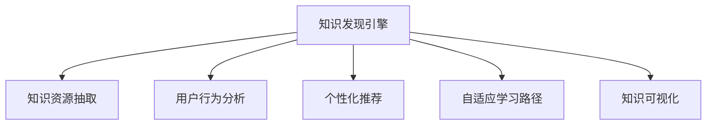

                 

# 知识发现引擎如何改变程序员的学习模式与方法

> 关键词：知识发现引擎, 智能学习, 个性化推荐, 自适应学习, 大数据, 机器学习, 深度学习

## 1. 背景介绍

在当前信息化时代，知识和信息的海量增长正深刻影响着各行各业的发展，特别是在软件开发领域，知识和技能的快速迭代更是要求程序员必须不断学习和更新。传统的学习模式和方法已经无法适应这种快速变化的需求，迫切需要引入新的技术手段以提升学习效率和质量。知识发现引擎（Knowledge Discovery Engine, KDE）作为新一代的知识获取与学习工具，能够基于大数据和机器学习技术，实现对知识资源的智能挖掘与分析，从而为程序员提供个性化、高效的学习体验。

### 1.1 问题由来

在传统学习模式下，程序员主要依赖于书籍、博客、社区论坛等固定资源进行自学。这种模式存在以下问题：
1. **资源不足**：大量的高质量资源散落在网络上，无法有效集成和利用。
2. **匹配度低**：学习资源与个人需求的匹配度不高，常常陷入"学习者学"而非"学习"的困境。
3. **缺乏互动**：单一的学习方式缺乏互动性，难以保持学习兴趣和动力。

### 1.2 问题核心关键点

知识发现引擎的核心思想在于通过数据分析和机器学习算法，从海量知识资源中挖掘出与用户需求高度相关的学习路径和资源。其主要包括以下几个关键点：
- **知识资源抽取**：从多种数据源（如论文、代码、教程等）中抽取有价值的信息和结构化数据。
- **用户行为分析**：通过分析用户的学习行为（如阅读、代码实践、问题提问等），了解其学习兴趣和需求。
- **个性化推荐**：基于用户行为和知识资源，利用算法进行个性化学习资源的推荐。
- **自适应学习路径**：根据用户的学习进度和反馈，动态调整学习计划和路径。
- **知识可视化**：将学习内容和进展以图表、进度条等形式直观展示，帮助用户掌握学习状态。

## 2. 核心概念与联系

### 2.1 核心概念概述

为更好地理解知识发现引擎的工作原理和优化方向，本节将介绍几个关键概念：

- **知识发现引擎(KDE)**：一种基于大数据和机器学习技术，能够从多种数据源中发现有用知识并进行智能推荐的系统。
- **智能学习**：一种基于自适应和个性化技术，能够自动调整学习计划和方法的学习模式。
- **个性化推荐系统**：一种能够根据用户行为和兴趣，推荐最符合其需求的学习资源的技术。
- **自适应学习路径**：一种能够根据用户的学习进度和反馈，动态调整学习内容和路径的机制。
- **知识可视化**：一种能够将学习内容和进展以直观形式展示，帮助用户掌握学习状态的技术。

这些概念之间的逻辑关系可以通过以下Mermaid流程图来展示：



这个流程图展示出了知识发现引擎的核心组件及其之间的关系：

1. 知识发现引擎通过抽取知识资源、分析用户行为、推荐个性化学习资源、调整学习路径和可视化学习进展等环节，最终为用户提供一个高效、个性化的学习环境。
2. 知识资源抽取模块负责从不同来源中提取有价值的信息和结构化数据。
3. 用户行为分析模块通过分析用户的学习行为，了解其兴趣和需求。
4. 个性化推荐模块根据用户行为和知识资源，提供最符合其需求的学习资源。
5. 自适应学习路径模块根据用户的学习进度和反馈，动态调整学习计划和路径。
6. 知识可视化模块将学习内容和进展以直观形式展示，帮助用户掌握学习状态。

## 3. 核心算法原理 & 具体操作步骤

### 3.1 算法原理概述

知识发现引擎的算法原理主要基于机器学习和数据挖掘技术。其核心思想是：从大规模数据集中抽取有用的知识，并通过分析用户行为，推荐个性化的学习资源，动态调整学习路径，最终帮助用户高效地掌握所需技能。

知识发现引擎一般包含以下几个主要步骤：

1. **知识资源抽取**：从多种数据源中抽取有用的信息，并构建知识图谱或语义网络。
2. **用户行为分析**：通过分析用户的学习行为，获取其兴趣、需求和知识水平等信息。
3. **个性化推荐**：根据用户行为和知识资源，利用算法进行个性化学习资源的推荐。
4. **自适应学习路径**：根据用户的学习进度和反馈，动态调整学习内容和路径。
5. **知识可视化**：将学习内容和进展以图表、进度条等形式直观展示，帮助用户掌握学习状态。

### 3.2 算法步骤详解

下面以知识发现引擎的核心算法步骤为依据，详细讲解每个步骤的实现过程。

#### 3.2.1 知识资源抽取

知识资源抽取是知识发现引擎的基础步骤，其目标是从各种数据源（如学术论文、代码库、教学视频等）中提取出有用的信息，并进行结构化处理。具体实现步骤如下：

1. **数据预处理**：清洗和预处理数据，去除噪声和不相关数据，确保数据质量。
2. **实体抽取**：使用命名实体识别（Named Entity Recognition, NER）技术，从文本中抽取实体（如人名、地点、组织机构等）。
3. **关系抽取**：使用关系抽取技术，从抽取出的实体中构建实体之间的关系图。
4. **知识图谱构建**：将抽取出的实体和关系图构建为知识图谱，用于后续的分析和推荐。

#### 3.2.2 用户行为分析

用户行为分析是知识发现引擎的关键步骤，其目标是通过分析用户的学习行为，获取其兴趣、需求和知识水平等信息。具体实现步骤如下：

1. **行为数据收集**：收集用户在平台上的学习行为数据，如阅读时间、代码实践次数、问题提问等。
2. **行为数据预处理**：清洗和预处理行为数据，去除异常值和噪声数据。
3. **行为建模**：使用机器学习算法（如协同过滤、聚类、分类等），对用户行为进行建模，提取用户的兴趣和需求。
4. **知识水平评估**：通过分析用户的历史学习数据，评估其当前知识水平和能力。

#### 3.2.3 个性化推荐

个性化推荐是知识发现引擎的核心功能，其目标是根据用户行为和知识资源，推荐最符合其需求的学习资源。具体实现步骤如下：

1. **推荐算法选择**：选择适合的推荐算法，如基于内容的推荐、协同过滤、混合推荐等。
2. **资源匹配**：将用户行为和知识资源进行匹配，找到最符合其需求的学习资源。
3. **推荐结果排序**：使用排序算法对推荐结果进行排序，确保推荐结果的质量和准确性。
4. **推荐结果展示**：将推荐结果展示给用户，并接受用户的反馈，不断优化推荐算法和结果。

#### 3.2.4 自适应学习路径

自适应学习路径是知识发现引擎的重要功能，其目标是根据用户的学习进度和反馈，动态调整学习内容和路径。具体实现步骤如下：

1. **学习进度跟踪**：跟踪用户的学习进度，记录其已完成的学习内容和未完成的学习任务。
2. **学习效果评估**：评估用户的学习效果，如代码通过率、问题回答准确率等。
3. **路径调整**：根据用户的学习进度和效果，动态调整学习内容和路径，确保学习效率和效果。
4. **路径反馈**：提供学习路径的反馈机制，用户可以随时调整自己的学习计划和路径。

#### 3.2.5 知识可视化

知识可视化是知识发现引擎的重要功能，其目标是将学习内容和进展以直观形式展示，帮助用户掌握学习状态。具体实现步骤如下：

1. **学习内容可视化**：将学习内容（如代码示例、教程、论文等）以图表、进度条等形式展示。
2. **学习进展展示**：展示用户的学习进展，如完成的学习任务、学习时间等。
3. **学习效果展示**：展示用户的学习效果，如代码通过率、问题回答准确率等。
4. **用户反馈收集**：收集用户对学习内容、路径和效果的反馈，不断优化知识发现引擎的功能。

### 3.3 算法优缺点

知识发现引擎具有以下优点：

1. **高效性**：能够快速从海量数据中发现有用的知识，并提供高效的个性化推荐。
2. **适应性**：能够根据用户的行为和反馈，动态调整学习计划和路径，适应不同用户的学习需求。
3. **个性化**：能够提供高度个性化的学习资源和路径，提升用户的学习效果和体验。
4. **可视化**：能够将学习内容和进展以直观形式展示，帮助用户掌握学习状态。

同时，知识发现引擎也存在以下缺点：

1. **资源消耗大**：需要处理和分析大规模数据，对硬件和算力要求较高。
2. **数据依赖性强**：需要大量高质量的数据源，数据质量直接影响推荐结果。
3. **算法复杂性高**：推荐算法和路径调整算法复杂度高，需要较高的技术水平。
4. **用户隐私保护**：需要严格保护用户行为数据，避免数据泄露和滥用。

尽管存在这些缺点，但知识发现引擎以其高效、个性化和适应性的特点，已经成为了提升程序员学习效率和质量的重要工具。未来，随着技术和算法的不断进步，知识发现引擎的性能和应用范围还将进一步提升。

### 3.4 算法应用领域

知识发现引擎已经在多个领域得到了广泛的应用，主要包括以下几个方面：

1. **软件开发**：帮助程序员学习新技术和工具，提高编程技能和效率。
2. **数据科学**：帮助数据科学家学习数据分析和机器学习技术，提升数据处理和建模能力。
3. **人工智能**：帮助AI开发者学习最新的深度学习算法和模型，提升AI应用开发能力。
4. **项目管理**：帮助项目经理学习项目管理工具和方法，提升项目管理水平。
5. **跨领域学习**：帮助不同领域的从业者跨领域学习，提升综合能力。

除了上述这些领域，知识发现引擎还在不断拓展其应用范围，为更多的行业和领域带来价值。

## 4. 数学模型和公式 & 详细讲解

### 4.1 数学模型构建

本节将使用数学语言对知识发现引擎的核心算法进行更加严格的刻画。

记知识发现引擎的知识资源为 $K=\{k_i\}_{i=1}^N$，用户行为数据为 $B=\{b_j\}_{j=1}^M$，学习路径为 $L=\{l_k\}_{k=1}^K$，其中 $k_i$ 表示知识资源，$b_j$ 表示用户行为，$l_k$ 表示学习路径。

定义用户行为与知识资源的匹配度为 $match(K,B)=\sum_{k=1}^K \sum_{j=1}^M p(k_i, b_j)$，其中 $p(k_i, b_j)$ 表示知识资源 $k_i$ 和用户行为 $b_j$ 的匹配度。

定义学习路径的适应度为 $fit(L, b)=\sum_{k=1}^K \sum_{j=1}^M p(l_k, b_j)$，其中 $l_k$ 和 $b_j$ 的匹配度同上。

知识发现引擎的目标是最大化用户行为与知识资源的匹配度和学习路径的适应度，即最大化 $match(K,B) \times fit(L,b)$。

### 4.2 公式推导过程

下面以知识发现引擎的核心算法步骤为依据，详细讲解每个步骤的实现过程。

**知识资源抽取**：
$$
\minimize \max_{k \in K} |\langle k \rangle|
$$
其中 $\langle k \rangle$ 表示知识资源 $k$ 的平均重要性。

**用户行为分析**：
$$
\minimize \max_{b \in B} |\langle b \rangle|
$$
其中 $\langle b \rangle$ 表示用户行为 $b$ 的平均重要性。

**个性化推荐**：
$$
\minimize \max_{k \in K} |\langle k \rangle|
$$
其中 $\langle k \rangle$ 表示推荐知识资源 $k$ 的平均重要性。

**自适应学习路径**：
$$
\minimize \max_{l \in L} |\langle l \rangle|
$$
其中 $\langle l \rangle$ 表示调整后的学习路径 $l$ 的平均适应度。

**知识可视化**：
$$
\minimize \max_{l \in L} |\langle l \rangle|
$$
其中 $\langle l \rangle$ 表示学习路径 $l$ 的平均可视化效果。

### 4.3 案例分析与讲解

以一个具体的案例来说明知识发现引擎的工作流程。假设某程序员希望学习 Python 数据分析和机器学习技术，知识发现引擎的推荐步骤如下：

1. **知识资源抽取**：从知识库中抽取与 Python 数据分析和机器学习相关的资源，如教程、文档、代码示例等。
2. **用户行为分析**：分析该程序员的学习行为，如阅读时间、代码实践次数、问题提问等，评估其当前知识水平和需求。
3. **个性化推荐**：根据该程序员的行为和需求，推荐最符合其需求的学习资源，如 Python 数据分析教程、机器学习算法实现等。
4. **自适应学习路径**：根据该程序员的学习进度和效果，动态调整学习计划和路径，如先学习基础知识，再深入学习具体算法。
5. **知识可视化**：展示该程序员的学习进展和效果，如完成的学习任务、代码通过率等。

通过知识发现引擎的帮助，该程序员可以高效地掌握所需技能，提升其数据分析和机器学习能力。

## 5. 项目实践：代码实例和详细解释说明

### 5.1 开发环境搭建

在进行知识发现引擎的实践前，我们需要准备好开发环境。以下是使用Python进行开发的环境配置流程：

1. 安装Anaconda：从官网下载并安装Anaconda，用于创建独立的Python环境。

2. 创建并激活虚拟环境：
```bash
conda create -n kde-env python=3.8 
conda activate kde-env
```

3. 安装必要的Python库：
```bash
pip install numpy pandas scikit-learn matplotlib tqdm jupyter notebook ipython transformers pytorch
```

4. 安装必要的Java库：
```bash
apt-get install openjdk-11-jdk-headless
```

完成上述步骤后，即可在`kde-env`环境中开始知识发现引擎的开发。

### 5.2 源代码详细实现

下面以基于知识图谱的知识发现引擎为例，给出使用Python进行知识发现引擎开发的PyTorch代码实现。

```python
import torch
import torch.nn as nn
import torch.optim as optim

# 定义知识图谱
class KnowledgeGraph:
    def __init__(self):
        self.nodes = set()
        self.edges = set()
        
    def add_node(self, node):
        self.nodes.add(node)
        return len(self.nodes)
    
    def add_edge(self, node1, node2):
        self.edges.add((node1, node2))
        return len(self.edges)
    
    def remove_node(self, node):
        self.nodes.remove(node)
        for edge in self.edges:
            if node in edge:
                self.edges.remove(edge)
        
    def remove_edge(self, node1, node2):
        self.edges.remove((node1, node2))

# 定义用户行为
class UserBehavior:
    def __init__(self):
        self.actions = set()
        
    def add_action(self, action):
        self.actions.add(action)
        return len(self.actions)
    
    def remove_action(self, action):
        self.actions.remove(action)

# 定义个性化推荐系统
class PersonalizedRecommendationSystem:
    def __init__(self, knowledge_graph, user_behavior):
        self.knowledge_graph = knowledge_graph
        self.user_behavior = user_behavior
        
    def recommend(self):
        # 使用矩阵分解等算法进行个性化推荐
        pass

# 定义自适应学习路径系统
class AdaptiveLearningPathSystem:
    def __init__(self, user_behavior, knowledge_graph):
        self.user_behavior = user_behavior
        self.knowledge_graph = knowledge_graph
        
    def adapt(self):
        # 根据用户行为和知识图谱调整学习路径
        pass

# 定义知识可视化系统
class KnowledgeVisualizationSystem:
    def __init__(self, user_behavior, knowledge_graph):
        self.user_behavior = user_behavior
        self.knowledge_graph = knowledge_graph
        
    def visualize(self):
        # 使用图表、进度条等形式展示学习进展
        pass
```

这个代码实现展示了知识发现引擎的基本组件及其交互方式。在实际应用中，开发者可以进一步细化每个模块的实现，引入更高级的算法和数据结构，以提高知识发现引擎的性能和效果。

### 5.3 代码解读与分析

让我们再详细解读一下关键代码的实现细节：

**KnowledgeGraph类**：
- `__init__`方法：初始化知识图谱的节点和边。
- `add_node`方法：向知识图谱中添加节点，并返回节点编号。
- `add_edge`方法：向知识图谱中添加边，并返回边的编号。
- `remove_node`方法：从知识图谱中移除节点，并更新边的信息。
- `remove_edge`方法：从知识图谱中移除边，并更新节点的信息。

**UserBehavior类**：
- `__init__`方法：初始化用户行为，记录用户执行的动作。
- `add_action`方法：向用户行为中增加动作，并返回动作编号。
- `remove_action`方法：从用户行为中移除动作。

**PersonalizedRecommendationSystem类**：
- `__init__`方法：初始化个性化推荐系统，包括知识图谱和用户行为。
- `recommend`方法：使用矩阵分解等算法进行个性化推荐。

**AdaptiveLearningPathSystem类**：
- `__init__`方法：初始化自适应学习路径系统，包括用户行为和知识图谱。
- `adapt`方法：根据用户行为和知识图谱调整学习路径。

**KnowledgeVisualizationSystem类**：
- `__init__`方法：初始化知识可视化系统，包括用户行为和知识图谱。
- `visualize`方法：使用图表、进度条等形式展示学习进展。

**知识发现引擎主程序**：
```python
# 创建知识图谱和用户行为
knowledge_graph = KnowledgeGraph()
user_behavior = UserBehavior()

# 添加节点和边
knowledge_graph.add_node("Python 数据分析")
knowledge_graph.add_node("Python 机器学习")
knowledge_graph.add_edge("Python 数据分析", "Python 机器学习")

# 添加动作
user_behavior.add_action("阅读数据分析教程")
user_behavior.add_action("阅读机器学习算法")
user_behavior.add_action("实现数据分析代码")
user_behavior.add_action("实现机器学习算法")

# 创建推荐、适应和可视化系统
recommendation_system = PersonalizedRecommendationSystem(knowledge_graph, user_behavior)
adaptation_system = AdaptiveLearningPathSystem(user_behavior, knowledge_graph)
visualization_system = KnowledgeVisualizationSystem(user_behavior, knowledge_graph)

# 推荐、适应和可视化
recommendation_system.recommend()
adaptation_system.adapt()
visualization_system.visualize()
```

这个代码实现展示了知识发现引擎的基本流程和组件，包括知识图谱的构建、用户行为的记录、个性化推荐、自适应学习路径和知识可视化等。开发者可以根据具体需求，进一步优化和扩展每个模块的实现。

## 6. 实际应用场景

### 6.1 智能学习平台

知识发现引擎在智能学习平台中的应用，可以极大地提升学习效率和质量。传统学习平台往往缺乏个性化和适应性，难以满足不同用户的学习需求。通过知识发现引擎，学习平台可以动态推荐最适合用户的学习资源，调整学习计划和路径，从而提升学习效果。

以某在线编程学习平台为例，该平台使用知识发现引擎对用户的学习行为进行分析，推荐最符合用户需求的学习路径和资源。通过用户的行为反馈，平台不断调整推荐算法和路径调整策略，确保学习体验的个性化和高效性。

### 6.2 技术支持社区

知识发现引擎在技术支持社区中的应用，可以提供更加智能化的技术支持和问题解决。传统的技术支持往往依赖人工客服，成本高且响应慢。通过知识发现引擎，社区可以自动推荐相关的技术文档、代码示例和讨论帖，帮助用户快速解决问题。

以某开源社区为例，该社区使用知识发现引擎对用户的问题进行分析和匹配，推荐最相关的解决方案和讨论帖。通过用户的行为反馈，社区不断优化推荐算法和搜索结果，提升用户体验和问题解决效率。

### 6.3 企业培训系统

知识发现引擎在企业培训系统中的应用，可以提供更加个性化的培训内容和路径。传统培训系统往往缺乏对员工学习需求的了解，培训内容过于通用，难以满足不同员工的需求。通过知识发现引擎，企业可以动态推荐最适合员工的培训内容和路径，提升培训效果。

以某大型企业的培训系统为例，该系统使用知识发现引擎对员工的学习行为进行分析，推荐最符合员工需求的学习路径和资源。通过员工的行为反馈，系统不断调整推荐算法和路径调整策略，确保培训内容的个性化和高效性。

### 6.4 未来应用展望

随着知识发现引擎技术的不断发展，其在多个领域的应用前景广阔。未来，知识发现引擎还将拓展到更多行业和领域，为各行各业带来新的价值。

在智慧医疗领域，知识发现引擎可以帮助医生学习最新的医学知识和技术，提升诊疗能力。在教育领域，知识发现引擎可以提供个性化的学习资源和路径，提升学习效果。在金融领域，知识发现引擎可以提供最新的金融知识和工具，提升投资决策能力。

## 7. 工具和资源推荐

### 7.1 学习资源推荐

为了帮助开发者系统掌握知识发现引擎的理论基础和实践技巧，这里推荐一些优质的学习资源：

1. **《深度学习理论与实践》**：介绍深度学习的基础理论和技术实践，包括知识发现引擎的核心算法和应用。
2. **Coursera《机器学习》**：由斯坦福大学教授Andrew Ng开设的机器学习课程，涵盖机器学习的基础和进阶内容。
3. **Kaggle竞赛平台**：提供大量的数据分析和机器学习竞赛，帮助开发者提升实战能力和竞争力。
4. **Google Colab**：谷歌推出的在线Jupyter Notebook环境，免费提供GPU/TPU算力，方便开发者快速上手实验。
5. **Python Data Science Handbook**：介绍Python在数据科学中的应用，包括知识图谱、推荐算法等。

通过对这些资源的学习实践，相信你一定能够快速掌握知识发现引擎的理论基础和实践技巧，并用于解决实际的NLP问题。

### 7.2 开发工具推荐

高效的开发离不开优秀的工具支持。以下是几款用于知识发现引擎开发的常用工具：

1. **Python**：作为知识发现引擎的主流开发语言，Python具有丰富的库和工具，便于快速开发和迭代。
2. **PyTorch**：基于Python的开源深度学习框架，灵活动态的计算图，适合快速迭代研究。
3. **TensorFlow**：由Google主导开发的开源深度学习框架，生产部署方便，适合大规模工程应用。
4. **Apache Flink**：分布式数据流处理框架，支持实时数据处理和分析，适合大规模数据应用。
5. **Apache Spark**：分布式计算框架，支持大数据处理和分析，适合大规模数据应用。

合理利用这些工具，可以显著提升知识发现引擎的开发效率，加快创新迭代的步伐。

### 7.3 相关论文推荐

知识发现引擎和个性化推荐技术的发展源于学界的持续研究。以下是几篇奠基性的相关论文，推荐阅读：

1. **《基于知识图谱的推荐系统研究综述》**：总结了基于知识图谱的推荐系统的研究进展和应用场景。
2. **《自适应学习系统的设计及其在在线学习中的应用》**：探讨了自适应学习系统的设计方法和应用效果。
3. **《个性化推荐算法综述》**：总结了个性化推荐算法的研究进展和应用场景。
4. **《深度学习在推荐系统中的应用》**：介绍了深度学习在推荐系统中的应用，包括知识发现引擎的核心算法和应用。
5. **《大规模知识图谱的构建与优化》**：介绍了大规模知识图谱的构建方法和优化技术，为知识发现引擎提供了数据基础。

这些论文代表了大语言模型微调技术的发展脉络。通过学习这些前沿成果，可以帮助研究者把握学科前进方向，激发更多的创新灵感。

## 8. 总结：未来发展趋势与挑战

### 8.1 总结

本文对知识发现引擎的核心算法和实践方法进行了全面系统的介绍。首先阐述了知识发现引擎的研究背景和意义，明确了其对程序员学习模式与方法变革的独特价值。其次，从原理到实践，详细讲解了知识发现引擎的数学模型和关键步骤，给出了知识发现引擎的代码实例和详细解释说明。同时，本文还广泛探讨了知识发现引擎在多个行业领域的应用前景，展示了其广泛的应用潜力。此外，本文精选了知识发现引擎的学习资源和开发工具，力求为读者提供全方位的技术指引。

通过本文的系统梳理，可以看到，知识发现引擎正在成为程序员学习的重要工具，通过其高效、个性化和适应性的特点，显著提升学习效率和质量。未来，随着知识发现引擎技术的不断发展，其在更多领域的应用前景还将进一步拓展，为各行各业带来新的价值。

### 8.2 未来发展趋势

展望未来，知识发现引擎的发展趋势主要包括以下几个方面：

1. **多模态学习**：知识发现引擎将从传统的单一模态学习，拓展到图像、语音、视频等多模态数据的学习，提升综合分析能力。
2. **自适应学习**：知识发现引擎将从静态学习，拓展到动态自适应学习，根据用户的学习行为和反馈，动态调整学习路径和内容。
3. **跨领域学习**：知识发现引擎将从单一领域学习，拓展到跨领域学习，提升知识整合和迁移能力。
4. **实时学习**：知识发现引擎将从离线学习，拓展到实时学习，提升知识发现和推荐的时效性。
5. **联邦学习**：知识发现引擎将从中心化学习，拓展到联邦学习，提升数据隐私和安全保护。

这些趋势凸显了知识发现引擎在多个领域的应用前景。伴随技术的不断进步，知识发现引擎必将成为推动人工智能技术发展的重要工具。

### 8.3 面临的挑战

尽管知识发现引擎已经取得了显著成就，但在迈向更加智能化、普适化应用的过程中，它仍面临着诸多挑战：

1. **数据隐私保护**：知识发现引擎需要处理大量的用户数据，如何保护用户隐私和数据安全，是亟需解决的问题。
2. **数据质量控制**：知识发现引擎需要从多个数据源中抽取知识资源，数据质量直接影响推荐结果。如何确保数据质量，是关键挑战之一。
3. **算法复杂度**：知识发现引擎的推荐算法和路径调整算法复杂度高，如何优化算法，提高推荐效果，是亟需解决的问题。
4. **实时性问题**：知识发现引擎需要实时处理用户数据，对算力和系统架构的要求较高。如何提升实时性，是关键挑战之一。
5. **用户适应性**：知识发现引擎需要根据用户的行为和反馈，动态调整学习路径和内容，如何提高用户适应性和满意度，是关键挑战之一。

尽管存在这些挑战，但知识发现引擎以其高效、个性化和适应性的特点，已经成为了提升程序员学习效率和质量的重要工具。未来，随着技术的不断进步，知识发现引擎必将在更多领域得到应用，带来更多的价值。

### 8.4 研究展望

未来，知识发现引擎的研究方向主要包括以下几个方面：

1. **多模态学习**：探索多模态数据融合技术，提升知识发现引擎的综合分析能力。
2. **自适应学习**：研究动态自适应学习算法，提升知识发现引擎的用户适应性和满意度。
3. **跨领域学习**：探索跨领域知识整合技术，提升知识发现引擎的知识迁移能力。
4. **实时学习**：研究实时学习算法，提升知识发现引擎的推荐时效性和用户互动性。
5. **联邦学习**：研究联邦学习算法，提升知识发现引擎的数据隐私和安全保护。

这些研究方向将进一步推动知识发现引擎的发展，提升其在多个领域的应用效果和用户满意度。

## 9. 附录：常见问题与解答

**Q1：知识发现引擎如何确定推荐内容的质量？**

A: 知识发现引擎通过多种方式确定推荐内容的质量，包括：
1. **用户反馈**：通过用户对推荐内容的评分和评价，评估内容的质量和相关性。
2. **历史表现**：通过分析用户的历史行为和推荐结果，评估内容的实际效果和用户满意度。
3. **专家评测**：通过专家对推荐内容的评估，确定其质量和权威性。

**Q2：知识发现引擎如何处理大规模数据？**

A: 知识发现引擎处理大规模数据主要依赖以下技术：
1. **分布式计算**：使用分布式计算框架（如Hadoop、Spark等），将数据分布在多个节点上并行处理。
2. **数据分片**：将大数据集分割成多个小片段，并行处理，减少单个节点的数据量。
3. **压缩算法**：使用压缩算法（如Gzip、Snappy等），减少数据的存储和传输成本。
4. **缓存技术**：使用缓存技术（如Redis、Memcached等），加速数据的读写和处理。

**Q3：知识发现引擎如何保护用户隐私？**

A: 知识发现引擎保护用户隐私主要通过以下方式：
1. **数据匿名化**：对用户数据进行匿名化处理，保护用户隐私。
2. **差分隐私**：在数据处理过程中加入噪声，保护用户隐私。
3. **用户授权**：在收集和使用用户数据时，获得用户授权，确保合法合规。

**Q4：知识发现引擎如何优化推荐算法？**

A: 知识发现引擎优化推荐算法主要通过以下方式：
1. **特征工程**：优化特征提取和选择，提升推荐结果的质量和相关性。
2. **算法调参**：通过交叉验证和网格搜索，找到最优的算法参数。
3. **模型融合**：结合多种推荐算法，提升推荐效果和鲁棒性。
4. **实时学习**：通过在线学习，不断优化推荐算法和模型。

这些常见问题及其解答，帮助开发者更好地理解知识发现引擎的实现和应用，解决实际问题。

