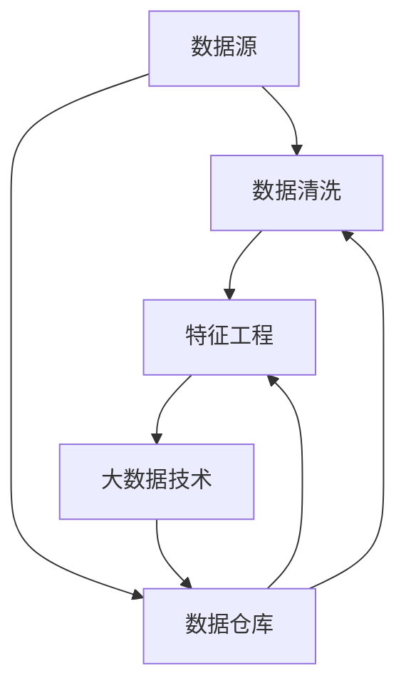

                 

# 知识发现引擎的数据源获取与处理

> 关键词：知识发现引擎, 数据源获取, 数据处理, 数据清洗, 特征工程, 大数据技术, 数据仓库

## 1. 背景介绍

### 1.1 问题由来

随着人工智能（AI）技术的快速发展，知识发现引擎（Knowledge Discovery Engine, KDE）成为了推动大数据分析和应用的关键工具。知识发现引擎通过从大规模数据中提取有价值的信息和知识，帮助企业做出更科学的决策。然而，知识发现过程的首要难题之一是如何高效获取和处理数据。

在实际应用中，数据源可能来自不同的系统平台和格式，且数据质量参差不齐，这对知识发现过程带来了极大挑战。如何从这些复杂且异构的数据源中获取高质量的数据，并有效清洗和处理数据，是知识发现引擎设计的核心问题。

### 1.2 问题核心关键点

在知识发现引擎中，数据源获取与处理主要包括以下几个方面：

- 数据源的多样性：数据可能来自不同的系统平台（如关系数据库、非关系数据库、云存储、日志文件等），具有不同的数据格式和存储方式。
- 数据量的庞大性：知识发现引擎需要处理大量的数据，动辄数TB、PB级别的数据集。
- 数据质量的波动性：数据源的质量不稳定，可能包含噪声、缺失值、异常值等，需要预处理来提升数据质量。
- 数据处理的效率性：知识发现引擎需要在较短时间内处理海量数据，以实现实时或近实时分析。
- 数据处理的灵活性：知识发现引擎需要支持多种数据分析任务，如分类、聚类、关联规则挖掘、预测等。

## 2. 核心概念与联系

### 2.1 核心概念概述

为更好地理解知识发现引擎的数据源获取与处理流程，本节将介绍几个密切相关的核心概念：

- **数据源**：指被知识发现引擎用于数据分析的数据集，可能来自不同的数据平台和存储方式，如数据库、文件系统、云存储等。
- **数据清洗**：指通过预处理去除数据中的噪声、异常值、重复值等，以提升数据质量和可用性。
- **特征工程**：指从原始数据中提取和构建新的特征，以提高模型训练的效率和效果。
- **大数据技术**：指用于处理和分析大规模数据的技术，如Hadoop、Spark、Flink等。
- **数据仓库**：指用于存储和管理企业数据的中心化数据库，便于数据集成和共享。

这些核心概念之间的逻辑关系可以通过以下Mermaid流程图来展示：



这个流程图展示了大规模数据源获取与处理的基本流程：

1. 数据源被引入系统，进行预处理。
2. 清洗后的数据进入特征工程环节，提取和构建新特征。
3. 特征工程结果进入大数据技术平台，进行分布式处理和分析。
4. 处理后的数据可以存入数据仓库，便于后续查询和分析。

## 3. 核心算法原理 & 具体操作步骤

### 3.1 算法原理概述

知识发现引擎的数据源获取与处理主要依赖于数据清洗和特征工程两个核心算法，它们通过预处理和转换原始数据，提取有价值的信息和特征，为后续的数据分析和知识发现奠定基础。

- **数据清洗**：旨在从数据中去除噪声、异常值、重复值等，提升数据质量和可用性。常用的数据清洗技术包括去重、填补缺失值、删除异常值等。
- **特征工程**：指通过转换和提取原始数据中的特征，提升模型训练的效果和性能。常用的特征工程方法包括特征提取、特征转换、特征选择等。

### 3.2 算法步骤详解

**数据清洗步骤：**

1. **数据读取**：根据不同数据源的特点，选择适合的数据读取工具和方法，将数据加载到内存或分布式存储系统中。
2. **去重处理**：通过对比数据集中的重复记录，去除不必要的重复数据，避免数据冗余。
3. **缺失值填补**：对于缺失值，根据数据的实际情况选择填充策略，如均值填充、中位数填充、插值法等。
4. **异常值检测与处理**：通过统计方法或机器学习算法，识别并处理异常值，如删除、替换等。
5. **格式转换**：将数据转换为统一的格式，如从CSV格式转换为JSON格式，便于后续处理。

**特征工程步骤：**

1. **特征提取**：从原始数据中提取有用的特征，如从文本数据中提取词频、TF-IDF等特征。
2. **特征转换**：对提取的特征进行转换，如将分类型特征进行one-hot编码，将数值型特征进行归一化等。
3. **特征选择**：根据数据分析任务和模型需求，选择最有价值的特征，如使用相关系数、特征重要性评分等方法。
4. **特征构建**：通过组合和变换已有特征，构造新的特征，如组合特征、交互特征等。

### 3.3 算法优缺点

**数据清洗算法：**

优点：
1. 提升数据质量：清洗后的数据更符合实际需求，减少噪声和异常值的干扰。
2. 简化后续处理：清洗后的数据更易于处理和分析，降低模型训练的难度。

缺点：
1. 数据损失风险：清洗过程中可能丢失一些有用信息，影响数据分析的全面性。
2. 处理成本高：数据清洗需要消耗大量时间和计算资源，特别是面对大规模数据集时。

**特征工程算法：**

优点：
1. 提高模型性能：通过优化特征，可以提升模型的训练效果和预测能力。
2. 增强数据解释性：特征工程有助于理解数据的本质特征，便于模型解释和调试。

缺点：
1. 工作量巨大：特征工程需要人工干预，工作量巨大且复杂度较高。
2. 存在主观性：特征工程的决策具有主观性，可能导致结果的不稳定性。

**大数据技术：**

优点：
1. 处理海量数据：大数据技术能够高效处理大规模数据集，支持分布式计算。
2. 提升分析速度：通过并行处理，大数据技术能够显著提升数据分析的速度。

缺点：
1. 技术门槛高：大数据技术需要一定的技术背景和工具熟练度，学习成本较高。
2. 资源消耗大：大数据技术需要大量的计算资源，成本较高。

**数据仓库：**

优点：
1. 数据集成与共享：数据仓库集中存储和管理企业数据，便于数据集成和共享。
2. 支持多维度分析：数据仓库提供多维度查询和分析功能，便于数据分析和决策。

缺点：
1. 维护成本高：数据仓库需要定期维护和更新，维护成本较高。
2. 延迟问题：数据仓库的查询和更新操作可能存在延迟，影响实时性。

## 4. 数学模型和公式 & 详细讲解 & 举例说明

### 4.1 数学模型构建

本节将使用数学语言对知识发现引擎的数据源获取与处理流程进行更加严格的刻画。

设原始数据集为 $D=\{(x_i, y_i)\}_{i=1}^N$，其中 $x_i$ 为特征向量，$y_i$ 为标签或目标变量。假设数据集中存在噪声 $\epsilon_i$，则数据清洗模型可以表示为：

$$
x'_i = f(x_i, \epsilon_i)
$$

其中 $f$ 为清洗函数，用于去除噪声和异常值。特征工程模型可以表示为：

$$
x''_i = g(x'_i)
$$

其中 $g$ 为特征工程函数，用于提取和构建新特征。

### 4.2 公式推导过程

以下我们以文本数据清洗为例，推导去重和缺失值填补的数学公式。

假设原始文本数据集为 $D=\{x_1, x_2, \ldots, x_n\}$，存在重复文本 $x_i=x_j$。为了去除重复文本，可以定义去重函数 $g$，计算所有文本的哈希值，并将哈希值相同的文本视为重复文本，删除其中的一个：

$$
g(x_i) = \begin{cases} 
x_i & \text{哈希值唯一} \\
\text{随机选择一个} & \text{哈希值重复}
\end{cases}
$$

对于缺失值填补，假设文本数据集中某特征 $x_i$ 的缺失值为 $x_i^*$，则填补公式可以表示为：

$$
x_i = \begin{cases} 
x_i & \text{存在} \\
\overline{x} & \text{缺失}
\end{cases}
$$

其中 $\overline{x}$ 为填补值，可以是均值、中位数、插值等策略。

### 4.3 案例分析与讲解

假设有一份包含客户交易记录的数据集 $D=\{(x_i, y_i)\}_{i=1}^N$，其中 $x_i$ 为客户的购买记录，$y_i$ 为客户的消费水平。数据集存在重复记录和缺失值，需要进行清洗和处理：

1. **去重处理**：通过哈希函数计算每条记录的哈希值，将哈希值重复的记录删除一个。
2. **填补缺失值**：对于缺失的购买记录，可以选择使用均值填补策略，即用客户总消费水平的平均值作为填补值。
3. **特征提取**：从购买记录中提取客户购买频率、购买金额等特征。
4. **特征转换**：将购买频率转换为one-hot编码，将购买金额进行归一化。
5. **特征选择**：根据消费水平模型的需求，选择购买频率和归一化后的购买金额作为重要特征。

## 5. 项目实践：代码实例和详细解释说明

### 5.1 开发环境搭建

在进行数据源获取与处理实践前，我们需要准备好开发环境。以下是使用Python进行PyTorch开发的环境配置流程：

1. 安装Anaconda：从官网下载并安装Anaconda，用于创建独立的Python环境。

2. 创建并激活虚拟环境：
```bash
conda create -n data-env python=3.8 
conda activate data-env
```

3. 安装PyTorch：根据CUDA版本，从官网获取对应的安装命令。例如：
```bash
conda install pytorch torchvision torchaudio cudatoolkit=11.1 -c pytorch -c conda-forge
```

4. 安装相关库：
```bash
pip install pandas numpy matplotlib tqdm jupyter notebook ipython
```

完成上述步骤后，即可在`data-env`环境中开始数据源获取与处理的实践。

### 5.2 源代码详细实现

下面我们以文本数据清洗为例，给出使用Python进行文本清洗和特征工程的代码实现。

首先，定义数据清洗函数：

```python
import pandas as pd

def clean_data(df):
    # 去重处理
    df = df.drop_duplicates()
    
    # 填补缺失值
    df = df.fillna(df.mean())
    
    return df
```

然后，定义特征工程函数：

```python
def feature_engineering(df):
    # 特征提取
    df['purchase_frequency'] = df['purchase_amount'].apply(lambda x: x.count())
    df['purchase_amount'] = df['purchase_amount'] / df['purchase_amount'].sum()
    
    # 特征转换
    df['purchase_frequency'] = pd.get_dummies(df['purchase_frequency'])
    
    return df
```

最后，启动数据清洗和特征工程的流程：

```python
# 读取数据
df = pd.read_csv('transaction_data.csv')

# 数据清洗
df_cleaned = clean_data(df)

# 特征工程
df_processed = feature_engineering(df_cleaned)
```

以上就是使用Python进行文本数据清洗和特征工程的完整代码实现。可以看到，借助Pandas库，我们能够快速实现数据的清洗和特征处理。

### 5.3 代码解读与分析

让我们再详细解读一下关键代码的实现细节：

**clean_data函数**：
- 去重处理：使用`drop_duplicates`方法去除数据集中的重复记录。
- 填补缺失值：使用`fillna`方法，将缺失值用数据集的均值进行填补。

**feature_engineering函数**：
- 特征提取：计算购买次数和购买金额的频率和归一化值。
- 特征转换：使用`get_dummies`方法将购买次数转换为one-hot编码。

**流程启动**：
- 读取数据：使用`read_csv`方法从文件中读取数据。
- 数据清洗：调用`clean_data`函数进行数据清洗。
- 特征工程：调用`feature_engineering`函数进行特征处理。

可以看到，借助Pandas库，我们能够快速实现数据清洗和特征工程，而无需编写大量的低层细节代码。

当然，工业级的系统实现还需考虑更多因素，如数据源的多样性、分布式处理、数据仓库集成等。但核心的数据清洗和特征工程逻辑基本与此类似。

## 6. 实际应用场景

### 6.1 智慧城市数据管理

智慧城市是一个典型的知识发现应用场景。通过集成来自不同部门和系统的数据，智慧城市可以提供实时的交通、环境、公共服务等方面的信息，提升城市管理和居民生活体验。

在实践中，智慧城市可以采用知识发现引擎从多个数据源获取数据，进行清洗和处理。清洗后的数据可以进行分析和可视化，帮助城市管理者识别问题，制定解决方案。同时，通过特征工程，可以从历史数据中提取有价值的信息，如交通流量、环境污染指数等，用于预测和预警。

### 6.2 金融风险控制

金融行业面临复杂的风险管理需求，需要实时监控市场动态，评估客户信用等。知识发现引擎可以集成多种数据源，如交易数据、客户行为数据、市场数据等，进行数据清洗和处理。清洗后的数据可以用于实时监控和预警，帮助金融机构识别潜在风险，降低损失。

### 6.3 电子商务个性化推荐

电子商务平台需要根据用户行为和偏好，推荐个性化的商品和服务。知识发现引擎可以集成用户行为数据、商品数据、市场数据等，进行数据清洗和处理。清洗后的数据可以用于构建推荐模型，通过特征工程，提取用户行为特征和商品特征，提升推荐效果。

### 6.4 未来应用展望

随着知识发现技术的不断进步，未来在更多领域都将出现基于数据源获取与处理的知识发现应用。

在医疗健康领域，知识发现引擎可以从电子病历、基因数据、公共卫生数据中提取有价值的信息，帮助医生制定个性化治疗方案，提升医疗水平。

在智能制造领域，知识发现引擎可以从设备数据、生产数据、市场数据中提取信息，帮助企业优化生产流程，提高生产效率。

在环境保护领域，知识发现引擎可以从环境监测数据、气象数据、公众反馈数据中提取信息，帮助政府制定环境政策，改善环境质量。

此外，在教育、农业、物流等众多领域，知识发现引擎都将发挥重要作用，推动各行业的数字化转型升级。

## 7. 工具和资源推荐

### 7.1 学习资源推荐

为了帮助开发者系统掌握知识发现引擎的理论基础和实践技巧，这里推荐一些优质的学习资源：

1. 《大数据技术基础》系列博文：由数据科学专家撰写，详细介绍了大数据技术的核心原理和应用实践。

2. 《Python数据科学手册》书籍：该书系统讲解了使用Python进行数据分析和处理的技术和工具，适合初学者学习。

3. 《深度学习基础》课程：斯坦福大学开设的深度学习课程，讲解了深度学习的基本概念和算法，适合数据分析师和机器学习工程师。

4. Kaggle数据科学竞赛平台：提供了大量的真实数据集和挑战任务，可以帮助开发者锻炼数据分析和处理能力。

5. HuggingFace官方文档：Transformer库的官方文档，提供了海量预训练模型和完整的代码样例，是进行数据处理和分析的必备资料。

通过对这些资源的学习实践，相信你一定能够快速掌握知识发现引擎的核心技术和方法，并用于解决实际的业务问题。

### 7.2 开发工具推荐

高效的开发离不开优秀的工具支持。以下是几款用于知识发现引擎开发常用的工具：

1. Apache Spark：用于分布式处理大规模数据的开源平台，支持多种数据源和处理任务。

2. Apache Hadoop：用于分布式存储和管理大规模数据的开源平台，适用于海量数据的存储和处理。

3. Python Pandas库：提供高效的数据处理和分析功能，支持多种数据源和数据操作。

4. Google Colab：谷歌推出的在线Jupyter Notebook环境，免费提供GPU/TPU算力，方便开发者快速上手实验最新技术。

5. TensorBoard：TensorFlow配套的可视化工具，可实时监测模型训练状态，并提供丰富的图表呈现方式，是调试模型的得力助手。

6. Weights & Biases：模型训练的实验跟踪工具，可以记录和可视化模型训练过程中的各项指标，方便对比和调优。

合理利用这些工具，可以显著提升知识发现引擎的开发效率，加快创新迭代的步伐。

### 7.3 相关论文推荐

知识发现引擎的发展源于学界的持续研究。以下是几篇奠基性的相关论文，推荐阅读：

1. "A Survey of Data Cleaning Techniques"（数据清洗技术综述）：该文总结了常用的数据清洗方法和技术，适合初学者入门。

2. "Feature Engineering for Predictive Modeling: A Practical Guide"（特征工程实践指南）：该文详细介绍了特征工程的方法和实践，适合实战开发者参考。

3. "Big Data Computing: Concepts and Technology"（大数据计算概念与技术）：该文介绍了大数据计算的核心原理和实践，适合对大数据技术有深入需求的开发者。

4. "Data Warehousing: Concepts and Technologies"（数据仓库概念与技术）：该文介绍了数据仓库的核心概念和实现技术，适合对数据仓库有深入需求的开发者。

这些论文代表了大规模数据源获取与处理技术的发展脉络。通过学习这些前沿成果，可以帮助研究者把握学科前进方向，激发更多的创新灵感。

## 8. 总结：未来发展趋势与挑战

### 8.1 总结

本文对知识发现引擎的数据源获取与处理方法进行了全面系统的介绍。首先阐述了知识发现引擎在数据源多样性、数据量庞大性、数据质量波动性、数据处理效率性、数据处理灵活性等方面的背景和挑战。其次，从原理到实践，详细讲解了数据清洗和特征工程这两个核心算法，给出了数据源获取与处理的完整代码实例。同时，本文还广泛探讨了数据源获取与处理技术在智慧城市、金融风险控制、电子商务等多个行业领域的应用前景，展示了数据源获取与处理范式的巨大潜力。此外，本文精选了数据源获取与处理技术的各类学习资源，力求为读者提供全方位的技术指引。

通过本文的系统梳理，可以看到，知识发现引擎的数据源获取与处理技术正在成为数据密集型行业的重要范式，极大地提升了数据处理和分析的效率和效果。未来，伴随知识发现技术的不断演进，数据源获取与处理技术还将进一步优化和完善，为各行各业带来更加智能、高效、安全的数据应用方案。

### 8.2 未来发展趋势

展望未来，知识发现引擎的数据源获取与处理技术将呈现以下几个发展趋势：

1. 自动化和智能化：随着人工智能技术的不断进步，数据清洗和特征工程将逐步实现自动化和智能化，减少人工干预，提升处理效率。

2. 实时化和自动化：知识发现引擎需要支持实时数据处理和分析，以适应快速变化的市场和业务需求。未来，数据清洗和特征工程将逐步实现自动化和实时化，支持数据的流式处理和实时分析。

3. 数据治理和合规性：随着数据安全与合规性要求不断提高，数据源获取与处理技术将更加注重数据治理和隐私保护，确保数据处理的合法性和安全性。

4. 多模态数据融合：未来，数据源获取与处理技术将支持多模态数据的融合，如文本、图像、音频等多源数据的统一处理和分析，提升数据分析的全面性和深度。

5. 可解释性和可解释性：知识发现引擎的数据源获取与处理技术需要具备更好的可解释性，能够清晰地解释数据处理和分析的每一步，增强系统的透明性和可信度。

以上趋势凸显了知识发现引擎数据源获取与处理技术的广阔前景。这些方向的探索发展，必将进一步提升知识发现引擎的数据处理和分析能力，为各行业带来更加智能、高效、安全的数据应用方案。

### 8.3 面临的挑战

尽管知识发现引擎的数据源获取与处理技术已经取得了瞩目成就，但在迈向更加智能化、普适化应用的过程中，它仍面临着诸多挑战：

1. 数据治理问题：数据源多样性带来的数据治理挑战，如何规范数据采集、存储、清洗和处理，是一个复杂的系统工程。

2. 数据质量问题：数据源的质量不稳定，可能包含噪声、缺失值、异常值等，如何处理这些数据，提升数据质量，是一个重要的技术难题。

3. 数据安全问题：数据源获取与处理过程中涉及大量敏感信息，如何确保数据安全和隐私保护，是一个不容忽视的挑战。

4. 技术复杂性：数据源获取与处理技术需要综合运用多种技术和工具，技术复杂度较高，对开发者的技术水平要求较高。

5. 资源消耗问题：数据源获取与处理技术需要消耗大量的计算资源，特别是大数据技术的应用，对硬件资源要求较高。

正视知识发现引擎数据源获取与处理技术面临的这些挑战，积极应对并寻求突破，将使该技术更加成熟和完善，为数据密集型行业提供更加智能、高效、安全的数据应用方案。

### 8.4 研究展望

面对知识发现引擎数据源获取与处理技术所面临的挑战，未来的研究需要在以下几个方面寻求新的突破：

1. 探索无监督和半监督数据清洗方法：摆脱对大规模标注数据的依赖，利用自监督学习、主动学习等无监督和半监督范式，最大限度利用非结构化数据，实现更加灵活高效的数据清洗。

2. 研究自动化和智能化特征工程方法：开发更加自动化和智能化的特征工程方法，减少人工干预，提升特征工程的效率和效果。

3. 融合因果和对比学习范式：通过引入因果推断和对比学习思想，增强特征工程建立稳定因果关系的能力，学习更加普适、鲁棒的数据特征，从而提升数据分析和预测的准确性。

4. 引入更多先验知识：将符号化的先验知识，如知识图谱、逻辑规则等，与神经网络模型进行巧妙融合，引导特征工程过程学习更准确、合理的特征。

5. 结合因果分析和博弈论工具：将因果分析方法引入特征工程，识别出数据处理的关键特征，增强特征工程的因果性和逻辑性。借助博弈论工具刻画数据处理过程，主动探索并规避特征工程的脆弱点，提高系统稳定性。

6. 纳入伦理道德约束：在特征工程和数据分析过程中引入伦理导向的评估指标，过滤和惩罚有害的输出倾向，确保数据处理的合法性和道德性。

这些研究方向的探索，必将引领知识发现引擎数据源获取与处理技术迈向更高的台阶，为构建更加智能、高效、安全的数据应用方案提供更多可能性。面向未来，数据源获取与处理技术还需要与其他人工智能技术进行更深入的融合，如知识表示、因果推理、强化学习等，多路径协同发力，共同推动知识发现引擎的发展。

## 9. 附录：常见问题与解答

**Q1：知识发现引擎的数据源获取有哪些常见的数据源类型？**

A: 知识发现引擎的数据源类型包括但不限于：
1. 关系型数据库（如MySQL、Oracle）：结构化数据存储，便于数据查询和分析。
2. 非关系型数据库（如MongoDB、Redis）：非结构化数据存储，适合存储半结构化数据。
3. 云存储（如AWS S3、Azure Blob）：大规模数据的存储和处理，支持分布式计算。
4. 日志文件：系统日志、应用日志等，用于记录和分析操作记录。
5. 传感器数据：物联网设备、监控系统等采集的数据，用于实时分析和预测。

**Q2：知识发现引擎的数据清洗主要有哪些步骤？**

A: 知识发现引擎的数据清洗主要包括以下步骤：
1. 数据读取：根据不同数据源的特点，选择适合的数据读取工具和方法，将数据加载到内存或分布式存储系统中。
2. 去重处理：通过对比数据集中的重复记录，去除不必要的重复数据，避免数据冗余。
3. 填补缺失值：对于缺失值，根据数据的实际情况选择填充策略，如均值填充、中位数填充、插值法等。
4. 异常值检测与处理：通过统计方法或机器学习算法，识别并处理异常值，如删除、替换等。
5. 格式转换：将数据转换为统一的格式，如从CSV格式转换为JSON格式，便于后续处理。

**Q3：知识发现引擎的特征工程主要有哪些方法？**

A: 知识发现引擎的特征工程主要包括以下方法：
1. 特征提取：从原始数据中提取有用的特征，如从文本数据中提取词频、TF-IDF等特征。
2. 特征转换：对提取的特征进行转换，如将分类型特征进行one-hot编码，将数值型特征进行归一化等。
3. 特征选择：根据数据分析任务和模型需求，选择最有价值的特征，如使用相关系数、特征重要性评分等方法。
4. 特征构建：通过组合和变换已有特征，构造新的特征，如组合特征、交互特征等。

**Q4：知识发现引擎的数据处理技术面临哪些挑战？**

A: 知识发现引擎的数据处理技术面临以下挑战：
1. 数据治理问题：数据源多样性带来的数据治理挑战，如何规范数据采集、存储、清洗和处理，是一个复杂的系统工程。
2. 数据质量问题：数据源的质量不稳定，可能包含噪声、缺失值、异常值等，如何处理这些数据，提升数据质量，是一个重要的技术难题。
3. 数据安全问题：数据源获取与处理过程中涉及大量敏感信息，如何确保数据安全和隐私保护，是一个不容忽视的挑战。
4. 技术复杂性：数据源获取与处理技术需要综合运用多种技术和工具，技术复杂度较高，对开发者的技术水平要求较高。
5. 资源消耗问题：数据源获取与处理技术需要消耗大量的计算资源，特别是大数据技术的应用，对硬件资源要求较高。

**Q5：知识发现引擎的未来发展方向有哪些？**

A: 知识发现引擎的未来发展方向包括：
1. 自动化和智能化：随着人工智能技术的不断进步，数据清洗和特征工程将逐步实现自动化和智能化，减少人工干预，提升处理效率。
2. 实时化和自动化：知识发现引擎需要支持实时数据处理和分析，以适应快速变化的市场和业务需求。未来，数据清洗和特征工程将逐步实现自动化和实时化，支持数据的流式处理和实时分析。
3. 数据治理和合规性：随着数据安全与合规性要求不断提高，数据源获取与处理技术将更加注重数据治理和隐私保护，确保数据处理的合法性和安全性。
4. 多模态数据融合：未来，数据源获取与处理技术将支持多模态数据的融合，如文本、图像、音频等多源数据的统一处理和分析，提升数据分析的全面性和深度。
5. 可解释性和可解释性：知识发现引擎的数据源获取与处理技术需要具备更好的可解释性，能够清晰地解释数据处理和分析的每一步，增强系统的透明性和可信度。

这些方向凸显了知识发现引擎数据源获取与处理技术的广阔前景。这些方向的探索发展，必将进一步提升知识发现引擎的数据处理和分析能力，为各行业带来更加智能、高效、安全的数据应用方案。

---

作者：禅与计算机程序设计艺术 / Zen and the Art of Computer Programming

