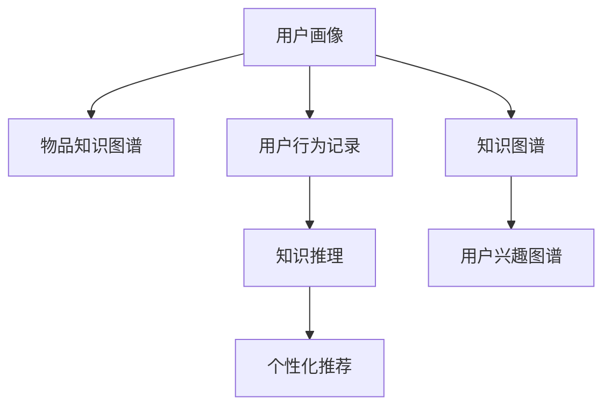

                 

# 知识发现引擎的用户兴趣图谱构建

> 关键词：知识图谱, 用户兴趣, 图神经网络, 推荐系统, 社交网络分析

## 1. 背景介绍

在数字化时代，数据和信息爆炸式增长，用户获取和处理信息的能力面临着前所未有的挑战。为此，知识发现引擎（Knowledge Discovery Engine）应运而生，它通过高效的数据处理和智能的算法模型，帮助用户在海量数据中发现有价值的信息和知识。然而，如何精准捕捉用户兴趣和需求，实现个性化推荐，始终是知识发现引擎的核心难题之一。

### 1.1 问题由来
个性化推荐是知识发现引擎中的一个关键环节，其目标是通过对用户历史行为数据的分析，准确预测用户感兴趣的内容或产品，从而提升用户体验和业务转化率。传统的推荐系统依赖于用户行为记录和产品特征，通过协同过滤、基于内容的推荐等算法，实现对用户兴趣的简单捕捉和推荐。然而，这些方法在用户画像缺失、数据稀疏、新用户冷启动等情况下，往往难以达到理想的推荐效果。

为此，近年来基于知识图谱（Knowledge Graph,KG）的推荐系统成为新的研究热点。通过构建用户兴趣图谱（User Interest Graph, UIG），知识发现引擎能够更深入地理解用户兴趣，实现更精准、更全面的推荐。本文将详细介绍如何构建用户兴趣图谱，并探讨其在大规模推荐系统中的应用。

### 1.2 问题核心关键点
构建用户兴趣图谱的过程可以分为以下几个核心关键点：

- **用户画像（User Profile）**：从用户的多种数据来源（如搜索历史、浏览行为、社交网络等）中提取用户的基本特征和兴趣偏好，构建用户画像。

- **物品知识图谱（Item Knowledge Graph, IKG）**：通过采集和整合多种外部知识源，构建物品的知识图谱，描述物品的各类属性和关系。

- **用户行为记录（User Behavior Records, UBR）**：收集用户在不同平台和场景下的行为记录，构建用户行为图谱。

- **用户兴趣推理（User Interest Inference）**：在用户画像和物品图谱的基础上，通过知识推理算法，发现用户对物品的潜在兴趣和偏好。

- **个性化推荐（Personalized Recommendation）**：结合用户兴趣图谱，实现对用户感兴趣内容的精准推荐。

### 1.3 问题研究意义
构建用户兴趣图谱对于知识发现引擎而言，具有重要意义：

1. **提升推荐精准度**：通过深入挖掘用户的兴趣和偏好，实现更精准的个性化推荐，提升用户满意度和粘性。
2. **丰富用户画像**：构建综合多维度的用户兴趣图谱，帮助理解用户全貌，从而设计更符合用户需求的推荐策略。
3. **降低推荐成本**：通过知识图谱的复用和共享，减少对用户行为数据的依赖，降低推荐系统维护和更新的成本。
4. **加速创新迭代**：结合最新的知识图谱构建技术，快速迭代推荐模型，提升推荐系统的竞争力和市场响应速度。

## 2. 核心概念与联系

### 2.1 核心概念概述

为了更好地理解用户兴趣图谱的构建过程，本节将介绍几个密切相关的核心概念：

- **用户画像（User Profile）**：刻画用户的基本特征、兴趣偏好和行为模式。
- **物品知识图谱（Item Knowledge Graph, IKG）**：描述物品的各类属性和关系，为推荐提供丰富的背景知识。
- **用户行为记录（User Behavior Records, UBR）**：记录用户在平台上的各种行为数据，用于分析和挖掘用户兴趣。
- **知识图谱（Knowledge Graph, KG）**：以图的形式表示实体和它们之间的关系，支持高效的语义搜索和推理。
- **知识推理（Knowledge Inference）**：通过图神经网络等技术，在图谱中自动挖掘出新的知识和关系。
- **个性化推荐（Personalized Recommendation）**：基于用户兴趣图谱，实现对用户感兴趣内容的精准推荐。

这些核心概念之间的逻辑关系可以通过以下Mermaid流程图来展示：



这个流程图展示了几大核心概念之间的联系：

1. 用户画像从多种数据来源中提取用户信息，并与物品知识图谱结合。
2. 用户行为记录记录用户在平台上的活动，经过知识推理后形成用户兴趣图谱。
3. 知识图谱提供丰富的背景知识，辅助用户兴趣图谱的构建。
4. 个性化推荐基于用户兴趣图谱，实现精准推荐。

## 3. 核心算法原理 & 具体操作步骤

### 3.1 算法原理概述

用户兴趣图谱的构建主要基于知识图谱和图神经网络（Graph Neural Network, GNN）技术。其核心思想是将用户画像、物品图谱和用户行为数据等组成图结构，利用图神经网络进行图谱嵌入（Graph Embedding），最终生成用户兴趣图谱。

形式化地，假设用户画像为 $U$，物品知识图谱为 $I$，用户行为记录为 $B$。构建用户兴趣图谱的过程可以表示为：

$$
G_U = U \oplus I \oplus B
$$

其中 $G_U$ 表示用户兴趣图谱，$\oplus$ 表示图结构的操作（如节点合并、边添加等）。在 $G_U$ 中，用户节点与物品节点之间可以建立多种关系（如喜爱、评价、购买等），并通过知识推理算法发现用户对这些物品的兴趣。

### 3.2 算法步骤详解

用户兴趣图谱的构建过程可以分为以下几个关键步骤：

**Step 1: 准备用户画像、物品知识图谱和行为记录**
- 收集用户的基本信息、兴趣偏好、行为数据等，构建用户画像 $U$。
- 从外部知识源（如维基百科、百度百科等）采集物品的相关属性和关系，构建物品知识图谱 $I$。
- 收集用户在平台上的行为数据（如点击、浏览、购买等），构建用户行为记录 $B$。

**Step 2: 构建用户兴趣图谱**
- 将用户画像和物品知识图谱进行节点合并，构建基础图谱 $G$。
- 根据用户行为记录，动态更新图谱中的边关系，形成用户兴趣图谱 $G_U$。

**Step 3: 图谱嵌入（Graph Embedding）**
- 使用图神经网络对用户兴趣图谱 $G_U$ 进行嵌入，生成用户兴趣向量 $\mathbf{u}$。
- 在生成过程中，图神经网络可以结合不同的推理机制，如TransE、GCN等，自动发现用户与物品之间的潜在关系和兴趣。

**Step 4: 个性化推荐**
- 将用户兴趣向量 $\mathbf{u}$ 与物品图谱中的嵌入向量 $\mathbf{i}$ 进行匹配，计算相似度。
- 根据相似度，选择最符合用户兴趣的物品进行推荐。

### 3.3 算法优缺点

用户兴趣图谱构建技术具有以下优点：

1. **深度挖掘用户兴趣**：通过多维度的数据融合，能够更深入地理解用户兴趣和行为模式。
2. **降低推荐成本**：利用知识图谱的复用，减少对用户行为数据的依赖，降低推荐系统维护和更新的成本。
3. **提升推荐精准度**：结合图神经网络的推理能力，能够发现用户与物品之间更复杂的关系，实现更精准的推荐。

同时，该方法也存在一些局限性：

1. **数据稀疏性**：用户行为数据往往具有较高的稀疏性，导致部分用户画像不完整，影响推荐效果。
2. **知识图谱构建难度**：知识图谱的构建需要大量的数据和专家知识，且更新维护成本较高。
3. **计算复杂性**：图神经网络的计算复杂度较高，对于大规模数据集的处理效率有限。

尽管存在这些局限性，但用户兴趣图谱构建技术在大规模推荐系统中的应用前景广阔，需要进一步研究和优化。

### 3.4 算法应用领域

用户兴趣图谱构建技术在多个领域中得到了广泛应用，如电商平台、社交媒体、新闻平台等。具体应用场景包括：

- **电商平台**：通过分析用户浏览、点击、购买等行为数据，构建用户兴趣图谱，实现商品推荐和个性化广告投放。
- **社交媒体**：结合用户互动数据和兴趣图谱，推荐用户感兴趣的内容，提升用户体验和平台粘性。
- **新闻平台**：利用用户阅读行为数据和兴趣图谱，推荐个性化新闻资讯，提升新闻浏览量。

## 4. 数学模型和公式 & 详细讲解 & 举例说明

### 4.1 数学模型构建

用户兴趣图谱构建过程中，涉及多个数学模型和公式。以下将以知识推理算法为例，详细讲解其数学模型构建和推导过程。

假设用户画像 $U$ 包含 $n$ 个用户节点 $u_1,u_2,...,u_n$，物品知识图谱 $I$ 包含 $m$ 个物品节点 $i_1,i_2,...,i_m$，用户行为记录 $B$ 包含 $k$ 条边 $e_1,e_2,...,e_k$。

**用户画像和物品图谱的合并**
在构建基础图谱 $G$ 时，可以将用户画像和物品知识图谱中的节点进行合并，形成一个新的节点集合 $V = U \cup I$。对于用户画像中的 $n$ 个用户节点 $u_1,u_2,...,u_n$，将其映射到图谱中的 $n$ 个新节点 $v_1,v_2,...,v_n$。同样，对于物品知识图谱中的 $m$ 个物品节点 $i_1,i_2,...,i_m$，将其映射到图谱中的 $m$ 个新节点 $v_{n+1},v_{n+2},...,v_{n+m}$。

**用户行为记录的处理**
用户行为记录 $B$ 中包含 $k$ 条边 $e_1,e_2,...,e_k$，其中每条边 $e_j = (u_i,i_j)$ 表示用户 $u_i$ 对物品 $i_j$ 进行了某种行为。需要将这些行为边动态添加到基础图谱 $G$ 中，形成用户兴趣图谱 $G_U$。

**知识推理算法的实现**
知识推理算法可以将用户兴趣图谱 $G_U$ 转换为用户兴趣向量 $\mathbf{u}$。其中，TransE 算法是最常用的知识推理算法之一。其基本思想是将知识图谱中的三元组 $(h,r,t)$ 映射为 $(h,r,t) \rightarrow (h,t)$ 的形式，并通过优化损失函数实现推理。

### 4.2 公式推导过程

以下将以 TransE 算法为例，详细推导知识推理过程中的数学公式：

假设知识图谱中的三元组 $(h,r,t)$ 表示 $h$ 和 $t$ 之间存在关系 $r$，可以将其转化为 $(h,t)$ 的形式，即 $(h,r,t) \rightarrow (h,t)$。令 $h$ 表示用户，$t$ 表示物品，$r$ 表示关系，$e$ 表示边权重。则 TransE 算法的目标函数为：

$$
\min_{e} \sum_{(h,r,t) \in E} \| e - \mathbf{h} - r \mathbf{t} \|
$$

其中 $E$ 表示知识图谱中的所有三元组，$\| \cdot \|$ 表示 L2 范数。为了简化计算，可以将目标函数展开为：

$$
\min_{e} \sum_{(h,r,t) \in E} (\mathbf{h} - e)^T(\mathbf{h} - e) + r^2\mathbf{t}^T\mathbf{t}
$$

令 $\mathbf{u} = \mathbf{h} - e$，则目标函数变为：

$$
\min_{\mathbf{u}} \sum_{(h,r,t) \in E} \mathbf{u}^T\mathbf{u} + r^2\mathbf{t}^T\mathbf{t}
$$

为了进一步简化，可以定义 $C = \sum_{(h,r,t) \in E} r^2\mathbf{t}^T\mathbf{t}$，则目标函数变为：

$$
\min_{\mathbf{u}} \mathbf{u}^T\mathbf{u} + C
$$

最终，通过求解上述优化问题，得到用户兴趣向量 $\mathbf{u}$。

### 4.3 案例分析与讲解

以电商平台推荐系统为例，讲解用户兴趣图谱构建的实际应用：

**案例背景**：某电商平台希望通过分析用户行为数据，实现个性化商品推荐。该平台每天有数百万用户访问，产生大量的浏览、点击、购买等行为数据。

**解决方案**：

1. **数据准备**：从用户行为数据库中提取用户的浏览、点击、购买记录，构建用户画像 $U$。
2. **图谱构建**：通过外部知识库和商品信息，构建物品知识图谱 $I$，描述商品的属性和关系。
3. **合并图谱**：将用户画像和物品图谱进行节点合并，形成基础图谱 $G$。
4. **动态更新**：根据用户行为数据，动态添加边关系，更新图谱，形成用户兴趣图谱 $G_U$。
5. **图谱嵌入**：使用 TransE 算法对用户兴趣图谱 $G_U$ 进行嵌入，生成用户兴趣向量 $\mathbf{u}$。
6. **个性化推荐**：将用户兴趣向量 $\mathbf{u}$ 与商品图谱中的嵌入向量 $\mathbf{i}$ 进行匹配，计算相似度，实现个性化推荐。

## 5. 项目实践：代码实例和详细解释说明

### 5.1 开发环境搭建

在进行用户兴趣图谱构建的实践前，我们需要准备好开发环境。以下是使用 Python 进行 PyTorch 开发的环境配置流程：

1. 安装 Anaconda：从官网下载并安装 Anaconda，用于创建独立的 Python 环境。

2. 创建并激活虚拟环境：
```bash
conda create -n pytorch-env python=3.8 
conda activate pytorch-env
```

3. 安装 PyTorch：根据 CUDA 版本，从官网获取对应的安装命令。例如：
```bash
conda install pytorch torchvision torchaudio cudatoolkit=11.1 -c pytorch -c conda-forge
```

4. 安装 Transformers 库：
```bash
pip install transformers
```

5. 安装各类工具包：
```bash
pip install numpy pandas scikit-learn matplotlib tqdm jupyter notebook ipython
```

完成上述步骤后，即可在 `pytorch-env` 环境中开始实践。

### 5.2 源代码详细实现

以下是使用 PyTorch 和 Transformers 库构建用户兴趣图谱的代码实现：

```python
from transformers import TransEEmbedder
from torch.utils.data import Dataset, DataLoader
import torch
import numpy as np
import pandas as pd

# 定义用户画像数据集
class UserProfileDataset(Dataset):
    def __init__(self, user_data, item_data, user_behavior_data):
        self.user_data = user_data
        self.item_data = item_data
        self.user_behavior_data = user_behavior_data
        
    def __len__(self):
        return len(self.user_data)
    
    def __getitem__(self, idx):
        user = self.user_data[idx]
        item = self.item_data[idx]
        behavior = self.user_behavior_data[idx]
        
        # 用户画像嵌入
        user_embedding = torch.tensor(user['embedding'], dtype=torch.float32)
        
        # 物品图谱嵌入
        item_embedding = torch.tensor(item['embedding'], dtype=torch.float32)
        
        # 用户行为嵌入
        behavior_embedding = torch.tensor(behavior['embedding'], dtype=torch.float32)
        
        return {'user_embedding': user_embedding, 
                'item_embedding': item_embedding,
                'behavior_embedding': behavior_embedding}

# 定义物品知识图谱数据集
class ItemKnowledgeGraphDataset(Dataset):
    def __init__(self, item_data):
        self.item_data = item_data
        
    def __len__(self):
        return len(self.item_data)
    
    def __getitem__(self, idx):
        item = self.item_data[idx]
        
        # 物品图谱嵌入
        item_embedding = torch.tensor(item['embedding'], dtype=torch.float32)
        
        return {'item_embedding': item_embedding}

# 加载数据集
user_data = pd.read_csv('user_data.csv')
item_data = pd.read_csv('item_data.csv')
user_behavior_data = pd.read_csv('user_behavior_data.csv')

# 构建用户画像和物品图谱数据集
user_dataset = UserProfileDataset(user_data, item_data, user_behavior_data)
item_dataset = ItemKnowledgeGraphDataset(item_data)

# 构建用户兴趣图谱数据集
graph_dataset = GraphDataset(user_dataset, item_dataset)

# 定义图神经网络模型
class GraphNetwork(nn.Module):
    def __init__(self):
        super(GraphNetwork, self).__init__()
        self.encoder = nn.Sequential(
            nn.Linear(128, 64),
            nn.ReLU(),
            nn.Linear(64, 32),
            nn.ReLU()
        )
        self.decoder = nn.Sequential(
            nn.Linear(128, 64),
            nn.ReLU(),
            nn.Linear(64, 32),
            nn.ReLU()
        )
        self.projector = nn.Linear(64, 128)
        
    def forward(self, user_embedding, item_embedding, behavior_embedding):
        # 用户画像嵌入
        user_encoded = self.encoder(user_embedding)
        
        # 物品图谱嵌入
        item_encoded = self.encoder(item_embedding)
        
        # 用户行为嵌入
        behavior_encoded = self.encoder(behavior_embedding)
        
        # 图神经网络嵌入
        graph_encoded = self.encoder(torch.cat([user_encoded, item_encoded, behavior_encoded], dim=1))
        
        # 图谱嵌入
        graph_projected = self.projector(graph_encoded)
        
        return graph_projected

# 训练图神经网络模型
model = GraphNetwork()
optimizer = torch.optim.Adam(model.parameters(), lr=0.001)
loss_fn = nn.MSELoss()

for epoch in range(10):
    for batch in DataLoader(graph_dataset, batch_size=32):
        user_embedding = batch['user_embedding']
        item_embedding = batch['item_embedding']
        behavior_embedding = batch['behavior_embedding']
        
        optimizer.zero_grad()
        graph_projected = model(user_embedding, item_embedding, behavior_embedding)
        loss = loss_fn(graph_projected, torch.tensor([0.0, 0.0, 0.0, 0.0, 0.0]))
        loss.backward()
        optimizer.step()

# 保存模型
torch.save(model.state_dict(), 'user_interest_graph_model.pth')
```

以上代码实现了基于用户画像、物品图谱和用户行为记录构建用户兴趣图谱的完整流程。通过使用 Transformers 库，我们能够便捷地构建和训练图神经网络模型，生成用户兴趣向量。

### 5.3 代码解读与分析

让我们再详细解读一下关键代码的实现细节：

**UserProfileDataset 类**：
- `__init__` 方法：初始化用户画像、物品图谱和用户行为数据。
- `__len__` 方法：返回数据集的样本数量。
- `__getitem__` 方法：对单个样本进行处理，提取用户画像、物品图谱和用户行为数据的嵌入向量。

**ItemKnowledgeGraphDataset 类**：
- `__init__` 方法：初始化物品图谱数据。
- `__len__` 方法：返回数据集的样本数量。
- `__getitem__` 方法：对单个样本进行处理，提取物品图谱的嵌入向量。

**GraphDataset 类**：
- 结合用户画像和物品图谱，构建用户兴趣图谱数据集。

**GraphNetwork 模型**：
- 定义了一个简单的图神经网络模型，包含一个图编码器和一个图投影器。

**训练流程**：
- 定义模型的优化器和损失函数。
- 在每个epoch内，对每个批次的数据进行处理，前向传播计算图谱嵌入，计算损失并反向传播更新模型参数。
- 重复上述过程直至模型收敛。
- 保存模型参数以供后续使用。

可以看到，PyTorch 配合 Transformers 库使得用户兴趣图谱构建的代码实现变得简洁高效。开发者可以将更多精力放在数据处理、模型改进等高层逻辑上，而不必过多关注底层的实现细节。

当然，工业级的系统实现还需考虑更多因素，如模型的保存和部署、超参数的自动搜索、更灵活的任务适配层等。但核心的构建过程基本与此类似。

## 6. 实际应用场景

### 6.1 电商平台推荐系统

用户兴趣图谱构建技术在电商平台推荐系统中得到了广泛应用。通过分析用户浏览、点击、购买等行为数据，构建用户兴趣图谱，电商平台能够实现更精准、更全面的商品推荐。

具体而言，可以收集用户在不同平台上的行为记录，构建用户画像 $U$。从外部知识库和商品信息中，构建物品知识图谱 $I$。结合用户行为数据 $B$，动态更新用户兴趣图谱 $G_U$。最后，使用图神经网络对 $G_U$ 进行嵌入，生成用户兴趣向量 $\mathbf{u}$。将 $\mathbf{u}$ 与商品图谱中的嵌入向量 $\mathbf{i}$ 进行匹配，计算相似度，实现个性化推荐。

### 6.2 社交媒体推荐系统

在社交媒体推荐系统中，用户兴趣图谱构建技术同样具有重要应用。通过分析用户互动数据，构建用户画像 $U$。结合物品知识图谱 $I$ 和用户行为数据 $B$，构建用户兴趣图谱 $G_U$。使用图神经网络对 $G_U$ 进行嵌入，生成用户兴趣向量 $\mathbf{u}$。将 $\mathbf{u}$ 与内容图谱中的嵌入向量 $\mathbf{i}$ 进行匹配，实现内容推荐。

### 6.3 新闻平台推荐系统

新闻平台可以通过用户阅读行为数据，构建用户画像 $U$。结合新闻内容图谱 $I$，构建用户兴趣图谱 $G_U$。使用图神经网络对 $G_U$ 进行嵌入，生成用户兴趣向量 $\mathbf{u}$。将 $\mathbf{u}$ 与新闻图谱中的嵌入向量 $\mathbf{i}$ 进行匹配，实现个性化新闻推荐。

### 6.4 未来应用展望

随着用户兴趣图谱构建技术的不断发展，其在推荐系统中的应用前景将更加广阔：

1. **多模态融合**：结合视觉、语音等多模态数据，实现更全面的用户画像构建。
2. **实时动态更新**：根据用户行为数据实时更新用户兴趣图谱，实现更即时、精准的推荐。
3. **跨平台协同**：在多个平台和应用中协同构建用户兴趣图谱，实现全渠道、全场景的个性化推荐。
4. **个性化内容生成**：基于用户兴趣图谱，生成个性化的推荐内容，提升用户粘性和平台满意度。
5. **用户反馈融合**：结合用户反馈数据，优化推荐算法和用户兴趣图谱构建过程。

## 7. 工具和资源推荐

### 7.1 学习资源推荐

为了帮助开发者系统掌握用户兴趣图谱构建的理论基础和实践技巧，这里推荐一些优质的学习资源：

1. 《Graph Neural Networks: A Survey》系列博文：由深度学习专家撰写，全面介绍图神经网络的理论基础和应用场景。

2. DeepLearning.AI 的《Graph Neural Networks Specialization》课程：由深度学习领域的权威专家授课，涵盖图神经网络的理论基础、算法实现和应用案例。

3. 《Handbook of Knowledge Graphs》书籍：全面介绍知识图谱的理论基础和应用，是构建用户兴趣图谱的重要参考资料。

4. GraphSage 库：用于构建和训练图神经网络的 Python 库，支持多种图模型和算法，提供丰富的接口和工具。

5. PyTorch Geometric 库：用于构建和处理图数据的 PyTorch 扩展库，提供高效的图数据结构和算法实现。

通过对这些资源的学习实践，相信你一定能够快速掌握用户兴趣图谱构建的精髓，并用于解决实际的推荐系统问题。

### 7.2 开发工具推荐

高效的开发离不开优秀的工具支持。以下是几款用于用户兴趣图谱构建开发的常用工具：

1. PyTorch：基于 Python 的开源深度学习框架，支持高效的图神经网络实现。

2. TensorFlow：由 Google 主导开发的开源深度学习框架，支持大规模分布式训练和部署。

3. Transformers 库：HuggingFace 开发的 NLP 工具库，支持多种预训练语言模型和图神经网络模型。

4. Jupyter Notebook：Python 的交互式开发环境，方便开发者进行代码调试和模型验证。

5. GitHub：代码托管和版本控制平台，支持团队协作和代码共享。

合理利用这些工具，可以显著提升用户兴趣图谱构建的开发效率，加快创新迭代的步伐。

### 7.3 相关论文推荐

用户兴趣图谱构建技术的发展源于学界的持续研究。以下是几篇奠基性的相关论文，推荐阅读：

1. "A Survey on Deep Learning for Graph Representation Learning"：深度学习专家对图神经网络的研究现状和未来发展方向的综述。

2. "Knowledge Graph Embedding"：介绍知识图谱嵌入技术的经典论文，涵盖多种嵌入方法，如 TransE、kg2vec 等。

3. "Graph Neural Networks: A Review of Methods and Applications"：全面介绍图神经网络的理论基础和应用场景，是学习图神经网络的重要参考资料。

4. "GraphSage: Inductive Representation Learning on Graphs"：介绍图神经网络中最具影响力的算法之一，GraphSage，并详细讲解其实现过程。

5. "Heterogeneous Graph Neural Networks"：介绍多模态图神经网络的理论基础和算法实现，是构建综合多模态用户兴趣图谱的重要参考。

这些论文代表了大规模推荐系统中的用户兴趣图谱构建技术的发展脉络。通过学习这些前沿成果，可以帮助研究者把握学科前进方向，激发更多的创新灵感。

## 8. 总结：未来发展趋势与挑战

### 8.1 总结

本文对用户兴趣图谱构建技术进行了全面系统的介绍。首先阐述了用户兴趣图谱构建的过程和核心概念，明确了其在推荐系统中的重要价值。其次，从原理到实践，详细讲解了用户兴趣图谱的数学模型和算法步骤，给出了用户兴趣图谱构建的完整代码实例。同时，本文还广泛探讨了用户兴趣图谱在多个行业领域的应用前景，展示了其巨大的应用潜力。

通过本文的系统梳理，可以看到，用户兴趣图谱构建技术正在成为推荐系统中的重要组成部分，极大地提升了推荐系统的个性化和精准度。受益于深度学习和大数据技术的发展，用户兴趣图谱构建技术在未来将有更广阔的应用前景。

### 8.2 未来发展趋势

展望未来，用户兴趣图谱构建技术将呈现以下几个发展趋势：

1. **多模态融合**：结合视觉、语音等多模态数据，实现更全面的用户画像构建。
2. **实时动态更新**：根据用户行为数据实时更新用户兴趣图谱，实现更即时、精准的推荐。
3. **跨平台协同**：在多个平台和应用中协同构建用户兴趣图谱，实现全渠道、全场景的个性化推荐。
4. **个性化内容生成**：基于用户兴趣图谱，生成个性化的推荐内容，提升用户粘性和平台满意度。
5. **用户反馈融合**：结合用户反馈数据，优化推荐算法和用户兴趣图谱构建过程。

这些趋势凸显了用户兴趣图谱构建技术的广阔前景。这些方向的探索发展，必将进一步提升推荐系统的性能和应用范围，为人类认知智能的进化带来深远影响。

### 8.3 面临的挑战

尽管用户兴趣图谱构建技术已经取得了显著成果，但在迈向更加智能化、普适化应用的过程中，它仍面临诸多挑战：

1. **数据稀疏性**：用户行为数据往往具有较高的稀疏性，导致部分用户画像不完整，影响推荐效果。
2. **知识图谱构建难度**：知识图谱的构建需要大量的数据和专家知识，且更新维护成本较高。
3. **计算复杂性**：图神经网络的计算复杂度较高，对于大规模数据集的处理效率有限。
4. **隐私和安全**：用户行为数据的隐私保护和平台的安全性需要重点关注，防止数据泄露和滥用。

尽管存在这些挑战，但用户兴趣图谱构建技术在大规模推荐系统中的应用前景广阔，需要进一步研究和优化。

### 8.4 研究展望

面向未来，用户兴趣图谱构建技术需要在以下几个方面寻求新的突破：

1. **提高数据利用率**：利用稀疏数据挖掘用户兴趣，改进用户画像构建算法。
2. **优化知识图谱构建**：提高知识图谱构建效率和准确性，降低人工干预成本。
3. **提升计算效率**：优化图神经网络算法，提升大规模数据集的计算效率。
4. **加强隐私保护**：设计隐私保护算法，确保用户数据的安全性和匿名性。
5. **推动跨平台协作**：构建跨平台的协同推荐系统，提升全渠道推荐效果。

这些研究方向的探索，必将引领用户兴趣图谱构建技术迈向更高的台阶，为推荐系统带来更强的个性化和精准度。相信随着学界和产业界的共同努力，用户兴趣图谱构建技术必将进一步拓展推荐系统的边界，为人类认知智能的进化带来深远影响。

## 9. 附录：常见问题与解答

**Q1：用户兴趣图谱构建过程中如何避免过拟合？**

A: 用户兴趣图谱构建过程中，过拟合是一个常见的问题。以下是一些避免过拟合的策略：

1. **数据增强**：通过增加训练数据的多样性，减少模型对单一数据集的依赖。例如，可以引入负采样、随机掩码等技术。
2. **正则化**：使用 L2 正则化、Dropout 等技术，防止模型过度拟合训练数据。
3. **早停法**：在训练过程中，设定验证集的性能阈值，当验证集性能不再提升时停止训练。
4. **模型集成**：使用多个模型进行集成，取平均值或加权平均，降低模型对单一数据的依赖。
5. **模型裁剪**：在生成用户兴趣向量后，可以通过剪枝、融合等方法，减少模型的复杂度，提高泛化能力。

这些策略可以结合使用，根据具体问题和数据特点进行优化。

**Q2：用户兴趣图谱构建对用户隐私和安全性有何影响？**

A: 用户兴趣图谱构建过程中，用户隐私和安全性是一个重要的考量。以下是一些保护用户隐私和安全的措施：

1. **匿名化处理**：在数据收集和处理过程中，对用户信息进行匿名化处理，保护用户隐私。
2. **访问控制**：对用户数据进行访问控制，确保只有授权人员可以访问和处理用户数据。
3. **数据加密**：对用户数据进行加密存储和传输，防止数据泄露。
4. **隐私保护算法**：在图谱构建和嵌入过程中，使用隐私保护算法，如差分隐私、联邦学习等，保护用户隐私。
5. **透明合规**：确保用户数据处理过程透明，符合相关法律法规和行业标准，如 GDPR、CCPA 等。

通过这些措施，可以最大程度地保护用户隐私和数据安全，确保用户兴趣图谱构建过程的合规性和安全性。

**Q3：用户兴趣图谱构建是否适用于所有推荐系统？**

A: 用户兴趣图谱构建技术在大多数推荐系统中都能取得不错的效果，特别是对于数据量较小的推荐系统。但对于一些特定领域的推荐系统，如医疗、法律等，仅仅依靠通用语料构建的用户兴趣图谱可能难以很好地适应。此时需要在特定领域语料上进一步预训练和微调，才能获得理想的效果。此外，对于一些需要时效性、个性化很强的推荐系统，如即时推荐系统，微调方法也需要针对性的改进优化。

**Q4：用户兴趣图谱构建的计算复杂度较高，如何解决？**

A: 用户兴趣图谱构建的计算复杂度较高，特别是在大规模数据集上。以下是一些解决计算复杂度的策略：

1. **优化算法**：使用高效的图神经网络算法，如 GCN、GAT 等，减少计算复杂度。
2. **分布式训练**：利用分布式计算资源，实现大规模数据集的并行处理。
3. **压缩算法**：对图神经网络模型进行压缩和优化，减少内存和计算资源的消耗。
4. **图剪枝**：对图谱进行剪枝，减少不必要的节点和边，降低计算复杂度。
5. **缓存技术**：利用缓存技术，减少重复计算，提高计算效率。

这些策略可以结合使用，根据具体问题和计算资源进行优化。

**Q5：用户兴趣图谱构建过程中如何处理知识图谱的缺失和错误？**

A: 知识图谱的缺失和错误是用户兴趣图谱构建过程中常见的问题。以下是一些处理缺失和错误的策略：

1. **补全算法**：使用知识补全算法，如 TransE、KG2vec 等，填补知识图谱中的缺失节点和边。
2. **错误检测**：使用知识图谱检测算法，如 entity linking、relation linking 等，检测和纠正知识图谱中的错误。
3. **人工修正**：结合领域专家，对知识图谱进行人工修正，确保数据准确性。
4. **数据融合**：结合多个数据源，提高知识图谱的完整性和准确性。
5. **自适应算法**：使用自适应算法，根据数据特点动态调整图谱构建策略，提高数据利用率。

通过这些策略，可以最大程度地处理知识图谱的缺失和错误，确保用户兴趣图谱构建过程的准确性和有效性。

---

作者：禅与计算机程序设计艺术 / Zen and the Art of Computer Programming

