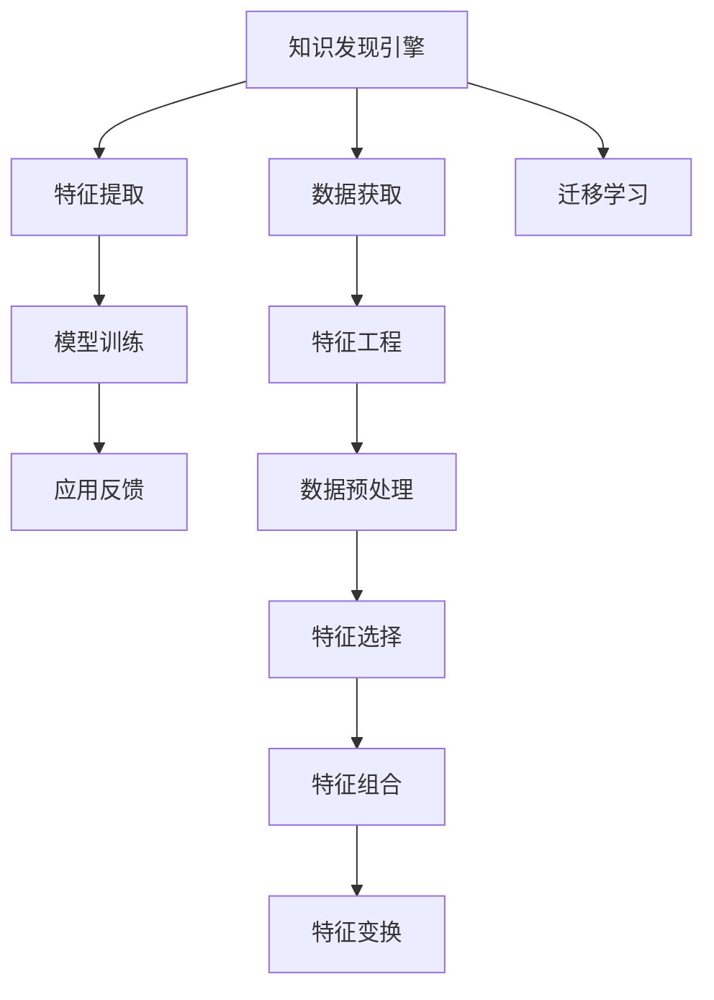

                 

## 1. 背景介绍

### 1.1 问题由来
随着大数据时代的到来，海量数据被广泛应用于各个行业，用户画像作为数据驱动决策的重要工具，在精准营销、智能客服、金融风控等领域扮演着越来越重要的角色。然而，传统用户画像技术的依赖性高、特征工程复杂、准确性受限等问题，限制了其在实际应用中的广泛应用。

为了解决这些问题，知识发现引擎的用户画像技术应运而生。它利用先进的数据挖掘算法和机器学习技术，从用户行为数据中自动抽取有意义的特征，形成精确的用户画像，从而有效降低对人工干预的依赖，提升用户画像的生成效率和准确性。

### 1.2 问题核心关键点
用户画像的构建流程主要包括数据获取、特征提取、模型训练和应用反馈几个环节。其中，特征提取和模型训练是影响用户画像质量的核心关键点。而知识发现引擎的用户画像技术，通过自动化特征工程和高效模型训练，实现对复杂用户特征的准确刻画，从而为各行业的决策应用提供坚实的数据支撑。

## 2. 核心概念与联系

### 2.1 核心概念概述

为更好地理解知识发现引擎的用户画像技术，本节将介绍几个关键概念及其联系：

- 知识发现引擎(Knowledge Discovery Engine, KDE)：一种基于数据挖掘和机器学习技术的自动化决策支持系统，能够自动从海量数据中发现有用知识，辅助决策者进行智能决策。
- 用户画像(User Profile)：通过对用户行为数据的分析和挖掘，形成对用户特征的全面描述，用于个性化营销、推荐、风控等业务场景。
- 特征工程(Feature Engineering)：数据预处理过程中，通过选择、组合、变换等手段，从原始数据中提取对模型有用的特征。
- 模型训练(Model Training)：利用训练数据对模型进行参数优化，使其能够对新数据进行准确的预测。
- 迁移学习(Transfer Learning)：利用已有模型的知识和经验，在新的领域或任务上快速训练模型，减少数据需求，提升训练效率。

这些概念之间的逻辑关系可以通过以下Mermaid流程图来展示：



这个流程图展示了一系列核心概念及其之间的联系：

1. 知识发现引擎通过自动化的数据获取和特征提取，从海量数据中抽取有用特征。
2. 特征工程通过选择、组合和变换，优化特征的表示形式，提升模型性能。
3. 模型训练通过学习已有数据，优化模型参数，实现对新数据的精准预测。
4. 应用反馈通过实际业务场景的反馈，优化模型，提升模型鲁棒性。
5. 迁移学习通过已有模型的迁移，快速构建新模型，提升训练效率。

## 3. 核心算法原理 & 具体操作步骤
### 3.1 算法原理概述

知识发现引擎的用户画像技术，通过数据挖掘和机器学习技术，自动从用户行为数据中提取特征，构建用户画像。其核心思想是：利用先验知识进行特征选择和组合，然后利用机器学习模型对用户特征进行训练，生成精确的用户画像。

形式化地，假设用户画像建模的数据集为 $D=\{(x_i,y_i)\}_{i=1}^N$，其中 $x_i$ 为用户行为特征，$y_i$ 为用户画像标签。用户画像建模的目标是找到一个函数 $f(x)$，使得 $f(x)$ 能够尽可能准确地预测用户画像标签 $y$。即：

$$
\min_{f(x)} \mathcal{L}(f(x),y)
$$

其中 $\mathcal{L}$ 为损失函数，通常使用交叉熵损失函数。在训练过程中，模型 $f(x)$ 不断优化参数，最小化损失函数 $\mathcal{L}$，使得 $f(x)$ 对新数据 $x$ 的预测能力更强。

### 3.2 算法步骤详解

知识发现引擎的用户画像建模一般包括以下几个关键步骤：

**Step 1: 数据准备**
- 收集用户行为数据，并预处理成适合模型训练的格式。
- 设计合适的用户画像标签，用于指导模型训练。

**Step 2: 特征工程**
- 通过数据预处理技术（如数据清洗、归一化等）对原始数据进行清洗。
- 选择和组合特征，以提取对模型有用的特征。
- 应用特征变换技术（如降维、PCA等）优化特征的表示形式。

**Step 3: 模型训练**
- 选择合适的机器学习模型（如线性回归、决策树、随机森林等），对用户特征 $x$ 和用户画像标签 $y$ 进行训练。
- 利用交叉验证技术评估模型的性能，选择合适的超参数。
- 应用迁移学习技术，利用已有模型知识，加快新模型的训练。

**Step 4: 特征优化**
- 通过特征重要性评估，选择和优化特征子集。
- 应用集成学习技术，提高模型的稳定性和准确性。

**Step 5: 应用评估与反馈**
- 将训练好的用户画像模型应用于实际业务场景，验证模型的效果。
- 收集应用反馈，对模型进行调整和优化。

### 3.3 算法优缺点

知识发现引擎的用户画像技术具有以下优点：
1. 自动化特征工程。能够自动从用户行为数据中提取特征，减少人工干预，提升特征提取效率。
2. 数据驱动决策。通过机器学习模型，从海量数据中自动学习用户特征，提升用户画像的准确性。
3. 高效迁移学习。利用已有模型的知识和经验，快速构建新模型，减少训练时间和数据需求。
4. 应用灵活性高。适用于多种业务场景，如精准营销、智能客服、金融风控等。

同时，该技术也存在一些局限性：
1. 数据质量依赖高。用户行为数据的质量直接影响用户画像的准确性。
2. 特征工程复杂。特征选择的正确性和组合的合理性对模型性能影响较大。
3. 模型鲁棒性不足。对噪声和异常值敏感，需要额外的预处理技术进行清洗。
4. 应用场景受限。不同业务场景的特征差异较大，需要针对具体场景进行模型优化。

尽管存在这些局限性，但知识发现引擎的用户画像技术，以其高效、自动化、数据驱动的特征提取和建模方法，已经在多个领域得到了广泛应用，并带来了显著的业务效果。

### 3.4 算法应用领域

知识发现引擎的用户画像技术，已经在多个领域得到了成功应用，包括：

- 精准营销：利用用户画像进行用户细分、兴趣分析、行为预测等，实现精准投放，提升广告效果。
- 智能客服：通过对用户历史行为数据的分析，构建用户画像，实现智能推荐，提升客户体验。
- 金融风控：利用用户画像进行信用评估、风险预测、欺诈检测等，提升风控效率和准确性。
- 产品推荐：通过对用户行为数据的挖掘，构建用户画像，实现个性化推荐，提升用户满意度。
- 内容分发：利用用户画像进行内容推荐，提升内容分发效率和用户粘性。

除了这些经典应用外，知识发现引擎的用户画像技术，还在智能交通、智慧医疗、城市治理等诸多领域中发挥了重要作用，为各行各业提供了坚实的决策支持。

## 4. 数学模型和公式 & 详细讲解  
### 4.1 数学模型构建

本节将使用数学语言对知识发现引擎的用户画像建模过程进行更加严格的刻画。

假设用户画像建模的数据集为 $D=\{(x_i,y_i)\}_{i=1}^N$，其中 $x_i$ 为用户行为特征，$y_i$ 为用户画像标签。构建用户画像的目标是找到一个函数 $f(x)$，使得 $f(x)$ 能够尽可能准确地预测用户画像标签 $y$。

定义模型 $f(x)$ 在数据样本 $(x,y)$ 上的损失函数为 $\ell(f(x),y)$，则在数据集 $D$ 上的经验风险为：

$$
\mathcal{L}(f(x)) = \frac{1}{N}\sum_{i=1}^N \ell(f(x_i),y_i)
$$

其中 $\ell$ 为损失函数，通常使用交叉熵损失函数。在训练过程中，模型 $f(x)$ 不断优化参数，最小化损失函数 $\mathcal{L}$，使得 $f(x)$ 对新数据 $x$ 的预测能力更强。

### 4.2 公式推导过程

以线性回归模型为例，推导交叉熵损失函数及其梯度的计算公式。

假设模型 $f(x)$ 在输入 $x$ 上的输出为 $\hat{y}=f(x)$，表示模型对用户画像标签 $y$ 的预测。则二分类交叉熵损失函数定义为：

$$
\ell(f(x),y) = -[y\log \hat{y} + (1-y)\log (1-\hat{y})]
$$

将其代入经验风险公式，得：

$$
\mathcal{L}(f(x)) = -\frac{1}{N}\sum_{i=1}^N [y_i\log f(x_i)+(1-y_i)\log(1-f(x_i))]
$$

根据链式法则，损失函数对参数 $\theta_k$ 的梯度为：

$$
\frac{\partial \mathcal{L}(f(x))}{\partial \theta_k} = -\frac{1}{N}\sum_{i=1}^N (\frac{y_i}{f(x_i)}-\frac{1-y_i}{1-f(x_i)}) \frac{\partial f(x_i)}{\partial \theta_k}
$$

其中 $\frac{\partial f(x_i)}{\partial \theta_k}$ 可进一步递归展开，利用自动微分技术完成计算。

在得到损失函数的梯度后，即可带入参数更新公式，完成模型的迭代优化。重复上述过程直至收敛，最终得到适应用户画像模型的最优参数 $\theta^*$。

## 5. 项目实践：代码实例和详细解释说明
### 5.1 开发环境搭建

在进行用户画像建模前，我们需要准备好开发环境。以下是使用Python进行Scikit-learn开发的环境配置流程：

1. 安装Anaconda：从官网下载并安装Anaconda，用于创建独立的Python环境。

2. 创建并激活虚拟环境：
```bash
conda create -n user_profile_env python=3.8 
conda activate user_profile_env
```

3. 安装必要的库：
```bash
pip install scikit-learn pandas numpy matplotlib seaborn sklearn
```

完成上述步骤后，即可在`user_profile_env`环境中开始用户画像建模实践。

### 5.2 源代码详细实现

这里我们以线性回归模型为例，给出使用Scikit-learn对用户画像进行建模的Python代码实现。

```python
import pandas as pd
from sklearn.model_selection import train_test_split
from sklearn.linear_model import LinearRegression
from sklearn.metrics import mean_squared_error, r2_score
from sklearn.preprocessing import StandardScaler

# 加载用户行为数据
data = pd.read_csv('user_behavior_data.csv')

# 分离特征和标签
X = data.drop('user_profile', axis=1)
y = data['user_profile']

# 特征工程
X = X.fillna(0)
X = StandardScaler().fit_transform(X)

# 划分训练集和测试集
X_train, X_test, y_train, y_test = train_test_split(X, y, test_size=0.2, random_state=42)

# 训练模型
model = LinearRegression()
model.fit(X_train, y_train)

# 评估模型
y_pred = model.predict(X_test)
mse = mean_squared_error(y_test, y_pred)
r2 = r2_score(y_test, y_pred)
print(f'Mean Squared Error: {mse:.2f}')
print(f'R-squared: {r2:.2f}')
```

以上代码实现了用户画像建模的完整流程：

1. 加载用户行为数据。
2. 特征选择和处理。
3. 划分训练集和测试集。
4. 训练线性回归模型。
5. 评估模型性能。

### 5.3 代码解读与分析

让我们再详细解读一下关键代码的实现细节：

**数据加载和处理**：
- `pd.read_csv('user_behavior_data.csv')`：使用Pandas库加载用户行为数据，构建DataFrame对象。
- `X = data.drop('user_profile', axis=1)`：将用户画像标签列`user_profile`作为标签`y`，其他行为特征作为输入特征`X`。
- `X = X.fillna(0)`：对缺失值进行填充，避免模型训练过程中出现NaN值。
- `X = StandardScaler().fit_transform(X)`：对特征进行标准化处理，保证特征值量级一致，提升模型收敛速度。

**模型训练与评估**：
- `X_train, X_test, y_train, y_test = train_test_split(X, y, test_size=0.2, random_state=42)`：将数据集划分为训练集和测试集，并进行随机打乱。
- `model = LinearRegression()`：创建线性回归模型。
- `model.fit(X_train, y_train)`：对训练集进行模型训练。
- `y_pred = model.predict(X_test)`：对测试集进行模型预测。
- `mse = mean_squared_error(y_test, y_pred)`：计算预测值与真实标签之间的均方误差。
- `r2 = r2_score(y_test, y_pred)`：计算模型对测试集的R-squared值，评估模型拟合程度。

可以看到，Scikit-learn库提供了丰富的机器学习算法和评估工具，使得用户画像建模的实现变得简洁高效。开发者可以方便地进行模型训练、特征工程和性能评估，加速开发进程。

当然，工业级的系统实现还需考虑更多因素，如特征选择算法、模型优化策略、超参数调优等。但核心的用户画像建模过程基本与此类似。

## 6. 实际应用场景
### 6.1 精准营销

基于用户画像的精准营销，可以大幅提升广告投放的效率和效果。传统的广告投放策略往往采用一刀切的策略，缺乏对用户需求的精细化分析。而利用知识发现引擎的用户画像技术，可以对用户进行细分，识别出不同兴趣和行为特征的用户群体，从而实现个性化广告投放。

在实践应用中，可以收集用户的浏览历史、购买记录、社交行为等数据，通过特征提取和建模，形成用户画像。根据用户画像的特征，推荐其感兴趣的商品或服务，提升广告的点击率和转化率。例如，电商平台的个性化推荐系统，可以通过用户画像，向不同用户推荐不同的商品，实现精准营销。

### 6.2 智能客服

智能客服系统通过用户画像，能够更准确地理解用户需求，提供个性化的服务。在传统客服系统中，客服人员需要根据用户的语言描述，手工输入关键词进行搜索，容易出现理解错误和效率低下。而利用用户画像，智能客服系统可以自动获取用户的兴趣和行为特征，快速响应用户需求，提升客户满意度。

例如，在金融行业，智能客服可以通过用户画像，识别出用户是否具有购买理财产品的意愿，进而推送相应的理财方案。通过用户画像的指导，智能客服系统可以实现更高效、精准的客户服务。

### 6.3 金融风控

金融行业中的风险预测和欺诈检测，依赖于对用户行为数据的深入分析。传统的方法需要手工提取和分析用户特征，容易受限于业务知识和经验。而利用知识发现引擎的用户画像技术，可以自动从海量用户数据中抽取特征，形成精确的用户画像，用于信用评估、风险预测、欺诈检测等业务场景。

例如，在信贷审批过程中，可以通过用户画像，评估用户的还款能力和还款意愿，提升贷款审批的准确性和效率。通过对用户行为的深度分析，金融机构可以更有效地识别出潜在风险用户，提前进行风险控制，降低贷款坏账率。

### 6.4 未来应用展望

随着用户画像技术的不断发展，知识发现引擎的用户画像技术将在更多领域得到应用，为各行各业带来深远的变革：

1. 健康医疗：利用用户画像，进行健康管理、疾病预测、个性化医疗等，提升医疗服务的精准度和效率。
2. 教育培训：通过对学生行为数据的分析，形成精确的学生画像，实现个性化教学、智能评估等，提升教育效果。
3. 城市治理：通过市民行为数据的挖掘，构建市民画像，用于城市规划、公共服务优化等，提升城市治理水平。
4. 物流配送：利用用户画像，进行智能配送、库存管理等，提升物流效率和用户体验。
5. 社交网络：通过对用户行为数据的分析，形成用户画像，实现智能推荐、内容过滤等，提升社交网络的用户体验。

未来，随着用户画像技术的持续优化和创新，知识发现引擎的用户画像技术将成为各行业的决策引擎，为各行各业提供数据驱动的决策支持。

## 7. 工具和资源推荐
### 7.1 学习资源推荐

为了帮助开发者系统掌握知识发现引擎的用户画像技术，这里推荐一些优质的学习资源：

1. 《机器学习实战》系列书籍：由机器学习专家撰写，系统介绍了机器学习的基础知识和实践技巧，涵盖数据预处理、特征工程、模型训练等多个环节。
2. 《Python数据科学手册》：全面介绍了Python在数据科学中的应用，包括数据加载、处理、可视化、机器学习等，是数据科学入门的必读书籍。
3. Kaggle在线平台：全球最大的数据科学竞赛平台，提供丰富的数据集和竞赛项目，是学习数据科学和机器学习的绝佳平台。
4. Google AI官方博客：Google AI团队发布的最新研究成果和技术文章，涵盖深度学习、自然语言处理、计算机视觉等多个领域，是技术前沿的不错来源。
5. Coursera和edX在线课程：提供大量优质的机器学习课程，涵盖从入门到高级的多个层次，助力开发者快速提升技能。

通过对这些资源的学习实践，相信你一定能够快速掌握知识发现引擎的用户画像技术的精髓，并用于解决实际的数据科学问题。
###  7.2 开发工具推荐

高效的开发离不开优秀的工具支持。以下是几款用于知识发现引擎用户画像开发的常用工具：

1. Scikit-learn：Python的开源机器学习库，提供了丰富的机器学习算法和评估工具，是进行用户画像建模的常用工具。
2. Pandas：Python的数据处理库，提供了高效的数据清洗和预处理功能，是数据科学领域必备的工具。
3. Matplotlib和Seaborn：Python的绘图库，提供了丰富的可视化功能，用于展示模型性能和数据分布。
4. Jupyter Notebook：开源的交互式编程环境，支持代码编写、数据分析和可视化，方便开发者快速迭代。
5. PyTorch和TensorFlow：深度学习框架，提供了灵活的模型定义和训练机制，适合进行复杂用户画像的建模和优化。

合理利用这些工具，可以显著提升知识发现引擎用户画像的开发效率，加速创新迭代的步伐。

### 7.3 相关论文推荐

知识发现引擎的用户画像技术的研究源于学界的持续探索。以下是几篇奠基性的相关论文，推荐阅读：

1. "User Profile Learning from Large-Scale Behavior Data"（KDD'15）：提出了一种基于随机梯度下降的用户画像学习算法，用于从用户行为数据中自动抽取特征，构建用户画像。
2. "Adaptive Subspace Feature Learning for Mobile User Profiling"（Pervasive '17）：提出了一种自适应子空间特征学习方法，用于从用户移动行为数据中自动抽取有意义的特征，形成用户画像。
3. "Towards Personalization and Privacy: Generalization of User Profiles"（KDD'20）：提出了一种隐私保护的用户画像学习算法，用于在保护用户隐私的前提下，构建准确的用户画像。
4. "Deep Learning for User Profile Prediction in Smart Cities"（ICDM '19）：提出了一种基于深度学习的用户画像建模方法，用于从智能城市数据中自动抽取特征，形成用户画像。
5. "A Generalized Method for Personalized Recommendation"（SIGIR '20）：提出了一种基于用户画像的个性化推荐方法，用于提升推荐系统的性能和用户满意度。

这些论文代表了知识发现引擎用户画像技术的研究前沿，通过学习这些前沿成果，可以帮助研究者把握学科前进方向，激发更多的创新灵感。

## 8. 总结：未来发展趋势与挑战
### 8.1 总结

本文对知识发现引擎的用户画像技术进行了全面系统的介绍。首先阐述了用户画像在数据驱动决策中的重要性和知识发现引擎技术的发展背景，明确了用户画像在精准营销、智能客服、金融风控等领域的独特价值。其次，从原理到实践，详细讲解了用户画像的数学模型和建模过程，给出了用户画像建模的完整代码实现。同时，本文还广泛探讨了用户画像技术在实际应用中的多个场景，展示了其在各行各业中的广泛应用前景。此外，本文精选了用户画像技术的各类学习资源，力求为读者提供全方位的技术指引。

通过本文的系统梳理，可以看到，知识发现引擎的用户画像技术正在成为数据科学领域的重要范式，极大地提升了用户画像的生成效率和准确性，促进了数据驱动决策的发展。未来，伴随用户画像技术的不断演进，知识发现引擎的用户画像技术必将在更多领域得到应用，为各行各业提供坚实的决策支持。

### 8.2 未来发展趋势

展望未来，知识发现引擎的用户画像技术将呈现以下几个发展趋势：

1. 自动化程度提升。随着自动化特征工程和高效模型训练技术的发展，用户画像的构建过程将更加自动化和智能化，减少人工干预。
2. 多模态融合。结合图像、语音、视频等多模态数据，构建更加全面、准确的用户画像，提升模型的适应性和鲁棒性。
3. 实时性增强。利用流式数据处理技术和在线学习算法，实时更新用户画像，提升用户画像的实时性。
4. 隐私保护加强。通过差分隐私、联邦学习等技术，保障用户隐私的同时，构建精准的用户画像。
5. 应用场景拓展。从传统的精准营销、智能客服等领域，拓展到智慧医疗、智慧城市、智能交通等多个新兴领域，为用户提供更丰富的服务体验。

这些趋势凸显了知识发现引擎用户画像技术的广阔前景。这些方向的探索发展，必将进一步提升用户画像的生成效率和准确性，促进数据科学技术的普及和应用。

### 8.3 面临的挑战

尽管知识发现引擎的用户画像技术已经取得了瞩目成就，但在迈向更加智能化、普适化应用的过程中，它仍面临着诸多挑战：

1. 数据质量问题。用户行为数据的采集和处理过程中，容易出现数据缺失、噪声等问题，影响用户画像的准确性。
2. 特征工程复杂。特征选择和组合的合理性对模型性能影响较大，需要进行大量的实验和优化。
3. 模型鲁棒性不足。对噪声和异常值敏感，需要额外的预处理技术进行清洗。
4. 应用场景受限。不同业务场景的特征差异较大，需要针对具体场景进行模型优化。
5. 隐私和安全风险。用户画像的构建和使用过程中，存在隐私泄露和安全风险，需要严格的隐私保护措施。

尽管存在这些挑战，但知识发现引擎的用户画像技术，以其高效、自动化、数据驱动的特征提取和建模方法，已经在多个领域得到了广泛应用，并带来了显著的业务效果。未来，通过不断优化和创新，这些挑战将逐步被克服，知识发现引擎的用户画像技术必将在构建智能决策系统、提升用户体验方面发挥更大的作用。

### 8.4 研究展望

面向未来，知识发现引擎的用户画像技术需要在以下几个方面寻求新的突破：

1. 探索无监督和半监督学习范式。摆脱对大规模标注数据的依赖，利用自监督学习、主动学习等无监督和半监督范式，最大限度利用非结构化数据，实现更加灵活高效的特征提取。
2. 引入更多先验知识。将符号化的先验知识，如知识图谱、逻辑规则等，与神经网络模型进行巧妙融合，引导用户画像的构建过程，提升模型的准确性和鲁棒性。
3. 融合因果分析和博弈论工具。通过引入因果分析方法，识别出用户画像生成的关键特征，增强模型的可解释性和鲁棒性。借助博弈论工具，刻画人机交互过程，主动探索并规避模型的脆弱点，提高系统稳定性。
4. 结合深度学习和图神经网络技术。利用深度学习模型的表示能力和图神经网络对复杂关系的建模能力，提升用户画像的深度和精度。
5. 纳入伦理道德约束。在用户画像的构建过程中，引入伦理导向的评估指标，过滤和惩罚有偏见、有害的输出倾向，确保输出的合规性和道德性。

这些研究方向的探索，必将引领知识发现引擎用户画像技术迈向更高的台阶，为构建安全、可靠、可解释、可控的智能系统铺平道路。面向未来，知识发现引擎的用户画像技术还需要与其他人工智能技术进行更深入的融合，如知识表示、因果推理、强化学习等，多路径协同发力，共同推动自然语言理解和智能交互系统的进步。只有勇于创新、敢于突破，才能不断拓展用户画像的边界，让智能技术更好地造福人类社会。

## 9. 附录：常见问题与解答

**Q1：知识发现引擎的用户画像技术是否适用于所有业务场景？**

A: 知识发现引擎的用户画像技术具有广泛的应用潜力，但在具体业务场景中，其适用性会受到特征工程复杂度和数据质量的影响。对于特征分布简单、数据质量高的场景，知识发现引擎的用户画像技术可以发挥出色的效果。但对于数据缺失、噪声较多的场景，需要进行更多的数据预处理和特征工程，提升模型的准确性。

**Q2：如何选择合适的特征进行建模？**

A: 选择合适的特征进行建模，是用户画像构建过程中的关键步骤。以下是一些常用的特征选择和组合方法：

1. 相关性分析：通过计算特征与目标标签的相关性，选择与用户画像高度相关的特征。
2. 主成分分析(PCA)：通过降维技术，将高维特征空间压缩到低维空间，选择最具代表性的特征。
3. 因子分析(FA)：通过因子分析，识别出特征之间的潜在关系，选择最具代表性的因子。
4. 特征重要性评估：利用模型评估特征的重要性，选择对模型预测效果影响最大的特征。
5. 特征组合：将多个特征组合成一个特征，提升特征表示的冗余性和鲁棒性。

这些方法需要根据具体的业务场景和数据特征进行选择和优化，提升用户画像的准确性和泛化能力。

**Q3：如何处理用户画像中的隐私和伦理问题？**

A: 用户画像的构建和使用过程中，涉及大量的用户个人信息，需要严格遵守隐私保护和伦理道德的要求。以下是一些常用的隐私保护和伦理道德措施：

1. 数据匿名化：对用户数据进行匿名化处理，保护用户隐私。
2. 差分隐私：通过在模型中加入噪声，确保用户画像的构建过程对用户隐私的影响最小化。
3. 公平性评估：对用户画像进行公平性评估，避免对特定群体产生偏见。
4. 透明性保障：确保用户画像的构建和使用过程透明，用户能够明确了解其数据的用途和处理方式。
5. 合规性检查：确保用户画像的构建和使用过程符合相关法律法规的要求。

通过这些措施，可以有效保障用户隐私和伦理道德，提升用户画像技术的可信度和安全性。

**Q4：知识发现引擎的用户画像技术如何应对数据变化？**

A: 知识发现引擎的用户画像技术需要不断适应数据的变化，以保持模型的有效性和准确性。以下是一些应对数据变化的策略：

1. 持续学习：利用在线学习算法，不断更新用户画像模型，适应新数据的变化。
2. 模型复用：对已有用户画像模型进行复用，减少重新建模的投入。
3. 动态特征更新：根据业务需求，动态更新用户画像模型，提升模型的实时性和灵活性。
4. 特征演化：根据数据分布的变化，重新设计和优化特征提取算法，提升模型的适应性。

通过这些策略，可以有效应对数据变化，提升用户画像技术的长期稳定性和有效性。

---

作者：禅与计算机程序设计艺术 / Zen and the Art of Computer Programming

