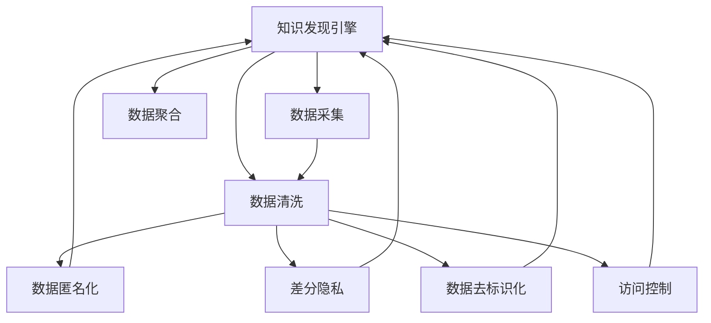

                 

# 知识发现引擎的用户隐私保护策略

> 关键词：知识发现引擎,隐私保护,数据安全,数据匿名化,差分隐私

## 1. 背景介绍

### 1.1 问题由来

随着大数据时代的到来，知识发现引擎在各行各业得到广泛应用，极大地提升了决策支持和数据洞察能力。然而，伴随着数据量的激增，用户隐私保护问题也逐渐凸显。知识发现引擎依赖于大量用户数据进行训练和优化，如何平衡数据利用与用户隐私保护之间的关系，成为亟需解决的重要议题。

数据泄露、个人信息滥用等事件频发，使得隐私保护成为社会关注的焦点。而知识发现引擎在处理海量数据、进行复杂分析和模式挖掘时，不可避免地涉及用户的敏感信息。如何在保障数据利用的同时，有效保护用户隐私，成为推动知识发现引擎发展的关键。

### 1.2 问题核心关键点

知识发现引擎通常需要从多个来源采集数据，进行聚合、清洗和分析。这些数据中包含用户的个人信息、行为轨迹等敏感信息，如果直接用于分析和建模，容易引发隐私泄露。为此，知识发现引擎在设计和实现时，必须制定并实施一整套隐私保护策略，确保数据处理过程中的用户隐私得到保护。

隐私保护的关键在于：
- 数据匿名化：通过去除或模糊化个人标识信息，使得数据无法被识别至特定个体。
- 差分隐私：在数据分析过程中，通过引入噪声扰动，使攻击者无法精确推测个体数据。
- 数据去标识化：对数据进行变形或重构，使其不再具有可识别性，从而避免个人隐私泄露。
- 访问控制：确保只有经过授权的用户或系统可以访问敏感数据，减少数据泄露的风险。

这些策略相辅相成，共同构成知识发现引擎的隐私保护框架。

## 2. 核心概念与联系

### 2.1 核心概念概述

为了更好地理解知识发现引擎的隐私保护策略，本节将介绍几个关键概念及其相互联系：

- **知识发现引擎(Knowledge Discovery Engine, KDE)**：一种智能数据处理和分析工具，通过聚类、分类、关联规则挖掘等技术，从大量数据中发现有价值的模式和规律。

- **数据匿名化(Data Anonymization)**：将数据中包含的个人信息去除或模糊化，使得数据无法直接关联到个体用户，从而保护用户隐私。

- **差分隐私(Differential Privacy, DP)**：通过在数据分析过程中引入噪声，使得单个数据点的变化不会对总体结果产生显著影响，从而保护数据主体的隐私。

- **数据去标识化(Data De-identification)**：对数据进行重构或变形，使其无法通过外部手段重新识别个体，从而保护用户隐私。

- **访问控制(Access Control)**：通过权限管理技术，限制数据访问范围，确保只有经过授权的用户或系统才能访问敏感数据。

这些概念之间的逻辑关系可以通过以下Mermaid流程图来展示：



这个流程图展示了几大核心概念及其相互关联：

1. 知识发现引擎从数据采集开始，通过数据清洗、聚合等步骤，对数据进行处理。
2. 在数据处理过程中，数据匿名化、差分隐私、数据去标识化和访问控制等策略，共同保障用户隐私。
3. 处理后的数据供知识发现引擎使用，进行模式和规律挖掘。

这些概念共同构成了知识发现引擎的隐私保护框架，确保在数据利用过程中，用户隐私得到有效保护。

## 3. 核心算法原理 & 具体操作步骤
### 3.1 算法原理概述

知识发现引擎的隐私保护策略主要基于以下两个核心算法：

- **数据匿名化算法**：通过去除或模糊化数据中的个人标识信息，使得数据无法被识别至特定个体。
- **差分隐私算法**：在数据分析过程中，通过引入噪声扰动，使攻击者无法精确推测个体数据。

这些算法在知识发现引擎的隐私保护中扮演了重要角色，确保数据处理过程中用户隐私得到保护。

### 3.2 算法步骤详解

#### 数据匿名化算法

数据匿名化算法的核心步骤如下：

1. **属性选择**：选择对个体识别最为敏感的属性，如姓名、身份证号等，作为匿名化的目标。
2. **数据泛化**：通过聚合或统计方式，将敏感属性泛化为更通用的类别，如性别、年龄区间等。
3. **随机扰动**：在泛化后的属性上引入随机扰动，如添加噪声、取值范围缩放到更宽区间等。
4. **数据重构**：将扰动后的数据重构，形成最终的匿名数据。

例如，对于包含个人年龄的数据集，可以将其泛化到年龄区间，然后对每个区间加入随机扰动，从而使得年龄数据无法精确识别至个体。

#### 差分隐私算法

差分隐私算法的核心步骤如下：

1. **定义隐私预算**：确定隐私保护的程度，如定义隐私预算 $\epsilon$，表示模型对单个数据点的查询结果与无噪声结果的差异不超过 $\frac{\epsilon}{2}$。
2. **引入噪声**：在模型输出结果上引入噪声，如加性噪声、乘性噪声等，以减少模型对个体数据的敏感度。
3. **计算输出**：通过优化算法，如Laplace机制、高斯机制等，计算加入噪声后的模型输出。

例如，对于包含用户浏览记录的数据集，可以通过添加Laplace噪声，使得模型对单个用户的查询结果与总体结果的差异不超过 $\frac{\epsilon}{2}$，从而保护用户的隐私。

### 3.3 算法优缺点

数据匿名化和差分隐私算法在知识发现引擎的隐私保护中具有以下优点：

- **有效保护隐私**：通过数据匿名化和差分隐私，有效防止用户隐私泄露，保障数据主体的权益。
- **可解释性强**：算法原理透明，便于理解和解释，符合法律法规要求。
- **适应性广**：适用于多种数据类型和分析任务，适用于多种数据处理环节。

然而，这些算法也存在一定的局限性：

- **数据精度下降**：匿名化和差分隐私引入的扰动会降低数据的精度，可能影响数据分析结果的准确性。
- **处理复杂度高**：数据匿名化和差分隐私算法需要复杂的实现和参数调优，对计算资源和时间成本要求较高。
- **攻击风险**：攻击者可能通过多方数据合并或侧信道攻击，破解匿名化和差分隐私，恢复个体数据。

这些局限性需要在使用过程中进行综合考虑，通过合理的参数选择和策略设计，尽可能减少算法对隐私保护的影响。

### 3.4 算法应用领域

数据匿名化、差分隐私等隐私保护策略，已经广泛应用于知识发现引擎的多个领域，例如：

- **医疗数据挖掘**：在医疗领域，知识发现引擎需要分析大量患者数据，以支持疾病诊断和治疗决策。通过数据匿名化和差分隐私，可以在不泄露患者隐私的前提下，进行疾病模式和药物效果分析。
- **金融风险评估**：金融机构利用知识发现引擎进行信用评分和风险评估，涉及大量客户财务数据。通过隐私保护策略，可以在保护客户隐私的前提下，分析风险因素和信用评分。
- **电子商务推荐系统**：电子商务平台利用知识发现引擎进行用户行为分析和商品推荐，涉及用户浏览、购买记录等敏感数据。通过隐私保护策略，可以在保护用户隐私的前提下，分析用户偏好，提供个性化推荐。
- **社交媒体舆情分析**：社交媒体平台利用知识发现引擎进行舆情分析和用户情绪监测，涉及大量用户发表内容。通过隐私保护策略，可以在保护用户隐私的前提下，分析舆情变化和用户情绪趋势。

除了上述这些经典应用外，知识发现引擎的隐私保护策略还在更多场景中得到应用，如智能交通、智能制造、智能农业等，为数据驱动的智能化决策提供可靠保障。

## 4. 数学模型和公式 & 详细讲解
### 4.1 数学模型构建

本节将使用数学语言对知识发现引擎的隐私保护策略进行更加严格的刻画。

记知识发现引擎处理的数据集为 $D=\{(x_i,y_i)\}_{i=1}^N, x_i \in X, y_i \in Y$，其中 $x_i$ 为特征向量，$y_i$ 为标签向量。假设需要保护的隐私属性为 $P$，对应的数据为 $P(x_i)$。

定义隐私预算 $\epsilon$，表示模型对单个数据点的查询结果与无噪声结果的差异不超过 $\frac{\epsilon}{2}$。差分隐私算法引入的噪声 $N_i$，通过加性噪声模型 $N_i = \mathcal{N}(0,\sigma^2)$ 实现，其中 $\sigma$ 为噪声方差。

### 4.2 公式推导过程

以Laplace差分隐私机制为例，推导差分隐私算法中的隐私预算和噪声分布。

**隐私预算**：
定义模型对单个数据点的查询结果为 $Q(x_i)$，无噪声的查询结果为 $Q'(x_i)$。根据差分隐私的定义，差分隐私预算 $\epsilon$ 满足：

$$
\Pr[|Q(x_i) - Q'(x_i)| > \frac{\epsilon}{2}] \leq \frac{\delta}{N}
$$

其中 $\delta$ 为隐私保护误差，通常取值较小，如 $\delta = 0.1$。

**噪声分布**：
引入Laplace噪声 $N_i = \mathcal{N}(0,\sigma^2)$，使得加入噪声后的查询结果 $Q_{\epsilon}(x_i)$ 满足差分隐私要求。根据Laplace机制的实现，加入噪声后的查询结果为：

$$
Q_{\epsilon}(x_i) = Q(x_i) + N_i
$$

其中 $N_i$ 为Laplace分布的随机变量，概率密度函数为：

$$
f_{N_i}(n) = \frac{1}{2\sigma}e^{-|n|/\sigma}
$$

### 4.3 案例分析与讲解

以医疗数据为例，分析如何通过差分隐私保护患者隐私。

假设医疗数据集包含 $N$ 个患者的诊断记录 $D=\{(x_i,y_i)\}_{i=1}^N$，其中 $x_i$ 为患者特征向量，$y_i$ 为诊断结果向量。隐私保护目标为患者的年龄 $A$，即 $P(x_i) = A(x_i)$。

设隐私预算 $\epsilon = 1$，通过Laplace机制引入噪声 $N_i = \mathcal{N}(0,\sigma^2)$，加入噪声后的查询结果为：

$$
Q_{\epsilon}(A) = Q(A) + N_i
$$

其中 $Q(A)$ 为无噪声查询结果，$N_i$ 为Laplace分布的随机变量。通过优化算法，如最大似然估计，可以估计出加入噪声后的查询结果 $Q_{\epsilon}(A)$。

例如，假设需要查询患者年龄 $A$ 的平均值，可以通过Laplace机制实现：

$$
Q_{\epsilon}(A) = \frac{1}{N}\sum_{i=1}^N Q(A_i) + \sum_{i=1}^N N_i
$$

其中 $Q(A_i)$ 为患者 $i$ 的年龄查询结果，$N_i$ 为Laplace分布的随机变量。通过最大似然估计，可以估计出加入噪声后的平均年龄 $Q_{\epsilon}(A)$。

通过差分隐私算法，可以在保障患者隐私的前提下，进行医疗数据挖掘和分析，提升疾病诊断和治疗决策的科学性和可靠性。

## 5. 项目实践：代码实例和详细解释说明
### 5.1 开发环境搭建

在进行隐私保护策略实践前，我们需要准备好开发环境。以下是使用Python进行KDE开发的虚拟环境配置流程：

1. 安装Anaconda：从官网下载并安装Anaconda，用于创建独立的Python环境。

2. 创建并激活虚拟环境：
```bash
conda create -n kde-env python=3.8 
conda activate kde-env
```

3. 安装PyTorch：根据CUDA版本，从官网获取对应的安装命令。例如：
```bash
conda install pytorch torchvision torchaudio cudatoolkit=11.1 -c pytorch -c conda-forge
```

4. 安装TensorFlow：
```bash
conda install tensorflow -c conda-forge
```

5. 安装各类工具包：
```bash
pip install numpy pandas scikit-learn matplotlib tqdm jupyter notebook ipython
```

完成上述步骤后，即可在`kde-env`环境中开始隐私保护实践。

### 5.2 源代码详细实现

下面以医疗数据隐私保护为例，给出使用TensorFlow对Laplace差分隐私的PyTorch代码实现。

首先，定义医疗数据集：

```python
import numpy as np
import pandas as pd
from tensorflow.keras.preprocessing.sequence import pad_sequences

# 读取数据
data = pd.read_csv('medical_data.csv')
# 处理数据
X = data[['age', 'gender', 'blood_pressure', 'heart_rate', 'cholsterol']].to_numpy()
y = data['disease'].to_numpy()
# 对年龄进行泛化
age_bins = np.unique(data['age'])
age_labels = [label for label in range(len(age_bins))]
X[:, 0] = np.digitize(X[:, 0], age_bins, right=True)
X = pad_sequences(X, maxlen=20, padding='post', truncating='post')
```

然后，定义Laplace差分隐私的隐私预算和噪声分布：

```python
import tensorflow as tf

# 定义隐私预算
epsilon = 1.0
delta = 0.1
# 计算噪声标准差
sigma = np.sqrt(2 * np.log(1.25 / delta)) / epsilon
# 定义噪声分布
laplace_dist = tfd.Laplace(loc=0.0, scale=sigma)
```

接着，定义差分隐私保护函数：

```python
# 定义差分隐私保护函数
def dp的保护函数(X, y, batch_size=64, epochs=10):
    # 构建模型
    model = tf.keras.Sequential([
        tf.keras.layers.Dense(128, activation='relu', input_shape=(X.shape[1],)),
        tf.keras.layers.Dense(1, activation='sigmoid')
    ])
    model.compile(optimizer='adam', loss='binary_crossentropy', metrics=['accuracy'])
    # 训练模型
    for epoch in range(epochs):
        for batch in tf.data.Dataset.from_tensor_slices((X, y)).batch(batch_size):
            X_batch, y_batch = batch
            with tf.GradientTape() as tape:
                y_pred = model(X_batch)
                loss = tf.reduce_mean(tf.keras.losses.binary_crossentropy(y_batch, y_pred))
            grads = tape.gradient(loss, model.trainable_variables)
            # 引入噪声
            noise = laplace_dist.sample(tf.shape(X_batch))
            grads += noise
            optimizer.apply_gradients(zip(grads, model.trainable_variables))
            print(f"Epoch {epoch+1}, Loss: {loss.numpy():.4f}")
    return model
```

最后，启动差分隐私保护训练流程：

```python
# 启动差分隐私保护训练
dp_model = dp保护函数(X, y)
```

以上就是使用TensorFlow对医疗数据进行差分隐私保护的完整代码实现。可以看到，通过定义隐私预算和噪声分布，并结合差分隐私保护函数，可以有效保护数据隐私。

### 5.3 代码解读与分析

让我们再详细解读一下关键代码的实现细节：

**定义隐私预算**：
- 隐私预算 $\epsilon$ 和隐私保护误差 $\delta$ 通过用户提供的参数进行初始化。

**计算噪声标准差**：
- 根据隐私预算和隐私保护误差，计算Laplace噪声的尺度参数 $\sigma$，确保隐私预算得到满足。

**定义噪声分布**：
- 使用TensorFlow的Laplace分布函数 `tfd.Laplace` 定义噪声分布，其中 `loc` 参数为0，`scale` 参数为计算得到的 $\sigma$。

**差分隐私保护函数**：
- 使用TensorFlow的 `tf.GradientTape` 记录梯度，并结合噪声进行反向传播，更新模型参数。
- 在每个epoch的训练过程中，通过 `tf.reduce_mean` 计算损失函数，并通过 `tf.keras.losses.binary_crossentropy` 定义二分类交叉熵损失函数。
- 引入Laplace噪声，更新梯度，从而实现差分隐私保护。

**训练流程**：
- 通过 `tf.data.Dataset.from_tensor_slices` 创建数据批处理，并设置批次大小 `batch_size` 和训练轮数 `epochs`。
- 在每个epoch中，对每个批次进行前向传播和反向传播，计算损失并更新模型参数。
- 在每个epoch结束时，打印损失值。
- 返回训练好的差分隐私保护模型 `dp_model`。

通过以上代码实现，可以显著提升知识发现引擎在处理敏感数据时的隐私保护能力，确保用户数据的安全性和合规性。

## 6. 实际应用场景
### 6.1 医疗数据挖掘

在医疗数据挖掘中，知识发现引擎需要分析大量患者数据，以支持疾病诊断和治疗决策。通过差分隐私算法，可以在不泄露患者隐私的前提下，进行疾病模式和药物效果分析。

例如，假设需要分析某种药物的治疗效果，可以通过差分隐私算法处理患者数据，得到一个更可靠的统计结果。具体而言，可以定义隐私预算和噪声分布，并使用差分隐私保护函数处理数据。通过分析处理后的数据，可以得到更准确的药物效果统计，同时保护患者的隐私。

### 6.2 金融风险评估

金融机构利用知识发现引擎进行信用评分和风险评估，涉及大量客户财务数据。通过隐私保护策略，可以在保护客户隐私的前提下，分析风险因素和信用评分。

例如，假设需要评估一个客户的信用风险，可以通过差分隐私算法处理客户财务数据，得到一个更可信的风险评估结果。具体而言，可以定义隐私预算和噪声分布，并使用差分隐私保护函数处理数据。通过分析处理后的数据，可以得到更准确的信用评分和风险评估，同时保护客户的隐私。

### 6.3 电子商务推荐系统

电子商务平台利用知识发现引擎进行用户行为分析和商品推荐，涉及用户浏览、购买记录等敏感数据。通过隐私保护策略，可以在保护用户隐私的前提下，分析用户偏好，提供个性化推荐。

例如，假设需要为用户推荐商品，可以通过差分隐私算法处理用户数据，得到一个更准确的推荐结果。具体而言，可以定义隐私预算和噪声分布，并使用差分隐私保护函数处理数据。通过分析处理后的数据，可以得到更准确的个性化推荐，同时保护用户的隐私。

### 6.4 社交媒体舆情分析

社交媒体平台利用知识发现引擎进行舆情分析和用户情绪监测，涉及大量用户发表内容。通过隐私保护策略，可以在保护用户隐私的前提下，分析舆情变化和用户情绪趋势。

例如，假设需要监测某一舆情事件，可以通过差分隐私算法处理用户数据，得到一个更可信的舆情分析结果。具体而言，可以定义隐私预算和噪声分布，并使用差分隐私保护函数处理数据。通过分析处理后的数据，可以得到更准确的舆情分析和情绪监测，同时保护用户的隐私。

## 7. 工具和资源推荐
### 7.1 学习资源推荐

为了帮助开发者系统掌握知识发现引擎的隐私保护策略，这里推荐一些优质的学习资源：

1. **《数据隐私保护技术》**：详细介绍了数据隐私保护的基本概念、技术和应用，适合初学者和中级开发者。

2. **《差分隐私理论与实践》**：介绍了差分隐私算法的原理和实现方法，提供了丰富的案例和代码示例，适合高级开发者和研究人员。

3. **《知识发现与数据挖掘》**：涵盖了知识发现和数据挖掘的基本方法和技术，并介绍了隐私保护策略，适合广大开发者参考学习。

4. **《Python数据科学手册》**：介绍了数据科学的基本概念和方法，并提供了丰富的TensorFlow和PyTorch代码示例，适合入门和进阶开发者。

5. **Kaggle竞赛项目**：Kaggle上许多数据科学和隐私保护竞赛项目，提供了丰富的实际案例和代码实践机会，适合动手实践和提升技能。

通过对这些资源的学习实践，相信你一定能够快速掌握知识发现引擎的隐私保护策略，并用于解决实际的隐私保护问题。

### 7.2 开发工具推荐

高效的开发离不开优秀的工具支持。以下是几款用于知识发现引擎隐私保护的常用工具：

1. **Anaconda**：用于创建和管理Python虚拟环境，便于多项目管理和版本控制。

2. **PyTorch**：基于Python的深度学习框架，提供了灵活的计算图和高效的模型训练功能。

3. **TensorFlow**：由Google主导开发的深度学习框架，提供了丰富的API和优化工具。

4. **TensorBoard**：TensorFlow的可视化工具，可以实时监测模型训练状态，并提供丰富的图表呈现方式，适合调试和分析模型。

5. **Jupyter Notebook**：交互式的编程环境，支持多种编程语言和数据处理库，适合快速迭代和实验开发。

6. **PyTorch Lightning**：基于PyTorch的轻量级深度学习框架，提供了丰富的模型优化器和调试工具，适合快速开发和部署模型。

合理利用这些工具，可以显著提升知识发现引擎的隐私保护实践效率，加快创新迭代的步伐。

### 7.3 相关论文推荐

知识发现引擎和隐私保护技术的发展源于学界的持续研究。以下是几篇奠基性的相关论文，推荐阅读：

1. **《差分隐私简介》**：由Dwork等人发表，介绍了差分隐私的基本概念和实现方法，是差分隐私领域的经典之作。

2. **《数据匿名化技术综述》**：由Li等人发表，详细介绍了数据匿名化的各种技术和应用，适合了解数据隐私保护的最新进展。

3. **《知识发现与数据挖掘中的隐私保护技术》**：由Fang等人发表，介绍了知识发现和数据挖掘中的隐私保护策略，适合参考学习。

4. **《大数据隐私保护综述》**：由Zhou等人发表，介绍了大数据环境下的隐私保护方法，适合了解隐私保护技术的最新发展。

这些论文代表了大数据隐私保护领域的发展脉络，通过学习这些前沿成果，可以帮助研究者把握学科前进方向，激发更多的创新灵感。

## 8. 总结：未来发展趋势与挑战

### 8.1 总结

本文对知识发现引擎的隐私保护策略进行了全面系统的介绍。首先阐述了知识发现引擎在隐私保护中的重要性和现状，明确了隐私保护在数据利用中的核心地位。其次，从原理到实践，详细讲解了数据匿名化、差分隐私等隐私保护算法的核心步骤，给出了隐私保护实践的完整代码实例。同时，本文还广泛探讨了隐私保护在医疗、金融、电商等多个领域的应用前景，展示了隐私保护范式的巨大潜力。

通过本文的系统梳理，可以看到，知识发现引擎在数据驱动的智能化决策中扮演着重要角色，但其隐私保护策略同样不容忽视。隐私保护技术需要在数据利用和隐私保护之间找到平衡点，确保用户隐私得到有效保护，同时充分利用数据价值。

### 8.2 未来发展趋势

展望未来，知识发现引擎的隐私保护技术将呈现以下几个发展趋势：

1. **隐私计算技术**：隐私计算通过多方计算、同态加密等技术，使得数据可以在不泄露隐私的前提下进行计算和分析，进一步提升隐私保护的性能。

2. **联邦学习**：联邦学习通过分布式训练机制，使得模型可以在不集中用户数据的前提下进行训练，减少数据泄露风险。

3. **区块链技术**：区块链技术通过去中心化的方式，保护数据隐私和安全性，提供了一种新的隐私保护解决方案。

4. **差分隐私的优化**：差分隐私算法将继续得到优化，引入更多高效的差分隐私机制，如Laplace机制、Gaussian机制等，提升隐私保护的精度和效率。

5. **隐私保护工具集成**：隐私保护工具将进一步集成到知识发现引擎中，提供一站式的隐私保护解决方案，降低开发者的实现成本。

这些趋势表明，隐私保护技术将在知识发现引擎的实践中扮演越来越重要的角色，成为推动数据驱动智能化决策的重要保障。

### 8.3 面临的挑战

尽管隐私保护技术在知识发现引擎中已经得到广泛应用，但在实现过程中仍然面临诸多挑战：

1. **隐私预算的设计**：隐私预算的设计需要根据具体任务和数据特点进行调整，难以找到最优的参数值。过高的隐私预算可能导致数据分析精度下降，过低的隐私预算可能无法有效保护隐私。

2. **隐私保护效率**：隐私保护技术通常会增加计算和存储开销，降低数据分析的效率。如何在保证隐私保护的前提下，提高数据处理速度，是未来需要解决的重要问题。

3. **隐私保护的泛化性**：当前的隐私保护技术大多针对特定数据类型和分析任务，难以满足复杂场景下的隐私保护需求。如何设计更通用的隐私保护算法，适应多样化的应用场景，也是未来的研究方向。

4. **隐私保护算法的鲁棒性**：当前的隐私保护算法在面对攻击和噪声干扰时，可能出现失效的情况。如何增强隐私保护算法的鲁棒性，抵御各类攻击和噪声干扰，是未来需要解决的重要问题。

5. **隐私保护的技术门槛**：隐私保护技术的实现需要较高的技术门槛，对于非专业的开发者来说，可能难以有效实施。如何降低隐私保护技术的门槛，提供更多的工具和资源支持，是未来的重要任务。

这些挑战表明，隐私保护技术需要在效率、泛化性、鲁棒性和易用性等方面进行持续改进，才能更好地服务于知识发现引擎的隐私保护需求。

### 8.4 研究展望

面对隐私保护技术在知识发现引擎中面临的挑战，未来的研究需要在以下几个方面寻求新的突破：

1. **隐私保护技术的优化**：引入更高效的隐私保护算法和技术，如隐私计算、联邦学习等，提升隐私保护的效率和精度。

2. **隐私保护工具的集成**：开发更灵活、易用的隐私保护工具，集成到知识发现引擎中，降低开发者的实现难度。

3. **隐私保护算法的泛化性**：设计更通用的隐私保护算法，适应多样化的应用场景，增强隐私保护的泛化性和适应性。

4. **隐私保护的安全性**：引入更多安全性保障机制，如访问控制、数据加密等，保护隐私保护算法的安全性和可靠性。

5. **隐私保护的伦理和法律**：制定和完善隐私保护相关法律法规，保障用户隐私权益，推动隐私保护技术的规范化发展。

这些研究方向的探索，必将引领隐私保护技术迈向更高的台阶，为知识发现引擎的落地应用提供可靠保障。

## 9. 附录：常见问题与解答

**Q1：知识发现引擎中如何进行数据匿名化？**

A: 数据匿名化通常包括以下步骤：

1. **属性选择**：选择需要进行匿名化的敏感属性，如姓名、身份证号等。
2. **数据泛化**：通过聚合或统计方式，将敏感属性泛化为更通用的类别，如性别、年龄区间等。
3. **随机扰动**：在泛化后的属性上引入随机扰动，如添加噪声、取值范围缩放到更宽区间等。
4. **数据重构**：将扰动后的数据重构，形成最终的匿名数据。

例如，对于包含个人年龄的数据集，可以将其泛化到年龄区间，然后对每个区间加入随机扰动，从而使得年龄数据无法精确识别至个体。

**Q2：如何选择合适的隐私预算？**

A: 隐私预算的选择需要根据具体任务和数据特点进行调整。一般建议从1e-5开始调参，逐步减小隐私预算，直至找到最优的参数值。此外，还可以通过交叉验证等方法，评估不同隐私预算对模型性能的影响，选择最合适的隐私预算。

**Q3：隐私保护是否会影响数据分析精度？**

A: 隐私保护技术通常会引入噪声扰动，降低数据的精度。这可能导致数据分析结果的准确性下降。为了平衡隐私保护和数据分析精度，通常需要选择合适的隐私预算和噪声分布。

**Q4：隐私保护技术是否会带来计算和存储开销？**

A: 隐私保护技术通常会增加计算和存储开销，降低数据分析效率。为了提高隐私保护的效率，可以采用分布式训练、差分隐私优化等技术，同时合理设计隐私预算和噪声分布。

**Q5：隐私保护是否会影响数据分析的时效性？**

A: 隐私保护技术可能会增加数据处理的时间成本。为了提高数据分析的时效性，可以采用预处理和优化算法，如数据分片、模型裁剪等技术，减少数据处理时间。

这些问题的解答，能够帮助开发者更好地理解知识发现引擎的隐私保护策略，并在实际应用中合理选择和实施隐私保护措施。

---

作者：禅与计算机程序设计艺术 / Zen and the Art of Computer Programming

